import React from 'react';
import CodeBlock from '../../../../components/ui/CodeBlock';
import Callout from '../../../../components/ui/Callout';

<div className="article-header">
  <div className="breadcrumb">
    <a href="/">Curated Notes</a>
    <span className="breadcrumb-separator">›</span>
    <span className="breadcrumb-current">How Java Works</span>
  </div>
  <h1>How Java Works</h1>
  <p style={{ color: 'var(--text-muted)', fontSize: '1.1rem', marginBottom: '16px', lineHeight: '1.6' }}>
    Master the essentials of How Java Works in this curated guide.
  </p>
  <div className="meta-info">
    <span className="meta-item">
      <svg width="14" height="14" viewBox="0 0 24 24" fill="none" stroke="currentColor" strokeWidth="2"><circle cx="12" cy="12" r="10"/><polyline points="12 6 12 12 16 14"/></svg>
      10 min read
    </span>
    <span className="difficulty-badge difficulty-badge--intermediate">Intermediate</span>
  </div>
</div>

<section className="content-section">

The earlier chapter introduced `javac HelloShop.java` and `java HelloShop`. This chapter opens up what happens between those two commands. The path traces a single Java source file from the moment it's saved to the moment the CPU runs it, including why the same `.class` file can run on a Mac, a Linux server, and a Windows laptop without any changes.

---

## The Big Picture

Java's execution pipeline has two halves. The first half is at build time: the compiler turns source code into bytecode. The second half is at run time: the JVM loads that bytecode, checks it, and runs it, mixing interpretation and just-in-time compilation as it goes.

The full path from source to CPU:

```mermaid
flowchart LR
    SRC[HelloShop.java<br/>Source code]:::primary
    JAVAC[javac<br/>Front-end compiler]:::orange
    BC[HelloShop.class<br/>Bytecode]:::secondary
    CL[Class Loader]:::teal
    VER[Bytecode Verifier]:::teal
    INT[Interpreter]:::orange
    JIT[JIT Compiler]:::orange
    NAT[Native machine code]:::green
    CPU[CPU]:::red

    SRC --> JAVAC --> BC --> CL --> VER --> INT
    INT -.hot methods.-> JIT
    JIT --> NAT
    INT --> CPU
    NAT --> CPU

    classDef primary fill:#00ceff,stroke:#000,color:#000
    classDef secondary fill:#00ceff,stroke:#000,color:#000
    classDef orange fill:#ffa94d,stroke:#000,color:#000
    classDef teal fill:#38d9a9,stroke:#000,color:#000
    classDef green fill:#69db7c,stroke:#000,color:#000
    classDef red fill:#ff8787,stroke:#000,color:#000
```





The left half (source to `.class`) happens once, at compile time. The right half (everything inside the JVM) happens every time the program runs. The dotted arrow from interpreter to JIT is the key mechanism: bytecode starts running immediately through the interpreter, and methods that run often get promoted to native code in the background.

The example below walks each stage using a small program from earlier.


```java
public class HelloShop {
    public static void main(String[] args) {
        String product = "Wireless Headphones";
        double price = 49.99;
        System.out.println("Welcome! " + product + " is $" + price);
    }
}
```


That output is the end of the pipeline. The walkthrough starts at the beginning.

---

## Step 1: Compilation to Bytecode

Running `javac HelloShop.java` makes the front-end compiler do three things in order:

1. **Parses** the source into a tree of language constructs (classes, methods, expressions).
2. **Type-checks** every expression. A `String` can't be assigned to a `double`, so the compiler catches that here.
3. **Emits bytecode** into `HelloShop.class`.

The output is not machine code. It's bytecode, which is a compact instruction set for an abstract machine called the JVM. Each instruction is one or two bytes (hence the name), and instead of operating on CPU registers, bytecode operates on a per-method **operand stack**: values are pushed onto it, an instruction pops them, computes, and pushes the result back.

The bytecode can be inspected with `javap`, a tool that ships with the JDK. Running `javap -c HelloShop` on the compiled class prints something like this for `main`:


```shell
public static void main(java.lang.String[]);
  Code:
     0: ldc           #7    // String Wireless Headphones
     2: astore_1
     3: ldc2_w        #9    // double 49.99
     6: dstore_2
     7: getstatic     #11   // Field java/lang/System.out:Ljava/io/PrintStream;
    10: new           #17   // class java/lang/StringBuilder
    ...
    35: invokevirtual #29   // Method java/io/PrintStream.println:(Ljava/lang/String;)V
    38: return
```


No need to read this fluently. `ldc` loads a constant onto the stack, `astore_1` stores a reference into a local variable, and `invokevirtual` calls an instance method. These are JVM instructions, not x86 or ARM instructions. The host CPU has no idea what `invokevirtual` means.

Bytecode is portable because it targets a machine that doesn't exist in hardware. Building that abstract machine in software is the JVM's job.

---

## Step 2: Class Loading

The `.class` file sits on disk until `java HelloShop` is run. At that point, the JVM starts up and a component called the **class loader** finds `HelloShop.class`, reads the bytes, and loads them into memory as a `Class` object the runtime can work with.

Class loading is on-demand. The JVM does not eagerly load every class on the classpath at startup. It loads `HelloShop` because it was requested, then loads `String`, `System`, and `PrintStream` the first time the running code references them.

Loaders are arranged in a hierarchy. The bootstrap loader handles core JDK classes like `String` and `Object`. The platform loader handles standard modules. The application loader handles application code and any libraries on the classpath. Each loader delegates to its parent before trying itself, which prevents application code from accidentally replacing built-in classes.

---

## Step 3: Bytecode Verification

Loading a class doesn't mean trusting it. Before the JVM executes a single instruction, the **bytecode verifier** scans the loaded `.class` file and rejects anything that breaks the rules of the platform. It checks that:

- Every instruction has the right number and types of operands on the stack.
- Local variables are not read before they're written.
- Jumps land on valid instruction boundaries, not into the middle of an instruction.
- Access modifiers are respected (no calling a `private` method from another class).
- The file format itself is well-formed and the version is supported by this JVM.

If any check fails, the JVM throws a `VerifyError` and refuses to run the class. This is part of Java's security model: even when a `.class` file comes from a hostile or buggy tool, the JVM will not execute bytecode that could corrupt the runtime.

For a class just compiled with `javac`, verification is invisible. It only matters when bytecode comes from an untrusted source, or when a bug in code generation produces something malformed.

---

## Step 4: Execution (Interpreter + JIT)

Once a class is loaded and verified, the JVM starts running its bytecode. Execution is not one strategy but two working together.

#### The Interpreter Starts First

The **interpreter** walks the bytecode one instruction at a time. For each instruction, it figures out what the instruction means and performs the equivalent action on the JVM's operand stack and local variables. It's straightforward and starts running immediately, with no extra warmup.

The cost is speed. Interpreting an instruction does much more work per step than executing a native CPU instruction. For a program that runs a few lines and exits, this is fine. For anything that loops millions of times, pure interpretation would be slow.

#### The JIT Compiler Kicks In

The **JIT compiler** (just-in-time) solves that problem. While the interpreter runs, the JVM counts how often each method is called and how often each loop body executes. When a method crosses a threshold and becomes a **hot method**, the JIT compiler translates its bytecode into native machine code for the host CPU, in the background, on another thread.

Once the native version is ready, the JVM switches: future calls to that method skip the interpreter and run the native code directly. The interpreter doesn't go away. Cold methods, called only once or twice, keep running interpreted because compiling them would cost more than it saves.

HotSpot, the most widely used JVM and the one shipped with OpenJDK, uses **tiered compilation** with two compilers internally: the **C1** compiler (also called the client compiler) compiles quickly to get methods to native code fast, and the **C2** compiler (the server compiler) takes longer to produce more aggressively optimized code for the hottest methods. A method can start interpreted, get compiled by C1, and later get recompiled by C2 once it proves it deserves the extra effort.

JIT warmup is real. The first few invocations of a hot method run through the interpreter while the JIT decides whether to compile it. Long-running servers suit this model because they pay the warmup cost once and then run fast for hours. Short-lived command-line tools feel the cost more, since they may exit before the JIT finishes optimizing.

---

## Step 5: Garbage Collection (One Paragraph)

While code runs, it creates objects: a `String`, a `StringBuilder`, the array that backs `args`. Each lives on the **heap**, a region of memory the JVM manages. There's no `free` or `delete` call. A background component called the **garbage collector** tracks which objects are still reachable from running code, and periodically reclaims the ones that aren't. The collector pauses application threads briefly during some of its work, which is why GC tuning matters for latency-sensitive systems.

---

## Putting It All Together

The same pipeline in table form, mapped to visible terminal effects:


| Stage              | What Happens                                                                                                  | What You See                                  |
| ------------------ | ------------------------------------------------------------------------------------------------------------- | --------------------------------------------- |
| Compilation        | `javac` parses, type-checks, and writes `.class` bytecode                                                     | `HelloShop.class` appears in the folder       |
| Class Loading      | JVM finds and loads `.class` files on demand, by name                                                         | A short pause when `java` starts              |
| Verification       | Verifier scans the bytecode and rejects unsafe or malformed code                                              | Silent on valid code, `VerifyError` if broken |
| Interpretation     | Interpreter walks bytecode one instruction at a time                                                          | Output begins almost immediately              |
| JIT Compilation    | Background threads compile hot methods to native code                                                         | Throughput climbs after warmup                |
| Garbage Collection | Reclaims unreachable heap objects in the background                                                           | Brief pauses on large heaps                   |


---

## Write Once, Run Anywhere

`HelloShop.class` is a single file. Copy it to a Windows machine, a macOS laptop, and a Linux server. As long as each machine has a compatible JVM installed, `java HelloShop` produces the same output everywhere. No recompiling. No adjustment for the operating system. No rebuild for x86 versus ARM.

The portability comes from splitting the work. Bytecode is universal because it targets the abstract JVM, not any real CPU. The JVM itself is **not** universal. The JDK ships a different binary for Windows, macOS Intel, macOS Apple Silicon, Linux x86_64, Linux ARM, and so on, and each one knows how to translate the same bytecode into the right native instructions for that platform.

This connects two earlier ideas. Java is platform-independent, and the JVM is the runtime that executes bytecode. The platform-independence comes from the bytecode format, and the JVM is the platform-specific piece that makes that bytecode runnable on every operating system Java targets.

---

## A Note on AOT

The pipeline above is the classic Java model: compile to bytecode, then JIT at runtime. A second path has grown in importance for cases where startup time matters.

**Ahead-of-time (AOT) compilation** compiles bytecode straight to native machine code at build time, before the program ever runs. The result is a single native binary that starts almost instantly and uses less memory, with no JIT warmup. The trade-off is that an AOT binary loses some of the runtime profile-driven optimizations the JIT can do, and it's tied to one operating system and CPU architecture, the same way a C++ binary would be.

Modern Java offers several options:

- **GraalVM `native-image`** compiles a whole Java application into a standalone native executable. Common for command-line tools and serverless functions where cold start dominates.
- **Project Leyden** is an in-progress JDK initiative to bring AOT and pre-execution optimizations into the standard JDK with finer control over how much the program is pre-compiled.
- **`jaotc`** was an earlier experimental AOT tool that shipped briefly with the JDK and has since been removed.

AOT doesn't replace the standard JVM model for most production workloads; long-running servers still benefit more from JIT. Its existence explains why "Java" today can mean either "bytecode running on HotSpot" or "a native binary built ahead of time," depending on the project.

</section>
