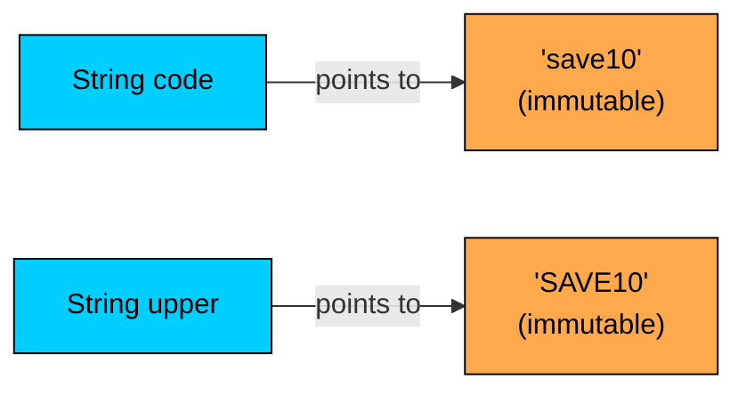
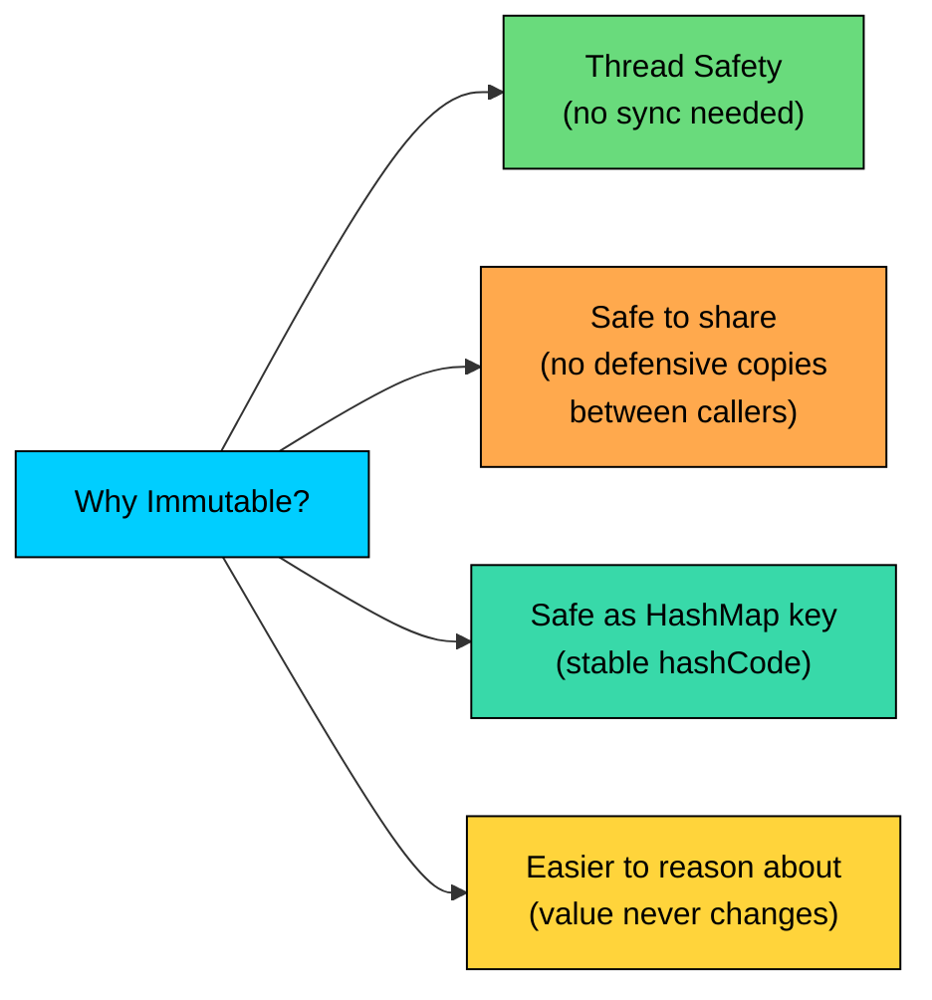

import React from 'react';
import CodeBlock from '../../../../components/ui/CodeBlock';
import Callout from '../../../../components/ui/Callout';

<div className="article-header">
  <div className="breadcrumb">
    <a href="/">Curated Notes</a>
    <span className="breadcrumb-separator">›</span>
    <span className="breadcrumb-current">Immutable Classes</span>
  </div>
  <h1>Immutable Classes</h1>
  <p style={{ color: 'var(--text-muted)', fontSize: '1.1rem', marginBottom: '16px', lineHeight: '1.6' }}>
    Master the essentials of Immutable Classes in this curated guide.
  </p>
  <div className="meta-info">
    <span className="meta-item">
      <svg width="14" height="14" viewBox="0 0 24 24" fill="none" stroke="currentColor" strokeWidth="2"><circle cx="12" cy="12" r="10"/><polyline points="12 6 12 12 16 14"/></svg>
      10 min read
    </span>
    <span className="difficulty-badge difficulty-badge--intermediate">Intermediate</span>
  </div>
</div>

<section className="content-section">

An immutable class is one whose instances can never change after construction. Once you build the object, the state is frozen for life. This lesson covers the full recipe for writing immutable classes in Java, the traps that break immutability even when the code looks correct, and when this property is worth the overhead. Encapsulation as a concept was introduced in the first lesson of this section, and the access modifiers used here (`private`, `final`) were covered in the data-hiding lesson, so we won't re-derive either.

---

## What "Immutable" Really Means

A `Money` object that holds `49.99 USD` should be that exact value from the moment it's created until it's garbage-collected. No method should be able to change the amount. No method should be able to change the currency. Reassigning the variable to a new `Money` value is fine, but the original object stays untouched.


```java
Money price = new Money(49.99, "USD");
Money discounted = price.minus(new Money(5.00, "USD"));

// price still reads 49.99 USD
// discounted reads 44.99 USD
// neither object was mutated; the second is a brand-new instance
```


That last line is the giveaway. With a mutable class, `price.subtract(5.00)` would reach inside the existing object and modify the field. With an immutable class, there is no such method. Operations that "change" the value return a new object instead, leaving the original alone.

The JDK is full of classes built this way. `String` is the canonical one. So are the wrapper types (`Integer`, `Long`, `Double`), the modern date-time types (`LocalDate`, `LocalDateTime`, `Instant`), and `BigDecimal`. Every method that looks like it modifies one of these actually returns a new instance.


```java
public class StringIsImmutable {
    public static void main(String[] args) {
        String code = "save10";
        String upper = code.toUpperCase();

        System.out.println("code:  " + code);
        System.out.println("upper: " + upper);
    }
}
```


The call `code.toUpperCase()` looks like it should change `code`. It doesn't. `String` returns a new `String` containing the upper-cased characters and leaves the original alone. If you discarded the return value, the operation would effectively do nothing visible. This is the signature behavior of an immutable type.





Two variables, two distinct objects, no mutation. The original characters were never touched.

---

## The Immutability Recipe

Making a class immutable is a recipe, not a single keyword. Miss any step and the property breaks. The full list:

1. Mark the class `final` so no subclass can add mutability.
2. Make every instance field `private final`.
3. Don't expose any setters or any other methods that change state.
4. If the constructor accepts a mutable input (an array, a `Date`, a `List`, another mutable object), make a defensive copy and store the copy, not the original reference.
5. If a getter would return a reference to a mutable field, return a defensive copy or an unmodifiable view, not the field itself.
6. Initialize every field in the constructor. After the constructor returns, the object is fully built and frozen.

The first three steps are mechanical. The fourth and fifth are where most bugs hide, because the compiler can't help with them. Each is covered below.

#### Step 1: `final` Class

A subclass can do anything its parent can do plus more. If `Money` is not `final`, someone can write `class MutableMoney extends Money` and add a setter that touches a `protected` field, or simply override methods to behave inconsistently. Marking the class `final` slams that door:


```java
public final class Money {
    // ...
}
```


If your design needs an inheritance hierarchy, there's a softer alternative: make every public constructor private and force construction through a static factory method. That prevents external subclasses while keeping the door open for trusted subclasses within the same package. For a first pass, `final` is simpler and clearer.

#### Step 2: All Fields `private final`


```java
public final class Money {
    private final double amount;
    private final String currency;
    // ...
}
```


`private` keeps the fields invisible from outside. `final` makes them assign-once: the only place they can be written is in the constructor (or in an initializer that runs before the constructor finishes). Once the constructor returns, the field reference cannot be reseated.

`final` on a reference field locks the reference, not the object the reference points to. This is why steps 4 and 5 exist. A `private final List<Item> items` field guarantees the variable always points at the same list, but it does nothing to stop someone from calling `list.add(...)` on that list. Immutability of the field and immutability of the object the field refers to are two different problems.

#### Step 3: No Setters, No Other Mutators

The class exposes getters (read-only access) and methods that return new instances. It exposes nothing that writes to state. This is the easy step to enforce because it's just discipline: don't write the method.

A common temptation is to add a "convenience" setter "just for tests." Don't. Tests can construct new objects. Mutating an immutable object is the bug this recipe prevents.

#### Step 4: Defensive Copies in the Constructor

The constructor accepts inputs from callers. If any input is mutable, storing the original reference means the caller still holds a path to mutate the field after construction.


```java
import java.util.Date;

public final class OrderConfirmation {
    private final String orderId;
    private final Date placedAt;

    // WRONG: stores the caller's Date reference
    public OrderConfirmation(String orderId, Date placedAt) {
        this.orderId = orderId;
        this.placedAt = placedAt;
    }
}
```


The problem with that constructor:


```java
Date when = new Date();
OrderConfirmation order = new OrderConfirmation("ORD-1001", when);
when.setTime(0L);   // mutates the Date inside the OrderConfirmation
```


The caller still owns the `Date` they passed in. They can change it from the outside, and the change shows up inside the `OrderConfirmation` instance. Fix this by copying on the way in:


```java
import java.util.Date;

public final class OrderConfirmation {
    private final String orderId;
    private final Date placedAt;

    public OrderConfirmation(String orderId, Date placedAt) {
        this.orderId = orderId;
        this.placedAt = new Date(placedAt.getTime());  // defensive copy
    }
}
```


Now `OrderConfirmation` holds its own private `Date`. Anything the caller does to their `Date` is irrelevant.

`String` doesn't need this treatment because `String` is itself immutable. There's no way for the caller to mutate it later, so storing the original reference is safe. Defensive copying is only required for mutable inputs.

#### Step 5: Defensive Copies (or Unmodifiable Views) in Getters

This is the mirror image of step 4. If a getter returns a reference to a mutable internal field, the caller can mutate the field through that reference:


```java
import java.util.Date;

public final class OrderConfirmation {
    private final String orderId;
    private final Date placedAt;

    public OrderConfirmation(String orderId, Date placedAt) {
        this.orderId = orderId;
        this.placedAt = new Date(placedAt.getTime());
    }

    public String getOrderId() {
        return orderId;
    }

    // WRONG: hands the caller a reference to our internal Date
    public Date getPlacedAt() {
        return placedAt;
    }
}
```


And the exploit:


```java
OrderConfirmation order = new OrderConfirmation("ORD-1001", new Date());
order.getPlacedAt().setTime(0L);  // mutates our internal Date
```


Fix the getter the same way you fixed the constructor:


```java
public Date getPlacedAt() {
    return new Date(placedAt.getTime());  // defensive copy
}
```


For collections, a second option avoids allocating a full copy: return an unmodifiable view.


```java
import java.util.ArrayList;
import java.util.Collections;
import java.util.List;

public final class ShoppingCart {
    private final List<String> items;

    public ShoppingCart(List<String> items) {
        this.items = new ArrayList<>(items);   // defensive copy on the way in
    }

    public List<String> getItems() {
        return Collections.unmodifiableList(items);  // unmodifiable view on the way out
    }
}
```


`Collections.unmodifiableList(...)` wraps the list in a read-only facade. Any attempt to call `add`, `remove`, or `clear` on the returned list throws `UnsupportedOperationException`. The view doesn't copy the underlying data, so it's cheap. It also stays in sync with the underlying list, which is the desired behavior here because the underlying list itself never changes.

Defensive copies allocate. For small fields (a `Date`, a short array) the cost is negligible. For large collections returned from a frequently called getter, an unmodifiable view is much cheaper than copying on every call.

#### Step 6: Initialize Everything in the Constructor

`final` fields must be assigned exactly once before the constructor returns. There's no two-phase construction: no `init()` method that fills in fields later, no "set this field after the fact." Everything an instance needs is supplied at construction time.

This is mostly a consequence of step 2. `private final` fields can't be reassigned later, so they have to be set during construction. The reason it's called out separately is that deferring initialization ("I'll just leave this null and set it later") immediately breaks the recipe.

---

## Putting the Recipe Together: A `Money` Class

A complete immutable `Money` class that follows every step. Currency is a `String` (immutable, no defensive copy needed). Amount is a `double` (a primitive, no copying possible or needed).


```java
public final class Money {
    private final double amount;
    private final String currency;

    public Money(double amount, String currency) {
        if (amount < 0) {
            throw new IllegalArgumentException("amount cannot be negative");
        }
        if (currency == null || currency.length() != 3) {
            throw new IllegalArgumentException("currency must be a 3-letter code");
        }
        this.amount = amount;
        this.currency = currency;
    }

    public double getAmount() {
        return amount;
    }

    public String getCurrency() {
        return currency;
    }

    public Money plus(Money other) {
        if (!this.currency.equals(other.currency)) {
            throw new IllegalArgumentException("currency mismatch");
        }
        return new Money(this.amount + other.amount, this.currency);
    }

    public Money minus(Money other) {
        if (!this.currency.equals(other.currency)) {
            throw new IllegalArgumentException("currency mismatch");
        }
        return new Money(this.amount - other.amount, this.currency);
    }

    @Override
    public String toString() {
        return amount + " " + currency;
    }
}

public class MoneyDemo {
    public static void main(String[] args) {
        Money price = new Money(49.99, "USD");
        Money couponValue = new Money(5.00, "USD");
        Money finalPrice = price.minus(couponValue);

        System.out.println("price:      " + price);
        System.out.println("coupon:     " + couponValue);
        System.out.println("finalPrice: " + finalPrice);
    }
}
```


Three objects, three values, nothing mutated. `price.minus(couponValue)` reads `price.amount` and `couponValue.amount`, adds them with reversed sign, and constructs a new `Money` to return. The original `Money` objects are unaffected by the call.

The constructor also validates inputs. Immutable objects are a good place to centralize validation because it only needs to happen once, at construction. After that, the object is guaranteed to be in a valid state forever. Mutable objects have to re-validate on every setter call.

---

## A "Looks Immutable but Isn't" Anti-Example

A `ShippingAddress` class that looks correct: the class is `final`, every field is `private final`, and there are no setters. It's still mutable.


```java
import java.util.Date;

public final class ShippingAddress {
    private final String street;
    private final String city;
    private final Date lastVerifiedAt;

    public ShippingAddress(String street, String city, Date lastVerifiedAt) {
        this.street = street;
        this.city = city;
        this.lastVerifiedAt = lastVerifiedAt;   // stores the caller's reference
    }

    public String getStreet() {
        return street;
    }

    public String getCity() {
        return city;
    }

    public Date getLastVerifiedAt() {
        return lastVerifiedAt;                  // hands out the same reference
    }
}

public class BrokenImmutabilityDemo {
    public static void main(String[] args) {
        Date verified = new Date();
        ShippingAddress address = new ShippingAddress("221B Baker St", "London", verified);

        System.out.println("Before: " + address.getLastVerifiedAt());

        verified.setTime(0L);   // caller mutates the Date they kept a reference to
        System.out.println("After:  " + address.getLastVerifiedAt());

        address.getLastVerifiedAt().setTime(1_000_000L);   // mutate through the getter
        System.out.println("Later:  " + address.getLastVerifiedAt());
    }
}
```


**Output (dates will differ; the values change between lines):**


```shell
Before: Wed May 13 12:00:00 UTC 2026
After:  Thu Jan 01 00:00:00 UTC 1970
Later:  Thu Jan 01 00:16:40 UTC 1970
```


The `ShippingAddress` is "immutable" by the textbook checklist, and yet its `lastVerifiedAt` field can be made to take any value at any time, both by the original caller and by anyone who can call the getter. The class fails the definition of immutability: state changed after construction.

Steps 4 and 5 fix this:


```java
import java.util.Date;

public final class ShippingAddress {
    private final String street;
    private final String city;
    private final Date lastVerifiedAt;

    public ShippingAddress(String street, String city, Date lastVerifiedAt) {
        this.street = street;
        this.city = city;
        this.lastVerifiedAt = new Date(lastVerifiedAt.getTime());   // defensive copy in
    }

    public String getStreet() {
        return street;
    }

    public String getCity() {
        return city;
    }

    public Date getLastVerifiedAt() {
        return new Date(lastVerifiedAt.getTime());                  // defensive copy out
    }
}
```


The same demo run against the fixed class produces identical output for all three `println` calls, because the caller's mutations now touch unrelated `Date` objects.

`String` and `int` and `double` didn't need any of this protection. They're already immutable or primitive. The only field that needed defending was the mutable `Date`. The pattern: defensive copies aren't blanket policy, they're specific to fields whose types are mutable.

Modern code can sidestep this entire problem by using `java.time.LocalDateTime` or `java.time.Instant` instead of `java.util.Date`. The `java.time` types from Java 8 are themselves immutable, so storing them directly is safe. The older `Date` example is useful here because it forces a discussion of defensive copies.

---

## The "With-er" Pattern

If a `Money` instance is immutable, how do you "change" the amount? You don't. Construct a new `Money` with the desired value, based on the existing one. The convention for these methods is a name starting with `with`:


```java
public final class Money {
    private final double amount;
    private final String currency;

    public Money(double amount, String currency) {
        this.amount = amount;
        this.currency = currency;
    }

    public Money withAmount(double newAmount) {
        return new Money(newAmount, this.currency);
    }

    public Money withCurrency(String newCurrency) {
        return new Money(this.amount, newCurrency);
    }

    public double getAmount() { return amount; }
    public String getCurrency() { return currency; }

    @Override
    public String toString() { return amount + " " + currency; }
}

public class WithDemo {
    public static void main(String[] args) {
        Money usPrice = new Money(49.99, "USD");
        Money discounted = usPrice.withAmount(39.99);
        Money euPrice = discounted.withCurrency("EUR");

        System.out.println("original:   " + usPrice);
        System.out.println("discounted: " + discounted);
        System.out.println("euPrice:    " + euPrice);
    }
}
```


Each `withX` method returns a new instance that copies all the other fields and changes only the one named in the method. The original instance never moves. These calls chain because each returns a `Money`.

The JDK uses this pattern throughout `java.time`. `LocalDate.now().withYear(2030).withMonth(1)` returns a date with those fields replaced and everything else preserved. The naming is the convention: `withX` returns a copy where X is set to the new value.

Every `withX` call allocates a new object. For small value types like `Money` this is fine. For large objects (a class with twenty fields, several of which are themselves big collections), a chain of five `withX` calls allocates five intermediate instances. The Builder pattern is the usual escape hatch for that case.

---

## Why Bother? The Benefits

Following this recipe isn't free. There's allocation pressure (every modification creates a new object), the API gets more verbose (no more `setX(...)`), and the defensive-copy steps are easy to forget. The benefits:

#### Thread Safety

A mutable object shared across threads needs synchronization. Two threads writing to the same field can produce inconsistent state; one thread reading while another writes can see torn values. Immutable objects sidestep the whole problem: there's nothing to write, so there's nothing to synchronize.

Any number of threads can read the same `Money` instance concurrently with zero locks, zero `volatile`, zero `AtomicReference`. The compiler and the JVM guarantee that fields published as `final` are visible to other threads after the constructor finishes. This is why `String`, `Integer`, and the `java.time` types are safe to share globally without any concurrency machinery.

#### Safe to Share Without Defensive Copies (Externally)

The flip side of the constructor's defensive copy: inside an immutable class, references to fields can be handed out freely as long as the field types are also immutable. There's no way for a caller to mutate a `String`, so `return name` is safe. There's no way to mutate an `Integer`, so `return quantity` is safe. Defensive copying is only at the boundary with mutable types.

Outside the class, if a method receives an immutable object as an argument, no copy is needed. It can be stored directly. The caller can't change it.

#### Usable as `HashMap` Keys

A `HashMap` key's `hashCode` must stay constant for as long as the key is in the map. If a key mutates, its hash changes, and the map can no longer find it.


```java
import java.util.HashMap;
import java.util.Map;

public class MutableKeyTrouble {
    public static void main(String[] args) {
        StringBuilder key = new StringBuilder("SAVE10");
        Map<StringBuilder, Double> coupons = new HashMap<>();
        coupons.put(key, 0.10);

        System.out.println("Before mutation: " + coupons.get(key));

        key.append("X");   // mutate the key

        System.out.println("After mutation:  " + coupons.get(key));
    }
}
```


The second `get` fails because the key's `hashCode` changed after it was placed in the map. The bucket the map looks in is wrong. Immutable keys avoid this entirely. `String` works perfectly as a `HashMap` key because no method on it can change the hash. Any immutable class you write earns the same guarantee.

#### Easier to Reason About

This benefit doesn't show up in a benchmark or a Stack Overflow answer. With a mutable object, determining its current value requires tracing every method call that touched it. With an immutable object, the value at construction is the value forever. The whole class of bugs where state changes unexpectedly disappears.

This is why immutability is the default in functional languages and increasingly common in modern Java code (records, the `java.time` API, the `Stream` operations).





---

## The Costs

The recipe has real costs worth weighing.

#### Allocation Pressure

Every "change" creates a new object. For a `Money` class with two fields, that's cheap: two field copies and a constructor call. For an `Order` class with twenty fields, each `withX` call copies nineteen fields you didn't change. Chained calls compound: `order.withStatus(SHIPPED).withTrackingNumber("TRK1").withShippedAt(now)` produces three intermediate `Order` objects, two of which are immediately discarded.

The garbage collector handles short-lived allocations well, so this isn't usually a problem. But it can become one in a hot loop. If profiling shows millions of intermediate immutable objects per second, the Builder pattern accumulates changes in a mutable builder and produces a single immutable result at the end.

#### Verbosity

The API can feel chatty. Instead of `coupon.setDiscount(0.15)`, the call becomes `coupon = coupon.withDiscount(0.15)`. The assignment is mandatory; forgetting it discards the result. Code that uses many `withX` calls in sequence reads less naturally than the equivalent mutable code, especially for readers used to imperative style.

Records (Java 16+) ease some of the verbosity by generating constructors, getters, `equals`, `hashCode`, and `toString` automatically. They are covered at the end of this lesson.

#### Not Everything Wants to Be Immutable

A `ShoppingCart` whose items change as the user clicks "Add" and "Remove" all day is, by its nature, mutable. Expressing it as immutable means rebuilding the whole cart on every click, which is fine in principle but heavy in practice. Some domain objects have an identity that persists through state changes, and those are bad candidates for immutability.

---

## When to Choose Immutability

The strongest cases:

- **Value objects.** Things defined entirely by their values, with no separate identity. `Money`, `OrderId`, `EmailAddress`, `Coordinate`, `Color`, `Range`. Two `Money(49.99, "USD")` instances are equal because they represent the same value; nobody cares which object it is.
- **DTOs and API payloads.** Objects passed across boundaries (between layers, services, threads). Making them immutable means callers can't accidentally mutate something the producer relied on.
- **Configuration.** A `RetryPolicy` with a maximum attempt count and a delay. You set it up once at startup, then read it from many places. Mutating it later is almost always a bug.
- **Anything shared across threads.** The thread-safety benefit is the strongest argument for immutability.
- **Map keys and `Set` elements.** Anything that needs a stable `hashCode` for the duration of its time in a collection.

#### When Not To

- **Large objects with frequent partial updates.** A 30-field domain entity that the user modifies one field at a time through a UI. Each edit allocating a new instance is technically fine, but a builder approach may fit better.
- **Objects whose identity matters more than their value.** A `User` row from the database has a permanent identity (the primary key), and the same user can change their email or address. Modeling this as immutable means creating a new `User` instance on every edit, which is not always natural.
- **Performance-critical hot paths with profiled allocation pressure.** Don't preemptively avoid immutability for performance. Measure first. Most of the time, the JIT and GC handle short-lived allocations fine.

The default for new value-shaped types should be immutable. Mutability is the special case that needs justification.

---

## A `Coupon` Class: One More Worked Example

Another complete immutable class. A `Coupon` has a code, a discount percentage, and an expiry date. The expiry date is a mutable `Date`, so defensive copying applies again.


```java
import java.util.Date;

public final class Coupon {
    private final String code;
    private final double percentOff;
    private final Date expiresAt;

    public Coupon(String code, double percentOff, Date expiresAt) {
        if (code == null || code.isEmpty()) {
            throw new IllegalArgumentException("code is required");
        }
        if (percentOff < 0 || percentOff > 100) {
            throw new IllegalArgumentException("percentOff must be between 0 and 100");
        }
        this.code = code;
        this.percentOff = percentOff;
        this.expiresAt = new Date(expiresAt.getTime());   // defensive copy in
    }

    public String getCode() {
        return code;
    }

    public double getPercentOff() {
        return percentOff;
    }

    public Date getExpiresAt() {
        return new Date(expiresAt.getTime());             // defensive copy out
    }

    public boolean isExpired(Date now) {
        return now.after(expiresAt);
    }

    public double applyTo(double price) {
        return price * (1 - percentOff / 100);
    }

    public Coupon withPercentOff(double newPercentOff) {
        return new Coupon(this.code, newPercentOff, this.expiresAt);
    }

    @Override
    public String toString() {
        return code + " (" + percentOff + "% off, expires " + expiresAt + ")";
    }
}

public class CouponDemo {
    public static void main(String[] args) {
        Date expiry = new Date(System.currentTimeMillis() + 1_000_000_000L);
        Coupon save10 = new Coupon("SAVE10", 10.0, expiry);

        System.out.println("Original: " + save10);
        System.out.println("$49.99 with coupon: $" + save10.applyTo(49.99));

        Coupon save15 = save10.withPercentOff(15.0);
        System.out.println("Upgraded: " + save15);

        expiry.setTime(0L);                       // try to mutate the caller's Date
        save10.getExpiresAt().setTime(0L);        // try to mutate through the getter
        System.out.println("Still:    " + save10);
    }
}
```


**Output (expiry timestamps will differ):**


```shell
Original: SAVE10 (10.0% off, expires Sun May 24 ...)
$49.99 with coupon: $44.991
Upgraded: SAVE10 (15.0% off, expires Sun May 24 ...)
Still:    SAVE10 (10.0% off, expires Sun May 24 ...)
```


The last two lines are the proof. The caller mutated their own `Date` and the `Date` returned from the getter, and the `Coupon`'s internal state was untouched both times. Every step of the recipe contributes: `final` class, `private final` fields, no setters, defensive copy in, defensive copy out, `withPercentOff` returning a new instance, all initialization done in the constructor.

---

## A Quick Look at Records

Most of the boilerplate in `Money` and `Coupon` is mechanical: same fields, same constructor that assigns them, same getters, same `toString`. Java 16 introduced records to remove the ceremony:


```java
public record Price(double amount, String currency) {}
```


That single line provides a `final` class with two `private final` fields, a canonical constructor, accessors `amount()` and `currency()`, sensible `equals` and `hashCode` based on the field values, and a useful `toString`. For simple value objects with only immutable field types, records are a good fit: less code, fewer ways to break the recipe by accident. They have their own rules: a custom constructor can be added for validation, methods can be added, instance fields beyond the record components are not allowed. Writing the long form remains useful when defensive copies for mutable field types are needed (records don't generate those).

</section>
