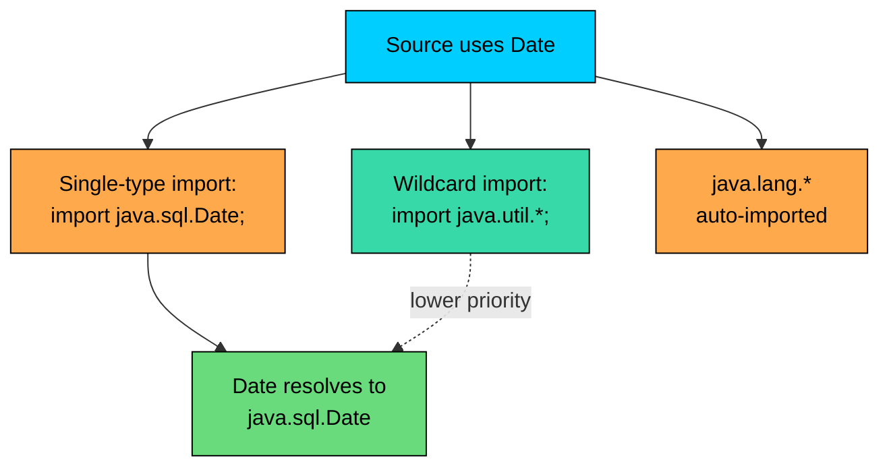
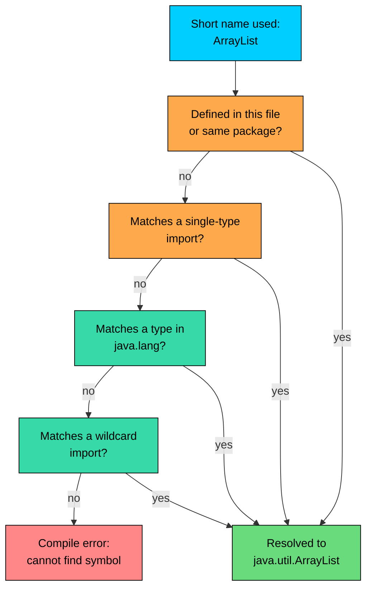

import React from 'react';
import CodeBlock from '../../../../components/ui/CodeBlock';
import Callout from '../../../../components/ui/Callout';

<div className="article-header">
  <div className="breadcrumb">
    <a href="/">Curated Notes</a>
    <span className="breadcrumb-separator">›</span>
    <span className="breadcrumb-current">import Statement</span>
  </div>
  <h1>import Statement</h1>
  <p style={{ color: 'var(--text-muted)', fontSize: '1.1rem', marginBottom: '16px', lineHeight: '1.6' }}>
    Master the essentials of import Statement in this curated guide.
  </p>
  <div className="meta-info">
    <span className="meta-item">
      <svg width="14" height="14" viewBox="0 0 24 24" fill="none" stroke="currentColor" strokeWidth="2"><circle cx="12" cy="12" r="10"/><polyline points="12 6 12 12 16 14"/></svg>
      10 min read
    </span>
    <span className="difficulty-badge difficulty-badge--intermediate">Intermediate</span>
  </div>
</div>

<section className="content-section">

The previous lesson covered packages, which group related classes into namespaces with names like `com.shop.checkout` or `java.util`. Putting classes into packages solves the naming-collision problem at the cost of long, ceremonial names everywhere they're used. The `import` statement is what lets you write `ArrayList` instead of `java.util.ArrayList` in every line of your file. This lesson covers single-type imports, on-demand (wildcard) imports, how `java.lang` is special, name conflicts and how to resolve them, and what `import` does and doesn't do internally.

---

## The Problem Imports Solve

Suppose a shopping cart class uses `ArrayList`, `HashMap`, and `List` from the `java.util` package. Without any imports, every reference to those types has to spell out the full package path. The result reads like a paperwork form.


```java
public class ShoppingCart {
    private java.util.List<String> items = new java.util.ArrayList<>();
    private java.util.Map<String, Integer> quantities = new java.util.HashMap<>();

    public void addItem(String item, int quantity) {
        items.add(item);
        quantities.put(item, quantity);
    }

    public static void main(String[] args) {
        ShoppingCart cart = new ShoppingCart();
        cart.addItem("Wireless Mouse", 1);
        cart.addItem("USB Cable", 2);

        System.out.println("Items: " + cart.items);
        System.out.println("Quantities: " + cart.quantities);
    }
}
```


The code compiles and runs. It's also hard to read. The fully-qualified names take up so much horizontal space that the actual logic gets lost in the prefix. Every time the class needs another `java.util` type, the same `java.util.` is glued to the front. In a 200-line file, that prefix shows up dozens of times for no real benefit; the meaning of `ArrayList` is already clear from context.

The `import` statement is Java's answer. Declare which types to use by their short names at the top of the file, and the compiler treats every short-name reference in the rest of the file as if it were fully qualified.


```java
import java.util.ArrayList;
import java.util.HashMap;
import java.util.List;
import java.util.Map;

public class ShoppingCart {
    private List<String> items = new ArrayList<>();
    private Map<String, Integer> quantities = new HashMap<>();

    public void addItem(String item, int quantity) {
        items.add(item);
        quantities.put(item, quantity);
    }

    public static void main(String[] args) {
        ShoppingCart cart = new ShoppingCart();
        cart.addItem("Wireless Mouse", 1);
        cart.addItem("USB Cable", 2);

        System.out.println("Items: " + cart.items);
        System.out.println("Quantities: " + cart.quantities);
    }
}
```


The behavior is identical. The class body got shorter and clearer. The four `import` lines at the top tell the compiler, "when this file says `ArrayList`, that means `java.util.ArrayList`." Everywhere below, the short name works.

This is the central trade. Fully-qualified names are explicit but heavy. Short names with imports are clean but require a small declaration up top to disambiguate them. In practice, Java code uses imports almost everywhere and reserves fully-qualified names for a few specific situations covered later in the lesson.

---

## Single-Type Imports

The most common form of `import` brings in one class or interface by name. The shape is `import` followed by the fully-qualified type name followed by a semicolon.


```java
import java.util.ArrayList;
import java.time.LocalDate;
import java.math.BigDecimal;
```


Each line imports exactly one type. After those three lines, `ArrayList`, `LocalDate`, and `BigDecimal` can be used as short names anywhere in the file. Other types in the same packages (like `HashMap` from `java.util` or `LocalTime` from `java.time`) are not affected; if the file needs them, it needs separate import lines for them too.


```java
import java.util.ArrayList;
import java.math.BigDecimal;

public class CartTotal {
    public static void main(String[] args) {
        ArrayList<BigDecimal> itemPrices = new ArrayList<>();
        itemPrices.add(new BigDecimal("19.99"));
        itemPrices.add(new BigDecimal("4.50"));
        itemPrices.add(new BigDecimal("12.00"));

        BigDecimal total = BigDecimal.ZERO;
        for (BigDecimal price : itemPrices) {
            total = total.add(price);
        }

        System.out.println("Item prices: " + itemPrices);
        System.out.println("Total: $" + total);
    }
}
```


The file imports exactly two types and uses both throughout the class. Single-type imports are the default style most teams prefer, because each import line documents one external dependency the file pulls in. Reading the imports tells a future maintainer which classes the file relies on without scanning every method body.

A single-type import is a compile-time instruction only. The Java runtime doesn't see imports at all; we return to that point below.

---

## On-Demand (Wildcard) Imports

Java also supports a wildcard form that imports every public type from a package in one line. The wildcard character is `*`.


```java
import java.util.*;
```


That single line makes `ArrayList`, `HashMap`, `LinkedList`, `List`, `Map`, `Set`, `Queue`, and every other public type directly inside `java.util` available by short name. It does the same job as listing each one individually with `import java.util.ArrayList; import java.util.HashMap;` and so on.


```java
import java.util.*;

public class CartSummary {
    public static void main(String[] args) {
        List<String> items = new ArrayList<>();
        items.add("Wireless Mouse");
        items.add("USB Cable");
        items.add("Wireless Mouse");

        Map<String, Integer> counts = new HashMap<>();
        for (String item : items) {
            counts.merge(item, 1, Integer::sum);
        }

        Set<String> uniqueItems = new HashSet<>(items);

        System.out.println("Items: " + items);
        System.out.println("Counts: " + counts);
        System.out.println("Unique: " + uniqueItems);
    }
}
```


One wildcard line covers `List`, `ArrayList`, `Map`, `HashMap`, `Set`, and `HashSet`. The file would otherwise need six separate import lines.

Wildcards come with two restrictions. The first is that `import java.util.*;` does **not** import sub-packages. A wildcard reaches exactly one level deep. Types directly inside `java.util` become available; types inside `java.util.concurrent` or `java.util.regex` do not.


```java
import java.util.*;

public class WildcardLimit {
    public static void main(String[] args) {
        // java.util.concurrent.ConcurrentHashMap is NOT covered by java.util.*
        // This line fails to compile without a separate import:
        // ConcurrentHashMap<String, Integer> stock = new ConcurrentHashMap<>();

        // The fully-qualified form works:
        java.util.concurrent.ConcurrentHashMap<String, Integer> stock =
            new java.util.concurrent.ConcurrentHashMap<>();
        stock.put("Mouse", 12);
        System.out.println("Stock: " + stock);
    }
}
```


To use `ConcurrentHashMap` by its short name requires a separate `import java.util.concurrent.ConcurrentHashMap;` or a separate wildcard `import java.util.concurrent.*;`. The single wildcard `java.util.*` is not transitive.

The second restriction is more of a style point than a compiler rule. Wildcard imports can hide which types a file actually uses, and they can cause name conflicts when two wildcarded packages both define a type with the same simple name. The conflicts section covers that case below. Most teams prefer single-type imports for this reason, and most IDEs default to expanding wildcards automatically.

---

## `java.lang` Is Auto-Imported

Every Java file behaves as if it begins with an invisible `import java.lang.*;` line. The `java.lang` package contains the types so fundamental that every program needs them, like `String`, `System`, `Math`, `Object`, `Integer`, `Double`, `Boolean`, `Throwable`, and `Exception`.


```java
public class LangDemo {
    public static void main(String[] args) {
        String customerName = "Priya";
        int orders = 7;
        double averageRating = 4.7;

        System.out.println("Customer: " + customerName);
        System.out.println("Orders: " + orders);
        System.out.println("Rating: " + Math.round(averageRating));
    }
}
```


`String`, `System`, and `Math` all live in `java.lang`, and the file uses them with no `import` line for any of them. They're already available by short name from the moment the file starts. The language builds this in because typing `java.lang.String` everywhere would be tedious.

The auto-import only applies to `java.lang` itself, not its sub-packages. `java.lang.reflect.Method` and `java.lang.annotation.Retention` are not auto-imported. If a file needs them, it imports them explicitly.

---

## Fully-Qualified Names Without Imports

Imports are a convenience, not a requirement. Any public type can be referred to by its fully-qualified name without importing it. The two forms are interchangeable for the compiler; the only difference is how the file reads.


```java
public class FullyQualifiedDemo {
    public static void main(String[] args) {
        java.util.ArrayList<String> cart = new java.util.ArrayList<>();
        cart.add("Wireless Mouse");
        cart.add("USB Cable");

        java.time.LocalDate today = java.time.LocalDate.of(2025, 11, 14);

        System.out.println("Cart: " + cart);
        System.out.println("Order date: " + today);
    }
}
```


The file uses `ArrayList` and `LocalDate` without importing either. It works because each reference spells out the full package path. The output is identical to a version that imports both types and uses the short names.

Two situations make fully-qualified names useful, not just a style choice. The first is when a type is used exactly once in a file and adding an import to the top would be more visual noise than the single short-name reference would save. The second, more important one, is name conflicts.

---

## Name Conflicts and How to Resolve Them

The classic conflict in the JDK is `Date`. Two different packages both define a class with that simple name: `java.util.Date` (the older, general-purpose date type) and `java.sql.Date` (a date type designed for SQL columns that store calendar dates without a time component). They are not the same class. They live in different packages, have different APIs, and represent different concepts. A program that talks to both an SQL database and a non-SQL part of the system often needs both.

The compiler doesn't allow importing both with single-type imports:


```java
import java.util.Date;
import java.sql.Date;   // compile error: Date is already defined

public class DateConflict {
    public static void main(String[] args) {
        Date now = new Date();
        System.out.println(now);
    }
}
```


The compiler error is straightforward:


```shell
error: Date is already defined in a single-type-import
import java.sql.Date;
                ^
```


Two short names called `Date` can't refer to two different classes in the same file. There are three standard ways to resolve the conflict.

The first option is to import one of them by short name and refer to the other by its fully-qualified name everywhere it appears.


```java
import java.util.Date;

public class DateBothWays {
    public static void main(String[] args) {
        Date eventTimestamp = new Date();
        java.sql.Date orderDate = java.sql.Date.valueOf("2025-11-14");

        System.out.println("Event timestamp: " + eventTimestamp);
        System.out.println("Order date: " + orderDate);
    }
}
```


**Output (the timestamp portion varies):**


```shell
Event timestamp: Fri Nov 14 10:23:11 UTC 2025
Order date: 2025-11-14
```


`Date` (the short name) means `java.util.Date` because that's the one that's imported. Any reference to the SQL version has to write `java.sql.Date` in full. This works well when one of the two types is used heavily and the other appears in only a couple of spots.

The second option is to refuse to import either of them and use fully-qualified names for both. This is the most explicit approach, and it removes any doubt about which `Date` a given line refers to.


```java
public class DateExplicit {
    public static void main(String[] args) {
        java.util.Date eventTimestamp = new java.util.Date();
        java.sql.Date orderDate = java.sql.Date.valueOf("2025-11-14");

        System.out.println("Event timestamp: " + eventTimestamp);
        System.out.println("Order date: " + orderDate);
    }
}
```


**Output (the timestamp portion varies):**


```shell
Event timestamp: Fri Nov 14 10:23:11 UTC 2025
Order date: 2025-11-14
```


The file is slightly heavier to read, but every reference is self-describing. This is the preferred approach when both types are used roughly equally, or when the file is part of a larger codebase where mixing the two has historically caused confusion.

The third option, available since Java does not allow aliasing an import to a new name, is to make a deliberate choice about which form goes through a wildcard. The conflict resolution rules say that a single-type import wins over a conflicting type that would come in through a wildcard, which is captured in the diagram below.





The diagram shows the resolution order. When a short name like `Date` is used in a file, the compiler looks at single-type imports first, then at wildcards, with `java.lang.*` always implicitly present. A single-type import for `java.sql.Date` will take priority over a wildcard `import java.util.*;` that would otherwise pull in `java.util.Date`. This is the practical reason wildcard imports get a bad reputation in larger codebases: adding a new class to a wildcarded package could change which `Date` the file resolves to.

---

## Where Imports Go in the File

The placement of `import` statements is fixed by the language. Each Java source file has the same overall shape:


```java
package com.shop.checkout;

import java.util.ArrayList;
import java.util.List;

public class Cart {
    // class body
}
```


The `package` declaration, if present, comes first. After that come zero or more `import` statements. After the imports comes the class, interface, or enum declaration. Comments and blank lines are allowed anywhere, but the three sections must appear in that order.

A file with no `package` statement (a class in the unnamed default package) still places imports between an implicit "no package" line and the class body:


```java
import java.util.ArrayList;

public class Receipt {
    public static void main(String[] args) {
        ArrayList<String> lineItems = new ArrayList<>();
        lineItems.add("Wireless Mouse $19.99");
        lineItems.add("USB Cable $4.50");

        System.out.println("Receipt:");
        for (String line : lineItems) {
            System.out.println("  " + line);
        }
    }
}
```


Imports must not appear inside the class body, between methods, or anywhere else. Placing an `import` line inside the class produces a compile error along the lines of `class, interface, or enum expected`.

The number of imports doesn't matter; one or fifty is fine. The order between them is unrestricted as far as the compiler is concerned. Most teams follow a convention.

---

## Conventional Import Order

The Java Language Specification doesn't dictate the order of imports, but a strong convention exists across the ecosystem. Projects, IDEs, and code-style tools group imports in this order, with a blank line between groups:

1. `java.*` (the standard Java APIs)
2. `javax.*` (the extended Java APIs, things like `javax.sql`, `javax.crypto`)
3. Third-party libraries (anything from external dependencies, like `com.fasterxml.jackson.*` or `org.springframework.*`)
4. Project-local packages (your own application code, like `com.shop.checkout.*`)

Within each group, imports are alphabetized.


```java
package com.shop.checkout;

import java.math.BigDecimal;
import java.util.ArrayList;
import java.util.List;

import javax.sql.DataSource;

import com.fasterxml.jackson.databind.ObjectMapper;

import com.shop.inventory.Product;
import com.shop.inventory.StockLevel;

public class OrderSummary {
    // class body
}
```


The grouping is a readability convention, not a language rule. The compiler treats all the imports identically. But scanning the imports of a well-organized file tells a reader at a glance which external dependencies are in play, separated by source.

Most IDEs (IntelliJ IDEA, Eclipse, VS Code with Java extensions) ship with an "organize imports" or "optimize imports" command that sorts the imports into the convention's order, removes any that aren't actually used, and (depending on settings) collapses several imports from the same package into a wildcard or expands a wildcard into single-type imports. Running the command before committing keeps the import list tidy without manual work.

---

## What `import` Does NOT Do

This is the easiest part of `import` to misunderstand, and it's a common interview question.

The `import` statement is a compile-time instruction. Its job is to allow short type names in the source file. That is the whole job. After the compiler resolves the short names to their fully-qualified forms, the imports themselves are gone. They're not stored in the `.class` file, the JVM never sees them, and they have no runtime cost.

Three specific misconceptions matter here, because each one shows up in real bug reports.

**Imports do not copy code.** Importing `java.util.ArrayList` does not pull a copy of the `ArrayList` class into the file or the `.class` file. The compiled bytecode contains a reference to `java.util.ArrayList` by its fully-qualified name, exactly as if the fully-qualified form had been written directly. The class itself lives in the JDK's `java.base` module and is loaded by the JVM the first time any code touches it.

**Imports do not change runtime behavior.** Two files, one with `import java.util.ArrayList;` and one that uses `java.util.ArrayList` fully qualified everywhere, compile to byte-for-byte equivalent bytecode for the `ArrayList` references. There's no faster or slower version, no "imported is cached" effect, nothing. The choice is purely about source-code readability.

**Imports do not "alias" or rename types.** Many other languages allow something like `import foo.Bar as Baz` so that `Baz` becomes a local name for `foo.Bar`. Java does not. Every import brings in the type by its original simple name. The only way to give a Java type a different local name is to wrap it in a new class or to refer to it by its fully-qualified name. This is why a conflict like `java.util.Date` versus `java.sql.Date` has to be solved with fully-qualified names or by importing only one of them, rather than with an alias.

Imports have zero runtime cost. They are not loaded, not parsed, not evaluated at runtime. Adding 200 imports to a file affects compile time slightly and source readability significantly, but the running program is identical to one with two well-chosen imports.

The shorthand is that `import` is a substitution rule that runs once, at compile time, on the source text. Everything else follows from that.

---

## Unused Imports and IDE Behavior

A file can have imports for types it doesn't actually use. The compiler accepts them, but they're noise. Most IDEs flag unused imports as warnings and can remove them automatically.


```java
import java.util.ArrayList;
import java.util.HashMap;   // unused
import java.util.List;      // unused

public class WasteImports {
    public static void main(String[] args) {
        ArrayList<String> wishlist = new ArrayList<>();
        wishlist.add("Wireless Keyboard");
        wishlist.add("Monitor");
        System.out.println("Wishlist: " + wishlist);
    }
}
```


The class only uses `ArrayList`. The two unused imports compile cleanly, but they suggest to a reader that the file might use `HashMap` and `List` somewhere, which is misleading. IntelliJ IDEA, Eclipse, and VS Code all highlight unused imports and provide a one-click "remove unused imports" action. Many teams treat a clean import list as basic code hygiene, and some configure commit hooks or CI to fail the build if unused imports are present.

Common IDE behaviors around imports shape what most Java code looks like:


| Behavior | What It Does |
| --- | --- |
| Auto-add import | When you type a short name the file doesn't import, the IDE suggests adding the matching `import` line. |
| Organize imports | Sorts, groups, and alphabetizes existing imports following the project's style settings. |
| Remove unused imports | Deletes import lines for types the file doesn't reference. |
| Expand wildcard | Replaces a `java.util.*` line with individual single-type imports for each type the file actually uses. |
| Collapse to wildcard | The reverse: if a file uses many types from one package, replaces the individual imports with one wildcard. |


These features explain the typical Java codebase layout: a tidy block of single-type imports in conventional order at the top of every file. The mechanics are simple, but the IDEs do most of the bookkeeping.

---

## A Common Mistake: Wildcard Imports Causing Surprise

A bug shows up when two wildcarded packages both define a type with the same simple name. The compiler flags it, but the error message can be confusing.

**What's wrong with this code?**


```java
import java.util.*;
import java.sql.*;

public class DateWildcardConflict {
    public static void main(String[] args) {
        Date now = new Date();   // compile error: reference to Date is ambiguous
        System.out.println(now);
    }
}
```


The compiler error:


```shell
error: reference to Date is ambiguous
        Date now = new Date();
        ^
  both class java.sql.Date in java.sql and class java.util.Date in java.util match
```


Both `java.util.Date` and `java.sql.Date` exist, and both are pulled in by their wildcards. The compiler can't decide which one `Date` should mean, so it refuses to guess.

**Fix:** import one of them explicitly, which then takes priority, and leave the other to fall back to its fully-qualified form when needed.


```java
import java.util.*;
import java.sql.*;
import java.util.Date;   // explicit single-type import wins

public class DateWildcardConflict {
    public static void main(String[] args) {
        Date eventTimestamp = new Date();
        java.sql.Date orderDate = java.sql.Date.valueOf("2025-11-14");

        System.out.println("Event timestamp: " + eventTimestamp);
        System.out.println("Order date: " + orderDate);
    }
}
```


**Output (the timestamp portion varies):**


```shell
Event timestamp: Fri Nov 14 10:23:11 UTC 2025
Order date: 2025-11-14
```


The single-type import for `java.util.Date` takes priority over the wildcard, so `Date` resolves to `java.util.Date`. The SQL variant still has to be written fully qualified, but the file compiles and the intent is now explicit. This is one of the strongest reasons many teams discourage wildcard imports outside of small, throwaway files: they make resolution depend on package contents that can change.

---

## How Resolution Works

`import` works like a lookup table the compiler builds for one file. When the file says `ArrayList`, the compiler walks through this table:





The diagram captures the resolution order. The compiler first checks types defined in the same file or the same package (those don't need an import at all). Then it checks single-type imports, which are the highest-priority external source. Then it checks `java.lang`, which is always implicitly available. Finally it checks wildcard imports. If none of those match, the short name is unresolvable and the compiler reports `cannot find symbol`.

This ordering is what makes "single-type import wins over wildcard" a stable rule. The single-type imports are checked first; the wildcards only matter for names the single-type imports don't cover.

</section>
