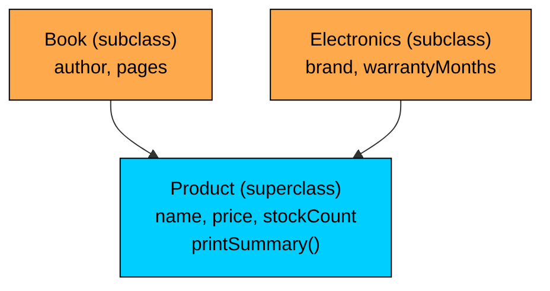
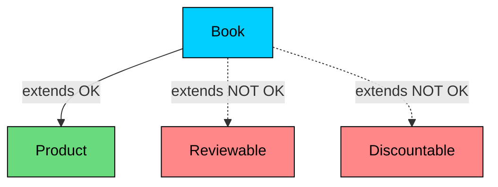
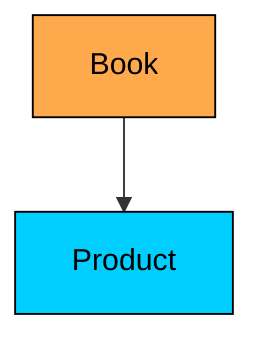
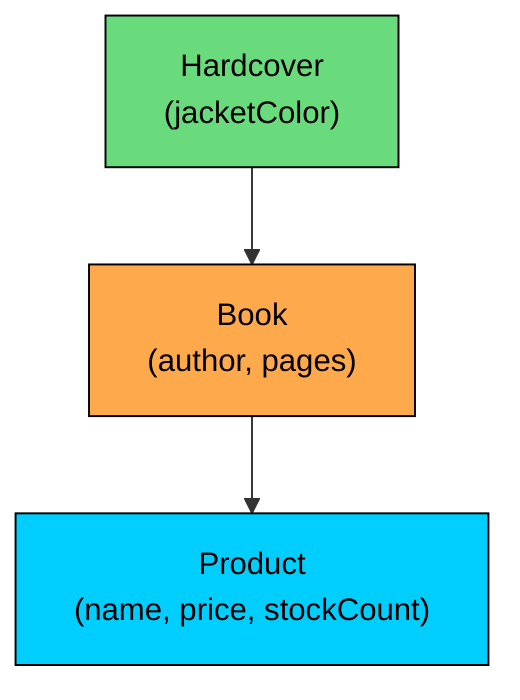
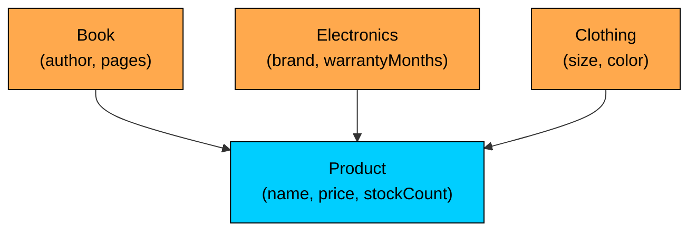
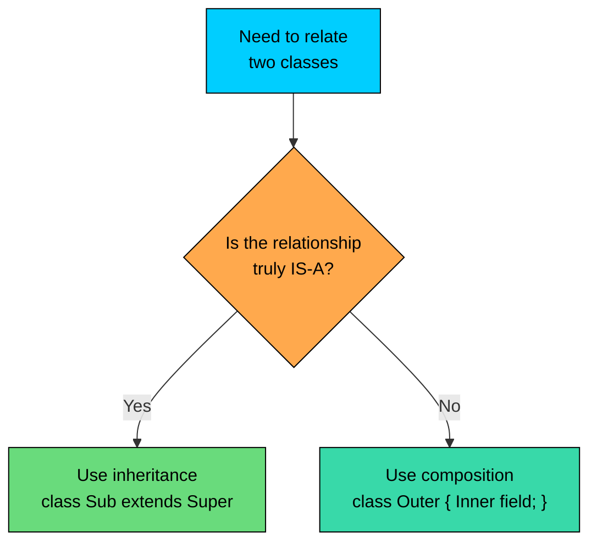
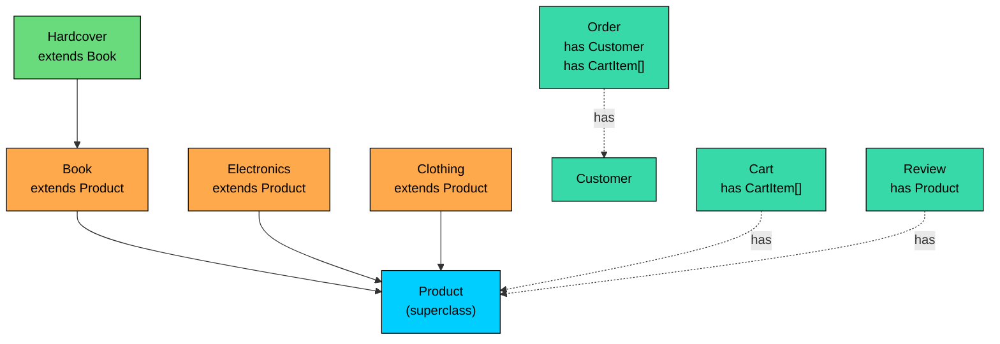

import React from 'react';
import CodeBlock from '../../../../components/ui/CodeBlock';
import Callout from '../../../../components/ui/Callout';

<div className="article-header">
  <div className="breadcrumb">
    <a href="/">Curated Notes</a>
    <span className="breadcrumb-separator">›</span>
    <span className="breadcrumb-current">Inheritance Basics</span>
  </div>
  <h1>Inheritance Basics</h1>
  <p style={{ color: 'var(--text-muted)', fontSize: '1.1rem', marginBottom: '16px', lineHeight: '1.6' }}>
    Master the essentials of Inheritance Basics in this curated guide.
  </p>
  <div className="meta-info">
    <span className="meta-item">
      <svg width="14" height="14" viewBox="0 0 24 24" fill="none" stroke="currentColor" strokeWidth="2"><circle cx="12" cy="12" r="10"/><polyline points="12 6 12 12 16 14"/></svg>
      10 min read
    </span>
    <span className="difficulty-badge difficulty-badge--intermediate">Intermediate</span>
  </div>
</div>

<section className="content-section">

Earlier lessons built individual classes from scratch: `Product`, `Customer`, `Order`, `Review`. Each one stood on its own, with its own fields and methods. Real catalogs don't work that way. A book, a laptop, and a t-shirt are all products that share a name, a price, and a stock count, but a book also has an author, a laptop has a warranty, and a t-shirt has a size. Inheritance is Java's mechanism for saying "this thing is a specialized kind of that thing," so the shared parts live in one place and the specialized parts live where they belong. This lesson covers what inheritance is, when it fits, and when something else fits better.

---

## Why Inheritance Exists

Consider what happens without inheritance. Suppose the store sells two product types, books and electronics. They share the basic product fields, but each has extra information.


```java
public class Book {
    public String name;
    public double price;
    public int stockCount;
    public String author;
    public int pages;

    public void printSummary() {
        System.out.println(name + " - $" + price + " (" + stockCount + " in stock)");
    }
}
```


```java
public class Electronics {
    public String name;
    public double price;
    public int stockCount;
    public int warrantyMonths;
    public String brand;

    public void printSummary() {
        System.out.println(name + " - $" + price + " (" + stockCount + " in stock)");
    }
}
```


The two classes side by side show three fields and one method are copy-pasted. Adding `category` to every product later would require changes in two places. A bug fix in `printSummary` would need to happen twice. Add a third type (clothing, kitchen, toys) and the duplication grows linearly. The two classes also have no shared type, so a method that accepts "any product" can't be written cleanly.

The duplication is the symptom. The real problem is that the type system hasn't been told what is true: a book and an electronics item are both products. The specialized things are described without naming the general thing they have in common.

The same model with a shared `Product` class on top:


```java
public class Product {
    public String name;
    public double price;
    public int stockCount;

    public void printSummary() {
        System.out.println(name + " - $" + price + " (" + stockCount + " in stock)");
    }
}
```


```java
public class Book extends Product {
    public String author;
    public int pages;
}
```


```java
public class Electronics extends Product {
    public int warrantyMonths;
    public String brand;
}
```


The shared three fields and the shared method now live on `Product`. `Book` and `Electronics` declare only what's different about them. The `extends` keyword tells Java that a `Book` is a specialized kind of `Product` and an `Electronics` item is too. Both classes pick up `name`, `price`, `stockCount`, and `printSummary` automatically.

A small driver:


```java
public class CatalogDemo {
    public static void main(String[] args) {
        Book novel = new Book();
        novel.name = "Effective Java";
        novel.price = 45.99;
        novel.stockCount = 7;
        novel.author = "Joshua Bloch";
        novel.pages = 416;

        Electronics laptop = new Electronics();
        laptop.name = "Aluminum Laptop";
        laptop.price = 1299.00;
        laptop.stockCount = 3;
        laptop.brand = "Acme";
        laptop.warrantyMonths = 24;

        novel.printSummary();
        laptop.printSummary();
    }
}
```


Neither `Book` nor `Electronics` declares `printSummary`, and neither declares `name`, `price`, or `stockCount`. They inherit all of it from `Product`. The shape: shared parts in one class, specialized parts in another.

Inheritance provides two things at once. First, **code reuse**: write the common behavior once, use it everywhere. Second, **a shared type**: a `Book` and an `Electronics` are now both also `Product`s in the eyes of the type system, which allows methods that work on any product without caring what specific kind it is.

---

## The IS-A Relationship

Inheritance models a single, specific idea: an **IS-A** relationship. A `Book` is a `Product`. An `Electronics` item is a `Product`. The child is a more specific version of the parent, with everything the parent has plus possibly more.

If "a Book is a Product" sounds true when said aloud, inheritance is at least a candidate. If the sentence sounds wrong, inheritance isn't appropriate, no matter how convenient the code reuse looks.

The IS-A test is strict on purpose. It's not "a Book and a Product have some fields in common." It's "a Book is, in every meaningful sense, a kind of Product." Anywhere code expects a `Product`, a `Book` should work and the program should still make sense.

Concretely: a method like


```java
public static double restockCost(Product p, int unitsToBuy) {
    return p.price * unitsToBuy;
}
```


works on a `Book` because a `Book` is a `Product` and has a `price`. It works on an `Electronics` for the same reason. Passing in something that wasn't really a kind of `Product` would either fail to compile or misbehave at runtime.

The claim here is not "a Book is composed of a Product" or "a Book uses a Product internally." It is stronger: at the type level, a Book really is a Product. That's what gives the parent's methods meaning when called on a child.

The terms for the two sides of this relationship show up in every Java textbook and interview, so it's worth pinning them down once.


| Term used for parent | Term used for child | Notes |
| --- | --- | --- |
| Superclass | Subclass | Most common in Java docs and books |
| Parent class | Child class | Common in tutorials and casual conversation |
| Base class | Derived class | Common in C++ background; used less in Java |


This lesson uses **superclass** and **subclass** because that's what the Java Language Specification uses and what appears in compiler messages and the official documentation. The other terms mean the same thing.

In the running example, `Product` is the superclass and `Book` is a subclass of `Product`. `Book extends Product` reads as "Book is a subclass of Product" or "Book extends from Product."





The arrows point from subclass to superclass, which is the standard direction in UML class diagrams. The reason for that convention is that the child knows about the parent (it has to, in order to extend it), but the parent doesn't know about its children. `Product` was a complete class long before we wrote `Book`, and it would still compile if `Book` disappeared.

---

## Inheritance vs Composition (HAS-A)

There's a different way two classes can relate that beginners often confuse with inheritance. It's called **composition**, and it expresses a **HAS-A** relationship instead of an IS-A relationship.

Composition means one class holds another class as a field. The container "has" the contained thing as a part. It doesn't claim to be a specialized version of it.

The clearest e-commerce example is a shopping cart and the items in it. A `Cart` is not a kind of `CartItem`. A cart is a thing that holds cart items. So:


```java
public class CartItem {
    public String productName;
    public double pricePerUnit;
    public int quantity;
}
```


```java
public class Cart {
    public String customerName;
    public CartItem[] items;
    public int itemCount;

    public double total() {
        double sum = 0;
        for (int i = 0; i < itemCount; i++) {
            sum = sum + items[i].pricePerUnit * items[i].quantity;
        }
        return sum;
    }
}
```


The `Cart` *has* items. It doesn't extend `CartItem`. The relationship is "cart has cart items," and the field `items` makes that real.

Compare that with the earlier `Book extends Product`. A book *is* a product. The relationship is identity-based, not container-based. There's no "the book holds a product inside it." A book just is a product, with a few extra fields tacked on.

A side-by-side comparison:


```java
// IS-A: inheritance. A Book is a Product.
public class Book extends Product {
    public String author;
    public int pages;
}
```


```java
// HAS-A: composition. An Order has a Customer and a list of items.
public class Order {
    public int orderId;
    public Customer customer;
    public CartItem[] items;
    public int itemCount;
    public boolean isPaid;
}
```


`Order` doesn't extend `Customer`, because an order isn't a kind of customer. An order has a customer attached to it. Likewise, an order has line items, but it isn't a kind of item.

A runnable example of the order/customer relationship:


```java
public class Customer {
    public String name;
    public String email;
}

public class Order {
    public int orderId;
    public Customer customer;
    public double total;

    public void printReceipt() {
        System.out.println("Order #" + orderId);
        System.out.println("For: " + customer.name + " <" + customer.email + ">");
        System.out.println("Total: $" + total);
    }
}

public class OrderDemo {
    public static void main(String[] args) {
        Customer alice = new Customer();
        alice.name = "Alice";
        alice.email = "alice@example.com";

        Order order = new Order();
        order.orderId = 1042;
        order.customer = alice;
        order.total = 89.99;

        order.printReceipt();
    }
}
```


The `Order` reaches into its `customer` field with the dot operator to get the name and email. It doesn't inherit a name or an email, because an order isn't a kind of customer. It just keeps a reference to one.

The two relationships look superficially similar in code: in both cases, one class mentions another class. The difference is in how it mentions it.


| Feature | Inheritance (IS-A) | Composition (HAS-A) |
| --- | --- | --- |
| Syntax | `class Sub extends Super` | `class Outer { Inner field; }` |
| Reads as | "Sub is a Super" | "Outer has an Inner" |
| Inherits members? | Yes, automatically | No, you access via the field |
| Type compatibility? | A `Sub` is also a `Super` | An `Outer` is not an `Inner` |
| Lifetime tied? | Yes, members come with the object | The inner can exist independently |


One mistake to avoid: choosing inheritance because it looks like less typing. If `Order extends Customer` happens to compile and provides a `name` field automatically, that's not a reason to do it. An order is not a kind of customer. Misrepresenting the relationship will hurt later, especially once polymorphism starts treating every `Order` as if it could stand in for a `Customer`.

---

## Java's Single Inheritance Rule

Java has a strict rule about how many superclasses a class can have: **one, and only one**. A class can extend exactly one other class. Writing `class Book extends Product, Reviewable` is a compile error.


```java
public class Reviewable {
    public int averageRating;
    public int reviewCount;
}

// This does NOT compile.
public class Book extends Product, Reviewable {
    public String author;
}
```


The compiler rejects the comma. Java was designed this way on purpose, and the design choice has a name: **single inheritance of implementation**.

Why the restriction? When a class inherits from multiple parents and those parents disagree, things get ugly fast. If both `Product` and `Reviewable` defined a method called `printSummary` with different bodies, which one does `Book` use? If both defined a field called `tag`, which copy lives on a `Book` instance? The classic name for this mess is the **diamond problem**: when two parents share a common grandparent, and a child inherits from both, the layout of the shared grandparent's state gets ambiguous. Languages that allow multiple inheritance of state (C++ is the famous example) have to add rules and keywords to disambiguate, and those rules are easy to get wrong.

Java sidesteps the whole problem by forbidding multiple inheritance of classes. The compiler doesn't have to choose between `Product.printSummary` and `Reviewable.printSummary`, because no class can have both as parents.

That doesn't mean a class is stuck with exactly one set of behaviors. Java has a separate mechanism, **interfaces**, that allows a class to promise to support multiple sets of methods without inheriting their implementations. A class implements as many interfaces as needed:


```java
public interface Reviewable {
    int averageRating();
}

public interface Discountable {
    double discountedPrice();
}

public class Book extends Product implements Reviewable, Discountable {
    // one superclass: Product
    // multiple interfaces: Reviewable, Discountable
}
```


The rule for this lesson: **a class extends at most one superclass**, no exceptions. When two parents seem needed, interfaces are usually the way out, or composition.

The single-inheritance limit applies only to classes. The picture below shows what's allowed and what isn't:





One solid arrow up to one superclass. Multiple `extends` on a single class is forbidden. (The dotted lines show what's not allowed; they're not real Java syntax.)

One bit of vocabulary worth noting. Even though a class has only one *direct* superclass, it can have multiple *indirect* superclasses through a chain. The rule is about direct parents, not ancestors.

---

## Types of Inheritance

Even with the one-superclass rule, inheritance can build interesting shapes. There are three patterns worth naming.

#### Single Inheritance

The simplest case. One subclass, one superclass, one arrow.





In code:


```java
public class Product {
    public String name;
    public double price;
    public int stockCount;
}

public class Book extends Product {
    public String author;
    public int pages;
}
```


This is what the running example uses. `Book` extends `Product` and that's the whole hierarchy. Most useful inheritance trees are single inheritance trees with one or two levels.

#### Multilevel Inheritance

A subclass becomes a superclass for a further subclass. The result is a chain: A extends B, B extends C.





In code:


```java
public class Product {
    public String name;
    public double price;
    public int stockCount;
}

public class Book extends Product {
    public String author;
    public int pages;
}

public class Hardcover extends Book {
    public String jacketColor;
}
```


A `Hardcover` is a `Book`, and through `Book` it's also a `Product`. So a `Hardcover` instance has `jacketColor`, `author`, `pages`, `name`, `price`, and `stockCount`, five inherited through the chain plus its own one.

The single-superclass rule is still honored. `Hardcover` extends exactly one class: `Book`. `Book` extends exactly one class: `Product`. No class has two direct parents. The chain is just a series of single-step relationships stacked together.

A runnable example follows:


```java
public class HardcoverDemo {
    public static void main(String[] args) {
        Hardcover atlas = new Hardcover();
        atlas.name = "World Atlas";            // from Product
        atlas.price = 79.99;                   // from Product
        atlas.stockCount = 4;                  // from Product
        atlas.author = "National Geographic";  // from Book
        atlas.pages = 320;                     // from Book
        atlas.jacketColor = "navy";            // from Hardcover

        System.out.println(atlas.name + " by " + atlas.author);
        System.out.println("Pages: " + atlas.pages + ", Jacket: " + atlas.jacketColor);
        System.out.println("Price: $" + atlas.price);
    }
}
```


A `Hardcover` object has six fields visible on it, picked up from three different classes in the chain. None of them are redeclared in `Hardcover`.

Multilevel inheritance is legal, but use it sparingly. The deeper the chain, the harder it gets to figure out where a given field or method actually comes from when reading the code. Two levels (`Book extends Product`) is common and fine. Five levels deep is usually a sign that something has gone wrong with the design.

Each level in a multilevel chain adds reading overhead. A reader of `Hardcover.printSummary()` has to walk up to `Book`, then up to `Product`, to find which implementation runs. Two levels is manageable. Beyond three, prefer composition or a flatter design.

#### Hierarchical Inheritance

Multiple subclasses share one superclass. One parent, many children, each branching off independently.





In code:


```java
public class Product {
    public String name;
    public double price;
    public int stockCount;

    public void printSummary() {
        System.out.println(name + " - $" + price + " (" + stockCount + " in stock)");
    }
}

public class Book extends Product {
    public String author;
    public int pages;
}

public class Electronics extends Product {
    public int warrantyMonths;
    public String brand;
}

public class Clothing extends Product {
    public String size;
    public String color;
}
```


This is the shape that most product catalogs end up with. One `Product` superclass with the shared fields and methods, and a sibling class for each major category. The siblings don't know about each other; they just share a parent.


```java
public class CatalogTour {
    public static void main(String[] args) {
        Book novel = new Book();
        novel.name = "Effective Java";
        novel.price = 45.99;
        novel.stockCount = 7;

        Electronics laptop = new Electronics();
        laptop.name = "Aluminum Laptop";
        laptop.price = 1299.00;
        laptop.stockCount = 3;

        Clothing tshirt = new Clothing();
        tshirt.name = "Cotton T-Shirt";
        tshirt.price = 19.99;
        tshirt.stockCount = 40;

        novel.printSummary();
        laptop.printSummary();
        tshirt.printSummary();
    }
}
```


Three subclasses, one `printSummary` method, written once on `Product`. Each subclass adds its own fields without redoing the shared part.

Two other shapes sometimes appear in Java textbooks. **Multiple inheritance** (a class with two or more direct superclasses) and **hybrid inheritance** (a mix involving multiple inheritance). Java doesn't support either for classes, so this lesson does not cover them in depth. Interfaces fill the gap when a class needs to play more than one role.

The three shapes covered, summarized:


| Type | Shape | Java supports it? | Example |
| --- | --- | --- | --- |
| Single | A → B | Yes | `Book extends Product` |
| Multilevel | A → B → C | Yes | `Hardcover extends Book extends Product` |
| Hierarchical | A → B, A → C, A → D | Yes | `Book`, `Electronics`, `Clothing` all extend `Product` |
| Multiple | A and B → C | No (for classes) | Use interfaces instead |
| Hybrid | Mix of multiple and other | No (for classes) | Use interfaces instead |


---

## When to Choose Inheritance

Inheritance is powerful, and it's used too often. A piece of advice has stood the test of time in the Java community, popularized by Joshua Bloch in *Effective Java*: **favor composition over inheritance**. Understanding the reasoning helps when deciding which tool to use.

The core problem with inheritance is that it's a strong commitment. When `Book extends Product`, `Book` is locked into whatever `Product` does, including changes that happen later. Add a method to `Product`, and every subclass picks it up automatically, whether or not the addition makes sense for that subclass. Change the behavior of a `Product` method, and every subclass behaves differently overnight. This is sometimes called the **fragile base class problem**.

Composition doesn't have that problem. A class that holds another class as a field can choose exactly which methods to expose. If the inner class changes, only the outer class's wiring breaks, not the contract it exposes to its callers.

A practical rule of thumb:


| Question | If yes... | If no... |
| --- | --- | --- |
| Does `Sub` pass the IS-A test for `Super`? | Inheritance is a candidate | Use composition |
| Could `Sub` swap in anywhere `Super` is used and still make sense? | Inheritance is a candidate | Use composition |
| Should all changes to `Super` ripple into `Sub` automatically? | Inheritance is a candidate | Use composition |
| Are `Super` and `Sub` under the same control (vs. third-party)? | Inheritance is safer | Inheritance is riskier |


Inheritance is appropriate when:

- The IS-A relationship is real, not just a coincidence of shared fields. `Book` is a `Product` is real. `Order` is a `Customer` is not.
- A shared type benefits generic code that operates on the supertype. A method that prices any product benefits from the shared `Product` type.
- The superclass is stable and unlikely to change in ways that hurt the subclasses. Well-designed classes under the same ownership are usually fine. Random library classes are riskier.
- Behavior in the superclass should be picked up by all subclasses without each one re-implementing it.

Composition is appropriate when:

- The relationship is "has-a" or "uses-a", not "is-a". A `Cart` has items. An `Order` has a `Customer`. A `Customer` has an `Address`.
- Only a small slice of another class's behavior is needed. If `Book` would inherit fifteen methods from `Library` but only needs two, prefer composition.
- The inner type may switch later. A field of type `PaymentMethod` can be reassigned to a different payment method. A superclass is fixed at compile time.
- The classes belong to different conceptual layers. A persistence helper has no business being a parent of a domain object.

A side-by-side comparison in code. Both versions give an `Order` access to a `Customer`'s data. One is wrong, one is right.


```java
// WRONG: Order is not a kind of Customer.
public class Order extends Customer {
    public int orderId;
    public double total;
}
```


```java
// RIGHT: Order has a Customer.
public class Order {
    public int orderId;
    public double total;
    public Customer customer;
}
```


The wrong version compiles. It even gives `Order` a working `name` and `email` automatically. That's the trap. The IS-A test fails (an order is not a kind of customer), and treating an `Order` as a `Customer` anywhere else in the program will lead to nonsense. The right version expresses the actual relationship: an order has a customer associated with it.

A second example from the same domain. Consider modeling product reviews.


```java
// WRONG: A Review is not a kind of Product.
public class Review extends Product {
    public int rating;
    public String comment;
}
```


```java
// RIGHT: A Review is about a Product.
public class Review {
    public Product product;
    public int rating;
    public String comment;
}
```


A review is a separate thing from the product it's about. The wrong version gives reviews a `price` and `stockCount`, neither of which makes sense on a review. The right version stores a reference to the product being reviewed.

The shorthand: **if the IS-A sentence requires squinting to sound right, use composition**. Inheritance fits when the relationship is so clear that no other phrasing works.





A decision in two questions. A "no" answer to the IS-A test routes to composition.

---

## Putting It Together

The three concepts (the IS-A relationship, the single-inheritance rule, and the composition alternative) fit together in one picture.





Solid arrows are `extends`, the inheritance arrows. They model IS-A: a `Book` is a `Product`, a `Hardcover` is a `Book`. Dotted arrows are HAS-A, the composition relationships: an `Order` has a `Customer`, a `Cart` has products, a `Review` is about a product. The two kinds of edges represent two different kinds of relationship and they aren't interchangeable.

`Product` here sits at the top of a small hierarchical inheritance tree, and `Hardcover extends Book extends Product` adds a multilevel branch on one side. None of the children have more than one direct parent, which is exactly what Java's single-inheritance rule requires. The HAS-A relationships off to the side don't show up in the class hierarchy at all; they're stored as fields, not encoded in the type system.

The pattern: inheritance is for *what something is*, composition is for *what something has*. They are not in competition. A real codebase uses both, often inside the same class.

</section>
