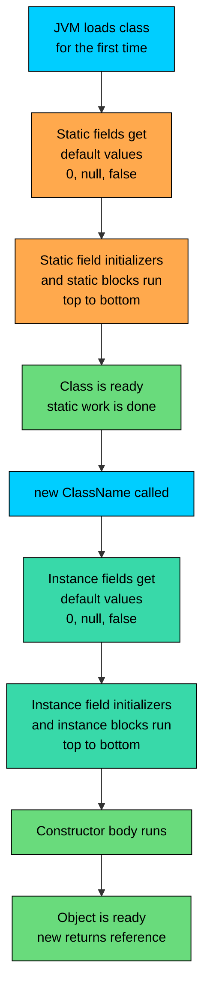

import React from 'react';
import CodeBlock from '../../../../components/ui/CodeBlock';
import Callout from '../../../../components/ui/Callout';

<div className="article-header">
  <div className="breadcrumb">
    <a href="/">Curated Notes</a>
    <span className="breadcrumb-separator">›</span>
    <span className="breadcrumb-current">Initializer Blocks</span>
  </div>
  <h1>Initializer Blocks</h1>
  <p style={{ color: 'var(--text-muted)', fontSize: '1.1rem', marginBottom: '16px', lineHeight: '1.6' }}>
    Master the essentials of Initializer Blocks in this curated guide.
  </p>
  <div className="meta-info">
    <span className="meta-item">
      <svg width="14" height="14" viewBox="0 0 24 24" fill="none" stroke="currentColor" strokeWidth="2"><circle cx="12" cy="12" r="10"/><polyline points="12 6 12 12 16 14"/></svg>
      10 min read
    </span>
    <span className="difficulty-badge difficulty-badge--intermediate">Intermediate</span>
  </div>
</div>

<section className="content-section">

Sometimes a field needs more than a single expression to set itself up: populating a list of default categories, loading a discount table at startup, or running a multi step computation before any constructor body executes. Initializer blocks provide a place for that setup logic without duplicating it across every constructor. This lesson covers the two flavors of initializer block (instance and static), when each one runs, and the order Java uses to wire everything together for `new`.

---

## Why Initializer Blocks Exist

A field initializer is a single expression. That's fine for `private int stock = 0;` or `private String name = "default";`. But more involved setup needs more than one expression. Say a `Catalog` class needs every instance to start with three default categories already in its list. With only a field initializer, this is impossible.


```java
import java.util.ArrayList;
import java.util.List;

public class CatalogAttempt {
    private List<String> categories = new ArrayList<>();
    // Where do we add "Electronics", "Books", "Clothing"?
}
```


Three `add` calls don't fit into a single expression. The usual workaround is to do the work inside every constructor.


```java
import java.util.ArrayList;
import java.util.List;

public class CatalogWithConstructors {
    private List<String> categories;
    private String storeName;

    public CatalogWithConstructors() {
        categories = new ArrayList<>();
        categories.add("Electronics");
        categories.add("Books");
        categories.add("Clothing");
        storeName = "AlgoMart";
    }

    public CatalogWithConstructors(String storeName) {
        categories = new ArrayList<>();
        categories.add("Electronics");
        categories.add("Books");
        categories.add("Clothing");
        this.storeName = storeName;
    }
}
```


The setup of `categories` is identical in both constructors. Adding a fourth default category later requires updates in both places. Miss one and the two constructors drift apart.

An instance initializer block fixes this. The shared setup goes into a `{ ... }` block at the class level (outside any method or constructor), and Java runs it for every `new`, before the constructor body.


```java
import java.util.ArrayList;
import java.util.List;

public class Catalog {
    private List<String> categories;
    private String storeName;

    {
        categories = new ArrayList<>();
        categories.add("Electronics");
        categories.add("Books");
        categories.add("Clothing");
    }

    public Catalog() {
        storeName = "AlgoMart";
    }

    public Catalog(String storeName) {
        this.storeName = storeName;
    }

    public static void main(String[] args) {
        Catalog a = new Catalog();
        Catalog b = new Catalog("AlgoMart Express");
        System.out.println(a.storeName + " has " + a.categories.size() + " categories");
        System.out.println(b.storeName + " has " + b.categories.size() + " categories");
    }
}
```


Both constructors get the three default categories without repeating the setup. Adding a fourth category is a one line change.

Initializer blocks are not the only tool for this job. Constructor chaining with `this(...)` and helper methods can also remove duplication. Initializer blocks fit best when shared setup has to run for every constructor, including any future constructors added later. The block runs for all of them automatically.

---

## Instance Initializer Blocks

An instance initializer block is a pair of braces at the class level. It's not labeled, it's not named, and it isn't inside any method.


```java
public class Product {
    private String name;
    private double price;
    private boolean inStock;

    {
        inStock = true;
    }

    public Product(String name, double price) {
        this.name = name;
        this.price = price;
    }
}
```


Every time `new Product(...)` runs, the block runs. So `inStock` defaults to `true` for every product, no matter which constructor was called or how many constructors get added later.

Rules for instance initializer blocks:

- They live at the class level, not inside a method or constructor.
- A class can have any number of them. They run top to bottom in the order they appear.
- They can read and assign any instance field of the class.
- They can call instance methods, though calling methods that depend on fields not yet initialized leads to subtle bugs.
- They cannot return a value. Writing `return;` inside an instance initializer block is a compile error.
- They cannot have parameters.

An example with two instance initializer blocks shows the ordering:


```java
public class TwoBlocks {
    private int x;
    private int y;

    {
        x = 1;
        System.out.println("Block A ran, x = " + x);
    }

    {
        y = x + 10;
        System.out.println("Block B ran, y = " + y);
    }

    public TwoBlocks() {
        System.out.println("Constructor ran, x = " + x + ", y = " + y);
    }

    public static void main(String[] args) {
        new TwoBlocks();
    }
}
```


Block A runs first and sets `x` to `1`. Block B runs next and uses the value `x` already has, then sets `y` to `11`. The constructor body runs last and sees both values. The blocks behave as if their statements were inlined into the top of every constructor, in declaration order.

---

## Static Initializer Blocks

A static initializer block looks like an instance initializer block with one extra word: `static`. The behavior differs. Where an instance block runs for every `new`, a static block runs **once**, when the class itself is first loaded by the JVM.

Use a static initializer block for one time, class level setup that's too involved for a single field initializer. Typical examples include populating a static map with defaults, building a lookup table, or registering the class with some external system.


```java
import java.util.HashMap;
import java.util.Map;

public class DiscountTable {
    private static final Map<String, Double> CODES = new HashMap<>();

    static {
        CODES.put("WELCOME10", 0.10);
        CODES.put("SAVE5", 0.05);
        CODES.put("VIP25", 0.25);
        System.out.println("Discount table loaded with " + CODES.size() + " codes");
    }

    public static double percentFor(String code) {
        return CODES.getOrDefault(code, 0.0);
    }

    public static void main(String[] args) {
        System.out.println("WELCOME10 -> " + percentFor("WELCOME10"));
        System.out.println("UNKNOWN -> " + percentFor("UNKNOWN"));
    }
}
```


The `static` block populates `CODES` once, before any code outside the class can touch it. Even if `percentFor` is called a thousand times, the block doesn't run again. That makes static blocks a good fit for expensive setup that should happen exactly once per program run.

Rules for static initializer blocks:

- They sit at the class level, prefixed with `static`.
- They run **once**, the first time the class is loaded by the JVM. Creating an instance, calling a static method, or reading a static field all count as triggers.
- A class can have any number of static blocks. They run top to bottom in declaration order.
- They can only read and assign **static** fields. They cannot touch instance fields, because instances might not exist yet.
- They cannot have parameters or return values. `return;` inside a static block is a compile error.
- They can call static methods of the class, with the same caveat about depending on uninitialized static fields.

The "runs once" behavior in code:


```java
public class RunsOnce {
    static {
        System.out.println("Static block ran");
    }

    {
        System.out.println("Instance block ran");
    }

    public RunsOnce() {
        System.out.println("Constructor ran");
    }

    public static void main(String[] args) {
        System.out.println("Creating first instance");
        new RunsOnce();
        System.out.println("Creating second instance");
        new RunsOnce();
    }
}
```


The static block ran before `main` even started printing. The class had to be loaded for `main` to run, and loading the class triggered the static block. The instance block ran twice (once per `new`), but the static block ran exactly once.

A static block runs eagerly the first time the class is touched. If the block does heavy work (reading a large file, hitting the network), every program that loads the class pays that cost up front. For lazy or optional setup, prefer a lazily initialized static method over a static block.

---

## Execution Order: The Big Picture

When `new Product(...)` runs, several things happen in a precise order. The result usually works, so the sequence is invisible. But knowing the order helps when debugging initialization bugs and reading unfamiliar code.

The full lifecycle from "the JVM has never seen this class" to "the constructor body has returned":





Several details to underscore:

1. **Static work happens once, ahead of everything else.** The first time the class is touched (any `new`, any static method call, any static field read), the JVM loads it and runs the static initializers. After that, the static block is done forever.
2. **Instance work happens on every `new`.** Each instance gets its own pass through the field initializers and instance blocks before the constructor body runs.
3. **Field initializers and instance blocks run in textual order.** The blocks don't all run "before" or "after" the field initializers. They interleave with them, top to bottom, in the order they appear in the source file.
4. **The constructor body runs last.** By the time the opening `{` of the constructor is reached, every field initializer and every instance block has already executed.

Parent class initialization (when one class extends another) adds another layer on top.

---

## Interleaving Field Initializers and Instance Blocks

Java does **not** run all field initializers first and then all blocks. It walks down the class textually and executes each initializer or block in order.


```java
public class TextualOrder {
    int a = printAndReturn("a = 1", 1);

    {
        System.out.println("Block 1 runs, a = " + a);
        a = 2;
    }

    int b = printAndReturn("b = " + (a + 10), a + 10);

    {
        System.out.println("Block 2 runs, b = " + b);
    }

    public TextualOrder() {
        System.out.println("Constructor body, a = " + a + ", b = " + b);
    }

    private static int printAndReturn(String label, int value) {
        System.out.println("Field init: " + label);
        return value;
    }

    public static void main(String[] args) {
        new TextualOrder();
    }
}
```


Reading this step by step: the field initializer for `a` runs first because it's declared first. Then Block 1 runs and changes `a` to `2`. Then the field initializer for `b` runs, and at that moment `a` is already `2`, so `a + 10` is `12`. Then Block 2 runs. Finally the constructor body runs and sees `a = 2, b = 12`.

If Java ran "all initializers first, then all blocks", the field initializer for `b` would have used `a + 10 = 11`, not `12`. The interleaving is what makes the example print `12`. This is the rule the JLS specifies: instance variable initializers and instance initializer blocks execute in textual order.

The same interleaving rule applies to static field initializers and static blocks, just one level up. Static items run in textual order during class loading.


```java
public class StaticOrder {
    static int s1 = log("s1 = 100", 100);

    static {
        System.out.println("Static block 1: s1 = " + s1);
        s1 = 200;
    }

    static int s2 = log("s2 = " + (s1 + 1), s1 + 1);

    static {
        System.out.println("Static block 2: s2 = " + s2);
    }

    private static int log(String label, int value) {
        System.out.println("Static field init: " + label);
        return value;
    }

    public static void main(String[] args) {
        System.out.println("main: s1 = " + s1 + ", s2 = " + s2);
    }
}
```


Same idea, applied to static items. The initializer for `s1` runs, the first static block changes `s1` to `200`, the initializer for `s2` uses the current value (`200 + 1 = 201`), and the second static block prints it.

---

## Multiple Blocks: Top to Bottom

Both flavors of initializer block can appear more than once in a class. Java runs them in the order they appear in the source file. There's no priority, no labels, no runtime reordering.


```java
public class MultiBlocks {
    static { System.out.println("Static block A"); }
    static { System.out.println("Static block B"); }

    { System.out.println("Instance block A"); }
    { System.out.println("Instance block B"); }

    public MultiBlocks() {
        System.out.println("Constructor body");
    }

    public static void main(String[] args) {
        System.out.println("--- new #1 ---");
        new MultiBlocks();
        System.out.println("--- new #2 ---");
        new MultiBlocks();
    }
}
```


The static blocks ran once each, in the order they were written, before `main` started printing. The instance blocks ran in order for each `new`. In practice, more than one block of each kind is rare. A single block usually reads more clearly than two scattered ones.

---

## A Worked Construction Example

A program that mixes static fields, instance fields, both kinds of initializer blocks, and a constructor. The output shows the exact order every step runs.


```java
public class CartLifecycle {
    static int classLoadCount = recordStaticInit("static field");

    static {
        System.out.println("Static block: classLoadCount = " + classLoadCount);
        classLoadCount = 1;
    }

    int instanceField = recordInstanceInit("instance field");

    {
        System.out.println("Instance block ran");
    }

    public CartLifecycle(String label) {
        System.out.println("Constructor body for " + label);
    }

    private static int recordStaticInit(String label) {
        System.out.println("Initializing " + label);
        return 0;
    }

    private static int recordInstanceInit(String label) {
        System.out.println("Initializing " + label);
        return 42;
    }

    public static void main(String[] args) {
        System.out.println("--- main starts ---");
        new CartLifecycle("cart-1");
        System.out.println("--- between news ---");
        new CartLifecycle("cart-2");
    }
}
```


Step by step:

1. The JVM loads `CartLifecycle` because `main` lives in it.
2. The static field initializer runs and prints `Initializing static field`. `classLoadCount` becomes `0`.
3. The static block runs next, prints the current value of `classLoadCount` (`0`), and sets it to `1`. The static work is done.
4. `main` starts executing. The first `println` fires.
5. `new CartLifecycle("cart-1")` triggers instance initialization. The instance field initializer runs and prints `Initializing instance field`. Then the instance block prints `Instance block ran`. Finally the constructor body runs and prints its line.
6. The second `new` repeats steps for the instance work only. The static block does not run again.

This single example captures the whole ordering model.

---

## Common Restrictions and Compile Errors

Several rules around initializer blocks trip up new users. The compiler enforces them strictly.

#### `return` Is Not Allowed in an Initializer Block

Initializer blocks aren't methods. They don't have a return type, and they don't have a caller waiting for a value. A `return` statement inside an initializer block is a compile error.

**What's wrong with this code?**


```java
public class CannotReturn {
    {
        return; // compile error
    }
}
```


The compiler complains with: "return outside method". Initializer blocks are positions in the class lifecycle, not methods you can exit early from.

**Fix:**


```java
public class CannotReturnFixed {
    {
        // Just don't return. Let the block finish on its own.
        System.out.println("Instance block running");
    }
}
```


To skip the rest of a block under some condition, use a regular `if` to guard the remaining statements.

#### Static Blocks Cannot See Instance State

A static block runs when the class loads, before any instance exists. Touching an instance field from inside a static block is a compile error.

**What's wrong with this code?**


```java
public class StaticTouchesInstance {
    private int productCount = 0;

    static {
        productCount = 5; // compile error
    }
}
```


The compiler reports: "non-static variable productCount cannot be referenced from a static context". There's no specific instance for the static block to apply the change to.

**Fix:**

The fix depends on intent. If `productCount` should be shared across all instances (a class level counter), make it `static`. If it should be per instance, move the line into an instance block or a constructor.


```java
public class StaticTouchesInstanceFixed {
    private static int productCount = 0;

    static {
        productCount = 5;
    }
}
```


#### Initializer Blocks Cannot Live Inside Methods

Putting `static { ... }` or a class level instance block inside a method body is a compile error. Initializer blocks belong to the class, not to a method.

**What's wrong with this code?**


```java
public class BlockInMethod {
    public void setupCart() {
        static {            // compile error
            System.out.println("Cannot do this");
        }
    }
}
```


The `static` keyword in front of a block is only legal at the class level. Inside a method, `{ ... }` is just a regular block of code (a scope), but `static { ... }` doesn't mean anything.

**Fix:**

Move the block out of the method, up to the class level.


```java
public class BlockInMethodFixed {
    static {
        System.out.println("Class loaded");
    }

    public void setupCart() {
        // regular method body, no static block here
    }
}
```


#### Forgetting That Static Runs Only Once

A common bug: writing a static block expecting it to reset some state every time a new instance is created, then wondering why the state persists across instances. The fix is to move that logic into an instance block or the constructor.

**What's wrong with this code?**


```java
import java.util.ArrayList;
import java.util.List;

public class CartReset {
    private static List<String> items = new ArrayList<>();

    static {
        items.add("default item");
    }

    public CartReset() {
        System.out.println("Cart has " + items.size() + " items");
    }

    public static void main(String[] args) {
        new CartReset();
        new CartReset();
    }
}
```


The output is `Cart has 1 items` then `Cart has 2 items`. Each new `CartReset` reuses the same shared `items` list. The static block did its work once and never ran again, but the constructor isn't shown anything new because the list is `static`.

**Fix:**

For each cart to have its own list of items, make the list an instance field and seed it from an instance block.


```java
import java.util.ArrayList;
import java.util.List;

public class CartResetFixed {
    private List<String> items;

    {
        items = new ArrayList<>();
        items.add("default item");
    }

    public CartResetFixed() {
        System.out.println("Cart has " + items.size() + " items");
    }

    public static void main(String[] args) {
        new CartResetFixed();
        new CartResetFixed();
    }
}
```


Now each instance has its own list, the instance block runs for every `new`, and both prints say `Cart has 1 items`.

---

## How Blocks Help With `final` Fields

Initializer blocks are one of the legal places where a "blank final" can be assigned. A blank final is a `final` field declared without an inline value. Such a field must be definitely assigned exactly once before any constructor finishes, and the assignment can happen in a field initializer, an initializer block, or a constructor.


```java
public class FinalInBlock {
    private final int defaultStock;

    {
        defaultStock = 50;
    }

    public FinalInBlock() {
        System.out.println("Default stock: " + defaultStock);
    }

    public static void main(String[] args) {
        new FinalInBlock();
    }
}
```


The full story of `final` and where blank finals can and cannot be assigned belongs to the `final` keyword chapter. It is mentioned here because an instance block is one of the legal homes for that one time assignment.

---

## Initializer Blocks vs the Alternatives

There are several places where initialization logic can live.


| Option | Runs when | Best for |
| --- | --- | --- |
| Inline field initializer | Each `new` (or once for static) | Simple one expression setup |
| Instance initializer block | Each `new`, before the constructor body | Multi step setup shared across all constructors |
| Static initializer block | Once per class load | One time class level setup (lookup tables, defaults) |
| Constructor body | Each `new`, after instance blocks | Constructor specific logic that depends on parameters |
| Constructor chaining (`this(...)`) | Each `new` | Reusing one full constructor from another |


Default to field initializers when the setup is a single expression. Use an instance block when two or more constructors share the same opening lines. Prefer `this(...)` chaining when defaults vary by constructor. Use static blocks only for class-level, one-time setup.

</section>
