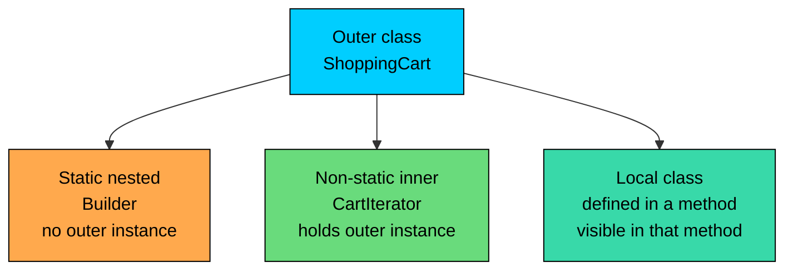
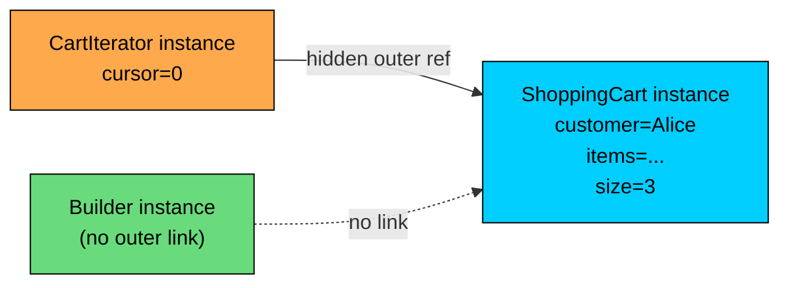

import React from 'react';
import CodeBlock from '../../../../components/ui/CodeBlock';
import Callout from '../../../../components/ui/Callout';

<div className="article-header">
  <div className="breadcrumb">
    <a href="/">Curated Notes</a>
    <span className="breadcrumb-separator">›</span>
    <span className="breadcrumb-current">Inner Classes</span>
  </div>
  <h1>Inner Classes</h1>
  <p style={{ color: 'var(--text-muted)', fontSize: '1.1rem', marginBottom: '16px', lineHeight: '1.6' }}>
    Master the essentials of Inner Classes in this curated guide.
  </p>
  <div className="meta-info">
    <span className="meta-item">
      <svg width="14" height="14" viewBox="0 0 24 24" fill="none" stroke="currentColor" strokeWidth="2"><circle cx="12" cy="12" r="10"/><polyline points="12 6 12 12 16 14"/></svg>
      10 min read
    </span>
    <span className="difficulty-badge difficulty-badge--intermediate">Intermediate</span>
  </div>
</div>

<section className="content-section">

Java allows declaring a class inside another class. The class on the outside is the **enclosing** or **outer** class, and the one on the inside is a **nested** class. This is the standard way to keep a small helper type close to the code that uses it, hide it from the rest of the program, and (in one flavor) give it special access to the outer class's private fields.

This lesson covers three of the four kinds of nested classes: non-static inner classes, static nested classes, and local classes. The fourth kind, anonymous classes, has enough quirks of its own to deserve its own chapter, which comes next.

---

## Why Nest a Class At All

Most classes live on their own at the top of a file. That's the default. Use a nested class when one of these is true:

- A helper type is only meaningful inside its outer class. Putting it elsewhere would force callers to import a type they shouldn't even know exists.
- A helper type needs to read the outer class's private state. With a top-level class, the outer class's API would have to widen just to share data.
- A short, single-use type is needed for one method, and giving it its own file would feel heavy.

Take a shopping cart. The cart itself is a public type the rest of the program uses. But the cart's iterator (the thing that walks through its items one at a time) is only useful from inside the cart. It needs to read the cart's internal array, and it has no use outside the cart. That's a case for a nested class.

The three flavors covered here differ in exactly one thing: their relationship to the outer class's instance. A static nested class has no relationship to it. A non-static inner class always belongs to one specific outer instance. A local class lives inside a method and disappears with it.





The diagram shows the three relationships at a glance. Each is covered below with code.

---

## Non-Static Inner Classes

A non-static inner class (sometimes called a **member inner class**) is declared inside another class without the `static` keyword. Every instance of an inner class is tied to one specific instance of the outer class. That outer instance is called the **enclosing instance**.

The practical consequence is that the inner class can read and write the outer class's fields directly, even the private ones, because it's "inside" the outer class for visibility purposes.

A small example before the full cart:


```java
public class Store {
    private String storeName = "AlgoMart";

    public class Greeter {
        public void greet(String customer) {
            System.out.println("Hello " + customer + ", welcome to " + storeName + "!");
        }
    }

    public static void main(String[] args) {
        Store store = new Store();
        Store.Greeter greeter = store.new Greeter();
        greeter.greet("Alice");
    }
}
```


Two things to point out. First, `Greeter` reaches into `storeName` directly, as if it were its own field. Second, creating a `Greeter` requires an existing `Store` instance: the unusual `store.new Greeter()` syntax. `new Greeter()` is not legal from outside `Store`, because a `Greeter` only makes sense in the context of a specific store.

The `store.new Greeter()` syntax reads as "use this store, and from it, create a new Greeter". It's the only place in Java where `new` appears after a dot like this. It looks odd because it is odd. Most inner-class instantiations happen from inside the outer class itself, where the shorter form `new Greeter()` works and implicitly uses `this` as the enclosing instance.

#### A Worked Example: ShoppingCart and Its Iterator

The point of a non-static inner class is to share state with the outer class. A custom iterator is the classic example. The code below defines a tiny interface for "something you can ask for the next item" and lets an inner `CartIterator` implement it against the cart's private storage.


```java
public class ShoppingCart {
    // A tiny interface so we don't depend on java.util.Iterator yet.
    public interface Walker {
        boolean hasNext();
        String next();
    }

    private String[] items;
    private int size;

    public ShoppingCart(int capacity) {
        this.items = new String[capacity];
        this.size = 0;
    }

    public void add(String item) {
        items[size] = item;
        size++;
    }

    public Walker walker() {
        return new CartIterator();
    }

    // Non-static inner class. Sees the cart's private fields directly.
    private class CartIterator implements Walker {
        private int cursor = 0;

        @Override
        public boolean hasNext() {
            return cursor < size;
        }

        @Override
        public String next() {
            String value = items[cursor];
            cursor++;
            return value;
        }
    }

    public static void main(String[] args) {
        ShoppingCart cart = new ShoppingCart(5);
        cart.add("Wireless Mouse");
        cart.add("USB Cable");
        cart.add("Headphones");

        Walker walker = cart.walker();
        while (walker.hasNext()) {
            System.out.println(walker.next());
        }
    }
}
```


The `CartIterator` reads `items` and `size` directly. Both are `private` on the outer class, but the inner class is part of the same class for visibility purposes, so the read is legal. From outside `ShoppingCart`, those fields are still invisible. The cart class as a whole still encapsulates them; the inner class is an additional viewpoint inside the same encapsulation boundary.

`walker()` returns the iterator using the short form `new CartIterator()`. That's because it's running inside a `ShoppingCart` method, so `this` is the enclosing instance and Java fills it in automatically.

#### Accessing Outer Members With `OuterClass.this`

Sometimes the inner class declares a field or method with the same name as one in the outer class. Inside the inner class, the inner name wins, so a bare reference points to the inner version. To reach the outer one, use `OuterClass.this.fieldName`.


```java
public class Catalog {
    private String name = "Catalog";

    public class Section {
        private String name = "Section";

        public void printNames() {
            System.out.println("Inner name: " + name);
            System.out.println("Outer name: " + Catalog.this.name);
        }
    }

    public static void main(String[] args) {
        Catalog catalog = new Catalog();
        Catalog.Section section = catalog.new Section();
        section.printNames();
    }
}
```


`OuterClass.this` doesn't come up often. When it does, it's almost always to disambiguate a shadowed name. Most inner classes pick distinct field names and avoid the question entirely.

#### The Hidden Reference to the Outer Instance

A non-static inner class always holds a reference to its enclosing instance. The compiler creates this reference automatically, but it's real, and it has two consequences.

First, the inner instance can't outlive the outer instance without keeping the outer one alive. As long as something is holding the inner object, the garbage collector can't reclaim the outer object either, even if nothing else points to it.


```java
public class CartHolder {
    private String[] items = new String[10_000];

    public class Snapshot {
        public int sizeAtSnapshot() {
            return items.length;
        }
    }

    public Snapshot snapshot() {
        return new Snapshot();
    }

    public static void main(String[] args) {
        CartHolder.Snapshot snapshot;

        {
            CartHolder cart = new CartHolder();
            snapshot = cart.snapshot();
        }

        // `cart` is out of lexical scope, but the snapshot still holds a hidden
        // reference to it, so the whole CartHolder (and its 10,000-slot array)
        // stays in memory as long as `snapshot` is reachable.
        System.out.println("Items array size: " + snapshot.sizeAtSnapshot());
    }
}
```


A non-static inner instance keeps its enclosing outer instance alive in memory for as long as the inner one is reachable. If the outer object is large (caches, big arrays, file handles), this can hold memory that would otherwise be freed. When the inner class doesn't need the outer instance, mark it `static`.

Second, before Java 16 the inner class couldn't have any static members of its own. The reasoning: every inner instance is tied to a separate enclosing instance, and a static field in the inner class would be ambiguous, shared across enclosing instances or per enclosing instance? Java 16 lifted this restriction so inner classes can now declare static members, but the underlying design point still holds: an inner class needing static state is often a signal it should be a static nested class instead.

#### What's Wrong With This Code?


```java
public class Library {
    private String name = "Central";

    public class Section {
        public void print() {
            System.out.println(name);
        }
    }

    public static void main(String[] args) {
        Section section = new Section();
        section.print();
    }
}
```


**Fix:**

`Section` is a non-static inner class, so creating one requires an existing `Library` instance. The line `new Section()` has no outer instance to attach to and won't compile. The compiler reports something like `an enclosing instance that contains Library.Section is required`. The fix is to build the library first and then attach a section to it:


```java
public class Library {
    private String name = "Central";

    public class Section {
        public void print() {
            System.out.println(name);
        }
    }

    public static void main(String[] args) {
        Library library = new Library();
        Library.Section section = library.new Section();
        section.print();
    }
}
```


The `library.new Section()` syntax is the way to say "give me a Section attached to this Library".

---

## Static Nested Classes

A static nested class is declared inside another class with the `static` keyword. Despite living inside another class, it behaves almost exactly like a top-level class. It has no enclosing instance, doesn't hold a hidden reference to the outer object, and can be instantiated without one.

The reason to nest it at all is **namespacing**. Putting a `Builder` inside `ShoppingCart` makes its full name `ShoppingCart.Builder`, which signals what it's for. The builder doesn't need access to a particular cart instance because, by the time it runs, no cart exists yet. It's the thing that builds one.


```java
public class CartBuilderDemo {
    public static class CartBuilder {
        private String customer;
        private int itemCount;
        private double total;

        public CartBuilder customer(String name) {
            this.customer = name;
            return this;
        }

        public CartBuilder items(int count) {
            this.itemCount = count;
            return this;
        }

        public CartBuilder total(double amount) {
            this.total = amount;
            return this;
        }

        public String build() {
            return "Cart{customer=" + customer + ", items=" + itemCount + ", total=$" + total + "}";
        }
    }

    public static void main(String[] args) {
        String description = new CartBuilder()
            .customer("Alice")
            .items(3)
            .total(89.97)
            .build();

        System.out.println(description);
    }
}
```


`new CartBuilder()` works directly. No `outer.new ...` is needed because the static nested class doesn't depend on an outer instance.

#### When to Pick Static Nested Over Non-Static Inner

The rule is short: if the nested class doesn't need to read or modify the outer instance's state, make it `static`.


| Question | If yes... | If no... |
| --- | --- | --- |
| Does the helper need to access the outer instance's fields or instance methods? | Use a non-static inner class. | Use a static nested class. |
| Could a meaningful instance of the helper exist before any outer instance exists? | Use a static nested class. | Use a non-static inner class. |
| Is the helper conceptually about one specific outer instance? | Use a non-static inner class. | Use a static nested class. |


Defaulting to `static` is the safer call. It uses less memory (no hidden outer reference) and it makes the dependency explicit: a static nested class that needs the outer instance has to receive it as a parameter, which forces the design decision to be explicit.

Iterators are non-static because they walk through one specific cart's items. Builders are static because the cart doesn't exist yet. Result classes (a return value bundling several fields) are usually static because they're data carriers. Listener classes that watch one specific object are usually non-static.

#### Accessing a Static Nested Class From Outside

From outside the outer class, a static nested class is referenced with the dotted name `Outer.Inner`. From inside the outer class, the short name `Inner` works.


```java
public class OrderModule {
    public static class OrderResult {
        public final int orderId;
        public final double total;

        public OrderResult(int orderId, double total) {
            this.orderId = orderId;
            this.total = total;
        }
    }

    public static OrderResult placeOrder(int orderId, double total) {
        return new OrderResult(orderId, total);
    }

    public static void main(String[] args) {
        OrderModule.OrderResult result = OrderModule.placeOrder(1042, 89.97);
        System.out.println("Order " + result.orderId + " total $" + result.total);
    }
}
```


`OrderResult` doesn't care about any particular `OrderModule` instance. It's a small data carrier that the outer class hands back. Marking it `static` makes that explicit and avoids a hidden outer reference.

#### What's Wrong With This Code?


```java
public class Catalog {
    private String name = "Main Catalog";

    public static class Filter {
        public void describe() {
            System.out.println("Filtering " + name);
        }
    }
}
```


**Fix:**

`Filter` is a static nested class, so it has no enclosing instance. The reference to `name` (a non-static field of `Catalog`) won't compile. The compiler says: `non-static variable name cannot be referenced from a static context`. There are two ways out, depending on intent.

If `Filter` actually needs the catalog's name, pass it in:


```java
public class Catalog {
    private String name = "Main Catalog";

    public static class Filter {
        private final String catalogName;

        public Filter(String catalogName) {
            this.catalogName = catalogName;
        }

        public void describe() {
            System.out.println("Filtering " + catalogName);
        }
    }

    public static void main(String[] args) {
        Catalog catalog = new Catalog();
        Filter filter = new Filter(catalog.name);
        filter.describe();
    }
}
```


If `Filter` needs to track the live state of a specific `Catalog` (so updates to `name` show up), make it a non-static inner class instead.

---

## Local Classes

A local class is declared inside a method, constructor, or block, not inside the class body itself. It's only visible from the moment of its declaration to the closing brace of the enclosing block. Outside that block, the class is invisible.

Local classes are useful when a method needs a small custom type for its own work, and nothing outside the method should be able to see or use it. They're rarer than the other two flavors, but in the right spot they remove clutter.


```java
public class OrderReceipt {
    public static String format(double subtotal, double taxRate, int itemCount) {
        // Local class: a tiny formatter used only by this method.
        class PriceFormatter {
            String currency(double amount) {
                return "$" + Math.round(amount * 100) / 100.0;
            }

            String line(String label, double amount) {
                return label + ": " + currency(amount);
            }
        }

        PriceFormatter formatter = new PriceFormatter();
        double tax = subtotal * taxRate;
        double total = subtotal + tax;

        return formatter.line("Subtotal", subtotal)
             + ", " + formatter.line("Tax", tax)
             + ", " + formatter.line("Total", total)
             + " (" + itemCount + " items)";
    }

    public static void main(String[] args) {
        System.out.println(format(89.97, 0.08, 3));
    }
}
```


`PriceFormatter` only exists for the duration of one call to `format`. Outside the method, the name is unreachable. That's what makes it a good local class. It's a helper that doesn't need a separate file or a member-level declaration, but it's still big enough to be worth naming.

#### Capturing Local Variables

A local class can refer to local variables and parameters of the enclosing method, but only if those variables are **effectively final**. A variable is effectively final when it's assigned once and never reassigned. A local variable can also be explicitly marked `final`, which has the same effect but makes the rule visible.

The rule exists because the local class might outlive the method that created it. The variable lives on the stack and goes away when the method returns, so the inner class actually gets a copy of the value. If the value could change, two views of the same variable would disagree.


```java
public class LocalCapture {
    public static Runnable makeGreeter(String customer) {
        String prefix = "Hello, ";

        class Greeter implements Runnable {
            @Override
            public void run() {
                System.out.println(prefix + customer + "!");
            }
        }

        return new Greeter();
    }

    public static void main(String[] args) {
        Runnable greet = makeGreeter("Alice");
        greet.run();
    }
}
```


`customer` and `prefix` are both used inside `Greeter`. Neither is reassigned, so both are effectively final and the capture works. The `Greeter` instance keeps usable copies of both values even after `makeGreeter` returns.

#### What's Wrong With This Code?


```java
public class BadCapture {
    public static Runnable build(String name) {
        int counter = 0;

        class Counter implements Runnable {
            @Override
            public void run() {
                System.out.println(name + " count: " + counter);
            }
        }

        counter++; // mutation breaks the effectively-final rule
        return new Counter();
    }
}
```


**Fix:**

`counter` is reassigned after its declaration, so it isn't effectively final. The compiler rejects the reference to `counter` inside `Counter.run()` with: `local variables referenced from an inner class must be final or effectively final`. There are two reasonable fixes. If `counter` truly only needs one value, defer the increment until the captured value is set:


```java
public class GoodCapture {
    public static Runnable build(String name) {
        int counter = 1;

        class Counter implements Runnable {
            @Override
            public void run() {
                System.out.println(name + " count: " + counter);
            }
        }

        return new Counter();
    }

    public static void main(String[] args) {
        build("Alice").run();
    }
}
```


For mutable state shared with the local class, store the value in a field of an object and capture the object reference (the reference itself must be effectively final, not the object's fields).

---

## Putting It All Together

A longer example that uses all three nested-class kinds in one place. The `ShoppingCart` has a non-static inner `CartIterator`, a static nested `Builder`, and a local `PriceFormatter` inside a method.


```java
public class ShoppingCartFull {
    public interface Walker {
        boolean hasNext();
        String next();
    }

    private final String customer;
    private final String[] items;
    private final double[] prices;
    private int size;

    private ShoppingCartFull(String customer, int capacity) {
        this.customer = customer;
        this.items = new String[capacity];
        this.prices = new double[capacity];
        this.size = 0;
    }

    private void addInternal(String name, double price) {
        items[size] = name;
        prices[size] = price;
        size++;
    }

    public Walker walker() {
        return new CartIterator();
    }

    public String printableTotal(double taxRate) {
        // Local class: only used inside this method.
        class PriceFormatter {
            String money(double amount) {
                return "$" + Math.round(amount * 100) / 100.0;
            }
        }

        PriceFormatter formatter = new PriceFormatter();
        double subtotal = 0;
        for (int i = 0; i < size; i++) {
            subtotal += prices[i];
        }
        double tax = subtotal * taxRate;
        double total = subtotal + tax;

        return customer + " | subtotal " + formatter.money(subtotal)
             + " | tax " + formatter.money(tax)
             + " | total " + formatter.money(total);
    }

    // Non-static inner class: needs access to items and size.
    private class CartIterator implements Walker {
        private int cursor = 0;

        @Override
        public boolean hasNext() {
            return cursor < size;
        }

        @Override
        public String next() {
            String name = items[cursor];
            double price = prices[cursor];
            cursor++;
            return name + " ($" + price + ")";
        }
    }

    // Static nested class: builds a cart, doesn't need an existing one.
    public static class Builder {
        private String customer = "Guest";
        private int capacity = 10;
        private String[] names = new String[10];
        private double[] prices = new double[10];
        private int count = 0;

        public Builder customer(String name) {
            this.customer = name;
            return this;
        }

        public Builder capacity(int capacity) {
            this.capacity = capacity;
            this.names = new String[capacity];
            this.prices = new double[capacity];
            return this;
        }

        public Builder item(String name, double price) {
            this.names[count] = name;
            this.prices[count] = price;
            this.count++;
            return this;
        }

        public ShoppingCartFull build() {
            ShoppingCartFull cart = new ShoppingCartFull(customer, capacity);
            for (int i = 0; i < count; i++) {
                cart.addInternal(names[i], prices[i]);
            }
            return cart;
        }
    }

    public static void main(String[] args) {
        ShoppingCartFull cart = new Builder()
            .customer("Alice")
            .capacity(5)
            .item("Wireless Mouse", 29.99)
            .item("USB Cable", 9.99)
            .item("Headphones", 49.99)
            .build();

        Walker walker = cart.walker();
        while (walker.hasNext()) {
            System.out.println(walker.next());
        }

        System.out.println(cart.printableTotal(0.08));
    }
}
```


Each nested class earns its spot:

- `CartIterator` walks the cart's private arrays. It needs an enclosing cart instance, so it's a non-static inner class.
- `Builder` constructs a brand-new cart. There's no cart to attach to yet, so it's a static nested class.
- `PriceFormatter` only exists during one call to `printableTotal`. It would be noise at the class level, so it lives inside the method.

The diagram below summarizes the runtime relationship for one cart and its iterator. The arrow from inner to outer is the hidden reference the compiler maintains.





The non-static inner instance carries that hidden reference, so the JVM treats the outer instance as reachable for as long as any iterator over it is reachable. The builder has no such tie, which is why it can run before any cart exists.

---

## Quick Reference Table

A compact summary of the three kinds:


| Kind | Declared as | Holds outer instance? | Can have static members? | Created with |
| --- | --- | --- | --- | --- |
| Non-static inner | `class Inner { ... }` inside a class | Yes | No before Java 16; allowed since Java 16 | `outer.new Inner()` (or `new Inner()` inside the outer class) |
| Static nested | `static class Nested { ... }` inside a class | No | Yes | `new Outer.Nested()` (or `new Nested()` inside the outer class) |
| Local | `class Local { ... }` inside a method or block | Yes, if inside a non-static context | No | `new Local()` inside the same method or block |


The `Holds outer instance?` column is the most important one. It drives memory behavior, instantiation syntax, and whether the class can access non-static outer members.

---

## Where Anonymous Classes Fit In

Three of the four kinds of nested types are covered above: non-static inner, static nested, and local. The fourth, **anonymous classes**, provides a one-off subclass or interface implementation without giving it a name at all. They were heavily used for one-shot listeners, comparators, and small interface implementations before lambdas arrived.

Anonymous classes share most of the rules with local classes (effective-final capture, no static members, restricted lifetime), but they have their own syntax and a few extra rules.

</section>
