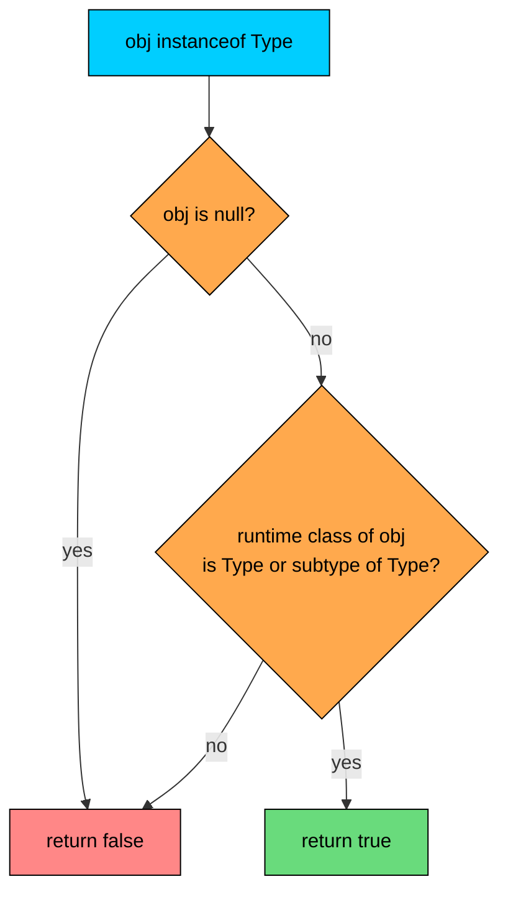
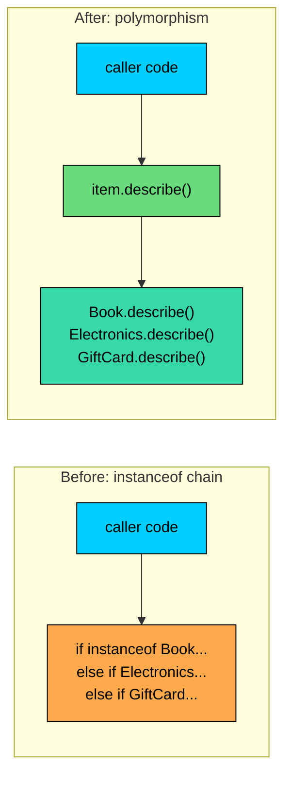

import React from 'react';
import CodeBlock from '../../../../components/ui/CodeBlock';
import Callout from '../../../../components/ui/Callout';

<div className="article-header">
  <div className="breadcrumb">
    <a href="/">Curated Notes</a>
    <span className="breadcrumb-separator">›</span>
    <span className="breadcrumb-current">instanceof Operator</span>
  </div>
  <h1>instanceof Operator</h1>
  <p style={{ color: 'var(--text-muted)', fontSize: '1.1rem', marginBottom: '16px', lineHeight: '1.6' }}>
    Master the essentials of instanceof Operator in this curated guide.
  </p>
  <div className="meta-info">
    <span className="meta-item">
      <svg width="14" height="14" viewBox="0 0 24 24" fill="none" stroke="currentColor" strokeWidth="2"><circle cx="12" cy="12" r="10"/><polyline points="12 6 12 12 16 14"/></svg>
      10 min read
    </span>
    <span className="difficulty-badge difficulty-badge--intermediate">Intermediate</span>
  </div>
</div>

<section className="content-section">

The `instanceof` operator checks whether a reference points to an object of a particular kind, inside an `equals` method, inside a defensive type check, anywhere that question needs an answer. This lesson covers the operator properly: how it works, the pattern-matching form added in Java 16 that removes the redundant cast, and why a long chain of `instanceof` checks is usually a signal that method overriding fits better.

---

## What `instanceof` Returns

The `instanceof` operator takes a reference on the left and a type on the right. It returns `true` when the reference points to an object of that type or any subtype, and `false` otherwise.


```java
public class InstanceofBasics {
    public static void main(String[] args) {
        Product item = new Book("Effective Java", 39.99, "Joshua Bloch");

        System.out.println("item instanceof Book:     " + (item instanceof Book));
        System.out.println("item instanceof Product:  " + (item instanceof Product));
        System.out.println("item instanceof Object:   " + (item instanceof Object));
        System.out.println("item instanceof Electronics: " + (item instanceof Electronics));
    }
}

class Product {
    String name;
    double price;
    Product(String name, double price) {
        this.name = name;
        this.price = price;
    }
}

class Book extends Product {
    String author;
    Book(String name, double price, String author) {
        super(name, price);
        this.author = author;
    }
}

class Electronics extends Product {
    int warrantyMonths;
    Electronics(String name, double price, int warrantyMonths) {
        super(name, price);
        this.warrantyMonths = warrantyMonths;
    }
}
```


The `item` reference is declared as `Product` but the object it points to is actually a `Book`. `instanceof Book` is `true` because that's the object's runtime type. `instanceof Product` is `true` because `Book` extends `Product`. `instanceof Object` is `true` because every reference type in Java ends up at `Object`. `instanceof Electronics` is `false` because a `Book` and an `Electronics` are sibling types, neither is a subtype of the other.

The compiler also enforces a sanity rule at the type level. If the declared type on the left and the type on the right have no possible subtype relationship, the check is rejected outright.


```java
Book book = new Book("Effective Java", 39.99, "Joshua Bloch");
boolean weird = book instanceof Electronics; // compile error: incompatible types
```


A `Book` reference can never point to an `Electronics` object, so the compiler refuses to even ask. This catches a class of bugs before they reach runtime.

The evaluation as a flowchart:





The diagram shows the operator's two-step decision. First it filters out `null`. Then it asks whether the object's actual runtime class matches the requested type or any of its subtypes. The result is always a `boolean`, never an exception.

---

## `null` Is Never an Instance

A `null` reference doesn't point to any object, so it isn't an instance of anything. The operator handles this case automatically. There is no `NullPointerException` to worry about.


```java
public class NullSafety {
    public static void main(String[] args) {
        Product missing = null;

        System.out.println("null instanceof Product: " + (missing instanceof Product));
        System.out.println("null instanceof Book:    " + (missing instanceof Book));
        System.out.println("null instanceof Object:  " + (missing instanceof Object));
    }
}

class Product {
    String name;
}

class Book extends Product {}
```


Every check on `null` returns `false`, including `instanceof Object`. This is one of the rare places in Java where a `null` doesn't throw an exception. The practical consequence is that `if (obj instanceof Product)` works without first checking that `obj` is non-null. The check itself covers both cases.

This null-safety is the main reason `instanceof` is the right defensive check before casting. Casting a `null` to a specific type compiles and runs (the result is a `null` of that type), but the moment a method is called on it, a `NullPointerException` fires. An `instanceof` check first stops both the type mismatch case and the null case in one expression.

---

## The Classic Pattern: Check Then Cast

Before Java 16, the standard use of `instanceof` looked like this: ask if the object is the desired type, and if so, cast the reference to that type to call methods specific to it.


```java
public class CheckThenCast {
    public static void main(String[] args) {
        Product[] catalog = {
            new Book("Effective Java", 39.99, "Joshua Bloch"),
            new Electronics("Wireless Mouse", 24.99, 12),
            new GiftCard("BIRTHDAY-25", 50.0)
        };

        for (Product item : catalog) {
            describe(item);
        }
    }

    public static void describe(Product item) {
        if (item instanceof Book) {
            Book book = (Book) item;
            System.out.println("Book by " + book.author + ", $" + book.price);
        } else if (item instanceof Electronics) {
            Electronics electronics = (Electronics) item;
            System.out.println("Electronics with " + electronics.warrantyMonths
                + "-month warranty, $" + electronics.price);
        } else if (item instanceof GiftCard) {
            GiftCard card = (GiftCard) item;
            System.out.println("Gift card with $" + card.balance + " remaining");
        }
    }
}

class Product {
    String name;
    double price;
    Product(String name, double price) {
        this.name = name;
        this.price = price;
    }
}

class Book extends Product {
    String author;
    Book(String name, double price, String author) {
        super(name, price);
        this.author = author;
    }
}

class Electronics extends Product {
    int warrantyMonths;
    Electronics(String name, double price, int warrantyMonths) {
        super(name, price);
        this.warrantyMonths = warrantyMonths;
    }
}

class GiftCard extends Product {
    double balance;
    GiftCard(String code, double balance) {
        super(code, balance);
        this.balance = balance;
    }
}
```


The shape is always the same: check, then cast, then use. The check asks "is this a `Book`?" and then, inside the branch where the answer is already known to be yes, the code casts to `Book` anyway. The compiler can't carry the information from the `instanceof` check into the body of the `if` block on its own, so the type name appears twice.

This redundancy isn't just stylistic. The cast can technically fail. An accidental cast of `item` to `Electronics` inside the `Book` branch would compile because the cast looks valid to the type system; the bug only surfaces at runtime when a `ClassCastException` fires. Repeating the type name in two places is exactly the kind of thing humans get wrong.

Java 16 fixed this.

---

## Pattern Matching for `instanceof` (Java 16+)

Pattern matching for `instanceof` combines the test and the cast into a single expression. A **pattern variable** is named right after the type, and that variable is in scope wherever the check is known to be `true`.


```java
// Requires Java 16 or later
public class PatternMatching {
    public static void main(String[] args) {
        Product[] catalog = {
            new Book("Effective Java", 39.99, "Joshua Bloch"),
            new Electronics("Wireless Mouse", 24.99, 12),
            new GiftCard("BIRTHDAY-25", 50.0)
        };

        for (Product item : catalog) {
            describe(item);
        }
    }

    public static void describe(Product item) {
        if (item instanceof Book book) {
            System.out.println("Book by " + book.author + ", $" + book.price);
        } else if (item instanceof Electronics electronics) {
            System.out.println("Electronics with " + electronics.warrantyMonths
                + "-month warranty, $" + electronics.price);
        } else if (item instanceof GiftCard card) {
            System.out.println("Gift card with $" + card.balance + " remaining");
        }
    }
}

class Product {
    String name;
    double price;
    Product(String name, double price) {
        this.name = name;
        this.price = price;
    }
}

class Book extends Product {
    String author;
    Book(String name, double price, String author) {
        super(name, price);
        this.author = author;
    }
}

class Electronics extends Product {
    int warrantyMonths;
    Electronics(String name, double price, int warrantyMonths) {
        super(name, price);
        this.warrantyMonths = warrantyMonths;
    }
}

class GiftCard extends Product {
    double balance;
    GiftCard(String code, double balance) {
        super(code, balance);
        this.balance = balance;
    }
}
```


`item instanceof Book book` does two things in one go. The first half tests whether `item` is a `Book`. The second half declares `book` as a new variable of type `Book` that holds the same reference. Inside the `if` body, `book` is used directly. No cast, no second mention of the type name.

The cast can't be wrong because the compiler generated it. Changing `Book` to `Electronics` in the declaration types the variable as `Electronics` and exposes only `Electronics` fields. The compiler keeps the test and the cast in sync.

Pattern matching for `instanceof` was a preview feature in Java 14 and 15 and became standard in Java 16. Any project on Java 16 or higher should prefer the pattern-matching form.

Pattern matching for `instanceof` compiles to the same bytecode as a manual check-and-cast. There's no runtime overhead. The benefit is at the source level: less code, no mismatched type names, no `ClassCastException` from a wrong cast inside the branch.

---

## Pattern Variable Scope and Flow Typing

The pattern variable is only in scope where the compiler can prove the check succeeded. The rules sound complicated when written down, but they match the natural English reading of the code.

Inside the true branch of a plain `if`, the variable is in scope:


```java
if (item instanceof Book book) {
    System.out.println(book.author); // ok
}
// book is not in scope here
```


After a `&&` in the same condition, the variable is in scope:


```java
if (item instanceof Book book && book.author.startsWith("J")) {
    System.out.println(book.author);
}
```


The second half of the `&&` is only evaluated when the first half is `true`, so `book` is guaranteed to be a real `Book` reference there.

After `||`, the variable is **not** in scope, because the right side runs when the left side was `false`, meaning the check didn't succeed:


```java
if (item instanceof Book book || book.author.startsWith("J")) { // compile error
    // ...
}
```


The most useful case is the negation pattern. If the `if` test is `!(item instanceof Book book)` and the branch returns or throws, the compiler knows that any code after the `if` only runs when `item` **is** a `Book`. The pattern variable is in scope after the block.


```java
// Requires Java 16 or later
public class NegationPattern {
    public static void main(String[] args) {
        Product item = new Book("Effective Java", 39.99, "Joshua Bloch");
        printAuthor(item);

        Product other = new Electronics("Mouse", 24.99, 12);
        printAuthor(other);
    }

    public static void printAuthor(Product item) {
        if (!(item instanceof Book book)) {
            System.out.println(item.name + " is not a book.");
            return;
        }
        System.out.println("Author of " + book.name + ": " + book.author);
    }
}

class Product {
    String name;
    double price;
    Product(String name, double price) {
        this.name = name;
        this.price = price;
    }
}

class Book extends Product {
    String author;
    Book(String name, double price, String author) {
        super(name, price);
        this.author = author;
    }
}

class Electronics extends Product {
    int warrantyMonths;
    Electronics(String name, double price, int warrantyMonths) {
        super(name, price);
        this.warrantyMonths = warrantyMonths;
    }
}
```


After the `return`, any code that runs must have passed the check, so `book` is safe to use. This is called **flow typing**: the compiler tracks where a check is known to be `true` and makes the pattern variable usable in exactly those places.

This pattern is common in real code. Validate at the top of the method, return or throw early when the input doesn't fit, then use the bound pattern variable through the rest of the method body.

---

## `instanceof` in `equals` Implementations

`instanceof` shows up most naturally inside `equals`. The contract for `equals(Object other)` requires accepting any `Object` reference and returning `false` for anything that isn't the right type. That's exactly what `instanceof` is built for.

Before pattern matching, the idiom looked like this:


```java
@Override
public boolean equals(Object other) {
    if (!(other instanceof Customer)) {
        return false;
    }
    Customer that = (Customer) other;
    return this.email.equals(that.email);
}
```


Two lines of boilerplate at the top, the same type name written twice, an explicit cast. Pattern matching collapses it.


```java
// Requires Java 16 or later
public class CustomerEquality {
    public static void main(String[] args) {
        Customer alice1 = new Customer("Alice", "alice@example.com");
        Customer alice2 = new Customer("A. Smith", "alice@example.com");
        Customer bob = new Customer("Bob", "bob@example.com");

        System.out.println("alice1.equals(alice2): " + alice1.equals(alice2));
        System.out.println("alice1.equals(bob):    " + alice1.equals(bob));
        System.out.println("alice1.equals(\"alice@example.com\"): " + alice1.equals("alice@example.com"));
        System.out.println("alice1.equals(null):   " + alice1.equals(null));
    }
}

class Customer {
    String name;
    String email;

    Customer(String name, String email) {
        this.name = name;
        this.email = email;
    }

    @Override
    public boolean equals(Object other) {
        if (!(other instanceof Customer that)) {
            return false;
        }
        return this.email.equals(that.email);
    }

    @Override
    public int hashCode() {
        return email.hashCode();
    }
}
```


The `!(other instanceof Customer that)` form does three things at once. It rejects anything that isn't a `Customer`, it rejects `null` (because `null instanceof X` is `false`), and it binds `that` as a `Customer` for the rest of the method.

This is the modern idiom for `equals`. Pattern matching writes the type guard at the top of the method in a single line.

---

## When to Use Polymorphism Instead

A long chain of `instanceof` checks dispatching on type is usually a smell. The reason: every time a new subtype is added, every chain needs a new branch. Forgetting one branch produces wrong behavior, because the new type falls through to whatever the last `else` does.

Consider the `describe` method from earlier. Each branch handles one subtype and calls fields specific to it. The natural Java fix is to move the per-type behavior into an overridable method on the parent class. Each subtype defines its own version, and the caller invokes the method without caring which subtype is on the other end.

With `instanceof` chain dispatch:


```java
// Requires Java 16 or later
public class InstanceofDispatch {
    public static void main(String[] args) {
        Product[] catalog = {
            new Book("Effective Java", 39.99, "Joshua Bloch"),
            new Electronics("Wireless Mouse", 24.99, 12),
            new GiftCard("BIRTHDAY-25", 50.0)
        };

        for (Product item : catalog) {
            System.out.println(describe(item));
        }
    }

    public static String describe(Product item) {
        if (item instanceof Book book) {
            return "Book by " + book.author + ", $" + book.price;
        } else if (item instanceof Electronics electronics) {
            return "Electronics with " + electronics.warrantyMonths
                + "-month warranty, $" + electronics.price;
        } else if (item instanceof GiftCard card) {
            return "Gift card with $" + card.balance + " remaining";
        }
        throw new IllegalArgumentException("Unknown product type");
    }
}

class Product {
    String name;
    double price;
    Product(String name, double price) {
        this.name = name;
        this.price = price;
    }
}

class Book extends Product {
    String author;
    Book(String name, double price, String author) {
        super(name, price);
        this.author = author;
    }
}

class Electronics extends Product {
    int warrantyMonths;
    Electronics(String name, double price, int warrantyMonths) {
        super(name, price);
        this.warrantyMonths = warrantyMonths;
    }
}

class GiftCard extends Product {
    double balance;
    GiftCard(String code, double balance) {
        super(code, balance);
        this.balance = balance;
    }
}
```


After, with method overriding:


```java
public class PolymorphicDispatch {
    public static void main(String[] args) {
        Product[] catalog = {
            new Book("Effective Java", 39.99, "Joshua Bloch"),
            new Electronics("Wireless Mouse", 24.99, 12),
            new GiftCard("BIRTHDAY-25", 50.0)
        };

        for (Product item : catalog) {
            System.out.println(item.describe());
        }
    }
}

class Product {
    String name;
    double price;
    Product(String name, double price) {
        this.name = name;
        this.price = price;
    }

    public String describe() {
        return name + ", $" + price;
    }
}

class Book extends Product {
    String author;
    Book(String name, double price, String author) {
        super(name, price);
        this.author = author;
    }

    @Override
    public String describe() {
        return "Book by " + author + ", $" + price;
    }
}

class Electronics extends Product {
    int warrantyMonths;
    Electronics(String name, double price, int warrantyMonths) {
        super(name, price);
        this.warrantyMonths = warrantyMonths;
    }

    @Override
    public String describe() {
        return "Electronics with " + warrantyMonths + "-month warranty, $" + price;
    }
}

class GiftCard extends Product {
    double balance;
    GiftCard(String code, double balance) {
        super(code, balance);
        this.balance = balance;
    }

    @Override
    public String describe() {
        return "Gift card with $" + balance + " remaining";
    }
}
```


Two things change. The caller now writes `item.describe()`, with no awareness of subtypes. And adding a new subtype, say `Subscription`, doesn't require touching the dispatch site at all. A new class that extends `Product` and overrides `describe` is enough; every loop that calls `describe` automatically picks up the new behavior.

The shape of the refactor as a diagram:





The diagram shows what moved. With the chain, the caller carried the responsibility of knowing every subtype. With polymorphism, the dispatch happens automatically through method override. The caller no longer enumerates the cases.

When does `instanceof` chain dispatch still make sense?


| Situation | Use `instanceof` chain | Use polymorphism |
| --- | --- | --- |
| Code owns all the subtypes and can add methods to them | No | Yes |
| The types come from a library (no ownership) | Yes | Not possible |
| The behavior is specific to one external caller and shouldn't pollute the type | Yes | No |
| The set of cases is a sealed family and exhaustive switch is needed | Switch over the sealed type | Either works |
| New cases are added frequently and every chain breaking is unacceptable | No | Yes |


The main factor is type ownership. When the parent class and all its subtypes are part of the same codebase, adding a method, overriding it where needed, and letting the language route calls is the better path. If the types come from outside that control, no method can be added to them, and `instanceof` is the only option.

A rule of thumb: four or more `instanceof` branches dispatching on subtype is a sign that a method on the parent class would do the job better.

---

## A Peek at Pattern Matching for `switch` (Java 21+)

Java 21 finalized pattern matching for `switch`, which extends the same idea from `if` to `switch`. Instead of comparing values, a switch can match on types, and each case binds a pattern variable just like `instanceof` does.

A short preview of the shape:


```java
// Requires Java 21 or later
public class SwitchPatternsPeek {
    public static void main(String[] args) {
        Product[] catalog = {
            new Book("Effective Java", 39.99, "Joshua Bloch"),
            new Electronics("Wireless Mouse", 24.99, 12),
            new GiftCard("BIRTHDAY-25", 50.0)
        };

        for (Product item : catalog) {
            System.out.println(describe(item));
        }
    }

    public static String describe(Product item) {
        return switch (item) {
            case Book book              -> "Book by " + book.author + ", $" + book.price;
            case Electronics electronics -> "Electronics with " + electronics.warrantyMonths
                                            + "-month warranty, $" + electronics.price;
            case GiftCard card          -> "Gift card with $" + card.balance + " remaining";
            default                      -> "Other product: " + item.name;
        };
    }
}

class Product {
    String name;
    double price;
    Product(String name, double price) {
        this.name = name;
        this.price = price;
    }
}

class Book extends Product {
    String author;
    Book(String name, double price, String author) {
        super(name, price);
        this.author = author;
    }
}

class Electronics extends Product {
    int warrantyMonths;
    Electronics(String name, double price, int warrantyMonths) {
        super(name, price);
        this.warrantyMonths = warrantyMonths;
    }
}

class GiftCard extends Product {
    double balance;
    GiftCard(String code, double balance) {
        super(code, balance);
        this.balance = balance;
    }
}
```


The structure of this switch matches the `instanceof` chain almost exactly, but the syntax reads better and the compiler can check that every case is covered when the parent type is sealed. A sealed parent plus a pattern-matching switch is the modern Java idiom for closed case families.

Even with pattern-matching switch available, the polymorphism advice still holds. If the behavior naturally belongs to the type, a method on the type is cleaner than any switch. Switch is appropriate when the caller's logic is the right place for the case split, or when the types are not under the caller's control.

---

## A Note on Generics

One last edge case. `instanceof` works with classes, abstract classes, and interfaces, but it does **not** work with generic type arguments like `List<String>`. This compiles:


```java
Object value = new java.util.ArrayList<String>();
boolean isList = value instanceof java.util.List; // ok
```


This does not:


```java
boolean isStringList = value instanceof java.util.List<String>; // compile error
```


The reason is **type erasure**: at runtime, the JVM only knows `value` is a `List`, not a `List<String>`. The generic information is erased after compilation, so there's no way to check it. The rule: `instanceof` checks the raw class, not the parameterized type.

An unbounded wildcard makes the erasure explicit:


```java
boolean isAnyList = value instanceof java.util.List<?>; // ok
```


That's accepted because `List<?>` is the erased shape and matches the runtime fact.

</section>
