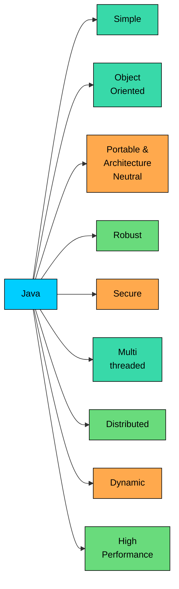

import React from 'react';
import CodeBlock from '../../../../components/ui/CodeBlock';
import Callout from '../../../../components/ui/Callout';

<div className="article-header">
  <div className="breadcrumb">
    <a href="/">Curated Notes</a>
    <span className="breadcrumb-separator">›</span>
    <span className="breadcrumb-current">Features of Java</span>
  </div>
  <h1>Features of Java</h1>
  <p style={{ color: 'var(--text-muted)', fontSize: '1.1rem', marginBottom: '16px', lineHeight: '1.6' }}>
    Master the essentials of Features of Java in this curated guide.
  </p>
  <div className="meta-info">
    <span className="meta-item">
      <svg width="14" height="14" viewBox="0 0 24 24" fill="none" stroke="currentColor" strokeWidth="2"><circle cx="12" cy="12" r="10"/><polyline points="12 6 12 12 16 14"/></svg>
      10 min read
    </span>
    <span className="difficulty-badge difficulty-badge--intermediate">Intermediate</span>
  </div>
</div>

<section className="content-section">

Java earned its place in banks, online stores, streaming services, and Android phones because of a specific set of design choices. This chapter walks through those defining features one by one, and explains why each one made Java the default pick for so much of common software today. This is a tour, not a deep dive. The mechanics behind several of these features get full chapters of their own later in the course.

---

## The Big Picture





Each branch is a separate design goal the language and its runtime were built around. Some of them are language-level (syntax, type system). Some of them live in the JVM (garbage collection, JIT). A few are really about the standard library (threads, sockets, reflection). Together, they're what "Java" usually refers to.

---

## Simple

**Simple** here means easy to pick up for someone with C or C++ experience, with fewer error-prone features. The Java team kept the curly-brace syntax, the `if`/`for`/`while` keywords, and the general feel of C-family languages, but removed the parts that caused the most pain in practice.

The big removals were manual memory management and explicit pointers. In C++, `new` requires a matching `delete`. Forget it and the program leaks memory. Free it twice and the program crashes. Java takes that whole category of bugs off the table by managing memory through garbage collection (more on that under _Robust_). It also drops multiple inheritance of classes, operator overloading, and a handful of other features that tend to make codebases hard to reason about.

Why this matters: a service that processes online orders all day shouldn't have half its bug reports about freed memory or dangling pointers. Java pushes the focus toward the domain (carts, customers, payments) instead of low-level memory layout.

---

## Object-Oriented

**Object-oriented** means Java models the world as objects that hold data and expose behavior. A `Product` object knows its name and price. A `Cart` object knows the products it holds and how to compute a total. An `Order` object knows its status and which customer placed it. Code is organized into classes, classes are organized into packages, and the four classical OOP ideas, encapsulation, inheritance, polymorphism, and abstraction, all show up as first-class language features.

This chapter doesn't teach OOP. The relevant detail here is that Java was designed around objects from the start. Even a trivial program is a class with a `main` method. There's no "and then someone bolted classes on later" story like some older languages have.

Why this matters: large e-commerce systems have hundreds of related concepts (product, variant, cart, coupon, shipment, refund). Modeling them as objects with clear responsibilities scales better than a pile of loose functions and shared state.

---

## Platform Independent and Architecture Neutral

This is the feature Java is most famous for: **write once, run anywhere**. Source code compiles into bytecode, a hardware-agnostic intermediate format, and the same bytecode runs on any machine that has a JVM. Linux, Windows, macOS, x86, ARM, doesn't matter. The JVM is the part that's specific to the operating system and CPU; the code isn't.

**Architecture neutral** is the runtime-side reflection of the same idea. Bytecode doesn't bake in assumptions about pointer size, byte order, or native integer width. The JVM hides those details from the program.

The takeaway for this chapter: the same `OrderProcessor.class` file built on a laptop runs on a Linux server in production without recompilation. That's a big reason Java spread so widely in the enterprise.

---

## Robust

**Robust** means Java goes out of its way to catch problems early and to keep small bugs from turning into crashes. Three design choices carry most of the weight here.

First, **strong static typing.** Every variable has a declared type, and the compiler checks correct usage before the program ever runs. Assigning a `String` to an `int` variable fails the build. The bug never ships to production.

Second, **automatic garbage collection.** The JVM tracks which objects are still reachable and reclaims the ones that aren't. There's no `free()` or `delete` call. Use-after-free and double-free, two of the most common sources of crashes in C and C++, simply don't exist in normal Java code.

Third, **structured exception handling.** When something goes wrong (a missing file, a bad input, a network timeout), Java raises an exception instead of corrupting memory or returning a magic value like `-1`. The compiler even forces handling or declaration of certain exceptions, so they can't be quietly ignored.

The last point in action. Consider parsing a price the user typed in. If they type something that isn't a number, the program shouldn't crash.


```java
public class PriceParser {
    public static void main(String[] args) {
        String userInput = "twenty";
        double price;

        try {
            price = Double.parseDouble(userInput);
            System.out.println("Parsed price: $" + price);
        } catch (NumberFormatException e) {
            System.out.println("That's not a valid price. Using $0.00.");
            price = 0.0;
        }

        System.out.println("Final price: $" + price);
    }
}
```


The `try`/`catch` block turns a potential crash into a controlled fallback. The philosophy: errors are values the language helps handle, not silent failures that bring the whole process down.

---

## Secure

**Secure** is more nuanced than "Java has no pointers". It's a layered story.

At the language level, Java doesn't expose explicit pointer arithmetic. There's no way to compute an address, offset into it, and read whatever's there. References to objects are managed by the JVM, and the only operations allowed are what the language permits: call methods, read fields, assign to compatible types. That alone closes off whole categories of memory-corruption attacks.

At the JVM level, the **bytecode verifier** inspects every class as it loads. It checks that the bytecode is well-formed, that the stack operations make sense, that types match where they're supposed to, and that the code doesn't try to forge access to private members. Malformed or tampered bytecode is rejected before a single instruction runs.

Java also runs untrusted code in a controlled environment using the **class loader** hierarchy and (historically) the **security manager**. Classes loaded from different sources can be kept separate, and policies can restrict what they're allowed to do, such as opening sockets or reading files. The security manager is being phased out in modern Java in favor of newer isolation techniques, but the layered idea of "verify, then load, then restrict" is still very much how the platform is designed.

Why this matters: an online store that takes file uploads or runs plugins from third parties needs a runtime that won't let a malformed input rewrite arbitrary memory.

---

## Multithreaded

Java had threads baked into the language from version 1.0, which was unusual at the time. The `Thread` class and the `Runnable` interface support spinning up concurrent work directly, and the `synchronized` keyword provides a built-in way to protect shared state. Newer additions like the `java.util.concurrent` package (thread pools, locks, atomic variables, concurrent collections) and virtual threads (Java 21) make high-concurrency code far easier to write than it used to be.

This chapter doesn't teach threads. The headline: concurrency isn't a third-party add-on in Java. It's part of the standard library.

Why this matters: a real e-commerce backend serves many customers at once. Browsing products, adding to cart, checking out, and processing payments happen in parallel. A language with strong concurrency primitives supports writing that server without reinventing the wheel.

---

## Distributed

**Distributed** means Java was designed with the assumption that programs would talk to other programs across a network. The standard library ships with everything needed for that.

`java.net` provides plain TCP and UDP sockets. `java.net.http` provides a modern HTTP client (since Java 11) for calling REST APIs without bringing in a third-party library. Historically there was also **RMI** (Remote Method Invocation), which let one JVM call methods on objects living in another JVM. RMI isn't used much in new code anymore (HTTP and gRPC won that race), but the design intent shows: networking was a first-class concern, not an afterthought.

Why this matters: when an order service needs to call the inventory service, or a storefront needs to fetch shipping rates from a carrier's API, the JDK already ships with the necessary tools.

---

## Dynamic

**Dynamic** means Java can do significant work at runtime that other languages have to do at compile time. Two capabilities matter most.

The first is **dynamic class loading.** Classes are loaded by the JVM the first time they're referenced, not when the program starts. That's what makes plugin systems possible: a new `.class` or `.jar` dropped into the right place can be picked up by the running JVM without restarting the process.

The second is **reflection.** Reflection (in `java.lang.reflect`) allows a program to inspect classes, fields, methods, and annotations at runtime, and even call methods or create objects without knowing their types at compile time. Frameworks like Spring, Hibernate, and JUnit lean heavily on reflection to wire up code, map objects to database rows, and discover test methods.

Why this matters: most of the productivity Java engineers get from frameworks comes from dynamic features. When Spring scans code and decides which classes are services and which are controllers, that's reflection at work.

---

## High Performance

Old jokes about Java being slow stopped being true a long time ago. The reason is the **JIT compiler**: as a program runs, the JVM watches which methods get called the most, then compiles their bytecode to native machine code on the fly. After a short warm-up, hot code paths run at near-native speed.

There's more going on internally (escape analysis, inlining, modern garbage collectors like G1 and ZGC that keep pause times tiny), but JIT compilation is the headline.

Why this matters: a checkout endpoint that runs ten million times a day benefits from a runtime that gets faster as it warms up. The same JVM that runs the code on day one is the one optimizing it on day two.

---

## A Summary Table


| Feature | What It Means | Why It Matters |
| --- | --- | --- |
| Simple | C-family syntax, no manual memory management, fewer error-prone features | Less time fighting the language, more time modeling the domain |
| Object-Oriented | Code organized around classes and objects | Scales to complex domains like e-commerce or banking |
| Platform Independent | Bytecode runs on any JVM | Build on a laptop, deploy on any server |
| Architecture Neutral | Bytecode doesn't assume CPU, byte order, or word size | One artifact runs across x86, ARM, and beyond |
| Robust | Static typing, garbage collection, exception handling | Bugs caught early, fewer crashes in production |
| Secure | No pointer arithmetic, bytecode verifier, class loader isolation | Safer to run untrusted code and harder to corrupt memory |
| Multithreaded | Built-in threads, `synchronized`, `java.util.concurrent`, virtual threads | Servers can handle many users at once without third-party libraries |
| Distributed | Sockets, HTTP client, RMI in the standard library | Network calls are a first-class concern, not a bolt-on |
| Dynamic | Classes loaded at runtime, reflection on every type | Plugins, dependency injection, ORM frameworks, test discovery |
| High Performance | JIT compilation, modern garbage collectors | Hot code paths run near native speed after warm-up |


</section>
