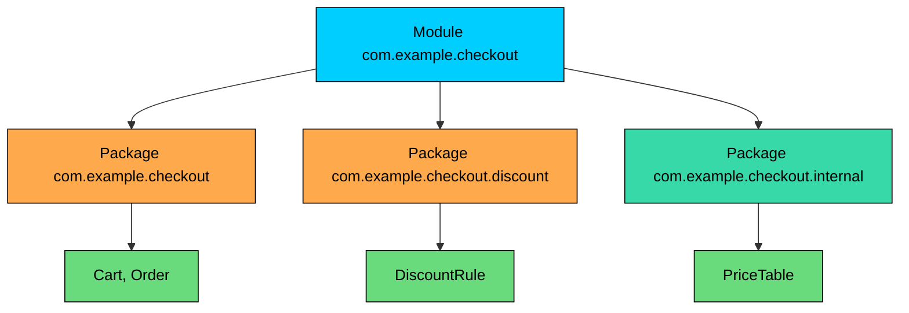
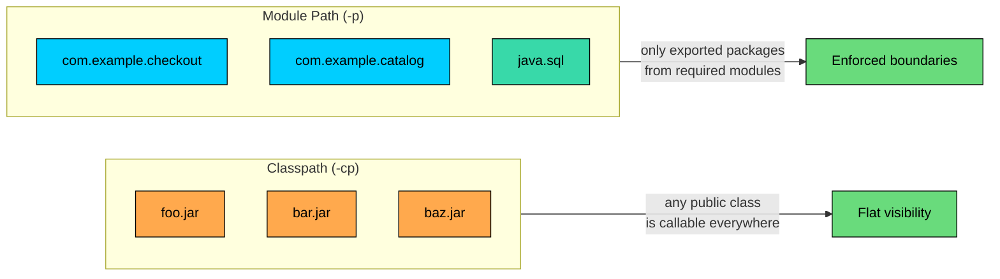
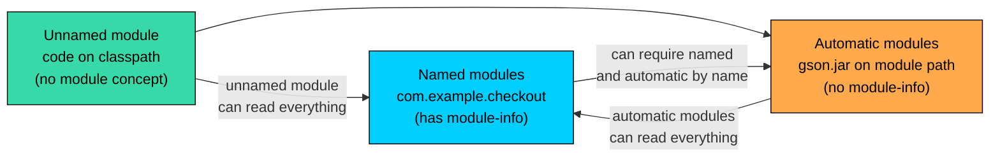
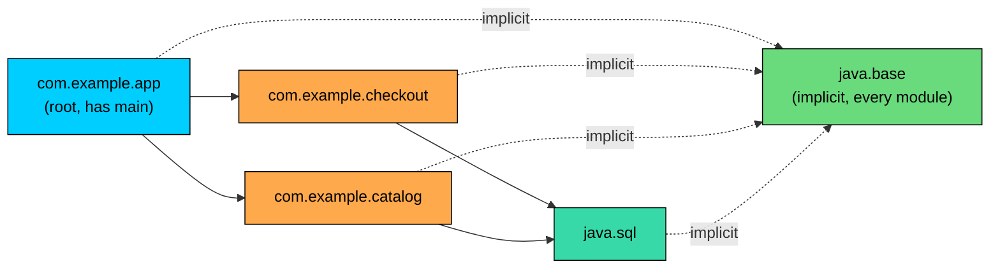

import React from 'react';
import CodeBlock from '../../../../components/ui/CodeBlock';
import Callout from '../../../../components/ui/Callout';

<div className="article-header">
  <div className="breadcrumb">
    <a href="/">Curated Notes</a>
    <span className="breadcrumb-separator">›</span>
    <span className="breadcrumb-current">Java Modules (JPMS)</span>
  </div>
  <h1>Java Modules (JPMS)</h1>
  <p style={{ color: 'var(--text-muted)', fontSize: '1.1rem', marginBottom: '16px', lineHeight: '1.6' }}>
    Master the essentials of Java Modules (JPMS) in this curated guide.
  </p>
  <div className="meta-info">
    <span className="meta-item">
      <svg width="14" height="14" viewBox="0 0 24 24" fill="none" stroke="currentColor" strokeWidth="2"><circle cx="12" cy="12" r="10"/><polyline points="12 6 12 12 16 14"/></svg>
      10 min read
    </span>
    <span className="difficulty-badge difficulty-badge--intermediate">Intermediate</span>
  </div>
</div>

<section className="content-section">

Java 9 introduced the **Java Platform Module System (JPMS)**, the largest structural change to the language since generics. Packages group related classes, but they have always lived in a flat world where any `public` class from any JAR can be called from anywhere else. JPMS adds a layer above packages that lets a library say what it exports, what it depends on, and what stays internal. This lesson covers what a module is, the problems it solves, how modules differ from JARs and packages, the three kinds of modules a Java program can contain, and how to compile and run a minimal module from the command line.

---

## The Problems JPMS Was Built to Solve

Before Java 9, the runtime had a single mechanism for finding code: the **classpath**. The classpath is a flat, ordered list of JAR files and directories. The JVM searches it from left to right and uses the first class it finds with the matching fully qualified name. That model is easy to explain, but it leaks three specific kinds of pain that any non-trivial application eventually hits.

The first is **classpath hell**. Two JARs on the classpath can contain the same class. The JVM picks one and silently ignores the other. Two libraries can demand incompatible versions of a third library and there is no language-level way to say so. A missing transitive dependency does not fail at startup; it fails at the exact moment the missing class is first touched, often deep inside a running request. Classpath problems are runtime problems, and they tend to surface in production.

The second is **weak encapsulation**. The `public` keyword does only one thing in pre-module Java: it makes a class or member visible to every other class everywhere. There is no way to write a `public` class that some packages can call and others cannot. Internal helper classes inside a library are reachable by any consumer who knows their fully qualified name. Library authors document "do not use this package" in JavaDoc, and consumers use it anyway because the compiler does not stop them. When the library refactors the internal package, consumer code breaks.

The third is the **monolithic JDK**. Before Java 9, the JDK was a single shared blob: `rt.jar`, several megabytes of classes loaded into every Java process regardless of whether the program used Swing, CORBA, or the XML stack. A "hello world" program loaded the same runtime as a Swing GUI. Splitting the JDK into modules made it possible to ship runtime images that contain only the platform pieces an application actually needs.

JPMS gives the platform vocabulary to talk about all three problems. A module declares what it depends on, what it exports, and what stays internal. The compiler and runtime check those declarations. Missing dependencies become startup-time errors instead of runtime mysteries. `public` becomes a meaningful access level again, because a class is `public` only to modules that the owning module agrees to export it to. And the JDK itself is now around ninety modules, so a runtime image can include just the parts it needs.

---

## Modules, JARs, and Packages

The three terms get used interchangeably in casual conversation, but they sit at three different layers.


| Layer | What It Is | Example |
| --- | --- | --- |
| Package | A namespace for related classes | `com.example.checkout` |
| JAR | A zip file that bundles compiled classes and resources | `checkout-1.2.jar` |
| Module | A named, self-describing unit of code with declared dependencies and exports | `com.example.checkout` |


A package holds classes. A JAR holds packages. A module describes one or more packages and is usually distributed as a single JAR with extra metadata. The module is the new layer; the package and the JAR existed before.

A module always has a name. The name is a dotted identifier and, by convention, matches the prefix of the packages it contains. The module `com.example.checkout` typically contains packages like `com.example.checkout`, `com.example.checkout.discount`, and `com.example.checkout.internal`. Choosing a globally unique reverse-domain name avoids collisions when modules from different vendors end up in the same application.





The diagram shows one module wrapping three packages. The first two packages are part of the module's public surface and are exported to consumers. The third is an internal package, kept inside the module and not callable from outside. Without modules, all three would be callable from anywhere. With modules, the boundary becomes enforceable.

---

## What Lives in a Module

A module has a small piece of metadata that names it and lists what it gives out and what it takes in. That metadata lives in a special file called `module-info.java`, written at the **root of the module source tree**, alongside the topmost packages.

A typical layout for a module called `com.example.checkout` looks like this:


```shell
checkout/
  src/
    com.example.checkout/
      module-info.java
      com/example/checkout/Cart.java
      com/example/checkout/Order.java
      com/example/checkout/internal/PriceTable.java
```


The outer `com.example.checkout/` directory is the module source directory. The compiler uses this directory name as the module name when the `--module-source-path` option is used. Inside it, `module-info.java` is the descriptor file and the rest of the tree follows the normal package structure.

The minimal descriptor is short:


```java
module com.example.checkout {
    exports com.example.checkout;
    requires java.base;
}
```


This says three things. The module is named `com.example.checkout`. It exports the `com.example.checkout` package, which means classes in that package are visible to other modules. It requires `java.base`, the foundation module that contains `java.lang`, `java.util`, and the rest of the core. For this lesson, `exports` and `requires` are enough.

In practice, `requires java.base;` is implicit. Every module gets it automatically, just as every class implicitly extends `java.lang.Object`. The line can be omitted and the module still works.

---

## Module Path vs Classpath

The classpath did not go away in Java 9. JPMS introduced a parallel mechanism called the **module path**, and a JVM can load code from both at the same time. The two paths look similar at first glance but behave very differently.

The classpath is flat. The JVM sees a list of JARs and treats every public class in every JAR as equally callable. There are no boundaries.

The module path is structured. The JVM sees a list of modules. Each module knows its own name, its dependencies, and the packages it exports. The runtime resolves the dependency graph at startup and refuses to start if a required module is missing.





The classpath side shows three plain JARs, all of which contribute their public classes into a single shared namespace. The module path side shows three modules, each contributing only the packages it explicitly exports, and only to modules that explicitly require it.

On the command line, the classpath uses `-cp` (or `--class-path`) and the module path uses `-p` (or `--module-path`). Both can be given to the same `javac` or `java` invocation. Code on the classpath sees code on the module path through a fallback mechanism. Code on the module path follows strict modular rules.

---

## The Three Kinds of Modules

A running Java program can contain three different kinds of modules. They differ in whether they have a `module-info.java` file and where their code lives.

#### Named (Explicit) Modules

A **named module** has a `module-info.java` file. The compiler reads the descriptor, the runtime enforces the declared dependencies and exports, and the module gets the strong encapsulation that JPMS is designed for. Every platform module (`java.base`, `java.sql`, `java.xml`, and the rest) is a named module. Any module declared with a `module-info.java` is also a named module.

A named module is the default target when migrating a library to modules. It is the strictest of the three kinds and the one that gets the full benefit of the system.

#### Automatic Modules

An **automatic module** is a plain JAR placed on the module path without a `module-info.java`. The runtime treats it as a module so other named modules can depend on it, but it has no declared exports and no declared dependencies of its own.

The automatic module's name comes from one of two sources. If the JAR's `META-INF/MANIFEST.MF` includes an `Automatic-Module-Name` attribute, that string is the module name. Otherwise, the name is derived from the JAR file name by stripping the version suffix, replacing non-alphanumeric characters with dots, and removing trailing dots. A JAR called `gson-2.10.1.jar` becomes the module `gson`.

Because the JAR has no explicit declarations, an automatic module behaves permissively. It exports every package it contains. It can read every other module. This is the bridge that allows modular code to depend on libraries that have not yet adopted modules. A modern application can have a module-info that requires both `java.sql` (a named platform module) and `gson` (an automatic module wrapped around an old-style JAR).

#### The Unnamed Module

Code on the **classpath** is not in any explicit module. Instead, it lives in a single per-classloader pseudo-module called the **unnamed module**. The unnamed module is the bucket the JVM uses when there is no `module-info.java` to read.

The unnamed module reads every other module on the module path, including all the platform modules. That is why pre-Java-9 applications still run on a modern JVM: their classpath code is treated as one big unnamed module that can call into the JDK normally.

The reverse direction does not hold. A named module cannot directly `requires` the unnamed module. Named modules have to declare what they depend on by name, and the unnamed module does not have a name. This rule makes "move everything to modules gradually" more difficult than it sounds: a library that becomes a named module can no longer be required by code that has not yet declared itself a module, unless that code stays on the classpath.





The diagram captures the visibility rules. Named modules are strict: they only see what they explicitly require. Automatic modules and the unnamed module are loose: they see everything. The named-to-unnamed arrow does not exist.

---

## The Platform Modules

Java 9 split the JDK into named modules. The full list is around ninety, and the following command prints them:


```shell
java --list-modules
```


A small slice of the output looks like this:


```shell
java.base@21
java.compiler@21
java.datatransfer@21
java.desktop@21
java.logging@21
java.management@21
java.naming@21
java.net.http@21
java.sql@21
java.xml@21
jdk.compiler@21
jdk.jartool@21
```


The version after the `@` is the JDK version. `java.base` is special: every module implicitly requires it, the same way every class implicitly extends `Object`. The other `java.*` modules are platform features that used to be lumped into `rt.jar`: SQL drivers, XML parsers, GUI toolkit, and so on. The `jdk.*` modules are JDK-internal tools and APIs.

To inspect a single module's contract, the `--describe-module` option prints its descriptor:


```shell
java --describe-module java.sql
```


The output (trimmed for length) reads like a `module-info` written in shorthand:


```shell
java.sql@21
exports java.sql
exports javax.sql
requires java.logging transitive
requires java.transaction.xa transitive
requires java.xml transitive
requires java.base mandated
uses java.sql.Driver
```


The output uses the same vocabulary: `exports`, `requires`, `uses`, and a few more. The JDK eats its own cooking. Every standard library module follows the same rules user-written modules do.

---

## The Module Graph

When a Java program starts in module mode, the runtime resolves a **module graph**. The graph starts from the module that contains the `main` method, called the root module, and walks the `requires` relationships transitively. The result is the set of modules the application actually needs.

Consider a small application with three of its own modules and two platform modules.





The root `com.example.app` requires the two application modules. Both of those require `java.sql`. Every module silently requires `java.base`. The runtime computes this graph at startup. If any of the nodes is missing from the module path, the application fails to launch with a clear error, rather than failing with `NoClassDefFoundError` somewhere in the middle of the first request.

If two modules on the module path have the same name, resolution fails. If a module on the module path exports the same package as another module, resolution fails. The runtime detects these conflicts at startup, not at the moment of first use. That detection is one of the reasons JPMS exists.

---

## Strong Encapsulation in Practice

The most visible effect of modules on day-to-day Java code is what `public` means.

Inside a named module, `public class Cart` is visible to other classes in the same module, the way it always was. To a class in a different module, `Cart` is visible only if the module that owns it exports the package `Cart` lives in. A package not listed in `exports` is internal to the module, no matter how many `public` classes it contains.


```java
module com.example.checkout {
    exports com.example.checkout;
    // com.example.checkout.internal is NOT exported
}
```


With that descriptor, `com.example.checkout.Cart` is callable from any module that requires `com.example.checkout`. `com.example.checkout.internal.PriceTable` is not, even if it is declared `public`. A consumer that writes `import com.example.checkout.internal.PriceTable;` gets a compile error along the lines of `package com.example.checkout.internal is not visible`.

This is the change that gives library authors a working tool for separating their public API from their implementation. Before JPMS, the only options were JavaDoc warnings and naming conventions like `impl` and `internal`. Now the boundary is enforced by the compiler and the runtime.

One behavior to note: reflection respects module boundaries by default. Calling `setAccessible(true)` on a non-exported member of another module throws `InaccessibleObjectException` unless the owning module explicitly opens the package. The `opens` directive is how modules grant reflective access to specific consumers like serialization libraries.

---

## Compiling and Running a Minimal Module

The fastest way to build intuition is to compile and run a single-module "hello world" from the command line, without an IDE or build tool. The example uses one module with one class.

The source tree:


```shell
hello/
  src/
    com.example.hello/
      module-info.java
      com/example/hello/Main.java
```


The descriptor declares the module name. There are no exports because nothing depends on this module, and there are no explicit requires because `java.base` is implicit:


```java
module com.example.hello {
}
```


The class is a normal `main`-method program:


```java
package com.example.hello;

public class Main {
    public static void main(String[] args) {
        System.out.println("Hello from module " + Main.class.getModule().getName());
    }
}
```


Compile the module into an output directory called `out`.


```shell
javac -d out --module-source-path src $(find src -name "*.java")
```


The `--module-source-path src` flag tells `javac` that everything under `src` is organized as one or more module source directories. The shell expansion `$(find src -name "*.java")` passes every Java file in the tree to the compiler. After this runs, `out/` contains the compiled output organized by module name.

Run the program with `java`, pointing at the module path and naming the module and main class.


```shell
java -p out -m com.example.hello/com.example.hello.Main
```


The `-p out` flag is the short form of `--module-path out`. The `-m com.example.hello/com.example.hello.Main` flag is the short form of `--module com.example.hello/com.example.hello.Main`, and it tells the runtime "start the application by calling `main` on the `Main` class in the `com.example.hello` module."

The output is:


```shell
Hello from module com.example.hello
```


`Main.class.getModule().getName()` returns the module name the runtime resolved this class into. For a class on the classpath the same call would return `null` (or report the class as living in the unnamed module). For a class in a named module it returns the declared name.

The commands look more verbose than `javac Main.java && java Main`, and they are. In practice, build tools like Maven and Gradle drive `javac` and `java`, so these commands rarely get typed by hand after the first day. The exercise shows that JPMS is built into the compiler and the runtime themselves, not added through a separate tool.

---

## Benefits and Trade-offs

JPMS makes three things better and adds friction in a few places. Both halves matter.


| Benefit | What It Buys You |
| --- | --- |
| Reliable dependency resolution | Missing or duplicate modules fail at startup, not in the middle of a running request |
| Strong encapsulation | `public` in a non-exported package is no longer reachable from outside the module |
| Smaller runtime images | `jlink` can build a custom JRE containing only the modules an application needs |
| Faster startup and lower memory | The JVM can skip platform modules that are not part of the resolved graph |


The flip side:


| Trade-off | Why It Hurts |
| --- | --- |
| Reflection and serialization libraries need explicit `opens` | Frameworks that scan private fields fail with `InaccessibleObjectException` unless the module opens its packages |
| Split packages are forbidden | Two modules cannot both contain the same package, which breaks some legacy libraries that split a namespace across JARs |
| Migration is invasive | Every JAR an application depends on either becomes a named module, becomes an automatic module, or stays on the classpath. Mixing the three takes care. |
| Tooling churn | Older IDE plugins, code generators, and build configurations sometimes need updates to handle `module-info.java` correctly |


These trade-offs explain why many applications, especially older ones with deep dependency trees, still run on the classpath ten years after JPMS shipped. The classpath has not gone away and does not need to. JPMS provides the most value for library authors, for applications that ship as custom runtime images, and for codebases where access boundaries between teams matter. For a small service with a tight dependency set, the cost of adopting modules may be larger than the benefit.

The pragmatic middle ground many teams settle on: keep their own code on the classpath, let the JDK be modular (which it is, automatically), and adopt modules only when something concrete pushes them in that direction, like wanting a smaller container image through `jlink`.

</section>
