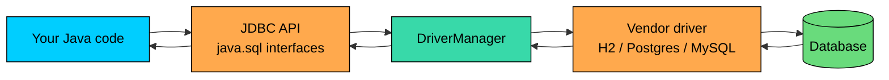
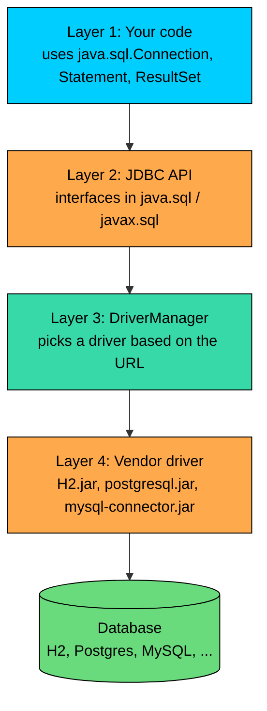
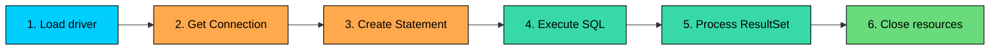

import React from 'react';
import CodeBlock from '../../../../components/ui/CodeBlock';
import Callout from '../../../../components/ui/Callout';

<div className="article-header">
  <div className="breadcrumb">
    <a href="/">Curated Notes</a>
    <span className="breadcrumb-separator">›</span>
    <span className="breadcrumb-current">JDBC Basics</span>
  </div>
  <h1>JDBC Basics</h1>
  <p style={{ color: 'var(--text-muted)', fontSize: '1.1rem', marginBottom: '16px', lineHeight: '1.6' }}>
    Master the essentials of JDBC Basics in this curated guide.
  </p>
  <div className="meta-info">
    <span className="meta-item">
      <svg width="14" height="14" viewBox="0 0 24 24" fill="none" stroke="currentColor" strokeWidth="2"><circle cx="12" cy="12" r="10"/><polyline points="12 6 12 12 16 14"/></svg>
      10 min read
    </span>
    <span className="difficulty-badge difficulty-badge--intermediate">Intermediate</span>
  </div>
</div>

<section className="content-section">

JDBC (Java Database Connectivity) is the standard Java API for talking to a relational database from Java code. This lesson covers what JDBC is, why it exists, the pieces involved when your program asks a database for data, and a complete first program that creates a table, inserts a product, and reads it back. The rest of this section unpacks each piece in depth; this lesson is the map.


&gt; **INFO**
&gt;
&gt; **Setup note for the whole section:** Every runnable example in this section uses **H2**, a small SQL database that runs inside your JVM. The driver class is `org.h2.Driver` and the JDBC URL is `jdbc:h2:mem:shop;DB_CLOSE_DELAY=-1`, which gives you an in-memory database named `shop` that stays alive for the life of the JVM. Add the H2 jar to your classpath (Maven: `com.h2database:h2:2.2.224`, or download `h2-2.2.224.jar` and pass it with `java -cp h2-2.2.224.jar:. YourClass`). With that on the classpath, every code block below runs as a standalone `public class` with a `main` method, no extra setup.


---

## Why JDBC Exists

Databases speak SQL, but they don't all speak it the same way over the same network protocol. Postgres uses one wire protocol, MySQL uses another, Oracle uses a third, SQLite is a local file. If every Java program had to know each protocol byte-for-byte, switching databases would mean rewriting your code. The same query that works against MySQL today would need a full rewrite to run against Postgres tomorrow.

JDBC solves that by sitting in the middle. Your code calls a small, fixed set of Java interfaces (`Connection`, `Statement`, `ResultSet`). The database vendor ships a **driver**, a jar file that implements those interfaces for their specific database. When you call `connection.createStatement().executeQuery("SELECT ...")`, the driver translates your call into whatever wire protocol the database expects, sends the bytes, reads the reply, and hands you back a `ResultSet`.

The benefit is that your code stays the same. Swap the H2 jar for a Postgres jar, change the JDBC URL, and the rest of your program does not need to know.





The diagram shows what's between your code and the actual database. The top half is the request path: your call walks down through the JDBC API, `DriverManager` picks the right driver, the driver formats the request and sends it. The bottom half is the response, which retraces the same steps in reverse. Your code only ever touches the leftmost two boxes. Everything from `DriverManager` rightward is supplied by the JDBC infrastructure and the vendor jar.

Each box in that diagram is a method call, except the link from the driver to the database. That last hop is a real network round trip (or a disk seek for embedded databases like H2's file mode). Treat it like any other network call: round-trip latency dominates, so doing 100 single-row inserts is roughly 100x slower than doing one batched insert of 100 rows.

---

## JDBC Architecture in Four Layers

Pulling that diagram apart, JDBC has four layers you should be able to name when an interviewer asks.

The first layer is your **application code**. You write something like `connection.prepareStatement("SELECT price FROM products WHERE id = ?")`. You only ever import from `java.sql` (and sometimes `javax.sql`). You never import the vendor's classes directly. That is the whole point.

The second layer is the **JDBC API**: a set of interfaces in `java.sql`. `Connection`, `Statement`, `PreparedStatement`, `ResultSet`, `DatabaseMetaData`, and a handful of others. These interfaces have no behavior in themselves; they are contracts. Your code calls into them.

The third layer is the **driver manager**, a small class called `DriverManager` that holds a list of registered drivers. When you ask for a connection with a JDBC URL like `jdbc:h2:mem:shop`, it walks its list and picks the first driver that claims it can handle that URL. The driver returns a real `Connection` object, which is the driver's own implementation of the interface. From that point on, every method call on `connection` runs vendor code.

The fourth layer is the **driver itself**. It is a jar file that implements the JDBC interfaces for one specific database. The H2 driver speaks H2's protocol. The Postgres JDBC driver speaks Postgres's protocol. The MySQL Connector/J driver speaks MySQL's protocol. The driver is the piece that knows how to turn `executeQuery("SELECT ...")` into actual bytes on the network or actual reads from a file.





The layers exist so that you can keep layer 1 stable while everything below it changes. A team can move from MySQL to Postgres by swapping layer 4 (the jar) and editing one URL string. The application code does not need a rewrite. That is the practical benefit of an API-driver split, and it is the reason JDBC has survived three decades of database churn.

---

## The Key Interfaces

Four interfaces show up in almost every JDBC program. The one-paragraph version of what each one is for:

`java.sql.Driver` is the interface the database vendor implements. You almost never call methods on a `Driver` directly. Its main job is to answer "can you handle this URL?" and "give me a `Connection` for this URL." The H2 driver class `org.h2.Driver` implements this interface. Modern drivers register themselves automatically when their jar is on the classpath, so you usually do not even mention `Driver` in your code.

`java.sql.Connection` is your session with the database. You get one from `DriverManager.getConnection(url, user, password)`. A `Connection` holds the network socket to the database, the current transaction state, the default autocommit setting, and a few other per-session knobs. Every other JDBC object you use, statements, result sets, and metadata objects, comes from a `Connection`. Closing the connection closes the socket and rolls back any open transaction.

`java.sql.Statement` is how you send SQL to the database. You create one with `connection.createStatement()`, then call `executeQuery` for a `SELECT` (which gives you back a `ResultSet`), or `executeUpdate` for `INSERT`, `UPDATE`, `DELETE`, and DDL (which gives you back the row count). There is also `PreparedStatement` for parameterized SQL and `CallableStatement` for stored procedures; we will see them in their own lessons. For this lesson, plain `Statement` is enough.

`java.sql.ResultSet` is the cursor over the rows your query returned. Calling `resultSet.next()` advances the cursor to the next row and returns `true` if there is one, `false` at the end. Once you are on a row, you read columns by name or by position: `resultSet.getString("name")`, `resultSet.getInt(1)`, and so on. A `ResultSet` is tied to the `Statement` that produced it; closing the statement closes the result set, and closing the connection closes both.

A `ResultSet` is a cursor over results, not a full in-memory snapshot. For a query that returns ten million rows, the driver streams rows from the database as you call `next()` rather than loading them all up front. Treating a `ResultSet` like a list, materializing every row into an `ArrayList` before processing, gives up that streaming benefit and can exhaust the heap on large queries.

---

## The Six-Step JDBC Workflow

Almost every JDBC program follows the same six steps. Knowing the shape makes the rest of the section easier to follow.





**Step 1: Load (or auto-register) the driver.** Older JDBC code calls `Class.forName("org.h2.Driver")` once at startup. That string loads the driver class into memory, and the class has a static block that registers itself with `DriverManager`. Since JDBC 4.0 (Java 6), every driver jar ships a service descriptor file at `META-INF/services/java.sql.Driver`, and `DriverManager` finds drivers through Java's Service Provider mechanism with no explicit `Class.forName` needed. `Class.forName` still appears in old tutorials. You do not need it for any modern driver, including H2.

**Step 2: Get a `Connection`.** Call `DriverManager.getConnection(url, user, password)`. The URL tells `DriverManager` which driver to pick. For H2, that URL is `jdbc:h2:mem:shop;DB_CLOSE_DELAY=-1`. The username and password depend on the database; H2 uses an empty user and empty password by default. The call opens a session and returns a `Connection`.

**Step 3: Create a `Statement`.** Call `connection.createStatement()`. A `Statement` is a reusable handle for sending SQL; you can run multiple queries through one. For SQL with user-supplied values, you would create a `PreparedStatement` instead, covered later.

**Step 4: Execute the SQL.** For `SELECT`, call `statement.executeQuery("SELECT ...")`, which returns a `ResultSet`. For everything else (`INSERT`, `UPDATE`, `DELETE`, `CREATE TABLE`, `DROP TABLE`), call `statement.executeUpdate("...")`, which returns an `int` row count. The driver sends the SQL, the database executes it, and the result comes back.

**Step 5: Process the `ResultSet`.** Loop with `while (resultSet.next())` and pull columns out of each row using the `getXxx` methods. The loop stops when `next()` returns `false`.

**Step 6: Close resources.** `ResultSet`, `Statement`, and `Connection` all hold non-Java resources (cursors, server-side memory, sockets). You close them in reverse order of creation. The standard way to do this is `try-with-resources`, which closes them automatically even if an exception is thrown.

---

## `java.sql` vs `javax.sql`

JDBC's interfaces are split across two packages, and the names are confusing if you have not seen the history.

`java.sql` is the core. It holds the interfaces you use in 90% of programs: `Connection`, `Statement`, `PreparedStatement`, `CallableStatement`, `ResultSet`, `DriverManager`, `SQLException`, `Date`, `Time`, `Timestamp`, and the various metadata interfaces. If a class is in `java.sql`, it was part of JDBC from the start or close to it.

`javax.sql` came later and holds the extensions: `DataSource`, `ConnectionPoolDataSource`, `RowSet`, `XADataSource` (for distributed transactions), and a few others. `DataSource` is the one you actually meet in real apps; it is the modern replacement for `DriverManager` and is what connection pools like HikariCP implement.

The split is historical. When `javax.sql` was added, the rule was "core SQL stuff stays in `java.sql`, optional and enterprise-related stuff goes in `javax.sql`." Today both ship with the standard JDK, so the practical difference is mostly which import you write.


| Package | Holds | When you use it |
| --- | --- | --- |
| `java.sql` | `Connection`, `Statement`, `ResultSet`, `DriverManager`, `SQLException` | Almost every JDBC program. |
| `javax.sql` | `DataSource`, `RowSet`, `XADataSource` | Connection pooling, server-side apps, distributed transactions. |


For this lesson and the next few, you will import from `java.sql` only. `javax.sql` shows up in lesson 3 (connecting) and lesson 9 (pooling).

---

## JDBC vs ODBC

ODBC is sometimes mentioned alongside JDBC. The two are related but distinct.

ODBC (Open Database Connectivity) is Microsoft's older, C-based API for the same kind of job: a uniform programmatic interface to many different databases. It predates JDBC by several years. ODBC drivers are written in C and exposed as native libraries.

JDBC is the Java equivalent. The design borrows heavily from ODBC: the four-layer architecture, the idea of a driver per database, the `Connection`/`Statement`/`ResultSet` triple. But JDBC drivers are pure Java (with rare exceptions for ancient bridge drivers), so they run on any JVM without recompilation and integrate cleanly with the Java type system.

The early JDK shipped a `JdbcOdbcDriver` bridge, which translated JDBC calls into ODBC calls so a Java program could use an ODBC driver. It was a stopgap for the early days when not every database had a native JDBC driver. The bridge was removed in Java 8 because every mainstream database has had a Type 4 JDBC driver for years.

The practical answer to "should I use JDBC or ODBC" from a Java program is "always JDBC." ODBC is the right answer from C, C++, or some legacy environments. From the JVM, JDBC is the only practical option.

---

## Hello, JDBC

Time for the full example. The program below uses H2 to:

1. Open a connection to an in-memory database called `shop`.
2. Create a `products` table.
3. Insert one product.
4. Run a `SELECT` to read it back.
5. Print the result.


```java
import java.sql.Connection;
import java.sql.DriverManager;
import java.sql.ResultSet;
import java.sql.Statement;

public class HelloJdbc {

    public static void main(String[] args) throws Exception {
        String url = "jdbc:h2:mem:shop;DB_CLOSE_DELAY=-1";

        try (Connection connection = DriverManager.getConnection(url, "sa", "");
             Statement statement = connection.createStatement()) {

            // Step 4a: create the table (DDL, returns row count, ignored here).
            statement.executeUpdate(
                "CREATE TABLE products (" +
                "  id INT PRIMARY KEY, " +
                "  name VARCHAR(100), " +
                "  price DECIMAL(10, 2)" +
                ")"
            );

            // Step 4b: insert one row.
            int inserted = statement.executeUpdate(
                "INSERT INTO products (id, name, price) " +
                "VALUES (1, 'Wireless Mouse', 24.99)"
            );
            System.out.println("Rows inserted: " + inserted);

            // Step 4c: read the row back.
            try (ResultSet rows = statement.executeQuery(
                    "SELECT id, name, price FROM products")) {

                while (rows.next()) {
                    int id = rows.getInt("id");
                    String name = rows.getString("name");
                    double price = rows.getDouble("price");
                    System.out.println(id + " | " + name + " | $" + price);
                }
            }
        }
    }
}
```


Walk through that code one piece at a time.

The `url` is the JDBC URL. `jdbc:h2:mem:shop` means "use the H2 driver, an in-memory database, named `shop`." The `DB_CLOSE_DELAY=-1` parameter tells H2 to keep the database alive until the JVM exits, even after the connection closes. Without it, H2 would destroy the in-memory database the moment the last connection closes, which makes multi-connection examples surprising later.

The outer `try-with-resources` opens two resources: a `Connection` and a `Statement` derived from it. Listing them on the same `try` line means both get closed in reverse order at the end of the block. The `sa` user is H2's default; the password is empty. Real databases use real credentials.

The three `executeUpdate` and `executeQuery` calls are the heart of the program. The first runs DDL to create the table. The second inserts a row and returns the number of rows affected (`1` here). The third runs a `SELECT` and returns a `ResultSet`.

The `ResultSet` is opened in its own nested `try-with-resources`, because we want it closed as soon as we are done reading. Inside the loop, `rows.next()` advances to the next row and returns `true` if one exists. Once we are on a row, `getInt`, `getString`, and `getDouble` pull column values out. The column names match what we wrote in the `SELECT` list. You can also pull by position: `rows.getInt(1)` instead of `rows.getInt("id")`. By-name is easier to read and survives a column reorder; by-position is slightly faster because the driver does not have to look the name up.

Opening a `Connection` is the expensive part of this whole program. For H2 in memory it is cheap (a few hundred microseconds), but for a real database over the network it is tens of milliseconds, plus a TLS handshake, plus authentication. That is why production apps use a connection pool (lesson 9) instead of opening a fresh `Connection` for every query.

---

## What `try-with-resources` Saves You From

Before `try-with-resources` (Java 7), JDBC code that closed resources properly looked like this:


```java
import java.sql.Connection;
import java.sql.DriverManager;
import java.sql.ResultSet;
import java.sql.SQLException;
import java.sql.Statement;

public class OldStyleClose {
    public static void main(String[] args) throws Exception {
        Connection connection = null;
        Statement statement = null;
        ResultSet rows = null;
        try {
            connection = DriverManager.getConnection(
                "jdbc:h2:mem:shop;DB_CLOSE_DELAY=-1", "sa", "");
            statement = connection.createStatement();
            statement.executeUpdate(
                "CREATE TABLE products (id INT, name VARCHAR(50))");
            statement.executeUpdate(
                "INSERT INTO products VALUES (1, 'Headphones')");
            rows = statement.executeQuery("SELECT name FROM products");
            while (rows.next()) {
                System.out.println(rows.getString("name"));
            }
        } finally {
            if (rows != null) try { rows.close(); } catch (SQLException ignored) {}
            if (statement != null) try { statement.close(); } catch (SQLException ignored) {}
            if (connection != null) try { connection.close(); } catch (SQLException ignored) {}
        }
    }
}
```


That `finally` block is the whole reason `try-with-resources` exists. Each close call can itself throw, and a failure closing the `ResultSet` must not skip closing the `Connection`, because the connection is the expensive resource. Hand-rolling the nested try/catch in `finally` is verbose and easy to get wrong: missing null checks, missing one of the three closes, or wrapping the wrong call.

The modern equivalent says the same thing in three lines of declarations:


```java
try (Connection connection = DriverManager.getConnection(url, "sa", "");
     Statement statement = connection.createStatement();
     ResultSet rows = statement.executeQuery("SELECT name FROM products")) {
    while (rows.next()) {
        System.out.println(rows.getString("name"));
    }
}
```


The compiler generates the equivalent of the old-style `finally` block for you, including the suppression rules that make sure a close-time exception does not erase the original exception from the try body. Every example in this section uses `try-with-resources` for that reason.

---

## A Slightly Bigger E-Commerce Example

To round out the lesson, here is one more program that does what a real shop catalog query might look like: insert several products, then list the ones above a price threshold.


```java
import java.sql.Connection;
import java.sql.DriverManager;
import java.sql.ResultSet;
import java.sql.Statement;

public class CatalogQuery {

    public static void main(String[] args) throws Exception {
        String url = "jdbc:h2:mem:shop;DB_CLOSE_DELAY=-1";

        try (Connection connection = DriverManager.getConnection(url, "sa", "");
             Statement statement = connection.createStatement()) {

            statement.executeUpdate(
                "CREATE TABLE products (" +
                "  id INT PRIMARY KEY, " +
                "  name VARCHAR(100), " +
                "  price DECIMAL(10, 2), " +
                "  stock INT" +
                ")"
            );

            statement.executeUpdate(
                "INSERT INTO products VALUES " +
                "(1, 'Wireless Mouse',    24.99,  50), " +
                "(2, 'USB-C Cable',        9.99, 200), " +
                "(3, 'Mechanical Keyboard', 89.50, 25), " +
                "(4, 'Laptop Stand',      34.00,  40), " +
                "(5, 'Webcam',            59.99,  15)"
            );

            try (ResultSet rows = statement.executeQuery(
                    "SELECT name, price FROM products " +
                    "WHERE price > 30 ORDER BY price DESC")) {

                System.out.println("Products over $30:");
                while (rows.next()) {
                    System.out.printf("  %-22s $%.2f%n",
                        rows.getString("name"),
                        rows.getDouble("price"));
                }
            }
        }
    }
}
```


Three notes. The single `INSERT INTO ... VALUES (...), (...), ...` form lets you insert multiple rows in one statement. Not all databases support that syntax, but H2, Postgres, and MySQL all do. The next-lesson driver section will mention how to detect support through `DatabaseMetaData`.

The `ResultSet` loop is the same shape as before, just with formatted output. `printf` with `%-22s` left-pads the name to a 22-character column. The shape of the loop, `while (next())` then `getXxx`, is the JDBC version of "iterate over rows."

The ordering and filtering are done in SQL, not in Java. That is almost always preferable: databases are very good at filtering and sorting. Pulling a million rows over the network so your Java code can throw 90% of them away is wasteful in three different resources (network, memory, CPU).

Filtering in SQL is cheap because the database can use an index. Filtering in Java after `SELECT *` is expensive because every row crosses the network even if you discard it. The same rule applies to `ORDER BY` and `LIMIT`: let the database do it.

---

## What Can Go Wrong

A JDBC call can fail in many ways, and every failure surfaces as a `SQLException`. The string message and the SQL state code on the exception usually tell you which failure you hit.


| Cause | What you see |
| --- | --- |
| No driver for the URL | `SQLException: No suitable driver found for jdbc:h2:mem:shop` |
| Wrong username or password | `SQLException: Wrong user name or password` (H2) or vendor-specific message |
| Table does not exist | `SQLException: Table "PRODUCTS" not found` |
| Syntax error in SQL | `SQLException: Syntax error in SQL statement ...` |
| Connection lost mid-query | `SQLException` with a "Connection is closed" or "I/O error" message |


The most common cause of "No suitable driver found" is forgetting to put the driver jar on the classpath. That is layer 4 of the architecture diagram missing. The fix is to add the jar.

Catch `SQLException` near the boundary of your code where you can decide what to do with the failure. For most programs that is "log it and propagate" or "wrap it in a domain exception." Do not catch and ignore: a swallowed `SQLException` makes production bugs very hard to find.

</section>
