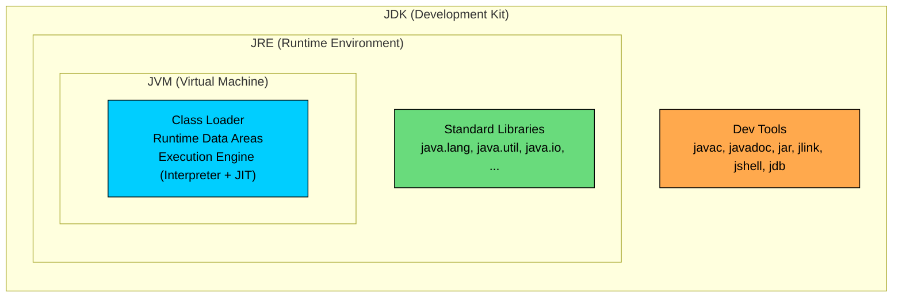

import React from 'react';
import CodeBlock from '../../../../components/ui/CodeBlock';
import Callout from '../../../../components/ui/Callout';

<div className="article-header">
  <div className="breadcrumb">
    <a href="/">Curated Notes</a>
    <span className="breadcrumb-separator">›</span>
    <span className="breadcrumb-current">JDK, JRE, and JVM</span>
  </div>
  <h1>JDK, JRE, and JVM</h1>
  <p style={{ color: 'var(--text-muted)', fontSize: '1.1rem', marginBottom: '16px', lineHeight: '1.6' }}>
    Master the essentials of JDK, JRE, and JVM in this curated guide.
  </p>
  <div className="meta-info">
    <span className="meta-item">
      <svg width="14" height="14" viewBox="0 0 24 24" fill="none" stroke="currentColor" strokeWidth="2"><circle cx="12" cy="12" r="10"/><polyline points="12 6 12 12 16 14"/></svg>
      10 min read
    </span>
    <span className="difficulty-badge difficulty-badge--intermediate">Intermediate</span>
  </div>
</div>

<section className="content-section">

JDK, JRE, and JVM are often used as if they were interchangeable, but they're not. The three terms describe distinct components that fit inside each other like nesting dolls. Knowing which one does what clarifies what to install, why a `.class` file runs on a different machine, and what `javac` is actually doing.

---

## The Big Picture

The three pieces form a clean hierarchy. The JVM is the smallest, most focused piece: the engine that runs Java bytecode. Wrap it with the standard libraries Java programs depend on, and you get the JRE, the runtime environment. Wrap that with the tools you need to write and compile Java code, and you get the JDK, the development kit.





Read it from the inside out. Running a Java program requires a JVM. Running a real Java program (one that uses `String`, `ArrayList`, file I/O, and so on) also requires the standard libraries; the standard libraries together with the JVM make up the JRE. Writing and compiling Java code requires the JDK, which bundles the compiler and other tools on top of the JRE.

The relationship is strict containment: JDK ⊃ JRE ⊃ JVM. The next three sections look at each piece in turn.

---

## JVM (Java Virtual Machine)

The JVM is the engine that runs Java bytecode. Compiling a Java file produces a `.class` file full of bytecode instructions, not native CPU instructions. The JVM reads those instructions and executes them on the actual hardware.

That indirection is what makes Java "write once, run anywhere." A `.class` file does not know whether it will run on a Mac, a Linux server, or a Windows laptop. The JVM does. There is a different JVM build for each operating system and CPU architecture, and each one translates the same bytecode into instructions its hardware understands.

A useful distinction: **bytecode is portable, but the JVM itself is platform-specific**. Applications don't ship a JVM with them; they assume the user already has one for their platform, and they ship the bytecode.

A JVM has three main internal areas:

- **Class Loader.** Reads `.class` files off disk (or over the network, in some setups) and brings them into memory.
- **Runtime Data Areas.** The memory the JVM uses while a program runs. The big ones are the **heap** (where objects live), the **stack** (one per thread, holding method calls and local variables), and the **method area** (class metadata and bytecode for loaded classes).
- **Execution Engine.** The piece that actually runs the bytecode. It includes an **interpreter** (executes bytecode one instruction at a time) and a **JIT compiler** (Just-In-Time, which converts hot bytecode into native machine code for speed).

The shape is: bytecode in, native execution out, with memory areas in between.

---

## JRE (Java Runtime Environment)

The JVM on its own isn't enough to run a real Java program. The moment code uses `System.out.println`, `String`, `ArrayList`, or reads a file, it's calling into Java's standard libraries. Those classes have to come from somewhere.

The JRE is exactly that bundle: **a JVM plus the standard class libraries** (`java.lang`, `java.util`, `java.io`, `java.net`, and the rest of the Java SE platform). It's the minimum environment needed to run a finished Java application.

One historical wrinkle. Up through Java 8, Oracle published a separate JRE download for end users who only needed to run Java programs, not develop them. **Starting with Java 11, Oracle stopped distributing a standalone JRE.** The JDK now ships everything; for a smaller runtime than the full JDK, the `jlink` tool (included in the JDK) builds a slim runtime image containing only the modules an application actually uses.

In modern Java, "install a JRE" is not a step one does from Oracle. Either install the full JDK, or use `jlink` to produce a custom runtime tailored to a specific application.

---

## JDK (Java Development Kit)

The JDK is what developers install. It contains the JRE (so it can run programs) plus the tools needed to **write, compile, and inspect** Java code. Writing Java requires the JDK.

The headline tools in the JDK:


| Tool      | What It Does                                                                              |
| --------- | ----------------------------------------------------------------------------------------- |
| `javac`   | The Java compiler. Turns `.java` source files into `.class` bytecode files.               |
| `java`    | The launcher. Starts a JVM and runs a given class or `.jar`.                              |
| `javadoc` | Generates HTML API documentation from comments in your source code.                       |
| `jar`     | Packages multiple `.class` files (and resources) into a single `.jar` archive.            |
| `jshell`  | An interactive Java shell (REPL). Introduced in Java 9. Great for quick experimentation.  |
| `jdb`     | Command-line debugger.                                                                    |
| `jlink`   | Builds a custom, slimmed-down runtime image containing only the modules your app uses.    |


The two most-used tools are `javac` and `java`. The split between them maps cleanly onto the JDK / JRE split: `javac` is a development tool (JDK-only), and `java` is a runtime tool (ships in the JRE as well).

In short: `javac` compiles, `java` runs.

---

## How They Fit Together

A side-by-side view shows the difference. Each row is one of the three components, with what it contains, when it's needed, and which tools live there.


| Component | What's Inside                                | When You Need It                                     | Example Tools                                 |
| --------- | -------------------------------------------- | ---------------------------------------------------- | --------------------------------------------- |
| **JVM**   | Class loader, memory areas, execution engine | Running any Java bytecode on a specific OS/CPU       | (Internal: interpreter, JIT, garbage collector) |
| **JRE**   | JVM + standard libraries                     | Running a finished Java application                  | `java` (launcher), runtime classes            |
| **JDK**   | JRE + development tools                      | Writing, compiling, packaging, debugging Java code   | `javac`, `java`, `jar`, `javadoc`, `jshell`, `jlink` |


A few notes on the table:

- The **JVM is a piece of the JRE**. The choice is between "JRE or JDK", not "JVM or JRE". The JVM is part of both.
- The standard libraries (everything from `String` to `HashMap`) live in the **JRE layer**, not the JVM. The JVM is the engine; the libraries are written in Java themselves and run on the JVM like any other code.
- `java` (the launcher) ships in both the JRE and the JDK. `javac` only ships in the JDK.

A small check on the portability story. The same `Welcome.java` source compiles to the same `Welcome.class` everywhere:


```java
public class Welcome {
    public static void main(String[] args) {
        System.out.println("Welcome to AlgoMaster Store");
    }
}
```


Compile this on a Mac with `javac Welcome.java`, then copy the resulting `Welcome.class` to a Linux server, run `java Welcome` there, and the output is the same. The bytecode didn't change. The JVM underneath it did.

---

## Vendors and Distributions

Java is built on an open-source codebase called **OpenJDK**. That's the reference implementation, and almost every available JDK is built from it. Multiple "vendors" exist because different organizations build, test, and support their own packaged versions of OpenJDK.

The common ones:


| Distribution                 | Vendor    | Notes                                                                      |
| ---------------------------- | --------- | -------------------------------------------------------------------------- |
| **OpenJDK**                  | Community | The reference implementation. Source-level project.                        |
| **Oracle JDK**               | Oracle    | Oracle's own build. Free for development; check licensing for production.  |
| **Eclipse Temurin (Adoptium)** | Eclipse | A popular, vendor-neutral build. Widely used in CI and production.         |
| **Amazon Corretto**          | Amazon    | Free, long-term-supported build from AWS.                                  |
| **Azul Zulu**                | Azul      | Free builds plus paid support tiers.                                       |
| **Microsoft Build of OpenJDK** | Microsoft | Microsoft's distribution, used heavily inside Azure.                     |


For learning Java, any of these works. They all run the same bytecode and pass the same compatibility tests. The differences mostly come down to licensing terms, long-term support windows, and which company ships security patches.

"The JDK" isn't one product. It's a category, and the choice is which vendor to install.

---

## When to Install Which

The short answer is almost always "install the JDK." A few common situations:

- **Learning Java or writing any Java code.** Install a JDK. `javac` is required to compile, and the JDK includes everything the JRE has, so it also runs programs.
- **Running a pre-built Java application someone else compiled.** Historically the JRE was enough. Today, the simplest thing is still to install the JDK, since Oracle no longer ships a separate JRE. The extra disk space (a few hundred MB) rarely matters on a developer or server machine.
- **Shipping a Java application to end users with the smallest possible footprint.** Use `jlink` (a JDK tool) to build a custom runtime that contains only the JVM and the modules the application uses. This is how most modern desktop Java apps are packaged today.
- **Running Java inside Docker or another container.** Pick a JDK base image (or a custom `jlink`-built image) sized to the application. There is rarely a reason to chase a separate "JRE image" in modern Java.

In practice, the choice is between two options: install a full JDK (the normal case) or build a slim custom runtime with `jlink` (the production-shipping case). The standalone-JRE option that older tutorials sometimes mention is not part of modern Java.

</section>
