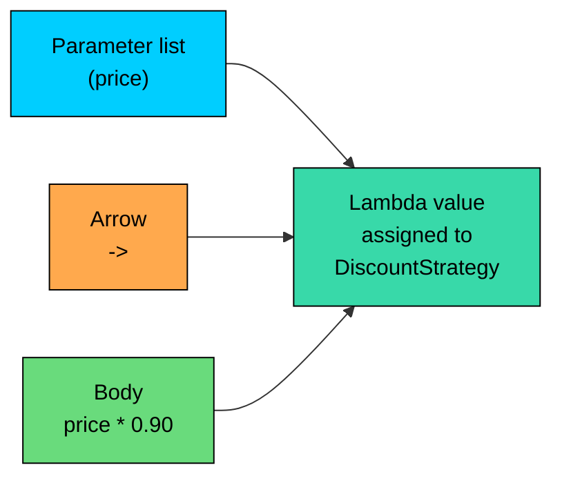
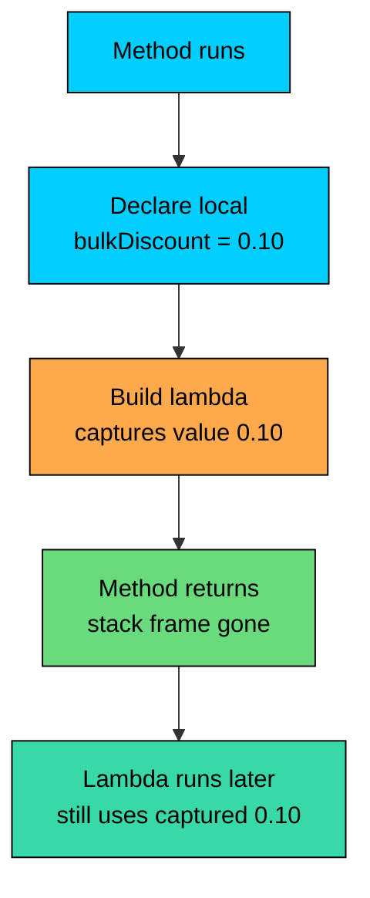
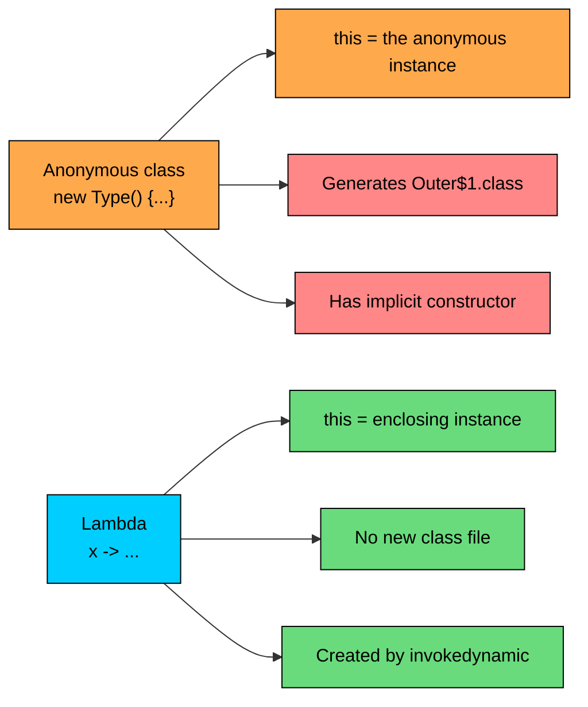

import React from 'react';
import CodeBlock from '../../../../components/ui/CodeBlock';
import Callout from '../../../../components/ui/Callout';

<div className="article-header">
  <div className="breadcrumb">
    <a href="/">Curated Notes</a>
    <span className="breadcrumb-separator">›</span>
    <span className="breadcrumb-current">Lambda Expressions</span>
  </div>
  <h1>Lambda Expressions</h1>
  <p style={{ color: 'var(--text-muted)', fontSize: '1.1rem', marginBottom: '16px', lineHeight: '1.6' }}>
    Master the essentials of Lambda Expressions in this curated guide.
  </p>
  <div className="meta-info">
    <span className="meta-item">
      <svg width="14" height="14" viewBox="0 0 24 24" fill="none" stroke="currentColor" strokeWidth="2"><circle cx="12" cy="12" r="10"/><polyline points="12 6 12 12 16 14"/></svg>
      10 min read
    </span>
    <span className="difficulty-badge difficulty-badge--intermediate">Intermediate</span>
  </div>
</div>

<section className="content-section">

A lambda expression is a short syntax for an instance of a functional interface. It replaces a multi-line anonymous class with a single expression that names its parameters, draws an arrow, and writes its body. This lesson covers the syntax in all its variants, how the compiler picks a type for a lambda from its surroundings, how parameter types are inferred, what variables a lambda is allowed to use from the enclosing scope, what `this` means inside a lambda, and the concrete differences between a lambda and the anonymous class it replaces.

---

## The Shape of a Lambda

Every lambda has three pieces: a parameter list, an arrow `->`, and a body. The parameter list says what inputs the lambda takes. The body says what it does with them. The arrow is what tells the compiler this is a lambda and not something else.


```java
public class FirstLambda {
    public static void main(String[] args) {
        DiscountStrategy tenPercent = price -> price * 0.90;
        System.out.println("Discounted: $" + tenPercent.apply(50.0));
    }
}

@FunctionalInterface
interface DiscountStrategy {
    double apply(double price);
}
```


The lambda is `price -> price * 0.90`. It takes one parameter named `price`, runs the expression `price * 0.90`, and returns the result. The interface `DiscountStrategy` declares one abstract method `apply(double price)` that returns a `double`, so the lambda implements that one method. The variable `tenPercent` now holds an object whose `apply` does the multiplication.

That's the minimum-viable lambda. Most of this lesson is variations on those three pieces.





The three pieces combine into a single value. The receiving type, `DiscountStrategy` in this case, is what tells the compiler the lambda is an implementation of `apply`.

---

## Parameter List Variations

The parameter list is where most of the syntactic flexibility lives. There are four shapes, and they vary along two axes: how many parameters, and whether types are explicit or inferred.

The simplest is **zero parameters**. The parentheses are required, because there's nothing else for the compiler to read.


```java
public class ZeroParam {
    public static void main(String[] args) {
        OrderIdGenerator next = () -> "ORD-" + System.currentTimeMillis();
        System.out.println("New order id: " + next.generate());
    }
}

@FunctionalInterface
interface OrderIdGenerator {
    String generate();
}
```


The exact number after `ORD-` depends on when the program runs. The lambda is `() -> "ORD-" + System.currentTimeMillis()`. Empty parens, arrow, expression body. The receiving type `OrderIdGenerator` has one abstract method that takes no arguments and returns a `String`, so the lambda's empty parameter list and string body line up.

The most common shape is **a single parameter**. With exactly one parameter and inferred types, the parentheses are optional. Either form compiles; the no-paren form is the convention.


```java
public class OneParam {
    public static void main(String[] args) {
        PriceFilter cheap = price -> price < 20.0;
        PriceFilter cheapWithParens = (price) -> price < 20.0;

        System.out.println("$14.99 cheap? " + cheap.keep(14.99));
        System.out.println("$29.99 cheap? " + cheapWithParens.keep(29.99));
    }
}

@FunctionalInterface
interface PriceFilter {
    boolean keep(double price);
}
```


Both `cheap` and `cheapWithParens` are the same lambda. Drop the parens when there's one inferred-type parameter; the no-paren form is the common style, with the with-paren form appearing mostly when someone is being explicit on purpose.

**Two or more parameters** always need parentheses. There's no syntactic shortcut for multi-parameter lambdas.


```java
public class TwoParams {
    public static void main(String[] args) {
        PriceCombiner sum = (basePrice, shipping) -> basePrice + shipping;
        System.out.println("Cart total: $" + sum.combine(29.99, 5.00));
    }
}

@FunctionalInterface
interface PriceCombiner {
    double combine(double basePrice, double shipping);
}
```


Two inferred parameters, parens required, comma between them. The body is a single expression. The structure parallels the one-parameter version.

Parameter types can also be **declared explicitly**. With explicit types, the parens are mandatory, and every parameter must carry an explicit type (no mixing).


```java
public class ExplicitTypes {
    public static void main(String[] args) {
        PriceCombiner sum = (double basePrice, double shipping) -> basePrice + shipping;
        System.out.println("Total: $" + sum.combine(29.99, 5.00));
    }
}

@FunctionalInterface
interface PriceCombiner {
    double combine(double basePrice, double shipping);
}
```


Explicit types are useful for adding an annotation to a parameter (like `@NonNull`) or when the compiler can't figure out the type. In day-to-day code, the inferred form is preferred because the receiving interface already pins down the parameter types.


| Parameter shape | Example | Parens? | Types? |
| --- | --- | --- | --- |
| Zero parameters | `() -> ...` | Required | N/A |
| One inferred parameter | `price -> ...` | Optional | Inferred |
| Two or more inferred | `(a, b) -> ...` | Required | Inferred |
| Explicit types | `(double a, double b) -> ...` | Required | Explicit |
| Mixed inferred and explicit | not allowed | N/A | N/A |


The last row is worth a second look. `(double a, b) -> ...` does not compile. Either all parameters carry types or none do. The compiler enforces this so a parameter list reads consistently from one end to the other.

---

## Expression Body vs Block Body

The body is where the work happens. Lambdas come in two body flavors: an **expression body** for a single computation, and a **block body** wrapped in braces for multiple statements.

An expression body is an expression after the arrow. Its value becomes the lambda's return value. No `return` keyword, no semicolon at the end of the expression itself.


```java
public class ExpressionBody {
    public static void main(String[] args) {
        DiscountStrategy fifteenPercent = price -> price * 0.85;
        System.out.println("Result: $" + fifteenPercent.apply(40.0));
    }
}

@FunctionalInterface
interface DiscountStrategy {
    double apply(double price);
}
```


`price * 0.85` is an expression. Its result is the return value of `apply`. This is the most common form, because lambdas are valued for being short.

A block body uses braces and looks like a regular method body. Statements go inside, and `return` is explicit when the interface's abstract method returns a value.


```java
public class BlockBody {
    public static void main(String[] args) {
        DiscountStrategy festive = price -> {
            double afterDiscount = price * 0.80;
            double afterRounding = Math.floor(afterDiscount * 100) / 100;
            return afterRounding;
        };
        System.out.println("Result: $" + festive.apply(49.99));
    }
}

@FunctionalInterface
interface DiscountStrategy {
    double apply(double price);
}
```


Three lines of work inside the braces, an explicit `return`, semicolons after each statement. The braces are what tell the compiler this is a block. Forgetting `return` inside a block body when the interface expects a value is a common slip.

**What's wrong with this code?**


```java
DiscountStrategy bad = price -> {
    price * 0.90;
};
```


**Fix:**


```java
DiscountStrategy good = price -> {
    return price * 0.90;
};
```


The block body never returns. `price * 0.90` is computed and thrown away. The compiler refuses because `DiscountStrategy.apply` is declared to return a `double`, and the block reaches its end without returning one. Either add `return` or drop the braces entirely and use the expression form.

For a `void` abstract method, the body returns nothing in either form.


```java
public class VoidLambda {
    public static void main(String[] args) {
        OrderLogger logger = message -> System.out.println("[order] " + message);
        logger.log("placed");
        logger.log("shipped");
    }
}

@FunctionalInterface
interface OrderLogger {
    void log(String message);
}
```


`OrderLogger.log` returns `void`, so the lambda's body doesn't return anything. The expression `System.out.println(...)` evaluates and its result (also `void`) becomes the lambda's "return". A block body works for `void` lambdas too, without `return` (or with a bare `return;` to exit early).

A lambda whose body just calls one method is a common pattern in Java 8+ code. When the body shape matches an existing method exactly, a method reference is even shorter.

---

## Target Typing: How a Lambda Gets Its Type

A lambda by itself has no type. The expression `price -> price * 0.90` isn't a `DiscountStrategy`, isn't a `PriceFilter`, isn't anything in particular until the compiler sees where it lands. The receiving location, called the **target type**, is what tells the compiler which functional interface the lambda implements.


```java
public class TargetTyping {
    public static void main(String[] args) {
        DiscountStrategy discount = price -> price * 0.90;
        PriceFilter filter = price -> price * 0.90 < 50.0;

        System.out.println("Discount on $60: $" + discount.apply(60.0));
        System.out.println("Filter keeps $40? " + filter.keep(40.0));
    }
}

@FunctionalInterface
interface DiscountStrategy {
    double apply(double price);
}

@FunctionalInterface
interface PriceFilter {
    boolean keep(double price);
}
```


The first lambda is shaped like "take a price, return a double" and lands in a `DiscountStrategy` variable. The compiler reads the declared type, picks `DiscountStrategy.apply` as the method being implemented, and the lambda becomes a `DiscountStrategy` value. The second lambda is shaped like "take a price, return a boolean" and lands in a `PriceFilter` variable. Same arrow, different target, different identity.

There are three common target-type locations:

1. **Variable assignment.** The declared variable type is the target. `DiscountStrategy d = price -> ...` makes the lambda a `DiscountStrategy`.
2. **Method argument.** A parameter type at the call site is the target. `applyDiscount(price -> price * 0.9)` makes the lambda whatever type `applyDiscount` declares.
3. **Return statement.** The enclosing method's return type is the target. A method returning `DiscountStrategy` can `return price -> price * 0.9` directly.


```java
public class TargetSites {

    public static double applyAt(double price, DiscountStrategy strategy) {
        return strategy.apply(price);
    }

    public static DiscountStrategy memberDiscount() {
        return price -> price * 0.95;
    }

    public static void main(String[] args) {
        // 1) Variable assignment
        DiscountStrategy assigned = price -> price - 5.0;

        // 2) Method argument
        double afterArg = applyAt(50.0, price -> price * 0.90);

        // 3) Return statement
        DiscountStrategy returned = memberDiscount();

        System.out.println("Assigned on $50: $" + assigned.apply(50.0));
        System.out.println("Argument result: $" + afterArg);
        System.out.println("Returned on $50: $" + returned.apply(50.0));
    }
}

@FunctionalInterface
interface DiscountStrategy {
    double apply(double price);
}
```


Three different sites, same lambda mechanic. In each one, the surrounding context provides the target type and the compiler fits the lambda into it. Without a target, the compiler has nothing to bind the lambda to.

A common example of a target-less lambda is `var`:


```java
public class NoTarget {
    public static void main(String[] args) {
        // var mystery = price -> price * 0.90; // does not compile
        DiscountStrategy fine = price -> price * 0.90;
        System.out.println("Result: $" + fine.apply(40.0));
    }
}

@FunctionalInterface
interface DiscountStrategy {
    double apply(double price);
}
```


The commented line doesn't compile because `var` waits for the right-hand side to tell it what type to use, and a bare lambda has no type to offer. The compiler reports something like `lambda expression not expected here` or `cannot infer type`. Declare the variable with a specific functional-interface type and the lambda has a target.

---

## Parameter Type Inference

When parameter types are inferred, the compiler reads them from the abstract method of the target functional interface. The lambda just supplies parameter names, and the types come from the interface.


```java
public class InferenceWalkthrough {
    public static void main(String[] args) {
        // The compiler sees PriceCombiner.combine(double, double)
        // and infers basePrice and shipping as double, double
        PriceCombiner sum = (basePrice, shipping) -> basePrice + shipping;
        System.out.println("Total: $" + sum.combine(29.99, 5.00));

        // The compiler sees OrderLogger.log(String)
        // and infers message as String
        OrderLogger logger = message -> System.out.println("[" + message.toUpperCase() + "]");
        logger.log("shipped");
    }
}

@FunctionalInterface
interface PriceCombiner {
    double combine(double basePrice, double shipping);
}

@FunctionalInterface
interface OrderLogger {
    void log(String message);
}
```


Inside the `sum` lambda, `basePrice` and `shipping` are `double` because that's what `combine` declares. Inside `logger`, `message` is a `String` because `log` declares it that way. `message.toUpperCase()` is legal because the compiler knows `message` is a `String`, even though the lambda never spelled the type out.

When the target type is generic, inference flows through the type parameters. A `Comparator<String>` infers both parameters as `String`:


```java
import java.util.Arrays;
import java.util.Comparator;
import java.util.List;
import java.util.ArrayList;

public class GenericInference {
    public static void main(String[] args) {
        List<String> products = new ArrayList<>(List.of("Notebook", "Pen", "Eraser", "Stapler"));

        Comparator<String> byLength = (a, b) -> a.length() - b.length();
        products.sort(byLength);

        System.out.println("Sorted: " + products);
    }
}
```


The list starts as `[Notebook, Pen, Eraser, Stapler]` and ends sorted by length: `Pen` (3), `Eraser` (6), `Stapler` (7), `Notebook` (8). The lambda `(a, b) -> a.length() - b.length()` works because `Comparator<String>` infers `a` and `b` as `String`, which makes `a.length()` legal. With a target of `Comparator<Integer>`, the same lambda would infer `a` and `b` as `Integer`, where `length()` doesn't exist and the code wouldn't compile.

The inference rule is one-directional: the target type teaches the lambda what its parameter types are, never the other way around. If the target type's abstract method takes `(double, double)`, the lambda's parameters are `double, double`. There's no way to override that from inside the lambda.

---

## Variable Capture: Effectively Final

A lambda can use variables from its enclosing scope. The rules cover what kinds of variables, and what operations are allowed on them.

A lambda freely reads **instance fields and static fields** of the enclosing class.


```java
public class FieldCapture {

    static double globalTaxRate = 0.08;
    double memberDiscount = 0.05;

    DiscountStrategy buildStrategy() {
        return price -> price * (1 - memberDiscount) * (1 + globalTaxRate);
    }

    public static void main(String[] args) {
        FieldCapture demo = new FieldCapture();
        DiscountStrategy combined = demo.buildStrategy();
        System.out.println("Final: $" + combined.apply(100.0));
    }
}

@FunctionalInterface
interface DiscountStrategy {
    double apply(double price);
}
```


`memberDiscount` is an instance field. `globalTaxRate` is a static field. The lambda reads both and gets fresh values every time it runs. If `memberDiscount` changes between when the lambda is built and when it runs, the lambda sees the new value, because instance and static fields are read through their owning object, not snapshotted into the lambda.

**Local variables** behave differently. A lambda can use a local variable from the enclosing method or block, but only if that variable is **effectively final**. Effectively final means the variable is either declared `final` or is never reassigned after its initialization. The compiler watches for any second assignment and rejects the lambda when one is found.


```java
public class LocalCapture {
    public static void main(String[] args) {
        double bulkDiscount = 0.10;
        // bulkDiscount = 0.15; // uncommenting this line breaks the lambda

        DiscountStrategy bulk = price -> price * (1 - bulkDiscount);
        System.out.println("Discounted: $" + bulk.apply(80.0));
    }
}

@FunctionalInterface
interface DiscountStrategy {
    double apply(double price);
}
```


The local `bulkDiscount` is never reassigned, so it's effectively final, and the lambda can capture it. Uncommenting the second assignment makes the lambda line fail with `local variables referenced from a lambda expression must be final or effectively final`.

The reason for this restriction: a local variable lives on the stack frame of the method that declared it. That frame disappears the moment the method returns. A lambda built inside the method can outlive the method (stored in a field, passed to another thread, returned to a caller, scheduled for later). If the lambda were allowed to see ongoing changes to a local variable, those changes would have to be preserved across stack frame teardown, which Java doesn't do for locals. Requiring the variable to be effectively final means the lambda can safely capture its **value** at creation time, no shared mutable state required.





The lambda holds onto a copy of the value, not a reference to the slot the variable lived in. The slot is gone the moment `Method runs` finishes. The captured value lives on inside the lambda.

Loop variables run into this rule often:


```java
public class LoopCapture {
    public static void main(String[] args) {
        // Variant A: works
        for (int discountPercent : new int[]{10, 20, 30}) {
            DiscountStrategy s = price -> price * (1 - discountPercent / 100.0);
            System.out.println(discountPercent + "% off $50: $" + s.apply(50.0));
        }
    }
}

@FunctionalInterface
interface DiscountStrategy {
    double apply(double price);
}
```


Each iteration of an enhanced `for` loop introduces a fresh `discountPercent` variable, so each lambda captures its own value. This is why this compiles. A classic `for (int i = 0; i < 3; i++)` loop reuses the same `i` variable across iterations, so a lambda capturing `i` would see the value at the moment it ran, not the iteration's value at the moment it was created. The compiler catches that case too:


```java
public class LoopCaptureBroken {
    public static void main(String[] args) {
        // for (int i = 0; i < 3; i++) {
        //     Runnable r = () -> System.out.println("i = " + i);
        //     r.run();
        // }
        // The lambda above fails to compile: i is not effectively final.

        // Fix: copy i into a fresh local each iteration.
        for (int i = 0; i < 3; i++) {
            final int copy = i;
            Runnable r = () -> System.out.println("i = " + copy);
            r.run();
        }
    }
}
```


The fix is to copy the loop variable into a new local that is itself effectively final. Each iteration's `copy` is a fresh variable, captured cleanly by its own lambda.

A capturing lambda allocates a small object holding the captured values, once per evaluation of the expression. A stateless lambda (no captures) is usually reused as a single instance per call site by the JVM. In a hot loop, a stateless lambda hoisted out of the loop is the cheapest option.

---

## What `this` Means Inside a Lambda

The keyword `this` inside a lambda refers to the **enclosing instance**, the same `this` as one line outside the lambda. A lambda does not create its own `this`. This is one of the biggest differences from an anonymous class, and it matters when a lambda inside a method of a class needs to call another method on the same object.


```java
public class ThisInLambda {

    String storeName = "AlgoMart";

    void registerHandlers() {
        OrderLogger logger = message -> System.out.println(this.storeName + ": " + message);
        logger.log("order placed");
    }

    public static void main(String[] args) {
        ThisInLambda demo = new ThisInLambda();
        demo.registerHandlers();
    }
}

@FunctionalInterface
interface OrderLogger {
    void log(String message);
}
```


Inside the lambda, `this` is the `ThisInLambda` object that `registerHandlers` was called on. `this.storeName` reads the enclosing instance's field. Writing `storeName` without the `this.` prefix produces the same behavior, because instance fields are resolved against the enclosing instance by default.

Compare that with an anonymous class doing the same job:


```java
public class ThisInAnonymous {

    String storeName = "AlgoMart";

    void registerHandlers() {
        OrderLogger logger = new OrderLogger() {
            String storeName = "anonymous-class-name";

            @Override
            public void log(String message) {
                System.out.println(this.storeName + ": " + message);
            }
        };
        logger.log("order placed");
    }

    public static void main(String[] args) {
        ThisInAnonymous demo = new ThisInAnonymous();
        demo.registerHandlers();
    }
}

@FunctionalInterface
interface OrderLogger {
    void log(String message);
}
```


The anonymous class introduces its own `this`. Inside its `log` body, `this` is the anonymous class instance, and `this.storeName` reads the anonymous class's field, shadowing the outer `storeName`. To get the outer one, the qualified form `ThisInAnonymous.this.storeName` is required. Lambdas don't allow that distinction because there's only one `this` to begin with: the enclosing one.

A lambda is not a new class with its own identity. It's an instance of the target functional interface, captured at a particular point in the enclosing code, and it inherits the enclosing `this` directly.


| Aspect | Lambda | Anonymous inner class |
| --- | --- | --- |
| Meaning of `this` | Enclosing instance | The anonymous instance |
| Can shadow enclosing fields | No | Yes |
| Generates a separate `.class` file | No | Yes (`Outer$1.class`) |
| Has its own constructor | No | Yes (implicit) |
| Can declare instance fields | No | Yes |
| Can be instantiated with `new` | No (created by lambda metafactory) | Yes (via `new`) |
| Typical line count | 1 | 4-6 |


The class-file row matters at build time. A class with twenty anonymous-class lambdas emits twenty extra `.class` files. The same twenty replaced with lambdas emit zero new files, because lambdas are realized by an `invokedynamic` instruction the JVM resolves at runtime. The constructor row matters for per-instance state, which lambdas can't carry directly (they capture from the enclosing scope instead).





The diagram lines up the two shapes side by side. The middle column is what `this` resolves to. The right two columns are the build and runtime costs. For the common case of plugging in some behavior, the lambda column wins on every row.

---

## A Tiny End-to-End Example

Tying everything together, a small cart pricing helper that uses target typing, type inference, capture, and a block body. The setup is a cart of products with prices, a strategy to discount each price, and a method that computes the new total.


```java
import java.util.List;

public class CartPricing {

    record Product(String name, double price) {}

    public static double totalAfter(List<Product> cart, DiscountStrategy strategy) {
        double total = 0.0;
        for (Product p : cart) {
            total += strategy.apply(p.price());
        }
        return total;
    }

    public static void main(String[] args) {
        List<Product> cart = List.of(
            new Product("Notebook", 4.99),
            new Product("Pen", 1.49),
            new Product("Eraser", 0.79)
        );

        double memberDiscount = 0.10;

        // Expression body, captures effectively final local
        DiscountStrategy memberPrice = price -> price * (1 - memberDiscount);

        // Block body with multiple statements
        DiscountStrategy roundedPrice = price -> {
            double afterDiscount = price * (1 - memberDiscount);
            return Math.round(afterDiscount * 100) / 100.0;
        };

        System.out.println("Member total: $" + totalAfter(cart, memberPrice));
        System.out.println("Rounded total: $" + totalAfter(cart, roundedPrice));
    }
}

@FunctionalInterface
interface DiscountStrategy {
    double apply(double price);
}
```


`memberPrice` is a one-line expression body that captures the local `memberDiscount`. `roundedPrice` is a block body that does two steps. Both implement `DiscountStrategy.apply` because that's the target type at the variable declaration. `totalAfter` doesn't care which lambda it gets; it just calls `apply` for each product. Changing the discount, the rounding rule, or the strategy passed in swaps behavior without writing new classes.

The slightly long decimal in the first line is normal `double` arithmetic. The second strategy fixes it by rounding to two places inside the lambda's block body. Both behaviors are valid; pick the one that fits the calling context.

---

## Lambdas Are Functional-Interface Instances Only

One final point. The target type for a lambda must be a functional interface, the kind defined in `10-abstraction/07-functional-interfaces.md`: an interface with exactly one abstract method. Pointing a lambda at anything else (a class, an abstract class with two abstracts, a non-functional interface) doesn't compile.


```java
public class BadTarget {
    public static void main(String[] args) {
        // Object o = price -> price * 0.90; // does not compile: Object is not a functional interface
        // DiscountStrategy ok = price -> price * 0.90; // compiles
        System.out.println("See comments above");
    }
}

@FunctionalInterface
interface DiscountStrategy {
    double apply(double price);
}
```


The first line fails because `Object` is a class, not a functional interface. The second line works because `DiscountStrategy` declares exactly one abstract method. That requirement gives the lambda's parameters and return type their meaning. The compiler has to know which method the lambda implements, and the SAM rule guarantees there's only one candidate.

</section>
