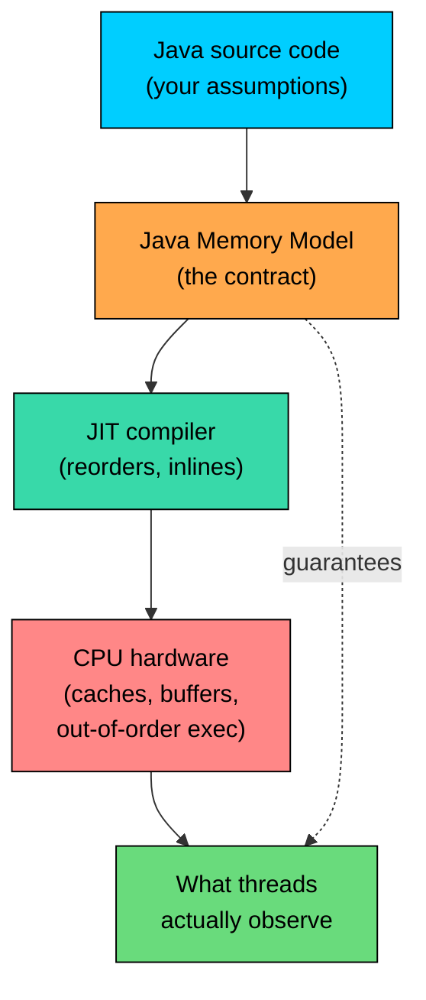
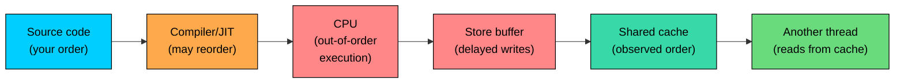
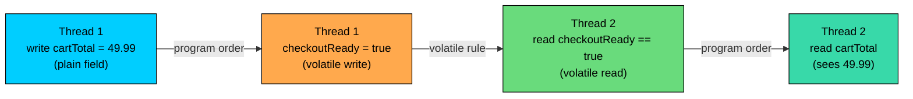

import React from 'react';
import CodeBlock from '../../../../components/ui/CodeBlock';
import Callout from '../../../../components/ui/Callout';

<div className="article-header">
  <div className="breadcrumb">
    <a href="/">Curated Notes</a>
    <span className="breadcrumb-separator">›</span>
    <span className="breadcrumb-current">Memory Model Basics</span>
  </div>
  <h1>Memory Model Basics</h1>
  <p style={{ color: 'var(--text-muted)', fontSize: '1.1rem', marginBottom: '16px', lineHeight: '1.6' }}>
    Master the essentials of Memory Model Basics in this curated guide.
  </p>
  <div className="meta-info">
    <span className="meta-item">
      <svg width="14" height="14" viewBox="0 0 24 24" fill="none" stroke="currentColor" strokeWidth="2"><circle cx="12" cy="12" r="10"/><polyline points="12 6 12 12 16 14"/></svg>
      10 min read
    </span>
    <span className="difficulty-badge difficulty-badge--intermediate">Intermediate</span>
  </div>
</div>

<section className="content-section">

The Java Memory Model (JMM) is the part of the Java Language Specification that defines what one thread is allowed to observe about the work another thread has done. It is not a description of how the heap is laid out or how the garbage collector runs. It is an abstract contract between Java code, the compiler, the JIT, and the hardware. This lesson covers what the JMM is, the three distinct problems it solves (visibility, atomicity, ordering), the happens-before relation that ties everything together, and why the JMM is intentionally weaker than the "every thread sees every write instantly" model that beginners often imagine.

---

## What the JMM Is and Why It Exists

A modern computer is not the simple machine that source code pretends it runs on. A program looks like a sequence of statements that read and write shared memory in order. The real hardware underneath is doing something very different: each CPU core has its own L1 and L2 caches, write buffers that hold pending writes for a while, and out-of-order execution engines that reorder reads and writes to keep the pipeline busy. The compiler and the JIT add another layer of reordering on top, hoisting reads out of loops, eliminating redundant writes, and reordering independent statements to produce better machine code.

For a single-threaded program this is invisible. The hardware and compiler are required to preserve the behavior the program would have had if every statement ran in order on a simple machine. Across threads, that promise disappears. Two threads with no coordination between them are allowed to observe each other's actions in surprisingly different orders, and the values one thread reads from a shared field may lag behind the writes another thread has made.

The JMM exists to make this situation tractable. Without a memory model, Java code would have to be written differently for every CPU architecture, every JIT compiler version, and every JVM vendor. The JMM provides one rulebook. It says: "Here is what every Java program is guaranteed to observe, no matter what the hardware does underneath." Anything stricter would prevent the JVM from using the hardware efficiently. Anything looser would make Java programs unportable.





The diagram traces the path from source code to what threads observe. The JMM sits in the middle. It accepts that the JIT and the CPU will both reorder things, and it specifies exactly which reorderings are allowed to be visible to other threads. The contract is between the application and the platform: when the rules are followed (using `synchronized`, `volatile`, `final`, or higher-level concurrency tools at the right points), the platform guarantees the expected behavior. When the rules are not followed, the JIT and the CPU choose, and the result may differ between machines, between runs, and between JVM versions.

---

## The Three Problems: Visibility, Atomicity, Ordering

Multithreading bugs are often lumped together as "race conditions," but the JMM distinguishes three separate problems. Each one shows up differently, and each one needs its own kind of fix.

**Visibility** is about whether a write done by one thread is ever seen by another thread. The canonical visibility bug is a worker thread spinning on a non-volatile flag that the main thread flipped, and the worker never noticing. The write happened. The reader was looking at the right field. The reader never observed the new value because there was no happens-before edge forcing it to look at memory.

**Atomicity** is about whether an operation runs as one indivisible step or as several steps that can be interleaved with other threads. A simple read of an `int` is atomic. A `cartTotal++` is not, because it reads, adds, and writes back as three separate steps. Two threads can interleave between those steps and lose updates. Atomicity is about indivisibility, not about visibility.

**Ordering** is about whether the steps within a single thread can be reordered before other threads observe them. The JMM allows the compiler and the CPU to reorder reads and writes within a thread as long as the thread itself cannot tell the difference. Across threads, those reorderings can become visible, and a thread reading shared state may see writes happen in a different order than the program text suggests.

These three problems are distinct, and each maps to different tools:


| Problem | Symptom | Tool |
| --- | --- | --- |
| Visibility | A thread never sees another thread's write | `volatile`, `synchronized`, `final` (for construction) |
| Atomicity | Updates from concurrent threads are lost or mixed | `synchronized`, `AtomicInteger`, locks |
| Ordering | Writes appear to other threads in a surprising order | `volatile`, `synchronized` |


A bug that looks the same on the surface (the total is wrong, the flag never flipped, the field is null) can have any of the three causes. Recognizing which one is involved is half the battle.


```java
public class ThreeProblems {

    // Visibility: another thread may never see this update
    static boolean storeOpen = true;

    // Atomicity: count++ from many threads loses updates
    static int orderCount = 0;

    // Ordering: customerName write may appear after ready write to another thread
    static String customerName;
    static boolean ready;

    public static void main(String[] args) {
        System.out.println("storeOpen=" + storeOpen);
        System.out.println("orderCount=" + orderCount);
        System.out.println("customerName=" + customerName + ", ready=" + ready);
    }
}
```


This program does not show the bugs directly. It is a labeled inventory. The first field has a visibility problem if many threads read while one thread writes. The second has an atomicity problem if many threads write concurrently. The third has an ordering problem if one thread writes both fields and another reads both fields without coordination. The JMM defines what to do for each.

---

## Reorderings: Compiler, Processor, Memory System

Three layers can reorder operations between source code and what other threads observe. It helps to know which layer is responsible for what.

The **compiler and JIT** reorder at the source level. They can reorder independent statements, hoist invariant reads out of loops, eliminate redundant writes, and combine writes that go to the same field. If the optimization is invisible to the single thread that owns the code, the JIT is allowed to do it. Across threads, the optimization can become very visible.

The **processor** reorders at the instruction level. Modern CPUs have an out-of-order execution unit that takes a stream of instructions and reorders them to keep the pipeline busy. A load that misses the cache can be delayed while a later load that hits the cache runs ahead of it. From the point of view of the CPU running the thread, the result is the same as the in-order execution would have been. From another core watching the cache, the loads may have arrived in a different order.

The **memory system** reorders at the cache level. Stores from a core sit in the core's store buffer for a while before they drain to the shared cache hierarchy. Two stores done in one order may drain to the shared cache in a different order. Other cores observing the cache see the drained order, not the issued order.

A small program that shows reordering can happen in principle. The output it produces matches the source order, because the JIT is conservative on common hardware. The JMM permits the unexpected case anyway, and on weakly ordered architectures (or with a more aggressive JIT) the case becomes observable.


```java
public class ReorderingDemo {

    static int a = 0;
    static int b = 0;
    static int x = 0;
    static int y = 0;

    public static void main(String[] args) throws InterruptedException {
        int surprising = 0;
        for (int run = 0; run < 100_000; run++) {
            a = 0; b = 0; x = 0; y = 0;

            Thread t1 = new Thread(() -> {
                a = 1;
                x = b;
            });
            Thread t2 = new Thread(() -> {
                b = 1;
                y = a;
            });

            t1.start();
            t2.start();
            t1.join();
            t2.join();

            if (x == 0 && y == 0) {
                surprising++;
            }
        }
        System.out.println("Runs where both x and y were 0: " + surprising);
    }
}
```


**Output (varies by JVM and hardware, but the surprising case is permitted):**


```shell
Runs where both x and y were 0: 0
```


Reading this program with the assumption that statements run in source order, the expectation would be that at least one of `x` or `y` is `1` in every run. Either thread `t1` runs first and `t2` then reads `a == 1`, or thread `t2` runs first and `t1` then reads `b == 1`, or they interleave and at least one reads the other's write. The case where both read `0` should be impossible.

Under the JMM, it is not impossible. Both threads can reorder their two statements (the read does not depend on the write within the same thread), or the writes can sit in store buffers while the reads grab the old values from shared memory. The JMM allows the unexpected outcome because forbidding it would require expensive memory fences on every plain assignment.

On x86 hardware running HotSpot, the unexpected case is rare or absent because x86 has a strong memory model and the JIT does not aggressively reorder these particular operations. On ARM or POWER hardware, or with a different JVM, the count would be non-zero. The takeaway is not about counting cases on a specific machine. The JMM permits the reordering, so code that depends on "this can't happen" is depending on luck.

The fix is to declare the fields `volatile`, which forces the JIT and the CPU to insert the right barriers so reads cannot move ahead of the local write. After that change, the surprising case is forbidden by the JMM, and the absence holds on every JVM and every architecture.





The diagram shows the three reordering points between source code and observed order. Each one is independent. The JMM treats them as a single permission system: between two synchronization actions, reorderings at any layer are allowed. At a synchronization action, the JMM forces the layers to publish their pending work in a defined order.

---

## Sequential Consistency vs the JMM

The intuitive model is called **sequential consistency**. It says that the result of any execution is the same as if all operations from all threads were placed in some single total order, with each thread's operations appearing in that order in program order. Put plainly, every thread sees every operation in the same order, and that order is consistent with each thread's local program order.

Sequential consistency is intuitive. It is also expensive. To implement it faithfully, the JVM would have to issue a memory barrier on every read and every write of every field, because it cannot know which fields are shared. Memory barriers are slow on modern CPUs, especially full barriers that drain the store buffer and stall the pipeline.

The JMM gives up sequential consistency on purpose. By default, plain reads and plain writes are not sequentially consistent across threads. The JMM gives sequential consistency only for **correctly synchronized** programs, which are programs where every conflicting access between threads is ordered by a happens-before edge.

The exact rule: **if a program is correctly synchronized, its behavior is identical to some sequentially consistent execution**. That is the deal the JMM offers. Add the right `synchronized` and `volatile` annotations, and the program can be reasoned about as if it ran sequentially. Skipping them leaves the program off the safe path.


| Model | Guarantee | Cost |
| --- | --- | --- |
| Sequential consistency | Every thread sees every operation in the same total order | Very high: barriers everywhere |
| JMM (default) | Threads may see different orders for plain accesses | Very low: no implicit barriers |
| JMM (correctly synchronized) | Behaves like a sequentially consistent execution | Low: barriers only at sync points |


The JMM is the middle row by default and the bottom row when opted into. Opting in means adding synchronization actions.

---

## Synchronization Actions

The JMM defines a specific list of operations called **synchronization actions**. These are the only operations that establish happens-before edges between threads. Anything not on this list is a plain action, and plain actions do not coordinate threads on their own.

The main synchronization actions are:


| Action | Establishes happens-before edge |
| --- | --- |
| `synchronized` block entry and exit on the same monitor | Unlock happens-before subsequent lock on the same monitor |
| Volatile field write and read | Write happens-before subsequent read of the same field |
| `Thread.start()` | Call happens-before the started thread's first action |
| `Thread.join()` | Thread's last action happens-before the join returning |
| Interrupting a thread | Interrupt happens-before the interrupted thread detecting it |
| `final` field write in a constructor | Write happens-before the constructed object being published |
| `java.util.concurrent` operations (locks, atomics, queues) | Each class specifies the edges it provides |


These are the only ways one thread's action becomes visible to another thread in a JMM-defined way. Code that never performs any of these actions on shared state gets almost no cross-thread guarantees from the JMM. Code that performs them at the right points gets everything it needs.

Two consequences are worth pinning down. First, `synchronized` is not just about mutual exclusion. The lock acquire and release also act as memory barriers that publish writes and force reads to refresh. This is why a `synchronized` block fixes visibility bugs even when mutual exclusion isn't required. Second, the synchronization action has to happen on **the same** monitor, the same volatile field, the same thread for start/join. Locking a different object or writing a different volatile field provides no edge.

---

## The Happens-Before Relation

Happens-before is the JMM's central concept. It is a partial order over the actions in a program. If action A happens-before action B, then:

1. The effects of A (all the writes A did) are visible to B.
2. A appears to occur before B in the program order observed by B.

The relation is built from a small list of base rules and one closure rule.

**Base rules:**

- **Program order:** Within a single thread, every action happens-before every action that follows it in program order.
- **Monitor lock:** An unlock on a monitor happens-before every subsequent lock on the same monitor.
- **Volatile:** A write to a volatile field happens-before every subsequent read of the same field.
- **Thread start:** A call to `Thread.start()` happens-before the started thread's first action.
- **Thread join:** A thread's final action happens-before the return of `join()` on that thread.
- **Interruption:** A thread invoking `interrupt()` on another thread happens-before the interrupted thread detecting the interrupt.
- **Final fields:** All writes to `final` fields inside a constructor happen-before the constructed object becomes visible to any thread.
- **Object construction:** The end of a constructor for an object happens-before the start of any finalizer.

**Closure rule (transitivity):**

- If A happens-before B and B happens-before C, then A happens-before C.

Transitivity is what makes the relation useful in practice. The synchronization action is rarely right next to the data being published. Typical code writes some fields, performs a synchronization action, and lets the closure rule pull the writes along.





The diagram traces a three-step chain. Thread 1 writes a plain field, then writes a volatile field. Thread 2 reads the volatile field and sees the new value, then reads the plain field. The plain write happens-before the volatile write (program order in thread 1), the volatile write happens-before the volatile read (volatile rule), and the volatile read happens-before the plain read (program order in thread 2). By transitivity, the plain write happens-before the plain read, so thread 2 is guaranteed to see `49.99`.

The same pattern in code, applied to publishing a cart to a worker.


```java
public class CartPublish {

    static double cartTotal;
    static volatile boolean checkoutReady;

    public static void main(String[] args) throws InterruptedException {
        Thread shopper = new Thread(() -> {
            cartTotal = 49.99;
            checkoutReady = true;
        });

        Thread cashier = new Thread(() -> {
            while (!checkoutReady) {
                // wait for the shopper to finish
            }
            System.out.println("Charging customer: $" + cartTotal);
        });

        cashier.start();
        shopper.start();
        shopper.join();
        cashier.join();
    }
}
```


The cashier thread is guaranteed to see `cartTotal == 49.99` once it observes `checkoutReady == true`. Without the volatile, the cashier might see `checkoutReady` change but read `cartTotal` as `0.0`, because there would be no happens-before edge between the two writes in the shopper and the two reads in the cashier. The volatile is what builds the bridge.

---

## The JMM vs Hardware Memory

A common source of confusion is mixing up the JMM with descriptions of CPU caches and memory hierarchies. The JMM is not a description of any hardware. It is an abstract contract written in terms of actions and orderings on shared variables. It does not mention caches, store buffers, or memory barriers.

When code uses `volatile`, the JVM is responsible for emitting whatever machine instructions are needed on the target architecture to make the abstract guarantee hold. On x86 that might be a `mfence` or a locked instruction. On ARM that might be a `dmb ish`. On some hypothetical architecture, it might be something else entirely. Java application code doesn't need to know which. The JMM provides a single set of rules that hold on every JVM and every hardware platform.

This abstraction is what makes Java portable for concurrent code. Application code targets the JMM contract once and the JVM translates the contract into the right instructions for the machine. Code that targeted the hardware directly would behave differently on different chips, and the reasoning would have to change every time the architecture changed.


| Layer | What it describes | Audience |
| --- | --- | --- |
| Hardware memory model (x86 TSO, ARM weak, etc.) | What this specific CPU's caches and barriers guarantee | JVM implementors |
| Java Memory Model | What every Java program is guaranteed across all JVMs | Java application code |


The dividing line is the JVM. Below it, the platform's job is to make the JMM hold. Above it, application code respects the JMM's rules. As long as both sides do their job, the program runs correctly on every supported platform.

---

## Reordering Hazard: A "What's Wrong" Example

A deceptively simple program. It looks correct, and on most JVMs it will appear to work most of the time. Under the JMM it is broken, and on some hardware or under aggressive JIT optimization it will fail.

**What's wrong with this code?**


```java
public class LazyCartLoader {

    static class Cart {
        int itemCount;
        double total;

        Cart() {
            this.itemCount = 5;
            this.total = 99.95;
        }
    }

    static Cart sharedCart;

    static void publisher() {
        sharedCart = new Cart();
    }

    static void consumer() {
        Cart c = sharedCart;
        if (c != null) {
            System.out.println("count=" + c.itemCount + " total=" + c.total);
        }
    }
}
```


**Why it fails:**

The publisher does two logical things: it constructs a `Cart` (writing its two fields), and it assigns the reference to `sharedCart`. The JMM allows the consumer to observe these two steps in either order. If the consumer sees the reference assignment but not the field writes, it can read `c.itemCount == 0` and `c.total == 0.0`, even though the constructor set them to `5` and `99.95`. The fields of the object are plain fields, the reference is a plain reference, and no happens-before edge exists between the publisher's two writes and the consumer's reads.

This is not a theoretical issue. It is the same problem that broken double-checked-locking implementations have been hitting since the 1990s. Constructors are not atomic with respect to other threads.

**Fix (volatile reference):**


```java
static volatile Cart sharedCart;
```


A volatile reference makes the assignment a synchronization action. The field writes inside the constructor happen-before the volatile write (program order in the publisher), the volatile write happens-before the consumer's volatile read, and the consumer's read happens-before the field reads (program order in the consumer). By transitivity, the consumer sees fully constructed fields.

**Better fix (final fields):**


```java
static class Cart {
    final int itemCount;
    final double total;

    Cart() {
        this.itemCount = 5;
        this.total = 99.95;
    }
}
```


The JMM gives a special guarantee for `final` fields: their values set in the constructor are visible to any thread that obtains a reference to the constructed object, even without volatile or other synchronization, as long as the reference does not escape the constructor early. This is called the **final field freeze**. It is the reason `String`, `Integer`, and immutable records can be passed between threads safely without explicit synchronization.

Combining the two ideas, the safest pattern is an immutable class with `final` fields, published through a `volatile` reference. The immutability handles the contents, the volatile handles the reference visibility, and the final-field freeze and the volatile rule together cover every read on the consumer side.

---

## A Brief Note on `volatile`, `synchronized`, and `final`

These three keywords are the JMM's main hooks into Java syntax. The summary here is about how each one fits into the model.

- **`volatile`** marks a field. Every read and write of the field is a synchronization action under the JMM. A volatile write happens-before every subsequent volatile read of the same field, which is the rule that carries earlier plain writes along.
- **`synchronized`** marks a block or method. Entering and exiting the block are synchronization actions on the associated monitor. The exit of a `synchronized` block happens-before the entry of any subsequent `synchronized` block on the same monitor, which is what makes both mutual exclusion and visibility work.
- **`final`** marks a field that cannot be reassigned after the constructor. The JMM adds a special freeze action at the end of the constructor that makes the field's value visible to any thread that obtains the reference without needing further synchronization, provided the constructor did not let the reference leak before finishing.

Each one establishes a different kind of happens-before edge. The right combination depends on what the code needs. For a shutdown flag, `volatile` is enough. For a multi-step update of related fields, `synchronized` is the tool. For an immutable object that needs to be published freely, `final` fields plus a `volatile` reference are the strongest combination.

This chapter covers the abstract model that `volatile`, `synchronized`, and `final` plug into, not the keywords themselves.

---

## Putting the Pieces Together

To make the abstract model concrete, consider a small e-commerce checkout flow that uses three synchronization actions in one program: a `Thread.start()` edge, a `volatile` edge, and a `Thread.join()` edge.


```java
public class CheckoutFlow {

    static int finalItemCount;
    static double finalTotal;
    static volatile boolean priced;

    public static void main(String[] args) throws InterruptedException {
        Thread pricer = new Thread(() -> {
            // Plain writes. Will be visible because the volatile write below
            // creates a happens-before edge to the reader.
            finalItemCount = 3;
            finalTotal = 74.97;
            priced = true;
        });

        Thread receiptPrinter = new Thread(() -> {
            while (!priced) {
                // wait for pricing
            }
            System.out.println("Receipt: " + finalItemCount + " items, $" + finalTotal);
        });

        receiptPrinter.start();
        pricer.start();

        pricer.join();
        receiptPrinter.join();

        System.out.println("Checkout complete");
    }
}
```


Three happens-before edges run through this program. The main thread's call to `pricer.start()` happens-before the pricer's first action, so any setup the main thread did before the start is visible to the pricer. The pricer's volatile write of `priced = true` happens-before the receipt printer's volatile read of `priced`, which pulls the plain writes to `finalItemCount` and `finalTotal` along. The two `join()` calls happen-after the worker threads' final actions, so the main thread sees everything both workers did before exiting.

Consider what is not synchronized. The plain fields `finalItemCount` and `finalTotal` have no `volatile`, no `synchronized`, no `final`. They do not need any of those things, because the volatile write of `priced` is positioned correctly in the pricer (after the plain writes) and the volatile read is positioned correctly in the receipt printer (before the plain reads). The volatile field acts as the bridge. This is the typical pattern in concurrent code: one synchronization action covers a batch of plain writes that come before it.

Moving the line `priced = true` above the two plain writes would break the pattern. The receipt printer might observe `priced == true` and still see `finalItemCount == 0`. The position of the synchronization action matters because the happens-before edge only goes from "actions before the volatile write in the writer thread" to "actions after the volatile read in the reader thread." Anything after the volatile write in the writer or before the volatile read in the reader does not get carried along.

</section>
