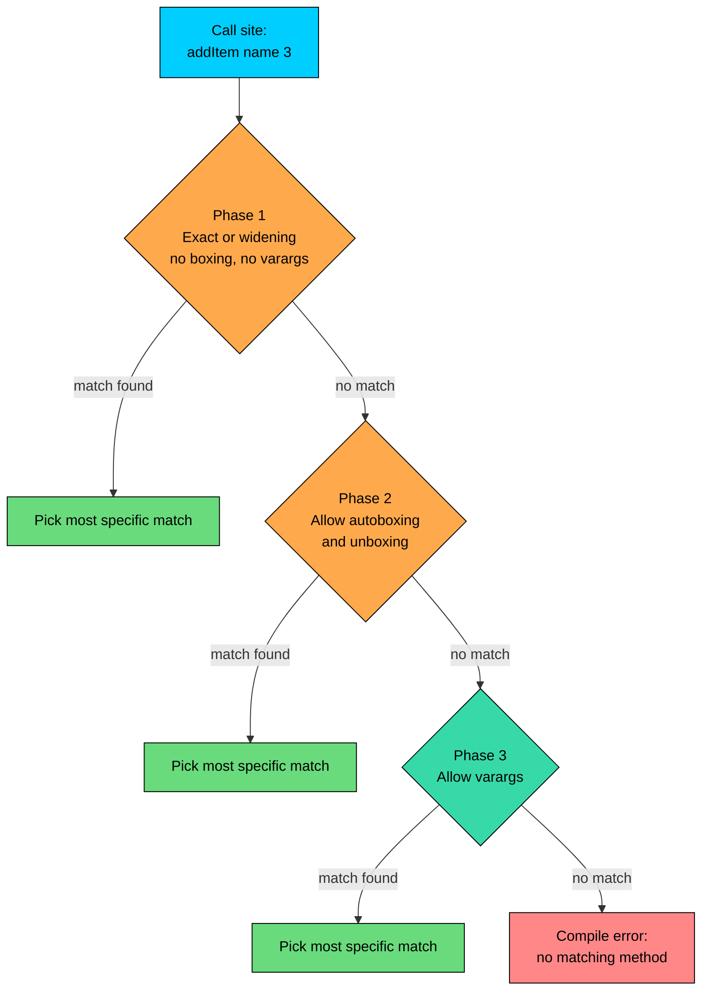

import React from 'react';
import CodeBlock from '../../../../components/ui/CodeBlock';
import Callout from '../../../../components/ui/Callout';

<div className="article-header">
  <div className="breadcrumb">
    <a href="/">Curated Notes</a>
    <span className="breadcrumb-separator">›</span>
    <span className="breadcrumb-current">Method Overloading</span>
  </div>
  <h1>Method Overloading</h1>
  <p style={{ color: 'var(--text-muted)', fontSize: '1.1rem', marginBottom: '16px', lineHeight: '1.6' }}>
    Master the essentials of Method Overloading in this curated guide.
  </p>
  <div className="meta-info">
    <span className="meta-item">
      <svg width="14" height="14" viewBox="0 0 24 24" fill="none" stroke="currentColor" strokeWidth="2"><circle cx="12" cy="12" r="10"/><polyline points="12 6 12 12 16 14"/></svg>
      10 min read
    </span>
    <span className="difficulty-badge difficulty-badge--intermediate">Intermediate</span>
  </div>
</div>

<section className="content-section">

Real code rarely has one perfect shape for a method. Adding a `Product` to a cart might need its full information, or just a name and price, or a quantity attached. Three different names like `addProductObject`, `addProductByName`, and `addProductWithQuantity` would force every call site to remember which spelling matches which situation. Java lets all three methods share the same name, as long as the compiler can tell them apart by their parameter list. That feature is called method overloading, and it's the focus of this lesson.

This lesson starts with the rules that govern when two methods are "different enough" to coexist, walks through how the compiler picks which one to call, and finishes with common patterns and pitfalls.

---

## What Overloading Means

Two methods are **overloaded** when they share the same name in the same class but have different parameter lists. Different in this case means a different number of parameters, different parameter types, or the same types in a different order. The compiler treats each overload as a distinct method. Which one runs at a given call site is decided at compile time, based on the types of the arguments passed.

A small cart class with three overloads of `addItem`.


```java
public class Cart {
    public static void addItem(String name) {
        System.out.println("Added: " + name + " (qty 1, no price)");
    }

    public static void addItem(String name, int quantity) {
        System.out.println("Added: " + name + " x" + quantity);
    }

    public static void addItem(String name, double price, int quantity) {
        double subtotal = price * quantity;
        System.out.println("Added: " + name + " x" + quantity + " = $" + subtotal);
    }

    public static void main(String[] args) {
        addItem("Wireless Mouse");
        addItem("USB Cable", 2);
        addItem("Headphones", 49.99, 3);
    }
}
```


Three calls, three different methods, one name. From the caller's point of view, `addItem` is one operation with a flexible shape. From the compiler's point of view, there are three completely separate methods, and the argument list at the call site picks one.

The win is at the call site. There is no need to remember three names, and no need to pass placeholder values like `-1` for "no price" or `null` for "no quantity" just to match a single fixed signature. The method called matches the information available.


&gt; **INFO**
&gt;
&gt; **A quick note on overriding.** Overloading is not the same as overriding. Overloading means multiple methods with the same name in one class, distinguished by their parameters. Overriding means a subclass replacing an inherited method with its own version. The two should not be conflated.


---

## The Rules: What Makes an Overload Valid

Two methods with the same name are valid overloads only when their parameter lists differ in at least one of these ways:


| Difference | Example |
| --- | --- |
| Different number of parameters | `addItem(String)` vs `addItem(String, int)` |
| Different parameter types | `addItem(String)` vs `addItem(Product)` |
| Same types in a different order | `applyDiscount(Product, double)` vs `applyDiscount(double, Product)` |


The method's **name** plus its **ordered list of parameter types** is called its signature. As long as two signatures differ, the methods can coexist.

What does **not** count:

- **The return type alone.** Two methods with the same name and parameter list, but different return types, are not overloads. They're a compile error.
- **Parameter names.** `addItem(String name)` and `addItem(String productName)` have the same signature, because the compiler only looks at types.
- **`final`, access modifiers, or `throws` clauses.** Marking a parameter `final` or changing whether the method is `public` or `private` doesn't create a new signature.

A class showing one valid set of overloads and one combination that fails to compile.


```java
public class Pricing {
    public static double calculatePrice(double base) {
        return base;
    }

    public static double calculatePrice(double base, double discountPercent) {
        return base * (1 - discountPercent / 100);
    }

    public static double calculatePrice(double base, int quantity) {
        return base * quantity;
    }

    // The following method would NOT compile if uncommented:
    // public static int calculatePrice(double base) { return (int) base; }
    // Reason: same name, same parameter list as the first method.
    // Return type alone is not enough to overload.

    public static void main(String[] args) {
        System.out.println(calculatePrice(49.99));
        System.out.println(calculatePrice(49.99, 10.0));
        System.out.println(calculatePrice(49.99, 3));
    }
}
```


The three working overloads have parameter lists `(double)`, `(double, double)`, and `(double, int)`. The commented-out version conflicts with the first overload because only its return type is different, and that's not a valid difference.

---

## Why Return Type Alone Doesn't Work

The compiler picks an overload based on the arguments at the call site. The return type isn't part of that decision, because in plenty of situations, the caller ignores the return value entirely.


```java
public class IgnoredReturn {
    public static int addToCart(String item) {
        return 1;
    }

    // Imagine a second version with the same parameters but a different return type:
    // public static double addToCart(String item) { return 1.0; }

    public static void main(String[] args) {
        addToCart("Wireless Mouse"); // return value thrown away
    }
}
```


If both versions existed, which one should the compiler call when the return value is discarded? Nothing in `addToCart("Wireless Mouse")` tells the compiler whether the `int` version or the `double` version was intended. The argument list is identical. Java avoids the ambiguity by forbidding the situation outright: two methods with the same name and parameter list are not allowed, no matter what their return types are.

The same reasoning applies to assignments. Even when the return value is used, type inference doesn't always pin a single answer. Consider `int total = addToCart("Mouse")`. Both the `int` and `double` versions could plausibly fit (with a narrowing cast for the `double`). Java avoids inventing rules to resolve that and instead disallows the overload pair.

For two methods that do "the same thing" but produce different types, give them different names. `priceAsCents()` returning `int` and `priceAsDollars()` returning `double` is a clearer design than trying to overload a single name.

---

## How the Compiler Picks an Overload

For a call like `addItem("Mouse", 3)`, the compiler asks: which of the overloaded methods named `addItem` can accept these arguments, and which is the best match? The answer comes out of a three-phase search. Phase 1 looks for an exact or widening match without any boxing or varargs. Phase 2 reconsiders with autoboxing and unboxing turned on. Phase 3 reconsiders again, now allowing varargs. The first phase that finds a match wins, and if more than one method ties inside the same phase, the compiler picks the most specific one. If it can't pick one, the result is a compile error.





The diagram captures the order. The intuition is: the compiler prefers an answer that doesn't have to do anything special with the arguments. Widening (`int` to `long`, `int` to `double`) is automatic and happens in Phase 1. Boxing (turning `int` into `Integer`) is more expensive and only happens if nothing in Phase 1 matched. Varargs are the last resort because they involve allocating an array.

#### Phase 1: Exact and Widening Matches

If an argument type exactly matches a parameter type, that's the easiest case. If it doesn't, the compiler tries a widening primitive conversion (`byte` to `short` to `int` to `long` to `float` to `double`) or a widening reference conversion (subclass to superclass).


```java
public class ResolutionPhase1 {
    public static void log(int n) {
        System.out.println("int: " + n);
    }

    public static void log(long n) {
        System.out.println("long: " + n);
    }

    public static void log(double n) {
        System.out.println("double: " + n);
    }

    public static void main(String[] args) {
        log(5);          // exact match: int
        log(5L);         // exact match: long
        log(5.0);        // exact match: double
        short small = 5;
        log(small);      // widens short to int
    }
}
```


The fourth call passes a `short`. There's no `log(short)` overload, but `short` widens to `int` (the most specific available match), so `log(int)` wins. Note that `short` also widens to `long` and `double`, but those would lose specificity. The compiler picks the closest fit.

#### Phase 1 Tie-Breaker: Most Specific Wins

When two overloads in the same phase could both accept the arguments, the compiler picks the one whose parameter types are "more specific". For primitives, more specific means smaller-or-equal in the widening chain. For reference types, it means the more derived class.


```java
public class MostSpecific {
    public static void price(double amount) {
        System.out.println("double overload: " + amount);
    }

    public static void price(int amount) {
        System.out.println("int overload: " + amount);
    }

    public static void main(String[] args) {
        price(50);     // int literal
        price(50.0);   // double literal
    }
}
```


Both overloads could accept `50` (the `int` directly, the `double` via widening), but `int` is more specific than `double`, so `price(int)` wins. The second call passes a `double` literal, which only matches the `double` overload.

#### Phase 2: Autoboxing and Unboxing

If Phase 1 found nothing, the compiler retries with boxing turned on. Now `int` can match an `Integer` parameter (boxing) and `Integer` can match an `int` parameter (unboxing).


```java
public class ResolutionPhase2 {
    public static void track(int orderId) {
        System.out.println("int overload");
    }

    public static void track(Integer orderId) {
        System.out.println("Integer overload");
    }

    public static void main(String[] args) {
        int primitive = 42;
        Integer boxed = 42;

        track(primitive);  // Phase 1 matches int directly
        track(boxed);      // Phase 1 matches Integer directly
    }
}
```


Both calls find their match in Phase 1. Boxing isn't needed here because each overload directly matches one of the argument types.

The Phase 2 behavior shows up when only the boxed version exists.


```java
public class BoxingOnly {
    public static void track(Integer orderId) {
        System.out.println("Tracking Integer order: " + orderId);
    }

    public static void main(String[] args) {
        track(42); // int gets autoboxed to Integer
    }
}
```


The literal `42` is an `int`. There's no `track(int)`, so Phase 1 fails. Phase 2 retries with autoboxing, finds `track(Integer)`, and the call succeeds.

Autoboxing creates a new `Integer` object (unless the value is cached, which Java does for small ints). In a tight loop, picking the boxed overload when a primitive one would do means extra allocations. When both `add(int)` and `add(Integer)` are available, prefer the primitive form for hot code.

#### Phase 3: Varargs

If Phases 1 and 2 both fail, the compiler tries varargs methods. Varargs (`String...`) are a way to accept any number of arguments of a given type. For now, the relevant point for overload resolution is that they get tried last.


```java
public class VarargsLast {
    public static void log(int a, int b) {
        System.out.println("two-arg overload");
    }

    public static void log(int... values) {
        System.out.println("varargs overload, count=" + values.length);
    }

    public static void main(String[] args) {
        log(1, 2);     // fixed-arity wins over varargs
        log(1, 2, 3);  // only varargs can take 3 args
    }
}
```


The first call has a fixed-arity match in Phase 1, so the two-arg version wins even though the varargs version could also accept two values. The second call has no fixed match for three arguments, so Phase 3 picks the varargs.

---

## Ambiguous Calls and How to Fix Them

The compiler refuses to guess when two overloads tie in the same phase and neither is more specific than the other. That situation is called an **ambiguous method call**, and it shows up as a compile error.


```java
public class AmbiguousExample {
    public static void price(int a, double b) {
        System.out.println("int, double");
    }

    public static void price(double a, int b) {
        System.out.println("double, int");
    }

    public static void main(String[] args) {
        price(5, 10); // ambiguous: both overloads need one widening
    }
}
```


The compiler error reads like this:


```shell
error: reference to price is ambiguous
        price(5, 10);
        ^
  both method price(int,double) in AmbiguousExample and method price(double,int) in AmbiguousExample match
```


Both arguments are `int` literals. To call `price(int, double)`, the second `int` widens to `double`. To call `price(double, int)`, the first `int` widens to `double`. Each overload needs exactly one widening, and neither is "more specific" than the other. Java won't flip a coin.

The fix is to make the intent explicit with a cast.


```java
public class AmbiguousFixed {
    public static void price(int a, double b) {
        System.out.println("int, double");
    }

    public static void price(double a, int b) {
        System.out.println("double, int");
    }

    public static void main(String[] args) {
        price(5, (double) 10); // forces the int, double overload
        price((double) 5, 10); // forces the double, int overload
    }
}
```


A cast on an argument tells the compiler the type before resolution even starts. Once one argument has a fixed type that only matches one overload, the ambiguity disappears.

Ambiguity also shows up with `null` arguments when more than one reference-type overload could accept it.


```java
public class NullAmbiguity {
    public static void search(String query) {
        System.out.println("String overload");
    }

    public static void search(Integer code) {
        System.out.println("Integer overload");
    }

    public static void main(String[] args) {
        // search(null);             // ambiguous
        search((String) null);       // forces the String overload
        search((Integer) null);      // forces the Integer overload
    }
}
```


A bare `null` could go to either overload, since `null` is assignable to any reference type. The cast picks one.

---

## Useful Overload Patterns

Most overloads in production Java fall into one of a few patterns. Recognizing them helps decide when overloading is appropriate.

#### Pattern 1: Default Values via Delegation

A common reason to overload is to provide convenient defaults for parameters the caller usually doesn't care about. The shorter overloads delegate to the fullest one so the actual logic lives in exactly one place.


```java
public class CartWithDefaults {
    public static void addItem(String name) {
        addItem(name, 0.0, 1);
    }

    public static void addItem(String name, int quantity) {
        addItem(name, 0.0, quantity);
    }

    public static void addItem(String name, double price, int quantity) {
        double subtotal = price * quantity;
        System.out.println("Added " + name + " x" + quantity + " @ $" + price + " = $" + subtotal);
    }

    public static void main(String[] args) {
        addItem("Free Sample");
        addItem("USB Cable", 2);
        addItem("Headphones", 49.99, 3);
    }
}
```


All three calls funnel through the same three-argument method, so any future change (logging, validation, stock check) only needs to land in one place. The shorter overloads are pure pass-throughs. Spreading the logic across all three would require updating each one in lockstep.

#### Pattern 2: Same Action, Different Input Shape

When the same conceptual action can take its input in more than one form, overloading lets the caller hand over whatever they happen to have.


```java
public class Catalog {
    public static void addProduct(Product product) {
        System.out.println("Adding existing product: " + product.name);
    }

    public static void addProduct(String name, double price) {
        Product fresh = new Product(name, price);
        addProduct(fresh);
    }

    public static void main(String[] args) {
        Product existing = new Product("Wireless Mouse", 29.99);
        addProduct(existing);
        addProduct("USB Cable", 9.99);
    }

    static class Product {
        String name;
        double price;

        Product(String name, double price) {
            this.name = name;
            this.price = price;
        }
    }
}
```


The two-argument overload builds a `Product` and forwards to the single-argument one, so the "real" work happens in one method. This is a typical pattern for builder-style APIs where the caller might have a complete object or only a couple of fields.

#### Pattern 3: Search Methods With Different Filters

Overloads also fit when the same query can be narrowed in several ways. The method name describes the action; the parameter list describes the filter.


```java
import java.util.List;

public class ProductSearch {
    public static void searchProducts(String keyword) {
        System.out.println("Searching by keyword: " + keyword);
    }

    public static void searchProducts(String keyword, String category) {
        System.out.println("Searching for '" + keyword + "' in " + category);
    }

    public static void searchProducts(String keyword, double minPrice, double maxPrice) {
        System.out.println("Searching for '" + keyword + "' between $" + minPrice + " and $" + maxPrice);
    }

    public static void searchProducts(List<String> categories) {
        System.out.println("Searching across categories: " + categories);
    }

    public static void main(String[] args) {
        searchProducts("mouse");
        searchProducts("mouse", "Electronics");
        searchProducts("mouse", 10.0, 50.0);
        searchProducts(List.of("Electronics", "Accessories"));
    }
}
```


Each overload represents a different way to ask the same question. Callers don't have to learn four method names; they call `searchProducts` and pass whichever filter is available.

#### Pattern 4: Overloaded Discount Application

A common e-commerce variant: applying a discount can mean a percentage off, a flat dollar amount off, or a coupon code that resolves into a discount internally. Same name, three shapes.


```java
public class DiscountService {
    public static double applyDiscount(double price, double percentOff) {
        return price * (1 - percentOff / 100);
    }

    public static double applyDiscount(double price, int dollarsOff) {
        return Math.max(0, price - dollarsOff);
    }

    public static double applyDiscount(double price, String couponCode) {
        if (couponCode.equals("WELCOME10")) {
            return applyDiscount(price, 10.0);
        }
        if (couponCode.equals("SAVE5")) {
            return applyDiscount(price, 5);
        }
        return price;
    }

    public static void main(String[] args) {
        System.out.println("Percent off: $" + applyDiscount(49.99, 20.0));
        System.out.println("Flat off:    $" + applyDiscount(49.99, 5));
        System.out.println("Coupon:      $" + applyDiscount(49.99, "WELCOME10"));
    }
}
```


The second and first overloads differ only in whether their second parameter is `int` or `double`. That makes `applyDiscount(49.99, 5)` resolve to the `int` version (because `5` is an `int` literal) and `applyDiscount(49.99, 20.0)` resolve to the `double` version. Passing the wrong literal type selects the wrong overload, which is one of the small risks of overloading on closely related numeric types. When in doubt, be explicit at the call site, or use distinct method names like `applyPercentDiscount` and `applyDollarDiscount`.

---

## Overloading Constructors

Methods aren't the only thing that can be overloaded. Constructors follow the same rules. A quick example here shows the same idea applies.


```java
public class Order {
    private String customerName;
    private int itemCount;
    private double total;

    public Order(String customerName) {
        this(customerName, 0, 0.0);
    }

    public Order(String customerName, int itemCount) {
        this(customerName, itemCount, 0.0);
    }

    public Order(String customerName, int itemCount, double total) {
        this.customerName = customerName;
        this.itemCount = itemCount;
        this.total = total;
    }

    @Override
    public String toString() {
        return customerName + ": " + itemCount + " items, $" + total;
    }

    public static void main(String[] args) {
        System.out.println(new Order("Alice"));
        System.out.println(new Order("Bob", 3));
        System.out.println(new Order("Carol", 5, 149.95));
    }
}
```


The `this(...)` call inside a constructor invokes another constructor in the same class. It's the constructor equivalent of the delegation pattern shown with `addItem`. This is the conventional way to provide multiple ways to build the same object without duplicating field assignments.

---

## When Not to Overload

Overloading reads cleanly when the methods do the same conceptual thing. It reads badly when the methods do different things and happen to share a name.

Consider `process(Order order)` charging the customer and `process(Refund refund)` crediting the customer. Both are "processing", but a reader scanning the call site sees only `process(...)` and has to chase the parameter type to figure out which action is happening. Two different actions deserve two different names: `chargeOrder(order)` and `issueRefund(refund)`. The call site becomes self-documenting.

A useful test: if a single sentence describing "what `methodName` does" fits every overload without weasel words like "it depends" or "or" in the middle, overloading fits. If not, give them different names.

Two other situations where overloading is the wrong tool:

- **Overloads that take the same arguments but mean different things based on context.** If a caller could plausibly call the wrong overload by accident, the design is fragile. Be especially careful with overloads that differ only by `int` vs `double` or `int` vs `Integer`, because tiny changes in how a number is written can silently flip which overload runs.
- **Overloads with very different numeric meanings.** `setRating(int stars)` and `setRating(double percent)` look like one method but mean completely different things. `setStarRating(int)` and `setPercentRating(double)` make the intent obvious and remove the chance of a numeric literal picking the wrong overload.

</section>
