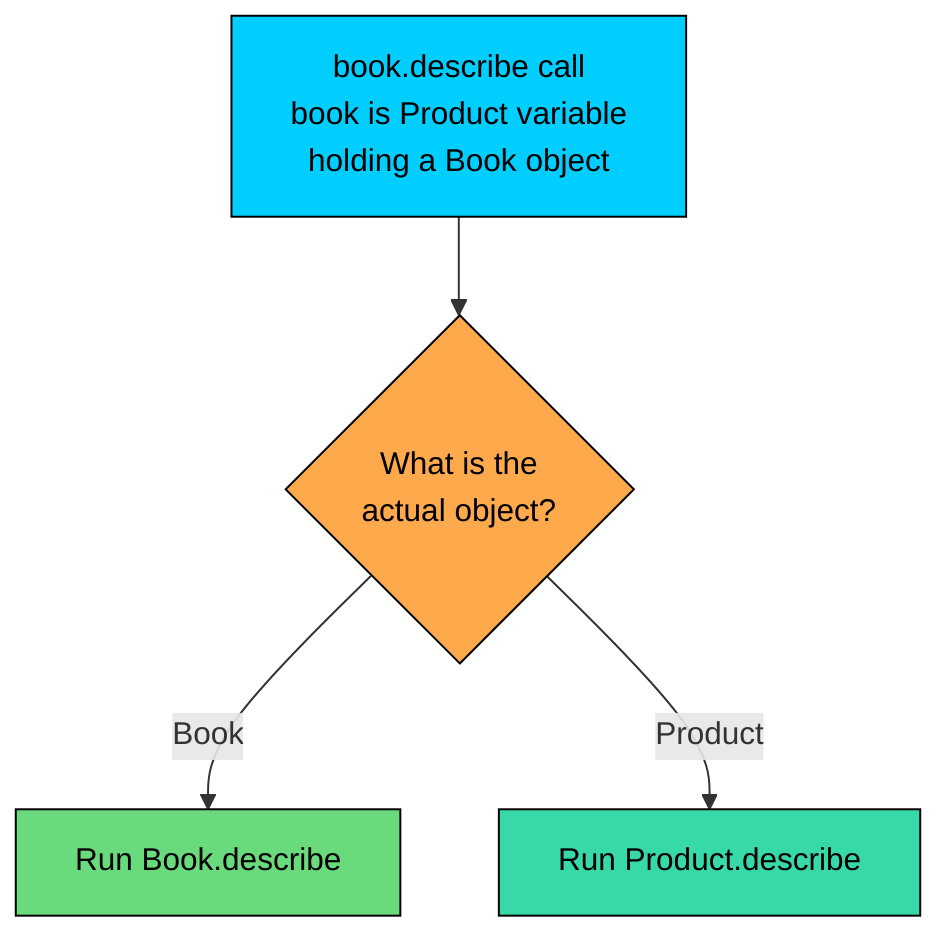
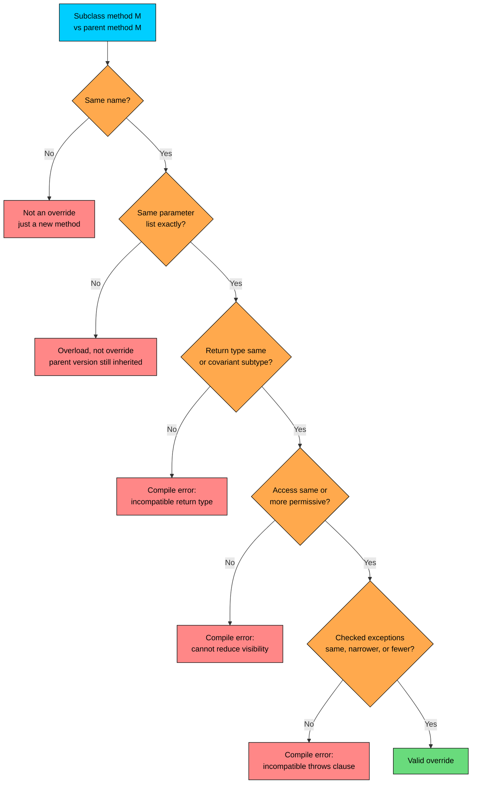

import React from 'react';
import CodeBlock from '../../../../components/ui/CodeBlock';
import Callout from '../../../../components/ui/Callout';

<div className="article-header">
  <div className="breadcrumb">
    <a href="/">Curated Notes</a>
    <span className="breadcrumb-separator">›</span>
    <span className="breadcrumb-current">Method Overriding</span>
  </div>
  <h1>Method Overriding</h1>
  <p style={{ color: 'var(--text-muted)', fontSize: '1.1rem', marginBottom: '16px', lineHeight: '1.6' }}>
    Master the essentials of Method Overriding in this curated guide.
  </p>
  <div className="meta-info">
    <span className="meta-item">
      <svg width="14" height="14" viewBox="0 0 24 24" fill="none" stroke="currentColor" strokeWidth="2"><circle cx="12" cy="12" r="10"/><polyline points="12 6 12 12 16 14"/></svg>
      10 min read
    </span>
    <span className="difficulty-badge difficulty-badge--intermediate">Intermediate</span>
  </div>
</div>

<section className="content-section">

The last two chapters showed subclasses replacing parent methods to print different messages or compute different totals, without naming what was happening. The mechanism is called method overriding, and the rules around it are stricter than they look. This lesson lays out exactly when a method actually overrides its parent, when it accidentally creates a new method instead, what the compiler enforces, and why `@Override` is the cheapest bug-prevention tool in Java.

---

## What Overriding Is

Method overriding happens when a subclass defines a method with the same signature as a method it inherits from its parent, and replaces the parent's implementation with its own. The subclass version runs when the method is called on an instance of the subclass, even when the instance is held through a parent-typed variable.

A small product hierarchy to make that concrete. `Product` knows how to describe itself in a generic way. `Book` is a `Product` that wants a richer description.


```java
public class OverrideBasics {
    public static void main(String[] args) {
        Product generic = new Product("Wireless Mouse", 29.99);
        Product book = new Book("Effective Java", 45.00, "Joshua Bloch");

        System.out.println(generic.describe());
        System.out.println(book.describe());
    }
}

class Product {
    protected String name;
    protected double price;

    public Product(String name, double price) {
        this.name = name;
        this.price = price;
    }

    public String describe() {
        return name + " at $" + price;
    }
}

class Book extends Product {
    private String author;

    public Book(String name, double price, String author) {
        super(name, price);
        this.author = author;
    }

    @Override
    public String describe() {
        return name + " by " + author + " at $" + price;
    }
}
```


Two things matter here. First, `Book.describe()` replaces `Product.describe()` entirely for `Book` instances. Second, the variable `book` is declared as `Product`, but the call resolves to `Book.describe()` because Java looks at the actual object, not the variable's declared type. That last point is the heart of runtime polymorphism, covered at the end of this lesson.





The declared type of the variable picks which methods are visible to the compiler. The actual object picks which version actually runs. This distinction comes back several times in this lesson.

---

## Overloading vs Overriding

These two words sound similar and are easy to confuse. They are not related concepts. Overloading happens inside one class. Overriding happens across a parent-child pair.


| Aspect | Overloading | Overriding |
| --- | --- | --- |
| Where it happens | Same class | Subclass replacing parent's method |
| Same method name? | Yes | Yes |
| Same parameter list? | No (must differ) | Yes (must match exactly) |
| Return type | Can be anything | Same or covariant subtype |
| Access modifier | Independent | Same or more permissive |
| Resolved when? | Compile time (static types of args) | Runtime (actual object type) |
| What it's for | Multiple call shapes for one action | Specialized behavior in a subclass |


Overloading is about giving callers different ways to invoke the same operation. Overriding is about a subclass saying "for this exact operation, do it my way instead." Changing the parameter list in a subclass while expecting to override actually overloads the method, which means the parent's version still runs for any inherited call. That's one of the bugs `@Override` exists to catch.

---

## The Five Overriding Rules

For a subclass method to actually override a parent method, five conditions must all be true. The compiler enforces every one of them.

1. **Same method name.** Capitalization counts. `Describe` and `describe` are different methods.
2. **Same parameter list.** Same number of parameters, same types in the same order. Parameter names don't matter, but everything else about the types must match exactly. Even autoboxing doesn't count: `(int)` and `(Integer)` are different signatures.
3. **Return type is the same or covariant.** Covariant means the child's return type is a subtype of the parent's return type. We give covariant returns their own section below.
4. **Access modifier is the same or more permissive.** A `protected` method in the parent can be overridden as `protected` or `public`, but not `private` or package-private. Visibility cannot be reduced.
5. **Checked exceptions can be the same, narrower, fewer, or none.** A child override cannot throw new or broader checked exceptions than the parent declares. Unchecked exceptions (subclasses of `RuntimeException`) are unrestricted.

The decision tree for "is this an override?" looks like this.





The next few subsections walk through each rule with code that compiles and code that doesn't.

#### Rule 1 and 2: Same Name, Same Parameter List

These two are the obvious ones, but they're also where most accidental "non-overrides" happen. The parent method silently keeps running when the parameter list doesn't quite match.


```java
public class AccidentalOverload {
    public static void main(String[] args) {
        Product p = new DiscountedProduct("USB Cable", 9.99);
        System.out.println(p.describe());
    }
}

class Product {
    String name;
    double price;

    Product(String name, double price) {
        this.name = name;
        this.price = price;
    }

    public String describe() {
        return "Product: " + name + " at $" + price;
    }
}

class DiscountedProduct extends Product {
    DiscountedProduct(String name, double price) {
        super(name, price);
    }

    // Looks like an override, but it isn't.
    // Parameter list differs (added an int), so this is an overload.
    public String describe(int verbosity) {
        return "Discounted product: " + name + " at $" + price;
    }
}
```


The author of `DiscountedProduct` probably intended `p.describe()` to print "Discounted product...". It didn't. The new method took an extra `int`, so the compiler treated it as a different method altogether. The original `Product.describe()` is still inherited and still runs. No error, no warning, just wrong behavior.

The fix is to match the signature exactly, or to add `@Override` so the compiler refuses to compile the mismatch in the first place.

#### Rule 3: Return Type Must Be Same or Covariant

If the parent returns `String`, the child can return `String`. The child can also return a subtype of `String`, but `String` is `final`, so in practice that just means `String`. With non-`final` parent return types, the child has more options. Covariants get their own section because they're useful enough to deserve real coverage.

A widened return type, on the other hand, is not allowed. If the parent returns `Book` and the child tries to return `Product`, the compiler rejects it.


```java
class Product { /* ... */ }
class Book extends Product { /* ... */ }

class Catalog {
    public Book findFeatured() { return new Book(); }
}

class WideningReturnFails extends Catalog {
    @Override
    public Product findFeatured() { return new Product(); } // does NOT compile
}
```


The compiler reports something like:


```shell
error: findFeatured() in WideningReturnFails cannot override findFeatured() in Catalog
  return type Product is not compatible with Book
```


Why this restriction? Callers of `Catalog.findFeatured()` are entitled to a `Book` based on the parent's contract. If a subclass could return any `Product`, those callers would break. Returning a narrower type is safe, returning a wider one is not.

#### Rule 4: Access Cannot Be Narrowed

If the parent method is `public`, the override must be `public`. Not `protected`, not package-private, not `private`. The principle is that any caller able to legally call the parent method must also be able to call the override, because they might be holding a child instance through a parent-typed variable without knowing it.


```java
class Product {
    public String describe() {
        return "A product";
    }
}

class Book extends Product {
    @Override
    protected String describe() { // does NOT compile
        return "A book";
    }
}
```


The compiler error reads:


```shell
error: describe() in Book cannot override describe() in Product
  attempting to assign weaker access privileges; was public
```


The other direction is allowed. Overriding a `protected` parent method with a `public` child method is fine, because that widens access rather than narrowing it.


| Parent's access | Child override can be |
| --- | --- |
| `public` | `public` only |
| `protected` | `protected` or `public` |
| package-private (default) | package-private, `protected`, or `public` |
| `private` | Not inherited at all, so not overridable. See "What Cannot Be Overridden". |


#### Rule 5: Checked Exceptions Cannot Be Broadened

A child override is allowed to throw the same checked exceptions as the parent, narrower ones (subclasses), fewer of them, or none. It cannot add new checked exceptions or replace an existing one with a broader type.


```java
import java.io.IOException;
import java.io.FileNotFoundException;

class OrderStore {
    public void save() throws IOException {
        // parent declares IOException
    }
}

class FileOrderStore extends OrderStore {
    @Override
    public void save() throws FileNotFoundException {
        // narrower than IOException, allowed
    }
}

class CloudOrderStore extends OrderStore {
    @Override
    public void save() {
        // throws nothing, allowed
    }
}

class BadOrderStore extends OrderStore {
    @Override
    public void save() throws Exception { // NOT allowed
        // Exception is broader than IOException
    }
}
```


The last one fails with:


```shell
error: save() in BadOrderStore cannot override save() in OrderStore
  overridden method does not throw java.lang.Exception
```


The reasoning is the same shape as the access rule. Callers of `OrderStore.save()` only catch `IOException`. If a child slipped in a broader `Exception`, those callers would suddenly have unhandled checked exceptions in code that the compiler had previously approved. To keep the parent's contract honest, children can only throw the same or less.

Unchecked exceptions (`RuntimeException` and its subclasses) escape this rule entirely. A child can throw `IllegalArgumentException` from an override even if the parent declared no exceptions. The compiler doesn't enforce `throws` clauses for unchecked exceptions, so it doesn't check them on overrides either.

---

## The `@Override` Annotation

`@Override` is an annotation placed right above a method intended to override a parent. It tells the compiler: "this method overrides something in a parent class or interface. If it doesn't, please refuse to compile." It changes no behavior at runtime. Its entire job is to catch the silent-failure cases just shown.


```java
public class OverrideAnnotation {
    public static void main(String[] args) {
        Product b = new Book("Effective Java", 45.00, "Joshua Bloch");
        System.out.println(b.describe());
    }
}

class Product {
    String name;
    double price;

    Product(String name, double price) {
        this.name = name;
        this.price = price;
    }

    public String describe() {
        return name + " at $" + price;
    }
}

class Book extends Product {
    String author;

    Book(String name, double price, String author) {
        super(name, price);
        this.author = author;
    }

    @Override
    public String describe() {
        return name + " by " + author + " at $" + price;
    }
}
```


Without the `@Override` annotation, this still works. So why bother?

Consider a typo in the method name during a refactor.


```java
class Book extends Product {
    // ...

    @Override
    public String descripe() { // typo: "descripe" not "describe"
        return name + " by " + author + " at $" + price;
    }
}
```


The compiler error reads:


```shell
error: method does not override or implement a method from a supertype
    @Override
    ^
```


Without `@Override`, this typo would compile cleanly. The class would have two methods, the inherited `describe()` from `Product` and a brand-new `descripe()` defined here. Calls to `book.describe()` would silently run the parent's version. A reader scanning the code would see the override and assume it ran. Bugs like this are surprisingly hard to find because nothing crashes, the output is just subtly wrong.

`@Override` catches every shape of accidental non-override: typos in the name, wrong parameter types, wrong number of parameters, wrong order of parameters. Any of those means the method doesn't actually match a parent method, and `@Override` turns that mismatch into a compile error.

The rule of thumb is simple: put `@Override` on every method intended as an override. There's no downside. It costs nothing at runtime, makes the intent obvious to readers, and traps the entire class of bugs where a "missed" override silently falls back to the parent.

---

## Covariant Return Types

Rule 3 said the override's return type can be the same as the parent's or a covariant subtype. Covariant return types let a subclass return a more specific type than the parent declared. This is useful in practice, not just an edge case.

The example: a `Catalog` has a method `featuredItem()` that returns a `Product`. A subclass `BookCatalog` only ever stocks books, so its `featuredItem()` should return a `Book`. Java lets the return type be tightened.


```java
public class CovariantReturn {
    public static void main(String[] args) {
        Catalog generic = new Catalog();
        BookCatalog books = new BookCatalog();

        Product p = generic.featuredItem();
        Book b = books.featuredItem(); // no cast needed

        System.out.println(p.describe());
        System.out.println(b.describe() + " by " + b.author);
    }
}

class Product {
    String name;
    double price;

    Product(String name, double price) {
        this.name = name;
        this.price = price;
    }

    public String describe() {
        return name + " at $" + price;
    }
}

class Book extends Product {
    String author;

    Book(String name, double price, String author) {
        super(name, price);
        this.author = author;
    }
}

class Catalog {
    public Product featuredItem() {
        return new Product("Wireless Mouse", 29.99);
    }
}

class BookCatalog extends Catalog {
    @Override
    public Book featuredItem() { // covariant: Book is a subtype of Product
        return new Book("Effective Java", 45.00, "Joshua Bloch");
    }
}
```


The line doing the real work is `Book b = books.featuredItem();`. Without covariant returns, the override would have to return `Product`, and the caller would have to cast: `Book b = (Book) books.featuredItem();`. Every cast is a place where the type system stops helping, and a place where a future change can introduce a `ClassCastException`. Covariant returns push that knowledge into the type system so the cast disappears.

Covariant returns came in with Java 5. Before that, every override had to return exactly the parent's type. The feature is the reason patterns like `clone()` can return a precise type instead of bare `Object`.

Covariant returns add zero runtime cost. The compiler inserts a small bridge method internally so the parent's signature still works for callers holding a parent reference.

The only constraint is the direction. The return type can only get narrower, not wider. A child returning `Product` when the parent returns `Book` would fail to compile, as the Rule 3 section showed.

---

## What Cannot Be Overridden

Not every method in a parent class is up for grabs. Four kinds of "methods" in the parent are off-limits for overriding, and each one is off-limits for a different reason.

#### `final` Methods

A method marked `final` says "this implementation is the one, and no subclass gets to change it." Trying to override it is a compile error.


```java
class Product {
    public final String sku() {
        return name + "-SKU";
    }

    String name = "Wireless Mouse";
}

class Book extends Product {
    @Override
    public String sku() { // does NOT compile
        return "BOOK-" + name;
    }
}
```


The error reads:


```shell
error: sku() in Book cannot override sku() in Product
  overridden method is final
```


Authors mark methods `final` when the method's behavior is part of a guarantee the class wants to preserve, regardless of what subclasses do. Hash-key calculations, identity checks, security gates, anything where a misbehaving override would break invariants. `final` shows up on fields and parameters more often than on methods, but on methods it's a way to lock down behavior that shouldn't shift across the hierarchy.

#### `static` Methods

`static` methods belong to the class, not to any instance. They aren't part of an object's behavior, so the runtime polymorphism that powers overriding doesn't apply to them. If a subclass defines a `static` method with the same signature as a `static` method in the parent, what happens isn't overriding. It's a separate feature called **method hiding**, covered in its own section below.

#### `private` Methods

`private` methods aren't inherited by the subclass at all. The subclass can't see them, can't call them, can't override them. If the subclass happens to define a method with the same name and signature as a parent's `private` method, it's just a brand-new method that happens to share a name. There's no relationship between the two, and `@Override` on it fails to compile.


```java
class Product {
    private String secretSauce() {
        return "internal logic";
    }
}

class Book extends Product {
    // This is NOT an override. It's a new private method.
    private String secretSauce() {
        return "book-specific logic";
    }

    // The next line would fail to compile because secretSauce is not inherited.
    // @Override
    // private String secretSauce() { return "book"; }
}
```


The first `secretSauce` in `Book` compiles fine, but it has no connection to the parent's. Calls inside `Product`'s methods that hit `secretSauce()` will still run the parent's version, because the parent doesn't even know the child has a method by that name.

#### Constructors

Constructors aren't methods. They have no return type (not even `void`), their name is fixed by the class name, and they don't get inherited. There's no concept of "overriding a constructor" because there's nothing to override. A child class writes its own constructors that, by chaining, invoke a parent constructor. That's a different mechanism.

A summary table of what each modifier means for overriding.


| Parent method has | Inherited? | Can subclass override? | What happens if subclass declares same signature? |
| --- | --- | --- | --- |
| Default behavior (instance method, non-`final`) | Yes | Yes | Overrides |
| `final` | Yes | No | Compile error |
| `static` | Yes (as a class member) | No | Hides, doesn't override (see next section) |
| `private` | No | No | Creates a new, unrelated method |
| Constructor | N/A | N/A | Subclass writes its own, chained via `super(...)` |


---

## Method Hiding: When `static` Methods Look Overridden but Aren't

This is the most confusing corner of the lesson, so it gets its own section.

When a subclass defines a `static` method with the same signature as a `static` method in the parent, it doesn't override the parent's method. It **hides** it. The difference is which version gets called: hiding picks based on the declared (compile-time) type of the variable, while overriding picks based on the actual (runtime) object.

The example shows the difference clearly.


```java
public class StaticHiding {
    public static void main(String[] args) {
        Product p = new Book();

        // Instance method: overriding. Picks by actual object.
        System.out.println(p.describe());

        // Static method: hiding. Picks by declared type of p.
        System.out.println(p.category());
    }
}

class Product {
    public String describe() {
        return "A generic product";
    }

    public static String category() {
        return "Products";
    }
}

class Book extends Product {
    @Override
    public String describe() {
        return "A book";
    }

    // Hides the parent's static method. No @Override allowed here.
    public static String category() {
        return "Books";
    }
}
```


The variable `p` is declared `Product` but holds a `Book`. The instance method call `p.describe()` runs `Book.describe()` because Java looks at the actual object. The static method call `p.category()` runs `Product.category()` because Java looks at the declared type of `p`. Same variable, two different rules, because `describe` is an instance method and `category` is a static method.

Putting `@Override` on `Book.category()` causes the compiler to reject it:


```shell
error: method does not override or implement a method from a supertype
    @Override
    ^
```


That's because `@Override` only applies to overriding, and `static` methods don't override. They hide.

The takeaway: don't write `static` methods expecting subclass polymorphism. For behavior that varies by subclass, use instance methods. `static` methods are for class-level utilities where the type of the variable, not the type of the object, is what matters.

---

## Runtime Resolution: A Preview of Polymorphism

The phrase "Java looks at the actual object" has appeared three times now. This is the defining feature of overriding, and it has a name: **runtime polymorphism** (also called dynamic dispatch or late binding).

The compiler doesn't decide which override runs. It can't, because it only knows the declared type of the variable, and that type might just be a parent. The decision is made when the program runs and Java looks up the actual class of the object on the heap.


```java
public class RuntimeDispatch {
    public static void main(String[] args) {
        Product[] catalog = {
            new Product("Wireless Mouse", 29.99),
            new Book("Effective Java", 45.00, "Joshua Bloch"),
            new Product("USB Cable", 9.99)
        };

        for (Product p : catalog) {
            System.out.println(p.describe());
        }
    }
}

class Product {
    String name;
    double price;

    Product(String name, double price) {
        this.name = name;
        this.price = price;
    }

    public String describe() {
        return name + " at $" + price;
    }
}

class Book extends Product {
    String author;

    Book(String name, double price, String author) {
        super(name, price);
        this.author = author;
    }

    @Override
    public String describe() {
        return name + " by " + author + " at $" + price;
    }
}
```


The variable `p` in the loop is typed `Product`. The compiler only knows the declared type, but it generates code that, at runtime, asks each actual object which version of `describe` to run. The `Book` object answers with `Book.describe`. The other two answer with `Product.describe`. One loop, three call sites, two different methods, all because of runtime polymorphism.

Runtime dispatch adds a small indirection (one pointer hop through the object's method table) compared to a static call. In normal code this is invisible. In hot code paths, the JIT compiler often inlines virtual calls when it can prove the type is fixed, so the cost effectively disappears.

The takeaway is that overriding is what makes runtime polymorphism work, and runtime polymorphism is what makes overriding worth having.

</section>
