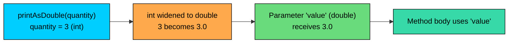
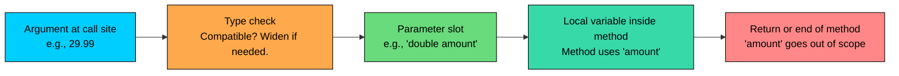

import React from 'react';
import CodeBlock from '../../../../components/ui/CodeBlock';
import Callout from '../../../../components/ui/Callout';

<div className="article-header">
  <div className="breadcrumb">
    <a href="/">Curated Notes</a>
    <span className="breadcrumb-separator">›</span>
    <span className="breadcrumb-current">Method Parameters</span>
  </div>
  <h1>Method Parameters</h1>
  <p style={{ color: 'var(--text-muted)', fontSize: '1.1rem', marginBottom: '16px', lineHeight: '1.6' }}>
    Master the essentials of Method Parameters in this curated guide.
  </p>
  <div className="meta-info">
    <span className="meta-item">
      <svg width="14" height="14" viewBox="0 0 24 24" fill="none" stroke="currentColor" strokeWidth="2"><circle cx="12" cy="12" r="10"/><polyline points="12 6 12 12 16 14"/></svg>
      10 min read
    </span>
    <span className="difficulty-badge difficulty-badge--intermediate">Intermediate</span>
  </div>
</div>

<section className="content-section">

The previous lesson introduced methods as named blocks of code. Most of those examples used methods that took no inputs, which only gets so far. Real methods need data to work with: a product's price, a customer's name, a list of items in a cart. Parameters are how that data flows into a method. This lesson covers the rules for declaring parameters, the difference between what the method signature says and what the call site provides, and the small handful of patterns that prevent the most common bugs.

---

## Parameters vs Arguments

The two words sound interchangeable, and they are often used that way, but Java draws a clean line between them.

A **parameter** is what shows up in the method declaration. It's the variable name and its type, sitting inside the parentheses next to the method name. The parameter exists only inside the method body. Outside the method, the name means nothing.

An **argument** is what gets passed when the method is called. It's the actual value the caller hands over: a literal like `29.99`, a variable like `itemPrice`, or an expression like `quantity * unitPrice`.


```java
public class CartPrinter {
    public static void main(String[] args) {
        double price = 19.99;
        printPrice(price);
        printPrice(29.99);
        printPrice(price * 2);
    }

    // 'amount' is the parameter
    static void printPrice(double amount) {
        System.out.println("Price: $" + amount);
    }
}
```


Inside `printPrice`, the value lives under the name `amount`. The caller never has to know that name. The caller hands over a number (the argument), and the method receives it under whatever name it chose for the parameter.

When "parameter" and "argument" are used interchangeably, the meaning usually carries through. In documentation, error messages, or interview questions, the distinction matters. "Argument type mismatch" points at the call site. "Parameter type" points at the declaration.

Read the parameter as the slot, and the argument as the thing that fills the slot. The slot is named and typed once, in the method declaration. The thing that fills it can be a different value every call.

---

## A Single Parameter

The simplest method takes one piece of data and does something with it. Declare the type, then the name, all inside the parentheses.


```java
public class GreetCustomer {
    public static void main(String[] args) {
        greet("Alice");
        greet("Bob");
    }

    static void greet(String customerName) {
        System.out.println("Welcome back, " + customerName + "!");
    }
}
```


The same `greet` method runs twice with different inputs. That's the point of a parameter: write the logic once, feed it different data each time.

The parameter name `customerName` is local to the method. It lives only between the opening brace and the closing brace of `greet`. The caller's variable, if there is one, doesn't have to share the name.


```java
public class CallerNames {
    public static void main(String[] args) {
        String name = "Carol";
        greet(name);

        String shopper = "Dave";
        greet(shopper);
    }

    static void greet(String customerName) {
        System.out.println("Welcome back, " + customerName + "!");
    }
}
```


The caller's variable can be called `name`, `shopper`, or anything else. Inside the method, the value shows up as `customerName` because that's what the parameter is named.

---

## Multiple Parameters

Methods can take more than one input. Separate parameters with commas. Each one needs its own type, even if two parameters happen to share the same type.


```java
public class CartTotal {
    public static void main(String[] args) {
        printSubtotal(29.99, 3);
        printSubtotal(9.50, 5);
    }

    static void printSubtotal(double itemPrice, int quantity) {
        double subtotal = itemPrice * quantity;
        System.out.println("Subtotal: $" + subtotal);
    }
}
```


Each parameter has its own type. Writing `double itemPrice, quantity` does not make `quantity` also a `double`, the way two variables on one line work in normal code. In a parameter list, every parameter is a fresh declaration.


```java
public class WrongSyntax {
    // Won't compile: 'int quantity' is fine, but 'double a, b' is not allowed here.
    // static void wrong(double a, b) { ... }

    static void right(double a, double b) {
        System.out.println(a + b);
    }
}
```


The compiler error for the bad version is roughly:


```shell
error: <identifier> expected
    static void wrong(double a, b) { ... }
                                ^
```


Each parameter must have an explicit type.

---

## Parameter Order Matters

A method's parameters are matched to the arguments by position, not by name. The first argument fills the first parameter slot, the second argument fills the second, and so on. Swapping the order at the call site changes the meaning.


```java
public class OrderMatters {
    public static void main(String[] args) {
        applyDiscount(100.0, 20.0);
        applyDiscount(20.0, 100.0);
    }

    static void applyDiscount(double price, double discountPercent) {
        double off = price * discountPercent / 100.0;
        double finalPrice = price - off;
        System.out.println("Price: $" + price + ", you pay: $" + finalPrice);
    }
}
```


The second call passes `20.0` as the price and `100.0` as the discount percent, which makes no sense as a discount. Java doesn't warn about this because both arguments are valid `double` values, and the types match. The bug is only visible from the output.

When two parameters share a type, the only safeguard against the wrong order is reading the method signature carefully. Helpful parameter names are part of that. `applyDiscount(double price, double discountPercent)` reads better than `applyDiscount(double a, double b)` precisely because the names tell what goes in which slot.

---

## Naming Parameters

A parameter's name is just a label, but the label affects every reader of the code. A few habits go a long way.

Use names that describe the role of the value, not the type. `customerName` beats `s` or `str`. `discountPercent` beats `d`. The method body is the only place the name is used, so spelling it out costs nothing and pays back at every call site that reads the signature.

Avoid generic placeholders like `value`, `data`, `temp`, `obj`, or single letters unless the math really is generic. A method that adds two numbers can call them `a` and `b`. A method that takes a price and a quantity should not.

Match the naming convention of the rest of the codebase: camelCase, starting with a lowercase letter. Reserved words like `class`, `int`, or `return` can't be used as names. Shadowing a class field with a parameter name is allowed, but it forces the use of `this.field = field` to disambiguate.


```java
public class GoodNames {
    public static void main(String[] args) {
        chargeCustomer("Alice", 29.99, "USD");
    }

    static void chargeCustomer(String customerName, double amount, String currency) {
        System.out.println("Charging " + customerName + ": " + amount + " " + currency);
    }
}
```


Reading the signature alone should reveal what the method needs. That's the bar.

---

## Passing Primitive Values

Primitive parameters cover the small fixed set of types Java has built in: `int`, `long`, `double`, `float`, `boolean`, `char`, `byte`, `short`. When a primitive is passed as an argument, the method receives a copy of that value. The method can change its parameter variable freely, and the caller's variable stays the same.


```java
public class CopyValue {
    public static void main(String[] args) {
        int stock = 10;
        decrement(stock);
        System.out.println("Stock in main: " + stock);
    }

    static void decrement(int count) {
        count = count - 1;
        System.out.println("Stock in method: " + count);
    }
}
```


The method's `count` variable holds a copy of `stock`'s value. Reassigning `count` inside the method has no effect on `stock` in `main`. That's the contract for primitives. The reasoning behind it (and how reference types compare) comes later in this section.

Every primitive parameter behaves the same way: a copy in, no observable change to the caller's variable.


```java
public class FlipFlag {
    public static void main(String[] args) {
        boolean isPremium = false;
        upgrade(isPremium);
        System.out.println("Premium in main: " + isPremium);
    }

    static void upgrade(boolean premium) {
        premium = true;
        System.out.println("Premium in method: " + premium);
    }
}
```


Same story for `boolean`, `char`, and the rest. The method receives a copy, edits the copy, and the original is untouched.

---

## Passing Reference Types

Strings, arrays, and objects are reference types. When one is passed as an argument, the method receives the reference, which is the address the object lives at. The caller and the method both point at the same object.

For the purposes of this lesson, the practical question is simpler: what shows up inside the method when a `String`, an array, or an object is passed? The answer is the same thing the caller has, accessible through the parameter name.


```java
public class PassString {
    public static void main(String[] args) {
        String productName = "Wireless Mouse";
        printLength(productName);
    }

    static void printLength(String name) {
        System.out.println("Name: " + name);
        System.out.println("Length: " + name.length());
    }
}
```


The method sees the same string the caller created, available under the local name `name`. Calling methods on it works exactly as it would from `main`.

Arrays follow the same usage pattern.


```java
public class PrintCart {
    public static void main(String[] args) {
        String[] cart = {"Mouse", "Keyboard", "Monitor"};
        printCart(cart);
    }

    static void printCart(String[] items) {
        System.out.println("Items in cart: " + items.length);
        for (int i = 0; i < items.length; i++) {
            System.out.println("  " + (i + 1) + ". " + items[i]);
        }
    }
}
```


The parameter `items` lets the method work with the same array the caller has. Anything possible with an array in `main` works the same way inside the method, through the parameter name.

What actually happens internally when a reference is passed, and whether changes to the object's contents are visible to the caller, comes later in this section. For now, the usage-level takeaway is enough: hand over the variable, the method gets to use it.

---

## Type Matching and Implicit Widening

The compiler checks every argument against its parameter's type before the call is allowed. If the types match exactly, the call goes through. If they don't, Java applies the same widening rules used in assignments: a smaller numeric type can flow into a larger one without a cast.


```java
public class WideningArgs {
    public static void main(String[] args) {
        int quantity = 3;
        printAsDouble(quantity);
        printAsDouble(29.99);
    }

    static void printAsDouble(double value) {
        System.out.println("Value: " + value);
    }
}
```


The first call passes an `int`. The parameter wants a `double`. Java widens the `int` to a `double` on the way in, so `3` becomes `3.0` inside the method. The same rule applies for `byte` to `int`, `short` to `long`, `float` to `double`, and so on. The relevant point here is that the same widening conversions Java applies in assignments happen automatically at call sites too.





The diagram shows the path an `int` argument takes when the parameter type is `double`: the value gets widened on the way in, the parameter receives the widened version, and the method body works with the wider type.

Narrowing the other direction does not happen on its own. Passing a `double` to a parameter declared as `int` is a compile error.


```java
public class NarrowingFails {
    public static void main(String[] args) {
        double price = 29.99;
        addToCart(price); // does not compile
    }

    static void addToCart(int amount) {
        System.out.println("Adding: " + amount);
    }
}
```


The compiler rejects this with:


```shell
error: incompatible types: possible lossy conversion from double to int
        addToCart(price);
                  ^
```


The fix is to make the narrowing explicit with a cast, the same way an assignment would.


```java
public class NarrowingCast {
    public static void main(String[] args) {
        double price = 29.99;
        addToCart((int) price);
    }

    static void addToCart(int amount) {
        System.out.println("Adding: " + amount);
    }
}
```


The cast truncates `29.99` to `29` before the method sees it. The point of forcing the cast is the same as everywhere else Java requires it: narrowing can lose information, and the language wants that acknowledged explicitly.

The same rules apply to references in a looser form. A parameter declared as `String` only accepts a `String` argument (or `null`). A parameter declared as a supertype accepts any subtype, which becomes relevant once inheritance enters the picture.

---

## Parameter Validation

A method has no control over what the caller passes in. A method that calculates a discount might receive a negative percentage. A method that looks up a product by index might receive a negative index. Without guards, the method either produces wrong output silently or crashes with a confusing error that points inside the method rather than at the bad input.

Parameter validation is the practice of checking inputs at the top of the method and rejecting the bad ones immediately, with a clear error.


```java
public class DiscountValidation {
    public static void main(String[] args) {
        applyDiscount(100.0, 20.0);
        applyDiscount(100.0, -5.0);
    }

    static void applyDiscount(double price, double percent) {
        if (percent < 0 || percent > 100) {
            throw new IllegalArgumentException(
                "Discount percent must be between 0 and 100, got: " + percent);
        }
        double finalPrice = price - (price * percent / 100.0);
        System.out.println("Final price: $" + finalPrice);
    }
}
```


The good call goes through. The bad one fails with a message that names the problem and the offending value. `IllegalArgumentException` is Java's standard exception for "this input is not acceptable". For now, treat `throw new IllegalArgumentException(...)` as a way to reject bad input and surface a clear error at the call site.

Common things to validate, depending on the method:


| Input kind | What to check |
| ---------- | ------------- |
| Number | Range, sign, finite (no `NaN`, no infinity for `double`) |
| `String` | Null, empty, length within bounds, expected format |
| Array or list | Null, non-empty if required, length within bounds |
| Index | `0 <= index < length` |
| Reference object | Null when null isn't acceptable |


The null check is the one beginners skip most often, and it bites the hardest because the resulting `NullPointerException` doesn't always point at the right line.


```java
public class NullCheck {
    public static void main(String[] args) {
        printGreeting("Alice");
        printGreeting(null);
    }

    static void printGreeting(String customerName) {
        if (customerName == null) {
            throw new IllegalArgumentException("customerName must not be null");
        }
        System.out.println("Hello, " + customerName.toUpperCase());
    }
}
```


Without the check, the second call would still fail, but with a `NullPointerException` from inside `toUpperCase`. The validated version fails earlier, with a message that names the parameter and the problem. That difference is the whole reason to validate.

For methods that take many parameters, `Objects.requireNonNull` keeps the checks compact. It's a utility method that throws `NullPointerException` when its argument is null and returns the value otherwise.


```java
import java.util.Objects;

public class RequireNonNull {
    public static void main(String[] args) {
        chargeCustomer("Alice", "USD");
    }

    static void chargeCustomer(String customerName, String currency) {
        Objects.requireNonNull(customerName, "customerName");
        Objects.requireNonNull(currency, "currency");
        System.out.println("Charging " + customerName + " in " + currency);
    }
}
```


If either argument were null, the exception would name the parameter that failed the check, so the caller doesn't have to guess which input was bad.

Validate at the top of the method, before any real work runs. A failed check short-circuits the method cleanly. Mixing validation with logic makes both harder to read.

---

## Final Parameters

A parameter can be marked `final`, which means the method body is not allowed to reassign it.


```java
public class FinalParam {
    public static void main(String[] args) {
        printDiscount(100.0, 20.0);
    }

    static void printDiscount(final double price, final double percent) {
        // price = 200.0; // would not compile: cannot assign a value to final variable price
        double off = price * percent / 100.0;
        System.out.println("Discount: $" + off);
    }
}
```


`final` on a parameter doesn't change what the caller sees. It only constrains what the method body can do with its own parameter variable. Some teams adopt `final` on all parameters by default as a style choice, the idea being that reassigning a parameter inside a method is usually a sign of muddled logic. Other teams skip it for readability. Both are reasonable.

`final` parameters are useful in lambdas and anonymous inner classes. A lambda that uses a method's parameter requires that parameter to be `final` or "effectively final", meaning unchanged after assignment. Writing `final` explicitly makes the intent obvious. Until lambdas show up, the strict requirement won't appear, but the keyword is useful to know now.


```java
public class FinalReassignFails {
    public static void main(String[] args) {
        increment(5);
    }

    static void increment(final int count) {
        count = count + 1; // compile error
        System.out.println(count);
    }
}
```


The compiler rejects this with:


```shell
error: cannot assign a value to final variable count
        count = count + 1;
        ^
```


Without `final`, the same code compiles and runs. Adding `final` is the difference between "the parameter is a starting value that can be adjusted" and "the parameter is the value, and this name will not point at anything else".

---

## A Mental Model of the Call

Putting the pieces together, consider the path an argument travels during a method call.





The compiler matches the argument's type against the parameter's type. If the call is legal, the value flows into the parameter slot. Inside the method, the parameter is a normal local variable, named whatever the signature says. When the method ends, that local variable goes out of scope, just like any other local.

For primitives, what gets handed across is a copy of the value. For reference types, what gets handed across is a copy of the reference, both names now pointing at the same object. The Pass by Value lesson at the end of this section unpacks exactly what that means for code that tries to mutate parameters.

</section>
