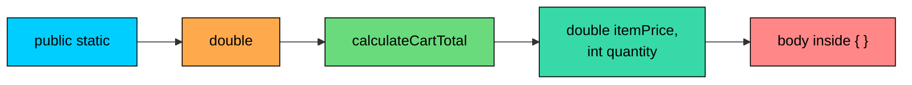
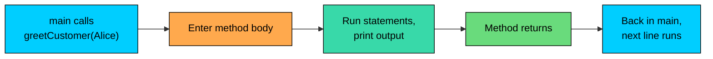

import React from 'react';
import CodeBlock from '../../../../components/ui/CodeBlock';
import Callout from '../../../../components/ui/Callout';

<div className="article-header">
  <div className="breadcrumb">
    <a href="/">Curated Notes</a>
    <span className="breadcrumb-separator">›</span>
    <span className="breadcrumb-current">Methods Basics</span>
  </div>
  <h1>Methods Basics</h1>
  <p style={{ color: 'var(--text-muted)', fontSize: '1.1rem', marginBottom: '16px', lineHeight: '1.6' }}>
    Master the essentials of Methods Basics in this curated guide.
  </p>
  <div className="meta-info">
    <span className="meta-item">
      <svg width="14" height="14" viewBox="0 0 24 24" fill="none" stroke="currentColor" strokeWidth="2"><circle cx="12" cy="12" r="10"/><polyline points="12 6 12 12 16 14"/></svg>
      10 min read
    </span>
    <span className="difficulty-badge difficulty-badge--intermediate">Intermediate</span>
  </div>
</div>

<section className="content-section">

A method is a named block of code that can be run from anywhere else in the program. Methods allow logic to be written once, given a name, and called by that name when needed. This lesson covers what a method is, why methods exist, the parts of a method declaration, how to call one, and the conventions Java programmers follow when naming them.

---

## Why Methods Exist

Suppose the goal is to print a friendly greeting for three different customers. Without methods, the same lines would repeat over and over.


```java
public class GreetWithoutMethods {
    public static void main(String[] args) {
        System.out.println("Hello, Alice!");
        System.out.println("Thanks for shopping with us.");

        System.out.println("Hello, Bob!");
        System.out.println("Thanks for shopping with us.");

        System.out.println("Hello, Carol!");
        System.out.println("Thanks for shopping with us.");
    }
}
```


This works, but the same two lines repeat for every customer. Changing the greeting to "Welcome back" instead of "Hello" requires editing three places. Missing one causes the messages to drift apart. With more customers, the duplication only gets worse.

A method fixes this. Wrap the greeting in a method called `greetCustomer`, write the greeting once, and call the method three times.


```java
public class GreetWithMethod {
    public static void main(String[] args) {
        greetCustomer("Alice");
        greetCustomer("Bob");
        greetCustomer("Carol");
    }

    public static void greetCustomer(String customerName) {
        System.out.println("Hello, " + customerName + "!");
        System.out.println("Thanks for shopping with us.");
    }
}
```


The output is identical. What's different is that the greeting logic now lives in one place. Updating the message inside `greetCustomer` automatically updates every caller.

Methods provide three things at once:

- **No repetition.** Write the logic once, call it many times. Programmers sometimes call this DRY, short for "Don't Repeat Yourself".
- **A name to think with.** `greetCustomer("Alice")` reads more clearly than four lines of `System.out.println` calls. The name acts as a label for a chunk of behavior.
- **Reuse.** Once `greetCustomer` exists, any code in the class can call it. New features get cheaper to build because they can be stitched together from existing methods.

The trade-off is small: a tiny bit of extra structure up front in exchange for code that's easier to change later. As programs grow past a few dozen lines, that trade is worth making.

---

## Anatomy of a Method

Every method in Java is built from the same set of parts. A typical one, broken down.


```java
public static double calculateCartTotal(double itemPrice, int quantity) {
    double total = itemPrice * quantity;
    return total;
}
```


Reading left to right, this method has five parts:


| Part | Value in the example | What it means |
| --- | --- | --- |
| Modifiers | `public static` | Who can call it and how it's called |
| Return type | `double` | The type of value the method gives back |
| Name | `calculateCartTotal` | What the method is called |
| Parameter list | `(double itemPrice, int quantity)` | The values the method needs to do its work |
| Body | `{ double total = itemPrice * quantity; return total; }` | The code that runs when the method is called |


The same breakdown visually.





The rest of this section walks through each part. For now, the goal is to recognize the pieces.

#### Modifiers

Modifiers are keywords that appear before the return type. They control how the method behaves and who can call it. The two most common ones for early Java code are:

- `public` controls **visibility**. A `public` method can be called from any class. The other visibility levels (`private`, `protected`, package-private) come later.
- `static` means the method belongs to the class itself, not to an instance of the class. `static` returns later in this lesson because it's the only flavor of method that can be called from `main` without first creating an object.

A method can be written with no modifiers, or with several stacked together. For the early lessons in this section, every method is `public static`.

#### Return Type

The return type sits right before the method name and declares what kind of value the method hands back to its caller. If the method computes a cart total, the return type is `double`. If it produces a customer name, the return type is `String`. If the method does some work but doesn't produce a value, the return type is `void`, which literally means "nothing".


```java
public static double calculateCartTotal(double itemPrice, int quantity) { ... }
public static String getWelcomeMessage() { ... }
public static void printOrderConfirmation(int orderId) { ... }
```


For now, treat the return type as a label that tells the caller what to expect.

#### Name

The name identifies the method. It must be a valid Java identifier: start with a letter, underscore, or dollar sign, followed by letters, digits, underscores, or dollar signs. It cannot be a Java keyword like `if` or `class`. By convention, method names use **camelCase** and start with a **verb**, because methods do things. Naming is covered in more depth a few sections down.

#### Parameter List

The parameter list, in parentheses, declares the inputs the method needs. Each parameter has a type and a name, separated by a comma from the next one.


```java
public static double calculateCartTotal(double itemPrice, int quantity) { ... }
```


This method needs an `itemPrice` (a `double`) and a `quantity` (an `int`). Inside the body, `itemPrice` and `quantity` are regular local variables holding whatever values the caller passed in.

A method can take zero parameters. The parentheses stay, but there's nothing between them.


```java
public static void printWelcomeBanner() {
    System.out.println("Welcome to AlgoMart!");
}
```


#### Body

The body is everything between the opening `{` and the closing `}`. It's the actual code that runs when the method is called. Inside the body, code can declare local variables, run loops, call other methods, and (if the return type isn't `void`) eventually use `return` to hand a value back.


```java
public static double calculateCartTotal(double itemPrice, int quantity) {
    double total = itemPrice * quantity;
    return total;
}
```


Local variables declared inside the body, like `total` here, only exist while the method is running. As soon as the method returns, they're gone. The next time the method is called, fresh local variables start over.

---

## Method Signature

The **signature** of a method is the part the Java compiler uses to tell methods apart: the method's name plus the types and order of its parameters. The return type, the modifiers, and the parameter names are **not** part of the signature.


| Declaration | Signature |
| --- | --- |
| `public static double calculateCartTotal(double itemPrice, int quantity)` | `calculateCartTotal(double, int)` |
| `public static void greetCustomer(String customerName)` | `greetCustomer(String)` |
| `public static int countItemsInStock(int[] stockCounts)` | `countItemsInStock(int[])` |


Why does this matter? Because Java allows multiple methods with the same name in the same class, as long as their parameter lists differ. That's called **overloading**, and the rule that makes it work is that each method has a different signature. For now, the takeaway is that a method's identity is its name and parameter types together, not just its name.

A consequence to be aware of: two methods in the same class cannot share a signature and differ only in return type. The compiler can't pick between them based on what the caller does with the result.

---

## Declaring a Method

Putting the pieces together, here's the general form of a method declaration:


```shell
[modifiers] returnType methodName(parameterType1 parameterName1, parameterType2 parameterName2, ...) {
    // method body
    // optional: return someValue;
}
```


A few small but worth-knowing rules:

- The opening `{` can go on the same line as the parameter list (the common Java style) or on the next line. Both compile.
- A method body can be empty: `{ }`. That's legal, but the method does nothing.
- If the return type isn't `void`, **every path** through the body must end in a `return` that gives back a value of that type. The compiler enforces this.
- Methods live inside a class. A method cannot be declared at the top level of a file, outside any class.

A small class with two methods, both fully declared.


```java
public class StoreUtilities {
    public static double applyDiscount(double price, double discountPercent) {
        double discountAmount = price * (discountPercent / 100);
        return price - discountAmount;
    }

    public static void printDivider() {
        System.out.println("------------------------");
    }

    public static void main(String[] args) {
        double finalPrice = applyDiscount(100.0, 20);
        printDivider();
        System.out.println("Final price: $" + finalPrice);
        printDivider();
    }
}
```


`applyDiscount` returns a `double`, so the body ends with a `return` statement. `printDivider` has return type `void`, so it doesn't need a `return` at all, and any `return` inside it would have to be a bare `return;` with no value.

---

## Calling a Method

Declaring a method just defines it. Until something **calls** it, the body never runs. A method call is written as the method's name followed by the arguments in parentheses, separated by commas.


```java
greetCustomer("Alice");
double total = calculateCartTotal(29.99, 3);
```


Two pieces of vocabulary are easy to mix up:

- **Parameter** is the name in the method declaration (`String customerName`). It's a placeholder.
- **Argument** is the actual value passed in at the call site (`"Alice"`). It fills the placeholder.

Java sets the parameter equal to the argument before the method body runs. Inside the body, `customerName` is just a local variable holding the value `"Alice"`.

The arguments must match the parameter list in **count, order, and type**. Passing too few, too many, or the wrong type, prevents the code from compiling.


```java
public class CallExamples {
    public static void main(String[] args) {
        greetCustomer("Alice");           // OK: one String argument
        // greetCustomer();               // Compile error: missing argument
        // greetCustomer("Alice", "Bob"); // Compile error: too many arguments
        // greetCustomer(42);             // Compile error: wrong type
    }

    public static void greetCustomer(String customerName) {
        System.out.println("Hello, " + customerName + "!");
    }
}
```


When a method returns a value, the call **is** that value at the place where it appears. The result can be stored in a variable, printed, passed to another method, or used as part of a larger expression.


```java
public class UseReturnValue {
    public static void main(String[] args) {
        // Store in a variable
        double cartTotal = calculateCartTotal(29.99, 3);
        System.out.println("Total: $" + cartTotal);

        // Print directly
        System.out.println("Total: $" + calculateCartTotal(49.50, 2));

        // Pass to another method
        printTotal(calculateCartTotal(15.00, 4));
    }

    public static double calculateCartTotal(double itemPrice, int quantity) {
        return itemPrice * quantity;
    }

    public static void printTotal(double total) {
        System.out.println("Computed total: $" + total);
    }
}
```


If a method's return type is `void`, the call cannot be used as a value. Writing `double x = printDivider();` is a compile error because `printDivider` doesn't return anything to assign.

#### What Happens When a Method Is Called

When a call runs, the program pauses where it is, jumps to the method's body, runs through it, and then comes back. Visually:





The caller doesn't move on until the method returns. If `greetCustomer` prints two lines, the program prints them both before continuing past the call site.

---

## `main` Is Also a Method

The `main` method used in every example is a method. Consider the parts:


```java
public static void main(String[] args)
```


- `public static` are modifiers.
- `void` is the return type. `main` doesn't return a value.
- `main` is the name.
- `(String[] args)` is the parameter list: one parameter, a `String[]` named `args`.

There's nothing magic about the declaration. The only special thing about `main` is that the Java runtime looks for a method with **exactly this signature** when the program is launched with `java YourClassName`. If it finds one, it calls it. If not, it complains and exits.

Writing a Java program means writing a method called `main` that the runtime invokes, and from inside `main` other methods get called. The whole program is a tree of method calls rooted at `main`.


```java
public class OrderApp {
    public static void main(String[] args) {
        printWelcome();
        double total = calculateCartTotal(29.99, 2);
        System.out.println("Cart total: $" + total);
    }

    public static void printWelcome() {
        System.out.println("Welcome to AlgoMart!");
    }

    public static double calculateCartTotal(double itemPrice, int quantity) {
        return itemPrice * quantity;
    }
}
```


The runtime calls `main`. Inside `main`, the code calls `printWelcome` and `calculateCartTotal`. If either of those called other methods, the chain would continue. Once `main` finishes, the program ends.

The `String[] args` parameter holds command-line arguments. Running `java OrderApp alpha beta` would call `main` with `args = {"alpha", "beta"}`. This section does not use `args`, but it is available when needed.

---

## `static` Methods at a Glance

Every method declared so far has used `static`. The short version of what it means at this stage of the course.

A `static` method belongs to the **class** rather than to any particular **object** built from the class. Calling a `static` method does not require creating an object first. It can be called by name from inside the same class, or by `ClassName.methodName(...)` from a different class.

This is why `calculateCartTotal(29.99, 3)` can be called directly from `main`. Both are `static`, both live in the same class, and `static` methods can call other `static` methods in the same class with no ceremony.


```java
public class StaticDemo {
    public static void main(String[] args) {
        // Calling a static method in the same class:
        double total = calculateCartTotal(29.99, 3);
        System.out.println("Total: $" + total);

        // Calling a static method from a different class:
        double roundedTotal = Math.round(total);
        System.out.println("Rounded: $" + roundedTotal);
    }

    public static double calculateCartTotal(double itemPrice, int quantity) {
        return itemPrice * quantity;
    }
}
```


`Math.round` is a `static` method on the `Math` class. No `Math` object had to be created. The class name plus the method name is enough.

There's also a non-`static` flavor of method, called an **instance method**, which belongs to a specific object. Calling those requires creating an object first. That's a whole separate topic. For everything in this section, `static` is the simplest option.

The reason `main` is `static`: the Java runtime needs to call it before any objects exist. If `main` were an instance method, the runtime would have to create an object first, but it has no way of knowing which object to create. `static` sidesteps that chicken-and-egg problem.

---

## Naming Conventions

Java has firm conventions for method names. The compiler doesn't enforce them, but every Java library and every Java developer expects them. Following them makes the code feel like it belongs.

- **Use camelCase.** Start with a lowercase letter, capitalize the first letter of each later word. `calculateCartTotal`, not `CalculateCartTotal`, `calculate_cart_total`, or `calculatecarttotal`.
- **Start with a verb.** Methods do things, so the name should read like an action. `getCustomerName`, `applyDiscount`, `isInStock`, `addToCart`. Avoid noun-only names like `customerName` for a method, that's the convention for fields.
- **Boolean methods usually start with `is`, `has`, or `can`.** `isInStock`, `hasShipped`, `canCancelOrder`. The name reads naturally inside an `if`: `if (isInStock(productId)) { ... }`.
- **Be specific, not cute.** `processItem` doesn't describe what processing happens. `calculateShippingCost` does. A slightly longer name that explains the action is almost always better than a short name that requires reading the body to understand.
- **Don't abbreviate aggressively.** `calculateCartTotal` is clearer than `calcCT`. The few extra characters cost nothing, and code is read far more often than it's written.

A class that follows the conventions.


```java
public class CartHelpers {
    public static double calculateSubtotal(double itemPrice, int quantity) {
        return itemPrice * quantity;
    }

    public static double applyDiscount(double subtotal, double discountPercent) {
        return subtotal - (subtotal * discountPercent / 100);
    }

    public static boolean isCartEmpty(int itemCount) {
        return itemCount == 0;
    }

    public static void printOrderConfirmation(int orderId) {
        System.out.println("Order " + orderId + " confirmed.");
    }

    public static void main(String[] args) {
        double subtotal = calculateSubtotal(29.99, 3);
        double finalTotal = applyDiscount(subtotal, 10);
        System.out.println("Final total: $" + finalTotal);
        System.out.println("Cart empty? " + isCartEmpty(3));
        printOrderConfirmation(1042);
    }
}
```


Read the method names out loud. Each one describes what the method does without requiring a look inside the body. That's the goal.

---

## Where Methods Live

Methods always live inside a class. A method cannot sit directly in a file outside any class. The structure of a Java file is always:


```shell
[optional package declaration]
[optional imports]

class ClassName {
    [fields]
    [methods]
}
```


Methods inside the same class can call each other by name. There's no need to import anything or qualify the name with the class name when both methods are in the same class.


```java
public class OrderProcessor {
    public static void main(String[] args) {
        processOrder(1042, 89.99);
    }

    public static void processOrder(int orderId, double total) {
        printDivider();
        System.out.println("Processing order " + orderId);
        System.out.println("Total: $" + total);
        printDivider();
    }

    public static void printDivider() {
        System.out.println("====================");
    }
}
```


`processOrder` calls `printDivider` twice. Both methods are `static` and both live in `OrderProcessor`, so the call works with no extra ceremony.

The **order** of method declarations inside a class doesn't matter to the compiler. `main` can call methods declared below it, and methods can call methods declared above or below them. Java looks at the whole class as one unit before deciding what's reachable from where.


```java
public class OrderInClass {
    public static void main(String[] args) {
        // This works fine even though greetUser is declared below main.
        greetUser("Alice");
    }

    public static void greetUser(String name) {
        System.out.println("Hello, " + name + "!");
    }
}
```


For readability, a common style is to put `main` near the top and the methods it calls below it, or to group related methods together. The compiler doesn't care. Pick whatever helps a reader follow the flow.

---

## A Worked Example

To bring everything together, consider a small program that uses several methods to take a cart through to a printed total. Each method does one thing and has a name that describes it.


```java
public class CartProgram {
    public static void main(String[] args) {
        printHeader();

        double itemPrice = 19.99;
        int quantity = 3;
        double discountPercent = 10;

        double subtotal = calculateSubtotal(itemPrice, quantity);
        double finalTotal = applyDiscount(subtotal, discountPercent);

        printItemLine(itemPrice, quantity);
        printTotalLine(finalTotal);
    }

    public static void printHeader() {
        System.out.println("=== AlgoMart Cart Summary ===");
    }

    public static double calculateSubtotal(double price, int quantity) {
        return price * quantity;
    }

    public static double applyDiscount(double amount, double discountPercent) {
        return amount - (amount * discountPercent / 100);
    }

    public static void printItemLine(double price, int quantity) {
        System.out.println("Item: " + quantity + " x $" + price);
    }

    public static void printTotalLine(double total) {
        System.out.println("Total after discount: $" + total);
    }
}
```


Three things stand out in this example:

- `main` reads almost like a checklist of what the program does. Print a header, compute a subtotal, apply a discount, print the item line, print the total. The details of each step live in their own method.
- Each helper method has a single, clear purpose. `calculateSubtotal` doesn't print anything. `printItemLine` doesn't compute anything. Mixing those two would make each method harder to reuse.
- The methods can be reordered freely. The compiler doesn't care that `printTotalLine` appears last and is called second-to-last in `main`.

This style, where `main` orchestrates and the work happens in small focused methods, is the foundation of how larger Java programs are built. The rest of this section adds the missing pieces: how parameters work in depth, how return types behave, how to give the same method name multiple signatures, how to accept a variable number of arguments, and a couple of advanced topics like recursion.

</section>
