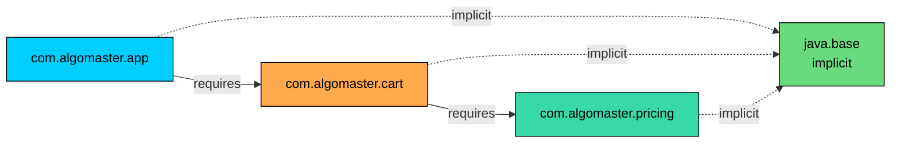
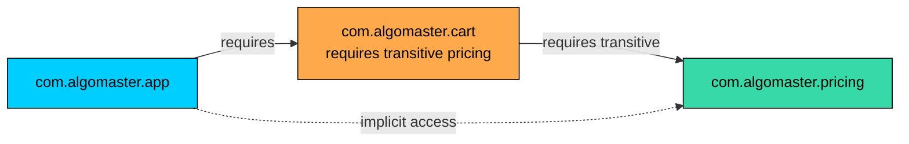
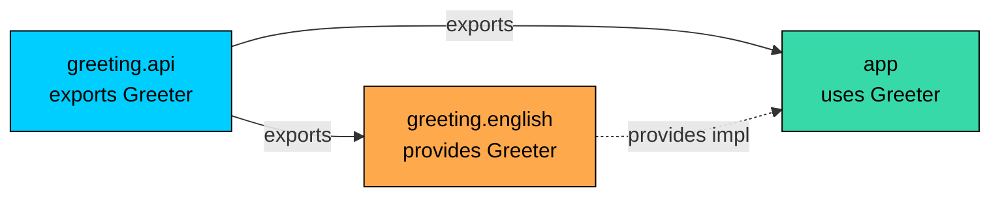

import React from 'react';
import CodeBlock from '../../../../components/ui/CodeBlock';
import Callout from '../../../../components/ui/Callout';

<div className="article-header">
  <div className="breadcrumb">
    <a href="/">Curated Notes</a>
    <span className="breadcrumb-separator">›</span>
    <span className="breadcrumb-current">module-info.java</span>
  </div>
  <h1>module-info.java</h1>
  <p style={{ color: 'var(--text-muted)', fontSize: '1.1rem', marginBottom: '16px', lineHeight: '1.6' }}>
    Master the essentials of module-info.java in this curated guide.
  </p>
  <div className="meta-info">
    <span className="meta-item">
      <svg width="14" height="14" viewBox="0 0 24 24" fill="none" stroke="currentColor" strokeWidth="2"><circle cx="12" cy="12" r="10"/><polyline points="12 6 12 12 16 14"/></svg>
      10 min read
    </span>
    <span className="difficulty-badge difficulty-badge--intermediate">Intermediate</span>
  </div>
</div>

<section className="content-section">

The previous lesson introduced the Java Platform Module System and explained what a module is, how the module path differs from the classpath, and how named, automatic, and unnamed modules fit together. This lesson zooms in on the file that turns a plain folder of packages into a module: `module-info.java`. The file is short, but each line is a contract between the module and everyone who consumes it. This lesson covers every directive the file supports, how the compiler and the runtime interpret them, and a complete worked example with two modules that compile and run end to end.

---

## What `module-info.java` Actually Is

A module declaration lives in a single file named `module-info.java`, placed at the root of the module's source tree. It is a Java source file in the sense that `javac` compiles it, and the compiler produces a class file from it called `module-info.class`. It is not a regular class. Fields, methods, and `main` are not allowed. The body holds only **module directives**, which the language defines specifically for this file.

A minimal module declaration looks like this:


```java
module com.algomaster.cart {
}
```


The keyword `module` introduces the declaration. The identifier after it is the module's name. The braces hold zero or more directives. An empty body is legal; it declares a module that depends on nothing, exports nothing, and provides nothing. Such a module is rare in practice but useful as a starting point.

The file's location matters. For a module named `com.algomaster.cart`, the source layout typically looks like this:


```shell
com.algomaster.cart/
    module-info.java
    com/
        algomaster/
            cart/
                Cart.java
                Item.java
```


The directory `com.algomaster.cart/` is the **module's source root**. The `module-info.java` file sits at that root, directly beside the top-level package folder. The package folders below it follow the usual Java layout. The module name and the top-level package name don't have to match, but matching them is the convention almost every JDK module and major library follows.

Module names follow the same reverse-DNS pattern packages use: lowercase, dot-separated, starting with a domain under the author's control. `java.sql`, `java.xml`, `com.fasterxml.jackson.core`, and `org.junit.jupiter.api` are all real JDK or library module names. Dashes and digits are allowed in segments, but most code sticks to letters. Picking a globally unique name avoids clashes when the module ends up on the same module path as someone else's.

The compiled `module-info.class` carries the directives in binary form. The Java runtime reads it on startup, builds the module graph, and uses it to decide what each module is allowed to see at compile time and at runtime. A module's identity isn't convention or filename guessing. It's all encoded in this one class file.

---

## The Directive Map

Before walking through each directive, the full list of what's legal inside the braces, what it controls, and at which phase it takes effect.


| Directive | Controls | Phase |
| --- | --- | --- |
| `requires <module>` | This module depends on another module | Compile + Runtime |
| `requires transitive <module>` | Re-export the dependency to consumers | Compile + Runtime |
| `requires static <module>` | Optional dependency, compile-time only | Compile (runtime optional) |
| `exports <package>` | Make a package public to all modules | Compile + Runtime |
| `exports <package> to <m1>, <m2>` | Make a package public to specific modules | Compile + Runtime |
| `opens <package>` | Allow deep reflective access | Runtime only |
| `opens <package> to <m1>, <m2>` | Allow deep reflective access to specific modules | Runtime only |
| `uses <service-interface>` | Declare a service consumer | Runtime |
| `provides <service-interface> with <impl>` | Declare a service provider | Runtime |
| `open module M { ... }` | Open every package for reflection | Runtime |


The same `module-info.java` can list as many directives as it needs, in any order, though most codebases group them: requires first, then exports, then opens, then uses and provides.

---

## Declaring Dependencies With `requires`

The `requires` directive states that this module depends on another module. Without it, none of the other module's public types are usable, even if they exist on the module path. The compiler will refuse to resolve the import, and the runtime will refuse to load the module if a dependency is missing.


```java
module com.algomaster.cart {
    requires java.sql;
    requires com.algomaster.pricing;
}
```


Two `requires` lines, two dependencies. `java.sql` is part of the JDK; it ships with every Java installation. `com.algomaster.pricing` is some other module that is authored locally or pulled in as a library. Once these lines are present, code inside `com.algomaster.cart` can `import java.sql.Connection` or `import com.algomaster.pricing.PriceCalculator` and the compiler resolves both.

Drop the `requires` line and the imports fail with a clear message:


```shell
error: package java.sql is not visible
  (package java.sql is declared in module java.sql, but module com.algomaster.cart does not read it)
```


The wording "does not read it" is module-system vocabulary. One module **reads** another when there's a `requires` edge from the first to the second in the module graph. Reading is what grants access to the other module's exported packages. The error message says, in effect, "the package exists, the module exists, but the connection has not been declared."

A module can list as many `requires` clauses as it needs. Duplicates are a compile error. Self-references are a compile error. Cycles between modules are a compile error: if module A requires B and B requires A, neither will compile. The module graph is required to be a **directed acyclic graph**, and the compiler enforces it.





The diagram shows a small module graph. The app reads the cart module, which reads the pricing module. Every module implicitly reads `java.base`, which is why no module declares `requires java.base` even though every program uses types from it. `java.base` contains `Object`, `String`, the collections framework, and the rest of the core language types. The runtime treats it as the default dependency for every module.

---

## Re-exporting With `requires transitive`

A plain `requires` dependency is private. If module A requires B, code inside A can use B's public types, but consumers of A do not automatically get to use B's types. They have to declare their own `requires B` for access.

That works for most cases. Sometimes it produces friction. If A's public API mentions a B type in a method signature, every consumer of A is forced to write `requires B` whether they care about B or not, just to satisfy the compiler. The `requires transitive` directive solves this. It says "this module requires B, and any module that requires me also implicitly requires B."


```java
module com.algomaster.cart {
    requires transitive com.algomaster.pricing;
}
```


Now a downstream consumer:


```java
module com.algomaster.app {
    requires com.algomaster.cart;
}
```


The app module gets access to both `com.algomaster.cart` and `com.algomaster.pricing` even though it only lists the cart module. The transitive edge propagates through the graph.

The JDK uses this pattern in several places. `java.sql` declares `requires transitive java.xml` because its public API references XML types in a couple of places. Any module that requires `java.sql` automatically reads `java.xml`. Without the transitive marker, every consumer would need a second `requires java.xml` line just to compile.

The rule of thumb is: mark a `requires` as `transitive` when types from the required module appear in the **exported public API** of the module. If a consumer would need to import the dependency to even write a method signature that calls into this module, they should get it transitively. If the dependency is purely internal, leave the `transitive` off.





The dotted edge from app to pricing is the implicit readability that `requires transitive` adds. The app module never names pricing in its own `module-info.java`, but the graph still grants it read access through the cart module.

---

## Optional Dependencies With `requires static`

The third flavor of `requires` is `requires static`. It declares a dependency that is required at compile time but optional at runtime. The compiler enforces it the usual way: code in the module can import and reference types from the required module, and the compiler resolves everything against the module path. The runtime, on the other hand, is happy to launch without the module present.


```java
module com.algomaster.cart {
    requires static com.algomaster.dev.tools;
}
```


This is the directive for modules that supply optional features, like development-only annotations, build-time code generators, or null-checking annotations from a library like JSpecify. The compiler should verify the annotation references without forcing a deployment without the annotations module to fail at startup.

The runtime contract is: when the module is present, it behaves like a regular `requires`. When it's absent, the module loads anyway, and any code path that would have called into the missing module must avoid the call. Touching a type from a missing optional module at runtime throws `NoClassDefFoundError`. The `static` modifier doesn't protect against that; it only relaxes the launch-time check.

Use this directive sparingly. The common case is annotation libraries whose annotations have `RetentionPolicy.SOURCE` or `RetentionPolicy.CLASS`, meaning they don't need to be on the runtime module path at all. Bundling them as `requires static` lets the compiler see them without forcing every deployment to ship them.

---

## Making Packages Public With `exports`

`requires` controls what a module can see. `exports` controls what other modules can see in **this** module. By default, every package inside a named module is module-private. Even if a class is declared `public`, code in another module cannot import or call it unless the package containing the class is exported.


```java
module com.algomaster.pricing {
    exports com.algomaster.pricing.api;
}
```


This declaration exports the package `com.algomaster.pricing.api`. Public types in that package become accessible to every other module that reads `com.algomaster.pricing`. Any other package in the module (for example, `com.algomaster.pricing.internal`) stays hidden, even from modules that have a `requires` edge.

The split between "exported" and "internal" packages is the main encapsulation tool modules add to the language. Before JPMS, every `public` class was effectively part of the public API. Anyone with a JAR could import anything. Modules allow helper packages to stay internal, which is enforced by the compiler and the runtime.

An example: a pricing module might have these packages:


```shell
com.algomaster.pricing/
    com/algomaster/pricing/api/PriceCalculator.java
    com/algomaster/pricing/api/Tier.java
    com/algomaster/pricing/internal/CacheImpl.java
    com/algomaster/pricing/internal/RateTable.java
```


The `module-info.java`:


```java
module com.algomaster.pricing {
    exports com.algomaster.pricing.api;
}
```


`PriceCalculator` and `Tier` are public to the world. `CacheImpl` and `RateTable` are usable inside the module by other classes in the pricing module, but no consumer can import them. The compiler rejects any outside reference with the same kind of "is not visible" error shown earlier for missing `requires`.

`exports` operates at package granularity, not class granularity. There's no way to export just one class while hiding its package-mates. If a package contains anything to be exposed, the whole public surface of that package becomes part of the public API.

---

## Qualified Exports With `exports ... to`

Sometimes a package should be visible to only a handful of friendly modules, not to everyone. The `exports ... to <modules>` form does exactly that.


```java
module com.algomaster.pricing {
    exports com.algomaster.pricing.api;
    exports com.algomaster.pricing.spi to com.algomaster.cart, com.algomaster.warehouse;
}
```


Two exports here. The first is unqualified: `com.algomaster.pricing.api` is visible to every module that reads pricing. The second is qualified: `com.algomaster.pricing.spi` is visible only to `com.algomaster.cart` and `com.algomaster.warehouse`. A third module that tries to import a class from `com.algomaster.pricing.spi` gets a compile error, even if it requires the pricing module.

Qualified exports are the way to expose package-private hooks to specific cooperating modules without making them part of the global API. The JDK uses this pattern: many internal packages are exported only to specific other JDK modules and stay closed to user code.

The receivers in the `to` clause must be valid module names. The compiler doesn't require them to exist on the module path at compile time (this lets a library author write a qualified export to a module that's only present in some deployments), but every name listed must be syntactically a legal module identifier.

---

## Reflective Access With `opens` and `opens ... to`

`exports` controls regular access: imports, direct field and method references, normal compile-time visibility. **It does not control reflection** the way one might expect. Code in another module can call `Class.forName` on a type in an exported package, but it cannot use deep reflection (`setAccessible(true)`) to read private fields or invoke private methods. The module system blocks that even for exported packages, because reflection that pierces access modifiers is a stronger form of access than regular code.

The `opens` directive grants that stronger access:


```java
module com.algomaster.cart {
    opens com.algomaster.cart.model;
}
```


This says: any module may use deep reflection (including `setAccessible(true)`) on members of types in `com.algomaster.cart.model`, at runtime. It does not affect compile-time visibility. A package can be opened without being exported, exported without being opened, or both.

The four combinations:


| Directive | Compile access | Runtime reflection |
| --- | --- | --- |
| (nothing) | No | No |
| `exports P` | Yes | No deep access |
| `opens P` | No | Yes |
| `exports P` + `opens P` | Yes | Yes |


Frameworks that rely on reflection (serialization libraries like Jackson, dependency-injection containers like Spring, persistence libraries like Hibernate) need `opens` to read private fields. If a module's classes need to be serialized to JSON by Jackson, the package containing them must be opened. Otherwise Jackson's `setAccessible(true)` call throws `InaccessibleObjectException` at runtime.

Like `exports`, `opens` has a qualified form:


```java
module com.algomaster.cart {
    opens com.algomaster.cart.model to com.fasterxml.jackson.databind;
}
```


The package is opened only to the Jackson module. Other reflective libraries are still blocked. This is the standard way to integrate with a framework while keeping the rest of the world out.

When an entire module's job is to be reflected upon, the `opens` directive on every package gets tedious. The `open module` form opens everything at once:


```java
open module com.algomaster.cart {
    exports com.algomaster.cart.api;
    requires com.algomaster.pricing;
}
```


Adding `open` before `module` makes every package in the module reflectively accessible to every other module. Individual `opens` directives are not allowed inside an `open module` body, because they would be redundant.

`opens` reveals private state to anyone that asks. Use qualified `opens ... to <framework>` instead of unqualified `opens` when possible, so only the framework that needs reflective access has it.

---

## The Service Loader Directives: `uses` and `provides`

The last two directives, `uses` and `provides`, hook a module into Java's **service loader** mechanism. `ServiceLoader` is a standard API (`java.util.ServiceLoader`) for finding and instantiating implementations of an interface at runtime, without the consumer code knowing the implementation classes by name.

In a modular setting, the two sides of a service registration are declared in `module-info.java`:


```java
module com.algomaster.greeting.api {
    exports com.algomaster.greeting;
}

module com.algomaster.greeting.english {
    requires com.algomaster.greeting.api;
    provides com.algomaster.greeting.Greeter
        with com.algomaster.greeting.english.EnglishGreeter;
}

module com.algomaster.app {
    requires com.algomaster.greeting.api;
    uses com.algomaster.greeting.Greeter;
}
```


The first module defines and exports the service interface `Greeter`. The second module is a **provider**: it declares with `provides ... with ...` that it supplies an implementation. The third module is a **consumer**: it declares with `uses` that it intends to look up `Greeter` implementations at runtime.

In the consumer code, the lookup is a one-liner:


```java
ServiceLoader<Greeter> loader = ServiceLoader.load(Greeter.class);
for (Greeter g : loader) {
    System.out.println(g.greet("AlgoMaster"));
}
```


The runtime walks the module graph, finds every module that has a matching `provides` directive, instantiates each implementation, and yields them through the loader. Adding a new provider is a matter of writing a new module with its own `provides` directive and putting it on the module path. The consumer code does not change.

The `uses` directive on the consumer side serves two purposes. It declares the consumer's intent (which makes the dependency on the service interface explicit), and it allows the module system to grant the consumer access even when the implementation class is in a package that isn't exported. Implementation classes are typically internal; only the service interface is exported.





The diagram shows the service-loader topology. The api module sits in the middle and is read by both the provider and the consumer. The provider supplies an implementation. The consumer asks the service loader for it. The consumer never has a direct compile-time edge to the provider, so providers can be swapped without changing the consumer.

---

## A Complete Worked Example

Time to compile and run something. The goal is two modules: one defines a `Greeter` interface, the other depends on the first and uses it. No service loader yet, just a straightforward `requires` + `exports` pair to show every step.

The directory layout:


```shell
src/
    com.algomaster.greeting/
        module-info.java
        com/
            algomaster/
                greeting/
                    Greeter.java
    com.algomaster.app/
        module-info.java
        com/
            algomaster/
                app/
                    Main.java
```


The greeting module:


```java
module com.algomaster.greeting {
    exports com.algomaster.greeting;
}
```


```java
package com.algomaster.greeting;

public class Greeter {
    public String greet(String name) {
        return "Hello, " + name + "!";
    }
}
```


The app module:


```java
module com.algomaster.app {
    requires com.algomaster.greeting;
}
```


```java
package com.algomaster.app;

import com.algomaster.greeting.Greeter;

public class Main {
    public static void main(String[] args) {
        Greeter greeter = new Greeter();
        System.out.println(greeter.greet("AlgoMaster"));
    }
}
```


Compile both modules into a shared `out` directory using the `--module-source-path` option, which tells the compiler where to find the module sources:


```shell
javac -d out --module-source-path src --module com.algomaster.greeting,com.algomaster.app
```


The compiler builds the module graph from the two `module-info.java` files, resolves `requires com.algomaster.greeting` in the app module against the greeting module on the source path, checks that `Greeter` lives in an exported package, and writes the class files into `out/com.algomaster.greeting/` and `out/com.algomaster.app/`.

Run the app module by pointing `java` at the compiled module path and naming the entry point as `<module>/<class>`:


```shell
java --module-path out --module com.algomaster.app/com.algomaster.app.Main
```


The output:


```shell
Hello, AlgoMaster!
```


Three steps run during launch. The runtime reads `module-info.class` for both modules. It builds a module graph rooted at `com.algomaster.app` and verifies every `requires` edge resolved. It then loads `Main` from the app module and runs `main`. If the greeting module had been missing from the module path, the launch would have failed before `Main` ever loaded, with a message like `module com.algomaster.greeting not found, required by com.algomaster.app`.

Try breaking it on purpose. Remove `exports com.algomaster.greeting` from the greeting module's `module-info.java` and recompile.


```shell
error: package com.algomaster.greeting is not visible
  (package com.algomaster.greeting is declared in module com.algomaster.greeting,
   which does not export it)
```


The compiler refuses to resolve the import, even though the package is real and the module is on the source path. Encapsulation is enforced at build time, not just at runtime.

---

## A Worked Service-Loader Example

Now extend the example to use `uses` and `provides`. The greeting module exposes the interface. A separate provider module supplies an English implementation. The app module looks up the implementation through `ServiceLoader`.


```shell
src/
    com.algomaster.greeting/
        module-info.java
        com/algomaster/greeting/Greeter.java
    com.algomaster.greeting.english/
        module-info.java
        com/algomaster/greeting/english/EnglishGreeter.java
    com.algomaster.app/
        module-info.java
        com/algomaster/app/Main.java
```


Greeting module (the service interface):


```java
module com.algomaster.greeting {
    exports com.algomaster.greeting;
}
```


```java
package com.algomaster.greeting;

public interface Greeter {
    String greet(String name);
}
```


English provider module:


```java
module com.algomaster.greeting.english {
    requires com.algomaster.greeting;
    provides com.algomaster.greeting.Greeter
        with com.algomaster.greeting.english.EnglishGreeter;
}
```


```java
package com.algomaster.greeting.english;

import com.algomaster.greeting.Greeter;

public class EnglishGreeter implements Greeter {
    public EnglishGreeter() {
    }

    @Override
    public String greet(String name) {
        return "Hello, " + name + "!";
    }
}
```


The provider class needs a public no-argument constructor, because that's what `ServiceLoader` calls when it instantiates an implementation. The `provides ... with ...` directive references the implementation class by its fully qualified name. The provider does not export the package containing `EnglishGreeter`. The implementation stays internal; only the service interface is part of the public API.

App module (the consumer):


```java
module com.algomaster.app {
    requires com.algomaster.greeting;
    uses com.algomaster.greeting.Greeter;
}
```


```java
package com.algomaster.app;

import com.algomaster.greeting.Greeter;
import java.util.ServiceLoader;

public class Main {
    public static void main(String[] args) {
        ServiceLoader<Greeter> loader = ServiceLoader.load(Greeter.class);
        for (Greeter g : loader) {
            System.out.println(g.greet("AlgoMaster"));
        }
    }
}
```


Compile all three modules together:


```shell
javac -d out --module-source-path src --module com.algomaster.greeting,com.algomaster.greeting.english,com.algomaster.app
```


Run the app:


```shell
java --module-path out --module com.algomaster.app/com.algomaster.app.Main
```


Output:


```shell
Hello, AlgoMaster!
```


Add a second provider, for example `com.algomaster.greeting.spanish` with `provides Greeter with SpanishGreeter`, and the same `Main` would print both greetings without any change to the consumer code. Providers are pluggable, and the consumer commits only to the interface.

---

## Common Pitfalls

The module system surfaces a small set of mistakes that didn't exist before JPMS. Most of them have clear error messages once seen once, but the first encounter usually costs an hour.

**Package split across modules.** The same package name cannot be declared in two different modules on the same module path. If `com.algomaster.util` lives in both `com.algomaster.cart` and `com.algomaster.warehouse`, the runtime refuses to start with a message about a package conflict. The fix is to rename one of them or merge them. Package splits were common with classpath-era libraries, and the module system makes them illegal precisely so that "which version did I get?" stops being a question.

**Forgetting `requires`.** Adding an `import` for a type in an undeclared module fails with the "package X is not visible, module Y does not read it" message. The fix is to add `requires Y` to `module-info.java`. The error is loud and the fix is one line. The trap is that the runtime never silently falls back to the classpath, so the missing dependency must be made explicit.

**Reflection blocked because the package isn't `opens`.** A library like Jackson tries to read private fields via `setAccessible(true)` and gets `InaccessibleObjectException`. The package containing the data classes is exported but not opened. Add `opens com.your.package to com.fasterxml.jackson.databind;` (or to whichever module is doing the reflection). The principle is that `exports` controls normal access; deep reflection is a separate, stronger grant.

**Cyclic dependencies.** Module A requires B and B requires A. The compiler rejects this with a cycle message. Cycles are a design smell; the fix is to extract the shared types into a third module that both A and B depend on, or to make one direction a service-loader call instead of a direct dependency.

**Mixing module name with package name.** A common confusion is to assume the module name has to match a top-level package. It doesn't, structurally, but matching is the convention and confusion is rarer when the convention is followed. The module name is what goes on the module path; the package name is what goes after `import`. They're declared in different places.

**Forgetting the no-arg constructor on a `provides` class.** The `ServiceLoader` calls a public no-argument constructor by default. If the implementation class only has a multi-argument constructor, the loader can't instantiate it and the failure happens at iteration time, not at startup. The alternative is to declare a public static `provider()` method that returns an instance; `ServiceLoader` prefers that over the constructor when it exists.

---

## Helpful Tools: `jdeps` and `jlink`

Two JDK tools are useful here, even though their full coverage belongs in a separate lesson.

`jdeps` analyzes class files and JARs and reports their dependencies. Running `jdeps --module-path out --module com.algomaster.app` against the worked example above prints a dependency tree showing that the app module reads the greeting module and the JDK's `java.base`. For migrating a classpath project to modules, `jdeps --generate-module-info` produces a suggested `module-info.java` based on what the code actually uses. It's a fast way to bootstrap a `module-info` for an existing codebase.

`jlink` builds a custom Java runtime image that contains only the JDK modules an application needs, plus the application's modules. A `jlink` image for the worked example would include `java.base` and the two application modules and nothing else, producing a self-contained launcher that's a fraction of the size of a full JDK installation. `jlink` is one of the practical wins the module system enabled: before JPMS, slicing the JDK by feature was not possible, so every deployment shipped the whole thing.

Both tools deserve their own lesson. For now, knowing that they exist (and that they read the same `module-info.class`) is enough.

---

## Putting It All Together: A Larger `module-info.java`

A realistic `module-info.java` for a mid-sized module might combine several directives:


```java
module com.algomaster.cart {
    requires transitive com.algomaster.pricing;
    requires com.algomaster.warehouse;
    requires static org.jspecify;
    requires java.sql;

    exports com.algomaster.cart.api;
    exports com.algomaster.cart.spi to com.algomaster.app, com.algomaster.checkout;

    opens com.algomaster.cart.model to com.fasterxml.jackson.databind;

    uses com.algomaster.greeting.Greeter;
    provides com.algomaster.cart.spi.CartEventListener
        with com.algomaster.cart.internal.LoggingCartEventListener;
}
```


Reading it top to bottom: the module depends on pricing (transitively, so its API exposes pricing types), warehouse (privately), JSpecify annotations (compile-time only), and `java.sql` (for database types). It exports its public API to everyone, exports its SPI to two cooperating modules, opens its model package for Jackson serialization, declares that it consumes a `Greeter` service, and declares that it provides a `CartEventListener` service implementation.

Every line maps to a specific piece of behavior. Removing any one of them breaks something: a missing `requires` blocks compilation, a missing `exports` hides the API, a missing `opens` breaks reflection, a missing `provides` removes the cart's contribution to the cart-event service loader. The declaration is the contract; the rest of the codebase respects it because the compiler and the runtime enforce it.

</section>
