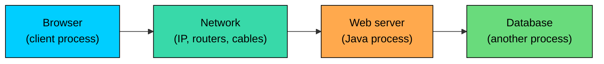
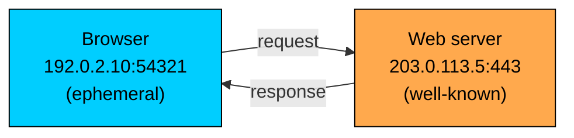
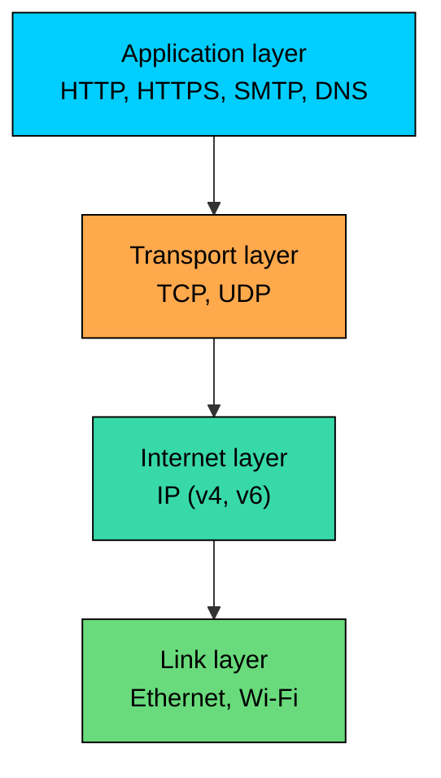
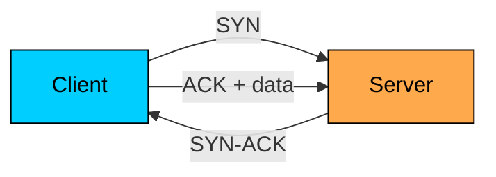
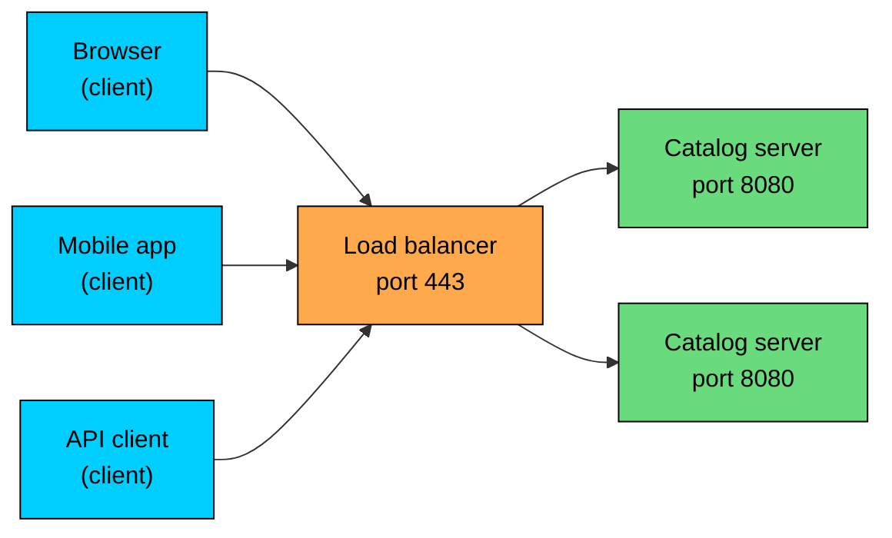
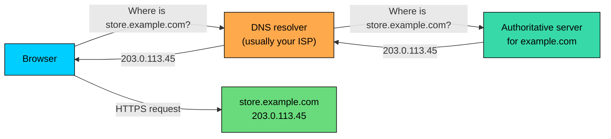
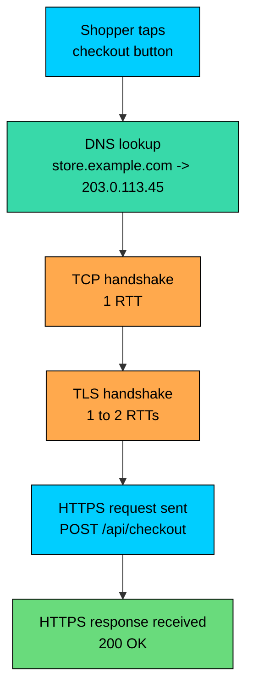

import React from 'react';
import CodeBlock from '../../../../components/ui/CodeBlock';
import Callout from '../../../../components/ui/Callout';

<div className="article-header">
  <div className="breadcrumb">
    <a href="/">Curated Notes</a>
    <span className="breadcrumb-separator">›</span>
    <span className="breadcrumb-current">Networking Basics</span>
  </div>
  <h1>Networking Basics</h1>
  <p style={{ color: 'var(--text-muted)', fontSize: '1.1rem', marginBottom: '16px', lineHeight: '1.6' }}>
    Master the essentials of Networking Basics in this curated guide.
  </p>
  <div className="meta-info">
    <span className="meta-item">
      <svg width="14" height="14" viewBox="0 0 24 24" fill="none" stroke="currentColor" strokeWidth="2"><circle cx="12" cy="12" r="10"/><polyline points="12 6 12 12 16 14"/></svg>
      10 min read
    </span>
    <span className="difficulty-badge difficulty-badge--intermediate">Intermediate</span>
  </div>
</div>

<section className="content-section">

Networking is what lets two separate programs, running on two different machines, talk to each other. Almost every Java application you will ever write touches the network somewhere: a web server handling a checkout request, a payment service calling a bank, a product catalog reading from a remote database, a browser hitting your API. This lesson covers the concepts you need before any of the `java.net` classes make sense: hosts, addresses, ports, the TCP/IP stack, TCP versus UDP, the client-server model, and a quick word about DNS.

---

## What Networking Means for a Java Program

A running Java program is a process on a single machine. It has its own memory, its own threads, and its own variables. Networking is the mechanism that lets that process exchange bytes with another process, almost always on a different machine, and act on what comes back. The other process might be a web server, a database, a payment gateway, or another instance of your own application running on the next rack over.

From the program's point of view, the network is a stream of bytes going out and a stream of bytes coming in. Everything else, the routing, the retransmissions, the addressing, is handled by the operating system and the network hardware below it. Your Java code reads and writes bytes. The rest of the stack carries them.





The diagram shows the path a single product-page request takes through an online store. The browser starts the conversation. The network in the middle is cables, Wi-Fi, routers, internet service providers, and undersea fiber. The Java web server reads the request, talks to its own database over another network connection, and writes the response back. Every arrow in this picture is a network hop, and each hop has rules the operating system enforces on your behalf.

The point of this lesson is to make those rules concrete. Once you know how addresses, ports, and protocols fit together, the `java.net` classes stop looking like a wall of jargon and start looking like thin wrappers over a handful of well-defined ideas.

---

## Hosts and IP Addresses

A **host** is any machine on a network: a laptop, a phone, a server in a data center, a virtual machine in the cloud. Every host that participates in IP networking has at least one **IP address**. The address is how other hosts find it. Without an address, a machine can listen on a cable all it wants and nobody can reach it.

There are two versions of IP addresses in use today: IPv4 and IPv6. They serve the same purpose but look different.


| Version | Example | Size | Notes |
| --- | --- | --- | --- |
| IPv4 | `192.0.2.45` | 32 bits | Four numbers from 0 to 255, separated by dots. Roughly 4.3 billion possible addresses. |
| IPv6 | `2001:db8::8a2e:370:7334` | 128 bits | Eight groups of four hex digits, separated by colons. Effectively unlimited supply. |


IPv4 ran out of unused addresses years ago, which is why IPv6 was designed. Most of the internet still speaks IPv4 with workarounds, but modern Java fully supports both and you should expect to see IPv6 addresses in real systems.

Not every address is reachable from everywhere. Networks divide addresses into a few useful buckets.

- **Public addresses** are routable on the open internet. Your web server's address, the bank's payment API address, the address of a third-party shipping service are all public.
- **Private addresses** are reserved for use inside a single organization or home network. The blocks `10.0.0.0/8`, `172.16.0.0/12`, and `192.168.0.0/16` are private. A router translates between private addresses on the inside and a public address on the outside.
- **Loopback addresses** point back at the same machine. `127.0.0.1` in IPv4 and `::1` in IPv6 always mean "this host." If you start a development web server on your laptop and point a browser at `http://127.0.0.1:8080`, the traffic never leaves the machine.

The loopback address is the one you will see most often in your first weeks of writing networked Java. When you run a server on your own machine for testing, you are connecting to `127.0.0.1` or `localhost`, which resolves to it.

---

## Ports: How One Host Runs Many Services

An IP address gets you to a machine, but a machine runs many programs at once. Your laptop might be running a web server, a database, an IDE, and a browser all at the same time. The address alone cannot say which one a packet is for. That is what a **port** is for.

A port is a 16-bit number, from 0 to 65535, that identifies a specific service on a host. When a server program starts, it asks the operating system to listen on a port. When a client wants to reach that service, it sends traffic to the host's IP address with that port number attached. The OS looks at the port and hands the bytes to the right program.

The full pair, IP address plus port, is what people call a **socket**, sometimes written as `192.0.2.45:443`. A socket is a single endpoint of a network conversation. Two sockets, one on each end, define one connection.

Ports come in a few well-known ranges.


| Range | Name | Use |
| --- | --- | --- |
| 0 to 1023 | Well-known ports | Reserved for common protocols. Need elevated privileges to bind on most operating systems. |
| 1024 to 49151 | Registered ports | Assigned to specific applications by IANA. Examples: 3306 for MySQL, 6379 for Redis. |
| 49152 to 65535 | Ephemeral ports | Used by the OS for the client side of outgoing connections. |


A handful of well-known ports show up everywhere, and you should recognize them on sight.


| Port | Service | What it does |
| --- | --- | --- |
| 22 | SSH | Encrypted shell access to a remote machine. |
| 80 | HTTP | Unencrypted web traffic. |
| 443 | HTTPS | Encrypted web traffic. The vast majority of public web traffic today. |
| 25 | SMTP | Sending email between mail servers. |
| 53 | DNS | Looking up names to IP addresses. |


When your browser fetches `https://store.example.com/cart`, the `https://` part is what tells it to connect to port 443. If the URL had been `http://`, it would have used port 80. The port is part of the address even when you do not type it.

Ephemeral ports are the other side of the same story. When your browser opens a connection, the OS picks an unused number from the ephemeral range for the client end. You did not choose it, and you usually do not care what it is. It exists so the server can send the response back to the exact connection the request came from.





The diagram shows a single HTTPS connection from a shopper's browser to an online store's web server. The browser side uses a high-numbered ephemeral port that the OS chose. The server side uses port 443, the well-known port for HTTPS. Both ends of the connection are full sockets: address plus port. The request goes out from one socket, the response comes back to the same one.

Binding to a well-known port (below 1024) usually requires elevated privileges on Linux and macOS. In production, web servers often run on port 8080 behind a load balancer that listens on 443, instead of running as root.

---

## The TCP/IP Layering Model

The internet is built out of layers, and each layer hides the layer below it. The whole system is called the **TCP/IP model** after its two most important protocols. There are four layers, and you should know what lives where.


| Layer | What it does | Examples |
| --- | --- | --- |
| Application | Defines the meaning of the bytes. What is a request? What is a response? | HTTP, HTTPS, SMTP, FTP, DNS |
| Transport | Delivers bytes between processes. Adds ports, optional reliability, ordering. | TCP, UDP |
| Internet | Delivers packets between hosts across networks. Adds IP addresses and routing. | IP (v4 and v6), ICMP |
| Link | Moves bits across a single physical or wireless link. | Ethernet, Wi-Fi |


Each layer wraps the layer above it. When your browser sends a checkout request, the HTTP message gets wrapped in a TCP segment, which gets wrapped in an IP packet, which gets wrapped in an Ethernet frame, which goes out over the network card. On the other end, the layers get peeled back in reverse order until the web server's code reads the HTTP message.





The diagram shows the layers stacked from the program's view at the top to the cable at the bottom. As a Java engineer, almost all of your work happens at the top two layers. You write or use application protocols, and you choose between TCP and UDP for transport. The internet and link layers are managed by the operating system and the network hardware. You rarely touch them directly.

The reason the model is useful is that each layer's job is independent. If your laptop switches from Wi-Fi to Ethernet, the link layer changes, but TCP, IP, and HTTP keep working without noticing. If a new application protocol is invented, it slots in at the top without changing TCP. This separation is what made the internet possible to build.

You will sometimes see a different model called the **OSI 7-layer model**, which splits the same idea into seven layers (physical, data link, network, transport, session, presentation, application). The OSI model is older and more theoretical. People still use its layer numbers in casual conversation: "that's a layer 7 load balancer" means an HTTP-aware one, "that's a layer 4 load balancer" means a TCP-aware one. For practical purposes, the four-layer TCP/IP model is what matches how the internet actually works.

---

## TCP and UDP: The Two Transport Protocols

The transport layer has two protocols that matter in practice: **TCP** and **UDP**. They sit on top of IP and serve different needs. Picking the right one is a real design decision, even if most of the time it is already made for you.

**TCP** is connection-oriented and reliable. Before any data flows, the two ends perform a three-way handshake to agree on starting sequence numbers and parameters. Once the connection is open, TCP guarantees three things: every byte that is sent will be received, the bytes will arrive in the order they were sent, and duplicates will be filtered out. If a packet is lost in transit, TCP detects the loss and retransmits. If packets arrive out of order, TCP reorders them. The application sees a clean, ordered byte stream.

**UDP** is connectionless and best-effort. There is no handshake. The sender packages bytes into a datagram, adds the destination address and port, and hands it to the network. UDP does not retransmit, does not reorder, and does not detect duplicates. If a datagram is lost, it is gone. If two datagrams arrive in the wrong order, the application sees them in that order. The trade-off is speed and simplicity: no setup cost, no per-connection state on either end.


| Feature | TCP | UDP |
| --- | --- | --- |
| Connection | Handshake before data flows | No connection, just send |
| Reliability | Guaranteed delivery, retransmits lost packets | Best-effort, may lose packets |
| Ordering | Bytes arrive in order | No ordering guarantee |
| Duplicates | Filtered out | Application must handle |
| Per-connection state | Yes, on both ends | None |
| Overhead | Higher | Lower |
| Typical uses | HTTP/HTTPS, SSH, SQL drivers, email | DNS queries, video streaming, online games, telemetry |


The handshake is worth understanding because it costs real time. A TCP connection takes one round-trip before any data can flow. If your application server is in Virginia and the client is in Singapore, that round-trip alone might be 200 milliseconds. Add TLS for HTTPS and it is closer to two round-trips. That is why connection pooling matters so much for high-throughput services: you pay the handshake once and reuse the connection.





The diagram shows the three messages of a TCP handshake. The client sends `SYN` to ask for a connection. The server responds with `SYN-ACK` to agree. The client sends `ACK` and the connection is open, at which point it can also include the first batch of application data. That whole exchange has to complete before any HTTP request can travel over the connection.

A new TCP connection adds at least 1 round-trip-time of latency before data flows. With TLS on top, it is closer to 2 RTTs. For an online store checking out from a phone over mobile data, that can be 200 to 400 milliseconds of pure setup. Connection pooling and HTTP keep-alive exist to make sure you pay this cost once per session, not once per request.

Choosing between TCP and UDP is mostly a question of what you cannot tolerate. If you cannot tolerate losing data, like a payment confirmation or a product order, you want TCP. If you cannot tolerate the delay of retransmission, like a live video frame or a real-time game position update, you want UDP, even if some data gets lost on the way. For an online store, almost everything is TCP: HTTPS calls, SQL queries to the product database, the connection to the payment processor, the SMTP message that confirms the order. UDP shows up around the edges, mainly in DNS lookups and in some monitoring traffic.

---

## The Client-Server Model

Most networked Java code follows the **client-server model**. One process, the server, runs continuously and waits for incoming connections on a known port. Other processes, the clients, open connections to it, send a request, and read a response. The roles are asymmetric: the server is passive and long-running, the client is active and often short-lived.

A web server is the canonical example. The online store's product catalog service starts up, binds to port 443, and waits. Every browser, every mobile app, every API client opens a connection, sends a request like "give me the details of product 12345," reads back the JSON response, and either closes the connection or reuses it for the next request. The server does not know any of its clients ahead of time and has to be ready for any of them to show up.





The diagram shows a typical setup for an online store's catalog service. Many clients connect to a single public endpoint, a load balancer on port 443. The load balancer spreads requests across a fleet of catalog servers, each listening on a higher internal port. The clients do not know how many servers exist on the other side. From their point of view there is just one address, one port, one service. That is the value of the model: many things can connect to one well-known endpoint and the server side scales independently.

A few properties fall out of the model and are worth naming.

- **The server starts first.** A client that tries to connect before the server is listening gets a "connection refused" error.
- **The server is identified by a stable address and port.** The client just has to know where to go. The reverse is not true; the server learns the client's address only when the connection arrives.
- **A single server handles many clients at once.** This is why server code is almost always multithreaded or asynchronous.

There are other models in use, but they are less common. In **peer-to-peer**, every node is both a client and a server: torrent clients, gossip protocols in distributed databases, and some video-call systems work this way. In **publish-subscribe**, a broker sits in the middle and clients either publish messages or subscribe to topics. For the rest of this section, and for almost all introductory Java networking, the client-server model is what we mean.

---

## DNS: From Names to Addresses

People do not type IP addresses. They type names like `store.example.com` or `api.payments.example.org`. The **Domain Name System (DNS)** is what turns those names into IP addresses so the rest of the stack can do its job.

DNS is itself a networked service. It runs over UDP on port 53 (and over TCP for larger responses), and it is organized as a global hierarchy of servers. When your browser needs to resolve `store.example.com`, it asks a DNS resolver, which asks the root servers, which point at the `.com` servers, which point at the `example.com` servers, which finally hand back the IP address. The whole exchange is usually cached at multiple levels, so most lookups are fast.





The diagram shows a full lookup for an online store's product page. The browser asks a resolver for the IP address. The resolver, after possibly several internal hops, comes back with `203.0.113.45`. Only then can the browser open a TCP connection and send its HTTPS request. From a user's point of view, all of this happens in tens of milliseconds and they never notice it.

Java exposes DNS through the `InetAddress` class. For now, the important idea is that name resolution is a separate step that happens before any data is sent. If DNS is slow or broken, your application looks broken even though no TCP connection has been attempted yet.

A cold DNS lookup can add tens to hundreds of milliseconds to the first request to a new hostname. Java caches results inside the JVM (defaults vary by version and security settings), which is why repeated calls to the same host feel instant after the first one.

---

## A Tour of the `java.net` Package

The standard library exposes networking primarily through the `java.net` package, with a few related types in `java.nio.channels` (for non-blocking I/O) and `java.net.http` (for the modern HTTP client). You will meet most of these classes in the chapters that follow. A one-line tour so you have the map.


| Class | What it represents | Covered in |
| --- | --- | --- |
| `InetAddress` | An IP address, with helpers for DNS lookup. | _InetAddress_ |
| `URL` and `URI` | A web address, parsed into its parts (scheme, host, port, path). | _URL Class_ |
| `URLConnection` and `HttpURLConnection` | The legacy way to fetch a URL. Mostly seen in older code today. | _URLConnection_ |
| `Socket` | One end of a TCP connection. The client side, usually. | _Sockets_ |
| `ServerSocket` | A TCP listener. The server side, accepts incoming connections. | _Server Sockets_ |
| `DatagramSocket` and `DatagramPacket` | The UDP equivalents of `Socket` and the data it carries. | _Datagram Sockets_ |
| `HttpClient`, `HttpRequest`, `HttpResponse` | The modern HTTP client added in Java 11. Lives in `java.net.http`. | _HTTP Client_ |
| `Proxy`, `Authenticator`, `CookieHandler` | Cross-cutting helpers for HTTP behavior. | Mentioned where relevant |


Reading the table, you can see the shape of the API: each transport protocol has a pair of classes (one for an active endpoint, one for a passive listener), each application protocol has a higher-level helper, and `InetAddress` sits underneath all of them as the address abstraction. Each class is a thin wrapper over an idea introduced in this chapter.

A small preview of what code in this section will look like:


```java
// Don't worry about the details. The HTTP Client lesson explains every line.
// The shape is: build a client, build a request, send it, read the response.
import java.net.URI;
import java.net.http.HttpClient;
import java.net.http.HttpRequest;
import java.net.http.HttpResponse;

public class CatalogPing {
    public static void main(String[] args) throws Exception {
        HttpClient client = HttpClient.newHttpClient();
        HttpRequest request = HttpRequest.newBuilder()
                .uri(URI.create("https://store.example.com/api/health"))
                .GET()
                .build();

        HttpResponse<String> response = client.send(request, HttpResponse.BodyHandlers.ofString());
        System.out.println("Status: " + response.statusCode());
    }
}
```


The code is here for shape only. All the concepts from this chapter show up: a URL with a scheme (`https`), an implicit port (443), a host that needs DNS resolution (`store.example.com`), a transport protocol (TCP underneath HTTPS), and a client-server interaction (the program is the client, the catalog is the server).

---

## Putting It Together: A Full Request to an Online Store

To tie the chapter together, consider the full life of one request from a shopper's phone to an online store's checkout endpoint. Every step uses something covered above.

1. The shopper taps the checkout button. The app needs to call `https://store.example.com/api/checkout`.
2. The app first resolves `store.example.com` through DNS. The OS returns `203.0.113.45`.
3. The app's HTTP client opens a TCP connection to `203.0.113.45:443`. The OS picks an ephemeral port like `54321` for the client side. The TCP three-way handshake completes after one round-trip.
4. The two sides perform a TLS handshake on top of the TCP connection so HTTPS can be used. This adds another round-trip or two depending on the TLS version.
5. The app sends the HTTP request: method, path, headers, body. The bytes travel down through the application, transport, internet, and link layers on the phone, across the network, and up the same layers on the server.
6. The server reads the request, hits its database, charges the payment processor (another network call), and builds a response.
7. The server writes the HTTP response back over the same TCP connection. The bytes flow down its stack and up the phone's stack to the app.
8. The app reads the status, parses the body, and shows the order confirmation screen.





The diagram shows the timeline. Much happens before any application bytes flow. DNS, TCP, and TLS all happen before the first byte of the actual HTTP request goes out. That is why warm connections (kept open through HTTP keep-alive) and connection pooling matter so much for performance. They let later requests skip steps 2 through 4 and jump straight to step 5.

This sequence is the model to hold in your head for the rest of the section. Every networking class in Java is doing one of these steps internally. `InetAddress` does step 2. `Socket` and `ServerSocket` do steps 3 and 7. `HttpClient` wraps steps 3 through 8. UDP-based code skips the handshake entirely and just does step 5 with no connection setup.

</section>
