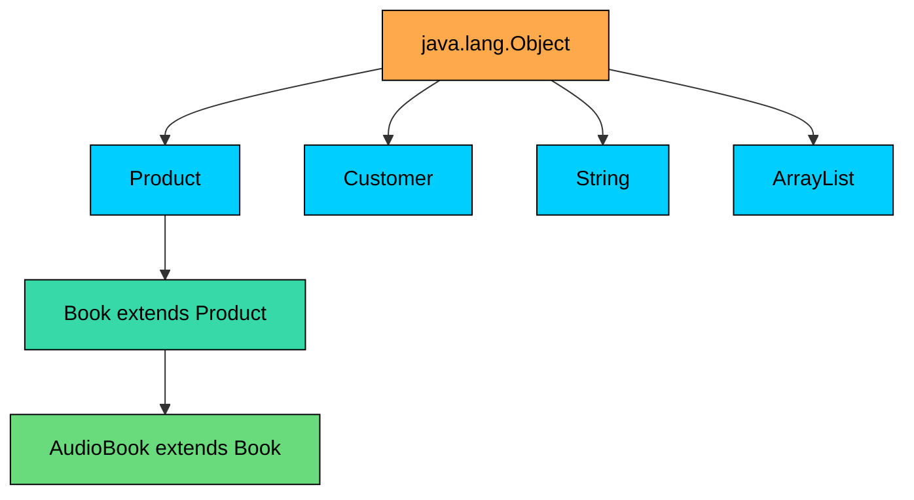
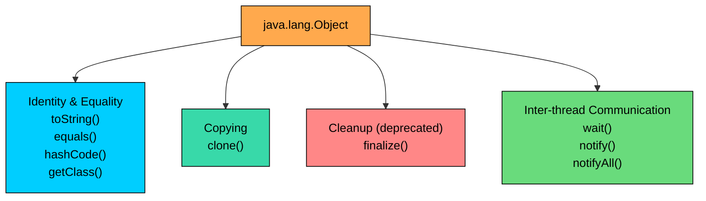

import React from 'react';
import CodeBlock from '../../../../components/ui/CodeBlock';
import Callout from '../../../../components/ui/Callout';

<div className="article-header">
  <div className="breadcrumb">
    <a href="/">Curated Notes</a>
    <span className="breadcrumb-separator">›</span>
    <span className="breadcrumb-current">Object Class</span>
  </div>
  <h1>Object Class</h1>
  <p style={{ color: 'var(--text-muted)', fontSize: '1.1rem', marginBottom: '16px', lineHeight: '1.6' }}>
    Master the essentials of Object Class in this curated guide.
  </p>
  <div className="meta-info">
    <span className="meta-item">
      <svg width="14" height="14" viewBox="0 0 24 24" fill="none" stroke="currentColor" strokeWidth="2"><circle cx="12" cy="12" r="10"/><polyline points="12 6 12 12 16 14"/></svg>
      10 min read
    </span>
    <span className="difficulty-badge difficulty-badge--intermediate">Intermediate</span>
  </div>
</div>

<section className="content-section">

Every class we've written so far has secretly extended `java.lang.Object`. That's what makes `Product`, `Book`, and `Customer` all comparable, hashable, and printable using the same set of methods. This lesson is a guided tour: what `Object` provides, what each method does by default, and which lessons cover the important overrides in detail.

---

## The Universal Root

`java.lang.Object` sits at the top of Java's class hierarchy. Every other class in the language, whether it ships with the JDK or you wrote it yourself this morning, eventually traces its ancestry back to `Object`. There is no class above it, and there is no reference type that escapes it.





The diagram shows what's really going on. `Product`, `Customer`, `String`, and `ArrayList` all sit one level below `Object`. `Book` extends `Product`, which extends `Object`. `AudioBook` extends `Book`, which extends `Product`, which extends `Object`. No matter how deep the inheritance chain goes, the very top is always `Object`.

This isn't a convention or a recommendation. It's a structural rule the language enforces. If you write a class with no explicit `extends` clause, the compiler inserts `extends Object` for you. If you write a class that does extend something, that something either is `Object` or eventually leads to `Object`. There is no third option.

The reason this matters is that every object in a Java program has a known minimum set of capabilities. Any object can be asked for a string form of itself, compared to another object for equality, queried for a hash code, or queried for its runtime class. Any object can be placed into a generic container that accepts `Object`. These are not features a class has to add. They come along the moment a class is declared.


```java
public class Product {
    String name;
    double price;

    public Product(String name, double price) {
        this.name = name;
        this.price = price;
    }

    public static void main(String[] args) {
        Product mouse = new Product("Wireless Mouse", 29.99);

        System.out.println(mouse.toString());
        System.out.println(mouse.hashCode());
        System.out.println(mouse.getClass());
    }
}
```


Nothing in the `Product` source declares `toString`, `hashCode`, or `getClass`. All three are inherited from `Object`, and all three work on the very first instance we build. The class didn't have to ask for these methods. It got them by being a class.

The hex part of `Product@1540e19d` is the identity hash code in hexadecimal, derived from the object's memory address. The exact value varies per run and per JVM.

---

## The Implicit `extends Object`

A class without an explicit `extends` clause silently extends `Object`. The two declarations below are exactly equivalent.


```java
public class Product {
    String name;
}
```


```java
public class Product extends Object {
    String name;
}
```


The compiler treats them the same way. No bytecode difference, no behavior difference. Most Java code uses the short form because the inheritance is implicit.

When a class does extend something else, the chain just gets longer. `Book extends Product` doesn't bypass `Object`. It goes through `Product` to reach `Object`.


```java
public class Product {
    String name;
    double price;

    public Product(String name, double price) {
        this.name = name;
        this.price = price;
    }
}

public class Book extends Product {
    String author;

    public Book(String name, double price, String author) {
        super(name, price);
        this.author = author;
    }

    public static void main(String[] args) {
        Book book = new Book("Effective Java", 39.99, "Joshua Bloch");

        System.out.println(book instanceof Product);
        System.out.println(book instanceof Object);
    }
}
```


A `Book` is a `Product`, and a `Book` is also an `Object`. The chain `Book -> Product -> Object` means every `Book` is all three things at once.

Arrays follow the same rule, even though they aren't classes you declare with a `class` keyword. Every array type has `Object` as its superclass.


```java
public class ArrayRoot {
    public static void main(String[] args) {
        String[] productNames = {"Mouse", "Cable", "Headphones"};
        int[] quantities = {1, 2, 3};

        System.out.println(productNames instanceof Object);
        System.out.println(quantities instanceof Object);

        Object asObject = productNames;
        System.out.println(asObject.getClass().getSimpleName());
    }
}
```


A `String[]` is an `Object`. So is an `int[]`. You can assign either to an `Object` variable, call `getClass()` on it, or put it into a method that accepts `Object`. The array machinery is wired into the same root hierarchy as everything else.

Primitives are the one exception. An `int`, a `double`, a `boolean`, and the other six primitives are **not** objects. They have no methods, no superclass, no `getClass()` to call. The bridge between primitives and the object world is the wrapper classes (`Integer`, `Double`, `Boolean`, and so on). A wrapper class like `Integer` is a normal class that extends `Object`, so its instances do get the full `Object` API. The raw primitive value does not.


```java
public class PrimitivesVsObjects {
    public static void main(String[] args) {
        int rawQuantity = 5;
        Integer wrappedQuantity = 5;

        // rawQuantity.toString();  // would not compile, int has no methods
        System.out.println(wrappedQuantity.toString());
        System.out.println(wrappedQuantity instanceof Object);
    }
}
```


The commented line wouldn't compile because `int` isn't a reference type. The wrapper instance, on the other hand, is a full-fledged object that inherits everything `Object` offers.

---

## A Tour of `Object`'s Methods

`Object` defines a small set of methods that every object in the language inherits. Here's the full list with default behaviors.


| Signature | Default Behavior |
| --- | --- |
| `String toString()` | Returns class name + `@` + hex of identity hash code |
| `boolean equals(Object obj)` | Returns `true` only if both references point to the same object |
| `int hashCode()` | Returns an identity hash code derived from the object's memory state |
| `Class<?> getClass()` | Returns the runtime `Class` object for this instance. Cannot be overridden |
| `Object clone()` | Returns a field-by-field copy, but only if the class implements `Cloneable` |
| `void finalize()` | Called by the garbage collector before reclaiming the object. Deprecated since Java 9, marked for removal in Java 18 |
| `void wait()`, `void wait(long)`, `void wait(long, int)` | Used with `synchronized` for inter-thread waiting |
| `void notify()` | Wakes one thread waiting on this object's monitor |
| `void notifyAll()` | Wakes all threads waiting on this object's monitor |


The methods commonly overridden in real code are at the top of the list: `toString`, `equals`, `hashCode`. The rest are used less often, and a few should not be used at all.

The diagram below groups the methods by what they're for.





Four buckets, four jobs. Identity and equality is the bucket used most often. Copying matters when duplicating an object. The cleanup hook exists for historical reasons and is best avoided. The threading methods are how objects coordinate when multiple threads share them.

The rest of this lesson walks through each bucket at a high level. The lessons that follow take the busy ones (equals, hashCode, toString, clone) and turn each into a full lesson.

---

## `toString()` and Default Behavior

`toString()` returns a string description of the object. Java calls it whenever an object is concatenated with a string (`"Item: " + product`) or passed to `System.out.println`.

The default implementation in `Object` looks like this:


```java
public String toString() {
    return getClass().getName() + "@" + Integer.toHexString(hashCode());
}
```


That gives the fully qualified class name, an `@` sign, and the identity hash code in hexadecimal. Useful for debugging, mostly useless for real output. Here is what happens when a `Product` is printed without overriding the method.


```java
public class Product {
    String name;
    double price;

    public Product(String name, double price) {
        this.name = name;
        this.price = price;
    }

    public static void main(String[] args) {
        Product mouse = new Product("Wireless Mouse", 29.99);
        Product cable = new Product("USB Cable", 9.99);

        System.out.println(mouse);
        System.out.println(cable);
        System.out.println("Item: " + mouse);
    }
}
```


The two products print with different hex suffixes because each has a different identity hash. The hex part differs across machines and even between runs of the same program. The class name on the left is what Java knows. The hex on the right is essentially "where this object lives in memory, scrambled a bit." Neither tells the reader anything useful about a product, which is why almost every meaningful class overrides `toString`. The default `toString` is debug-only output, and most classes whose value is meant to be read replace it.

---

## `equals()` and `hashCode()` and Default Behavior

`equals(Object obj)` answers the question "are these two references logically the same object?" `hashCode()` returns an integer that goes hand-in-hand with equality, and is used by hash-based collections like `HashMap` and `HashSet` to bucket objects efficiently.

The default `equals` in `Object` is reference equality. It returns `true` only when both references point to the exact same object in memory. That's the same comparison `==` does for reference types.


```java
public class Product {
    String name;

    public Product(String name) {
        this.name = name;
    }

    public static void main(String[] args) {
        Product a = new Product("Mouse");
        Product b = new Product("Mouse");
        Product c = a;

        System.out.println("a.equals(b): " + a.equals(b));
        System.out.println("a.equals(c): " + a.equals(c));
        System.out.println("a == b:      " + (a == b));
        System.out.println("a == c:      " + (a == c));
    }
}
```


`a` and `b` both wrap the string `"Mouse"`, but they're two separate `Product` objects with two separate identities, so the default `equals` reports `false`. `c` is just another reference to the same object as `a`, so `equals` returns `true`. That matches what `==` does, because the default `equals` is essentially `this == other` plus a null check on the argument.

The default `hashCode` returns an integer derived from the object's identity. Two `Product` instances built from the same name almost always get different hash codes, because the default implementation doesn't look at field values, only at object identity.


```java
public class Product {
    String name;

    public Product(String name) {
        this.name = name;
    }

    public static void main(String[] args) {
        Product a = new Product("Mouse");
        Product b = new Product("Mouse");

        System.out.println("a.hashCode(): " + a.hashCode());
        System.out.println("b.hashCode(): " + b.hashCode());
    }
}
```


The actual numbers depend on the run, and two distinct objects holding the same data give different hash codes. This is almost never the right behavior for value-like classes such as `Product`, `Customer`, or `Order`. Putting two `Product("Mouse")` instances into a `HashSet` causes the default `equals` and `hashCode` to treat them as different items, and the set accepts both. The defaults work only when "same object in memory" is the right notion of equality, which for most data-carrying classes it isn't.

---

## `getClass()` and the Runtime Class

`getClass()` returns the runtime `Class` object for the instance. Unlike `toString` and `equals`, this method is `final` on `Object`, which means it cannot be overridden. `getClass()` returns the actual runtime type of the instance.


```java
public class Product {
    String name;

    public Product(String name) {
        this.name = name;
    }
}

public class Book extends Product {
    String author;

    public Book(String name, String author) {
        super(name);
        this.author = author;
    }

    public static void main(String[] args) {
        Product mouse = new Product("Wireless Mouse");
        Book bookAsProduct = new Book("Effective Java", "Joshua Bloch");

        Product reference = bookAsProduct;

        System.out.println(mouse.getClass());
        System.out.println(bookAsProduct.getClass());
        System.out.println(reference.getClass());
        System.out.println(reference.getClass().getSimpleName());
    }
}
```


First, the variable `reference` is declared as `Product`, but `getClass()` reports `Book`. `getClass()` always returns the object's actual type, not the declared type of the reference. Second, `getSimpleName()` strips off any package qualifier and returns just the class name, which is what most readable code uses.

The `Class<?>` object is the entry point to Java's reflection API. From it, the methods, fields, constructors, and annotations a class declares can be queried. For this lesson, the key points are that `getClass()` exists, that it's final, and that it returns the real runtime type.

A common pattern is to use `getClass()` inside an override to ensure two objects are of the same runtime type before comparing fields.


```java
public class Product {
    String name;

    public Product(String name) {
        this.name = name;
    }

    public static void main(String[] args) {
        Product mouse = new Product("Wireless Mouse");
        Product cable = new Product("USB Cable");

        System.out.println(mouse.getClass() == cable.getClass());
        System.out.println(mouse.getClass().getName());
    }
}
```


Both objects are `Product` instances, so their `Class` objects are equal by `==` (there's exactly one `Class` object per loaded class, so reference comparison is fine). `getName` gives the fully qualified name, while `getSimpleName` gives just the trailing class name.

---

## `clone()`, `finalize()`, `wait`/`notify`/`notifyAll`

The remaining methods on `Object` are more specialized. Each gets a brief mention here, with pointers to where the real coverage lives.

#### `clone()`

`Object.clone()` is a protected method that produces a field-by-field copy of an object. The protection level is a deliberate restriction: `someProduct.clone()` cannot be called from outside the class. The class has to opt in by implementing the `Cloneable` marker interface and usually exposing its own `public` `clone` method that delegates to `super.clone()`.


```java
public class Product implements Cloneable {
    String name;
    double price;

    public Product(String name, double price) {
        this.name = name;
        this.price = price;
    }

    @Override
    public Product clone() {
        try {
            return (Product) super.clone();
        } catch (CloneNotSupportedException e) {
            throw new AssertionError(e);
        }
    }

    public static void main(String[] args) throws Exception {
        Product original = new Product("Wireless Mouse", 29.99);
        Product copy = original.clone();

        System.out.println(original.name + " $" + original.price);
        System.out.println(copy.name + " $" + copy.price);
        System.out.println(original == copy);
    }
}
```


The copy carries the same field values as the original, but it's a separate object. The `==` check confirms they aren't the same reference. This example doesn't show the difference between **shallow** and **deep** cloning, or the issues around mutable fields, arrays, and inherited state. Cloning correctly is harder than it looks, and copy constructors or static factory methods are often preferred over `clone`.

#### `finalize()`

`finalize()` was originally a hook the garbage collector called before reclaiming an object's memory. The idea was to release native resources or do last-minute cleanup. In practice, `finalize` turned out to be slow, unreliable, and a source of bugs. It was deprecated in Java 9, marked for removal in Java 18, and is no longer recommended.

For cleanup at the end of an object's life, use `try-with-resources` for anything that implements `AutoCloseable`. For the rare cases that need a backstop, `java.lang.ref.Cleaner` replaces what `finalize` used to do, without the performance and correctness problems.

There's no useful default behavior to demonstrate. The method exists and may appear in legacy code; new code should leave it alone.

#### `wait()`, `notify()`, `notifyAll()`

These three methods are how objects coordinate when multiple threads share them. They are tied to `synchronized` blocks: a thread that holds an object's monitor can call `wait()` to release the monitor and pause, and another thread can call `notify()` or `notifyAll()` to wake one or all waiting threads.


```java
public class Inventory {
    public synchronized void waitForStock() throws InterruptedException {
        // releases the monitor and waits
        wait();
    }

    public synchronized void announceStock() {
        // wakes any threads that are waiting on this inventory
        notifyAll();
    }
}
```


This is a sketch, not a runnable example. These three methods exist on every object because every object can act as a monitor for synchronization.

---

## Why It Matters: Universal Containers and Behavior

Having every reference type extend `Object` isn't just a tidy hierarchy diagram. It enables a lot of Java's everyday machinery without each class having to opt in.

The most visible payoff is in containers. An `Object[]` can hold instances of any class. A `List<Object>` can hold the same. A `HashMap<String, Object>` can use any object as a value. Generic collections use this same root: internally, generics in Java are erased to `Object`-typed containers, which is why every type fits.


```java
public class UniversalContainer {
    public static void main(String[] args) {
        Object[] items = new Object[4];
        items[0] = "USB Cable";
        items[1] = 29.99;
        items[2] = new int[]{1, 2, 3};
        items[3] = new java.util.ArrayList<String>();

        for (Object item : items) {
            System.out.println(item.getClass().getSimpleName() + ": " + item);
        }
    }
}
```


A single array holds a `String`, a boxed `Double`, an `int[]`, and an `ArrayList`. Iteration uses `Object item` because every entry is an `Object`. `getClass().getSimpleName()` reports the actual runtime type of each. For the `int[]` printout, arrays inherit the default `toString` from `Object`, where the leading `[I` is JVM shorthand for "array of int." The exact hex varies per run.

Storing primitives in an `Object[]` or `List<Object>` forces autoboxing on the way in and unboxing on the way out. Each boxing call allocates a new wrapper object, so a tight loop that pushes `int` values through an `Object`-typed container can churn through a lot of garbage. Prefer typed primitive arrays or specialized libraries when this matters.

The same root also makes hash-based collections work for any type. `HashMap<Customer, Order>` uses `customer.hashCode()` to bucket entries and `customer.equals(other)` to resolve collisions. Those methods exist on `Customer` because `Customer` extends `Object`. Correctly overridden, the map works as expected. Without correct overrides, the map silently treats logically equal customers as different keys, a common interview trap.

A second payoff is behavior. Any class that wants to add useful behavior across all objects (a logger that takes any value, a debugger that prints any state, a serializer that walks any object graph) can declare its parameters as `Object` and rely on the methods that `Object` provides.


```java
public class Logger {
    public static void log(Object item) {
        System.out.println("[" + item.getClass().getSimpleName() + "] " + item);
    }

    public static void main(String[] args) {
        log("Order placed");
        log(49.99);
        log(new int[]{1, 2, 3});
    }
}
```


The logger accepts any input. It uses `getClass` and the implicit `toString` from `Object`, and it works for any type. That breadth, paid for by writing exactly one method, is what the universal root provides.

The third payoff is correctness. The defaults for `equals`, `hashCode`, and `toString` are barely useful. A `Product` whose `equals` only compares references will never be findable in a `HashMap` keyed by another logically-equal `Product`. A `toString` that prints `Product@1540e19d` won't help debug a failing test. Knowing which defaults exist and what they do is the first step. Knowing when to override them is the second.

</section>
