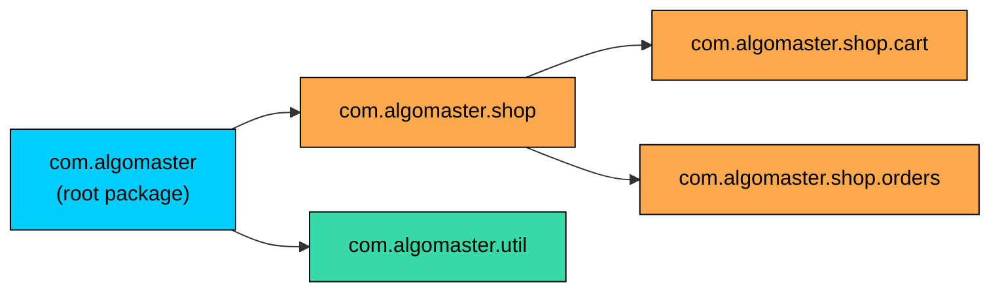
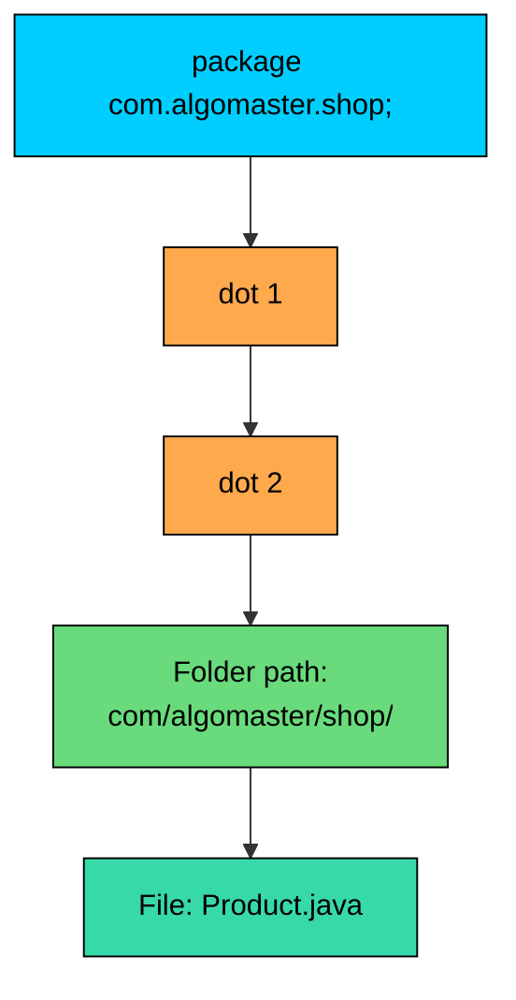

import React from 'react';
import CodeBlock from '../../../../components/ui/CodeBlock';
import Callout from '../../../../components/ui/Callout';

<div className="article-header">
  <div className="breadcrumb">
    <a href="/">Curated Notes</a>
    <span className="breadcrumb-separator">›</span>
    <span className="breadcrumb-current">Packages</span>
  </div>
  <h1>Packages</h1>
  <p style={{ color: 'var(--text-muted)', fontSize: '1.1rem', marginBottom: '16px', lineHeight: '1.6' }}>
    Master the essentials of Packages in this curated guide.
  </p>
  <div className="meta-info">
    <span className="meta-item">
      <svg width="14" height="14" viewBox="0 0 24 24" fill="none" stroke="currentColor" strokeWidth="2"><circle cx="12" cy="12" r="10"/><polyline points="12 6 12 12 16 14"/></svg>
      10 min read
    </span>
    <span className="difficulty-badge difficulty-badge--intermediate">Intermediate</span>
  </div>
</div>

<section className="content-section">

A Java program of any real size has dozens, often hundreds, of classes. A retail system has classes for products, carts, orders, customers, payments, shipping, inventory, discounts, and reviews. Two of those classes might want the same simple name (`Order` in the customer-facing module and `Order` in the warehouse module). Some classes are meant for the whole codebase to use, others belong to a single feature and shouldn't be touched from outside. A package is the language feature that makes all of this manageable. This lesson covers what a package is, how to declare one, how the folder layout on disk has to match the declaration, and how to compile and run code that lives inside packages.

---

## What a Package Is

A package is a named container for classes. Every class in Java belongs to exactly one package. If you don't declare a package, the class belongs to the default (unnamed) package, which production code avoids.

Three problems disappear once classes are grouped into packages.

The first is **naming conflicts**. Two different teams, or two different libraries, can both define a class called `Order` without colliding, as long as each class lives in its own package. The full identity of a class is its **fully qualified name**, which is the package name plus the class name. `com.algomaster.shop.Order` and `com.algomaster.warehouse.Order` are different types, even though their short names match. Without packages, the second declaration would shadow the first and the compiler would refuse the build.

The second is **organization**. A package is a folder on disk. The package name maps directly to a directory path, so the structure of the source tree mirrors the structure of the program. Browsing `com/algomaster/shop/cart/` shows exactly what code handles shopping carts, the same way a folder named `invoices/` in any office indicates its contents.

The third is **access control**. Java has a visibility level called *package-private* (the default when you write no modifier on a class member). Members at this level are visible to other classes in the same package and hidden from everything else. Packages are the unit Java uses to draw that boundary.





The diagram shows a small package tree for an e-commerce app. The root is `com.algomaster`. Underneath it, `shop` holds feature-specific code, which is further broken into `cart` and `orders`. A sibling `util` package holds helpers that the rest of the codebase reuses. Each dotted name is a separate package, and each one maps to a folder of the same path on disk.

---

## The `package` Declaration

A class joins a package by declaring it on the very first line of code in the file (comments are allowed before the declaration; nothing else is). The syntax is the keyword `package`, the package name, and a semicolon.


```java
package com.algomaster.shop;

public class Product {
    private String name;
    private double price;

    public Product(String name, double price) {
        this.name = name;
        this.price = price;
    }

    public String getName() {
        return name;
    }

    public double getPrice() {
        return price;
    }
}
```


This file declares one public class, `Product`, and tells the compiler that the class belongs to the package `com.algomaster.shop`. The fully qualified name of the class is `com.algomaster.shop.Product`. Any other class in any other package refers to it by that full name (or by importing it).

Three rules apply to the declaration itself.

The `package` statement, if present, must be the first non-comment line in the file. Putting an `import` or a class declaration above it fails to compile.

A file can declare at most one package. There's no syntax for splitting a single source file across packages, and there's no way for one file to "join" two packages at once.

Every file in a package repeats the same `package` declaration at the top. The compiler reads each file independently, so the line has to appear in each one. A file in `com.algomaster.shop` that forgets the declaration lands in the default package, even if every neighboring file declares the right package.

A second class in the same package:


```java
package com.algomaster.shop;

public class CartItem {
    private Product product;
    private int quantity;

    public CartItem(Product product, int quantity) {
        this.product = product;
        this.quantity = quantity;
    }

    public double getSubtotal() {
        return product.getPrice() * quantity;
    }
}
```


`CartItem` refers to `Product` by its short name, not as `com.algomaster.shop.Product`. Two classes in the same package see each other directly without imports or qualifications. This convenience is one of the common reasons to put related classes in the same package.

---

## Naming Conventions

Java doesn't force a specific naming style, but the conventions are universal across the ecosystem. Following them keeps one team's package layout legible to another team without explanation.

**Lowercase only.** Package names are written entirely in lowercase. `com.algomaster.shop` is correct; `com.AlgoMaster.Shop` compiles but looks wrong to every Java reader. Mixed case is reserved for type names (classes, interfaces, enums).

**Reverse domain name as the root.** The standard practice is to start the package with a domain the team owns, written in reverse. A company that owns `algomaster.io` uses `io.algomaster.*` as its root. The Oracle JDK uses `java.*` and `javax.*` (a special case, reserved for the platform). A company at `example.com` would use `com.example.*`. The reverse-domain prefix guarantees global uniqueness: as long as each team starts with a domain it controls, no two teams ever pick the same package name by accident.

**No hyphens.** Package name segments must be valid Java identifiers. Identifiers can contain letters, digits, underscores, and dollar signs, and they cannot start with a digit. Hyphens are illegal. A domain like `algo-master.io` becomes `io.algomaster` or `io.algo_master` in package form (the underscore is allowed but unusual).

**No Java keywords or reserved words.** A segment cannot be a Java keyword like `int`, `class`, `new`, or `void`. A domain like `int.example.com` would have to become `int_.example.com` or similar in package form.

**Avoid digits as the first character of a segment.** Identifiers can't start with a digit. A segment that has to start with one needs a workaround, usually a leading underscore.

A small table of legal versus illegal forms:


| Package name | Legal? | Why |
| --- | --- | --- |
| `com.algomaster.shop` | Yes | Lowercase, reverse domain, valid identifiers. |
| `com.algomaster.shop.cart` | Yes | Sub-package of `shop`. |
| `com.AlgoMaster.Shop` | Yes, but discouraged | Compiles, but breaks convention. |
| `com.algo-master.shop` | No | Hyphen is not a valid identifier character. |
| `com.algomaster.new` | No | `new` is a Java keyword. |
| `com.algomaster.3d` | No | A segment cannot start with a digit. |
| `Com.Algomaster.Shop` | Yes, but discouraged | Compiles. Mixed case breaks convention. |


For internal projects with no public domain, picking a stable prefix (`com.algomaster.internal`, `io.algomaster.tools`) keeps the same uniqueness property and matches everything else in the codebase.

---

## Folder Layout on Disk

The package name is not just a label. It maps directly to a folder structure on disk, with each dot in the name corresponding to a folder boundary. The Java compiler and the JVM both rely on this mapping to find class files.

A class declared as `package com.algomaster.shop;` must live in a file at path `com/algomaster/shop/<ClassName>.java` (using `/` on macOS and Linux, `\` on Windows). The reverse is also true: a file at `com/algomaster/shop/Product.java` must declare `package com.algomaster.shop;` at the top. The two must match exactly.

A small project that has two classes, `Product` and `CartItem`, both in `com.algomaster.shop`, plus a `Main` class in `com.algomaster.shop.app`, looks like this on disk:


```shell
shop-project/
  src/
    com/
      algomaster/
        shop/
          Product.java
          CartItem.java
          app/
            Main.java
```


Five folder levels under `src/` lead to the actual source files. The depth comes straight from the dots in the package names. `com.algomaster.shop.app` has three dots, so the path inside `src/` has three folder transitions before the file name.





The diagram traces the mapping. Each dot in the package name becomes a folder separator. The full path of the file is the package as folders, joined with the file name. A mismatch of even one folder level causes the compiler to fail the build.

The source of `Main.java`, sitting at `src/com/algomaster/shop/app/Main.java`:


```java
package com.algomaster.shop.app;

import com.algomaster.shop.Product;
import com.algomaster.shop.CartItem;

public class Main {
    public static void main(String[] args) {
        Product book = new Product("Java in Action", 29.99);
        CartItem item = new CartItem(book, 2);

        System.out.println("Item: " + book.getName());
        System.out.println("Quantity: 2");
        System.out.println("Subtotal: $" + item.getSubtotal());
    }
}
```


`Main` lives in a different package (`com.algomaster.shop.app`) from `Product` and `CartItem` (which live in `com.algomaster.shop`), so the file uses `import` statements to refer to those classes by short name. The relevant point here is that `Main` would not compile if either of those classes was in the wrong folder, because the compiler wouldn't find them at the path the package declaration specifies.

---

## Compiling and Running Classes in Packages

Once a project has packages, the commands to compile and run change in two small but important ways. `javac` needs to be told where to put the compiled `.class` files, and `java` needs the fully qualified name of the class to start.

Assume this source layout:


```shell
shop-project/
  src/
    com/
      algomaster/
        shop/
          Product.java
          CartItem.java
          app/
            Main.java
```


From the `shop-project/` folder, compile everything with:


```shell
javac -d out src/com/algomaster/shop/Product.java src/com/algomaster/shop/CartItem.java src/com/algomaster/shop/app/Main.java
```


The `-d out` flag tells `javac` to write the compiled `.class` files into an `out/` directory, preserving the package folder structure. After the command finishes, the project tree looks like this:


```shell
shop-project/
  src/
    com/algomaster/shop/Product.java
    com/algomaster/shop/CartItem.java
    com/algomaster/shop/app/Main.java
  out/
    com/algomaster/shop/Product.class
    com/algomaster/shop/CartItem.class
    com/algomaster/shop/app/Main.class
```


The `out/` tree mirrors the `src/` tree. Without `-d out`, `javac` writes class files next to the sources, which mixes generated artifacts into the source tree and makes cleanup harder.

Listing every source file by hand is tedious for any project beyond three or four files. The usual shortcut is to let the shell expand the list:


```shell
javac -d out $(find src -name "*.java")
```


Or, on Windows or for a portable alternative, write the list to a file and use `@filename` syntax:


```shell
find src -name "*.java" > sources.txt
javac -d out @sources.txt
```


Real projects almost always use a build tool (Maven, Gradle) that handles this automatically. The hand-rolled commands here are useful to understand because they show what every build tool eventually delegates to.

To run the program, point `java` at the `out/` folder and pass the **fully qualified name** of the class that has `main`:


```shell
java -cp out com.algomaster.shop.app.Main
```


Two pieces matter here. The `-cp out` flag (short for `--class-path`) tells the JVM where the root of the compiled tree is. The argument `com.algomaster.shop.app.Main` is the fully qualified class name of `Main`, written with dots, not slashes. The JVM combines the classpath with the FQN, looking for `out/com/algomaster/shop/app/Main.class`. When it finds it, it invokes the `main` method.

A common mistake is to try `java -cp out Main` (just the short name), which fails because `Main` isn't in the default package; the JVM searches for `out/Main.class` and reports `Error: Could not find or load main class Main`. Another common mistake is passing the file path (`java out/com/algomaster/shop/app/Main.class`), which also fails because `java` takes a class name, not a path.


| Command | What it does |
| --- | --- |
| `javac -d out src/...` | Compiles `.java` files and writes `.class` files under `out/`. |
| `java -cp out com.algomaster.shop.app.Main` | Runs the class whose fully qualified name follows the classpath. |
| `java -cp out Main` | Fails. The JVM looks for `Main.class` directly under `out/`. |
| `java out/com/algomaster/shop/app/Main.class` | Fails. `java` takes a class name, not a file path. |


The first run of a JVM has a warm-up overhead from class loading. For a short program that runs once and exits, package depth has no measurable cost. The classpath lookup is a hash map, not a directory scan.

---

## The Default (Unnamed) Package

A file that has no `package` declaration belongs to the **default package**, sometimes called the unnamed package. It works fine for the kind of throwaway example shown in a first lesson, where every class lives in one folder and there's nothing to organize.


```java
public class HelloShop {
    public static void main(String[] args) {
        System.out.println("Hello, shop!");
    }
}
```


This file has no `package` line at all. The class `HelloShop` lives in the default package, and the file lives directly in the source root (not inside any sub-folder).

The default package is fine for one-off scripts. It breaks down for anything bigger, and production code avoids it for three concrete reasons.

A class in the default package cannot be imported into a named package. The Java language specification says: "A type in the unnamed package can never be referred to by code in a named package." Once a project has any class in a real package, classes still in the default package are unreachable from it. `import HelloShop;` from a file in `com.algomaster.shop` is not valid syntax, because the `import` statement requires a package name to read from.

The default package can't define a unique name space. Two third-party libraries that both use the default package will collide if they ship classes with the same simple name. Named packages exist specifically to prevent that. The default package opts out of the protection.

The Java module system doesn't recognize the default package at all. A class in the default package cannot live inside a module. For any code that uses modules, the default package is not an option.

The rule of thumb is: as soon as a project has more than one source file or is intended to be shared, give every class a real package. The cost is one extra `package` line at the top of each file and a slightly deeper folder layout. Both are tiny prices for the benefits.

---

## Package-Level (Default) Access Briefly

Java has four access levels for class members: `public`, `protected`, default (no modifier, also called package-private), and `private`. Three of them are familiar from the encapsulation lesson. The package-private level is the one packages enable.

A member with no access modifier is visible to every class in the same package and invisible to every class outside it. The rule is at the package level, not the file level, so two classes that share a package see each other's package-private members directly.


```java
package com.algomaster.shop;

public class Product {
    String internalSku;
    public String publicName;

    public Product(String name, String sku) {
        this.publicName = name;
        this.internalSku = sku;
    }
}
```


The field `publicName` is `public`, so any class anywhere can read or write it. The field `internalSku` has no modifier, so only classes in `com.algomaster.shop` can access it. A class in `com.algomaster.shop.app` cannot, even though the names appear related. Package membership is determined by exact match, not by prefix; `com.algomaster.shop` and `com.algomaster.shop.app` are different packages, even though one name starts with the other.


| Modifier | Same class | Same package | Subclass (any package) | Anywhere |
| --- | --- | --- | --- | --- |
| `public` | Yes | Yes | Yes | Yes |
| `protected` | Yes | Yes | Yes | No |
| (no modifier) | Yes | Yes | No | No |
| `private` | Yes | No | No | No |


The package-private level draws a boundary between code that's part of a package's internal implementation and code that's the package's public API. Helper classes, internal utilities, and methods that one class uses to talk to another class in the same package can stay package-private and be invisible to the rest of the program. The full discussion belongs in a more advanced lesson on API design. The access level exists only because packages exist to scope it.

---

## The `java.*` and `javax.*` Standard Packages

The JDK ships thousands of pre-built classes, and they live in two top-level package families: `java.*` and `javax.*`. Every Java program uses some of them, and most early work is built on top of them.

A short tour of the most common ones:


| Package | What's inside |
| --- | --- |
| `java.lang` | Core types: `String`, `Object`, `Integer`, `System`, `Math`, `Thread`, `Exception`. Imported automatically. |
| `java.util` | Collections, dates, scanners: `List`, `Map`, `ArrayList`, `HashMap`, `Scanner`, `Random`. |
| `java.io` | Input and output streams, files: `File`, `BufferedReader`, `PrintWriter`. |
| `java.nio.file` | Modern file APIs: `Path`, `Paths`, `Files`. |
| `java.net` | Networking: `URL`, `URI`, `HttpURLConnection`. |
| `java.time` | Modern date and time API (Java 8+): `LocalDate`, `Instant`, `Duration`. |
| `java.math` | Arbitrary-precision math: `BigInteger`, `BigDecimal`. |
| `javax.crypto` | Cryptography APIs. |
| `javax.sql` | Extended JDBC APIs. |


The `java.*` packages are the original platform APIs. `java.lang` is special because the compiler imports it automatically; `import java.lang.String;` is unnecessary even though `String` is in `java.lang`. Every other package, including the rest of `java.*`, has to be imported explicitly to refer to its classes by short name.

The `javax.*` packages started as extensions (the `x` is for "extension"). Originally they shipped separately and were added to the platform later. Over time some of them became standard, but the names stayed for backwards compatibility. There's no consistent rule today for which APIs land under `java.*` versus `javax.*`; for the purposes of this lesson, treat both as JDK-supplied packages usable without adding any dependencies.

A program that uses `java.util.ArrayList` looks like this:


```java
package com.algomaster.shop;

import java.util.ArrayList;
import java.util.List;

public class CartListing {
    public static void main(String[] args) {
        List<String> cart = new ArrayList<>();
        cart.add("Java in Action");
        cart.add("Effective Java");
        cart.add("Clean Code");

        System.out.println("Items in cart: " + cart.size());
        for (String title : cart) {
            System.out.println("- " + title);
        }
    }
}
```


Two imports bring in `ArrayList` and `List` from `java.util`. No import is needed for `String` or `System` because both live in `java.lang`. The class itself sits in `com.algomaster.shop`, our running package. The imports name the package and the class, separated by a dot, ending in a semicolon.

---

## Common Mistakes

A few wrong moves repeat often enough to be worth naming.

**Mismatched package declaration and folder path.** The file says `package com.algomaster.shop;` at the top, but the file is sitting in `src/com/algomaster/cart/Product.java`. The compiler emits an error like:


```shell
src/com/algomaster/cart/Product.java:1: error: class Product is public, should be declared in a file named Product.java
package com.algomaster.shop;
```


The fix is to make the path match the package. Either move the file to `src/com/algomaster/shop/Product.java`, or change the declaration to `package com.algomaster.cart;`. The compiler is strict: if the two don't match, the build fails.

**Running with a bare class name instead of the fully qualified name.** After compiling with `-d out`, the common attempt is:


```shell
java -cp out Main
```


The JVM responds:


```shell
Error: Could not find or load main class Main
Caused by: java.lang.ClassNotFoundException: Main
```


The fix is to use the FQN:


```shell
java -cp out com.algomaster.shop.app.Main
```


**Slashes in the FQN passed to `java`.** Another common attempt is:


```shell
java -cp out com/algomaster/shop/app/Main
```


That command also fails, with a similar `ClassNotFoundException`. The argument to `java` is a class name, not a path. Use dots.

**Forgetting `-cp` and assuming the current directory is the classpath.** With no `-cp`, the JVM uses the current directory as the classpath, which works only if the compiled tree is there. From `shop-project/`, running `java com.algomaster.shop.app.Main` without `-cp out` fails because the JVM looks for `com/algomaster/shop/app/Main.class` directly under `shop-project/`, not under `out/`.

**Putting two top-level public classes in the same file.** A `.java` file may contain at most one `public` class, and that class must have the same name as the file. Trying to declare two `public` classes in one file always fails. This rule isn't about packages, but it surfaces during package work because file names and class names are checked together.

**Using a Java keyword as a package segment.** A package like `com.algomaster.new.tools` fails because `new` is a keyword. The compiler error is straightforward, but the fix isn't always obvious. Pick a different segment name (`com.algomaster.newest.tools`, `com.algomaster.new_.tools`), or restructure the hierarchy.

---

## A Two-Package Example End to End

A small, complete example that exercises everything in this lesson: two source files in two different packages, a compile step, and a run step.

The first file, at `src/com/algomaster/shop/Product.java`:


```java
package com.algomaster.shop;

public class Product {
    private String name;
    private double price;

    public Product(String name, double price) {
        this.name = name;
        this.price = price;
    }

    public String getName() {
        return name;
    }

    public double getPrice() {
        return price;
    }
}
```


The second file, at `src/com/algomaster/shop/app/CartApp.java`:


```java
package com.algomaster.shop.app;

import com.algomaster.shop.Product;

public class CartApp {
    public static void main(String[] args) {
        Product first = new Product("Wireless Mouse", 19.99);
        Product second = new Product("USB-C Cable", 8.49);

        double total = first.getPrice() + second.getPrice();
        System.out.println("Items: " + first.getName() + ", " + second.getName());
        System.out.println("Total: $" + total);
    }
}
```


Compile from `shop-project/`:


```shell
javac -d out src/com/algomaster/shop/Product.java src/com/algomaster/shop/app/CartApp.java
```


Run:


```shell
java -cp out com.algomaster.shop.app.CartApp
```


Every piece this lesson covered appears here. Each file has a `package` declaration on its first non-comment line. The folder layout under `src/` matches the package names exactly. The compiler writes the corresponding folder tree under `out/`. The `java` command names the entry-point class by its fully qualified name. The two classes live in different packages, so `CartApp` uses an `import` to bring `Product` in by short name.

</section>
