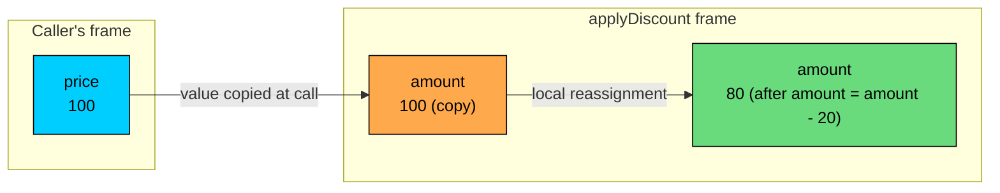
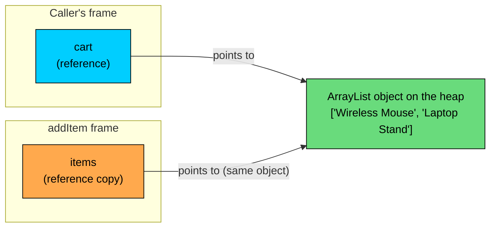
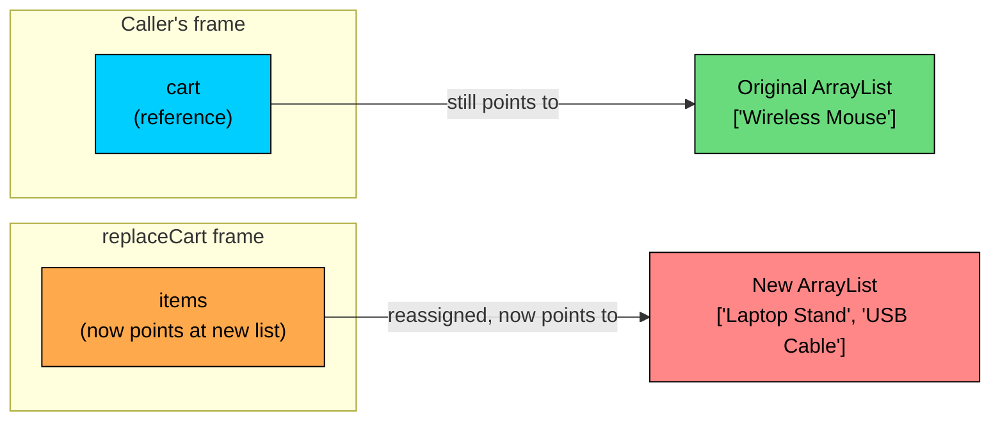

import React from 'react';
import CodeBlock from '../../../../components/ui/CodeBlock';
import Callout from '../../../../components/ui/Callout';

<div className="article-header">
  <div className="breadcrumb">
    <a href="/">Curated Notes</a>
    <span className="breadcrumb-separator">›</span>
    <span className="breadcrumb-current">Pass by Value</span>
  </div>
  <h1>Pass by Value</h1>
  <p style={{ color: 'var(--text-muted)', fontSize: '1.1rem', marginBottom: '16px', lineHeight: '1.6' }}>
    Master the essentials of Pass by Value in this curated guide.
  </p>
  <div className="meta-info">
    <span className="meta-item">
      <svg width="14" height="14" viewBox="0 0 24 24" fill="none" stroke="currentColor" strokeWidth="2"><circle cx="12" cy="12" r="10"/><polyline points="12 6 12 12 16 14"/></svg>
      10 min read
    </span>
    <span className="difficulty-badge difficulty-badge--intermediate">Intermediate</span>
  </div>
</div>

<section className="content-section">

Java has exactly one rule for how arguments get into methods, and it never changes: **Java is always pass by value**. There is no pass by reference, not for primitives, not for objects, not for arrays, not for strings. The confusing part is that this single rule produces two very different-looking behaviors depending on the argument type, and the two behaviors are sometimes mistaken for two different rules. This lesson covers what pass by value actually means, why mutating a `Cart` inside a method does change the caller's cart, why reassigning the same `Cart` parameter inside a method does not, and how to articulate this clearly in an interview.

---

## What "Pass by Value" Actually Means

A method parameter is just a local variable. When a method is called, Java copies the **value of the argument** into that local variable. Whatever happens to the parameter inside the method happens to a copy. The caller's variable is a separate storage slot in memory and Java does not touch it.

The key word is "value". For a primitive like `int`, the value is the number itself, so a copy of the number ends up in the parameter. For a reference type like a `Cart` object, the value of the variable is **not the object**, it's the **reference**, which is essentially a memory handle that points at the object. So a copy of the reference ends up in the parameter. Both variables, the caller's and the method's, now hold a reference to the same object on the heap.

That single rule, "copy the value", is what produces the two behaviors that can appear inconsistent.


```java
public class DiscountAttempt {
    public static void main(String[] args) {
        int price = 100;
        applyDiscount(price);
        System.out.println("Price after method: " + price);
    }

    static void applyDiscount(int amount) {
        amount = amount - 20;
        System.out.println("Inside method: " + amount);
    }
}
```


The method received a copy of the number `100`. It subtracted 20 from its own local copy. The caller's `price` was never touched, because the caller's `price` lives in a different slot in memory than the parameter `amount`. The method had no way to reach back and rewrite it.

This isn't a quirk of `int`. It's the entire mechanism. Every parameter in Java works this way. The only question is what the "value" being copied actually is.

---

## Primitives: The Value Is the Number

For the eight primitive types (`int`, `long`, `short`, `byte`, `float`, `double`, `char`, `boolean`), the variable's value is the number or character or `true`/`false` itself. Passing a primitive copies that value into the parameter. The two variables, the caller's and the method's, are completely independent storage slots that happen to start out holding the same number.

A small diagram makes this concrete. Suppose `price` is `100` in the caller and `applyDiscount(price)` is called. Inside the method, the parameter `amount` is a new slot with its own copy of `100`. Subtracting 20 from `amount` changes `amount`'s slot. It cannot reach the `price` slot at all.





The caller and the method live in two separate frames on the call stack. Each frame has its own slots for its own variables. The arrow at call time is a one-way copy. After that copy, the two slots have no connection at all. Reassigning the method's slot has zero effect on the caller's slot. This is the entire story for primitives.

A second example shows the same thing with a `boolean`.


```java
public class CartFlag {
    public static void main(String[] args) {
        boolean isEmpty = true;
        markNotEmpty(isEmpty);
        System.out.println("Caller sees isEmpty = " + isEmpty);
    }

    static void markNotEmpty(boolean flag) {
        flag = false;
        System.out.println("Inside method, flag = " + flag);
    }
}
```


Same shape, different type. The method got a copy of `true`. It flipped its own copy to `false`. The caller's `isEmpty` was never reachable from inside the method.

---

## Reference Types: The Value Is the Reference

For everything that isn't a primitive (objects, arrays, strings, lists, every user-defined class), the variable's value is a **reference**. A reference is a small handle, often described as an address, that points at where the actual object lives on the heap. The variable itself doesn't contain the object's data. It contains a pointer to it.

Passing a reference-type argument copies the reference. The parameter and the caller's variable now hold the same handle, which means they point at the same object on the heap. There is one object. There are two variables that both reach it.

This is the second behavior, and the source of confusion. Because both variables point at the same object, anything the method does to that object **through the parameter** is visible to the caller. The method didn't reach into the caller's variable. It reached into the shared object, and the caller is looking at that same shared object through its own variable.


```java
import java.util.ArrayList;
import java.util.List;

public class CartMutation {
    public static void main(String[] args) {
        List<String> cart = new ArrayList<>();
        cart.add("Wireless Mouse");
        addItem(cart);
        System.out.println("Cart size after method: " + cart.size());
        System.out.println("Cart contents: " + cart);
    }

    static void addItem(List<String> items) {
        items.add("Laptop Stand");
    }
}
```


The method received a copy of the reference. The copy still points at the same `ArrayList` on the heap. Calling `items.add(...)` mutates that one shared list. When the caller looks through its own variable, it sees the same list, now with two elements.

This is not pass by reference. The reference itself was copied. The caller's variable was not changed. What changed was the object that both variables happen to point at.

The diagram below shows what is happening in memory. Each variable is its own slot. The slots happen to hold the same value (the same handle). The handle points at the one object on the heap.





Two arrows. One object. The arrow in the caller's frame and the arrow in the method's frame are independent copies of the same handle. Following either arrow leads to the same `ArrayList`. So when the method calls `items.add(...)`, the addition lands in the one shared list, and the caller sees it because the caller's arrow points at the same list.

---

## Reassigning the Parameter Does Nothing

Now we get to the part where the "always pass by value" rule shows its real effect. If pass by reference were really happening for objects, then reassigning the parameter inside a method should also be visible to the caller. It isn't. And it isn't for the same reason the primitive example didn't update the caller's variable: the parameter is a separate slot.


```java
import java.util.ArrayList;
import java.util.List;

public class CartReassign {
    public static void main(String[] args) {
        List<String> cart = new ArrayList<>();
        cart.add("Wireless Mouse");
        replaceCart(cart);
        System.out.println("Caller cart size: " + cart.size());
        System.out.println("Caller cart: " + cart);
    }

    static void replaceCart(List<String> items) {
        items = new ArrayList<>();
        items.add("Laptop Stand");
        items.add("USB Cable");
        System.out.println("Inside method: " + items);
    }
}
```


This is the line that matters: `items = new ArrayList<>();`. This is not a mutation of the original cart. This is a **reassignment** of the local parameter. The parameter `items` started out pointing at the caller's cart. The new line makes `items` point at a new `ArrayList` instead. The caller's `cart` variable still holds its own reference, which still points at the original list, which still contains the one item it started with.

If Java were pass by reference, the new `ArrayList` would replace the caller's list. It doesn't, which is a direct proof that Java is pass by value even for objects.

The mental model is: the parameter is a separate slot. The parameter can be reassigned (changing what's in that slot), and that change is local. The reference in that slot can be followed to modify the object it points at, and that modification is shared because the object is shared. These are two different operations and Java treats them differently.

The diagram below shows the state right after `items = new ArrayList<>()` runs inside the method.





After the reassignment, the two arrows point at two different objects. The method's local variable was rebound. The caller's variable was not, because Java never let the method touch the caller's slot in the first place.

---

## The Classic Swap That Doesn't Work

The textbook way to demonstrate pass by value versus pass by reference is to write a `swap` method. In a language with true pass by reference (like C++ with reference parameters), a function can take two variables and swap the values stored in the caller's slots. In Java, this is not possible. Here's the attempt with primitives.


```java
public class PrimitiveSwapAttempt {
    public static void main(String[] args) {
        int priceA = 30;
        int priceB = 50;
        swap(priceA, priceB);
        System.out.println("priceA = " + priceA);
        System.out.println("priceB = " + priceB);
    }

    static void swap(int a, int b) {
        int temp = a;
        a = b;
        b = temp;
        System.out.println("Inside swap: a = " + a + ", b = " + b);
    }
}
```


Inside `swap`, the local copies are exchanged. The caller's variables are untouched. This matches the primitive rules from earlier in the lesson, and it's the standard "swap doesn't work" demonstration.

The version where the rules might appear to change: swap with objects.


```java
public class ProductSwapAttempt {
    public static void main(String[] args) {
        String productA = "Wireless Mouse";
        String productB = "Laptop Stand";
        swap(productA, productB);
        System.out.println("productA = " + productA);
        System.out.println("productB = " + productB);
    }

    static void swap(String a, String b) {
        String temp = a;
        a = b;
        b = temp;
        System.out.println("Inside swap: a = " + a + ", b = " + b);
    }
}
```


Same result. The parameters `a` and `b` are local variables that received copies of the references. The method swaps the local copies. The caller's `productA` and `productB` still hold their original references and still point at the original strings. The swap was real inside the method's frame. It was invisible from the caller's frame.

This is the cleanest practical proof that Java is pass by value for reference types too. If references could be swapped through the parameter, this code would work. It doesn't.

When swap behavior is actually needed in Java, design around it. One common pattern is to return the swapped pair (using an array or a small class). Another is to put both values inside a container object and mutate the container's fields, which works because mutation of a shared object is visible. There's no way to swap two independent local variables of the caller through a method call. The language mechanism doesn't allow it.

---

## Arrays Are References Too

Arrays are objects in Java, even arrays of primitives. So an `int[]` parameter follows the reference-type rules: the array reference is copied, but both variables point at the same array. Mutating an element is visible. Reassigning the parameter to a new array is not.


```java
public class PriceUpdater {
    public static void main(String[] args) {
        int[] prices = {30, 50, 80};
        applyDiscount(prices);
        System.out.println("After applyDiscount:");
        for (int p : prices) {
            System.out.println(p);
        }
    }

    static void applyDiscount(int[] arr) {
        for (int i = 0; i < arr.length; i++) {
            arr[i] = arr[i] - 10;
        }
    }
}
```


The method received a copy of the array reference. Writing into `arr[i]` writes into the one shared array. The caller's variable still points at that array and reads the updated values.

Compare that to a version that tries to replace the whole array.


```java
public class PriceReplacer {
    public static void main(String[] args) {
        int[] prices = {30, 50, 80};
        replace(prices);
        System.out.println("After replace:");
        for (int p : prices) {
            System.out.println(p);
        }
    }

    static void replace(int[] arr) {
        arr = new int[]{1, 2, 3};
        System.out.println("Inside method: " + arr[0] + ", " + arr[1] + ", " + arr[2]);
    }
}
```


`arr = new int[]{1, 2, 3}` rebinds the local parameter. The caller's `prices` variable still holds its own reference, still pointing at `{30, 50, 80}`. Nothing in the caller changed, because the parameter was a separate slot the whole time.

This is the same distinction we saw with the cart: mutating the elements is visible, reassigning the parameter is not.

Returning a new array from a method (and assigning it back at the call site) is one way to produce a "replaced" array without surprising the caller. The trade-off is the cost of allocating that new array, which for large arrays is the dominant work. For in-place updates of small arrays, in-place mutation is fine and avoids the allocation. Pick based on whether the caller expects a separate result or an updated input.

---

## Strings Look Strange, but the Rule Is the Same

Strings are reference types, so by the rules above, mutating a `String` through a parameter should be visible to the caller, just like mutating a list. Yet code like this seems to behave like a primitive.


```java
public class StringPuzzle {
    public static void main(String[] args) {
        String productName = "Wireless Mouse";
        upper(productName);
        System.out.println("Caller sees: " + productName);
    }

    static void upper(String name) {
        name = name.toUpperCase();
        System.out.println("Inside method: " + name);
    }
}
```


The caller's `productName` is unchanged, even though `String` is a reference type. What's going on?

Two things are stacked here, and both follow the rules already established:

1. **`String` is immutable.** Once a `String` object exists, no method on it can change its characters. So `name.toUpperCase()` does not mutate the existing string. It builds and returns a new `String`.
2. **The parameter is a separate slot.** The line `name = name.toUpperCase()` is reassigning the local parameter to point at the new `String`. By the reference-type rule, that reassignment is local to the method and the caller's variable is not affected.

Because `String` is immutable, there is no version of this code where the method could mutate the caller's string. The only way to "change" a string is to build a new one and reassign, and reassignment of a parameter is local. So even though `String` is technically a reference type, it appears to behave like a primitive when passed to a method. The behavior comes from immutability, not from a special pass-by-value rule for strings.

Compare that to a mutable reference type. If `String` were mutable and had a method like `mutateToUpper()` that edited the characters in place, the caller would see the change. The list and array examples above show exactly that pattern with collections that do allow in-place mutation.

The story is consistent: the rule is "pass by value of the reference". Whether the caller sees a change depends on whether the shared object is mutated (visible) or the parameter is reassigned (not visible), and whether the type even allows mutation at all (`String` doesn't).

---

## Java vs. Other Languages, Briefly

This question comes up because some programming languages let a function receive a parameter and write through it to update the caller's variable. Those languages have an explicit feature called **pass by reference**, where the parameter is not a copy but is literally the same storage slot as the caller's variable. Reassigning the parameter rebinds the caller's variable. Setting the parameter to a new value changes what the caller sees.

Java does not have this. Every parameter in Java is a fresh local variable that receives a copy of the argument's value. For primitives the value is the number. For objects the value is the reference. There is no syntax in Java that gives a method a way to rebind the caller's variable. No keyword (`final`, `static`, anything else) changes this. In a language that does have pass by reference, the difference is real and shows up exactly in the swap example: there, a swap function works; in Java, it doesn't, regardless of the types used.

Familiarity with those other languages isn't required to write Java. The relevant point is that "pass by reference" is a specific feature Java doesn't have, and using the term loosely causes the confusion when explaining Java's behavior with objects.

---

## How to Answer This in an Interview

This is a common conceptual question in a Java interview, and a clean answer demonstrates a real understanding of the mechanism rather than just pattern-matching the behavior.

A good answer is something close to: **"Java is pass by value. Always. For objects, what gets copied is the reference, not the object. So the method and the caller end up pointing at the same object, which is why mutating it through the parameter is visible to the caller, but reassigning the parameter is not."**

That answer does three things in two sentences: it states the rule, it explains why the two behaviors look different, and it draws the line between mutation and reassignment. Pairing it with the swap example demonstrates the ability to reason through the mechanism.

**Avoid:**

- "Java is pass by reference for objects." This is incorrect.
- "Java is pass by value for primitives and pass by reference for objects." Same problem, restated.
- "It's complicated." It isn't.

---

## Putting It All Together

One worked example, three behaviors, all from the same rule.


```java
import java.util.ArrayList;
import java.util.List;

public class PassByValueSummary {
    public static void main(String[] args) {
        int price = 100;
        String productName = "Wireless Mouse";
        List<String> cart = new ArrayList<>();
        cart.add(productName);

        modifyAll(price, productName, cart);

        System.out.println("price        = " + price);
        System.out.println("productName  = " + productName);
        System.out.println("cart         = " + cart);
    }

    static void modifyAll(int amount, String name, List<String> items) {
        amount = amount - 20;
        name = name.toUpperCase();
        items.add("Laptop Stand");
        items = new ArrayList<>();
        items.add("Headphones");
    }
}
```


Three parameters, three different-looking outcomes, one consistent rule:

- `amount` is a primitive copy. Subtracting 20 changes the copy. The caller's `price` is untouched, still `100`.
- `name` is a copy of a reference. Reassigning the parameter to a new `String` (the result of `toUpperCase()`) is local. The caller's `productName` is untouched, still `"Wireless Mouse"`.
- `items` starts out as a copy of the cart reference. The line `items.add("Laptop Stand")` mutates the shared list, which is visible to the caller. Then `items = new ArrayList<>()` rebinds the local parameter, and `items.add("Headphones")` adds to that new list, which the caller never sees. The caller's `cart` is now `[Wireless Mouse, Laptop Stand]`.

Tracing this example reinforces the rule: the parameter is a separate slot that starts with a copy. Operations through that slot (mutating the object the slot points at) are visible. Operations on the slot itself (reassigning it) are not.

</section>
