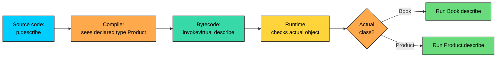
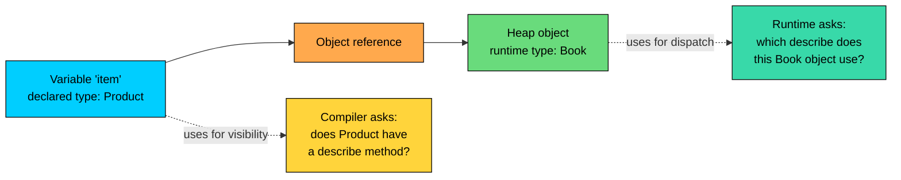
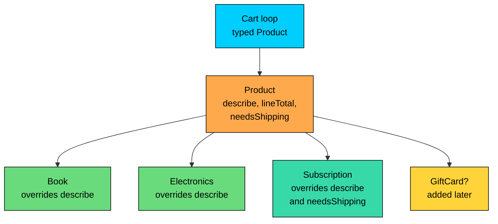

import React from 'react';
import CodeBlock from '../../../../components/ui/CodeBlock';
import Callout from '../../../../components/ui/Callout';

<div className="article-header">
  <div className="breadcrumb">
    <a href="/">Curated Notes</a>
    <span className="breadcrumb-separator">›</span>
    <span className="breadcrumb-current">Polymorphism Basics</span>
  </div>
  <h1>Polymorphism Basics</h1>
  <p style={{ color: 'var(--text-muted)', fontSize: '1.1rem', marginBottom: '16px', lineHeight: '1.6' }}>
    Master the essentials of Polymorphism Basics in this curated guide.
  </p>
  <div className="meta-info">
    <span className="meta-item">
      <svg width="14" height="14" viewBox="0 0 24 24" fill="none" stroke="currentColor" strokeWidth="2"><circle cx="12" cy="12" r="10"/><polyline points="12 6 12 12 16 14"/></svg>
      10 min read
    </span>
    <span className="difficulty-badge difficulty-badge--intermediate">Intermediate</span>
  </div>
</div>

<section className="content-section">

The last section taught how a subclass can replace its parent's methods using overriding. This lesson names the bigger idea that overriding belongs to. Polymorphism is what lets one line of code call `item.describe()` and get different behavior depending on what `item` actually is, without an `if-else` ladder in sight. We'll look at what polymorphism means, why it matters in real code, the two flavors Java offers, and the one distinction (declared type vs runtime type) that the rest of this section will lean on heavily.

---

## What Polymorphism Means

Polymorphism is a Greek word meaning "many forms": _poly_ for many, _morph_ for form. In Java, it shows up as one method name (or one variable) standing for many different behaviors, picked depending on the actual object you're working with.

The simplest way to feel it is to look at code that already uses it without naming it.


```java
public class OneNameManyForms {
    public static void main(String[] args) {
        Product mouse = new Product("Wireless Mouse", 29.99);
        Product book = new Book("Effective Java", 45.00, "Joshua Bloch");

        System.out.println(mouse.describe());
        System.out.println(book.describe());
    }
}

class Product {
    String name;
    double price;

    Product(String name, double price) {
        this.name = name;
        this.price = price;
    }

    public String describe() {
        return name + " at $" + price;
    }
}

class Book extends Product {
    String author;

    Book(String name, double price, String author) {
        super(name, price);
        this.author = author;
    }

    @Override
    public String describe() {
        return name + " by " + author + " at $" + price;
    }
}
```


Both variables are typed `Product`, both calls look identical, and yet two different methods run. That's polymorphism in the smallest possible package. One name (`describe`), many forms (the parent's version and the child's version), picked by Java based on what the object actually is.

Polymorphism isn't only about methods. A variable typed `Product` can hold a `Product`, a `Book`, an `Electronics`, or a `Subscription`. The variable wears one type, the object inside it wears another. The variable is polymorphic in the sense that the same slot can hold many different shapes, as long as they all fit the declared contract.

---

## Why Polymorphism Matters

Without polymorphism, code that needs to handle several related types ends up doing one of two ugly things: copying logic per type, or branching by type with `if-else` or `switch`. Both rot fast.

Consider a checkout method that needs to print a one-line summary for every item in a cart. Carts can contain books, electronics, and subscription products. Without polymorphism, you'd write something like this.


```java
public class CheckoutWithoutPolymorphism {
    public static void main(String[] args) {
        Object[] cart = {
            new Book("Effective Java", 45.00, "Joshua Bloch"),
            new Electronics("Wireless Mouse", 29.99, 24),
            new Subscription("AlgoMaster Pro", 9.99, 30)
        };

        for (Object item : cart) {
            if (item instanceof Book) {
                Book b = (Book) item;
                System.out.println("Book: " + b.title + " by " + b.author);
            } else if (item instanceof Electronics) {
                Electronics e = (Electronics) item;
                System.out.println("Electronics: " + e.name + " (" + e.warrantyMonths + " mo warranty)");
            } else if (item instanceof Subscription) {
                Subscription s = (Subscription) item;
                System.out.println("Subscription: " + s.plan + " for " + s.days + " days");
            }
        }
    }
}

class Book {
    String title;
    String author;
    double price;
    Book(String title, double price, String author) {
        this.title = title; this.price = price; this.author = author;
    }
}

class Electronics {
    String name;
    double price;
    int warrantyMonths;
    Electronics(String name, double price, int warrantyMonths) {
        this.name = name; this.price = price; this.warrantyMonths = warrantyMonths;
    }
}

class Subscription {
    String plan;
    double price;
    int days;
    Subscription(String plan, double price, int days) {
        this.plan = plan; this.price = price; this.days = days;
    }
}
```


That works, but every new product type forces a new branch in `CheckoutWithoutPolymorphism`. The checkout code knows about every concrete type. Tomorrow the team adds gift cards, and three different methods need new branches. The `if-else` ladder grows forever, and a missed branch is a runtime bug.

Polymorphism kills the ladder. Give the types a shared parent that declares `describe()`. Let each subclass say how it describes itself. The checkout code stops caring what kind of item it has.


```java
public class CheckoutWithPolymorphism {
    public static void main(String[] args) {
        Product[] cart = {
            new Book("Effective Java", 45.00, "Joshua Bloch"),
            new Electronics("Wireless Mouse", 29.99, 24),
            new Subscription("AlgoMaster Pro", 9.99, 30)
        };

        for (Product item : cart) {
            System.out.println(item.describe());
        }
    }
}

class Product {
    String name;
    double price;

    Product(String name, double price) {
        this.name = name;
        this.price = price;
    }

    public String describe() {
        return name + " at $" + price;
    }
}

class Book extends Product {
    String author;
    Book(String name, double price, String author) {
        super(name, price);
        this.author = author;
    }

    @Override
    public String describe() {
        return "Book: " + name + " by " + author;
    }
}

class Electronics extends Product {
    int warrantyMonths;
    Electronics(String name, double price, int warrantyMonths) {
        super(name, price);
        this.warrantyMonths = warrantyMonths;
    }

    @Override
    public String describe() {
        return "Electronics: " + name + " (" + warrantyMonths + " mo warranty)";
    }
}

class Subscription extends Product {
    int days;
    Subscription(String name, double price, int days) {
        super(name, price);
        this.days = days;
    }

    @Override
    public String describe() {
        return "Subscription: " + name + " for " + days + " days";
    }
}
```


Same output, one loop, zero `instanceof` checks, zero casts. Add a `GiftCard` next week and `CheckoutWithPolymorphism` doesn't change at all. You write `GiftCard extends Product`, override `describe()`, drop one in the cart, and the checkout code keeps working.

This is the open/closed principle in action: the checkout code is _open_ for extension (you can add new product types) but _closed_ for modification (you don't touch the checkout to add them). Polymorphism is the language feature that makes the principle achievable without ceremony.

Three concrete benefits fall out of this:

- **Extensibility.** New types plug into existing code without changing the existing code.
- **Decoupling.** Callers depend on the parent's contract, not on every concrete subclass.
- **Less branching.** Type-dispatch lives in one place (the override table) instead of being smeared across the codebase.

---

## The Two Flavors at a Glance

Java has two kinds of polymorphism, and they're easy to mix up because they share a name.

**Compile-time polymorphism** is decided when the code compiles. The compiler looks at the static types of the arguments at the call site and picks one of several method signatures. The mechanism is method overloading.

**Runtime polymorphism** is decided when the code runs. The compiler sees a call against a parent type and emits code that, at runtime, looks at the actual object to choose which override runs. The mechanism is method overriding.

The side-by-side comparison:


| Aspect | Compile-time polymorphism | Runtime polymorphism |
| --- | --- | --- |
| Also called | Static binding, early binding | Dynamic binding, late binding |
| Mechanism | Method overloading | Method overriding |
| What varies | Number, type, or order of parameters | Actual object's class at runtime |
| Picked by | Compiler, using static types of arguments | JVM, using the object's runtime type |
| When picked | Compile time | Runtime |
| Needs inheritance? | No | Yes (or interface implementation) |


A tiny example of each, side by side.


```java
public class TwoFlavors {
    public static void main(String[] args) {
        // Compile-time: overload picked by argument types.
        Cart c = new Cart();
        c.add("Wireless Mouse");
        c.add("Wireless Mouse", 2);

        // Runtime: override picked by actual object type.
        Product p = new Book("Effective Java", 45.00, "Joshua Bloch");
        System.out.println(p.describe());
    }
}

class Cart {
    public void add(String name) {
        System.out.println("Added 1 of " + name);
    }

    public void add(String name, int quantity) {
        System.out.println("Added " + quantity + " of " + name);
    }
}

class Product {
    String name;
    double price;
    Product(String name, double price) {
        this.name = name; this.price = price;
    }

    public String describe() {
        return name + " at $" + price;
    }
}

class Book extends Product {
    String author;
    Book(String name, double price, String author) {
        super(name, price);
        this.author = author;
    }

    @Override
    public String describe() {
        return name + " by " + author + " at $" + price;
    }
}
```


Both `c.add(...)` calls look the same at the source level, but the compiler picks two different methods based on the argument types. That's compile-time polymorphism. The `p.describe()` call looks like a plain method call against a `Product`, but at runtime Java sees the object is actually a `Book` and runs `Book.describe()`. That's runtime polymorphism.





The diagram shows the split. The compiler picks a signature ("a method called `describe` taking no arguments on a `Product`"). The runtime picks an implementation (which class's `describe` actually executes). Two stages, two different decisions, both contributing to "polymorphism" as a whole.

This lesson is the map. The next two lessons are the deep dives.

---

## Declared Type vs Runtime Type

Everything in this section hinges on one distinction. A variable has a _declared type_ (the type written next to its name in the source code) and an object has a _runtime type_ (the actual class of the object on the heap). The two are not always the same.


```java
public class TwoTypes {
    public static void main(String[] args) {
        Product item = new Book("Effective Java", 45.00, "Joshua Bloch");

        System.out.println("Declared type of 'item': Product");
        System.out.println("Runtime type of the object: " + item.getClass().getSimpleName());
        System.out.println(item.describe());
    }
}

class Product {
    String name;
    double price;
    Product(String name, double price) {
        this.name = name; this.price = price;
    }

    public String describe() {
        return name + " at $" + price;
    }
}

class Book extends Product {
    String author;
    Book(String name, double price, String author) {
        super(name, price);
        this.author = author;
    }

    @Override
    public String describe() {
        return name + " by " + author + " at $" + price;
    }
}
```


The variable `item` is declared `Product`. The object it points to is a `Book`. Java tracks both pieces of information and uses each one for a different job.





The rule that falls out of the picture:

- The **declared type** decides what's _visible_ to the compiler. Which methods you can call, which fields you can name, which casts are legal.
- The **runtime type** decides what _runs_ for instance methods. Which override actually executes when you call a method.

Two consequences are worth pinning down.

First, you can't call a child-only method through a parent-typed variable. The compiler only sees what the declared type offers.


```java
public class VisibilityRule {
    public static void main(String[] args) {
        Product p = new Book("Effective Java", 45.00, "Joshua Bloch");
        // System.out.println(p.author); // does NOT compile
    }
}

class Product {
    String name;
    double price;
    Product(String name, double price) {
        this.name = name; this.price = price;
    }
}

class Book extends Product {
    String author;
    Book(String name, double price, String author) {
        super(name, price);
        this.author = author;
    }
}
```


`author` exists on the heap (the runtime object is a `Book`), but the compiler doesn't know that. It only sees the declared type `Product`, which has no `author` field, so it refuses to compile the access. The fix is either to declare the variable as `Book` directly or to cast at the point of access: `((Book) p).author`.

Second, the override that runs is the one defined on the runtime type, not the declared type. We saw this in the first example, and it's worth restating: even though the compiler resolved the call against `Product.describe`, the runtime ran `Book.describe`.

Looking up the right override at runtime is a single indirection through the object's method table. In hot code paths the JIT often inlines virtual calls when it can prove the type is fixed, so the cost effectively disappears.

This split (declared type for visibility, runtime type for dispatch) is _the_ idea you carry forward from this lesson. Every other piece of polymorphism in Java is some restatement of it.

---

## Polymorphism Through Inheritance and Interfaces

Everything so far has used a parent class with subclasses. Java offers a second route to the same idea: declare a contract as an interface, and let unrelated classes implement it. Code that depends only on the interface gets the same "many forms behind one name" behavior, without needing a shared base class.

A short taste, just to put it on your radar.


```java
public class InterfaceTaste {
    public static void main(String[] args) {
        Describable[] things = {
            new Book("Effective Java", "Joshua Bloch"),
            new Customer("Ashish", "ashishps@algomaster.io")
        };

        for (Describable d : things) {
            System.out.println(d.describe());
        }
    }
}

interface Describable {
    String describe();
}

class Book implements Describable {
    String title;
    String author;
    Book(String title, String author) {
        this.title = title; this.author = author;
    }

    @Override
    public String describe() {
        return "Book: " + title + " by " + author;
    }
}

class Customer implements Describable {
    String name;
    String email;
    Customer(String name, String email) {
        this.name = name; this.email = email;
    }

    @Override
    public String describe() {
        return "Customer: " + name + " (" + email + ")";
    }
}
```


`Book` and `Customer` have nothing in common as classes. One is a product, one is a person. But both promise to implement `Describable`, so a `Describable[]` can hold either and the loop dispatches polymorphically. The runtime checks the actual object, finds its `describe`, runs it.

This is a common kind of polymorphism in Java code, because it doesn't force you to invent a single parent class for things that aren't really related. For this section, everything we say about overriding and runtime dispatch applies whether the "parent" is a class or an interface.

---

## A Worked Example: Mixed Cart, One Loop

A real e-commerce cart never contains only books or only electronics. It contains a mix. The whole point of polymorphism is that one loop can walk that mix and ask each item to describe itself, compute its own total, and decide whether it needs shipping, without the loop knowing the concrete types.


```java
public class MixedCart {
    public static void main(String[] args) {
        java.util.List<Product> cart = new java.util.ArrayList<>();
        cart.add(new Book("Effective Java", 45.00, "Joshua Bloch"));
        cart.add(new Electronics("Wireless Mouse", 29.99, 24));
        cart.add(new Subscription("AlgoMaster Pro", 9.99, 30));
        cart.add(new Book("Designing Data-Intensive Apps", 55.00, "Martin Kleppmann"));

        double total = 0.0;
        int shippableCount = 0;

        for (Product item : cart) {
            System.out.println(item.describe());
            total += item.lineTotal();
            if (item.needsShipping()) {
                shippableCount++;
            }
        }

        System.out.println("---");
        System.out.println("Cart total: $" + total);
        System.out.println("Items needing shipping: " + shippableCount);
    }
}

class Product {
    String name;
    double price;

    Product(String name, double price) {
        this.name = name;
        this.price = price;
    }

    public String describe() {
        return name + " at $" + price;
    }

    public double lineTotal() {
        return price;
    }

    public boolean needsShipping() {
        return true;
    }
}

class Book extends Product {
    String author;

    Book(String name, double price, String author) {
        super(name, price);
        this.author = author;
    }

    @Override
    public String describe() {
        return "Book: " + name + " by " + author;
    }
}

class Electronics extends Product {
    int warrantyMonths;

    Electronics(String name, double price, int warrantyMonths) {
        super(name, price);
        this.warrantyMonths = warrantyMonths;
    }

    @Override
    public String describe() {
        return "Electronics: " + name + " (" + warrantyMonths + " mo warranty)";
    }
}

class Subscription extends Product {
    int days;

    Subscription(String name, double price, int days) {
        super(name, price);
        this.days = days;
    }

    @Override
    public String describe() {
        return "Subscription: " + name + " for " + days + " days";
    }

    @Override
    public boolean needsShipping() {
        return false;
    }
}
```


Three things stand out in this example.

The loop variable is typed `Product`. The compiler only sees `Product`'s methods, which is exactly the right level of knowledge for checkout code. Each call (`describe()`, `lineTotal()`, `needsShipping()`) dispatches to the actual object's override, or falls back to `Product`'s default if the subclass didn't override.

`Subscription` overrides only `describe()` and `needsShipping()`. It uses the inherited `lineTotal()` from `Product`. Subclasses pick which methods to specialize, the rest are inherited unchanged. That's the practical value of having a base class: shared default behavior plus selective specialization.

Adding `GiftCard` is one new class. The loop doesn't change. `MixedCart`'s `main` doesn't change. Even the `Product` base class doesn't change. That's the open/closed principle showing up in concrete code instead of a slide deck.

The relationship between the participants looks like this.





The arrow from `Cart` only ever touches `Product`. Every subclass plugs in below, and the loop never has to learn their names.

---

## What Polymorphism Is Not

A few patterns look like polymorphism but aren't.

**Overriding fields is not polymorphic.** Fields don't participate in dynamic dispatch. If a subclass declares a field with the same name as a parent field, the subclass field _hides_ the parent's field rather than overriding it. Which field you see depends on the declared type of the variable.


```java
public class FieldHiding {
    public static void main(String[] args) {
        Product p = new Book();
        Book b = new Book();

        System.out.println("via Product reference: " + p.category);
        System.out.println("via Book reference: " + b.category);
    }
}

class Product {
    String category = "general";
}

class Book extends Product {
    String category = "books";
}
```


Same object on the heap, two different reads, because field access uses the declared type. Methods are dispatched dynamically; fields are not. The fix in real code is to never duplicate a field name in a subclass. If a subclass needs different data, give it a different name, or expose the value through an overridable method.

**`static` methods are not polymorphic.** They belong to the class, not to any instance. A subclass `static` method with the same signature as a parent's `static` method _hides_ the parent's method, but doesn't override it. If you call a `static` method through a variable, Java picks the version based on the declared type, not the runtime type. If you want polymorphism, use instance methods.

**Overloading is technically polymorphism, but compile-time.** In casual conversation, "polymorphism" usually means runtime polymorphism (method overriding). Method overloading is also a form of polymorphism, just resolved earlier. Both are real and useful, but they don't interact at runtime. If you change the method's parameter list in a subclass, you've created an overload that lives in the subclass, not an override. The parent's version is still there, still gets called for the parent signature, and `@Override` would catch the mistake.

**`private` methods aren't polymorphic.** A `private` method isn't visible to subclasses, so a subclass can't override it. If a subclass declares a method with the same name and signature, it's a brand-new method with no relationship to the parent's. Calls from inside the parent's own methods still run the parent's `private` version. This isn't a polymorphism feature, it's a visibility one.

**Casting isn't polymorphism.** Casting a `Product` to a `Book` doesn't create polymorphism, it just tells the compiler "trust me, this object is actually a `Book`." The polymorphism already happened the moment you stored the `Book` in a `Product` variable. Casts let you access subclass-specific members; they don't change what runs when you call an overridden method.

The shape of "what counts as polymorphism" in Java fits in one table.


| Feature | Polymorphic? | Picked by |
| --- | --- | --- |
| Instance method override | Yes (runtime) | Actual object's class |
| Method overload | Yes (compile-time) | Static types of arguments |
| Interface method implementation | Yes (runtime) | Actual object's class |
| Field with same name in subclass | No (hidden, not overridden) | Declared type of variable |
| `static` method with same signature | No (hidden, not overridden) | Declared type of variable/class |
| `private` method with same name | No (not inherited) | The class where the call lives |


</section>
