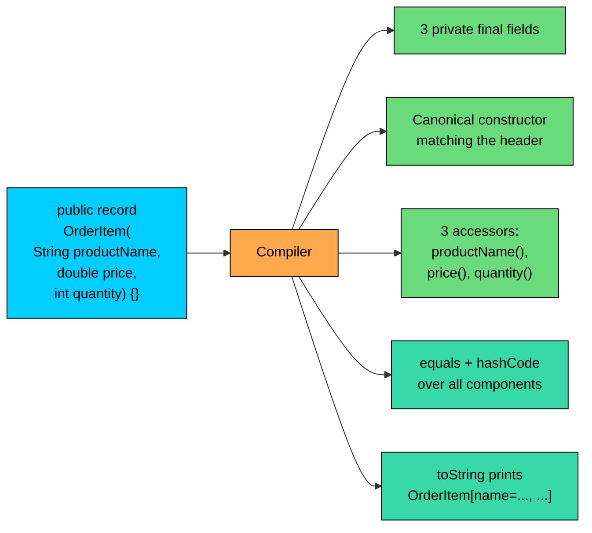
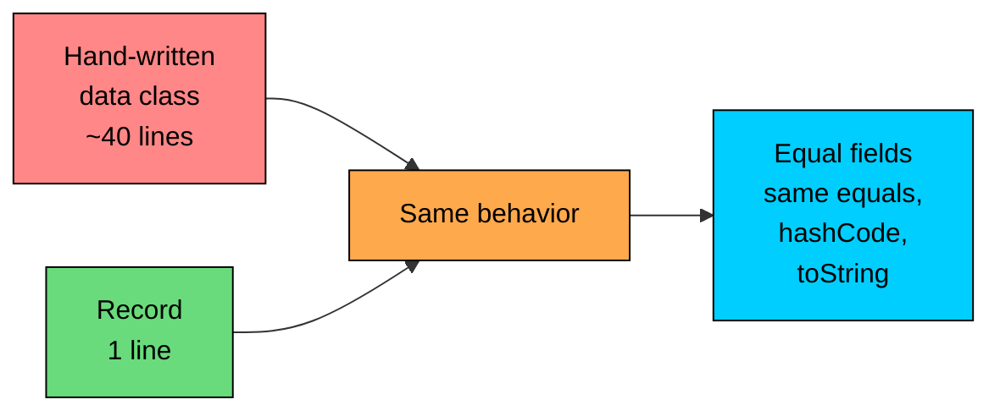

import React from 'react';
import CodeBlock from '../../../../components/ui/CodeBlock';
import Callout from '../../../../components/ui/Callout';

<div className="article-header">
  <div className="breadcrumb">
    <a href="/">Curated Notes</a>
    <span className="breadcrumb-separator">›</span>
    <span className="breadcrumb-current">Record Classes</span>
  </div>
  <h1>Record Classes</h1>
  <p style={{ color: 'var(--text-muted)', fontSize: '1.1rem', marginBottom: '16px', lineHeight: '1.6' }}>
    Master the essentials of Record Classes in this curated guide.
  </p>
  <div className="meta-info">
    <span className="meta-item">
      <svg width="14" height="14" viewBox="0 0 24 24" fill="none" stroke="currentColor" strokeWidth="2"><circle cx="12" cy="12" r="10"/><polyline points="12 6 12 12 16 14"/></svg>
      10 min read
    </span>
    <span className="difficulty-badge difficulty-badge--intermediate">Intermediate</span>
  </div>
</div>

<section className="content-section">

In Java, simple data carriers like an `OrderItem` or a shipping `Address` end up filling whole files with private fields, a constructor, getters, `equals`, `hashCode`, and `toString`. None of that code is interesting, but you still have to write it, read it during reviews, and keep it in sync whenever a field is added. Records, introduced in Java 16, give you all of that boilerplate from a single line of declaration. This lesson covers what a record is, what the compiler generates for you, how to add validation through compact constructors, and where records fit relative to regular classes.

---

## The Problem: Data Classes Are Mostly Boilerplate

A typical "data class" in an e-commerce app is something like an `OrderItem`: a product name, a price, and a quantity, bundled together. Written by hand, it looks like this.


```java
import java.util.Objects;

public final class OrderItem {
    private final String productName;
    private final double price;
    private final int quantity;

    public OrderItem(String productName, double price, int quantity) {
        this.productName = productName;
        this.price = price;
        this.quantity = quantity;
    }

    public String productName() {
        return productName;
    }

    public double price() {
        return price;
    }

    public int quantity() {
        return quantity;
    }

    @Override
    public boolean equals(Object o) {
        if (this == o) return true;
        if (!(o instanceof OrderItem)) return false;
        OrderItem other = (OrderItem) o;
        return Double.compare(price, other.price) == 0
            && quantity == other.quantity
            && Objects.equals(productName, other.productName);
    }

    @Override
    public int hashCode() {
        return Objects.hash(productName, price, quantity);
    }

    @Override
    public String toString() {
        return "OrderItem[productName=" + productName
            + ", price=" + price
            + ", quantity=" + quantity + "]";
    }
}
```


Forty lines of code, and the class doesn't actually *do* anything yet. Every field shows up four times: once as the field, once as a constructor parameter, once as an accessor, and once in each of `equals`, `hashCode`, and `toString`. Add a fourth field like `sku` and you touch six places. Forget one and the bugs are subtle: two `OrderItem` values that should be equal aren't, or a `HashSet` lookup misses because `hashCode` doesn't include the new field.

Records collapse the whole thing into one line.


```java
public record OrderItem(String productName, double price, int quantity) {}
```


That single declaration gives you everything the long version had. Same final fields, same accessors, same `equals`, `hashCode`, and `toString`. We'll spend the rest of the lesson unpacking what's hiding inside that one line.

---

## Anatomy of a Record

The smallest possible record, with the parts labeled:


```java
public record OrderItem(String productName, double price, int quantity) {}
```


| Part | Value | Meaning |
| --- | --- | --- |
| Keyword | `record` | Tells the compiler this is a record, not a class |
| Name | `OrderItem` | The type name, same as any class |
| Header (components) | `(String productName, double price, int quantity)` | The data the record holds |
| Body | `{}` | Extra members (often empty) |


The list in parentheses is called the **header**, and each entry is a **record component**. Each component contributes one field, one accessor, and one constructor parameter to the generated class. The body, the part inside `{ }`, can stay empty for pure data carriers, or hold extra methods, static fields, and compact constructors.

The same record being used like any other type:


```java
public class RecordIntro {
    public record OrderItem(String productName, double price, int quantity) {}

    public static void main(String[] args) {
        OrderItem item = new OrderItem("Wireless Mouse", 29.99, 2);
        System.out.println(item.productName());
        System.out.println(item.price());
        System.out.println(item.quantity());
        System.out.println(item);
    }
}
```


A few details. The accessor is `productName()`, not `getProductName()`. The `toString` is the bracketed form `OrderItem[...]`, not the `OrderItem@1a2b3c` you'd get from a regular class. Both come from the compiler, not from anything you wrote.

---

## What the Compiler Generates

When you write `public record OrderItem(String productName, double price, int quantity) {}`, the compiler quietly produces something equivalent to the 40-line class above. The pieces matter because they show up in stack traces, debuggers, and IDE navigation.





Let's walk through each one.

**Private final fields.** For every component, the compiler adds a `private final` field with the same name and type. So `OrderItem` ends up with `private final String productName`, `private final double price`, and `private final int quantity`. Because the fields are `final`, they can only be assigned once, in the constructor. There are no setters, ever.

**Canonical constructor.** The compiler generates a constructor whose parameter list matches the header exactly. Calling `new OrderItem("Mouse", 29.99, 2)` assigns each argument to the matching field in order. This is called the **canonical constructor** because its signature mirrors the record's declaration. You can also write it explicitly when you need to.

**Accessor methods.** For each component, the compiler adds a public method with the same name as the component (no `get` prefix) that returns the field's value. So `productName()` returns the `productName` field, `price()` returns `price`, and so on. This is one of the biggest visible differences from classic JavaBeans-style data classes, which use `getProductName()`. The record convention is shorter and matches modern Java patterns like pattern matching for `instanceof`.

**`equals`.** Two records are equal if they are the same class and every component is equal. For primitive components, that means `==`. For reference components, it means `Objects.equals(a, b)`, which handles nulls. Two `OrderItem` values with the same name, price, and quantity will be `equal` even though they're different objects in memory.

**`hashCode`.** The hash is built from every component, consistent with `equals`. If two records are `equal`, they have the same `hashCode`. This is what makes records work correctly as keys in `HashMap` and as elements in `HashSet`.

**`toString`.** The generated `toString` follows the format `ClassName[component1=value1, component2=value2, ...]`. It uses each component's own `toString` for the values, so nested records print readably without any extra work.

A quick demonstration of `equals`, `hashCode`, and `toString` in action:


```java
import java.util.HashSet;
import java.util.Set;

public class RecordGeneratedMethods {
    public record OrderItem(String productName, double price, int quantity) {}

    public static void main(String[] args) {
        OrderItem a = new OrderItem("Wireless Mouse", 29.99, 2);
        OrderItem b = new OrderItem("Wireless Mouse", 29.99, 2);
        OrderItem c = new OrderItem("Wireless Mouse", 29.99, 3);

        System.out.println("a.equals(b): " + a.equals(b));
        System.out.println("a.equals(c): " + a.equals(c));
        System.out.println("a.hashCode() == b.hashCode(): " + (a.hashCode() == b.hashCode()));

        Set<OrderItem> seen = new HashSet<>();
        seen.add(a);
        System.out.println("seen contains b? " + seen.contains(b));
        System.out.println("toString: " + a);
    }
}
```


The `HashSet` recognizes `b` as already present even though `a` and `b` are different objects. That's `equals` and `hashCode` doing their job, with zero code written by hand.

---

## Records Are Implicitly Final

A record is implicitly `final`. You cannot extend it with another class, and you cannot mark it `abstract`. Likewise, a record cannot extend another class. Every record silently extends `java.lang.Record`, which is the common supertype the JVM uses to recognize records.


```java
public class RecordFinality {
    public record Coupon(String code, double percentOff) {}

    // The following lines would NOT compile if uncommented:
    // public class BigCoupon extends Coupon { } // error: cannot inherit from final Coupon
    // public record SuperCoupon(...) extends SomeClass { } // error: records cannot extend classes

    public static void main(String[] args) {
        Coupon c = new Coupon("WELCOME10", 10.0);
        System.out.println(c);
        System.out.println("Is a java.lang.Record? " + (c instanceof java.lang.Record));
    }
}
```


The reasoning is straightforward: records exist to be predictable data carriers. If a subclass could add hidden state or override `equals`, the guarantees that make records useful would evaporate. Two `Coupon` values that look identical from outside might be unequal because some subclass changed the meaning. By forbidding inheritance, the language keeps the contract simple: what you see in the header is everything the record holds.

This also explains the missing class-level extension. A record's behavior is fixed by its components, and there's no useful way to merge that with whatever a parent class might bring along.

---

## Records Can Implement Interfaces

What records *can* do is implement interfaces. That's enough for most uses, because the typical reason to want inheritance with a data class is to give it a shared behavior contract, and an interface covers exactly that.


```java
public class RecordImplementsInterface {
    public interface ShippingOption {
        double cost();
        int estimatedDays();
    }

    public record StandardShipping(double cost, int estimatedDays) implements ShippingOption {}

    public record ExpressShipping(double cost, int estimatedDays) implements ShippingOption {}

    public static void describe(ShippingOption option) {
        System.out.println("Cost: $" + option.cost() + ", arrives in " + option.estimatedDays() + " days");
    }

    public static void main(String[] args) {
        describe(new StandardShipping(4.99, 5));
        describe(new ExpressShipping(14.99, 2));
    }
}
```


The components `cost` and `estimatedDays` automatically satisfy the interface methods `cost()` and `estimatedDays()`. Because record accessors share the names of the components, the interface's abstract methods are implemented automatically as long as the names line up. If the interface had defined `getCost()` instead, you'd need an extra method in the record body to bridge the gap.

This pattern shows up a lot. The interface declares the shape of the operation, and several records implement it with their own combination of fields.

---

## Compact Constructors: Validation Without Repetition

The canonical constructor is fine when you trust the inputs, but in real code you usually want to validate or normalize values before they land in the fields. A `quantity` of `-3` or a `price` of `Double.NaN` shouldn't be allowed. You could write a full constructor and copy each assignment, but records offer something tidier: the **compact constructor**.

A compact constructor uses the record's name with no parameter list. Inside, you can read and reassign the component parameters (which already exist as local variables matching the header), and the compiler adds the field assignments for you when the body finishes.


```java
public class CompactConstructor {
    public record OrderItem(String productName, double price, int quantity) {
        public OrderItem {
            if (productName == null || productName.isBlank()) {
                throw new IllegalArgumentException("productName cannot be blank");
            }
            if (price < 0) {
                throw new IllegalArgumentException("price cannot be negative");
            }
            if (quantity < 1) {
                throw new IllegalArgumentException("quantity must be at least 1");
            }
        }
    }

    public static void main(String[] args) {
        OrderItem ok = new OrderItem("Wireless Mouse", 29.99, 2);
        System.out.println("Created: " + ok);

        try {
            new OrderItem("Wireless Mouse", 29.99, 0);
        } catch (IllegalArgumentException e) {
            System.out.println("Caught: " + e.getMessage());
        }
    }
}
```


The compact constructor is `public OrderItem { ... }`, with no `(...)` after the name. Inside the braces, `productName`, `price`, and `quantity` are the incoming parameters. Once the block finishes without throwing, the compiler assigns them to the matching fields. You never write `this.productName = productName`.

Compact constructors are also a good place for normalization. Trim a string, round a double, copy a mutable list. The reassignments stick because the compiler picks up the values from the local variables after your block runs.


```java
public class NormalizingCompact {
    public record Address(String street, String city, String zip) {
        public Address {
            street = street.trim();
            city = city.trim();
            zip = zip.trim();
        }
    }

    public static void main(String[] args) {
        Address a = new Address("  221B Baker St ", " London ", " NW1 6XE ");
        System.out.println(a);
    }
}
```


The compact constructor normalizes the input, and the fields end up trimmed.

Throwing from a compact constructor happens during `new`, before any reference to the record escapes. There's no half-built record to worry about, which is the same guarantee a normal class constructor gives. Validation here is as safe as it is convenient.

---

## Beyond the Header: Extra Members in the Body

The header captures the state of a record, but the body can hold more. The two most useful additions are extra methods and static helpers.

#### Adding Methods

Any method that derives a value from the components is a natural fit. Keep the record immutable, return a new value, and you get a clean way to express derived properties.


```java
public class RecordWithMethods {
    public record OrderItem(String productName, double price, int quantity) {
        public double subtotal() {
            return price * quantity;
        }

        public boolean isFreeItem() {
            return price == 0.0;
        }
    }

    public static void main(String[] args) {
        OrderItem item = new OrderItem("Wireless Mouse", 29.99, 3);
        System.out.println("Subtotal: $" + item.subtotal());
        System.out.println("Free? " + item.isFreeItem());

        OrderItem sample = new OrderItem("Free Sample", 0.0, 1);
        System.out.println("Free? " + sample.isFreeItem());
    }
}
```


`subtotal()` and `isFreeItem()` are regular instance methods. They read the components through the accessors (or directly by field name, both work inside the record) and return derived values. Nothing new state-wise; just convenience on top of the data the record already holds.

#### Static Factories and Static Fields

Records can hold `static` fields and `static` methods just like regular classes. A common pattern is a static factory for the most common shape of the record.


```java
public class RecordWithStatics {
    public record Coupon(String code, double percentOff) {
        public static final Coupon NO_DISCOUNT = new Coupon("NONE", 0.0);

        public static Coupon welcome() {
            return new Coupon("WELCOME10", 10.0);
        }

        public static Coupon flatPercent(double percentOff) {
            return new Coupon("FLAT" + (int) percentOff, percentOff);
        }
    }

    public static void main(String[] args) {
        System.out.println(Coupon.NO_DISCOUNT);
        System.out.println(Coupon.welcome());
        System.out.println(Coupon.flatPercent(25));
    }
}
```


A useful constraint: a record cannot declare its own *instance* fields outside the header. All instance state lives in the components. `static` fields, which belong to the class itself rather than to any specific record, are allowed because they don't break the contract that "the components are the data". This is what keeps records honest as data carriers.

---

## "Modifying" a Record: With-Style Helpers

Because records are immutable, there are no setters. To produce a record with one field changed, you build a new one and copy the other fields over. It feels a bit verbose at the call site, so a common pattern is to add a small "with" method inside the record body for the field you change most often.


```java
public class RecordWithHelper {
    public record OrderItem(String productName, double price, int quantity) {
        public OrderItem withQuantity(int newQuantity) {
            return new OrderItem(productName, price, newQuantity);
        }
    }

    public static void main(String[] args) {
        OrderItem original = new OrderItem("Wireless Mouse", 29.99, 1);
        OrderItem moreUnits = original.withQuantity(3);

        System.out.println("Original: " + original);
        System.out.println("Updated:  " + moreUnits);
    }
}
```


`original` is untouched because it can't be touched. `moreUnits` is a brand new `OrderItem` that happens to share the product name and price with the original. The `withQuantity` helper isn't anything the compiler generates for you, but it's a small, readable pattern that pays for itself when callers frequently tweak one field.

For deeper changes across many fields, consider a builder or simply pass everything into the canonical constructor.

Each call to `withQuantity` allocates a new `OrderItem`. For records used in tight inner loops, prefer to compute the final shape once rather than chaining a series of `with...` calls.

---

## Records as Map Keys and Set Elements

Because records get correct `equals` and `hashCode` from the compiler, they work as map keys and set elements without any extra effort. This is one of the bigger day-to-day wins.


```java
import java.util.HashMap;
import java.util.Map;

public class RecordsAsKeys {
    public record Address(String street, String city, String zip) {}

    public static void main(String[] args) {
        Map<Address, String> nameByAddress = new HashMap<>();
        nameByAddress.put(new Address("221B Baker St", "London", "NW1 6XE"), "Holmes");
        nameByAddress.put(new Address("742 Evergreen Terrace", "Springfield", "00000"), "Simpson");

        Address lookup = new Address("221B Baker St", "London", "NW1 6XE");
        System.out.println("Lookup result: " + nameByAddress.get(lookup));
    }
}
```


The lookup `Address` is a different object from the one used to insert, but `equals` says they're equal and `hashCode` matches, so `HashMap` finds the entry. With a hand-written class, you'd have to remember to override `equals` and `hashCode` correctly. Forget either one and the map silently misbehaves.

When a record is used as a map key, the map calls `hashCode` on every lookup. For records with many components or large strings, that hash is recomputed each time. If the same key is used heavily, the cost is usually fine; if not, consider whether a smaller key would serve.

---

## Common Mistakes

A few traps come up when first using records.

**What's wrong with this code?**


```java
public record OrderItem(String productName, double price, int quantity) {
    public void setQuantity(int newQuantity) {
        this.quantity = newQuantity;
    }
}
```


**Fix:**

Records are immutable. The component fields are `final` and there is no setter pattern. To produce an `OrderItem` with a different quantity, build a new one (or add a `withQuantity` helper that returns a fresh record).


```java
public record OrderItem(String productName, double price, int quantity) {
    public OrderItem withQuantity(int newQuantity) {
        return new OrderItem(productName, price, newQuantity);
    }
}
```


**What's wrong with this code?**


```java
public record DiscountedItem(String productName, double price, int quantity, double discount)
        extends OrderItem {
}
```


**Fix:**

Records cannot extend a class. They are implicitly `final` and silently extend `java.lang.Record`. If you want to share behavior, define an interface and have both records implement it.


```java
public interface PricedItem {
    double price();
    int quantity();
}

public record OrderItem(String productName, double price, int quantity) implements PricedItem {}
public record DiscountedItem(String productName, double price, int quantity, double discount) implements PricedItem {}
```


**What's wrong with this code?**


```java
public record Cart(String customerName) {
    private int itemCount; // extra instance field, not declared in the header
}
```


**Fix:**

A record's instance state must be exactly the components in the header. The compiler rejects extra instance fields. If you actually need that state, make it a regular class. If it's a derived value, compute it from the components instead.


```java
public record Cart(String customerName, int itemCount) {}
```


**What's wrong with this code?**


```java
public record OrderItem(String productName, double price, int quantity) {
    public OrderItem(String productName, double price, int quantity) {
        // missing field assignments
    }
}
```


**Fix:**

The explicit canonical constructor must assign every field. If you don't want to write the assignments, use a compact constructor instead. Compact constructors look like `public OrderItem { ... }` with no parameter list, and the compiler adds the assignments for you.


```java
public record OrderItem(String productName, double price, int quantity) {
    public OrderItem {
        if (quantity < 1) throw new IllegalArgumentException("quantity must be at least 1");
    }
}
```


---

## Records vs Regular Classes: When to Pick Which

Records suit types that are transparent, immutable carriers of values. They don't suit types with identity beyond their fields, types whose state should change over time, or types that need to participate in a class hierarchy.


| Need | Records | Regular Class |
| --- | --- | --- |
| Immutable data carrier (DTO, query result, key) | Best fit | Works but verbose |
| Mutable state (counters, caches, accumulators) | Not possible | Use a class |
| Inheritance from another class | Not possible | Use a class |
| Implements an interface | Supported | Supported |
| Hidden state, lazy initialization | Not possible | Use a class |
| Use as a `HashMap` key | Free `equals`, `hashCode` | Must override both |
| Validation on construction | Compact constructor | Manual in constructor |


A useful rule of thumb: if you'd be tempted to mark every field `final` and override `equals` and `hashCode` based on every field, you want a record. If not, a class is the better fit.

A side-by-side comparison of the same concept written both ways:





The line count isn't the only win. The bigger win is that a record's contract is locked: every reader sees the components and knows exactly what the type holds. A hand-written class can drift, adding fields that aren't in `equals` or accessors that hide more than they expose. Records keep everyone honest.

---

## A Larger Example: A Cart of Records

To pull the pieces together, a small e-commerce scenario built entirely from records. The cart calculates a subtotal, applies a coupon, and prints a summary, with each domain concept as its own immutable record.


```java
import java.util.List;

public class CartExample {
    public record OrderItem(String productName, double price, int quantity) {
        public OrderItem {
            if (price < 0) throw new IllegalArgumentException("price cannot be negative");
            if (quantity < 1) throw new IllegalArgumentException("quantity must be at least 1");
        }

        public double subtotal() {
            return price * quantity;
        }
    }

    public record Coupon(String code, double percentOff) {
        public static final Coupon NONE = new Coupon("NONE", 0.0);

        public double applyTo(double amount) {
            return amount * (1 - percentOff / 100);
        }
    }

    public record PriceQuote(double subtotal, double discount, double total) {}

    public static PriceQuote quote(List<OrderItem> items, Coupon coupon) {
        double subtotal = 0;
        for (OrderItem item : items) {
            subtotal += item.subtotal();
        }
        double total = coupon.applyTo(subtotal);
        double discount = subtotal - total;
        return new PriceQuote(subtotal, discount, total);
    }

    public static void main(String[] args) {
        List<OrderItem> cart = List.of(
            new OrderItem("Wireless Mouse", 29.99, 2),
            new OrderItem("USB Cable", 9.99, 3),
            new OrderItem("Headphones", 49.99, 1)
        );

        PriceQuote quote = quote(cart, new Coupon("WELCOME10", 10.0));
        System.out.println(quote);
        System.out.println("You saved: $" + quote.discount());
    }
}
```


A few details about this example. `OrderItem` carries validation in a compact constructor and exposes a derived `subtotal()`. `Coupon` exposes an `applyTo` method and a static `NONE` constant. `PriceQuote` is a pure data carrier with no extra behavior at all. Three records, three different shapes, and not a single setter, getter, `equals`, or `hashCode` written by hand.

Compare this to the same example written with traditional classes and the difference is striking. The records version reads top-to-bottom like a description of the domain. The class version would devote most of its space to plumbing.

</section>
