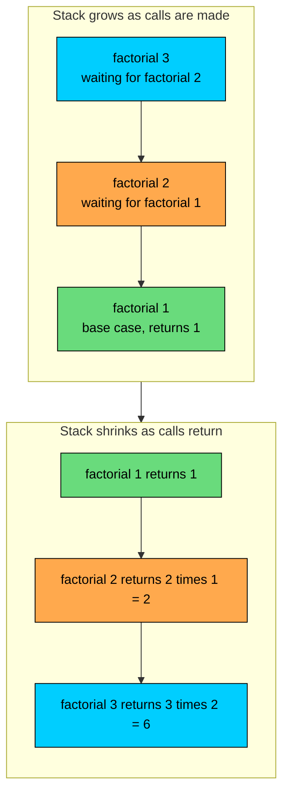
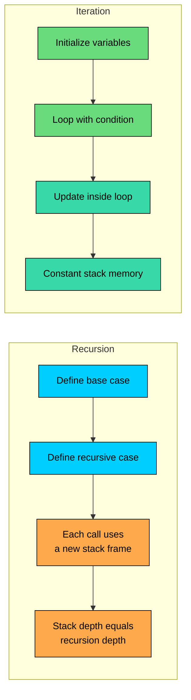

import React from 'react';
import CodeBlock from '../../../../components/ui/CodeBlock';
import Callout from '../../../../components/ui/Callout';

<div className="article-header">
  <div className="breadcrumb">
    <a href="/">Curated Notes</a>
    <span className="breadcrumb-separator">›</span>
    <span className="breadcrumb-current">Recursion</span>
  </div>
  <h1>Recursion</h1>
  <p style={{ color: 'var(--text-muted)', fontSize: '1.1rem', marginBottom: '16px', lineHeight: '1.6' }}>
    Master the essentials of Recursion in this curated guide.
  </p>
  <div className="meta-info">
    <span className="meta-item">
      <svg width="14" height="14" viewBox="0 0 24 24" fill="none" stroke="currentColor" strokeWidth="2"><circle cx="12" cy="12" r="10"/><polyline points="12 6 12 12 16 14"/></svg>
      10 min read
    </span>
    <span className="difficulty-badge difficulty-badge--intermediate">Intermediate</span>
  </div>
</div>

<section className="content-section">

Some problems are easier to describe in terms of themselves. The total price of a shopping cart is the price of the first item plus the total of the rest. A bundle's price is the sum of its products plus the prices of any sub-bundles inside it. When the shape of the problem repeats at a smaller size, the most direct way to write the solution often repeats too. A method that calls itself is called a recursive method, and recursion is the name we give that style of solving problems.

This lesson covers what recursion is, the two parts every recursive method needs, how the call stack tracks all those calls, and when recursion fits versus when a loop would do better.

---

## What Recursion Is

A recursive method is a method that calls itself. That's the whole definition. Java doesn't have special syntax for recursion. Any method can call any other method, including itself, and the compiler doesn't treat the call any differently.

The smallest recursive method that does something useful: It counts down from a number to zero.


```java
public class CountDown {
    public static void countDown(int n) {
        if (n < 0) {
            return;
        }
        System.out.println(n);
        countDown(n - 1);
    }

    public static void main(String[] args) {
        countDown(3);
    }
}
```


The method prints `n`, then calls itself with `n - 1`. Each call prints one number and triggers the next call with a smaller argument. When `n` reaches `-1`, the `if` check sends control back through the `return` and the chain stops.

Two things make this work. The method gets smaller input each time it calls itself, so it's moving toward a stopping point. And there's an explicit check that handles the stopping point without making another call. Take either of those away and the program either runs forever or never produces an answer.

---

## Base Case and Recursive Case

Every recursive method has the same shape. There's a check at the top that says "if the input is small enough, just return the answer directly". That's the base case. Everything else is a step that reduces the problem and then calls the method again on the smaller version. That's the recursive case.

A slightly more interesting example is `factorial`. The factorial of `n` is `n * (n-1) * (n-2) * ... * 1`. We need this kind of counting in an online store any time we want to know how many ways a small set of items can be arranged. Three items in a "bestseller bundle" can sit in `3! = 6` different orders on the product page. Five items can sit in `5! = 120` orders. Factorials grow fast.


```java
public class Factorial {
    public static int factorial(int n) {
        if (n <= 1) {
            return 1;
        }
        return n * factorial(n - 1);
    }

    public static void main(String[] args) {
        System.out.println("3! = " + factorial(3));
        System.out.println("5! = " + factorial(5));
        System.out.println("7! = " + factorial(7));
    }
}
```


The `if (n <= 1)` check is the base case. When `n` is `0` or `1`, the answer is just `1` and we return it directly. The line `return n * factorial(n - 1)` is the recursive case. It expresses the rule "factorial of `n` equals `n` times factorial of `n - 1`" almost word for word.

The base case is what makes the method finish. Without it, the recursive calls keep going and each one calls the next on a smaller and smaller number, then on negative numbers, and the chain has nothing to stop it. Recursion without a base case is the same kind of bug as a `while` loop with a condition that never becomes false.

Every recursive call uses a fresh stack frame, which costs both memory and time.

---

## What Happens Without a Base Case

If the base case is missing or wrong, the method calls itself forever. Java doesn't let that go on indefinitely. Each call consumes a chunk of stack memory, and once the stack is full the JVM throws a `StackOverflowError` and the program crashes.


```java
public class NoBaseCase {
    public static int countOrders(int n) {
        // Bug: no base case
        return 1 + countOrders(n - 1);
    }

    public static void main(String[] args) {
        System.out.println(countOrders(5));
    }
}
```


The stack trace prints the same line over and over because the method keeps calling itself from the same spot. That repeated pattern is a strong signal that you have runaway recursion.

A base case that the input never reaches has the same problem. If `factorial` checked `n == 0` but you called it with a negative number, `n` would decrease past zero and the method would never stop. Pick a base case that the recursive calls actually move toward.

---

## The Call Stack

To understand recursion deeply, you have to understand what Java is doing internally. Every time a method is called, the JVM creates a stack frame for that call. The frame holds the method's local variables, its parameters, and a return address that tells the JVM where to continue when the method finishes. Frames stack on top of each other like a pile of trays. The newest call sits on top. When a method returns, its frame is removed and control resumes in the frame below it.

For ordinary methods this is invisible. For recursive methods, the stack becomes the whole story. Each recursive call adds another frame, and the frames don't go away until the chain unwinds.

Walk through `factorial(3)` one step at a time. The first call is `factorial(3)`. Since `3 > 1`, it has to compute `3 * factorial(2)`. To get that, it pauses and calls `factorial(2)`. That pauses too and calls `factorial(1)`. Now `1 <= 1`, so `factorial(1)` returns `1` without making another call. Control returns to `factorial(2)`, which finishes its multiplication and returns `2 * 1 = 2`. Control returns to `factorial(3)`, which finishes and returns `3 * 2 = 6`.

The diagram below shows the stack frames in two phases. The top half shows the stack growing as each call is added. The bottom half shows it shrinking as each call returns.





The growing phase is where the work is set up. The shrinking phase is where the answers flow back. Each frame holds its own value of `n`. When `factorial(2)` is paused, its `n` is `2`, even though `factorial(1)` is running with `n = 1` on top of it. Local variables in a paused frame are protected from anything happening above it.

Two practical points fall out of this. First, recursion uses memory proportional to its depth. If you recurse a thousand times, a thousand frames sit on the stack at once. Second, the order of work runs forward through the calls and backward through the returns. The deepest call runs first to completion. Then each call above it finishes in turn.

---

## Summing Prices in a Cart

A cart total is a clean recursive problem. The sum of the first `n` prices is the first price plus the sum of the remaining `n - 1`. The base case is an empty range, which sums to zero.


```java
public class CartSum {
    public static double sumPrices(double[] prices, int index) {
        if (index == prices.length) {
            return 0.0;
        }
        return prices[index] + sumPrices(prices, index + 1);
    }

    public static void main(String[] args) {
        double[] prices = {29.99, 9.99, 14.50, 4.99};
        double total = sumPrices(prices, 0);
        System.out.println("Cart total: $" + total);
    }
}
```


The parameter `index` is the trick. It marks where we are in the array. Each recursive call moves one step to the right by passing `index + 1`. When `index` reaches `prices.length`, there's nothing left to add, so the method returns `0.0`.

This works, but for a flat list a `for` loop does the same job with less ceremony.


```java
public class CartSumLoop {
    public static void main(String[] args) {
        double[] prices = {29.99, 9.99, 14.50, 4.99};
        double total = 0.0;
        for (double price : prices) {
            total += price;
        }
        System.out.println("Cart total: $" + total);
    }
}
```


The loop is shorter, uses no extra stack memory, and reads in a straight line. For a flat array, recursion is overkill.

---

## Nested Bundles: Where Recursion Shines

A bundle in an online store can contain individual products, and it can also contain other bundles. A "Home Office" bundle might include a desk, a chair, and a smaller "Stationery" bundle that itself contains pens, a notebook, and a stapler. There's no fixed depth. A bundle can contain a bundle that contains a bundle, and so on.

Computing the total price of a bundle is a problem that's naturally recursive because the structure is naturally recursive. The price of a bundle is the sum of the prices of its contents, and each "content" is either a product (a flat price) or another bundle (whose price we compute the same way).


```java
public class BundlePricing {
    public static double priceOf(Object item) {
        if (item instanceof Double price) {
            return price;
        }
        if (item instanceof Object[] bundle) {
            double total = 0.0;
            for (Object content : bundle) {
                total += priceOf(content);
            }
            return total;
        }
        return 0.0;
    }

    public static void main(String[] args) {
        Object stationery = new Object[]{2.49, 5.99, 7.50};
        Object homeOffice = new Object[]{199.00, 89.50, stationery};
        Object megaBundle = new Object[]{homeOffice, 19.99};

        System.out.println("Stationery total:  $" + priceOf(stationery));
        System.out.println("Home Office total: $" + priceOf(homeOffice));
        System.out.println("Mega Bundle total: $" + priceOf(megaBundle));
    }
}
```


Two base cases, one recursive case. If the item is a `Double`, return it directly. If the item is an array of pieces, walk the array and recursively price each piece. The recursion descends naturally into nested bundles without us having to know the depth in advance.

Try writing this with loops alone. You'd need a stack or queue to track the bundles you haven't expanded yet, and you'd be reimplementing what the call stack already does. Recursion lets the language manage the bookkeeping for you.

Each recursive call adds a stack frame. For nested bundles that go a few levels deep, the cost is trivial. For a structure thousands of levels deep, you'd run out of stack space. Recursion is best when the depth is naturally bounded.

The same shape solves any tree-like structure. Category trees in a catalog (Electronics contains Audio contains Headphones), comments with replies that have replies of their own, file system directories that contain other directories. Anywhere the data is "a thing or a collection of things", recursion fits.

---

## Tracing a Recursive Call

When recursion is misbehaving, the fastest way to find the problem is to trace the calls by hand. Pretend you're the JVM. For each call, write down the value of every parameter and what the method returns.

A trace for `factorial(4)`:


```shell
factorial(4)
  calls factorial(3)
    calls factorial(2)
      calls factorial(1)
        n <= 1, returns 1
      returns 2 * 1 = 2
    returns 3 * 2 = 6
  returns 4 * 6 = 24
```


The indent shows the depth. Each level adds two spaces. Calls open downward, returns close upward. If a return is wrong, you can spot which level produced it because the values are right there in the trace.

For something a bit larger, `sumPrices` from the cart example, called with `prices = {10.0, 20.0, 30.0}` and `index = 0`:


```shell
sumPrices([10, 20, 30], 0)
  calls sumPrices([10, 20, 30], 1)
    calls sumPrices([10, 20, 30], 2)
      calls sumPrices([10, 20, 30], 3)
        index == length, returns 0.0
      returns 30.0 + 0.0 = 30.0
    returns 20.0 + 30.0 = 50.0
  returns 10.0 + 50.0 = 60.0
```


A trace this short can fit on paper. For deeper recursion, a few `System.out.println` calls at the top and bottom of the method do the same thing without the writing.

---

## Tail Recursion and Why Java Doesn't Optimize It

A tail-recursive method is one where the recursive call is the very last thing the method does. The call's return value is returned directly without any extra work after it.

Compare these two. The first is not tail-recursive. After the recursive call returns, the method still has to multiply by `n` before returning.


```java
public static int factorial(int n) {
    if (n <= 1) {
        return 1;
    }
    return n * factorial(n - 1); // multiplication happens after the call
}
```


The second version rewrites it to be tail-recursive by passing the running result as a parameter.


```java
public static int factorialTail(int n, int accumulator) {
    if (n <= 1) {
        return accumulator;
    }
    return factorialTail(n - 1, n * accumulator); // call is the last operation
}
```


Here the recursive call's return value is the method's return value with nothing else done to it. Some languages, like Scala, Kotlin, and Scheme, recognize this pattern and reuse the current stack frame for the recursive call. That makes the recursion run in constant stack space, just like a loop.

Java does not. The JVM's specification allows tail-call optimization, but the standard javac compiler and HotSpot runtime don't implement it. A tail-recursive Java method uses the same amount of stack space as a non-tail-recursive one. Calling `factorialTail(10000, 1)` will throw `StackOverflowError` for the same reason `factorial(10000)` would.

The practical takeaway: in Java, the shape of a recursive method doesn't affect its stack usage. If you need a method to handle deep input without crashing, convert it to a loop.

---

## Stack Overflow and How to Avoid It

Each stack frame takes up some bytes of memory. The exact size depends on the method's parameters and local variables, but a few dozen to a few hundred bytes per frame is typical. The total stack space available to a thread on a 64-bit JVM defaults to about 512 KB on macOS and Linux and 1 MB on Windows, though the exact number varies by version and platform. That gives you somewhere in the neighborhood of a few thousand to a few tens of thousands of frames before you run out.

For shallow recursion, that's plenty. A bundle nested fifteen levels deep won't come close to the limit. A binary tree traversal on a balanced tree of a million nodes has a depth of about twenty, also fine. Where you get into trouble is recursion whose depth grows linearly with the input size, like the `sumPrices` example above. Run that on an array of a million prices and it crashes.


```java
public class DeepSum {
    public static long sumTo(long n) {
        if (n == 0) {
            return 0;
        }
        return n + sumTo(n - 1);
    }

    public static void main(String[] args) {
        System.out.println(sumTo(100_000));
    }
}
```


A loop has no such limit. It uses one stack frame regardless of how many iterations it runs.


```java
public class DeepSumLoop {
    public static void main(String[] args) {
        long sum = 0;
        for (long i = 1; i <= 100_000; i++) {
            sum += i;
        }
        System.out.println(sum);
    }
}
```


When a recursive method's depth is unbounded or grows with input size, rewrite it as a loop. When the depth is naturally small and the structure is recursive (trees, nested bundles), keep the recursion. The rule of thumb is depth, not the number of operations. A recursion that runs a million times but only nests fifteen frames deep is fine. A recursion that nests a million frames deep is not.

A `StackOverflowError` doesn't always mean the recursion is wrong. Sometimes the algorithm is correct but the input is bigger than the stack can hold. Either bound the depth, switch to iteration, or, as a last resort, run the work on a thread with a larger stack via `new Thread(runnable, "name", largerStackSize)`.

---

## Recursion vs Iteration

The same problem can usually be solved both ways. The choice comes down to which version reads more clearly and whether the depth is bounded.





A table makes the trade-offs concrete.


| Aspect | Recursion | Iteration |
| ------ | --------- | --------- |
| Memory | One stack frame per call | One stack frame total |
| Speed | Slower due to call overhead | Faster, no call overhead |
| Readability | Better for tree-shaped problems | Better for sequential problems |
| Risk | `StackOverflowError` on deep input | Infinite loop if condition is wrong |
| State | Held in parameters and local variables | Held in mutable variables |
| Best for | Trees, nested structures, divide and conquer | Counters, sequential scans, fixed iteration |


The summary: pick recursion when the data is recursive. Pick iteration when the work is sequential. If both fit, pick whichever reads more clearly, and switch to iteration only if depth becomes a problem.

---

## When to Use Recursion

Recursion is well-suited when the problem fits one of these shapes:

- **Tree or graph traversal.** Walking a category tree, a comment thread, a directory structure, or an HTML document. The structure is recursive, so the code matches.
- **Nested data.** Bundles that contain bundles. JSON objects with nested objects. The depth is unknown and the same operation applies at every level.
- **Divide and conquer.** Splitting a problem into smaller versions of itself and combining the answers. Classic examples are binary search, merge sort, and quicksort, which we cover in the data structures and algorithms course.
- **Problems naturally defined recursively.** Factorial, Fibonacci, computing the number of ways to arrange items. The math itself uses self-reference, and the code follows.

Cases where recursion is overkill or actively wrong:

- **Sequential work over a flat collection.** Use a `for` loop.
- **Counting up to a fixed number.** Use a `for` loop.
- **Anything where the depth grows linearly with input size.** The risk of `StackOverflowError` isn't worth it.

A useful mental model is to ask: does the problem describe itself in terms of smaller versions of the same problem? If yes, recursion fits. If the answer is "no, it's a series of steps from start to finish", a loop fits.

---

## A Tree Traversal Example

To close out the recursion-fits-the-data idea, a small category tree. Categories are nested. Each category has a name and a list of subcategories. To print every category name in the tree, you can write the traversal in three lines.


```java
import java.util.List;

public class CategoryTree {
    record Category(String name, List<Category> subcategories) {}

    public static void printAll(Category category, int depth) {
        System.out.println("  ".repeat(depth) + category.name());
        for (Category sub : category.subcategories()) {
            printAll(sub, depth + 1);
        }
    }

    public static void main(String[] args) {
        Category headphones = new Category("Headphones", List.of());
        Category speakers = new Category("Speakers", List.of());
        Category audio = new Category("Audio", List.of(headphones, speakers));

        Category laptops = new Category("Laptops", List.of());
        Category computers = new Category("Computers", List.of(laptops));

        Category electronics = new Category("Electronics", List.of(audio, computers));

        printAll(electronics, 0);
    }
}
```


The base case isn't an explicit `if` here. When a category has an empty `subcategories` list, the `for` loop runs zero times and the method returns without making any more calls. The recursion handles arbitrary depth without us writing any depth-tracking logic. The `depth` parameter is just for indentation, not for the algorithm itself.

This is the pattern recursion fits. The data is a tree. The traversal is a tree walk. Each piece of code mirrors a piece of the structure.

</section>
