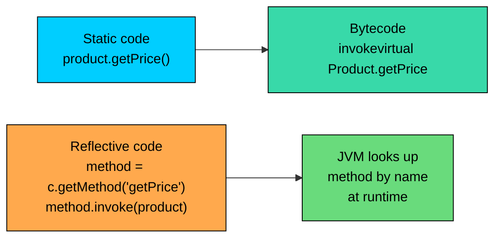
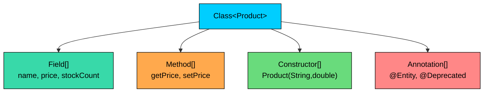
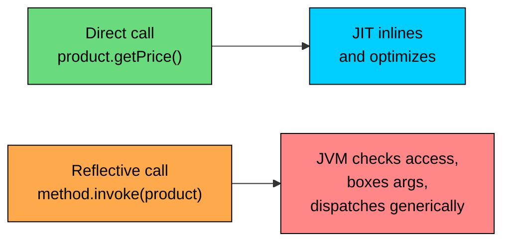
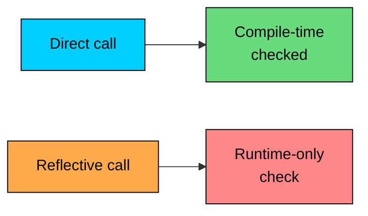

import React from 'react';
import CodeBlock from '../../../../components/ui/CodeBlock';
import Callout from '../../../../components/ui/Callout';

<div className="article-header">
  <div className="breadcrumb">
    <a href="/">Curated Notes</a>
    <span className="breadcrumb-separator">›</span>
    <span className="breadcrumb-current">Reflection Basics</span>
  </div>
  <h1>Reflection Basics</h1>
  <p style={{ color: 'var(--text-muted)', fontSize: '1.1rem', marginBottom: '16px', lineHeight: '1.6' }}>
    Master the essentials of Reflection Basics in this curated guide.
  </p>
  <div className="meta-info">
    <span className="meta-item">
      <svg width="14" height="14" viewBox="0 0 24 24" fill="none" stroke="currentColor" strokeWidth="2"><circle cx="12" cy="12" r="10"/><polyline points="12 6 12 12 16 14"/></svg>
      10 min read
    </span>
    <span className="difficulty-badge difficulty-badge--intermediate">Intermediate</span>
  </div>
</div>

<section className="content-section">

Reflection is the ability of a Java program to look at its own structure while it is running. Instead of treating a class as a fixed shape you wrote in source code, reflection lets you ask, at runtime, "what fields does this class have, what methods, what constructors, what annotations?" and then act on the answers. This lesson covers what reflection is, why it exists, when to use it, when to avoid it, and what it costs.

If you have ever used a serialization library, a dependency injection framework, or a debugger, you have used reflection indirectly. The library walked your classes, read their fields, and acted on what it saw. The rest of this section will explain how that mechanism works and how to build your own tooling on top of it. We start with the mental model.

---

## What Reflection Is

Reflection is the runtime ability of a program to inspect, and optionally modify, its own structure. By "structure" we mean classes, fields, methods, constructors, parameters, modifiers, and the annotations attached to any of those. By "runtime" we mean after the JVM has loaded the classes, while your program is executing, not at the time you wrote the code or compiled it.

Normal Java code is shape-aware at compile time. When you write `product.getPrice()`, the compiler knows the static type of `product`, looks up the `getPrice` method on that type, and produces a bytecode instruction that calls it directly. The link between the call site and the method is baked into the class file. The method name is a literal in the source.

Reflection moves that link from compile time to runtime. With reflection you can write code that says, "given some unknown object, find a method whose name is the string `getPrice` and call it." The method name is now data. The class is now data. The argument list is now data. The link between the call site and the target method is constructed at runtime out of strings and objects.





The diagram contrasts the two paths. The static path goes through the compiler, which resolves the method ahead of time. The reflective path defers the lookup to runtime, where the JVM searches the class for a method matching the name and parameter types you supplied as data. Both end up calling the same method, but the route is very different, and so are the costs and the safety guarantees.

A useful way to think about it: ordinary Java code treats the program as a fixed machine. Reflection treats the program as data that the running program itself can read. The official term for this is **introspection** when you only look, and **intercession** when you also modify. Java's reflection API supports both.

---

## Why Reflection Exists

The reason reflection is part of the platform is that some software cannot be written without it. Tools that handle arbitrary user code, generic code that must work for any class, and infrastructure that wires applications together at startup all need to read class structure dynamically. A few concrete examples make the motivation clear.

**Frameworks.** Spring, Quarkus, Micronaut, and similar containers scan your classpath at startup, find every class marked with `@Service`, `@Controller`, or `@Component`, and create instances of them. They cannot know your class names in advance, so they discover everything reflectively. Then they look at constructor parameters, work out which dependencies each service needs, and inject them.

**Serialization libraries.** Jackson, Gson, and Java's own serialization mechanism turn objects into JSON or bytes and back. They have to read every field of a `Product`, an `Order`, or a `Customer` without the library author ever having seen those classes. Reflection lets the library walk the fields generically.

**Object-relational mappers.** Hibernate, JPA implementations, and lightweight tools like JDBI map database rows to Java objects. They use reflection to read fields like `productId` or `customerEmail` and to set them after fetching the row.

**Test runners.** JUnit and TestNG load your test classes, find every method annotated with `@Test`, and call them one by one. They have no idea what your test methods are called.

**IDEs and debuggers.** When IntelliJ shows you all the fields of an object during a debugging session, it is asking the JVM, through reflection-like APIs, for the live structure of that object.

**Build tools and code generators.** Lombok, MapStruct, and similar tools either read your source or your bytecode and produce more code. Some of them rely on reflection on intermediate representations.

None of these tools could exist with only compile-time linking. They all need to treat user code as data they can examine.

Reflective calls are slower than direct calls because the JVM has to look up the target by name and check access on every call. Plan for it in hot paths, or cache the resolved `Method` object once and reuse it.

---

## The Mental Model: Program as Data

A useful way to think about reflection is the slogan "program as data." Source code is data when the compiler reads it, but it stops being data once it is compiled. The JVM has to hold on to enough metadata about each class to load it, link it, verify it, and execute it. Reflection exposes that metadata through a normal Java API. Instead of being something only the JVM uses internally, the metadata becomes something your code can read.

Every class loaded into the JVM has a corresponding `Class` object that describes it. The `Class` object has methods that return the fields, methods, constructors, annotations, superclass, interfaces, and modifiers of that class. Each of those returns yet more objects. `Field` describes a field. `Method` describes a method. `Constructor` describes a constructor. Each carries its own metadata and its own operations: a `Field` knows its name, type, modifiers, and annotations, and it knows how to read or write its value on an instance.





The diagram shows the entry point and the four families of metadata it gives you access to. A `Class<Product>` is the root. From there you can list the fields, the methods, the constructors, and the annotations. Each branch is itself a typed object you can inspect further.

The metadata is read-only as far as the class definition is concerned. Reflection cannot add a new method to `Product` or change `Product`'s superclass. It can only inspect what is there and, in the case of fields and methods, interact with their values on specific instances. The class itself is fixed; the data it produces and consumes is what reflection touches.

---

## A First Look at the Reflection API

The reflection API lives in two packages. The bulk of it is in `java.lang.reflect`. The entry point, `Class`, is in `java.lang` because the JVM needs it for ordinary class loading. Here is a one-line summary of the types you will spend the most time with.


| Type | Package | What it represents |
| --- | --- | --- |
| `Class<T>` | `java.lang` | A loaded class, interface, enum, record, or primitive type. |
| `Field` | `java.lang.reflect` | A single field on a class. |
| `Method` | `java.lang.reflect` | A single method on a class. |
| `Constructor<T>` | `java.lang.reflect` | A single constructor on a class. |
| `Parameter` | `java.lang.reflect` | A single parameter on a method or constructor. |
| `Modifier` | `java.lang.reflect` | Helper for decoding modifier bitmasks like `public`, `static`, `final`. |
| `Array` | `java.lang.reflect` | Reflective construction and access of arrays whose element type is not known at compile time. |
| `Proxy` | `java.lang.reflect` | Builds an object at runtime that implements a given set of interfaces by routing calls to a handler. |


Reading the table, you can already see the shape of the API: there is one entry-point type (`Class`) and one type per kind of program element. Anything you can declare in source has a reflective handle. Each handle is itself just a Java object with methods, so the API feels familiar once you have the mental model.

There is also a more recent entry point, `java.lang.invoke.MethodHandle`, that does a similar job to `Method` with better performance characteristics. It is not part of the core reflection API but is often discussed alongside it. We will mention it again when performance becomes the focus.

---

## A Tiny Reflection Example

Before closing out the introduction, the smallest reflective program that does something useful. It does not teach the API; it shows what the API looks like in motion. The next four lessons explain every piece of it.


```java
import java.lang.reflect.Field;

public class ProductInspector {

    static class Product {
        String name;
        double price;
        int stockCount;
    }

    public static void main(String[] args) {
        Class<?> productClass = Product.class;

        System.out.println("Class name: " + productClass.getName());
        System.out.println("Field count: " + productClass.getDeclaredFields().length);

        for (Field field : productClass.getDeclaredFields()) {
            System.out.println("  " + field.getType().getSimpleName() + " " + field.getName());
        }
    }
}
```


The code never imports the `Product` class by name in a way that depends on its internals. It asks `Product.class` for the list of declared fields, then iterates and prints each one's type and name. The same loop would work on `Order`, `Customer`, `Cart`, or any class. That generality is the whole point of reflection. A serialization library, an ORM, or a validation framework can do exactly this kind of walk on any class a user hands it, with no compile-time knowledge of that class.

A few details to note. First, the inner class shows up as `ProductInspector$Product` because of how the compiler encodes nested classes. Second, `getDeclaredFields` returned the fields declared directly on `Product`, in declaration order on most JVMs. Third, none of this required us to construct an instance. We were inspecting the class itself, not any object of that class. Reading and writing field values on an actual instance is a different operation.

`getDeclaredFields()` returns a fresh array on every call by design, to keep callers from mutating shared state. Cache the array if you are going to iterate it repeatedly.

---

## When to Use Reflection

Reflection is the right answer when the problem cannot be solved with static types. Some signals you're in that territory:

- You are writing code that has to work on classes you have never seen. A JSON library that handles any `Product`, `Order`, or `Cart` is one example.
- You are wiring an application from configuration, where the class names live in a YAML file or a database row.
- You are building a test runner, plugin loader, or extension system where users supply classes at runtime.
- You are reading annotations placed on user code to drive behavior, the way Spring reads `@Component` and JUnit reads `@Test`.
- You are writing tooling that exists outside any specific application, like a debugger, profiler, or schema generator.

In each case the alternative would be to ask every user to write integration code by hand, which defeats the point of the tool. The framework's value lives in the reflective scan.

---

## When Not to Use Reflection

Most application code should not use reflection at all. If you know the class at compile time, calling its methods directly is faster, clearer, and safer. A few rules of thumb keep you out of trouble.

- **You have the type at compile time.** Just write the call. Reflection adds cost and risk for no benefit.
- **An interface would do.** If you have two implementations of `PaymentProcessor` and want to swap between them, an interface plus a factory is simpler than reflective lookup by class name.
- **A `Map<String, Handler>` would do.** If you want to route a request based on a string, a map of names to handler objects is faster and easier to debug than calling a method by name through reflection.
- **A `switch` would do.** Pattern-matching `switch` and sealed types cover many cases that used to require reflection.
- **You are using reflection just to avoid writing a few lines of boilerplate.** The boilerplate is cheaper than the runtime cost and the refactoring fragility.

A heuristic: if your reflective code is bound to a specific class you wrote, it probably should not use reflection. Reflection is useful when the code has to work across many classes you do not control.

---

## The Performance Cost

A reflective method call is not free, and the difference matters in tight loops. The JVM has to perform several steps that a direct call avoids.

When you write `product.getPrice()` in source, the compiler emits a single bytecode instruction. The JIT compiler can inline that call, optimize across it, and produce machine code that is indistinguishable from hand-written native code. The call effectively disappears.

When you write `priceMethod.invoke(product)` through reflection, the JVM has to:

1. Check that you have permission to call the method.
2. Box every primitive argument into its wrapper type (and unbox the return value).
3. Look up and dispatch the target method through a more general mechanism than a direct invoke.
4. Inflate the access path on repeated calls by generating a small bytecode stub, which improves subsequent performance but adds startup cost.

The exact numbers depend on the JVM, the version, and the workload. In broad strokes, a reflective call has been measured as roughly 2x to 10x slower than a direct call once it is warm, and orders of magnitude slower in the first few calls before the JIT has done its work. The JIT cannot inline through reflection the way it does through static calls, so reflective code stays inside the reflection machinery instead of becoming part of the surrounding optimized region.

A reflective call is around 2x to 10x slower than a direct call once warm, and the JIT cannot inline through it. If you need reflection in a hot loop, cache the resolved `Method` and consider `MethodHandle` for better throughput.

A few patterns reduce the cost when you have to use reflection. Caching the `Field` or `Method` object so that lookup happens once is the biggest win. Calling `setAccessible(true)` once on a resolved handle skips the access check on every subsequent call. Using `MethodHandle` instead of `Method` gives the JIT better information and produces faster code in many cases. None of these patterns make reflection as cheap as a direct call, but they close most of the gap.

For comparison, a typical Spring application uses reflection heavily at startup to wire its beans, then mostly stops. The startup cost is real (often a few seconds of class scanning), but once the application is running, reflection is largely out of the hot path because the framework has captured the wiring in plain Java objects and method calls.





The two paths in the diagram are why the costs differ. The direct call gets fed into the JIT's optimization pipeline. The reflective call goes through the reflection runtime, which is itself written in Java and native code, and the JIT cannot see through it cleanly. Knowing this is what keeps framework authors from putting reflection on the hot path.

---

## Security and Access Implications

Reflection lets you read and write private fields, call private methods, and invoke private constructors when you call `setAccessible(true)` on the relevant handle. That capability is what makes frameworks like Hibernate and Jackson work without forcing your domain classes to expose every field through a public setter. It is also what makes reflection a security concern.

Modern Java has tightened this in several ways. From Java 9 onward, the module system controls cross-module reflective access. A module has to explicitly `opens` a package to another module before reflective access into that package is allowed. From Java 17 onward, illegal reflective access is denied by default, where in earlier versions the JVM merely printed a warning. Sealed classes (Java 17+) limit which classes can extend a sealed type, and reflection cannot bypass that restriction at the type system level.

The practical upshot is that reflective access to internals is no longer a free-for-all. If you are writing application code that needs reflective access to a library's internal class, you need the library author to open the package, or you need command-line flags like `--add-opens` to grant access at startup. This is a real source of migration pain for projects moving to newer Java versions.

Reflective access across module boundaries is gated by `opens` directives. If a framework that worked on Java 8 fails on Java 17 with an "InaccessibleObjectException," the cause is usually a missing `--add-opens` flag, not a bug.

There is a security manager dimension too, but the security manager was deprecated in Java 17 and is on the way out. For most applications today, module boundaries and standard access checks are the relevant guardrails.

---

## The Maintainability Cost

Even when reflection is appropriate, every reflective call site carries hidden costs that static code does not.

**Refactoring tools cannot follow it.** When you rename `getPrice` to `getUnitPrice` in your IDE, every direct call gets renamed automatically. A reflective call that uses the string `"getPrice"` is invisible to the IDE and silently breaks. The first sign of the breakage is a runtime exception, usually `NoSuchMethodException`, often in production.

**The compiler cannot type-check it.** Direct code that calls `cart.addItem(product)` is type-checked at compile time: the compiler verifies that `Cart` has an `addItem` method that accepts a `Product`. The reflective equivalent is just strings and `Object` references; nothing checks anything until the line runs.

**Stack traces are noisier.** A reflective call adds several frames from the reflection machinery between your code and the target method. Reading a stack trace from a Spring or Hibernate application takes practice in part because of this layering.

**Errors arrive late.** A typo in a method name in static code is a red squiggle in the IDE. The same typo in a reflective call is a runtime crash, sometimes in a code path that only fires under specific conditions.





The diagram shows where the safety check lives in each style. The direct call is checked once, ahead of time, and never fails for type reasons after that. The reflective call shifts the check to runtime, where every call site is a potential `NoSuchMethodException`, `IllegalAccessException`, or `ClassCastException`. Tests cover some of this risk, but not all of it, because reflective code paths often depend on configuration, classpath, or annotations that vary between environments.

The fix is not to avoid reflection but to contain it. Frameworks isolate reflective code in a small number of well-tested classes and expose a typed API to user code. Application code calls the typed API; the reflective machinery sits behind it. That way the runtime risk lives in one place that gets heavy testing instead of being scattered throughout the codebase.

---

## A Quick Comparison: Static vs Reflective

To make the trade-offs concrete, the same operation written both ways. The static version reads a `Product`'s name directly. The reflective version reads it by field name as a string.


```java
public class StaticAccess {

    static class Product {
        String name;
    }

    public static void main(String[] args) {
        Product item = new Product();
        item.name = "Notebook";

        // Compile-time check, JIT-friendly, refactor-safe.
        System.out.println("name: " + item.name);
    }
}
```


The reflective equivalent. We are using the API ahead of the lessons that explain it; focus on what is gained and what is lost compared to the version above.


```java
import java.lang.reflect.Field;

public class ReflectiveAccess {

    static class Product {
        String name;
    }

    public static void main(String[] args) throws Exception {
        Product item = new Product();
        item.name = "Notebook";

        // Runtime lookup. No compile-time check on the field name.
        Field nameField = Product.class.getDeclaredField("name");
        Object value = nameField.get(item);

        System.out.println("name: " + value);
    }
}
```


Both programs print the same thing. The differences are not in the output but in everything else. The reflective version pays a method-lookup cost on every call. It throws a checked `NoSuchFieldException` if the field name is wrong, where the static version simply will not compile if the field name is wrong. It returns `Object`, so the caller has to cast or unbox if the field is a primitive. It can read private fields if you call `setAccessible(true)` first, where the static version respects access modifiers absolutely.

The static version is what you should write almost all the time. The reflective version is what frameworks write when they have to work with classes they did not author. Knowing which side of that line your code is on is most of the skill of using reflection well.

</section>
