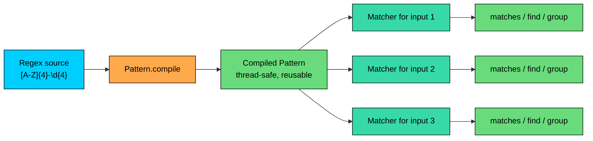

import React from 'react';
import CodeBlock from '../../../../components/ui/CodeBlock';
import Callout from '../../../../components/ui/Callout';

<div className="article-header">
  <div className="breadcrumb">
    <a href="/">Curated Notes</a>
    <span className="breadcrumb-separator">›</span>
    <span className="breadcrumb-current">Regular Expressions</span>
  </div>
  <h1>Regular Expressions</h1>
  <p style={{ color: 'var(--text-muted)', fontSize: '1.1rem', marginBottom: '16px', lineHeight: '1.6' }}>
    Master the essentials of Regular Expressions in this curated guide.
  </p>
  <div className="meta-info">
    <span className="meta-item">
      <svg width="14" height="14" viewBox="0 0 24 24" fill="none" stroke="currentColor" strokeWidth="2"><circle cx="12" cy="12" r="10"/><polyline points="12 6 12 12 16 14"/></svg>
      10 min read
    </span>
    <span className="difficulty-badge difficulty-badge--intermediate">Intermediate</span>
  </div>
</div>

<section className="content-section">

A regular expression, or regex, is a small pattern language for describing sets of strings. Instead of writing five `if` statements to check whether a coupon code looks valid, you write one pattern like `[A-Z]{4}-\d{4}` and let Java do the matching. This lesson covers the regex API in `java.util.regex`, the four String shortcut methods that take a regex, the core syntax you need on the job, and two common pitfalls: double escaping and catastrophic backtracking.

---

## Why Regex Exists

Consider an e-commerce site that lets customers redeem coupons. A valid coupon looks like `SAVE-1234`: four uppercase letters, a hyphen, four digits. Without regex, validating it by hand looks like this.


```java
public class CouponCheckManual {
    public static void main(String[] args) {
        String coupon = "SAVE-1234";
        boolean valid = true;

        if (coupon.length() != 9) {
            valid = false;
        } else {
            for (int i = 0; i < 4; i++) {
                char c = coupon.charAt(i);
                if (c < 'A' || c > 'Z') {
                    valid = false;
                    break;
                }
            }
            if (valid && coupon.charAt(4) != '-') {
                valid = false;
            }
            if (valid) {
                for (int i = 5; i < 9; i++) {
                    char c = coupon.charAt(i);
                    if (c < '0' || c > '9') {
                        valid = false;
                        break;
                    }
                }
            }
        }
        System.out.println("Valid coupon: " + valid);
    }
}
```


That's a lot of code for a simple rule. Worse, the rule is buried inside the loops. If marketing later wants `SAVE-12345` (five digits instead of four), you'd have to read the code carefully to figure out where to change it.

The same check with regex:


```java
public class CouponCheckRegex {
    public static void main(String[] args) {
        String coupon = "SAVE-1234";
        boolean valid = coupon.matches("[A-Z]{4}-\\d{4}");
        System.out.println("Valid coupon: " + valid);
    }
}
```


The pattern `[A-Z]{4}-\d{4}` reads as "four uppercase letters, a hyphen, four digits". The rule is right there in one line, in a language designed for exactly this kind of check. The rest of this lesson shows what's inside that pattern and how to use it well.

---

## The String Shortcut Methods

Four methods on `String` accept a regex as their first argument. They're convenient for one-off checks.


| Method | What it does |
| ------ | ------------ |
| `matches(String regex)` | Returns `true` if the entire string matches the pattern |
| `replaceAll(String regex, String replacement)` | Replaces every match with `replacement` |
| `replaceFirst(String regex, String replacement)` | Replaces only the first match |
| `split(String regex)` | Splits the string at every match and returns the pieces as a `String[]` |


The most important thing to understand about `matches` is that it must match the **entire** string, not just a piece of it. If you want to check whether a string contains the pattern somewhere inside, you need `Pattern.matcher(...).find()`, which we cover later.


```java
public class StringMatches {
    public static void main(String[] args) {
        String coupon = "SAVE-1234";

        System.out.println(coupon.matches("[A-Z]{4}-\\d{4}"));
        System.out.println(coupon.matches("SAVE"));
        System.out.println(coupon.matches(".*SAVE.*"));
    }
}
```


The second call returns `false` because the entire input is `SAVE-1234`, not just `SAVE`. The third call wraps the literal in `.*` (zero or more of any character), so it matches the whole input even though `SAVE` only appears at the start.

`replaceAll` swaps out every match. A common use case is redacting digits in a log line.


```java
public class RedactDigits {
    public static void main(String[] args) {
        String log = "Order 4242 paid with card 4111111111111111";
        String redacted = log.replaceAll("\\d", "*");
        System.out.println(redacted);
    }
}
```


`split` is handy for chopping up structured strings.


```java
public class SplitCsv {
    public static void main(String[] args) {
        String row = "Wireless Mouse,29.99,15";
        String[] fields = row.split(",");
        for (String field : fields) {
            System.out.println(field);
        }
    }
}
```


Real-world CSV has quoted fields, escaped commas inside quotes, and other edge cases that regex alone can't handle cleanly. For production CSV parsing, use a library like OpenCSV or Apache Commons CSV. For simple inputs that you control, `split(",")` is fine.

Every call to `String.matches`, `replaceAll`, `replaceFirst`, or `split` compiles the regex from scratch. That's fine if you call it once. Inside a loop that runs ten thousand times, it can dominate the loop's cost.

---

## Compile Once with `Pattern` and `Matcher`

The shortcut methods are convenient but wasteful when you run the same regex many times. The proper API lives in `java.util.regex` and has two main classes.

- `Pattern` is the compiled form of a regex. You build it once with `Pattern.compile(regex)`.
- `Matcher` is the engine that runs a compiled `Pattern` against a specific input string. You get one by calling `pattern.matcher(input)`.

A coupon validator that processes a list of inputs without recompiling the pattern:


```java
import java.util.regex.Pattern;
import java.util.regex.Matcher;

public class CouponBatch {
    public static void main(String[] args) {
        Pattern couponPattern = Pattern.compile("[A-Z]{4}-\\d{4}");

        String[] candidates = {"SAVE-1234", "save-1234", "WELCOME-99", "DEAL-0001"};
        for (String candidate : candidates) {
            Matcher matcher = couponPattern.matcher(candidate);
            System.out.println(candidate + " -> " + matcher.matches());
        }
    }
}
```


The pattern is compiled exactly once, outside the loop. Each iteration creates a fresh `Matcher`, which is cheap. `Matcher` objects hold state about where they are in the input, so they aren't safe to share across threads. The `Pattern` itself is immutable and thread-safe, which is the whole point of separating the two.

The lifecycle laid out as a diagram:





`Matcher` has three core methods that ask different questions of the input.


| Method | Question it answers |
| ------ | ------------------- |
| `matches()` | Does the **whole** input match the pattern? |
| `find()` | Is there a match somewhere in the remaining input? Advances the cursor on each call. |
| `lookingAt()` | Does the input match starting from position 0, even if extra characters follow? |


`find()` is the most common method for scanning a string for occurrences. It walks the input from where it left off, returns `true` if it found a match, and lets you ask for the matched text with `group()`.


```java
import java.util.regex.Pattern;
import java.util.regex.Matcher;

public class FindPrices {
    public static void main(String[] args) {
        String description = "Sale: was $49.99, now $29.99. Limit 2 per order. Bundle: $89.99.";
        Pattern pricePattern = Pattern.compile("\\$\\d+\\.\\d{2}");

        Matcher matcher = pricePattern.matcher(description);
        while (matcher.find()) {
            System.out.println("Found price " + matcher.group() + " at index " + matcher.start());
        }
    }
}
```


`group()` returns the substring that the most recent `find()` matched. `start()` returns its starting index in the input, and `end()` returns the index just past the end. This is the standard pattern for extracting structured tokens from free-form text.

A diagram of how the cursor moves through the input as `find()` is called repeatedly:

```mermaid
flowchart LR
    S["Input: Sale: was $49.99, now $29.99. ..."]:::cyan --> F1["find call 1<br/>cursor at 0"]:::orange
    F1 --> H1["Match: $49.99<br/>at index 10<br/>cursor moves to 16"]:::green
    H1 --> F2["find call 2<br/>cursor at 16"]:::orange
    F2 --> H2["Match: $29.99<br/>at index 22<br/>cursor moves to 28"]:::green
    H2 --> F3["find call 3<br/>cursor at 28"]:::orange
    F3 --> H3["Match: $89.99<br/>at index 58<br/>cursor moves to 64"]:::green
    H3 --> F4["find call 4<br/>cursor at 64"]:::orange
    F4 --> N["No more matches<br/>returns false"]:::red

    classDef cyan fill:#00ceff,stroke:#000,color:#000
    classDef orange fill:#ffa94d,stroke:#000,color:#000
    classDef green fill:#69db7c,stroke:#000,color:#000
    classDef red fill:#ff8787,stroke:#000,color:#000
```





The cursor never goes backward. Each successful `find()` leaves it pointing just past the last match, so the next call starts searching from there.

---

## Regex Syntax Basics

The pattern language is the part that takes practice. The core syntax that covers most Java work:

#### Literal Characters and Escaping

Most characters in a regex stand for themselves. The pattern `cart` matches the four letters `c`, `a`, `r`, `t` in order. The exception is a small set of metacharacters that have special meanings: `. * + ? ( ) [ ] { } \ ^ $ |`. To match one of these literally, prefix it with a backslash. To match a literal `$`, write `\$`. To match a literal `.`, write `\.`.

#### Character Classes

A character class matches exactly one character from a set you define.


| Class | Matches |
| ----- | ------- |
| `[abc]` | The literal `a`, `b`, or `c` |
| `[a-z]` | Any single lowercase letter |
| `[A-Za-z]` | Any single ASCII letter |
| `[^0-9]` | Any single character that is **not** a digit |


The caret `^` at the start of a character class negates it. Outside a class, `^` means start of input.

#### Predefined Character Classes

Some sets come up so often that regex gives them shorthand.


| Shorthand | Equivalent | Matches |
| --------- | ---------- | ------- |
| `\d` | `[0-9]` | A single digit |
| `\D` | `[^0-9]` | Any single non-digit |
| `\w` | `[A-Za-z0-9_]` | A single word character |
| `\W` | `[^A-Za-z0-9_]` | A single non-word character |
| `\s` | `[ \t\n\r\f]` | A single whitespace character |
| `\S` | `[^\s]` | A single non-whitespace character |
| `.` | (any except newline) | Any one character, except a newline by default |


#### Anchors

Anchors don't match characters. They match positions.


| Anchor | Matches at |
| ------ | ---------- |
| `^` | The start of the input |
| `$` | The end of the input |
| `\b` | A word boundary (between `\w` and `\W`) |


`\b` is the one to know. It's how you say "match the whole word `cart`, not the `cart` inside `cartridge`".

#### Quantifiers

A quantifier follows a character or group and says how many times it can repeat.


| Quantifier | Meaning |
| ---------- | ------- |
| `*` | Zero or more times |
| `+` | One or more times |
| `?` | Zero or one time (optional) |
| `{n}` | Exactly `n` times |
| `{n,m}` | Between `n` and `m` times |
| `{n,}` | At least `n` times |


By default, quantifiers are **greedy**: they match as many characters as possible. Adding a `?` after the quantifier makes it **reluctant** (also called lazy), matching as few as possible.


```java
import java.util.regex.Pattern;
import java.util.regex.Matcher;

public class GreedyVsReluctant {
    public static void main(String[] args) {
        String html = "<b>Sale</b> <i>Now</i>";

        Matcher greedy = Pattern.compile("<.+>").matcher(html);
        if (greedy.find()) {
            System.out.println("Greedy:    " + greedy.group());
        }

        Matcher reluctant = Pattern.compile("<.+?>").matcher(html);
        if (reluctant.find()) {
            System.out.println("Reluctant: " + reluctant.group());
        }
    }
}
```


The greedy `.+` swallows everything between the first `<` and the last `>`. The reluctant `.+?` stops at the first `>` it can. Use reluctant quantifiers when you want to match the smallest enclosing token.

#### Alternation

The `|` operator means "or". The pattern `cart|wishlist` matches either `cart` or `wishlist`. Parentheses group the alternatives: `(cart|wishlist) page` matches `cart page` or `wishlist page`.

A single example that uses several of these together:


```java
import java.util.regex.Pattern;
import java.util.regex.Matcher;

public class SyntaxSampler {
    public static void main(String[] args) {
        String text = "Items: 3 mice, 1 cable, 12 stickers, no batteries.";

        Pattern itemPattern = Pattern.compile("\\b(\\d+|no)\\s+\\w+\\b");
        Matcher matcher = itemPattern.matcher(text);
        while (matcher.find()) {
            System.out.println(matcher.group());
        }
    }
}
```


The pattern says: a word boundary, then either one-or-more digits or the literal `no`, then whitespace, then a word, then another word boundary. That's enough to pick up "12 stickers" and "no batteries" without grabbing stray digits inside numbers we don't care about.

---

## Groups and Capture

Parentheses do two jobs at once. They group part of the pattern so a quantifier can apply to the whole group, and they **capture** what was matched so you can pull it out later.

Capturing groups are numbered from `1`, left to right by the position of their opening parenthesis. `group(0)` returns the whole match.


```java
import java.util.regex.Pattern;
import java.util.regex.Matcher;

public class PriceGroups {
    public static void main(String[] args) {
        String line = "Wireless Mouse $29.99";
        Pattern p = Pattern.compile("(.+?)\\s+\\$(\\d+)\\.(\\d{2})");

        Matcher m = p.matcher(line);
        if (m.matches()) {
            System.out.println("Full match: " + m.group(0));
            System.out.println("Name:       " + m.group(1));
            System.out.println("Dollars:    " + m.group(2));
            System.out.println("Cents:      " + m.group(3));
        }
    }
}
```


Once you have more than two or three groups, counting positions gets fragile. A named group lets you label the capture with a name and refer to it that way. The syntax is `(?<name>...)`, and you read it with `group("name")`.


```java
import java.util.regex.Pattern;
import java.util.regex.Matcher;

public class NamedPriceGroups {
    public static void main(String[] args) {
        String line = "Wireless Mouse $29.99";
        Pattern p = Pattern.compile("(?<name>.+?)\\s+\\$(?<dollars>\\d+)\\.(?<cents>\\d{2})");

        Matcher m = p.matcher(line);
        if (m.matches()) {
            System.out.println("Name:    " + m.group("name"));
            System.out.println("Dollars: " + m.group("dollars"));
            System.out.println("Cents:   " + m.group("cents"));
        }
    }
}
```


If a set of parentheses is only there to group for a quantifier and you don't care about capturing what it matched, use a **non-capturing group** `(?:...)`. It's slightly faster because the engine doesn't have to record the match, and it keeps your group numbers tidy.


```java
import java.util.regex.Pattern;
import java.util.regex.Matcher;

public class NonCapturing {
    public static void main(String[] args) {
        String text = "ORDER-1001 ORDER-1002 INVOICE-7777";
        Pattern p = Pattern.compile("(?:ORDER|INVOICE)-(\\d+)");

        Matcher m = p.matcher(text);
        while (m.find()) {
            System.out.println("Doc with number: " + m.group(1));
        }
    }
}
```


The `(?:ORDER|INVOICE)` group exists only to attach `|` to two alternatives. We don't need to capture it, so we mark it non-capturing. That makes `group(1)` refer to the digits, which is what we actually want.

#### Back-references

Inside the same pattern, `\1` refers back to whatever was captured by group 1. This is useful for finding repeated tokens, like duplicate words.


```java
import java.util.regex.Pattern;
import java.util.regex.Matcher;

public class DuplicateWords {
    public static void main(String[] args) {
        String review = "The the product is is great great.";
        Pattern p = Pattern.compile("\\b(\\w+)\\s+\\1\\b", Pattern.CASE_INSENSITIVE);

        Matcher m = p.matcher(review);
        while (m.find()) {
            System.out.println("Duplicate: " + m.group());
        }
    }
}
```


`\1` matches the same text that group 1 captured earlier in the same match. Back-references are powerful but can trigger slow matching on long inputs, so use them sparingly.

---

## The Double-Escape Headache

This is the single biggest source of regex bugs in Java. The regex syntax uses `\` to introduce special tokens (`\d`, `\s`, `\b`). Java string literals also use `\` for their own escape sequences (`\n`, `\t`, `\\`). So when you write a regex in a Java string literal, the backslash needs to survive two passes: once through the Java compiler, and then through the regex compiler.

The rule is simple. Every `\` in the regex becomes `\\` in the Java string literal.


| Regex you want | Java string literal | What it matches |
| -------------- | ------------------- | --------------- |
| `\d` | `"\\d"` | A single digit |
| `\s` | `"\\s"` | A single whitespace character |
| `\.` | `"\\."` | A literal period |
| `\\` | `"\\\\"` | A literal backslash |
| `\b` | `"\\b"` | A word boundary |


Forgetting this gives you either a compile error (for unknown escape sequences like `"\d"`) or a runtime `PatternSyntaxException`.

**What's wrong with this code?**


```java
String price = "$29.99";
boolean ok = price.matches("\$\d+\.\d{2}");
```


The Java compiler reads `"\$\d+\.\d{2}"` and complains that `\$`, `\d`, and `\.` are not valid Java string escapes. The code doesn't even compile.

**Fix:**


```java
public class DoubleEscapeFix {
    public static void main(String[] args) {
        String price = "$29.99";
        boolean ok = price.matches("\\$\\d+\\.\\d{2}");
        System.out.println("Valid price: " + ok);
    }
}
```


Each `\\` in the source code becomes one `\` in the actual string at runtime, which is what the regex engine sees and expects.

Java 15 added **text blocks**, which use triple quotes and don't process backslash escapes the way regular string literals do. Inside a text block, the regex looks like the regex.


```java
public class TextBlockRegex {
    public static void main(String[] args) {
        String pattern = """
                \$\d+\.\d{2}""";
        String price = "$29.99";
        System.out.println("Valid price: " + price.matches(pattern));
    }
}
```


Text blocks help for any regex more than a handful of characters long, because they cut the visual noise of double backslashes everywhere.

The Java compiler doesn't know your string is a regex, so it can't catch a malformed pattern at compile time. A regex error becomes a `PatternSyntaxException` at runtime, when `Pattern.compile` runs. If the pattern is hard-coded, compile it once in a `static final Pattern` field so the failure happens at class load instead of deep inside a request handler.

---

## Performance and Pitfalls

Regex matching does real work internally. Two cost patterns matter in production code.

#### Compile-Once Is Cheaper Than Compile-Each-Call

The String shortcut methods (`matches`, `replaceAll`, etc.) compile the regex every time you call them. For a single check, the cost is negligible. For a hot loop, it adds up.


```java
import java.util.regex.Pattern;

public class CompileBenchmark {
    public static void main(String[] args) {
        String input = "SAVE-1234";
        int iterations = 1_000_000;

        long t1 = System.nanoTime();
        for (int i = 0; i < iterations; i++) {
            input.matches("[A-Z]{4}-\\d{4}");
        }
        long shortcutMs = (System.nanoTime() - t1) / 1_000_000;

        Pattern p = Pattern.compile("[A-Z]{4}-\\d{4}");
        long t2 = System.nanoTime();
        for (int i = 0; i < iterations; i++) {
            p.matcher(input).matches();
        }
        long compiledMs = (System.nanoTime() - t2) / 1_000_000;

        System.out.println("String.matches:   " + shortcutMs + " ms");
        System.out.println("Compiled Pattern: " + compiledMs + " ms");
    }
}
```


Exact numbers vary by machine and JVM, but the compiled version is several times faster on any setup. The rule of thumb: if the regex is fixed at compile time and you'll run it more than a handful of times, lift it into a `static final Pattern` field.


```java
import java.util.regex.Pattern;

public class CouponValidator {
    private static final Pattern COUPON_PATTERN = Pattern.compile("[A-Z]{4}-\\d{4}");

    public static boolean isValid(String coupon) {
        return COUPON_PATTERN.matcher(coupon).matches();
    }

    public static void main(String[] args) {
        System.out.println(isValid("SAVE-1234"));
        System.out.println(isValid("save-1234"));
    }
}
```


#### Catastrophic Backtracking

A poorly designed pattern can take exponential time on an input that doesn't match. The regex engine tries one path, fails, backs up, tries another, and the combinations explode.

The classic shape is nested quantifiers with overlap, like `(a+)+`. Each `a` in the input can be partitioned across the inner and outer quantifier in many ways, and a failure at the end forces the engine to try them all.

Consider an e-commerce flavored example. To validate that a product description contains only words and spaces with `^(\w+\s*)+$`. On an input that almost matches but has an invalid character at the end, the engine grinds.


```java
import java.util.regex.Pattern;

public class CatastrophicBacktracking {
    public static void main(String[] args) {
        Pattern bad = Pattern.compile("^(\\w+\\s*)+$");
        String input = "aaaaaaaaaaaaaaaaaaaaaaaaaaaaaaaa!";

        long start = System.nanoTime();
        boolean matched = bad.matcher(input).matches();
        long ms = (System.nanoTime() - start) / 1_000_000;

        System.out.println("Matched: " + matched);
        System.out.println("Took: " + ms + " ms");
    }
}
```


Eight seconds for a 33-character input. Add a few more `a`s and you'll wait for hours. The fix is to either rewrite the pattern so the alternatives don't overlap, or use a **possessive quantifier**, which refuses to give back characters once it has matched them.


```java
import java.util.regex.Pattern;

public class PossessiveFix {
    public static void main(String[] args) {
        Pattern good = Pattern.compile("^(\\w++\\s*+)+$");
        String input = "aaaaaaaaaaaaaaaaaaaaaaaaaaaaaaaa!";

        long start = System.nanoTime();
        boolean matched = good.matcher(input).matches();
        long ms = (System.nanoTime() - start) / 1_000_000;

        System.out.println("Matched: " + matched);
        System.out.println("Took: " + ms + " ms");
    }
}
```


The `++` says "match one or more, and never give any back". With backtracking disabled at that point, there's nothing for the engine to explode over. It fails fast.

A simpler fix is often to write the pattern more carefully in the first place. `^\w+(\s+\w+)*$` matches the same shape (words separated by whitespace) without the overlap.

Patterns that work fine in testing can hang a thread on adversarial input. If your regex runs on user-supplied data, either use possessive quantifiers, set a timeout on a separate thread, or rewrite the pattern to remove ambiguity. Tools like `regex101.com` and `regexr.com` can show backtracking step counts before you ship.

#### The `.` Surprise

The most common single-character mistake is forgetting that `.` matches any character, not just a literal period.

**What's wrong with this code?**


```java
String orderId = "ORD-12345";
String redacted = orderId.replaceAll(".", "*");
System.out.println(redacted);
```


The author wanted to replace literal dots, of which there are none, expecting the output to be `ORD-12345` unchanged. Actual output:


```shell
*********
```


`.` matched every character. The pattern says "any character", and `replaceAll` replaced all of them.

**Fix:**

Escape the dot to make it literal.


```java
public class DotEscape {
    public static void main(String[] args) {
        String orderId = "ORD-12345";
        String redacted = orderId.replaceAll("\\.", "*");
        System.out.println(redacted);
    }
}
```


Now the pattern matches a literal period, of which the input has none, so nothing changes. If you wanted to replace every character with `*`, use `.` on purpose, but knowing what it does.

---

## Putting It Together: Order Log Redaction

A realistic example that ties most of this together. An order log line contains a card number that needs to be redacted before the log gets written to disk, but the last four digits should remain visible so support staff can confirm the card with the customer.


```java
import java.util.regex.Pattern;
import java.util.regex.Matcher;

public class RedactCardNumbers {
    private static final Pattern CARD_PATTERN =
        Pattern.compile("\\b(\\d{12})(\\d{4})\\b");

    public static String redact(String log) {
        Matcher m = CARD_PATTERN.matcher(log);
        return m.replaceAll("************$2");
    }

    public static void main(String[] args) {
        String log = "Order 8821 charged $29.99 to card 4111111111111234 for customer Alice.";
        System.out.println(redact(log));
    }
}
```


The pattern splits the 16-digit card into a 12-digit prefix (group 1) and a 4-digit suffix (group 2). `replaceAll` uses `$2` to reinsert the captured suffix while replacing the prefix with twelve asterisks. The `\b` word boundaries make sure we don't accidentally match a 16-digit substring inside something larger like an order ID.

This is the regex sweet spot: a clear rule, a one-line pattern, and a transformation that would take 30 lines of manual character handling.

---

## Quick Reference

The syntax table again, all in one place for scanning.


| Category | Token | Meaning | Java string form |
| -------- | ----- | ------- | ---------------- |
| Literal | `a` | The character `a` | `"a"` |
| Escape | `\.` `\$` `\(` | Literal `.` `$` `(` | `"\\."` `"\\$"` `"\\("` |
| Class | `[abc]` | One of `a`, `b`, `c` | `"[abc]"` |
| Class | `[a-z]` | One lowercase letter | `"[a-z]"` |
| Class | `[^0-9]` | Any non-digit | `"[^0-9]"` |
| Predefined | `\d` | A digit | `"\\d"` |
| Predefined | `\D` | A non-digit | `"\\D"` |
| Predefined | `\w` | Word character (`[A-Za-z0-9_]`) | `"\\w"` |
| Predefined | `\W` | Non-word character | `"\\W"` |
| Predefined | `\s` | Whitespace | `"\\s"` |
| Predefined | `\S` | Non-whitespace | `"\\S"` |
| Predefined | `.` | Any character except newline | `"."` |
| Anchor | `^` | Start of input | `"^"` |
| Anchor | `$` | End of input | `"$"` |
| Anchor | `\b` | Word boundary | `"\\b"` |
| Quantifier | `*` | Zero or more (greedy) | `"*"` |
| Quantifier | `+` | One or more (greedy) | `"+"` |
| Quantifier | `?` | Zero or one (greedy) | `"?"` |
| Quantifier | `{n}` | Exactly `n` | `"{n}"` |
| Quantifier | `{n,m}` | Between `n` and `m` | `"{n,m}"` |
| Quantifier | `*?` `+?` `??` | Reluctant variants | `"*?"` |
| Quantifier | `*+` `++` `?+` | Possessive variants | `"*+"` |
| Alternation | `a\|b` | `a` or `b` | `"a\|b"` |
| Group | `(...)` | Capturing group | `"(...)"` |
| Group | `(?:...)` | Non-capturing group | `"(?:...)"` |
| Group | `(?<name>...)` | Named capturing group | `"(?<name>...)"` |
| Back-ref | `\1` | Whatever group 1 matched | `"\\1"` |


For the full grammar, including Unicode property escapes and POSIX classes, see the `Pattern` Javadoc at &lt;https://docs.oracle.com/en/java/javase/21/docs/api/java.base/java/util/regex/Pattern.html&gt;.

</section>
