import React from 'react';
import CodeBlock from '../../../../components/ui/CodeBlock';
import Callout from '../../../../components/ui/Callout';

<div className="article-header">
  <div className="breadcrumb">
    <a href="/">Curated Notes</a>
    <span className="breadcrumb-separator">›</span>
    <span className="breadcrumb-current">Return Types</span>
  </div>
  <h1>Return Types</h1>
  <p style={{ color: 'var(--text-muted)', fontSize: '1.1rem', marginBottom: '16px', lineHeight: '1.6' }}>
    Master the essentials of Return Types in this curated guide.
  </p>
  <div className="meta-info">
    <span className="meta-item">
      <svg width="14" height="14" viewBox="0 0 24 24" fill="none" stroke="currentColor" strokeWidth="2"><circle cx="12" cy="12" r="10"/><polyline points="12 6 12 12 16 14"/></svg>
      10 min read
    </span>
    <span className="difficulty-badge difficulty-badge--intermediate">Intermediate</span>
  </div>
</div>

<section className="content-section">

Methods are how programs split work into named pieces. Some pieces do something and have nothing to hand back. Others compute a value, a price, a flag, a list of items, and the caller needs that value to keep going. The return type is the contract the method makes with its callers about what comes out the other end. This lesson covers `void`, primitive returns, reference returns, the `return` statement itself, early returns, and the small pile of compiler rules that govern all of it.

---

## What a Return Type Declares

The return type sits between the modifier list and the method name in the header. It tells the compiler, and anyone reading the code, what kind of value the method produces. The body is then required to honor that promise.


```java
public class ReturnTypeBasics {
    public static void main(String[] args) {
        double price = getPrice();
        System.out.println("Price: $" + price);
    }

    static double getPrice() {
        return 29.99;
    }
}
```


The header `static double getPrice()` says two things. First, calling this method gives you back a `double`. Second, anyone calling it can use that `double` directly in an expression, assign it to a variable, or ignore it.

Every method declares exactly one return type. There's no syntax for returning two values at once. If you need to return more than one piece of information, you wrap them in an array, a `List`, or a small class. Java also doesn't let two methods in the same class differ only by return type; that part falls under method overloading.

```mermaid
flowchart LR
    Caller[Caller<br/>double total = getTotal&#40;&#41;]:::cyan --> Call[Method call]:::orange
    Call --> Body[Method body executes]:::orange
    Body --> Ret[return value]:::green
    Ret --> Capture[Value handed back<br/>assigned or used]:::cyan

    classDef cyan fill:#00ceff,stroke:#000,color:#000
    classDef orange fill:#ffa94d,stroke:#000,color:#000
    classDef green fill:#69db7c,stroke:#000,color:#000
```





The diagram traces one call. The caller invokes the method, the body runs, a `return` statement produces a value, and that value flows back to where the call was written. From the caller's point of view, the whole method call is replaced by its return value.

---

## `void`: Methods That Don't Return Anything

When a method's job is to do something rather than compute something, its return type is `void`. The keyword means "no value comes back". Printing, updating, sending, logging, all natural fits.


```java
public class PrintReceipt {
    public static void main(String[] args) {
        printWelcomeMessage("Alice");
    }

    static void printWelcomeMessage(String customerName) {
        System.out.println("Welcome back, " + customerName + "!");
        System.out.println("Your cart is ready.");
    }
}
```


The method does its work and falls off the bottom. There's no `return` line, and that's fine. A `void` method is allowed to omit `return` entirely. It can also use a bare `return;` to exit early.

You cannot assign the result of a `void` call to a variable, because there is no result.


```java
String greeting = printWelcomeMessage("Alice"); // compile error
```


The compiler says `void cannot be converted to String`, which is its way of pointing out that you tried to capture nothing.

---

## Returning a Primitive

When the return type is a primitive (`int`, `long`, `double`, `float`, `boolean`, `char`, `byte`, `short`), the method hands back a value of that exact type, or a value the compiler can widen to that type without losing information.


```java
public class PrimitiveReturns {
    public static void main(String[] args) {
        int stock = getStockCount();
        double tax = getTaxRate();
        boolean inStock = isInStock(stock);

        System.out.println("Stock:    " + stock);
        System.out.println("Tax rate: " + tax);
        System.out.println("Available: " + inStock);
    }

    static int getStockCount() {
        return 42;
    }

    static double getTaxRate() {
        return 0.08;
    }

    static boolean isInStock(int count) {
        return count > 0;
    }
}
```


Each method's return statement produces a value that matches the declared type. `getStockCount` returns an `int` literal, `getTaxRate` returns a `double` literal, and `isInStock` returns the result of a comparison, which is already a `boolean`.

Returning a `boolean` is the standard way to write a yes-or-no method. Names like `isInStock`, `hasDiscount`, or `canShip` read naturally at the call site.


```java
public class BooleanReturn {
    public static void main(String[] args) {
        double subtotal = 120.0;
        if (qualifiesForFreeShipping(subtotal)) {
            System.out.println("Free shipping applied.");
        } else {
            System.out.println("Add more items for free shipping.");
        }
    }

    static boolean qualifiesForFreeShipping(double subtotal) {
        return subtotal >= 100.0;
    }
}
```


The method compresses a small piece of business logic into a name the caller can read in an `if`. That's most of the value of returning `boolean`. You move the "what does it mean" out of the call site and into the method.

#### Implicit Widening on Return

A method that returns `double` can `return` an `int` literal. The compiler widens the `int` to a `double` for you, the same way it widens during assignment.


```java
public class ImplicitWidening {
    public static void main(String[] args) {
        double shipping = getShippingCost();
        System.out.println("Shipping: $" + shipping);
    }

    static double getShippingCost() {
        return 5; // int literal, widened to double
    }
}
```


The `5` becomes `5.0` on its way out. The reverse is not allowed. A method that returns `int` cannot `return` a `double` value, because that would lose the fractional part. The compiler refuses unless you cast explicitly.


```java
static int getQuantity() {
    return 3.7; // compile error: incompatible types
}
```


The fix is either to change the return type to `double` or to cast: `return (int) 3.7;`. The cast truncates to `3`, and the compiler stops complaining because you've taken responsibility for the loss.

Widening is free at the level of generated bytecode for most pairs. The cost comes from accidental widening that masks a bug, like a method declared `double` returning an `int` result that's missing rounding logic.

---

## Returning a Reference Type

Reference types include `String`, arrays, and any class you or someone else defined. Returning a reference works the same way as returning a primitive, except the value handed back is a reference to an object rather than the object itself. The caller and the method end up pointing at the same object.


```java
public class StringReturn {
    public static void main(String[] args) {
        String label = formatPrice(29.99);
        System.out.println(label);
    }

    static String formatPrice(double amount) {
        return "$" + amount;
    }
}
```


The method builds a string and hands the reference back. The caller assigns it to `label`. From here on, both the method's local variable (already gone, since the method returned) and the caller's `label` refer to the same `String` object.

Returning an array works the same way.


```java
public class ArrayReturn {
    public static void main(String[] args) {
        int[] prices = getTopThreePrices();
        for (int p : prices) {
            System.out.println("Price: $" + p);
        }
    }

    static int[] getTopThreePrices() {
        return new int[] { 99, 199, 299 };
    }
}
```


The method allocates a new array and returns the reference. The caller treats the array as its own. Whether changes the caller makes to the array are visible back inside the method depends on what the method does after returning, which is usually nothing, since it's already finished.

A method can also return objects of types you define. Consider a `Product` class that holds a name and price.


```java
class Product {
    String name;
    double price;

    Product(String name, double price) {
        this.name = name;
        this.price = price;
    }
}

public class ObjectReturn {
    public static void main(String[] args) {
        Product p = findProductById(101);
        System.out.println(p.name + " costs $" + p.price);
    }

    static Product findProductById(int id) {
        return new Product("Wireless Mouse", 29.99);
    }
}
```


The method builds a `Product` and returns the reference. The caller reads fields off it. Returning custom objects is how methods communicate richer pieces of information without resorting to arrays or parallel return values.

---

## The `return` Statement

`return` does two things at once. It produces a value (unless the method is `void`) and it exits the method immediately. Once a `return` runs, control leaves the method and goes back to the caller. Nothing else in the method runs.


```java
public class ReturnExits {
    public static void main(String[] args) {
        System.out.println("Discount: " + getDiscount(150.0));
    }

    static double getDiscount(double subtotal) {
        System.out.println("Calculating discount...");
        return subtotal * 0.10;
        // anything written here would be unreachable
    }
}
```


The `return` line evaluates `subtotal * 0.10`, then leaves the method with that value. If you tried to put a statement after the `return`, the compiler would reject it with an `unreachable statement` error.


```java
static double getDiscount(double subtotal) {
    return subtotal * 0.10;
    System.out.println("never runs"); // compile error: unreachable statement
}
```


This rule exists because dead code is almost always a bug. The compiler catches it for you instead of letting it ship.

A `void` method uses `return;` with no value to exit early.


```java
static void printDiscount(double subtotal) {
    if (subtotal <= 0) {
        return; // bail out, nothing to do
    }
    System.out.println("Discount: " + (subtotal * 0.10));
}
```


The bare `return;` is only legal in `void` methods. In a non-`void` method, every `return` must carry a value of the declared type.

---

## Multiple Return Paths

A method can have more than one `return` statement. Each branch of the code can have its own. The only requirement is that every path through the method ends in either a `return` (for non-`void` methods) or falls off the end (for `void` methods).


```java
public class MultipleReturns {
    public static void main(String[] args) {
        System.out.println("Tier for $50:   " + getCustomerTier(50));
        System.out.println("Tier for $250:  " + getCustomerTier(250));
        System.out.println("Tier for $1500: " + getCustomerTier(1500));
    }

    static String getCustomerTier(double totalSpent) {
        if (totalSpent < 100) {
            return "Bronze";
        }
        if (totalSpent < 1000) {
            return "Silver";
        }
        return "Gold";
    }
}
```


Each `if` either returns or falls through to the next check. The final `return "Gold"` covers everything that didn't match earlier conditions. The compiler walks every possible path and confirms that none of them can finish without returning something.

If you forget the final return, the compiler complains.


```java
static String getCustomerTier(double totalSpent) {
    if (totalSpent < 100) {
        return "Bronze";
    }
    if (totalSpent < 1000) {
        return "Silver";
    }
    // compile error: missing return statement
}
```


The compiler can't prove that one of the `if` branches will always run, because in principle `totalSpent` could be `1000` or higher and slip past both checks. Adding the unconditional `return "Gold";` at the end satisfies the rule.

#### When All Branches Return

If every branch of an `if-else` returns, the code after the `if-else` is unreachable, and the compiler will tell you so.


```java
static String classify(double total) {
    if (total < 100) {
        return "small";
    } else {
        return "large";
    }
    System.out.println("after"); // compile error: unreachable statement
}
```


This is the same rule as before, just spotted in a different shape. The fix is to delete the unreachable code, or to remove the `else` and let the second `return` sit at the top level.


```java
static String classify(double total) {
    if (total < 100) {
        return "small";
    }
    return "large";
}
```


Both forms compile. The second is the standard early-return style we look at next.

---

## Early Return (Guard Clauses)

When a method has a few "give up early" conditions before the real work starts, returning early from each one keeps the rest of the method flat and readable. Each early `return` is called a guard clause.


```java
public class GuardClauses {
    public static void main(String[] args) {
        System.out.println(applyCoupon(100.0, "SAVE10"));
        System.out.println(applyCoupon(100.0, ""));
        System.out.println(applyCoupon(-5.0, "SAVE10"));
    }

    static double applyCoupon(double subtotal, String coupon) {
        if (subtotal <= 0) {
            return 0.0;
        }
        if (coupon == null || coupon.isEmpty()) {
            return subtotal;
        }
        if (!coupon.equals("SAVE10")) {
            return subtotal;
        }
        return subtotal * 0.90;
    }
}
```


Each `if` handles one case and returns. By the time you reach the bottom of the method, you know the inputs are valid and the coupon is the one you handle. The alternative without guard clauses pushes the real logic into a deeply indented block.


```java
static double applyCouponNested(double subtotal, String coupon) {
    if (subtotal > 0) {
        if (coupon != null && !coupon.isEmpty()) {
            if (coupon.equals("SAVE10")) {
                return subtotal * 0.90;
            } else {
                return subtotal;
            }
        } else {
            return subtotal;
        }
    } else {
        return 0.0;
    }
}
```


Same behavior, more nesting, harder to follow. The guard-clause version is more readable. The general rule of thumb: handle the failure cases first, with each one ending in `return`, then put the main logic at the end where it has the whole method's width to itself.

---

## Returning `null`

A method that returns a reference type can return `null` to signal "no value". `null` is a special reference that doesn't point to any object. It's legal, but it shifts a burden onto the caller: any use of the returned value has to check for `null` first, or risk a `NullPointerException`.


```java
public class NullReturn {
    public static void main(String[] args) {
        String name = findProductName(101);
        if (name != null) {
            System.out.println("Found: " + name);
        } else {
            System.out.println("Product not found.");
        }
    }

    static String findProductName(int id) {
        if (id == 101) {
            return "Wireless Mouse";
        }
        return null;
    }
}
```


The method returns `"Wireless Mouse"` for the known id and `null` for everything else. The caller checks before using the value.

The catch is what happens when the caller forgets the check.


```java
String name = findProductName(999);
System.out.println(name.length()); // NullPointerException
```


The method returns `null`, the caller calls `.length()` on `null`, and the program crashes at runtime. There's nothing wrong with the compile-time types. The compiler can't tell which calls might return `null`. So in any code that returns `null`, the contract has to be clear enough that callers know to check.

Three common alternatives to returning `null`:

- Return an empty collection or array when the result is "no items". An empty list is safe to iterate over without a `null` check.
- Throw an exception when "not found" is a real error worth stopping for.
- Return an `Optional<T>` (added in Java 8), which is a wrapper that makes the "no value" possibility part of the type itself.

Returning `null` is common, but it's the option that puts the most pressure on the caller to remember a check. If you can avoid it, prefer one of the alternatives.

`null` itself is free. The real cost is one missed check turning into a `NullPointerException` in production. Empty collections, sentinel objects, or `Optional` push that check into the type system where the compiler can help you.

---

## Capturing the Return Value

When a method returns something, the caller decides what to do with it. There are three options.

**1. Assign it to a variable.** The most common option. The variable's type has to accept the return type.


```java
public class CaptureToVariable {
    public static void main(String[] args) {
        double total = calculateTotal(29.99, 3);
        System.out.println("Total: $" + total);
    }

    static double calculateTotal(double price, int quantity) {
        return price * quantity;
    }
}
```


**2. Use it directly in a larger expression.** The call's result is plugged in where the call sits.


```java
public class UseInExpression {
    public static void main(String[] args) {
        System.out.println("Total: $" + calculateTotal(29.99, 3));
        if (calculateTotal(29.99, 3) > 50) {
            System.out.println("Free shipping!");
        }
    }

    static double calculateTotal(double price, int quantity) {
        return price * quantity;
    }
}
```


The method is called twice here. Each call computes the value independently. If the computation is expensive, assign it to a variable once and reuse the variable instead of calling repeatedly.

**3. Ignore it.** Java lets you discard a non-`void` return value. The expression statement runs, the value is computed, then the value is thrown away.


```java
public class IgnoreReturn {
    public static void main(String[] args) {
        addToCart("Mouse"); // returns an int, ignored
        System.out.println("Item added.");
    }

    static int addToCart(String item) {
        System.out.println("Added: " + item);
        return 1; // number of items added
    }
}
```


Ignoring a return value compiles, but it's often a smell. Two reasons. First, if the method bothered to return a value, the caller probably should care about it. Second, methods that return a value to signal success or failure are dangerous to ignore. The classic case is `List.remove(Object)`, which returns `true` if the item was removed and `false` if it wasn't there. Ignoring the result means you can't tell whether the operation did anything.

The exception is methods whose return value is optional. `StringBuilder.append` returns the same `StringBuilder` so callers can chain calls, but the return value isn't new information. Ignoring it is fine when you're not chaining.

---

## Putting It Together

The next program uses every kind of return type covered above: `void`, a primitive, a `String`, and an object. It walks through a small order flow.


```java
class CartItem {
    String name;
    double price;
    int quantity;

    CartItem(String name, double price, int quantity) {
        this.name = name;
        this.price = price;
        this.quantity = quantity;
    }
}

public class OrderFlow {
    public static void main(String[] args) {
        CartItem item = createItem("Wireless Mouse", 29.99, 2);
        double total = calculateLineTotal(item);
        boolean qualifiesForDiscount = total >= 50.0;
        String label = formatLabel(item, total);

        printSummary(label, qualifiesForDiscount);
    }

    static CartItem createItem(String name, double price, int quantity) {
        return new CartItem(name, price, quantity);
    }

    static double calculateLineTotal(CartItem item) {
        return item.price * item.quantity;
    }

    static String formatLabel(CartItem item, double total) {
        return item.name + " x " + item.quantity + " = $" + total;
    }

    static void printSummary(String label, boolean discountApplies) {
        System.out.println(label);
        if (discountApplies) {
            System.out.println("Discount applied.");
            return;
        }
        System.out.println("No discount.");
    }
}
```


Five methods, five different return shapes. `createItem` returns a custom object. `calculateLineTotal` returns a `double`. `formatLabel` returns a `String`. `printSummary` returns `void` and uses an early `return;` to skip the "No discount" branch. The `main` method captures and chains the results.

Reading the flow top to bottom, each method does one thing and hands back what the next step needs. Good methods settle into this shape: clear inputs, one well-named return.

---

## How Return Types Connect to Each Other

The table below collects the rules we've worked through, so you have one place to look when something doesn't compile.


| Situation | Rule |
| --------- | ---- |
| Return type is `void` | No `return value;`. `return;` is allowed for early exit. Can also fall off the end. |
| Return type is a primitive | Every `return` must produce that exact type, or a narrower type the compiler can widen. |
| Return type is a reference | Every `return` produces a value of that type, a subtype, or `null`. |
| Two methods differ only by return type | Not allowed in the same class. Method overloading needs different parameter lists. |
| Code after `return` | Compile error: unreachable statement. |
| Some branches don't return | Compile error in non-`void` methods: missing return statement. |
| Returning `null` | Legal for any reference type. Callers must check or risk `NullPointerException`. |
| Ignoring a non-`void` return | Legal. Often a smell. Read the method's contract before doing it. |


</section>
