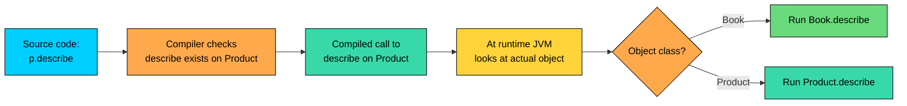
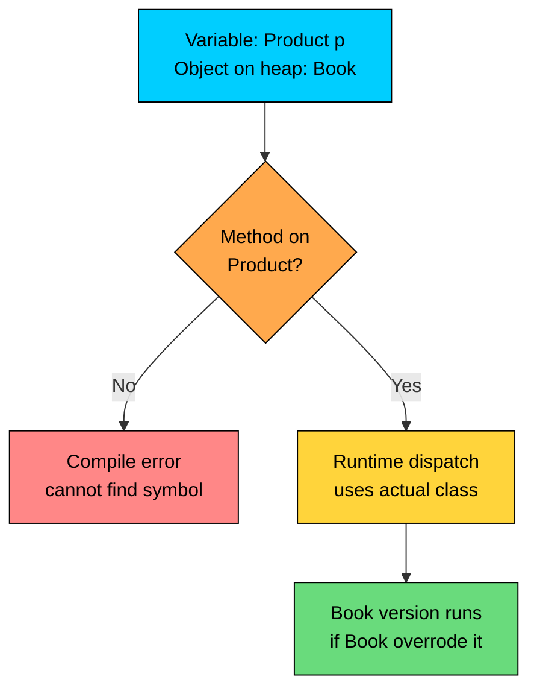
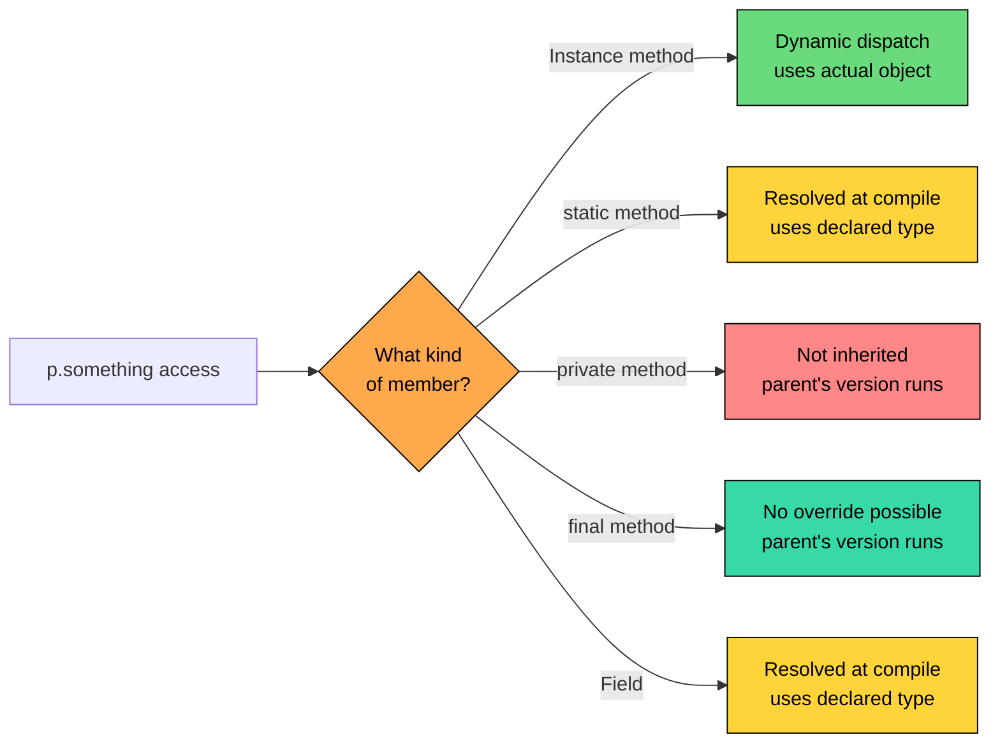

import React from 'react';
import CodeBlock from '../../../../components/ui/CodeBlock';
import Callout from '../../../../components/ui/Callout';

<div className="article-header">
  <div className="breadcrumb">
    <a href="/">Curated Notes</a>
    <span className="breadcrumb-separator">›</span>
    <span className="breadcrumb-current">Runtime Polymorphism</span>
  </div>
  <h1>Runtime Polymorphism</h1>
  <p style={{ color: 'var(--text-muted)', fontSize: '1.1rem', marginBottom: '16px', lineHeight: '1.6' }}>
    Master the essentials of Runtime Polymorphism in this curated guide.
  </p>
  <div className="meta-info">
    <span className="meta-item">
      <svg width="14" height="14" viewBox="0 0 24 24" fill="none" stroke="currentColor" strokeWidth="2"><circle cx="12" cy="12" r="10"/><polyline points="12 6 12 12 16 14"/></svg>
      10 min read
    </span>
    <span className="difficulty-badge difficulty-badge--intermediate">Intermediate</span>
  </div>
</div>

<section className="content-section">

There's a line between a variable's declared type and the object's actual runtime type. Compile-time polymorphism is the case where the compiler picks the method using static information. This lesson is about the other side of that coin: runtime polymorphism, where the JVM picks the method while the program is running, using the object's real type. This is the mechanism that lets one loop over a `List<Product>` print a different description for each subtype without any `if` ladder.

---

## What Runtime Polymorphism Actually Means

Runtime polymorphism is the rule that says: when you call an instance method through a parent-typed variable, the version that runs is the one defined on the object's actual class, not the variable's declared class. It has a few names and they all mean the same thing.


| Name | Where it appears |
| --- | --- |
| Runtime polymorphism | Java textbooks and interviews |
| Dynamic binding | Compiler and language theory |
| Late binding | Older OOP literature |
| Dynamic dispatch | JVM internals and performance docs |


"Binding" here means deciding which method to run. "Late" or "dynamic" means that decision is deferred until runtime. The opposite, where the compiler decides up front, is called static binding, and that's what method overloading and `static` method calls use.

The core idea in one example. A `Product` reference points to a `Book` object. The call `p.describe()` runs `Book.describe()`, not `Product.describe()`.


```java
public class RuntimePolymorphismIntro {
    public static void main(String[] args) {
        Product p = new Book("Effective Java", 45.00, "Joshua Bloch");
        System.out.println(p.describe());
    }
}

class Product {
    protected String name;
    protected double price;

    public Product(String name, double price) {
        this.name = name;
        this.price = price;
    }

    public String describe() {
        return name + " at $" + price;
    }
}

class Book extends Product {
    private String author;

    public Book(String name, double price, String author) {
        super(name, price);
        this.author = author;
    }

    @Override
    public String describe() {
        return name + " by " + author + " at $" + price;
    }
}
```


The variable `p` is declared `Product`. The compiler only knows that. It still emits a call to `describe()`. At runtime the JVM looks at the actual object on the heap, sees it's a `Book`, and runs `Book.describe()`. That's the whole pattern.





The diagram splits the work in two. The compiler checks that the method exists on the declared type, so the code is type-safe. The runtime picks the actual method body, so the behavior matches the real object.

---

## The Mechanism: Method Overriding

Runtime polymorphism rides on top of method overriding. Without an override, there's nothing to pick between. The parent's version is the only version, and that's what runs.

An override is a child method with the same signature as the parent's, plus a few rules around return types, access, and exceptions. The short summary, just enough to follow this lesson, is:

- Same method name and same parameter list as the parent's method.
- Return type is the same or a subtype of the parent's.
- Access is the same or wider than the parent's.
- Doesn't throw broader checked exceptions than the parent.
- The child class actually extends the parent (IS-A relationship).

The Java way to make the intent explicit is the `@Override` annotation. It changes nothing at runtime, but the compiler will reject the method if it doesn't override anything. Treat `@Override` as required. Without it, a typo in the method name creates a new method with no warning, and runtime polymorphism stops working.


```java
class Book extends Product {
    @Override
    public String describe() {
        return name + " by " + author + " at $" + price;
    }
}
```


The rest of this lesson assumes you have a valid override and focuses on what runtime polymorphism does with it.

---

## Upcasting: A Parent Reference to a Child Object

To get runtime polymorphism, you need a parent-typed variable holding a child object. The act of treating a child object as if it were a parent is called upcasting. It's implicit in Java because every child IS-A parent, so the assignment is always safe.


```java
public class UpcastingDemo {
    public static void main(String[] args) {
        Book b = new Book("Effective Java", 45.00, "Joshua Bloch");

        // Implicit upcast: Book is a Product, so this is safe and needs no cast.
        Product p = b;

        // Same object, two references with different declared types.
        System.out.println(p.describe());
        System.out.println(b.describe());
    }
}

class Product {
    protected String name;
    protected double price;

    public Product(String name, double price) {
        this.name = name;
        this.price = price;
    }

    public String describe() {
        return name + " at $" + price;
    }
}

class Book extends Product {
    private String author;

    public Book(String name, double price, String author) {
        super(name, price);
        this.author = author;
    }

    @Override
    public String describe() {
        return name + " by " + author + " at $" + price;
    }

    public String getAuthor() {
        return author;
    }
}
```


Both `p` and `b` refer to the same object on the heap. Both calls run `Book.describe()`. The variable type controls the compiler's view, not the runtime's. The runtime always sees the real object.

The catch is what you can call through `p`. The compiler only lets you call methods declared on `Product`, because that's the variable's type. It does not let you call `Book`-only methods, even though the underlying object has them.


```java
Product p = new Book("Effective Java", 45.00, "Joshua Bloch");

p.describe();    // OK, describe is on Product
p.getAuthor();   // compile error, getAuthor is only on Book
```


The compile error reads:


```shell
error: cannot find symbol
    p.getAuthor();
     ^
  symbol:   method getAuthor()
  location: variable p of type Product
```


So the rule splits into two halves, and they are not the same half:

1. **Which methods are callable?** Decided by the variable's declared type at compile time.
2. **Which method body actually runs?** Decided by the object's runtime type via dynamic dispatch.

The variable type acts like a filter on what you're allowed to ask for. The object decides how it answers the calls that pass through that filter.





If you need the child-only method, you have to downcast: `((Book) p).getAuthor()`. That's a sign you've lost track of what the abstraction is for. Most well-designed code never downcasts.

---

## A List of Mixed Subtypes: The Headline Example

The payoff for upcasting is uniform handling of mixed types in one collection. A catalog has books, electronics, subscriptions, and more. Each has its own `describe()` logic. With runtime polymorphism, you put them all in a `List<Product>` and let each item answer for itself.


```java
import java.util.List;

public class MixedCatalog {
    public static void main(String[] args) {
        List<Product> catalog = List.of(
            new Book("Effective Java", 45.00, "Joshua Bloch"),
            new Electronics("Wireless Mouse", 29.99, 24),
            new Subscription("AlgoMaster Pro", 19.99, "monthly"),
            new Book("Clean Code", 38.00, "Robert C. Martin")
        );

        for (Product item : catalog) {
            System.out.println(item.describe());
        }
    }
}

class Product {
    protected String name;
    protected double price;

    public Product(String name, double price) {
        this.name = name;
        this.price = price;
    }

    public String describe() {
        return name + " at $" + price;
    }
}

class Book extends Product {
    private String author;

    public Book(String name, double price, String author) {
        super(name, price);
        this.author = author;
    }

    @Override
    public String describe() {
        return name + " by " + author + " at $" + price;
    }
}

class Electronics extends Product {
    private int warrantyMonths;

    public Electronics(String name, double price, int warrantyMonths) {
        super(name, price);
        this.warrantyMonths = warrantyMonths;
    }

    @Override
    public String describe() {
        return name + " at $" + price + " (" + warrantyMonths + "-month warranty)";
    }
}

class Subscription extends Product {
    private String billingCycle;

    public Subscription(String name, double price, String billingCycle) {
        super(name, price);
        this.billingCycle = billingCycle;
    }

    @Override
    public String describe() {
        return name + " at $" + price + " per " + billingCycle.replace("ly", "");
    }
}
```


Look at the loop body. There's one statement. No `instanceof`, no `if`/`else`, no `switch`. Every item is treated as a `Product`, but the right `describe()` runs for each one. The list is typed `List<Product>`, and each item's runtime class drives the dispatch.

What would the same loop look like without polymorphism? Probably this:


```java
for (Product item : catalog) {
    if (item instanceof Book) {
        System.out.println(((Book) item).bookDescription());
    } else if (item instanceof Electronics) {
        System.out.println(((Electronics) item).electronicsDescription());
    } else if (item instanceof Subscription) {
        System.out.println(((Subscription) item).subscriptionDescription());
    } else {
        System.out.println(item.describe());
    }
}
```


That code works, but every new product type forces an edit to the loop. The polymorphic version doesn't. Add `GiftCard`, give it a `describe()`, drop it into the list, done. The loop never gets touched.

---

## The Big Win: Extensibility

Polymorphic code is easier to extend. Adding new behavior shouldn't force you to edit every place that consumes the abstraction. This is the open/closed principle: open to extension, closed to modification.

A `Cart` class with a `printAll` method that already works for any `Product` subtype, even ones the cart's author never imagined.


```java
import java.util.ArrayList;
import java.util.List;

public class CartExtensibility {
    public static void main(String[] args) {
        Cart cart = new Cart();
        cart.add(new Book("Effective Java", 45.00, "Joshua Bloch"));
        cart.add(new Electronics("Wireless Mouse", 29.99, 24));
        cart.add(new GiftCard("Birthday Gift Card", 50.00, "GC-9381"));

        cart.printAll();
    }
}

class Cart {
    private List<Product> items = new ArrayList<>();

    public void add(Product item) {
        items.add(item);
    }

    public void printAll() {
        System.out.println("Your cart:");
        for (Product item : items) {
            System.out.println("  - " + item.describe());
        }
    }
}

class Product {
    protected String name;
    protected double price;

    public Product(String name, double price) {
        this.name = name;
        this.price = price;
    }

    public String describe() {
        return name + " at $" + price;
    }
}

class Book extends Product {
    private String author;

    public Book(String name, double price, String author) {
        super(name, price);
        this.author = author;
    }

    @Override
    public String describe() {
        return name + " by " + author + " at $" + price;
    }
}

class Electronics extends Product {
    private int warrantyMonths;

    public Electronics(String name, double price, int warrantyMonths) {
        super(name, price);
        this.warrantyMonths = warrantyMonths;
    }

    @Override
    public String describe() {
        return name + " at $" + price + " (" + warrantyMonths + "-month warranty)";
    }
}

// A brand new product type added later. Cart didn't change.
class GiftCard extends Product {
    private String code;

    public GiftCard(String name, double price, String code) {
        super(name, price);
        this.code = code;
    }

    @Override
    public String describe() {
        return name + " worth $" + price + " (code: " + code + ")";
    }
}
```


`GiftCard` didn't exist when `Cart` was written. The cart code has no reference to gift cards anywhere. We added a new subclass, added an instance to the cart, and `printAll` worked. The cart is closed for modification (we didn't touch it) but open for extension (we added a new subtype). That's the open/closed principle in one example.

The same pattern scales up. A pricing engine can iterate `List<Product>` and ask each item for its `taxRate()`, `shippingClass()`, or `discountStrategy()`. A reporting service can ask each item for its `summaryRow()`. Every new product type plugs in by extending `Product` and overriding the methods that matter to it. The consumers of `List<Product>` keep working.

The price of this flexibility is one extra level of indirection per virtual call (the runtime looks up the method via the object's class). In tight loops over millions of items it can matter; in normal application code it's invisible, and the JIT often inlines the call once it sees the type stabilize.

---

## What's Not Polymorphic and Why

Not every method call goes through dynamic dispatch. Four kinds of members are bound to the declared type, not the actual object.

#### `static` Methods Are Bound by Declared Type

A `static` method belongs to the class, not to any instance. There's no object behind a `static` call, even when you write it as if there were one. Java still lets you write `someInstance.staticMethod()`, but it resolves the call using the declared type of the variable. This is called method hiding, not method overriding.


```java
public class StaticIsNotPolymorphic {
    public static void main(String[] args) {
        Product p = new Book();

        // Instance method: dispatch picks Book.describe()
        System.out.println(p.describe());

        // Static method: resolved by declared type, picks Product.category()
        System.out.println(p.category());
    }
}

class Product {
    public String describe() {
        return "A product";
    }

    public static String category() {
        return "Products";
    }
}

class Book extends Product {
    @Override
    public String describe() {
        return "A book";
    }

    // Same signature as Product.category, but this hides, doesn't override.
    public static String category() {
        return "Books";
    }
}
```


The variable `p` is the same in both calls. The object behind it is a `Book`. But `describe()` is an instance method, so dispatch picks `Book.describe()`. `category()` is `static`, so the compiler resolves it using `p`'s declared type (`Product`), and `Product.category()` runs.

For behavior that varies by subtype, use instance methods. `static` methods are for class-level utilities where the variable type, not the object, is what matters.

#### `private` Methods Aren't Inherited

A `private` method only exists for the class that declares it. Subclasses don't see it, can't override it, and any method with the same signature in a subclass is a separate, unrelated method. Calls from inside the parent's own methods always run the parent's `private` version, even if the runtime object is actually a subclass.


```java
public class PrivateIsNotPolymorphic {
    public static void main(String[] args) {
        Product p = new Book();
        System.out.println(p.describe());
    }
}

class Product {
    public String describe() {
        return "describe says: " + tag();
    }

    // private, so subclasses cannot override this
    private String tag() {
        return "product";
    }
}

class Book extends Product {
    // This looks like an override but it isn't. private isn't inherited.
    private String tag() {
        return "book";
    }
}
```


Inside `Product.describe()`, the call to `tag()` resolves at compile time to `Product.tag()` because that's the only `tag()` visible at that point in the source. The `tag()` method in `Book` is unrelated. The runtime never even considers it for this call. To make `tag()` polymorphic, change its access to `protected` or `public`.

#### `final` Methods Can't Be Overridden

A `final` method declares "this implementation is the last word." Subclasses can't override it, so there's nothing for dispatch to pick between. Every call runs the parent's version.


```java
class Product {
    public final String catalogTag() {
        return "[CATALOG]";
    }
}

class Book extends Product {
    // Compile error if you try this:
    // @Override
    // public String catalogTag() { return "[BOOK]"; }
}
```


The compiler error reads:


```shell
error: catalogTag() in Book cannot override catalogTag() in Product
  overridden method is final
```


`final` is a deliberate choice. Use it on methods whose behavior must be constant across the hierarchy: security checks, hash key computation, identity logic, anything that could break invariants if a subclass changed it. Once `final`, the method is just like any other call: the compiler picks the version, no runtime lookup involved.

#### Fields Are Bound by Declared Type

Field access is the trickiest of the four because it looks like a method call but isn't one. When a subclass declares a field with the same name as a parent's field, the child's field shadows the parent's, but field access uses the variable's declared type, not the object's actual type. This is field hiding.


```java
public class FieldsAreNotPolymorphic {
    public static void main(String[] args) {
        Product p = new Book();
        Book b = new Book();

        // Field access uses declared type
        System.out.println(p.label);
        System.out.println(b.label);

        // Method call uses runtime type
        System.out.println(p.getLabel());
        System.out.println(b.getLabel());
    }
}

class Product {
    public String label = "product";

    public String getLabel() {
        return label;
    }
}

class Book extends Product {
    public String label = "book";

    @Override
    public String getLabel() {
        return label;
    }
}
```


Walk through it slowly. `p.label` is a field access on a `Product`-typed variable, so it reads `Product.label` even though the object is a `Book`. `b.label` is a field access on a `Book`-typed variable, so it reads `Book.label`. The method calls are different: dispatch picks `Book.getLabel()` for both, and inside `Book.getLabel()` the bare `label` refers to `Book.label`, so both method calls return `"book"`.

Don't shadow fields. If subclasses need to expose different values, declare the field once in the parent and let subclasses set it through the constructor, or use a method (which is polymorphic). Same-named fields in a hierarchy almost always indicate a design problem.





The diagram is the cheat sheet. If a member is an instance method (and not `private`, not `final`), runtime polymorphism applies. Anything else, the declared type wins.

---

## A Preview of Interface-Based Polymorphism

Subclassing isn't the only way to get a uniform type that several classes can fit. Interfaces give you the same shape without forcing a parent class. Two classes that have nothing in common can still both implement the same interface and be handled together.

A `Discountable` interface that some products implement and others don't. A pricing routine takes any `List<Discountable>` and applies a percentage discount.


```java
import java.util.List;

public class DiscountPreview {
    public static void main(String[] args) {
        List<Discountable> deals = List.of(
            new Book("Effective Java", 45.00, "Joshua Bloch"),
            new Electronics("Wireless Mouse", 29.99, 24)
        );

        applyAll(deals, 10);
    }

    static void applyAll(List<Discountable> items, double percent) {
        for (Discountable item : items) {
            System.out.println(item.discounted(percent));
        }
    }
}

interface Discountable {
    String discounted(double percent);
}

class Book implements Discountable {
    String name;
    double price;
    String author;

    public Book(String name, double price, String author) {
        this.name = name;
        this.price = price;
        this.author = author;
    }

    @Override
    public String discounted(double percent) {
        double finalPrice = price * (1 - percent / 100);
        return name + " by " + author + " for $" + finalPrice;
    }
}

class Electronics implements Discountable {
    String name;
    double price;
    int warrantyMonths;

    public Electronics(String name, double price, int warrantyMonths) {
        this.name = name;
        this.price = price;
        this.warrantyMonths = warrantyMonths;
    }

    @Override
    public String discounted(double percent) {
        double finalPrice = price * (1 - percent / 100);
        return name + " for $" + finalPrice + " (" + warrantyMonths + "-month warranty)";
    }
}
```


`Book` and `Electronics` are unrelated classes (neither extends the other), but both implement `Discountable`. The `applyAll` method takes a `List<Discountable>` and uses runtime dispatch to call the right `discounted` implementation for each item. The shape is identical to the subclass example: a parent type, an overridden method, dispatch on the actual object.

Interfaces unlock polymorphism without dragging in a shared parent class, which is exactly what you want when the "thing they have in common" is a capability rather than an inheritance relationship.

---

## Performance: Virtual Dispatch Is Cheap

Dynamic dispatch has a real but small cost. Each virtual call adds one indirection: the JVM follows a pointer from the object to its class's method table, then jumps to the method. On modern hardware that's a couple of nanoseconds and almost always invisible.

What makes virtual dispatch fast in practice is the JIT compiler. The JIT watches the running program. When a call site sees only one type (called a monomorphic call site), the JIT inlines the method body directly, eliminating the dispatch entirely. When the site sees two or three types (bimorphic or polymorphic), the JIT can still emit fast type checks and inline each case. Only highly polymorphic call sites (many types) pay something close to the full dispatch cost, and even then it's measured in nanoseconds.

For everyday code, treat virtual calls as free unless profiling proves otherwise.

Don't optimize away virtual calls preemptively. The clarity gain of polymorphic code beats the nanosecond difference in 99% of cases. When you do hit a hot path, profile first, then consider `final` methods or different designs.

</section>
