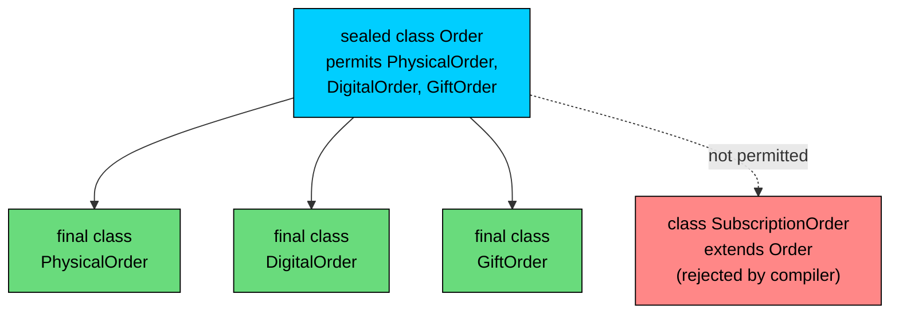
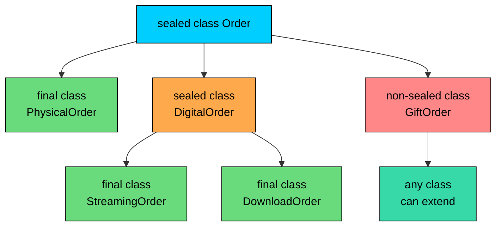

import React from 'react';
import CodeBlock from '../../../../components/ui/CodeBlock';
import Callout from '../../../../components/ui/Callout';

<div className="article-header">
  <div className="breadcrumb">
    <a href="/">Curated Notes</a>
    <span className="breadcrumb-separator">›</span>
    <span className="breadcrumb-current">Sealed Classes</span>
  </div>
  <h1>Sealed Classes</h1>
  <p style={{ color: 'var(--text-muted)', fontSize: '1.1rem', marginBottom: '16px', lineHeight: '1.6' }}>
    Master the essentials of Sealed Classes in this curated guide.
  </p>
  <div className="meta-info">
    <span className="meta-item">
      <svg width="14" height="14" viewBox="0 0 24 24" fill="none" stroke="currentColor" strokeWidth="2"><circle cx="12" cy="12" r="10"/><polyline points="12 6 12 12 16 14"/></svg>
      10 min read
    </span>
    <span className="difficulty-badge difficulty-badge--intermediate">Intermediate</span>
  </div>
</div>

<section className="content-section">

A regular class hierarchy in Java is open. Any class anywhere can extend `Order`, any class can implement `PaymentMethod`, and your code has no way to say "actually, there are only three kinds of these and that's the whole list." Sealed classes and sealed interfaces, added in Java 17, close that door. They let you declare a parent type along with the exact set of direct subtypes the compiler will accept, which gives you a closed family of related types you can reason about, document, and switch over completely.

This lesson covers the `sealed` and `permits` keywords, the three modifiers a permitted subtype must pick from (`final`, `sealed`, `non-sealed`), the location rule that puts the parent and its subtypes in the same package, and the way sealed interfaces combine with records to model a small fixed set of cases. We'll finish with a worked example of an order status modeled as a sealed interface.

---

## The Problem: Hierarchies Are Open by Default

Consider modeling the different kinds of orders an online store handles. A physical order ships through the warehouse, a digital order delivers a download link, and a gift order delivers to a different address than the buyer's. A first cut might look like this.


```java
public class OpenHierarchy {
    public static void main(String[] args) {
        Order order = new PhysicalOrder(1001, "Wireless Mouse");
        describe(order);
    }

    public static void describe(Order order) {
        if (order instanceof PhysicalOrder p) {
            System.out.println("Physical order " + p.orderId + " for " + p.productName);
        } else if (order instanceof DigitalOrder d) {
            System.out.println("Digital order " + d.orderId + " download: " + d.downloadUrl);
        } else if (order instanceof GiftOrder g) {
            System.out.println("Gift order " + g.orderId + " to " + g.recipientName);
        } else {
            System.out.println("Unknown order type");
        }
    }
}

class Order {
    int orderId;
    Order(int orderId) { this.orderId = orderId; }
}

class PhysicalOrder extends Order {
    String productName;
    PhysicalOrder(int orderId, String productName) {
        super(orderId);
        this.productName = productName;
    }
}

class DigitalOrder extends Order {
    String downloadUrl;
    DigitalOrder(int orderId, String downloadUrl) {
        super(orderId);
        this.downloadUrl = downloadUrl;
    }
}

class GiftOrder extends Order {
    String recipientName;
    GiftOrder(int orderId, String recipientName) {
        super(orderId);
        this.recipientName = recipientName;
    }
}
```


The code works, but the `describe` method has an `else` branch for "Unknown order type" that exists because the compiler can't prove the list of subtypes is complete. Tomorrow, anyone with access to `Order` can write `class SubscriptionOrder extends Order { ... }` in a different file, and `describe` will route that new type through the `else` branch.

That open extension is the right default for some designs. For an `Order` type that's part of a public framework where third parties should add their own kinds, you want this. For domain types in your own codebase, you usually don't. You want a fixed list of cases, and you want the compiler to fail your build the moment someone tries to add a fourth one without updating `describe`.

`sealed` is the keyword that gives you that closed list.

---

## The `sealed` and `permits` Keywords

A sealed class declares the exact set of classes that are allowed to extend it. The `permits` clause spells out the list.


```java
public class SealedHierarchy {
    public static void main(String[] args) {
        Order order = new PhysicalOrder(1001, "Wireless Mouse");
        System.out.println("Order id: " + order.orderId);
    }
}

sealed class Order permits PhysicalOrder, DigitalOrder, GiftOrder {
    int orderId;
    Order(int orderId) { this.orderId = orderId; }
}

final class PhysicalOrder extends Order {
    String productName;
    PhysicalOrder(int orderId, String productName) {
        super(orderId);
        this.productName = productName;
    }
}

final class DigitalOrder extends Order {
    String downloadUrl;
    DigitalOrder(int orderId, String downloadUrl) {
        super(orderId);
        this.downloadUrl = downloadUrl;
    }
}

final class GiftOrder extends Order {
    String recipientName;
    GiftOrder(int orderId, String recipientName) {
        super(orderId);
        this.recipientName = recipientName;
    }
}
```


Two new things here. The parent class is `sealed`, and it lists its permitted subtypes after `permits`. Each subtype is `final`, which means the chain stops there. Any attempt to add a fourth subtype outside the `permits` list, anywhere in the codebase, becomes a compile error.

The compiler now has full knowledge: there are exactly three direct subtypes of `Order`. That knowledge unlocks two things. First, anywhere you switch over an `Order`, the compiler can warn you if you missed a case (and in newer Java versions, refuse to compile pattern-matching switches that aren't exhaustive). Second, anyone reading the code can see the complete family of types in one line, instead of grepping the whole project.

The hierarchy as a diagram:





The dashed line shows what `sealed` blocks. Any class not in the `permits` list can't extend `Order`, even if it's in the same package, even if it's `public`, even if it's `final` itself.

---

## Every Permitted Subtype Picks One of Three Modifiers

A permitted subtype must declare itself as exactly one of `final`, `sealed`, or `non-sealed`. The compiler enforces this. The three modifiers control what happens to extension below that subtype.


| Modifier | Meaning | When to use |
| --- | --- | --- |
| `final` | The chain stops. No further subclasses allowed. | Most common. You're done modeling at this level. |
| `sealed` | Keep restricting. This subtype itself has a `permits` list. | When a category splits into a closed set of further cases. |
| `non-sealed` | Re-open the hierarchy from this point. Any class can extend this subtype. | When a category really is open to extension by other code. |


The diagram below uses all three.





`PhysicalOrder` is final. There is no `PartialPhysicalOrder` or `ExpressPhysicalOrder`. `DigitalOrder` is itself sealed and splits further into `StreamingOrder` and `DownloadOrder`. `GiftOrder` is non-sealed, which means we deliberately allow other code (perhaps a separate gifting module) to extend it.

The matching code:


```java
public class ThreeModifiers {
    public static void main(String[] args) {
        Order order = new StreamingOrder(2001, "https://stream.example.com/movie-42");
        System.out.println("Order class: " + order.getClass().getSimpleName());
    }
}

sealed class Order permits PhysicalOrder, DigitalOrder, GiftOrder {
    int orderId;
    Order(int orderId) { this.orderId = orderId; }
}

final class PhysicalOrder extends Order {
    PhysicalOrder(int orderId) { super(orderId); }
}

sealed class DigitalOrder extends Order permits StreamingOrder, DownloadOrder {
    String url;
    DigitalOrder(int orderId, String url) {
        super(orderId);
        this.url = url;
    }
}

final class StreamingOrder extends DigitalOrder {
    StreamingOrder(int orderId, String url) { super(orderId, url); }
}

final class DownloadOrder extends DigitalOrder {
    DownloadOrder(int orderId, String url) { super(orderId, url); }
}

non-sealed class GiftOrder extends Order {
    String recipientName;
    GiftOrder(int orderId, String recipientName) {
        super(orderId);
        this.recipientName = recipientName;
    }
}
```


Read top to bottom: `Order` is sealed and permits three subtypes. Each subtype picks one of the three modifiers. Below `DigitalOrder`, the chain narrows further with its own permits list. Below `GiftOrder`, the chain reopens.

The reason the compiler forces every permitted subtype to pick one of the three is that "sealed" has to mean something at every layer. If a permitted subtype left this unspecified, the closed list at the top would leak through a half-open subtype in the middle, and the guarantees of the seal would vanish.

**What's wrong with this code?**


```java
sealed class PriceAdjustment permits Discount, Surcharge {}

class Discount extends PriceAdjustment {}
class Surcharge extends PriceAdjustment {}
```


**Fix:**


```java
sealed class PriceAdjustment permits Discount, Surcharge {}

final class Discount extends PriceAdjustment {}
final class Surcharge extends PriceAdjustment {}
```


Both `Discount` and `Surcharge` are listed in `PriceAdjustment`'s permits clause, but neither is marked `final`, `sealed`, or `non-sealed`. The compiler reports an error like `sealed, non-sealed or final modifiers expected`. Picking `final` says these are the leaves of the hierarchy.

---

## Sealed Interfaces

Sealed interfaces work the same way as sealed classes, and in practice they are more common. An interface has no constructor or fields to worry about, and many sealed hierarchies model a fixed set of cases that share behavior rather than implementation. A payment method is a classic example.


```java
public class SealedInterfaceExample {
    public static void main(String[] args) {
        PaymentMethod payment = new CreditCard("4111-1111-1111-1111", "12/29");
        System.out.println("Paying with: " + describe(payment));
    }

    public static String describe(PaymentMethod method) {
        if (method instanceof CreditCard c) {
            return "credit card ending " + c.cardNumber().substring(c.cardNumber().length() - 4);
        }
        if (method instanceof PayPal p) {
            return "PayPal account " + p.email();
        }
        if (method instanceof GiftCard g) {
            return "gift card with $" + g.balance() + " left";
        }
        throw new IllegalStateException("Unhandled payment method: " + method);
    }
}

sealed interface PaymentMethod permits CreditCard, PayPal, GiftCard {}

record CreditCard(String cardNumber, String expiry) implements PaymentMethod {}
record PayPal(String email) implements PaymentMethod {}
record GiftCard(String code, double balance) implements PaymentMethod {}
```


The interface `PaymentMethod` is sealed. The three implementations are records, which are implicitly `final`. The implementations satisfy the "every permitted subtype must be `final`, `sealed`, or `non-sealed`" rule automatically.

Combining sealed interfaces with records like this is a popular pattern. The interface names the abstract category. Each record names one concrete variant and carries the data specific to it. You get a small, closed family of value types you can pass around and inspect by type.

This shape, a closed parent type plus a fixed set of variant types, is what functional languages call an **algebraic data type** (ADT). Java doesn't use that term in the spec, but the combination of `sealed` and records is functionally the same thing. The phrase shows up often in articles about modern Java; it means "a sealed interface with a finite, known set of cases."

---

## The Location Rule: Same Package or Same Module

A sealed parent and its permitted subtypes must live close to each other. The exact rule depends on whether your code uses Java modules:

- **In a regular (unnamed) module**, sealed parents and their permitted subtypes must be in the same **package**.
- **In a named module**, they may be in different packages, but they must be in the same **module**.

This is a structural rule the compiler enforces. It exists because sealing only makes sense if you can see all the cases at once. If a subtype lived in a faraway package or a separate module, the sealed parent couldn't reliably know about it, and the closed-list guarantee would weaken.

For most code, the practical version is: keep the parent and the permitted subtypes in the same `.java` source file or in sibling files in the same package directory.

**What's wrong with this code?**


```java
// File: com/store/orders/Order.java
package com.store.orders;

public sealed class Order permits PhysicalOrder {
    int orderId;
    public Order(int orderId) { this.orderId = orderId; }
}
```


```java
// File: com/store/physical/PhysicalOrder.java
package com.store.physical;

import com.store.orders.Order;

public final class PhysicalOrder extends Order {
    public PhysicalOrder(int orderId) { super(orderId); }
}
```


**Fix:**

Move `PhysicalOrder` into the `com.store.orders` package so it sits next to `Order`. The compiler error reads `class is not allowed to extend sealed class: different package`. If you need the subtype in a different package, your project must use Java modules and both packages must be in the same module.

Keep sealed types and their subtypes in the same package.

---

## Exhaustive Switch Over a Sealed Type

The most useful payoff of a sealed type is that the compiler now knows the complete list of cases. Combine that with a switch over the sealed type, and you can write code that handles every case once and is guaranteed to keep handling every case even as the hierarchy changes.

The switch syntax stays light here. The minimum needed to see what sealing buys you:


```java
public class SwitchOverSealed {
    public static void main(String[] args) {
        PaymentMethod payment = new GiftCard("WELCOME10", 25.0);
        System.out.println(describe(payment));
    }

    public static String describe(PaymentMethod method) {
        return switch (method) {
            case CreditCard c -> "Credit card ending " + last4(c.cardNumber());
            case PayPal p     -> "PayPal account " + p.email();
            case GiftCard g   -> "Gift card with $" + g.balance() + " remaining";
        };
    }

    private static String last4(String cardNumber) {
        return cardNumber.substring(cardNumber.length() - 4);
    }
}

sealed interface PaymentMethod permits CreditCard, PayPal, GiftCard {}
record CreditCard(String cardNumber, String expiry) implements PaymentMethod {}
record PayPal(String email) implements PaymentMethod {}
record GiftCard(String code, double balance) implements PaymentMethod {}
```


There's no `default` branch. The switch handles each permitted subtype exactly once, and the compiler accepts that as exhaustive because the sealed declaration tells it the list is complete. If someone later adds `record ApplePay(String deviceId) implements PaymentMethod` and updates the `permits` clause, this switch stops compiling until they handle the new case.

Compare to the same code with an open (non-sealed) parent. There, you'd need a `default` branch or an explicit fallback, because the compiler can't prove you've covered every case. Adding a new subtype somewhere far away would fall through to `default` with no warning, and nothing would alert you that the new variant needs special handling.

Pattern matching in a switch with many cases compiles to fast jump-table dispatch in modern JVMs, similar in cost to a chain of `instanceof` checks. Exhaustiveness is a compile-time property; it doesn't slow down the running program.

The key fact: switch over a sealed type can be exhaustive, and the compiler will enforce it.

---

## Putting It Together: An Order Status Type

A worked example. Model order status as a sealed interface, give each status a record implementation that carries the data specific to it, and write a function that describes any status in a single switch.

The states are: `Placed` (carries a timestamp), `Shipped` (carries a tracking number), `Delivered` (carries a delivery date), and `Cancelled` (carries a reason).


```java
public class OrderStatusDemo {
    public static void main(String[] args) {
        OrderStatus[] history = {
            new Placed("2025-05-13T09:15"),
            new Shipped("TRACK-91022"),
            new Delivered("2025-05-15"),
            new Cancelled("Customer changed mind")
        };

        for (OrderStatus status : history) {
            System.out.println(describe(status));
        }
    }

    public static String describe(OrderStatus status) {
        return switch (status) {
            case Placed p    -> "Order placed at " + p.placedAt();
            case Shipped s   -> "Order shipped, tracking " + s.trackingNumber();
            case Delivered d -> "Order delivered on " + d.deliveredOn();
            case Cancelled c -> "Order cancelled: " + c.reason();
        };
    }
}

sealed interface OrderStatus permits Placed, Shipped, Delivered, Cancelled {}

record Placed(String placedAt) implements OrderStatus {}
record Shipped(String trackingNumber) implements OrderStatus {}
record Delivered(String deliveredOn) implements OrderStatus {}
record Cancelled(String reason) implements OrderStatus {}
```


Four cases, four records, one sealed interface, one exhaustive switch. The whole hierarchy fits in fewer than fifteen lines of declarations. If the business later adds a fifth status (say, `Returned`), there's exactly one place to update the `permits` clause and one place where the compiler will refuse to build the project until `describe` handles the new case.

Why not use an `enum`? Enums also give you a fixed set of values, but each enum constant carries the same fields. With a sealed interface plus records, each variant can carry different data: `Shipped` has a tracking number, `Delivered` has a date, `Cancelled` has a reason, and `Placed` has a timestamp. Enums force every constant to share one field layout, which doesn't fit when the variants have different shapes.

Use enums when every case is interchangeable in structure (`Day.MONDAY`, `Day.TUESDAY`). Use a sealed interface with records when each case carries its own data and you still want a closed list.

---

## Common Mistakes

A few errors come up often when working with sealed types. Knowing the message and the fix saves time.

**Mistake 1: Forgetting to mark a permitted subtype.**


```java
sealed class Notification permits EmailNotification, SmsNotification {}

class EmailNotification extends Notification {}
class SmsNotification extends Notification {}
```


The compiler complains: `sealed, non-sealed or final modifiers expected`. Pick one for each subtype.

**Fix:**


```java
sealed class Notification permits EmailNotification, SmsNotification {}

final class EmailNotification extends Notification {}
final class SmsNotification extends Notification {}
```


**Mistake 2: Extending a sealed type without being in the permits list.**


```java
sealed class ShippingMethod permits StandardShipping, ExpressShipping {}

final class StandardShipping extends ShippingMethod {}
final class ExpressShipping extends ShippingMethod {}

final class OvernightShipping extends ShippingMethod {} // compile error
```


The error reads `class is not allowed to extend sealed class`. The fix is to add `OvernightShipping` to the `permits` clause, or to not extend `ShippingMethod` at all.

**Fix:**


```java
sealed class ShippingMethod permits StandardShipping, ExpressShipping, OvernightShipping {}

final class StandardShipping extends ShippingMethod {}
final class ExpressShipping extends ShippingMethod {}
final class OvernightShipping extends ShippingMethod {}
```


If new subtypes get added to the `permits` list from far-flung parts of the codebase, the sealed type may be the wrong tool. Sealed types fit closed domains where the set of cases is known and small. Truly open extension points belong in regular (or `non-sealed`) classes.

**Mistake 3: Permitted subtype in a different package.**


```java
// File: com/store/orders/Notification.java
package com.store.orders;
public sealed class Notification permits EmailNotification {}

// File: com/store/email/EmailNotification.java
package com.store.email;
import com.store.orders.Notification;
public final class EmailNotification extends Notification {}
```


The error reads `class is not allowed to extend sealed class: different package`. Move the subtype into the parent's package, or move both into a Java module if a cross-package layout is required.

**Fix:**


```java
// File: com/store/orders/Notification.java
package com.store.orders;
public sealed class Notification permits EmailNotification {}

// File: com/store/orders/EmailNotification.java
package com.store.orders;
public final class EmailNotification extends Notification {}
```


**Mistake 4: Treating sealed as a synonym for final.**


```java
public sealed class Coupon {
    public Coupon(String code) {}
}
```


The compiler complains because a sealed class with no `permits` clause and no permitted subtypes in the same file is meaningless. The fix is either to list permitted subtypes or to mark the class as `final` if no extension is allowed.

**Fix (no extension wanted):**


```java
public final class Coupon {
    public Coupon(String code) {}
}
```


**Fix (closed set of extensions):**


```java
public sealed class Coupon permits PercentCoupon, FixedCoupon {
    String code;
    public Coupon(String code) { this.code = code; }
}

public final class PercentCoupon extends Coupon {
    double percent;
    public PercentCoupon(String code, double percent) {
        super(code);
        this.percent = percent;
    }
}

public final class FixedCoupon extends Coupon {
    double amount;
    public FixedCoupon(String code, double amount) {
        super(code);
        this.amount = amount;
    }
}
```


`final` and `sealed` are related but different. `final` allows no extension. `sealed` allows extension by a fixed list.

---

## Sealed Classes vs Enums vs Regular Classes

Compare the three options for modeling a small family of related cases:


| Feature | Regular class hierarchy | `enum` | Sealed interface + records |
| --- | --- | --- | --- |
| Closed list of cases | No | Yes | Yes |
| Each case can carry different data | Yes | No, all constants share fields | Yes |
| Exhaustive switch support | No (needs default) | Yes | Yes |
| Easy to add new case | Yes (no other code changes) | Yes (other code may break) | Yes (other code may break, intentionally) |
| Use when | The set of subtypes is open | Constants with identical shape | Variants with different data and a closed set |


The "other code may break, intentionally" entry is the point. With an enum or sealed type, adding a new case makes the compiler flag every exhaustive switch that doesn't handle it. That's a feature. It's how the type system helps you keep all the call sites in sync.

A regular class hierarchy keeps switches "working" when you add a new subtype, but only by falling through to a `default` branch that probably does the wrong thing for the new case. Silent fallthrough is the failure mode sealed types are designed to prevent.

</section>
