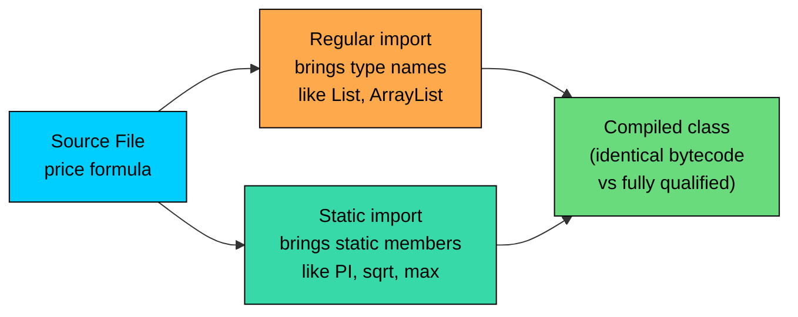

import React from 'react';
import CodeBlock from '../../../../components/ui/CodeBlock';
import Callout from '../../../../components/ui/Callout';

<div className="article-header">
  <div className="breadcrumb">
    <a href="/">Curated Notes</a>
    <span className="breadcrumb-separator">›</span>
    <span className="breadcrumb-current">Static Import</span>
  </div>
  <h1>Static Import</h1>
  <p style={{ color: 'var(--text-muted)', fontSize: '1.1rem', marginBottom: '16px', lineHeight: '1.6' }}>
    Master the essentials of Static Import in this curated guide.
  </p>
  <div className="meta-info">
    <span className="meta-item">
      <svg width="14" height="14" viewBox="0 0 24 24" fill="none" stroke="currentColor" strokeWidth="2"><circle cx="12" cy="12" r="10"/><polyline points="12 6 12 12 16 14"/></svg>
      10 min read
    </span>
    <span className="difficulty-badge difficulty-badge--intermediate">Intermediate</span>
  </div>
</div>

<section className="content-section">

A regular `import` brings a type into scope so you can write `BigDecimal` instead of `java.math.BigDecimal`. A static import goes one step further: it brings the static members of a type into scope so you can write `PI` instead of `Math.PI`, or `sort(list)` instead of `Collections.sort(list)`. This lesson covers what static imports are, the syntax for single-member and wildcard forms, when they make code clearer, when they make code worse, how name conflicts are resolved, and the rules of thumb that keep static imports useful instead of confusing.

---

## The Problem Static Imports Solve

A regular `import` solves the verbosity of writing fully qualified type names. Without it, every reference to a class drags its package along.


```java
public class CartArea {
    public static void main(String[] args) {
        double radius = 3.5;
        double area = java.lang.Math.PI * radius * radius;
        System.out.println("Display area: " + area);
    }
}
```


The classes in `java.lang` are imported automatically, so the example compiles even without an `import` line. The prefix on `Math.PI` is the key detail. Writing `java.lang.Math.PI` makes the expression read as a path through the filesystem more than a math formula.

A regular `import` lets you drop the package prefix:


```java
import java.lang.Math;

public class CartArea {
    public static void main(String[] args) {
        double radius = 3.5;
        double area = Math.PI * radius * radius;
        System.out.println("Display area: " + area);
    }
}
```


Cleaner, but the `Math.` prefix on every constant and method call still grates when an expression involves several of them. A formula that uses `Math.PI`, `Math.sqrt`, and `Math.max` ends up with three `Math.` tokens that carry no real information.


```java
public class TriangleSizer {
    public static void main(String[] args) {
        double a = 3.0;
        double b = 4.0;

        double hypotenuse = Math.sqrt(Math.pow(a, 2) + Math.pow(b, 2));
        double larger = Math.max(a, b);
        double scaled = hypotenuse * Math.PI;

        System.out.println("Hypotenuse: " + hypotenuse);
        System.out.println("Larger side: " + larger);
        System.out.println("Scaled by PI: " + scaled);
    }
}
```


The formula on line 6 reads as `Math.sqrt(Math.pow(a, 2) + Math.pow(b, 2))`. The interesting parts are `sqrt`, `pow`, and the squaring. The repeated `Math.` adds visual noise without telling the reader anything new. A static import lets you remove that noise.

---

## The `import static` Syntax

A static import looks like a regular import with the word `static` added after `import`. The path on the right names a class, then either a specific static member or a wildcard.

The single-member form imports one named static member:


```java
import static java.lang.Math.PI;
```


After that line, the unqualified name `PI` refers to `Math.PI` inside the file. Any other class that also defines a `PI` constant is not affected by this import; you still pay the `Math.` cost for those.

The wildcard form imports every public static member of the class:


```java
import static java.lang.Math.*;
```


After that line, `PI`, `sqrt`, `max`, `pow`, `abs`, `floor`, `ceil`, and every other public static member of `Math` is available unqualified. The wildcard pulls them all in at once.

Both forms can mix freely with regular imports at the top of a file. Conventionally, static imports go after regular imports, separated by a blank line:


```java
import java.util.List;
import java.util.ArrayList;

import static java.lang.Math.PI;
import static java.lang.Math.sqrt;
```


Static imports work on any `public` `static` member, which includes static fields, static methods, and nested types. Constants like `Math.PI`, methods like `Math.sqrt`, and even fields like `System.out` are all eligible. The member must be `static` and visible (`public` for cross-package imports, or package-private for same-package imports).

---

## A Formula Rewritten With Static Imports

Returning to the triangle example, the same code with `Math.PI`, `Math.sqrt`, `Math.pow`, and `Math.max` brought in by static import:


```java
import static java.lang.Math.PI;
import static java.lang.Math.sqrt;
import static java.lang.Math.pow;
import static java.lang.Math.max;

public class TriangleSizer {
    public static void main(String[] args) {
        double a = 3.0;
        double b = 4.0;

        double hypotenuse = sqrt(pow(a, 2) + pow(b, 2));
        double larger = max(a, b);
        double scaled = hypotenuse * PI;

        System.out.println("Hypotenuse: " + hypotenuse);
        System.out.println("Larger side: " + larger);
        System.out.println("Scaled by PI: " + scaled);
    }
}
```


The formula now reads `sqrt(pow(a, 2) + pow(b, 2))`. The math is the only thing on the line. Each member came from a deliberate single-member import, so a reader who wonders "where does `sqrt` come from?" can scan the import block and answer the question in two seconds.

The wildcard version of the same imports looks like this:


```java
import static java.lang.Math.*;
```


That single line replaces the four single-member imports above. The trade-off is that the wildcard pulls in every public static member of `Math`, including names you might not want, like `random`, `min`, `floor`, and `abs`. If any of those clashes with a name in the rest of the file (say, a local method called `abs`), the import either fails or is silently shadowed.

---

## Static Import on Static Fields, Including `System.out`

Static imports work on fields just as well as on methods. `System.out` is a public static field of type `PrintStream` on `java.lang.System`, so it is eligible. The same goes for `System.err` and `System.in`.


```java
import static java.lang.System.out;

public class GreetingPrinter {
    public static void main(String[] args) {
        String customerName = "Priya";
        out.println("Welcome back, " + customerName + "!");
        out.println("Your wishlist has 3 items.");
    }
}
```


After `import static java.lang.System.out`, the unqualified name `out` refers to the same `PrintStream` instance as `System.out`. The two are exactly equivalent at the bytecode level; the static import is just a compile-time alias.

This particular static import is mostly a curiosity. `System.out` is short, well known, and reads fluently as a path from the system to its output stream. Replacing it with a bare `out` removes a single token and asks every reader to remember which `out` is in scope. Most Java codebases leave `System.out` alone. Static imports of fields help more in places where the field is a long-named constant inside a domain class, not on something as short and familiar as `System.out`.

---

## Where Static Imports Are Useful

There are three places where static imports are widely considered an improvement. All three share the same property: the static members being imported are domain vocabulary that the reader is meant to read as the operation itself, not as "a method on a class."

#### Math-Heavy Code

Formulas read more like math when the operations are unqualified. The triangle example above is one. Anything that strings together `sqrt`, `pow`, `sin`, `cos`, `exp`, and `log` is another. A geometric mean of three prices, for example:


```java
import static java.lang.Math.pow;
import static java.lang.Math.cbrt;

public class PriceStats {
    public static void main(String[] args) {
        double p1 = 19.99;
        double p2 = 24.99;
        double p3 = 29.99;

        double product = p1 * p2 * p3;
        double geometricMean = cbrt(product);
        double squared = pow(geometricMean, 2);

        System.out.println("Geometric mean: " + geometricMean);
        System.out.println("Mean squared: " + squared);
    }
}
```


Without the static imports, the body would read `Math.cbrt(product)` and `Math.pow(geometricMean, 2)`. With them, the math operations sit on their own. Code that lives in a numerical helper class often makes this choice everywhere; code that does one calculation in a controller often does not.

#### Test Assertions

Test frameworks like JUnit declare their assertion methods as static methods on a class such as `org.junit.jupiter.api.Assertions`. The intended way to call them is through static import, which is why `assertEquals(expected, actual)` reads as a test step rather than a method call on a utility class.


```java
import static org.junit.jupiter.api.Assertions.assertEquals;
import static org.junit.jupiter.api.Assertions.assertTrue;

public class CartTest {
    public void testCartTotal() {
        int itemCount = 3;
        double price = 19.99;
        double total = itemCount * price;

        assertEquals(59.97, total, 0.001);
        assertTrue(total > 0);
    }
}
```


The example is not runnable on its own (JUnit is a third-party library), but the shape is the point. The assertions read as commands you give the test runner: "assert equals," "assert true." Wrapping each one in `Assertions.assertEquals` and `Assertions.assertTrue` makes the test more verbose without adding clarity, because `assertEquals` is a standard name in test files.

This is the most common use of static imports in real codebases. Almost every Java test suite written in the last fifteen years uses them.

#### DSL-Style Builder APIs

Some libraries are designed around a chain of static methods that read like a small domain-specific language. Mockito, AssertJ, and Hamcrest are common examples; they're built around static method calls that read as English when imported statically.


```java
import static org.assertj.core.api.Assertions.assertThat;

public class CartCheck {
    public void checkCart(double total) {
        assertThat(total).isGreaterThan(0).isLessThan(1000);
    }
}
```


`assertThat(total).isGreaterThan(0)` reads as a sentence. Writing it as `Assertions.assertThat(total).isGreaterThan(0)` interrupts the sentence with a prefix that adds nothing. The library authors made the entry-point static specifically so a static import can drop the prefix.

The pattern works because the static methods are designed to be read as verbs, the class they live on is irrelevant to the meaning, and the names chosen (`assertThat`, `when`, `given`, `verify`) are short and unique enough that a reader doesn't get confused about where they came from.

---

## Where Static Imports Harm Readability

The same mechanism that makes formulas read cleaner can also make general code harder to follow. Static imports remove the qualifying class name, which means a reader can no longer tell, just by looking at the call site, where a method or constant came from.


```java
import static com.shop.OrderCalculator.*;
import static com.shop.Inventory.*;

public class CheckoutFlow {
    public static void main(String[] args) {
        double total = totalFor("cart-42");
        int stock = available("SKU-9");
        boolean ok = canFulfill("cart-42");

        System.out.println("Total: " + total);
        System.out.println("Stock: " + stock);
        System.out.println("Can fulfill: " + ok);
    }
}
```


Without seeing the classes the methods come from, a reader has no idea whether `totalFor` is a pure calculation on a cart, a database query, or a network call. Is `available` checking local stock, calling an inventory service, or both? Is `canFulfill` a quick local check or a transactional reservation? The class name on each call answered those questions at no extra cost; the static import deleted the answer.

For widely-recognized library names (`PI`, `sqrt`, `assertEquals`), the missing prefix doesn't hurt. For application-defined names, the prefix is usually carrying real information about where the call lives. Removing it forces every reader to either know the codebase by heart or chase the import block to find out.

A practical rule that holds up across most codebases: static-import third-party domain vocabulary (`Math`, JUnit, AssertJ, Mockito), but qualify your own application code with the class name unless it is a math-like utility being used inside a focused calculation block.

---

## Name Conflicts and How They Resolve

Static imports introduce a new way for names to collide. Two classes can each declare a static member with the same name, and a file that imports both ends up with an ambiguity.

`Integer.MAX_VALUE` and `Long.MAX_VALUE` are the canonical example. Both are public static fields. Both are named `MAX_VALUE`. If a file tries to static-import both, the unqualified name `MAX_VALUE` cannot refer to both at once.


```java
import static java.lang.Integer.MAX_VALUE;
import static java.lang.Long.MAX_VALUE;

public class Limits {
    public static void main(String[] args) {
        System.out.println(MAX_VALUE);
    }
}
```


This file fails to compile. The error reads:


```shell
error: a type with the same simple name is already defined by the single-type-import of MAX_VALUE
import static java.lang.Long.MAX_VALUE;
^
```


The compiler refuses to silently pick one. The fix is to drop one of the imports and qualify that constant the long way:


```java
import static java.lang.Integer.MAX_VALUE;

public class Limits {
    public static void main(String[] args) {
        System.out.println("Int max: " + MAX_VALUE);
        System.out.println("Long max: " + Long.MAX_VALUE);
    }
}
```


`MAX_VALUE` (unqualified) refers to `Integer.MAX_VALUE` because that's the only one statically imported. `Long.MAX_VALUE` is written the long way, which is fine because it appears once.

Wildcard static imports can produce a less obvious form of the same conflict. If two wildcard static imports each bring in a `MAX_VALUE`, the unqualified `MAX_VALUE` is ambiguous and the file fails to compile at the use site, not at the import line. The error message points at the variable reference and says it could refer to either source.

Static imports also interact with members declared on the same file's class. A local static method takes precedence over a statically imported method of the same name. That's rarely the intended behavior.

**What's wrong with this code?**


```java
import static java.lang.Math.max;

public class MaxDemo {
    public static int max(int a, int b) {
        return a;
    }

    public static void main(String[] args) {
        System.out.println(max(3, 5));
    }
}
```


A caller who imported `Math.max` might expect `5`, but the result is `3` because the local `max` method on `MaxDemo` shadows the imported one. The local method always wins when both are in scope.

**Fix:** Rename one or qualify the call explicitly:


```java
public class MaxDemo {
    public static int pickFirst(int a, int b) {
        return a;
    }

    public static void main(String[] args) {
        System.out.println(Math.max(3, 5));
        System.out.println(pickFirst(3, 5));
    }
}
```


Renaming the local method removes the conflict entirely. If renaming isn't an option, dropping the static import and writing `Math.max` qualifies the call and makes the intent obvious.

---

## Static Import vs Regular Import in One Place

A small comparison brings the difference into focus. Both forms compile to the same bytecode; the difference is purely in how source code reads.


| Aspect | Regular `import` | Static `import` |
| --- | --- | --- |
| What it brings in | A type (class, interface, enum) | A static member of a type |
| Syntax | `import java.util.List;` | `import static java.lang.Math.PI;` |
| Wildcard form | `import java.util.*;` | `import static java.lang.Math.*;` |
| Effect at use site | `List<String>` instead of `java.util.List<String>` | `PI` instead of `Math.PI` |
| Runtime cost | None | None |
| Best for | Bringing types into scope | Bringing well-known constants and methods into scope |


The two are not alternatives. A real file usually mixes them: regular imports for types, static imports for the small set of constants and helpers that read better unqualified.


```java
import java.util.List;
import java.util.ArrayList;

import static java.lang.Math.max;
import static java.lang.Math.min;

public class PriceRange {
    public static void main(String[] args) {
        List<Double> prices = new ArrayList<>();
        prices.add(19.99);
        prices.add(9.99);
        prices.add(29.99);

        double highest = prices.get(0);
        double lowest = prices.get(0);
        for (double price : prices) {
            highest = max(highest, price);
            lowest = min(lowest, price);
        }

        System.out.println("Lowest: $" + lowest);
        System.out.println("Highest: $" + highest);
    }
}
```


`List` and `ArrayList` are types, so they come in through regular imports. `max` and `min` are static methods, so they come in through static imports. Each kind of import handles the job it was designed for.





The diagram captures the two parallel pipelines into the same compiled output. A regular import is a path that brings type names into scope. A static import is a path that brings static members into scope. Both run at compile time, both produce the same bytecode as the fully qualified form, and they coexist freely in the same file.

---

## Static Imports for `Collections` Helpers

`java.util.Collections` is another class whose static members can read well unqualified, particularly inside short utility methods. `Collections.sort` and `Collections.reverse` are the two most familiar examples.


```java
import java.util.ArrayList;
import java.util.List;

import static java.util.Collections.sort;
import static java.util.Collections.reverse;

public class WishlistSorter {
    public static void main(String[] args) {
        List<String> wishlist = new ArrayList<>();
        wishlist.add("Sneakers");
        wishlist.add("Backpack");
        wishlist.add("Headphones");

        sort(wishlist);
        System.out.println("Sorted: " + wishlist);

        reverse(wishlist);
        System.out.println("Reversed: " + wishlist);
    }
}
```


`sort(wishlist)` and `reverse(wishlist)` read as operations applied to the list. The `Collections.` prefix doesn't add information once the reader has seen the imports. The choice is a judgment call: in a class that does heavy collection wrangling, the static imports help; in a class that calls `Collections.sort` once in a method buried under other logic, the prefix probably belongs.

The boundary is where most of the value of this lesson lives. Static imports are a sharp tool. They are neither always good nor always bad. They are good when the unqualified name reads as a familiar operation in the file's domain, and they are bad when the unqualified name forces the reader to guess where the symbol came from.

---

## Best Practices

A short, opinionated list of rules that holds up across most Java code:

- **Prefer single-member imports over wildcards.** `import static java.lang.Math.PI` is precise and self-documenting. `import static java.lang.Math.*` pulls in `random`, `min`, `max`, `floor`, and dozens of other names, some of which may clash with locals you didn't think about.
- **Static-import the well-known utility classes when it improves readability.** `Math`, `Collections`, JUnit's `Assertions`, AssertJ's `Assertions`, and Mockito's `Mockito` are the common cases. Their static methods are designed to be read as verbs.
- **Don't static-import your own application classes.** Production code rarely benefits, because the class name at the call site is doing real work telling the reader where the logic lives. The exception is math-like helpers, where the class name carries no information.
- **Never static-import a name that's ambiguous.** If `MAX_VALUE` could mean `Integer.MAX_VALUE` or `Long.MAX_VALUE` in your file, qualify both. The reader should not have to guess.
- **Keep the import block tidy.** Static imports go after regular imports, separated by a blank line. Most IDEs and formatters enforce this automatically.
- **Read the call site without the imports.** If `assertEquals(expected, actual)` is obvious without the import, the import is paying for itself. If `totalFor("cart-42")` is unclear, the static import is making the file harder to read.

These rules are not laws. A long-running codebase will find exceptions. The goal is for each static import to be a deliberate choice.

---

## A Common Mistake: Wildcard Imports That Shadow Locals

The wildcard form of static import is the easiest way to introduce a quiet shadowing bug. Importing every static member of a class means importing names you didn't think about, some of which might collide with local variables or methods.

**What's wrong with this code?**


```java
import static java.lang.Math.*;

public class PriceClamp {
    public static void main(String[] args) {
        double min = 5.00;
        double max = 50.00;
        double price = 75.00;

        double clamped = min(max(price, min), max);
        System.out.println("Clamped: " + clamped);
    }
}
```


The author wanted `clamped` to be `price` constrained to the range `[min, max]`. The expression looks reasonable. The compiler accepts it. The runtime produces:


```shell
Clamped: 50.0
```


That happens to be the right answer for this specific input, which makes the bug worse: it ships, it passes the smoke test, and it fails later on a different input.

The problem is that `min` and `max` are both local variables (`double` values) and statically imported method names. The expression `min(max(price, min), max)` reads as `Math.min(Math.max(price, min), max)`, which is what the author wanted. But the compiler resolves `min` and `max` differently depending on whether they're used as values or as method calls, and a reader has to follow each token carefully to understand what's happening.

**Fix:** Rename the local variables so they don't share names with imported methods, and prefer single-member imports so the import line names exactly what was intended:


```java
import static java.lang.Math.min;
import static java.lang.Math.max;

public class PriceClamp {
    public static void main(String[] args) {
        double lowerBound = 5.00;
        double upperBound = 50.00;
        double price = 75.00;

        double clamped = min(max(price, lowerBound), upperBound);
        System.out.println("Clamped: " + clamped);
    }
}
```


The locals are now `lowerBound` and `upperBound`. There is no possible confusion between a variable and an imported method. The single-member imports make the import block list exactly the two names that show up in the formula.

Wildcard static imports save typing in the import block at the cost of expanding the namespace silently. For familiar libraries with stable APIs (`Math`, `Collections`), the trade is often fine. For anything else, single-member imports are the safer default.

</section>
