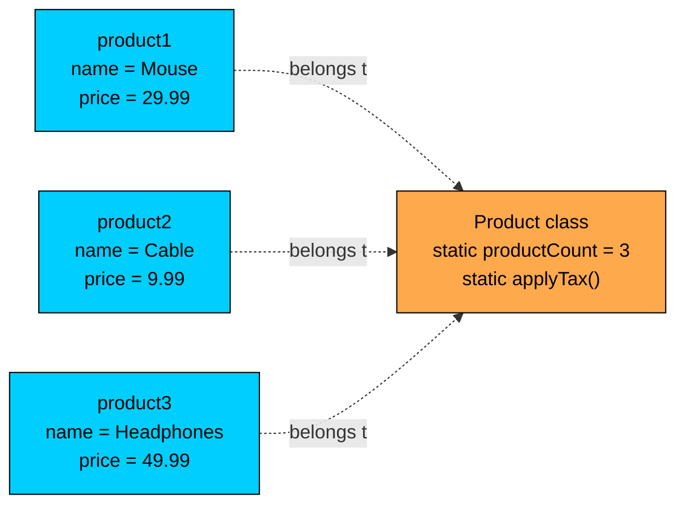
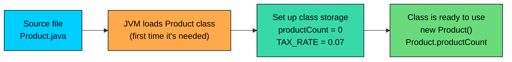

import React from 'react';
import CodeBlock from '../../../../components/ui/CodeBlock';
import Callout from '../../../../components/ui/Callout';

<div className="article-header">
  <div className="breadcrumb">
    <a href="/">Curated Notes</a>
    <span className="breadcrumb-separator">›</span>
    <span className="breadcrumb-current">static Keyword</span>
  </div>
  <h1>static Keyword</h1>
  <p style={{ color: 'var(--text-muted)', fontSize: '1.1rem', marginBottom: '16px', lineHeight: '1.6' }}>
    Master the essentials of static Keyword in this curated guide.
  </p>
  <div className="meta-info">
    <span className="meta-item">
      <svg width="14" height="14" viewBox="0 0 24 24" fill="none" stroke="currentColor" strokeWidth="2"><circle cx="12" cy="12" r="10"/><polyline points="12 6 12 12 16 14"/></svg>
      10 min read
    </span>
    <span className="difficulty-badge difficulty-badge--intermediate">Intermediate</span>
  </div>
</div>

<section className="content-section">

So far, almost every field and method you've written has belonged to a specific object. Each `Cart` has its own `items`, each `Customer` has their own `email`. But some data and behavior don't belong to any single object. There's only one running count of how many `Product` instances have ever been created. There's only one `applyTax` helper, and it doesn't need a particular order to do its job. The `static` keyword is how Java lets you put fields and methods on the class itself rather than on every instance.

---

## What `static` Actually Means

A regular (non-`static`) member belongs to each object. Build ten `Product` instances and you get ten copies of every instance field, one per object. A `static` member is different: it belongs to the class itself, and there is exactly one copy of it shared across every instance.

The class is a kind of container that exists once in memory. Instance fields live inside each object built from the class. Static fields live inside the container, alongside the methods and the class metadata. Every access to the class sees the same shared storage.





The three `Product` objects each have their own `name` and `price`. The class itself owns `productCount` and `applyTax`. Every object can reach the class-level storage, but there is only ever one copy of it, no matter how many products you build.

The same idea applies whether you're talking about fields or methods. A `static` field is one shared variable. A `static` method is one function that runs without needing any particular instance.

---

## Static Fields

A static field is declared with the `static` keyword in front of the type. Once declared, it lives in one place and every line of code in the program that mentions it is reading from or writing to the same memory.


```java
public class Product {
    static int productCount = 0;

    String name;
    double price;

    public Product(String name, double price) {
        this.name = name;
        this.price = price;
        productCount++;
    }

    public static void main(String[] args) {
        new Product("Wireless Mouse", 29.99);
        new Product("USB Cable", 9.99);
        new Product("Headphones", 49.99);

        System.out.println("Total products created: " + Product.productCount);
    }
}
```


`productCount` is one slot. Each constructor reads its current value, adds 1, and writes back. By the time `main` prints, three constructor calls have each bumped that single shared counter, so it reads `3`.

Compare this to the same code with an instance field instead of a static field.


```java
public class BrokenCounter {
    int productCount = 0;

    String name;

    public BrokenCounter(String name) {
        this.name = name;
        productCount++;
    }

    public static void main(String[] args) {
        BrokenCounter a = new BrokenCounter("Wireless Mouse");
        BrokenCounter b = new BrokenCounter("USB Cable");
        BrokenCounter c = new BrokenCounter("Headphones");

        System.out.println("a.productCount = " + a.productCount);
        System.out.println("b.productCount = " + b.productCount);
        System.out.println("c.productCount = " + c.productCount);
    }
}
```


Every object got its own counter, and each constructor only bumped that object's copy. The class never had a single shared total. A counter that exists per-object isn't really a counter at all, it's just a yes/no flag for "did this object's constructor run".

Static fields are useful whenever the data conceptually belongs to the class as a whole:

- A counter of how many instances exist.
- A registry of all objects ever created, so other code can look one up.
- A shared cache or lookup table.
- A configuration value like a tax rate that's the same for every order in the system.


```java
public class Cart {
    static double TAX_RATE = 0.07;

    double subtotal;

    public Cart(double subtotal) {
        this.subtotal = subtotal;
    }

    public double totalWithTax() {
        return subtotal + (subtotal * TAX_RATE);
    }

    public static void main(String[] args) {
        Cart cartA = new Cart(100.00);
        Cart cartB = new Cart(250.00);

        System.out.println("Cart A total: $" + cartA.totalWithTax());
        System.out.println("Cart B total: $" + cartB.totalWithTax());

        Cart.TAX_RATE = 0.09;

        System.out.println("After rate change:");
        System.out.println("Cart A total: $" + cartA.totalWithTax());
        System.out.println("Cart B total: $" + cartB.totalWithTax());
    }
}
```


Both carts pick up the new `TAX_RATE` the instant it changes, because both reach into the same single slot on the class. There's no per-cart copy to update.

A constant rate like this is exactly the kind of value you'd write as `static final` to lock it in. Here's a one-liner taste so you see the idiom.


```java
public class TaxedCart {
    static final double TAX_RATE = 0.07;

    public static double totalWithTax(double subtotal) {
        return subtotal + (subtotal * TAX_RATE);
    }

    public static void main(String[] args) {
        System.out.println("Total: $" + totalWithTax(100.00));
    }
}
```


The `final` keyword marks `TAX_RATE` as a one-time assignment. Once set, no code can reassign it, and the compiler enforces that at every call site. The shape (`static final` constant at the top of the class) is common across Java codebases.

A static field is read and written from anywhere in the program, including from multiple threads at the same time. In single-threaded code, this is safe. Once threads enter the picture, shared mutable state on a class becomes a hazard and needs synchronization. Keep mutable static fields rare. Use `static final` constants whenever the value never has to change.

---

## Static Methods

A static method is declared the same way: put `static` in front of the return type. The method belongs to the class, not to an instance. You don't need an object to call it.


```java
public class CartMath {
    public static double applyTax(double amount, double rate) {
        return amount + (amount * rate);
    }

    public static double applyDiscount(double amount, double percentOff) {
        return amount * (1 - percentOff / 100);
    }

    public static void main(String[] args) {
        double subtotal = 200.00;
        double afterDiscount = CartMath.applyDiscount(subtotal, 15);
        double afterTax = CartMath.applyTax(afterDiscount, 0.07);

        System.out.println("Subtotal: $" + subtotal);
        System.out.println("After 15% off: $" + afterDiscount);
        System.out.println("After 7% tax: $" + afterTax);
    }
}
```


`applyTax` and `applyDiscount` don't depend on any particular cart or product. They take everything they need as parameters and return a result. That's the classic shape of a static method: pure logic with no per-object state.

Library helpers you've already used follow this same pattern:

- `Math.max(a, b)` returns the larger of two numbers without needing a `Math` instance.
- `Math.round(price)` rounds a value the same way every time.
- `Integer.parseInt("42")` converts a string into an `int`.
- `String.valueOf(99.95)` turns any value into its string form.

None of those require building an object first. The class name plus the method name is the full call.


```java
public class HelperUsage {
    public static void main(String[] args) {
        int higherCount = Math.max(5, 12);
        double roundedPrice = Math.round(29.95);
        int parsedQuantity = Integer.parseInt("7");
        String priceLabel = String.valueOf(49.99);

        System.out.println("Higher count: " + higherCount);
        System.out.println("Rounded price: $" + roundedPrice);
        System.out.println("Parsed quantity: " + parsedQuantity);
        System.out.println("Price label: " + priceLabel);
    }
}
```


A static method is also the natural home for a **factory method**, a method whose job is to build and return a new object. Factories let you give the construction step a meaningful name and run a little setup logic before handing the object back.


```java
public class Cart {
    String customerName;
    double subtotal;

    private Cart(String customerName, double subtotal) {
        this.customerName = customerName;
        this.subtotal = subtotal;
    }

    public static Cart empty(String customerName) {
        return new Cart(customerName, 0.0);
    }

    public static Cart withSubtotal(String customerName, double subtotal) {
        return new Cart(customerName, subtotal);
    }

    public static void main(String[] args) {
        Cart guestCart = Cart.empty("Alice");
        Cart resumedCart = Cart.withSubtotal("Bob", 149.95);

        System.out.println(guestCart.customerName + ": $" + guestCart.subtotal);
        System.out.println(resumedCart.customerName + ": $" + resumedCart.subtotal);
    }
}
```


The factory names (`empty`, `withSubtotal`) read more clearly at the call site than two unlabeled constructor overloads would. Reading `Cart.empty("Alice")` tells you immediately what kind of cart you're getting.

---

## Calling Static Members

You can call a static method or read a static field in two ways: through the class name, or through any instance of the class. They both compile, but they aren't equally good.


```java
public class CallStyles {
    static int productCount = 0;

    String name;

    public CallStyles(String name) {
        this.name = name;
        productCount++;
    }

    public static void resetCount() {
        productCount = 0;
    }

    public static void main(String[] args) {
        CallStyles a = new CallStyles("Wireless Mouse");
        CallStyles b = new CallStyles("USB Cable");

        System.out.println("Via class:    " + CallStyles.productCount);
        System.out.println("Via instance: " + a.productCount);
        System.out.println("Via instance: " + b.productCount);

        CallStyles.resetCount();
        System.out.println("After reset:  " + CallStyles.productCount);
    }
}
```


Both `a.productCount` and `b.productCount` read the same shared slot, so they give the same number. So does `CallStyles.productCount`. But `a.productCount` looks like it's reading something stored inside `a`, which it isn't. The instance variable doesn't actually matter; the compiler resolves the access on the type of `a`, not on the object itself. You can prove that by reading a static field through a `null` reference: the read still works because the object is never touched.

The convention is firm: **always use `ClassName.member` to access static members**. It makes the static nature obvious at the call site. A reader scanning `CallStyles.productCount` sees the class right there in the expression and knows the field is shared, not per-object. Most IDEs warn when you use the instance form.


```java
public class WeirdAccess {
    static int productCount = 0;

    public static void main(String[] args) {
        WeirdAccess obj = null;
        // The next line works. The compiler reads productCount via the
        // declared type of obj, never dereferences obj itself.
        System.out.println("Count: " + obj.productCount);
    }
}
```


If `productCount` were an instance field, that line would throw `NullPointerException`. Because it's static, the access never goes through the reference. That's a quirk, not a feature to use. Always prefer the class-name form.


```java
public class CleanAccess {
    static int productCount = 0;

    public static void main(String[] args) {
        System.out.println("Count: " + CleanAccess.productCount);
    }
}
```


Same result, but now the code says what it means.

---

## What Static Methods Can and Cannot Do

A static method runs without an instance. There is no `this` available inside it, because no object called the method. That single fact drives every restriction on static methods.

Inside a static method, you cannot:

- Use `this`. There is no current object.
- Read or write an instance field directly. Those fields belong to a specific object, and the static method doesn't know which one.
- Call an instance method directly. Same reason.

You can:

- Read and write any static field of the class.
- Call any other static method of the class.
- Use any object that's handed to you (as a parameter, a local variable, or a static field).

A class that respects those rules:


```java
public class InventoryReport {
    static int totalUnits = 0;

    int unitsInStock;
    String productName;

    public InventoryReport(String productName, int unitsInStock) {
        this.productName = productName;
        this.unitsInStock = unitsInStock;
        totalUnits += unitsInStock;
    }

    public static int getTotalUnits() {
        return totalUnits;
    }

    public static void printStock(InventoryReport report) {
        System.out.println(report.productName + ": " + report.unitsInStock + " in stock");
    }

    public static void main(String[] args) {
        InventoryReport a = new InventoryReport("Wireless Mouse", 20);
        InventoryReport b = new InventoryReport("USB Cable", 35);

        printStock(a);
        printStock(b);
        System.out.println("Total units across all products: " + getTotalUnits());
    }
}
```


`getTotalUnits` reads only the static field, which is fine. `printStock` reads `productName` and `unitsInStock` through the `report` parameter. That works because the method has an explicit object to look at. It would not work if you tried to read `productName` with no object reference, because the method has no implicit "current" product.

**What's wrong with this code?**


```java
public class BrokenReport {
    String productName;
    int unitsInStock;

    public BrokenReport(String productName, int unitsInStock) {
        this.productName = productName;
        this.unitsInStock = unitsInStock;
    }

    public static void printStock() {
        System.out.println(productName + ": " + unitsInStock);
    }
}
```


The compiler refuses:


```shell
error: non-static variable productName cannot be referenced from a static context
error: non-static variable unitsInStock cannot be referenced from a static context
```


`printStock` is `static`, so no object was passed in. There is no current instance whose `productName` could be read. The fix is to either pass the object explicitly, or make `printStock` an instance method.

**Fix:**


```java
public class FixedReport {
    String productName;
    int unitsInStock;

    public FixedReport(String productName, int unitsInStock) {
        this.productName = productName;
        this.unitsInStock = unitsInStock;
    }

    public static void printStock(FixedReport report) {
        System.out.println(report.productName + ": " + report.unitsInStock);
    }

    public static void main(String[] args) {
        FixedReport mouse = new FixedReport("Wireless Mouse", 20);
        FixedReport.printStock(mouse);
    }
}
```


Now `printStock` has a specific `FixedReport` to look at, passed in as a parameter. The static method's "no current instance" rule still holds, but the rule doesn't say a static method can't work with objects at all. It says it can't work with an implicit one.

Another common version of the same mistake involves `this`.

**What's wrong with this code?**


```java
public class Greeter {
    String customerName;

    public Greeter(String customerName) {
        this.customerName = customerName;
    }

    public static void greet() {
        System.out.println("Hello, " + this.customerName);
    }
}
```


The error reads:


```shell
error: non-static variable this cannot be referenced from a static context
```


`this` means "the object whose method is running". A static method isn't running on any object, so there's nothing `this` could refer to. The fix follows the same pattern as before.

**Fix:**


```java
public class Greeter {
    String customerName;

    public Greeter(String customerName) {
        this.customerName = customerName;
    }

    public static void greet(Greeter greeter) {
        System.out.println("Hello, " + greeter.customerName);
    }

    public static void main(String[] args) {
        Greeter alice = new Greeter("Alice");
        Greeter.greet(alice);
    }
}
```


Pass the object in explicitly. If you find yourself doing this often, it's a sign the method probably wants to be an instance method, not a static one.

There's no rule in the other direction. An **instance method** can read and write static fields, call static methods, and use `this`. Static members are accessible from everywhere, including from inside instance methods.


```java
public class Order {
    static int orderCount = 0;

    int orderId;
    double total;

    public Order(double total) {
        orderCount++;
        this.orderId = orderCount;
        this.total = total;
    }

    public void printSummary() {
        System.out.println("Order #" + orderId + " ($" + total + "), total orders so far: " + orderCount);
    }

    public static void main(String[] args) {
        new Order(49.99).printSummary();
        new Order(129.50).printSummary();
        new Order(19.95).printSummary();
    }
}
```


`printSummary` is an instance method, so it can read both instance fields (`orderId`, `total`) and the static field (`orderCount`). The static counter doubles as an auto-incrementing ID generator, a common pattern in early prototypes.

---

## Where Static Fields Live in Memory

A static field is stored once per class, in a region of memory associated with the class itself. Instance fields live inside each object on the heap. Static fields live in class-level storage that the JVM creates when the class is **loaded**.

A class is loaded the first time the program needs it: the first time you create an instance, call a static method, or read a static field. At that moment, the JVM reads the class file, sets aside the class-level storage, and runs the initializers for every static field in source order.





The static area is created once. From there on, every access to a static field on that class reads the same slot, and every static method runs against the same shared state. Instance fields, by contrast, get fresh storage every time you call `new`.

The deep details of class loading and where exactly the class-level storage lives in the JVM are a topic of their own. The takeaway:

- Static fields are initialized **once**, when the class is loaded.
- They live for the entire run of the program (unless the class is unloaded, which is rare).
- All instances see the same shared slot.

For more elaborate setup than a single initializer expression can handle, for example, populating a static lookup table from a loop, **static initializer blocks** are appropriate. They run at class-load time, in the same step as the field initializers.

---

## When to Use `static`

Use `static` when the field or method belongs to the class as a whole, not to any particular instance.


| Use static for | Don't use static for |
| --- | --- |
| Utility/helper methods that compute from arguments alone | Methods that need data from a specific object |
| Counters, registries, caches shared across all instances | Per-object state like `name`, `email`, `cart contents` |
| Factory methods that build and return objects | Behavior that varies between instances |
| Constants (`static final` values) | Anything that should be different for each instance |


A few concrete e-commerce examples that fit cleanly:

- `Product.productCount` keeps track of how many products have been created.
- `Cart.applyTax(amount, rate)` computes a tax without needing a cart.
- `Order.nextOrderId()` returns the next ID from a shared counter.
- `Cart.empty(customerName)` is a factory that builds an empty cart.
- `Cart.TAX_RATE` is a shared constant used by every cart.

A few that shouldn't be static:

- `cart.addItem(product)` belongs to a specific cart.
- `order.markShipped()` belongs to a specific order.
- `customer.applyLoyaltyDiscount()` depends on this customer's loyalty points.

The simplest test: would the method ever need different behavior depending on which object called it? If yes, it's an instance method. If the only inputs are the arguments, it's a static method.


```java
public class OrderIdGenerator {
    static int nextId = 1001;

    public static int nextOrderId() {
        return nextId++;
    }

    public static void main(String[] args) {
        System.out.println("Next: " + nextOrderId());
        System.out.println("Next: " + nextOrderId());
        System.out.println("Next: " + nextOrderId());
    }
}
```


There's only one running ID counter for the whole program, so a static field and a static method are appropriate. Hanging the counter off a specific `OrderIdGenerator` instance would complicate things, since the counter has nothing to do with any one generator.

---

## A Worked Example

A small program that uses static fields and methods alongside instance state. The class tracks how many `Order` objects have been created, generates new IDs from a shared counter, and offers a static helper for computing totals with tax.


```java
public class Order {
    static int orderCount = 0;
    static final double TAX_RATE = 0.07;

    int orderId;
    String customerName;
    double subtotal;

    public Order(String customerName, double subtotal) {
        orderCount++;
        this.orderId = orderCount;
        this.customerName = customerName;
        this.subtotal = subtotal;
    }

    public static double withTax(double amount) {
        return amount + (amount * TAX_RATE);
    }

    public static int howManyOrders() {
        return orderCount;
    }

    public void printReceipt() {
        double total = withTax(subtotal);
        System.out.println("Order #" + orderId + " for " + customerName);
        System.out.println("  Subtotal: $" + subtotal);
        System.out.println("  Total:    $" + total);
    }

    public static void main(String[] args) {
        Order alice = new Order("Alice", 49.99);
        Order bob = new Order("Bob", 129.50);
        Order carol = new Order("Carol", 19.95);

        alice.printReceipt();
        bob.printReceipt();
        carol.printReceipt();

        System.out.println("Total orders placed: " + Order.howManyOrders());
        System.out.println("Tax on $200: $" + (Order.withTax(200) - 200));
    }
}
```


Three details:

- `orderCount` and `TAX_RATE` are shared. Each constructor reads and updates the same counter, and every receipt reads the same tax rate.
- `withTax` is a static helper called from inside an instance method (`printReceipt`). Instance methods can freely call static ones.
- `howManyOrders` and `withTax` are called through `Order.` from `main`. That makes their static nature visible to anyone reading the code.

Putting `withTax` inside `printReceipt` and calling it without an instance works because both methods live in the same class. The class-name form (`Order.withTax`) is more explicit, especially when reading code from outside the class.

</section>
