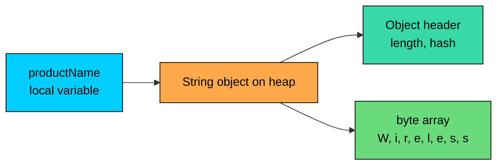

import React from 'react';
import CodeBlock from '../../../../components/ui/CodeBlock';
import Callout from '../../../../components/ui/Callout';

<div className="article-header">
  <div className="breadcrumb">
    <a href="/">Curated Notes</a>
    <span className="breadcrumb-separator">›</span>
    <span className="breadcrumb-current">String Basics</span>
  </div>
  <h1>String Basics</h1>
  <p style={{ color: 'var(--text-muted)', fontSize: '1.1rem', marginBottom: '16px', lineHeight: '1.6' }}>
    Master the essentials of String Basics in this curated guide.
  </p>
  <div className="meta-info">
    <span className="meta-item">
      <svg width="14" height="14" viewBox="0 0 24 24" fill="none" stroke="currentColor" strokeWidth="2"><circle cx="12" cy="12" r="10"/><polyline points="12 6 12 12 16 14"/></svg>
      10 min read
    </span>
    <span className="difficulty-badge difficulty-badge--intermediate">Intermediate</span>
  </div>
</div>

<section className="content-section">

A `String` in Java is how we hold text: a product name, a customer email, an order status, a city in a shipping address. Almost every program touches strings somewhere, and Java has more rules around them than around any other built-in type. This lesson covers what a `String` actually is, the two ways to create one, the core methods you'll use every day, and the small pitfalls that catch beginners.

---

## What a `String` Is

A `String` is an object of type `java.lang.String`. Unlike `int` or `double`, it is not a primitive. The variable on your side holds a reference, and the actual character data lives on the heap inside the `String` object.


```java
public class WhatIsAString {
    public static void main(String[] args) {
        String productName = "Wireless Mouse";
        System.out.println("Product: " + productName);
        System.out.println("Type:    " + productName.getClass().getName());
    }
}
```


`getClass().getName()` returns the fully qualified class name. Every string you write, even a short literal like `"Wireless Mouse"`, is an instance of `java.lang.String`. The `String` class is so common that Java imports it automatically. You never have to write `import java.lang.String;` at the top of your file.

Internally, a `String` is a sequence of characters. Java uses UTF-16, which means each character position represents a 16-bit code unit. Most everyday characters (English letters, digits, common punctuation) fit in a single code unit. A few characters, like some emojis or rare scripts, take two code units. A `String` is an ordered list of characters with the first character at position `0`.

Since Java 9, the JVM stores the character data as a `byte[]` rather than a `char[]` when the string contains only Latin-1 characters (the standard ASCII set plus a few extras). This is called Compact Strings, and it cuts memory use roughly in half for typical English text. It's an implementation detail you don't have to manage yourself.





The variable on the left is just a reference. The object on the heap holds a small header and the backing array with the actual character data.

---

## Two Ways to Create a String

Java gives you two ways to write down a new string.

The first is a string literal, which is just text between double quotes.


```java
public class StringLiteral {
    public static void main(String[] args) {
        String productName = "Laptop Stand";
        System.out.println(productName);
    }
}
```


The second is the `new String(...)` constructor, which explicitly asks the JVM to allocate a fresh `String` object.


```java
public class StringWithNew {
    public static void main(String[] args) {
        String productName = new String("Laptop Stand");
        System.out.println(productName);
    }
}
```


Both lines produce a `String` whose characters are `Laptop Stand`, and you can use both variables the same way. The difference is what happens inside the JVM. The literal form reuses a shared instance from a structure called the string pool, while `new String(...)` always allocates a brand-new object on the heap, even if an identical string already exists in the pool. That distinction matters when you compare strings with `==` versus `.equals()`.

One practical rule: prefer the literal form. It's shorter, common across Java codebases, and lets the JVM share memory across copies of the same text.

Each `new String("text")` allocates a fresh object on the heap, even when an identical literal already exists in the pool. In a tight loop, that adds up. Use the literal form unless you need a distinct object.

The `String` class has several other constructors too, including one that takes a `char[]` and one that takes a `byte[]`.

---

## `length()` and `charAt(int)`

Two methods show up everywhere: `length()` tells you how many characters a string has, and `charAt(i)` returns the character at position `i`.


```java
public class LengthAndCharAt {
    public static void main(String[] args) {
        String productName = "Laptop";
        System.out.println("Length:    " + productName.length());
        System.out.println("First:     " + productName.charAt(0));
        System.out.println("Last:      " + productName.charAt(productName.length() - 1));
    }
}
```


`length()` has parentheses. That's a difference from arrays, where `arr.length` is a field with no parens. For strings, `length()` is a method. Both run in constant time, but the syntax differs and the compiler will not let you mix them up.


| Type     | Syntax        | What it returns                  |
| -------- | ------------- | -------------------------------- |
| Array    | `arr.length`  | The fixed size of the array      |
| `String` | `str.length()` | The number of characters         |


Indexing into a string follows the same rules as indexing into an array. The first character is at position `0`, and the last character is at position `length() - 1`. Going outside that range throws `StringIndexOutOfBoundsException`.


```java
public class CharAtBounds {
    public static void main(String[] args) {
        String orderStatus = "Shipped";
        System.out.println(orderStatus.charAt(0));
        System.out.println(orderStatus.charAt(orderStatus.length() - 1));
        // System.out.println(orderStatus.charAt(7)); // throws StringIndexOutOfBoundsException
    }
}
```


The commented line would throw, because the valid indices for `"Shipped"` are `0` through `6`. Index `7` is one past the end.

Both `length()` and `charAt(i)` run in O(1). The length is stored once when the string is constructed, and `charAt(i)` is a direct lookup into the backing array.

A common pattern is to walk through every character with a simple loop.


```java
public class WalkCharacters {
    public static void main(String[] args) {
        String customerName = "Alice";
        for (int i = 0; i < customerName.length(); i++) {
            char c = customerName.charAt(i);
            System.out.println("Position " + i + ": " + c);
        }
    }
}
```


This pattern is how a lot of string-processing code starts: a loop, an index, a `charAt` call.

---

## `isEmpty()` and `isBlank()`

Two short methods check whether a string contains any useful content.

`isEmpty()`, available since Java 6, returns `true` when the string has zero characters. It's just shorthand for `str.length() == 0`.


```java
public class IsEmptyExample {
    public static void main(String[] args) {
        String emptySearch = "";
        String realSearch = "wireless mouse";
        System.out.println("emptySearch.isEmpty(): " + emptySearch.isEmpty());
        System.out.println("realSearch.isEmpty():  " + realSearch.isEmpty());
    }
}
```


`isBlank()`, added in Java 11, goes one step further. It returns `true` when the string has zero characters **or** every character is a whitespace character (spaces, tabs, newlines, and other Unicode whitespace).


```java
public class IsBlankExample {
    public static void main(String[] args) {
        String emptyReview = "";
        String spacesReview = "    ";
        String realReview = "Great product";

        System.out.println("emptyReview.isBlank():  " + emptyReview.isBlank());
        System.out.println("spacesReview.isBlank(): " + spacesReview.isBlank());
        System.out.println("realReview.isBlank():   " + realReview.isBlank());
    }
}
```


Use `isEmpty()` to check strictly whether there are zero characters. Use `isBlank()` when whitespace-only input should count as empty, which fits user-entered fields like search boxes, review text, or coupon codes. A customer who types four spaces into a search bar didn't really search for anything.


| Input          | `isEmpty()` | `isBlank()` |
| -------------- | ----------- | ----------- |
| `""`           | `true`      | `true`      |
| `" "`          | `false`     | `true`      |
| `"\t\n"`       | `false`     | `true`      |
| `"a"`          | `false`     | `false`     |
| `" hello "`    | `false`     | `false`     |


Neither method handles `null`. If the variable might be `null`, check that first, which the last section of this lesson covers.

---

## Concatenation with `+`

You can join two strings with the `+` operator. The result is a new string containing the characters of the left operand followed by the characters of the right.


```java
public class BasicConcat {
    public static void main(String[] args) {
        String firstName = "Alice";
        String lastName = "Khan";
        String fullName = firstName + " " + lastName;
        System.out.println("Customer: " + fullName);
    }
}
```


The expression `firstName + " " + lastName` builds the full name in two steps: first it joins `"Alice"` and `" "` into `"Alice "`, then it joins `"Alice "` and `"Khan"` into `"Alice Khan"`. Each step produces a new `String` object, because strings in Java cannot be modified after creation. That immutability property is worth understanding in its own right.

The `+` operator also works when one side is a string and the other is a number, a boolean, or any other type. Java converts the non-string operand to a `String` automatically before joining.


```java
public class ConcatWithNumbers {
    public static void main(String[] args) {
        String productName = "USB Cable";
        double price = 9.99;
        int stock = 42;
        boolean inStock = true;

        String summary = productName + " | $" + price + " | stock: " + stock + " | available: " + inStock;
        System.out.println(summary);
    }
}
```


The price, stock count, and boolean were each turned into their text form before being glued onto the rest of the string. This is convenient, but it can surprise users in one case: when the expression starts with two numbers.


```java
public class ConcatGotcha {
    public static void main(String[] args) {
        System.out.println("Total items: " + 2 + 3);
        System.out.println("Total items: " + (2 + 3));
    }
}
```


In the first line, Java reads left to right. It sees `"Total items: " + 2`, treats that as a string operation, produces `"Total items: 2"`, then concatenates `3` onto that, producing `"Total items: 23"`. In the second line, the parentheses force `2 + 3` to be evaluated as integer addition first, giving `5`, which then gets concatenated. When mixing numbers and strings, parentheses around arithmetic save you from this trap.

Each `+` between strings allocates a new `String` object. For a handful of concatenations like a customer name or a status line, this cost is invisible. For long loops that build up text piece by piece, it adds up fast, and you'll want `StringBuilder` instead.

---

## Converting Between `String` and `char[]`

A `String` is a sequence of characters, and sometimes you need to work with that sequence as a raw `char[]`. The method `toCharArray()` gives you exactly that.


```java
public class StringToCharArray {
    public static void main(String[] args) {
        String productCode = "MOUSE";
        char[] letters = productCode.toCharArray();

        System.out.println("Length: " + letters.length);
        System.out.println("First:  " + letters[0]);
        System.out.println("Last:   " + letters[letters.length - 1]);
    }
}
```


`toCharArray()` allocates a new `char[]` of the right size and copies every character from the string into it. The array is independent: writing to a slot in `letters` does not change the original string. That makes sense, because strings can never change anyway.

Going the other direction is just as easy. The constructor `new String(char[])` builds a string from an array of characters.


```java
public class CharArrayToString {
    public static void main(String[] args) {
        char[] letters = {'C', 'A', 'R', 'T'};
        String productCode = new String(letters);
        System.out.println("Product code: " + productCode);
        System.out.println("Length:       " + productCode.length());
    }
}
```


The constructor copies the array into a new `String` object. Modifying `letters` afterward will not affect the string.


```java
public class StringCopyProof {
    public static void main(String[] args) {
        char[] letters = {'C', 'A', 'R', 'T'};
        String productCode = new String(letters);
        letters[0] = 'D';
        System.out.println("Array now: " + new String(letters));
        System.out.println("String:    " + productCode);
    }
}
```


Even after we changed `letters[0]`, the string still reads `"CART"`. The two are decoupled.

These conversions matter for two common situations. The first is when an algorithm needs random read access to individual characters (a `char[]` is sometimes easier to reason about than calling `charAt` over and over). The second is when you're building a string one character at a time from arbitrary sources. Many interview problems use `toCharArray()` as their first line.

Both `toCharArray()` and `new String(char[])` allocate a new array or a new string and copy every character. They are O(n) in the length. Don't call them in a loop if you can avoid it.

---

## `String.valueOf(...)` and `toString()`

Converting other types into a `String` comes up often. A price has to be displayed in a confirmation message. A stock count has to be written into a log line. Java offers two related tools for this: the static method `String.valueOf(...)` and the instance method `toString()`.

`String.valueOf(...)` is overloaded for every primitive type and for `Object`. Pass any value and it returns the text form.


```java
public class ValueOfBasics {
    public static void main(String[] args) {
        String priceText = String.valueOf(29.99);
        String stockText = String.valueOf(42);
        String availableText = String.valueOf(true);

        System.out.println("Price as text: '" + priceText + "'");
        System.out.println("Stock as text: '" + stockText + "'");
        System.out.println("Flag as text:  '" + availableText + "'");
    }
}
```


Each call produces a `String` whose characters match the printed form of the value. `29.99` becomes `"29.99"`, `42` becomes `"42"`, and `true` becomes `"true"`. The single quotes in the output are just there to make the boundaries of the string visible.

For object references, every class inherits a `toString()` method from `Object`. The default implementation returns something like `ClassName@hashcode`, which is rarely useful, so well-designed classes override it to return a sensible text form. The `String` class itself defines `toString()` to return the string itself.


```java
public class ToStringExample {
    public static void main(String[] args) {
        Integer stock = 42;
        Double price = 9.99;

        String stockText = stock.toString();
        String priceText = price.toString();

        System.out.println("Stock: " + stockText);
        System.out.println("Price: " + priceText);
    }
}
```


`String.valueOf(x)` and `x.toString()` usually produce the same output for non-null `x`. There's one important difference: `String.valueOf(null)` returns the literal string `"null"`, while calling `.toString()` on a `null` reference throws `NullPointerException`.


```java
public class ValueOfNull {
    public static void main(String[] args) {
        String maybe = null;
        System.out.println("Via valueOf: " + String.valueOf(maybe));
        // System.out.println(maybe.toString()); // throws NullPointerException
    }
}
```


`String.valueOf(...)` is the safer default when the value might be `null`.


| Call                      | Behavior on `null`                |
| ------------------------- | --------------------------------- |
| `String.valueOf(x)`       | Returns `"null"`, no exception    |
| `x.toString()`            | Throws `NullPointerException`     |
| `"" + x`                  | Returns `"null"`, no exception    |


The third option, `"" + x`, works because the `+` operator internally calls `String.valueOf` on each operand. Some codebases use it as a one-character shortcut, though `String.valueOf(x)` is clearer about intent.

---

## Strings Can Be `null`

A `String` variable is a reference. Like any reference, it can point at an actual `String` object, or it can be `null`, meaning it points at nothing. Calling a method on a `null` reference throws `NullPointerException`, abbreviated NPE.

**What's wrong with this code?**


```java
public class NullStringBug {
    public static void main(String[] args) {
        String couponCode = null;
        System.out.println("Length: " + couponCode.length());
    }
}
```


The variable `couponCode` is set to `null`, so it doesn't refer to any `String` object. Calling `.length()` on it throws `NullPointerException`:


```shell
Exception in thread "main" java.lang.NullPointerException:
    Cannot invoke "String.length()" because "couponCode" is null
```


**Fix:**

Check for `null` before calling a method on the variable.


```java
public class NullStringFix {
    public static void main(String[] args) {
        String couponCode = null;
        if (couponCode != null) {
            System.out.println("Length: " + couponCode.length());
        } else {
            System.out.println("No coupon applied.");
        }
    }
}
```


The same idea applies to `isEmpty()` and `isBlank()`. Both throw NPE on a `null` reference because there's no object to call them on.

One useful pattern is to flip the comparison so the constant comes first:


```java
String couponCode = readCouponFromUser();
if ("WELCOME10".equals(couponCode)) {
    // safe even if couponCode is null
}
```


If `couponCode` is `null`, the comparison returns `false` rather than throwing. The reverse, `couponCode.equals("WELCOME10")`, would throw NPE when `couponCode` is `null`. Comparison comes back in lesson 08 of this section.

When you don't have a real string value yet, prefer the empty string `""` over `null` if the code can tolerate it. An empty string is a real `String` object on which every method works, so `"".length()` returns `0` and `"".isEmpty()` returns `true`. A `null` is a missing reference that fails the moment you touch it.

</section>
