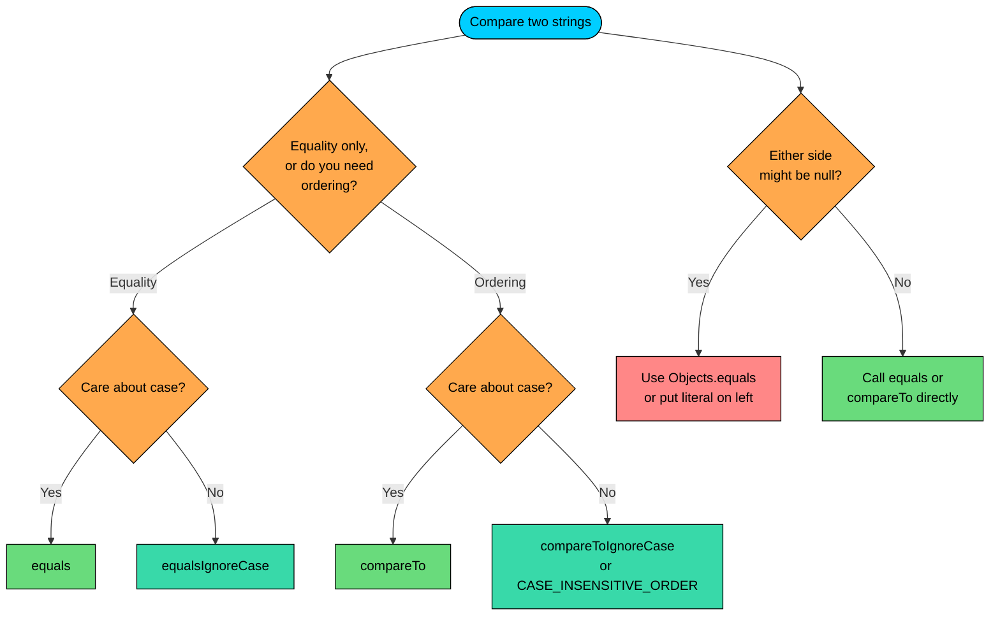

import React from 'react';
import CodeBlock from '../../../../components/ui/CodeBlock';
import Callout from '../../../../components/ui/Callout';

<div className="article-header">
  <div className="breadcrumb">
    <a href="/">Curated Notes</a>
    <span className="breadcrumb-separator">›</span>
    <span className="breadcrumb-current">String Comparison</span>
  </div>
  <h1>String Comparison</h1>
  <p style={{ color: 'var(--text-muted)', fontSize: '1.1rem', marginBottom: '16px', lineHeight: '1.6' }}>
    Master the essentials of String Comparison in this curated guide.
  </p>
  <div className="meta-info">
    <span className="meta-item">
      <svg width="14" height="14" viewBox="0 0 24 24" fill="none" stroke="currentColor" strokeWidth="2"><circle cx="12" cy="12" r="10"/><polyline points="12 6 12 12 16 14"/></svg>
      10 min read
    </span>
    <span className="difficulty-badge difficulty-badge--intermediate">Intermediate</span>
  </div>
</div>

<section className="content-section">

Comparing strings sounds simple until you write `if (couponCode == userInput)` and watch it return `false` for two strings that look identical on the screen. Java has a whole toolbox for comparing strings: `==`, `equals`, `equalsIgnoreCase`, `compareTo`, and a handful of helpers for null safety and sorting. Each one answers a different question. This lesson walks through what each method actually does, when to use each, and the small pitfalls around them.

---

## Reference Identity vs Content Equality

First, understand what `==` actually compares. For primitive types like `int` and `double`, `==` compares values. For reference types like `String`, `==` compares **references**: it asks "do these two variables point at the same object in memory?" That's a different question from "do these two strings contain the same characters?"


```java
public class IdentityVsContent {
    public static void main(String[] args) {
        String a = "laptop";
        String b = "laptop";
        String c = new String("laptop");

        System.out.println("a == b: " + (a == b));
        System.out.println("a == c: " + (a == c));
        System.out.println("a.equals(c): " + a.equals(c));
    }
}
```


The first comparison is `true` because string literals share storage in the string pool. Two literals with the same content end up as the same object. The second comparison is `false` because `new String("laptop")` forces Java to build a separate object on the heap, and `a` and `c` now point at different objects even though the characters inside match. The third comparison is `true` because `equals` walks both strings character by character and only cares about content.

`==` on strings tests for **identity**, not for **equality of contents**. The same characters in two different objects make `==` return `false`. That's rarely what you want when comparing user input, file contents, or anything else that didn't come straight out of a string literal in your source code.

---

## The `equals` Method

`equals(Object obj)` is what you use for content comparison. It's defined on `Object` and overridden by `String` to walk both sequences character by character and return `true` only if every character matches in order.


```java
public class EqualsBasics {
    public static void main(String[] args) {
        String couponEntered = "SAVE10";
        String couponInSystem = "SAVE10";

        if (couponEntered.equals(couponInSystem)) {
            System.out.println("Coupon valid.");
        } else {
            System.out.println("Coupon invalid.");
        }
    }
}
```


Two important details about how `String.equals` behaves:

- If the argument is `null`, it returns `false`. It never throws on a `null` argument.
- If the argument is not a `String` (for example, a `StringBuilder`), it also returns `false`. `equals` takes an `Object`, but the type check inside means a non-`String` always loses.


```java
public class EqualsEdgeCases {
    public static void main(String[] args) {
        String couponCode = "SAVE10";
        String missingCoupon = null;
        StringBuilder builderCoupon = new StringBuilder("SAVE10");

        System.out.println("equals(null): " + couponCode.equals(missingCoupon));
        System.out.println("equals(StringBuilder): " + couponCode.equals(builderCoupon));
    }
}
```


The second result is worth highlighting. A `StringBuilder` containing `"SAVE10"` is not a `String`, so `equals` returns `false`. To compare a `String` to a `StringBuilder`, convert the builder first with `builderCoupon.toString()` and then call `equals`.

`equals` is O(n) in the length of the strings. It does a quick length check first and returns `false` immediately if the lengths differ, so mismatched-length comparisons are effectively O(1).

---

## `equalsIgnoreCase` for Case-Insensitive Matching

When users type into a form, they don't always match the case you expect. Email addresses are case-insensitive by convention, coupon codes might be entered as `save10` or `SAVE10`, and a search for "laptop" should match "Laptop". For those cases, use `equalsIgnoreCase`.


```java
public class EmailCheck {
    public static void main(String[] args) {
        String savedEmail = "Alice@Example.com";
        String typedEmail = "alice@EXAMPLE.com";

        if (savedEmail.equalsIgnoreCase(typedEmail)) {
            System.out.println("Email match.");
        } else {
            System.out.println("Email mismatch.");
        }
    }
}
```


`equalsIgnoreCase` is not the same as calling `toLowerCase().equals(...)`. It compares character by character, and at each position it folds both characters to a common case using Unicode rules before comparing. That avoids building two new lowercase strings and works correctly for the basic ASCII letters that show up in coupon codes, product names, and emails.

The Unicode rules are worth a quick mention. For ASCII characters, the comparison behaves the way you'd expect: `A` matches `a`, `Z` matches `z`. For some non-ASCII characters, case folding is locale-sensitive (Turkish `I` and `i` are the classic example). For most E-Commerce use cases, the difference doesn't matter, but for a product catalog that mixes languages, note that `equalsIgnoreCase` uses the default rules and may not match every native-speaker expectation.

`equalsIgnoreCase` is also O(n) in the string length, with the same early exit on a length mismatch.

---

## `compareTo` and Lexicographic Ordering

`equals` only answers yes or no. When you need to **order** strings (for sorting, building a sorted list, or checking which name comes first alphabetically), you need `compareTo`. It returns an `int`:

- A **negative** number if the receiver should come before the argument.
- **Zero** if the two strings have identical content.
- A **positive** number if the receiver should come after the argument.


```java
public class CompareBasics {
    public static void main(String[] args) {
        String productA = "apple";
        String productB = "banana";
        String productC = "apple";

        System.out.println("apple vs banana: " + productA.compareTo(productB));
        System.out.println("banana vs apple: " + productB.compareTo(productA));
        System.out.println("apple vs apple:  " + productA.compareTo(productC));
    }
}
```


The magnitude of the return value matters, because there's a small nuance. If the two strings differ at some position, `compareTo` returns the difference of the **first non-matching UTF-16 code units**. If one string is a prefix of the other, it returns the **difference of their lengths**.


```java
public class CompareMagnitude {
    public static void main(String[] args) {
        String shortName = "lap";
        String longName = "laptop";
        String differentMid = "lamp";

        System.out.println("lap vs laptop: " + shortName.compareTo(longName));
        System.out.println("lap vs lamp:   " + shortName.compareTo(differentMid));
    }
}
```


In the first comparison, `"lap"` is a prefix of `"laptop"`, so the return value is `3 - 6 = -3`, the length difference. In the second comparison, the first two characters match (`l`, `a`), and then `p` (code unit 112) is compared to `m` (code unit 109).

Modern JDKs no longer return raw code-unit differences in every case. The contract guarantees only the sign (negative, zero, or positive). When reading `compareTo`, treat the sign as the only thing guaranteed to be portable, and never depend on a specific magnitude. The point of `compareTo` is to give you an ordering, not a distance.

A common mistake to avoid:

**What's wrong with this code?**


```java
String firstName = "Alice";
String secondName = "Bob";
int diff = firstName.compareTo(secondName);
System.out.println("Difference: " + diff + " characters");
```


Calling the result "characters" is misleading. The value tells you the ordering, but it does not tell you how many characters apart the strings are. The fix is to use the result only for its sign:


```java
String firstName = "Alice";
String secondName = "Bob";
int result = firstName.compareTo(secondName);
if (result < 0) {
    System.out.println(firstName + " comes before " + secondName);
} else if (result > 0) {
    System.out.println(firstName + " comes after " + secondName);
} else {
    System.out.println("Same name.");
}
```


There's also a case-insensitive sibling, `compareToIgnoreCase`, which works the same way but folds case before comparing.


```java
public class CompareCaseInsensitive {
    public static void main(String[] args) {
        String productA = "Laptop";
        String productB = "laptop";

        System.out.println("compareTo:           " + productA.compareTo(productB));
        System.out.println("compareToIgnoreCase: " + productA.compareToIgnoreCase(productB));
    }
}
```


The plain `compareTo` sees `L` (76) and `l` (108) at position `0` and reports a negative result. `compareToIgnoreCase` folds them to the same case first, and the rest of the string matches, so the result is `0`.

One more detail: `compareTo` is **lexicographic on UTF-16 code units**, not "alphabetical" in any human sense. For plain ASCII letters this matches what you'd expect, with one twist: all uppercase letters come before all lowercase letters because uppercase ASCII codes (65 to 90) are smaller than lowercase ones (97 to 122). For accented characters like `é`, the code unit value can be far from where a French dictionary would put it.

`compareTo` and `compareToIgnoreCase` are both O(n). They walk until they find the first non-matching position or run out of characters, so the actual work is proportional to the length of the common prefix plus one.

---

## Null Safety

Every method above is called on a string, which means the string on the **left** of the dot must not be `null`. If it is, the call throws `NullPointerException` before the comparison even begins.

**What's wrong with this code?**


```java
public class NullLeftBug {
    public static void main(String[] args) {
        String couponCode = null;
        if (couponCode.equals("SAVE10")) {
            System.out.println("Valid coupon.");
        }
    }
}
```


`couponCode` is `null`, so the dot operator throws `NullPointerException` on the call to `.equals`. The argument being a real string doesn't matter, because Java never gets that far.

**Fix:**

There are two common patterns. The first is the **Yoda comparison**, where you put the non-null value on the left:


```java
public class YodaFix {
    public static void main(String[] args) {
        String couponCode = null;
        if ("SAVE10".equals(couponCode)) {
            System.out.println("Valid coupon.");
        } else {
            System.out.println("No coupon applied.");
        }
    }
}
```


The literal `"SAVE10"` is never `null`, so the call is safe. Inside `equals`, the `null` argument returns `false`. This pattern is common in Java code that handles user input or values read from a database.

The second pattern uses `Objects.equals`, a static helper that handles `null` on both sides:


```java
import java.util.Objects;

public class ObjectsEqualsFix {
    public static void main(String[] args) {
        String coupon1 = null;
        String coupon2 = null;
        String coupon3 = "SAVE10";

        System.out.println("null vs null:   " + Objects.equals(coupon1, coupon2));
        System.out.println("null vs SAVE10: " + Objects.equals(coupon1, coupon3));
        System.out.println("SAVE10 vs SAVE10: " + Objects.equals(coupon3, "SAVE10"));
    }
}
```


`Objects.equals` treats two `null` values as equal, treats `null` vs non-null as unequal, and delegates to the regular `equals` for the rest. It's the simplest way to compare two values when either or both could be `null`.

**What's wrong with this code?**


```java
public class TwoNullsBug {
    public static void main(String[] args) {
        String enteredCoupon = null;
        String storedCoupon = "SAVE10";
        if (enteredCoupon.equals(storedCoupon)) {
            System.out.println("Match.");
        }
    }
}
```


The left side is `null`, so `.equals` throws. The fix is either to flip the operands or use `Objects.equals`:


```java
import java.util.Objects;

public class TwoNullsFix {
    public static void main(String[] args) {
        String enteredCoupon = null;
        String storedCoupon = "SAVE10";
        if (Objects.equals(enteredCoupon, storedCoupon)) {
            System.out.println("Match.");
        } else {
            System.out.println("No match.");
        }
    }
}
```


---

## The `==` vs `equals` Pitfall

A common bug for new Java programmers comparing strings is using `==` on values that came from outside the source code. For literals in your own code, `==` happens to work because of the string pool. For values typed into a Scanner, read from a file, parsed from JSON, or returned from a database call, `==` fails because those strings are newly built objects, even when their contents match a pool entry.

**What's wrong with this code?**


```java
import java.util.Scanner;

public class ScannerBug {
    public static void main(String[] args) {
        Scanner input = new Scanner(System.in);
        System.out.print("Enter your coupon code: ");
        String typed = input.nextLine();

        if (typed == "SAVE10") {
            System.out.println("Coupon applied.");
        } else {
            System.out.println("Invalid coupon.");
        }
        input.close();
    }
}
```


Even if the user types exactly `SAVE10`, the comparison is almost always `false`. `Scanner.nextLine()` builds a fresh `String` object for whatever the user typed, and that object is not the same one as the `"SAVE10"` literal in the source code. `==` compares the two references, finds they're different, and returns `false`.

**Fix:**

Use `equals`. If you also want to be lenient about case, use `equalsIgnoreCase`.


```java
import java.util.Scanner;

public class ScannerFix {
    public static void main(String[] args) {
        Scanner input = new Scanner(System.in);
        System.out.print("Enter your coupon code: ");
        String typed = input.nextLine();

        if ("SAVE10".equalsIgnoreCase(typed)) {
            System.out.println("Coupon applied.");
        } else {
            System.out.println("Invalid coupon.");
        }
        input.close();
    }
}
```


**Output (if the user types `save10`):**


```shell
Enter your coupon code: save10
Coupon applied.
```


The fix uses the Yoda style, so the comparison stays safe even if `typed` ends up as `null`.

---

## Sorting Strings

Once you can compare two strings, sorting a whole collection of them is a small step. `Arrays.sort` and `Collections.sort` both use the natural ordering, which for `String` means `compareTo`. That's a code-unit-based comparison, so uppercase letters sort before lowercase letters by default.


```java
import java.util.Arrays;

public class SortProducts {
    public static void main(String[] args) {
        String[] productNames = {"Laptop", "headphones", "Keyboard", "mouse", "Monitor"};
        Arrays.sort(productNames);

        for (String name : productNames) {
            System.out.println(name);
        }
    }
}
```


The result is correct but probably not what you wanted. All the capitalized names come first, then the lowercase ones, because that's what `compareTo` says. A typical product catalog wants `headphones`, `Keyboard`, `Laptop`, `Monitor`, `mouse`. For that ordering, sort case-insensitively.


```java
import java.util.Arrays;

public class SortProductsCaseInsensitive {
    public static void main(String[] args) {
        String[] productNames = {"Laptop", "headphones", "Keyboard", "mouse", "Monitor"};
        Arrays.sort(productNames, String.CASE_INSENSITIVE_ORDER);

        for (String name : productNames) {
            System.out.println(name);
        }
    }
}
```


`String.CASE_INSENSITIVE_ORDER` is a public static `Comparator<String>` that calls `compareToIgnoreCase` internally. It's the simplest way to sort strings ignoring case.

You can also build the comparator yourself with `Comparator.comparing`, which is more flexible when you want to sort by a derived value (length, last character, normalized form, and so on).


```java
import java.util.Arrays;
import java.util.Comparator;

public class SortByLowercase {
    public static void main(String[] args) {
        String[] productNames = {"Laptop", "headphones", "Keyboard", "mouse", "Monitor"};
        Arrays.sort(productNames, Comparator.comparing(name -> name.toLowerCase()));

        for (String name : productNames) {
            System.out.println(name);
        }
    }
}
```


The two approaches produce the same result here, but `Comparator.comparing` opens the door to sorting by any function of the string. For example, `Comparator.comparing(String::length)` would sort by length, shortest first.

Java's `Arrays.sort` on a `String[]` runs in O(n log n) comparisons. Each comparison is O(k) where `k` is the length of the common prefix, so very long, very similar strings make sorts more expensive.

For true human-language sorting (the kind a French or German speaker would expect for accented characters), `compareTo` and `CASE_INSENSITIVE_ORDER` are not enough. Java has a `Collator` class in `java.text` for that.


```java
import java.text.Collator;
import java.util.Arrays;
import java.util.Locale;

public class LocaleSort {
    public static void main(String[] args) {
        String[] names = {"zebra", "ähre", "apple"};
        Collator german = Collator.getInstance(Locale.GERMAN);
        Arrays.sort(names, german);
        for (String name : names) {
            System.out.println(name);
        }
    }
}
```


`Collator` knows that `ä` sorts near `a` in German rather than after `z`, which is where its UTF-16 code unit would put it. You don't need `Collator` for English product names, but for a catalog with German, French, Swedish, or other accented entries, it's the tool that gives you human-correct ordering.

---

## Choosing the Right Method

With this many options, a decision tree helps. The two questions that matter are: "do I care about case?" and "do I need an ordering or just equality?"





The diagram captures the rules in shorthand:

- For yes-or-no equality with case sensitivity, use `equals`.
- For yes-or-no equality without case sensitivity, use `equalsIgnoreCase`.
- For ordering (sorting, less-than/greater-than), use `compareTo` or `compareToIgnoreCase`.
- For sorting collections case-insensitively, use `String.CASE_INSENSITIVE_ORDER` as the comparator.
- If either operand might be `null`, use `Objects.equals` or put the known-non-null value on the left.
- Reserve `==` for the rare case where you actually need reference identity, which on `String` is almost never useful in application code.

---

## The `hashCode` Contract

One last piece: the relationship between `equals` and `hashCode`. The contract says that if `a.equals(b)` is `true`, then `a.hashCode() == b.hashCode()` must also be `true`. `String` honors this: two strings with the same characters always return the same hash code, regardless of how they were built.


```java
public class HashCodeContract {
    public static void main(String[] args) {
        String poolCoupon = "SAVE10";
        String heapCoupon = new String("SAVE10");

        System.out.println("equals:           " + poolCoupon.equals(heapCoupon));
        System.out.println("same hashCode:    " + (poolCoupon.hashCode() == heapCoupon.hashCode()));
        System.out.println("hashCode value:   " + poolCoupon.hashCode());
    }
}
```


The two strings are different objects, but their contents match, so `equals` is `true` and their hash codes match too. This is what makes `String` work correctly as a `HashMap` key. Drop a string into a map, build a new string with the same content somewhere else, look it up, and the lookup works. The hash code is stable because strings are immutable. Once a string is built, its characters never change, so its hash code never changes.

The takeaway: `String` behaves correctly as a key in any hash-based collection.

`String.hashCode()` is O(n) on the first call because it walks every character. The result is cached inside the `String` object, so subsequent calls are O(1).

</section>
