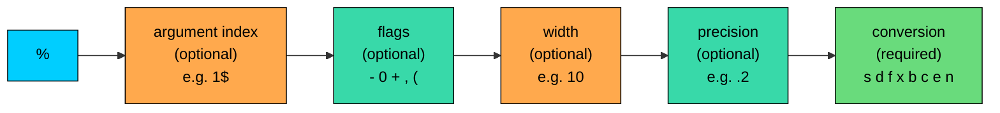

import React from 'react';
import CodeBlock from '../../../../components/ui/CodeBlock';
import Callout from '../../../../components/ui/Callout';

<div className="article-header">
  <div className="breadcrumb">
    <a href="/">Curated Notes</a>
    <span className="breadcrumb-separator">›</span>
    <span className="breadcrumb-current">String Formatting</span>
  </div>
  <h1>String Formatting</h1>
  <p style={{ color: 'var(--text-muted)', fontSize: '1.1rem', marginBottom: '16px', lineHeight: '1.6' }}>
    Master the essentials of String Formatting in this curated guide.
  </p>
  <div className="meta-info">
    <span className="meta-item">
      <svg width="14" height="14" viewBox="0 0 24 24" fill="none" stroke="currentColor" strokeWidth="2"><circle cx="12" cy="12" r="10"/><polyline points="12 6 12 12 16 14"/></svg>
      10 min read
    </span>
    <span className="difficulty-badge difficulty-badge--intermediate">Intermediate</span>
  </div>
</div>

<section className="content-section">

Building a clean line of output with raw `+` concatenation gets ugly the moment you need decimals, alignment, or padding. Java's formatting tools, `String.format`, `printf`, and `String.formatted`, let you write a single template string with placeholders and hand the values in separately. This lesson covers all three, every common format specifier, width and precision, flags, argument indexes, locale, and the pitfalls that turn into runtime exceptions.

---

## Why Formatting Exists

Consider printing a one-line receipt summary. The price needs two decimals, the order ID needs zero-padding to five digits, and the customer name should sit in a fixed-width column so the totals line up. With plain concatenation, the code drifts into a mess.


```java
public class ReceiptUgly {
    public static void main(String[] args) {
        int orderId = 42;
        String customerName = "Alice";
        double total = 89.5;

        String paddedId = "" + orderId;
        while (paddedId.length() < 5) {
            paddedId = "0" + paddedId;
        }
        String paddedName = customerName;
        while (paddedName.length() < 10) {
            paddedName = paddedName + " ";
        }
        String roundedTotal = "" + ((int) (total * 100)) / 100.0;
        if (!roundedTotal.contains(".") || roundedTotal.split("\\.")[1].length() < 2) {
            roundedTotal = roundedTotal + "0";
        }

        System.out.println("Order #" + paddedId + " | " + paddedName + " | $" + roundedTotal);
    }
}
```


The output is correct, but reading the code is painful. Three different problems (padding, alignment, decimal places) each got their own ad-hoc patch. Scale this to a receipt with ten columns and it becomes unmaintainable.

The fix is a format string. We write one template with placeholders that describe how each value should look, then pass the values in order.


```java
public class ReceiptFormatted {
    public static void main(String[] args) {
        int orderId = 42;
        String customerName = "Alice";
        double total = 89.5;

        String line = String.format("Order #%05d | %-10s | $%.2f", orderId, customerName, total);
        System.out.println(line);
    }
}
```


One line replaces twelve. The template reads like the output it produces: an order ID padded to five digits with zeros, a name left-aligned in a ten-character column, and a total with two decimal places. The rest of the lesson breaks down what each piece of that template means.

---

## `String.format`, `printf`, and `formatted`

Java gives you three ways to apply a format string. They share the same syntax and the same set of placeholders. They differ in where the result goes.


| Method | Signature | What it does |
| ------ | --------- | ------------ |
| `String.format` | `static String format(String fmt, Object... args)` | Returns the formatted text as a new `String`. |
| `System.out.printf` | `PrintStream printf(String fmt, Object... args)` | Writes the formatted text directly to standard output. No newline is added. |
| `String.formatted` | `String formatted(Object... args)` (Java 15+) | Instance method on the format string itself. Returns the formatted text as a new `String`. |


Here are the same values rendered three ways.


```java
public class ThreeWays {
    public static void main(String[] args) {
        String productName = "Wireless Mouse";
        double price = 24.5;

        // 1. String.format: build a string, then use it
        String line = String.format("%s costs $%.2f", productName, price);
        System.out.println(line);

        // 2. printf: write directly to stdout
        System.out.printf("%s costs $%.2f%n", productName, price);

        // 3. formatted (Java 15+): call on the template itself
        String line2 = "%s costs $%.2f".formatted(productName, price);
        System.out.println(line2);
    }
}
```


A few details apply. `printf` doesn't append a newline. The `%n` at the end of its format string is what produces one. Without `%n`, the next print would land on the same line. `System.out.println(line)` does add a newline because that's what `println` always does. `formatted` is a compact form when the template is a literal, because the template and the call read in the same order as the output.

Each call to `String.format` allocates a new `String`. Inside a tight loop that builds millions of strings, that allocation cost adds up. Use `printf` for direct output, or build with `StringBuilder` for repeated concatenation.

`println` versus `printf` is a common source of confusion. `println` prints the value's `toString` and adds a newline. `printf` interprets its first argument as a format string and never adds a newline on its own. If you write `System.out.printf("Hello")`, the cursor stays on the same line as `Hello`.

---

## The Anatomy of a Format Specifier

Every placeholder in a format string starts with `%` and ends with a single letter called the **conversion**. Between them, you can put flags, a width, a precision, and an argument index. Most placeholders only need the `%` and the conversion. The rest of the parts are optional and order-sensitive.





The order is fixed: percent sign, optional argument index, optional flags, optional width, optional precision, then the required conversion letter. Get the order wrong and the format string throws a `MissingFormatArgumentException` or just produces gibberish.

Here are a few specifiers broken down piece by piece.


| Specifier | Index | Flags | Width | Precision | Conversion | Meaning |
| --------- | ----- | ----- | ----- | --------- | ---------- | ------- |
| `%s` | none | none | none | none | `s` | A string, no padding |
| `%10s` | none | none | `10` | none | `s` | A string in a 10-character right-aligned column |
| `%-10s` | none | `-` | `10` | none | `s` | A string in a 10-character left-aligned column |
| `%05d` | none | `0` | `5` | none | `d` | An integer padded with zeros to width 5 |
| `%,.2f` | none | `,` | none | `.2` | `f` | A float with two decimal places and thousands separators |
| `%1$s` | `1$` | none | none | none | `s` | The first argument, as a string |


Recognize the shape so that `%-12.3f` reads left to right as: left-align, width 12, precision 3, floating-point conversion.

---

## The Common Conversions

The conversion letter at the end is the heart of the specifier. It tells Java what kind of value to expect and how to render it. Use the wrong letter for the value and Java throws `IllegalFormatConversionException`. The common ones:


| Conversion | Accepts | Example input | Example output |
| ---------- | ------- | ------------- | -------------- |
| `%s` | Any value (calls `toString`) | `"Wireless Mouse"` | `Wireless Mouse` |
| `%d` | Integer types: `byte`, `short`, `int`, `long`, `BigInteger` | `42` | `42` |
| `%f` | Floating-point: `float`, `double`, `BigDecimal` | `19.5` | `19.500000` |
| `%e` | Floating-point in scientific notation | `19500.0` | `1.950000e+04` |
| `%x` | Integer in lowercase hexadecimal | `255` | `ff` |
| `%X` | Integer in uppercase hexadecimal | `255` | `FF` |
| `%o` | Integer in octal | `8` | `10` |
| `%b` | Any value, prints `true` if non-null and non-false, else `false` | `null` | `false` |
| `%c` | Character: `char`, or integer code point | `'A'` | `A` |
| `%n` | Nothing (no argument) | n/a | platform newline |
| `%%` | Nothing (no argument) | n/a | a literal `%` |


A few notes on the surprises.

`%s` is the most forgiving. It accepts any object, calls `toString` on it, and even handles `null` by printing the four-character string `null`. This is why `%s` is often the safest choice when you're not sure of the exact type.

`%f` always defaults to six decimal places. If you want a different number, you must say so with a precision: `%.2f` for two decimal places, `%.0f` for zero.

`%n` isn't a newline character. It's a directive that asks Java to insert the platform-appropriate line separator: `\n` on Linux and macOS, `\r\n` on Windows. Prefer `%n` inside format strings over hard-coding `\n`. It avoids subtle bugs when the same code runs on different operating systems.

`%%` is the only way to put a literal percent sign in a format string. A single `%` always starts a specifier, so to print `15% off`, you write `15%% off`.


```java
public class CommonConversions {
    public static void main(String[] args) {
        System.out.printf("Product:  %s%n", "Wireless Mouse");
        System.out.printf("Quantity: %d%n", 3);
        System.out.printf("Price:    %f%n", 24.5);
        System.out.printf("Tax rate: %.2f%n", 0.085);
        System.out.printf("In stock: %b%n", true);
        System.out.printf("Grade:    %c%n", 'A');
        System.out.printf("Hex code: %x%n", 255);
        System.out.printf("Discount: %d%% off%n", 15);
    }
}
```


The `Price: 24.500000` line shows why you almost never want a bare `%f`. Six decimals on a currency value looks wrong. The fix is precision, which is the next topic.

---

## Width, Precision, and Flags

Width sets the minimum number of characters the value should occupy. If the value is shorter than the width, Java pads it. If the value is longer, the width is ignored and the full value prints. Width never truncates.


```java
public class WidthExample {
    public static void main(String[] args) {
        System.out.printf("[%10s]%n", "Mouse");
        System.out.printf("[%10s]%n", "Wireless Mouse");
        System.out.printf("[%-10s]%n", "Mouse");
        System.out.printf("[%5d]%n", 42);
        System.out.printf("[%5d]%n", 1234567);
    }
}
```


By default, strings and numbers are right-aligned, which is why `Mouse` sits at the far end of the bracket. The `-` flag flips that to left-align. When the value is wider than the column (`Wireless Mouse` in a width of 10), Java prints the whole thing rather than chopping it. Width is a minimum, not a hard limit.

Precision means different things for different conversions:

- For `%f` and `%e`, precision is the number of digits **after** the decimal point.
- For `%s`, precision is the maximum number of characters to print, and longer strings are truncated.
- For `%d`, precision isn't allowed and causes an `IllegalFormatPrecisionException`.


```java
public class PrecisionExample {
    public static void main(String[] args) {
        System.out.printf("[%.2f]%n", 24.567);
        System.out.printf("[%.0f]%n", 24.567);
        System.out.printf("[%10.2f]%n", 24.567);
        System.out.printf("[%-10.2f]%n", 24.567);
        System.out.printf("[%.5s]%n", "Wireless Mouse");
    }
}
```


`%.2f` rounds half-to-even (banker's rounding) internally, but most everyday values round the expected way. The value `24.567` becomes `24.57` because the third decimal is `7`, well above the halfway point. `%.5s` truncates `Wireless Mouse` to its first five characters. That's useful for fitting long product names into a fixed column, although adding an ellipsis manually is a common follow-up.

Flags modify the padding and the sign. The four most useful ones for everyday code:


| Flag | Meaning | Example | Output |
| ---- | ------- | ------- | ------ |
| `-` | Left-align within the width | `%-10s` with `"Mouse"` | `Mouse     ` |
| `0` | Pad with zeros instead of spaces (numbers only) | `%05d` with `42` | `00042` |
| `,` | Group digits with locale-specific thousand separators | `%,d` with `1234567` | `1,234,567` |
| `+` | Always show the sign on numbers | `%+d` with `5` | `+5` |
| `(` | Wrap negative numbers in parentheses | `%(d` with `-5` | `(5)` |


You can combine flags. `%+,d` shows a thousand separator and a forced sign. `%-10.2f` left-aligns a two-decimal float in a ten-character column. The order of the flags relative to each other doesn't matter, but they must all sit between the `%` and the width.


```java
public class FlagsExample {
    public static void main(String[] args) {
        int profit = 1234567;
        int loss = -1234567;

        System.out.printf("Profit:  %,d%n", profit);
        System.out.printf("Profit:  %+,d%n", profit);
        System.out.printf("Loss:    %,d%n", loss);
        System.out.printf("Loss:    %(,d%n", loss);
        System.out.printf("Order:   %05d%n", 42);
    }
}
```


The `(` flag is a small accounting convention. Negative numbers print as `(1,234,567)` instead of `-1,234,567`. It's still numeric, just rendered in a way that matches how financial reports usually display losses. The `0` flag is what fixes the order-ID padding problem we saw at the start of the lesson.

Padding is cheap. Every format call does a length check and copies characters into a buffer. Precision on `%f` triggers a rounding step but is still O(1). None of this is something to worry about for ordinary code.

---

## Argument Index and Locale

When you need to reuse the same argument in multiple positions, the argument index syntax `n$` lets you point at a specific value instead of consuming arguments in order. The first argument is `1$`, the second is `2$`, and so on. Note that the index is **one-based**, not zero-based.


```java
public class ArgumentIndex {
    public static void main(String[] args) {
        String customerName = "Alice";

        // Without index: each %s consumes the next argument
        String greeting1 = String.format("Hi %s, welcome back %s!", customerName, customerName);

        // With index: 1$s reuses the first argument
        String greeting2 = String.format("Hi %1$s, welcome back %1$s!", customerName);

        System.out.println(greeting1);
        System.out.println(greeting2);
    }
}
```


Both produce the same result, but the second version only passes the name once. That matters when the same value appears three or four times in a long template, or when the values are expensive to compute. Argument indexes also let you reorder values, which is the main reason translators need them. A French translation might want the customer name in a different position than the English source, and `%2$s` lets the translator move it without touching the code.

Locale is the part of formatting that often causes issues in production. The default `String.format` uses the JVM's default locale, which depends on the operating system, the user, and sometimes the environment variables. The same code produces different output in different places, which breaks tests and makes log files inconsistent across machines.

The two most common locale-sensitive behaviors:

- The thousand separator changes. US locale uses a comma (`1,234.56`). German locale uses a period (`1.234,56`). French locale uses a non-breaking space (`1 234,56`).
- The decimal point changes. US locale uses a period. Most of continental Europe uses a comma.


```java
import java.util.Locale;

public class LocaleExample {
    public static void main(String[] args) {
        double price = 1234.56;

        System.out.println(String.format(Locale.US, "Price: %,.2f", price));
        System.out.println(String.format(Locale.GERMANY, "Price: %,.2f", price));
        System.out.println(String.format(Locale.FRANCE, "Price: %,.2f", price));
        System.out.println(String.format("Price: %,.2f", price)); // default locale
    }
}
```


**Output (on a US-locale JVM):**


```shell
Price: 1,234.56
Price: 1.234,56
Price: 1 234,56
Price: 1,234.56
```


The last line, with no explicit locale, happens to match the US line **only because the JVM running this example is set to US locale**. Run the same code on a JVM whose default is German, and the last line flips to `1.234,56`. This is the bug that breaks tests in CI.

The fix is to always pass an explicit `Locale` when the output is going to be parsed by another program, compared against a fixed expected value, or written to a file that other systems will read. Use `Locale.US` when you want a stable, machine-readable format. Use `Locale.ROOT` when you want a locale-neutral one (similar to US but considered the formal "no locale" choice).


```java
import java.util.Locale;

public class StableFormat {
    public static void main(String[] args) {
        double price = 1234.56;

        // For logs, IDs, or anything machine-readable, fix the locale
        String stable = String.format(Locale.ROOT, "PRICE=%.2f", price);
        System.out.println(stable);

        // For user-facing output, use the user's locale
        String userFacing = String.format(Locale.US, "Price: $%,.2f", price);
        System.out.println(userFacing);
    }
}
```


`printf` accepts a locale the same way: `System.out.printf(Locale.US, "%,.2f%n", price)`. The instance method `formatted` doesn't accept a locale and always uses the default, which is one reason to use `String.format` instead when locale matters.

---

## Text Blocks with Format Strings

Java 15 added **text blocks**, multi-line string literals that use triple quotes. They pair naturally with `formatted` when you need a multi-line template with embedded values, like a receipt or an email body.

The syntax is a string opened and closed with `"""`. Java strips the common leading whitespace based on the position of the closing `"""`, so the indentation in your source doesn't end up in the string.


```java
public class TextBlockReceipt {
    public static void main(String[] args) {
        String customerName = "Alice";
        int orderId = 42;
        double total = 89.5;

        String receipt = """
                ORDER RECEIPT
                -------------
                Customer: %s
                Order #:  %05d
                Total:    $%.2f
                """.formatted(customerName, orderId, total);

        System.out.println(receipt);
    }
}
```


The text block reads top to bottom like the output. Newlines inside the block are real newlines in the string. The `.formatted(...)` call substitutes the three placeholders. You could also pass this same text block to `String.format` or `System.out.printf`, but `formatted` keeps the template and the substitution next to each other.

Text blocks aren't a separate formatting feature. They're just a friendlier way to write a multi-line format string. Every specifier you've seen so far works inside one without any change.

---

## Pitfalls and Common Exceptions

Format strings push more checks to runtime than to compile time. The compiler can't tell whether `%d` matches the type of the third argument, so you only find out when the code runs. The exceptions are specific enough that the message usually tells you exactly what went wrong, but knowing the failure modes in advance saves a lot of time.

**Wrong conversion for the value.**


```java
public class WrongConversion {
    public static void main(String[] args) {
        double price = 19.99;
        System.out.printf("Price: %d%n", price); // %d expects int, got double
    }
}
```


The message says `d != java.lang.Double`. The conversion `%d` expects an integer type, and the argument is a `Double`. The fix is to match the conversion to the value: `%f` for a `double`, `%d` for an integer, or convert the value first with `(int) price`.

**Too few arguments.**


```java
public class TooFewArgs {
    public static void main(String[] args) {
        System.out.printf("%s costs $%.2f%n", "Mouse"); // missing the price
    }
}
```


The format string has two specifiers (`%s` and `%.2f`) but only one argument was passed. The message names the specifier that was left without a value. Count your specifiers and your arguments, especially after editing a long format string.

**Argument order mixed up.**


```java
public class WrongOrder {
    public static void main(String[] args) {
        double price = 19.99;
        int quantity = 3;
        System.out.printf("Bought %d items at $%.2f each%n", price, quantity);
    }
}
```


This is the same exception as the wrong-conversion case, because that's what the swap looks like to Java. The first specifier `%d` got a `Double` instead of an `Integer`. The fix is to pass the arguments in the order the format string expects, or to use argument indexes (`%2$d items at $%1$.2f each`) to point at each one explicitly.

**Forgetting `%%` for a literal percent.**


```java
public class LiteralPercent {
    public static void main(String[] args) {
        System.out.printf("Discount: 15%%n"); // probably meant 15% off, with a newline
    }
}
```


There's no exception here, just wrong output. `%%` produces a single `%`, and then `n` is just the letter `n`, not a format directive. The fix is `15%% off%n` if you want `Discount: 15% off` followed by a newline. To be precise, `%%` consumes the two-character sequence as a single literal percent.

**Locale-dependent decimal point breaking tests.**

We covered this in the locale section, but it's the bug that hides longest. Tests pass locally and fail in CI, or vice versa. Always pass an explicit `Locale` for any output that will be parsed, compared, or written to a file.

**What's wrong with this code?**


```java
public class CartSummaryBug {
    public static void main(String[] args) {
        int itemCount = 3;
        double total = 89.5;
        System.out.printf("Cart has %s items, total $%.2d%n", itemCount, total);
    }
}
```


There are two problems. First, `%s` for an `int` happens to work because `%s` accepts anything, but it bypasses the integer check that `%d` would do, hiding type bugs. Second, `%.2d` is illegal because precision isn't allowed on `%d`. The code throws `IllegalFormatPrecisionException: 2` before it ever produces output.

**Fix:**


```java
public class CartSummaryFixed {
    public static void main(String[] args) {
        int itemCount = 3;
        double total = 89.5;
        System.out.printf("Cart has %d items, total $%.2f%n", itemCount, total);
    }
}
```


Match each specifier to the value's type: `%d` for the integer count, `%.2f` for the dollar total. Use `%s` when you actually want the `toString` of an arbitrary object, not as a "works for everything" shortcut.

</section>
