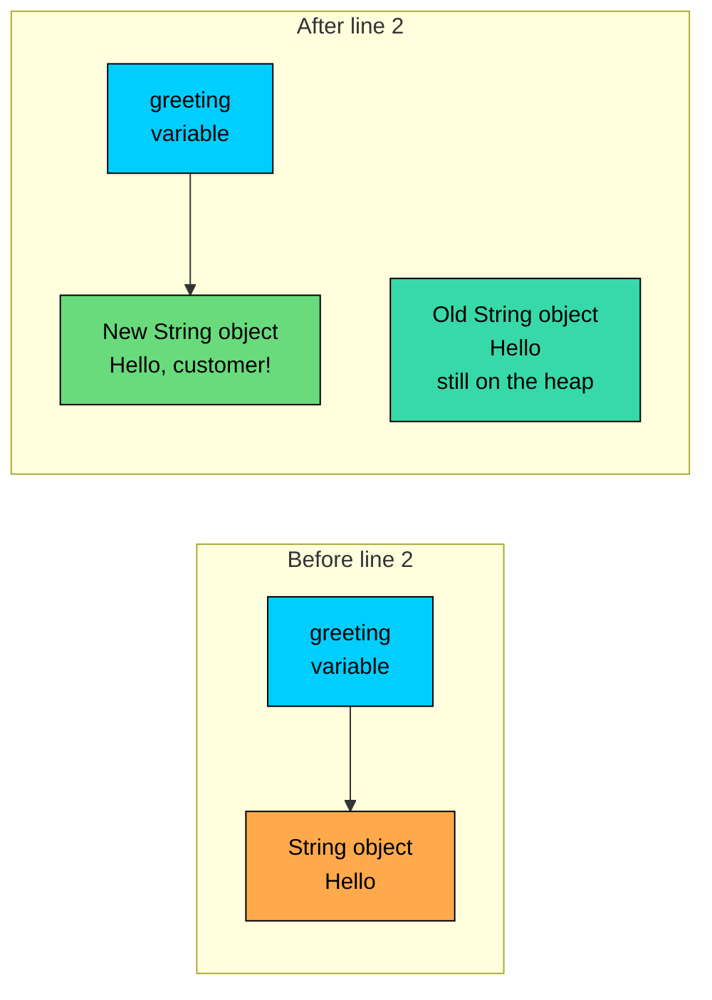
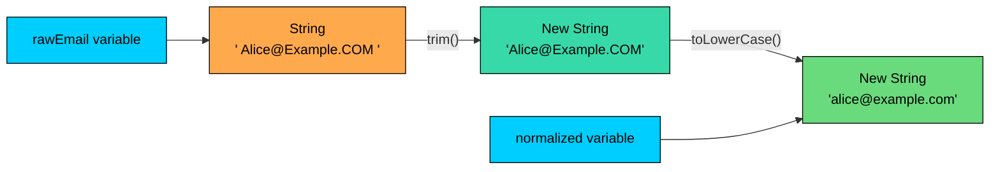

import React from 'react';
import CodeBlock from '../../../../components/ui/CodeBlock';
import Callout from '../../../../components/ui/Callout';

<div className="article-header">
  <div className="breadcrumb">
    <a href="/">Curated Notes</a>
    <span className="breadcrumb-separator">›</span>
    <span className="breadcrumb-current">String Immutability</span>
  </div>
  <h1>String Immutability</h1>
  <p style={{ color: 'var(--text-muted)', fontSize: '1.1rem', marginBottom: '16px', lineHeight: '1.6' }}>
    Master the essentials of String Immutability in this curated guide.
  </p>
  <div className="meta-info">
    <span className="meta-item">
      <svg width="14" height="14" viewBox="0 0 24 24" fill="none" stroke="currentColor" strokeWidth="2"><circle cx="12" cy="12" r="10"/><polyline points="12 6 12 12 16 14"/></svg>
      10 min read
    </span>
    <span className="difficulty-badge difficulty-badge--intermediate">Intermediate</span>
  </div>
</div>

<section className="content-section">

A `String` in Java is **immutable**, which means once a `String` object is created, the sequence of characters it holds can't change. Every method that looks like it edits a string actually returns a new `String` and leaves the original alone. This lesson explains what "immutable" means here, how the language enforces it, what happens in memory when you write something like `s = s + "!"`, and why immutability is a useful design decision in the Java standard library.

---

## What "Immutable" Means

An object is **immutable** when, after construction, its observable state can't change. For a `String`, the observable state is the sequence of characters and the length. Once a `String` is built, the same object will report the same characters and the same length until it's garbage-collected. Nothing the program does can rewrite the characters inside it.

The simplest way to see this is to call a method that looks destructive and check the original.


```java
public class UpperCaseDemo {
    public static void main(String[] args) {
        String productName = "wireless mouse";
        productName.toUpperCase();
        System.out.println("After toUpperCase: " + productName);
    }
}
```


The `toUpperCase()` call ran. It built and returned a new `String` containing `"WIRELESS MOUSE"`. But that new object was thrown away because nothing stored the return value. The original `productName` still points at the same `"wireless mouse"` object it always did, and that object never changed.

To actually get the uppercase version, you've to keep the returned `String`.


```java
public class UpperCaseFixed {
    public static void main(String[] args) {
        String productName = "wireless mouse";
        String upperName = productName.toUpperCase();
        System.out.println("Original: " + productName);
        System.out.println("Upper:    " + upperName);
    }
}
```


Two `String` objects now exist. `productName` still points at the original lowercase one. `upperName` points at the new uppercase one. Both are alive at the same time, and neither will ever change.

This is the rule that runs through every `String` method. `replace`, `trim`, `strip`, `concat`, `substring`, `toLowerCase`, `toUpperCase`, all of them return a new `String` and leave the source object exactly as it was.

Every "modifying" call on a `String` allocates a new object. One call is cheap. A thousand calls inside a loop isn't. Use `StringBuilder` instead when you need it.

---

## How Java Enforces Immutability

Immutability isn't a convention or a polite request. The `String` class is designed so that the JVM can prove the characters can't change. Three things make that work, and removing any one of them would break it.

**1. The class is `final`.** You can't extend `String`. If you could, a subclass might override methods to lie about the contents, or add fields that mutate. The declaration in the standard library is:


```java
public final class String implements ...
```


The `final` keyword on the class blocks subclassing. Whatever `String` reference you hold, you can be sure the runtime type is `String` itself, not some custom subclass that misbehaves.

**2. The internal storage is `private` and `final`.** Inside `String`, the characters live in a field that's both `private` (no other class can touch it) and `final` (the field reference can't be reassigned after construction). Before Java 9, the field was a `char[]`. From Java 9 onward, it's a `byte[]` with a separate byte called the "coder" that says how to interpret it (this is the Compact Strings optimization). Either way, the field is private and final.

The field being `final` means the `String` can't swap in a different array after construction. The field being `private` means no outside code can reach in and modify the array's slots either. The two together close the door on mutation.

**3. No method on `String` writes to the internal array.** Every `String` method either reads the array or allocates a new array for a new `String`. Nothing writes through the existing array. A small word on Compact Strings, mentioned above, since it's natural to wonder if the Java 9 change weakens immutability. It doesn't. The change was purely about memory layout: ASCII-only strings now use one byte per character instead of two, which roughly halves the memory footprint for typical English text. The new field is still `private final`, and no method writes to it. From the outside, a `String` behaves exactly as it did before. We won't go deeper on Compact Strings here.

---

## Reference Reassignment Versus Object Mutation

This is the part worth taking slowly. If `String` is immutable, why does this line look like it's modifying a string?


```java
String greeting = "Hello";
greeting = greeting + ", customer!";
System.out.println(greeting);
```


The `greeting` variable now prints something different from what it printed before. Did the string change?

No. Two different things happened, and only the variable changed. Step by step:

1. `String greeting = "Hello";` creates a `String` object that holds the characters `Hello`, and points the variable `greeting` at it.
2. `greeting + ", customer!"` does **not** edit the existing `String`. It builds a brand new `String` whose characters are `Hello, customer!`.
3. `greeting = ...` rebinds the variable. The variable now points at the new object. The old `"Hello"` object is still sitting in the heap, unchanged. Nothing references it anymore, so eventually the garbage collector will reclaim it.

The variable changed. The object didn't. The diagram below shows the heap before and after the `+` and reassignment.





The arrow moved. The object didn't. If anyone else was holding a reference to the original `"Hello"` object, they would still see `"Hello"`. The variable `greeting` simply pointed somewhere else.

This is the difference between **reference reassignment** (changing where a variable points) and **object mutation** (changing what's inside an object). Java lets you do the first with any variable. Java doesn't let you do the second to a `String`.

A second example shows how this difference matters when two variables refer to the same `String`.


```java
public class TwoReferences {
    public static void main(String[] args) {
        String original = "wireless mouse";
        String alias = original;
        original = original.toUpperCase();
        System.out.println("original: " + original);
        System.out.println("alias:    " + alias);
    }
}
```


Both variables started out pointing at the same `"wireless mouse"` object. Calling `toUpperCase()` built a new `"WIRELESS MOUSE"` object and reassigned `original` to point at it. `alias` wasn't touched, so it still points at the unchanged original object. If `String` were mutable and `toUpperCase()` edited the characters in place, both variables would show the uppercase version. They don't, which is the proof that the original object was never changed.

---

## A "What's Wrong With This Code?" Example

This bug is common when first learning `String`. The author wants to clean up a coupon code by removing spaces.

**What's wrong with this code?**


```java
public class CouponBug {
    public static void main(String[] args) {
        String couponCode = "SAVE 20 NOW";
        couponCode.replace(" ", "");
        System.out.println("Cleaned code: " + couponCode);
    }
}
```


The spaces are still there. The author expected `replace` to edit `couponCode` in place. It doesn't. `replace` is a `String` method, and `String` is immutable. The call built a new `String` containing `"SAVE20NOW"` and then threw it away because no variable captured the return value. The variable `couponCode` still points at the original object.

**Fix:**

Capture the return value, either into the same variable or a new one.


```java
public class CouponFixed {
    public static void main(String[] args) {
        String couponCode = "SAVE 20 NOW";
        couponCode = couponCode.replace(" ", "");
        System.out.println("Cleaned code: " + couponCode);
    }
}
```


The same rule applies to every method that "returns a `String`". If the return type is `String`, the method built a new one and you must store it. A useful habit: any time a `String` method call ignores the return value, treat it as a probable bug and look closer.

---

## Five Benefits of Immutability

Immutability isn't free (every "edit" allocates), so it's fair to ask what Java buys with it. Five concrete payoffs come up in everyday code.

#### 1. Safe to Share Across Threads

A mutable object shared between threads has to be protected with locks or other synchronization, or readers can see half-written state. An immutable object needs none of that. Once it's published, every thread that holds a reference is guaranteed to see the same characters, forever. There's nothing to lock.

In an e-commerce site, consider a product name like `"Wireless Mouse"`. Three threads might be reading it at the same time: one rendering a search results page, one updating a recommendation feed, one writing an audit log. With a mutable string, each of those reads would need coordination to make sure no one is editing while the others read. Because `String` is immutable, all three threads share the same object with no locks, no copies, and no risk of seeing inconsistent characters.

#### 2. Safe to Use as a `HashMap` Key

A `HashMap` decides where to store an entry by calling `hashCode()` on the key. If the key's hash code can change after it's inserted, the map can no longer find the entry, because it'll look in a different slot than the one it stored to. The map quietly breaks.

`String` sidesteps this entirely. Its hash code depends only on its characters, and the characters are frozen at construction. The hash code is stable for the object's whole lifetime, which is what `HashMap` needs.


```java
import java.util.HashMap;
import java.util.Map;

public class ProductPriceMap {
    public static void main(String[] args) {
        Map<String, Double> productPrices = new HashMap<>();
        productPrices.put("Wireless Mouse", 29.99);
        productPrices.put("Laptop Stand", 49.50);
        System.out.println("Mouse price: $" + productPrices.get("Wireless Mouse"));
    }
}
```


The `"Wireless Mouse"` key can never change, so the lookup will always find the entry that was stored under it. If `String` were mutable and someone rewrote the characters of the original key after `put`, the map's bucket would no longer match and `get` would return `null` even though the entry is technically still in there. This bug doesn't exist in Java.

#### 3. Enables the String Pool

Because two `String` objects with the same characters are interchangeable (neither can change to be different from the other), the JVM can keep a single shared copy and hand it out wherever the same literal appears. That shared store is called the **string pool**, and it's how `"Wireless Mouse"` written in two different files can end up as the same object in memory.

Pooling only works because strings can't change. If they could, sharing would be dangerous: one piece of code editing the shared string would corrupt every other piece of code holding the same reference. Immutability is what makes the optimization safe.

#### 4. Predictable APIs

When a method accepts a `String` parameter, the caller knows for certain that the method can't change it. Whatever the method does inside, the caller's variable points at the same characters before and after.

Consider an e-commerce checkout helper that prints a summary line.


```java
public class CheckoutSummary {
    public static void main(String[] args) {
        String customerName = "alice";
        printGreeting(customerName);
        System.out.println("Still on file: " + customerName);
    }

    static void printGreeting(String name) {
        String greeting = "Hello, " + name.toUpperCase() + "!";
        System.out.println(greeting);
    }
}
```


`printGreeting` calls `name.toUpperCase()`, which builds a new `String`. The caller's `customerName` isn't affected. Even if the method had a bug and assigned `name = name.toUpperCase()` inside, the caller's variable would still be safe, because Java passes parameters by value. Combined with `String` immutability, callers never need to defensively copy a string before handing it to a method.

Compare that to handing a method a mutable object. Without trust in the method's implementation, the caller might clone the object, or wrap it in some read-only view, to be sure nothing surprising happens. With `String`, that whole class of worry disappears.

#### 5. Security

Many security checks in a real system happen on strings: a file path, a URL, a class name, a customer email being passed to a permissions check. The pattern looks like this:

1. Validate the string ("does this file path stay inside the allowed directory?").
2. Pass it to a privileged operation ("open the file").

If `String` were mutable, an attacker could swap the characters between steps 1 and 2. The validator would see a safe path, the file operation would see a dangerous one. This is called a "time-of-check to time-of-use" race, and it's a real category of bug in languages that allow it.

Because `String` is immutable, the string the validator saw and the string the operation uses are guaranteed to be the same characters. A whole family of attacks doesn't apply. This is why class loaders, URL parsers, and file APIs in the standard library all use `String` for inputs that need to be checked.

---

## The Cost: Why Concatenation in a Loop is Expensive

Immutability has a price, and the price shows up the moment you build a string piece by piece. Each `+` operation on `String` allocates a new object and copies the characters into it. One `+` is fine. A thousand `+` operations in a loop allocates a thousand intermediate objects, almost all of which become garbage immediately.

A small example shows the shape of the problem.


```java
public class BuildOrderLine {
    public static void main(String[] args) {
        String[] productNames = {"Wireless Mouse", "Laptop Stand", "USB Cable", "Webcam", "Headphones"};
        String summary = "";
        for (int i = 0; i < productNames.length; i++) {
            summary = summary + productNames[i] + ", ";
        }
        System.out.println(summary);
    }
}
```


The code works. The output is correct. Internally, each iteration builds a new `String` whose characters are everything the previous `summary` had, plus the new product, plus the comma. Iteration `i` copies all the characters from iterations `0` through `i - 1`. For five products that's still fast, but for a list of a hundred thousand items the copying becomes the dominant cost, and most of the allocations are immediate garbage.

Building a string with `+` in a loop is O(n^2) in the total length, because each step copies all the characters built so far. For more than a handful of pieces, use `StringBuilder`.

The fix isn't to make `String` mutable, it's to use a separate, mutable builder class for the "I'm assembling text" use case and call `toString()` at the end to freeze the result into a real `String`. The builder's API is covered later. The cost exists, and there's a standard fix when it matters.

---

## Putting It Together

A complete example that ties the main points back to one e-commerce scenario. The program takes a raw customer email, normalizes it (trimmed and lowercased), and verifies that the original is untouched.


```java
public class NormalizeEmail {
    public static void main(String[] args) {
        String rawEmail = "  Alice@Example.COM  ";
        String normalized = rawEmail.trim().toLowerCase();

        System.out.println("Raw:        [" + rawEmail + "]");
        System.out.println("Normalized: [" + normalized + "]");
        System.out.println("Raw length: " + rawEmail.length());
    }
}
```


Two `String` objects exist at the end. The raw one still has its leading and trailing spaces and mixed case. The normalized one is a separate, lowercase, trimmed string. Neither method (`trim` or `toLowerCase`) mutated the original. Each one returned a new `String`, and the chain `rawEmail.trim().toLowerCase()` happens to allocate two `String` objects on the way to the final result (one from `trim`, one from `toLowerCase`). For a single email that's fine. For a million emails being processed inside a tight loop, this would be a place to start thinking about whether the allocations matter.





Three `String` objects on the heap, two variables, no mutation anywhere. The original raw email is still readable from `rawEmail` at the end, which is exactly what immutability promised.

</section>
