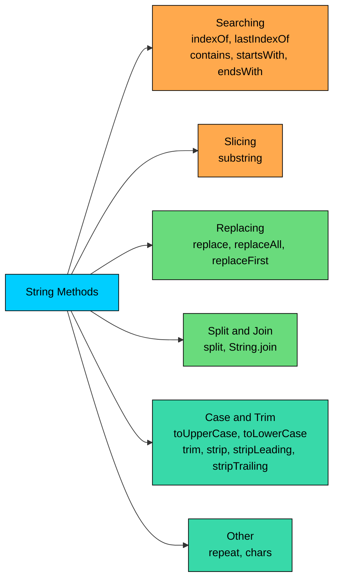

import React from 'react';
import CodeBlock from '../../../../components/ui/CodeBlock';
import Callout from '../../../../components/ui/Callout';

<div className="article-header">
  <div className="breadcrumb">
    <a href="/">Curated Notes</a>
    <span className="breadcrumb-separator">›</span>
    <span className="breadcrumb-current">String Methods</span>
  </div>
  <h1>String Methods</h1>
  <p style={{ color: 'var(--text-muted)', fontSize: '1.1rem', marginBottom: '16px', lineHeight: '1.6' }}>
    Master the essentials of String Methods in this curated guide.
  </p>
  <div className="meta-info">
    <span className="meta-item">
      <svg width="14" height="14" viewBox="0 0 24 24" fill="none" stroke="currentColor" strokeWidth="2"><circle cx="12" cy="12" r="10"/><polyline points="12 6 12 12 16 14"/></svg>
      10 min read
    </span>
    <span className="difficulty-badge difficulty-badge--intermediate">Intermediate</span>
  </div>
</div>

<section className="content-section">

The previous lesson introduced what a `String` is and showed the handful of methods that answer "how big is this?" or "what character sits at this position?". This lesson goes wider. The `String` class ships with dozens of methods for searching inside text, slicing it, swapping characters out, splitting it on a delimiter, changing its case, and trimming whitespace. We'll work through the most useful ones with runnable examples drawn from a normal online store, and call out the spots where the method's behavior surprises beginners.

One thing to keep in mind. Every method on this page returns a new `String`. None of them changes the original. Treat the return value as the thing that holds your result.

---

## Searching Inside a String

The most basic question you can ask a string is "where does this substring start?". `String` has two methods for that. `indexOf` scans from left to right and returns the index of the first match. `lastIndexOf` scans from right to left and returns the index of the last match. Both return `-1` when the target isn't present.


```java
public class FindSubstring {
    public static void main(String[] args) {
        String productName = "Wireless Bluetooth Headphones";

        int firstE = productName.indexOf('e');
        int lastE = productName.lastIndexOf('e');
        int bluetoothStart = productName.indexOf("Bluetooth");
        int missing = productName.indexOf("Wired");

        System.out.println("First 'e' at index:        " + firstE);
        System.out.println("Last 'e' at index:         " + lastE);
        System.out.println("'Bluetooth' starts at:     " + bluetoothStart);
        System.out.println("'Wired' search returns:    " + missing);
    }
}
```


The `-1` is the contract for "not found". Code that uses `indexOf` should always check for that before doing arithmetic on the result, because feeding `-1` into `substring` or array indexing leads to confusing failures further down.

Both methods come in four overloads. The two we've used so far accept either a `char` or a `String`. The other two add a `fromIndex` parameter, which tells the search where to start.


```java
public class SearchFromIndex {
    public static void main(String[] args) {
        String orderDescription = "order-101-item-42-qty-3";

        int firstDash = orderDescription.indexOf('-');
        int secondDash = orderDescription.indexOf('-', firstDash + 1);
        int thirdDash = orderDescription.indexOf('-', secondDash + 1);

        System.out.println("First dash:  " + firstDash);
        System.out.println("Second dash: " + secondDash);
        System.out.println("Third dash:  " + thirdDash);
    }
}
```


The `fromIndex` form is useful when you want to walk through every occurrence of a character or substring. Start at `0`, find the first one, then call the method again starting one position past where the previous match landed.

`lastIndexOf` takes a `fromIndex` too, but the meaning flips. It treats `fromIndex` as the rightmost position the search is allowed to look at and scans backward from there.


```java
public class LastIndexFrom {
    public static void main(String[] args) {
        String filename = "invoice.backup.pdf";

        int lastDot = filename.lastIndexOf('.');
        int dotBefore = filename.lastIndexOf('.', lastDot - 1);

        System.out.println("Rightmost dot:           " + lastDot);
        System.out.println("Dot before that one:     " + dotBefore);
    }
}
```


A common use of `lastIndexOf` is pulling out a file extension or the trailing segment of any string.

---

## Slicing with `substring`

`substring` carves a piece out of a string and hands you back a new `String` containing just that piece. It comes in two forms.

- `substring(beginIndex)` returns everything from `beginIndex` to the end.
- `substring(beginIndex, endIndex)` returns everything from `beginIndex` (inclusive) up to `endIndex` (exclusive).

The half-open range is a common source of off-by-one bugs. The character at `endIndex` isn't in the result. The result's length is `endIndex - beginIndex`.


```java
public class SubstringBasics {
    public static void main(String[] args) {
        String productCode = "ELEC-2024-MOUSE-001";

        String category = productCode.substring(0, 4);
        String year = productCode.substring(5, 9);
        String tail = productCode.substring(10);

        System.out.println("Category: " + category);
        System.out.println("Year:     " + year);
        System.out.println("Tail:     " + tail);
    }
}
```


For the year, `5` is the position of the digit `2` and `9` is the position of the dash that follows the year. The character at `9` isn't included, which is what we want when "year" means four characters.

`substring` pairs well with `indexOf` and `lastIndexOf` when you need to pick a piece out of a string whose exact layout you don't know in advance. Pulling the file extension off a name is the classic case.


```java
public class FileExtension {
    public static void main(String[] args) {
        String upload = "shipping-label-final.pdf";

        int dot = upload.lastIndexOf('.');
        if (dot != -1) {
            String name = upload.substring(0, dot);
            String extension = upload.substring(dot + 1);
            System.out.println("Name:      " + name);
            System.out.println("Extension: " + extension);
        } else {
            System.out.println("No extension found.");
        }
    }
}
```


The `dot + 1` skips the dot itself, which is what most callers want. Off-by-one mistakes around `substring` come in two flavors: forgetting that `endIndex` is exclusive (and slicing one character short), and forgetting to add `1` after a delimiter (and including the delimiter in the result). Reading the boundaries carefully each time is the only fix.

If you ask for indices that don't make sense, `substring` throws `StringIndexOutOfBoundsException` immediately.


```java
public class SubstringBounds {
    public static void main(String[] args) {
        String customer = "Alice";
        System.out.println(customer.substring(2, 10)); // throws
    }
}
```


The valid range is `0 <= beginIndex <= endIndex <= length()`. Calling `s.substring(0, s.length())` is legal and returns a string equal to `s`. Calling `s.substring(s.length())` is also legal and returns an empty string. Going past `length()` isn't.

`substring` allocates a new `String` and copies the selected characters into it. Slicing the same region many times in a loop creates many short-lived objects. If you're carving up the same source string repeatedly, slice once and reuse the result.

---

## Replacing Parts of a String

`String` has a small family of replacement methods, and the differences between them matter. The two safe ones do straight literal replacement. The two regex-aware ones can fail unexpectedly if you don't know they treat their first argument as a regular expression.

The literal versions are `replace(char, char)` and `replace(CharSequence, CharSequence)`. Both swap every occurrence of the first argument with the second, with no regex interpretation. `CharSequence` is a supertype that `String` implements, so passing two strings works as expected.


```java
public class LiteralReplace {
    public static void main(String[] args) {
        String address = "1 Main St, Apt 4";
        String hyphenated = address.replace(' ', '-');
        String expanded = address.replace("St", "Street");

        System.out.println(hyphenated);
        System.out.println(expanded);
    }
}
```


Both calls produce new strings. `address` itself is unchanged. If you want to replace several patterns, chain the calls or assign the intermediate results to a variable.


```java
public class ChainedReplace {
    public static void main(String[] args) {
        String description = "Brand New :: Wireless :: Mouse";
        String clean = description.replace(" :: ", " ").replace("Brand New", "New");
        System.out.println(clean);
    }
}
```


The regex-aware versions are `replaceAll(String, String)` and `replaceFirst(String, String)`. Both treat the first argument as a regular expression pattern. `replaceAll` replaces every match. `replaceFirst` replaces only the leftmost one.


```java
public class RegexReplace {
    public static void main(String[] args) {
        String prices = "Item1: 29 dollars, Item2: 45 dollars, Item3: 12 dollars";

        String withSymbol = prices.replaceAll("dollars", "USD");
        String firstOnly = prices.replaceFirst("dollars", "USD");

        System.out.println("All:   " + withSymbol);
        System.out.println("First: " + firstOnly);
    }
}
```


Because the first argument is a regex, characters with special regex meaning (`.`, `*`, `+`, `?`, `(`, `)`, `[`, `]`, `{`, `}`, `|`, `^`, `$`, `\`) don't match themselves literally. The `.` is the most common source of confusion.

**What's wrong with this code?**


```java
public class DotReplaceBug {
    public static void main(String[] args) {
        String price = "29.99";
        String cleaned = price.replaceAll(".", ",");
        System.out.println(cleaned);
    }
}
```


The caller wanted `29,99`. They got `,,,,,` instead. In a regex, `.` matches any character, so every position in the string is a match and gets replaced. The fix is to either escape the dot or use the literal `replace` method.

**Fix:**


```java
public class DotReplaceFixed {
    public static void main(String[] args) {
        String price = "29.99";
        String cleaned = price.replace(".", ",");
        System.out.println(cleaned);
    }
}
```


For now, the rule of thumb is: if you're replacing a fixed string, use `replace` first. Only use `replaceAll` or `replaceFirst` when a pattern is required.

---

## Splitting into Parts

`split(String regex)` takes a delimiter and breaks the string into an array of pieces. Wherever the delimiter matches, the string is cut, and the parts between cuts become elements of the result.


```java
public class SplitOrder {
    public static void main(String[] args) {
        String order = "shoes,29.99,blue,size-10";
        String[] fields = order.split(",");

        System.out.println("Item:  " + fields[0]);
        System.out.println("Price: " + fields[1]);
        System.out.println("Color: " + fields[2]);
        System.out.println("Size:  " + fields[3]);
        System.out.println("Total fields: " + fields.length);
    }
}
```


The argument to `split` is a regex, the same as with `replaceAll`. A single literal character like `,` happens to have no special regex meaning, so it works as written. If you want to split on a character that does have regex meaning, like `.` or `|`, you've to escape it in the pattern.


```java
public class SplitOnDot {
    public static void main(String[] args) {
        String version = "v1.4.2";
        String[] parts = version.split("\\.");
        System.out.println("Major: " + parts[0]);
        System.out.println("Minor: " + parts[1]);
        System.out.println("Patch: " + parts[2]);
    }
}
```


The pattern `"\\."` is a two-character Java string that contains the two characters backslash and dot. In regex, `\.` means "a literal dot". The double backslash is how Java spells one backslash inside a string literal.

`split` can also drop trailing empty strings from the result, which is a common gotcha.


```java
public class SplitTrailing {
    public static void main(String[] args) {
        String row = "alice,,bob,,,";
        String[] parts = row.split(",");
        System.out.println("Parts: " + parts.length);
        for (int i = 0; i < parts.length; i++) {
            System.out.println(i + ": [" + parts[i] + "]");
        }
    }
}
```


The trailing empty fields after `bob` are removed without warning. If you need them, the two-argument form `split(regex, limit)` with a negative limit keeps every empty field.

Every call to `split` compiles the regex pattern from scratch. If you split the same delimiter many times in a hot loop, pre-compile a `Pattern` once and reuse it.

---

## Changing Case

`toUpperCase()` and `toLowerCase()` return new strings with every letter converted to the matching case. Non-letter characters pass through unchanged.


```java
public class ChangeCase {
    public static void main(String[] args) {
        String productName = "Wireless Mouse";
        System.out.println(productName.toUpperCase());
        System.out.println(productName.toLowerCase());
        System.out.println(productName);
    }
}
```


The third line prints the original because, again, neither method changes the source. Both have a variant that takes a `Locale`, which controls how the case rules are applied for languages where uppercase is more than a simple character swap. The no-argument versions use the JVM's default locale. For e-commerce search and comparison, normalizing to lowercase before comparing is a common pattern, and a locale-aware call (`toLowerCase(Locale.ROOT)`) avoids problems on systems with unexpected defaults.


```java
public class NormalizeForSearch {
    public static void main(String[] args) {
        String query = "Wireless Mouse";
        String catalog = "WIRELESS MOUSE - BLACK";

        boolean match = catalog.toLowerCase().contains(query.toLowerCase());
        System.out.println("Match: " + match);
    }
}
```


---

## Trimming Whitespace

When text comes from a form, a CSV file, or a copy-paste, it usually arrives with stray whitespace at the ends. `trim` and `strip` both clean that up. They differ in what they consider whitespace.

`trim()` is the old method. It removes any leading or trailing character whose code point is at or below `U+0020`, which covers the ASCII space and the usual control characters but not Unicode whitespace.

`strip()`, added in Java 11, removes any character that `Character.isWhitespace` considers whitespace. That includes a wide range of Unicode whitespace characters that `trim` would leave alone.


```java
public class TrimVsStrip {
    public static void main(String[] args) {
        String name = "  Alice  ";
        //   is EM SPACE, a Unicode whitespace character

        System.out.println("[" + name + "]");
        System.out.println("[" + name.trim() + "]");
        System.out.println("[" + name.strip() + "]");
    }
}
```


`trim` left the EM SPACE characters in place because their code point (`0x2003`) is above `0x20`. `strip` removed them because they count as Unicode whitespace.

For plain ASCII input, the two methods behave the same. For anything that might include Unicode whitespace, prefer `strip`. New code should use `strip` by default.

Java 11 also added `stripLeading()` and `stripTrailing()` for one-sided trims.


```java
public class OneSidedStrip {
    public static void main(String[] args) {
        String review = "   Great product   ";
        System.out.println("[" + review.stripLeading() + "]");
        System.out.println("[" + review.stripTrailing() + "]");
    }
}
```


These are useful when you care about whitespace on one side but not the other, like keeping indentation on the left but cleaning trailing spaces on the right.

---

## Checking What a String Contains

Often you don't need the exact position of a substring. You want to know whether the string includes it, or starts or ends with it. Four boolean methods cover those cases.

- `contains(CharSequence target)` returns `true` if `target` appears anywhere in the string.
- `startsWith(String prefix)` returns `true` if the string begins with `prefix`.
- `startsWith(String prefix, int offset)` returns `true` if the string has `prefix` at position `offset`.
- `endsWith(String suffix)` returns `true` if the string finishes with `suffix`.


```java
public class ContainsChecks {
    public static void main(String[] args) {
        String productName = "Wireless Bluetooth Headphones";

        System.out.println("Has 'Bluetooth': " + productName.contains("Bluetooth"));
        System.out.println("Has 'Wired':     " + productName.contains("Wired"));
        System.out.println("Starts wireless: " + productName.startsWith("Wireless"));
        System.out.println("Ends phones:     " + productName.endsWith("phones"));
    }
}
```


`contains` is the easiest way to test for membership. It's roughly the same as `indexOf(target) != -1`, but reads more clearly when position is irrelevant.

The two-argument `startsWith` is helpful when checking for a prefix at a position other than the beginning.


```java
public class StartsWithOffset {
    public static void main(String[] args) {
        String orderId = "ORD-2024-00321";

        boolean is2024 = orderId.startsWith("2024", 4);
        boolean isLegacy = orderId.startsWith("2019", 4);

        System.out.println("From 2024:   " + is2024);
        System.out.println("From 2019:   " + isLegacy);
    }
}
```


You could write the same check with `substring(4, 8).equals("2024")`, but that allocates a temporary string just to throw it away. The `startsWith(prefix, offset)` form does the comparison in place without the extra allocation.

`startsWith(prefix, offset)` avoids the temporary `String` that `substring(...).equals(...)` would create. Tiny gain on a single call, but it shows up when filtering thousands of strings.

All three of these methods are case-sensitive. If you want a case-insensitive check, normalize both sides first.


```java
public class CaseInsensitiveContains {
    public static void main(String[] args) {
        String review = "GREAT PRODUCT, fast shipping";
        String search = "shipping";

        boolean found = review.toLowerCase().contains(search.toLowerCase());
        System.out.println("Found: " + found);
    }
}
```


There's no `containsIgnoreCase` in the `String` API. Lowercasing both sides is the standard workaround.

---

## Repeating a String

Java 11 added `repeat(int count)`, which returns a string consisting of the original repeated `count` times. It's the simplest method on this page.


```java
public class RepeatExample {
    public static void main(String[] args) {
        String separator = "-".repeat(20);
        String dots = ".".repeat(5);
        String empty = "hello".repeat(0);

        System.out.println(separator);
        System.out.println("Loading" + dots);
        System.out.println("[" + empty + "]");
    }
}
```


`repeat(0)` returns the empty string. A negative count throws `IllegalArgumentException`. Before Java 11, the same result took a loop with `StringBuilder`, which we cover in lesson 05.


```java
public class RepeatForReceipt {
    public static void main(String[] args) {
        String border = "=".repeat(30);
        String title = " RECEIPT ";

        System.out.println(border);
        System.out.println(title);
        System.out.println(border);
        System.out.println("Wireless Mouse        $29.99");
        System.out.println("USB Cable             $ 9.99");
        System.out.println(border);
    }
}
```


This is useful any time you need a divider or a column of padding without typing out the characters by hand.

---

## Joining Strings Together

The reverse of `split` is `String.join`. It takes a delimiter and a sequence of pieces, then concatenates the pieces with the delimiter between each pair. There are two forms. One takes a varargs of `CharSequence` (so any number of strings as arguments), and the other takes an `Iterable<? extends CharSequence>` (so a `List`, a `Set`, or anything else you can loop over).


```java
public class JoinVarargs {
    public static void main(String[] args) {
        String address = String.join(", ", "1 Main St", "Apt 4", "Springfield", "12345");
        System.out.println(address);
    }
}
```


The iterable form is the more common choice, because in practice the pieces are usually already in a collection.


```java
import java.util.List;

public class JoinList {
    public static void main(String[] args) {
        List<String> categories = List.of("Books", "Electronics", "Clothing", "Toys");
        String tagline = String.join(" | ", categories);
        System.out.println(tagline);
    }
}
```


The delimiter goes between elements only, never at the start or the end. An empty iterable produces an empty string. A one-element iterable produces just that element with no delimiter.

`String.join` is cleaner than building the same result with a loop and `+=`, and it's faster too, because it allocates one final string instead of one per concatenation.

---

## Looking at Individual Characters with `chars()`

`chars()` returns an `IntStream` of the `char` values (each cast to `int`) in the string. We haven't covered streams yet, so we won't go deep, but one quick use is counting characters that match a condition.


```java
public class CountDigits {
    public static void main(String[] args) {
        String orderRef = "ORD-2024-00321-A1";
        long digitCount = orderRef.chars().filter(Character::isDigit).count();
        System.out.println("Digits: " + digitCount);
    }
}
```


For each character in `orderRef`, `chars()` produces its `int` value. `filter(Character::isDigit)` keeps only the ones that are digits. `count()` returns how many made it through. The result is the number of digits in the string.

For now, treat `chars()` as a way to look at every character in the string with a one-line stream pipeline. You can also walk a string with a `for` loop over `length()` and `charAt(i)`.

---

## A Map of the Methods

The methods we covered split into a small number of categories based on what kind of work they do.





The split between "searching" methods that return positions or booleans and "modifying" methods that return new strings is the main distinction. When the return type of a method is unclear, the next table answers that question for the ones we covered.


| Method | Return type | What it does |
| ------ | ----------- | ------------ |
| `indexOf(int / String)` | `int` | Position of first match, or `-1` |
| `indexOf(int / String, int)` | `int` | First match at or after the given index |
| `lastIndexOf(int / String)` | `int` | Position of last match, or `-1` |
| `lastIndexOf(int / String, int)` | `int` | Last match at or before the given index |
| `substring(int)` | `String` | From `begin` to the end |
| `substring(int, int)` | `String` | From `begin` (inclusive) to `end` (exclusive) |
| `replace(char, char)` | `String` | Replace every matching char, literal |
| `replace(CharSequence, CharSequence)` | `String` | Replace every matching substring, literal |
| `replaceAll(String, String)` | `String` | Replace every regex match |
| `replaceFirst(String, String)` | `String` | Replace the first regex match |
| `split(String)` | `String[]` | Split on a regex delimiter |
| `toUpperCase()` | `String` | All letters to upper case |
| `toLowerCase()` | `String` | All letters to lower case |
| `trim()` | `String` | Strip ASCII whitespace from both ends |
| `strip()` | `String` | Strip Unicode whitespace from both ends |
| `stripLeading()` | `String` | Strip Unicode whitespace from the left |
| `stripTrailing()` | `String` | Strip Unicode whitespace from the right |
| `contains(CharSequence)` | `boolean` | Whether the substring appears |
| `startsWith(String)` | `boolean` | Whether the string starts with the prefix |
| `startsWith(String, int)` | `boolean` | Whether the prefix appears at the offset |
| `endsWith(String)` | `boolean` | Whether the string ends with the suffix |
| `repeat(int)` | `String` | Repeat the string the given number of times |
| `chars()` | `IntStream` | Stream of character code points |
| `String.join(CharSequence, ...)` | `String` | Concatenate pieces with a delimiter |


The static method `String.join` is at the bottom because it's not called on an instance like the others.

</section>
