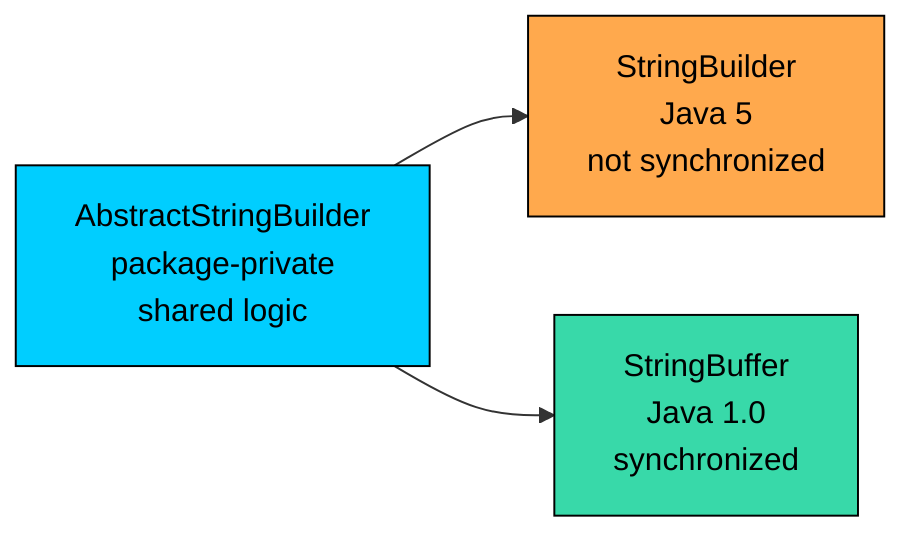
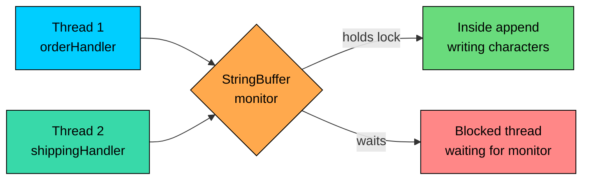

import React from 'react';
import CodeBlock from '../../../../components/ui/CodeBlock';
import Callout from '../../../../components/ui/Callout';

<div className="article-header">
  <div className="breadcrumb">
    <a href="/">Curated Notes</a>
    <span className="breadcrumb-separator">›</span>
    <span className="breadcrumb-current">StringBuffer</span>
  </div>
  <h1>StringBuffer</h1>
  <p style={{ color: 'var(--text-muted)', fontSize: '1.1rem', marginBottom: '16px', lineHeight: '1.6' }}>
    Master the essentials of StringBuffer in this curated guide.
  </p>
  <div className="meta-info">
    <span className="meta-item">
      <svg width="14" height="14" viewBox="0 0 24 24" fill="none" stroke="currentColor" strokeWidth="2"><circle cx="12" cy="12" r="10"/><polyline points="12 6 12 12 16 14"/></svg>
      10 min read
    </span>
    <span className="difficulty-badge difficulty-badge--intermediate">Intermediate</span>
  </div>
</div>

<section className="content-section">

`StringBuffer` is the thread-safe counterpart to the `StringBuilder` you used in the previous lesson. It exposes the same builder API, the same `append`, `insert`, `delete`, `reverse`, `setLength`, and `capacity` you already know, but every mutating method is marked `synchronized`. That one keyword is the entire reason `StringBuffer` exists. This lesson focuses on what that synchronization buys you, what it costs, and when to use `StringBuffer` instead of the faster `StringBuilder`.

---

## A Brief History

`StringBuffer` shipped with Java 1.0 in 1996. At the time, it was the only mutable string class in the JDK, so the language designers made it thread-safe by default. Every public method that changes the internal buffer is `synchronized`, which guarantees correct behavior even when multiple threads share the same instance.

That safety cost performance for the most common case, which is a single thread building a string inside one method. To fix that, Java 5 (2004) added `StringBuilder`. It has the same API but drops the `synchronized` keyword. Both classes extend the package-private `AbstractStringBuilder`, which holds the shared implementation. `StringBuilder` is `AbstractStringBuilder` with a thin public wrapper, and `StringBuffer` is the same wrapper with synchronization added on top.

The practical result is that almost all modern Java code uses `StringBuilder`. `StringBuffer` is left over for the rare cases where the same builder is shared across threads, and for legacy code that has used it since before Java 5.





The diagram shows the relationship. Both public classes inherit the same buffer-management code, and the only meaningful difference is whether each public method takes a lock.

---

## API Parity with StringBuilder

Anything you can do with `StringBuilder` you can also do with `StringBuffer`. The method names, parameter lists, return types, and observable behavior all match. The compiled signatures, however, carry the `synchronized` modifier.


```java
public class BufferApi {
    public static void main(String[] args) {
        StringBuffer label = new StringBuffer();
        label.append("Order #");
        label.append(1042);
        label.append(" - ");
        label.append("Shipped");
        label.insert(0, "[LOG] ");
        System.out.println(label);
        System.out.println("Length: " + label.length());
    }
}
```


If you swap `StringBuffer` for `StringBuilder` in that code, the output is identical. The chains, fluent style, and method behavior are the same. Here are the signatures the JDK actually publishes for the most common mutating methods:


```java
public synchronized StringBuffer append(String str)
public synchronized StringBuffer append(int i)
public synchronized StringBuffer append(char c)
public synchronized StringBuffer insert(int offset, String str)
public synchronized StringBuffer delete(int start, int end)
public synchronized StringBuffer deleteCharAt(int index)
public synchronized StringBuffer reverse()
public synchronized StringBuffer replace(int start, int end, String str)
public synchronized void setLength(int newLength)
public synchronized int length()
public synchronized int capacity()
public synchronized String toString()
```


Even read-only methods like `length()`, `capacity()`, and `toString()` are synchronized. That's intentional. Reading state that another thread might be writing also needs a lock to see a consistent value.

Every call into a `StringBuffer` acquires its monitor and releases it before returning. For a single uncontended thread the JVM optimizes this, but the overhead is non-zero. A tight loop of millions of `append` calls on a `StringBuffer` is measurably slower than the same loop on a `StringBuilder`.

What differs is what happens when more than one thread touches the same instance.

---

## What `synchronized` Actually Gives You

Every Java object has an intrinsic lock, sometimes called a monitor. When a thread enters a `synchronized` instance method, it must acquire that object's monitor. If another thread already holds it, the second thread waits. Only one thread can be inside any synchronized method on the same instance at a time.

That mutual exclusion solves two related problems for `StringBuffer`:

1. **Atomicity of compound updates.** An `append` reads the current length, writes new characters at that offset, and updates the length. Without a lock, two threads could read the same length and overwrite each other's characters. With a lock, the read-write-update sequence runs as one indivisible unit.
2. **Memory visibility.** A write done outside a lock isn't guaranteed to be visible to other threads. The Java Memory Model says that when one thread releases a monitor and another thread acquires it, the second thread sees everything the first one wrote before releasing. Synchronized methods give you that visibility automatically.

The cost is also two-sided: the lock acquire and release work itself, plus the time threads spend blocked when they all want the same lock. In `StringBuffer`'s case, every public mutating method is synchronized on `this`, so the entire object is one big lock. There's no fine-grained locking inside.





The diagram shows two threads racing for the same buffer. Only one of them runs inside `append` at a time. The other one parks until the monitor is free. The order in which they win the race isn't fixed, but the resulting string is always well-formed.

---

## A Concurrent E-Commerce Example

Consider an e-commerce service where two background threads write to a shared shipping audit log. One thread records order events, the other records shipping events, and both append to the same log buffer.

The version that uses `StringBuffer`:


```java
public class ShippingLogSafe {
    public static void main(String[] args) throws InterruptedException {
        StringBuffer auditLog = new StringBuffer();

        Runnable orderEvents = () -> {
            for (int i = 1; i <= 5; i++) {
                auditLog.append("[ORDER #").append(i).append(" placed]\n");
            }
        };

        Runnable shippingEvents = () -> {
            for (int i = 1; i <= 5; i++) {
                auditLog.append("[ORDER #").append(i).append(" shipped]\n");
            }
        };

        Thread t1 = new Thread(orderEvents);
        Thread t2 = new Thread(shippingEvents);

        t1.start();
        t2.start();
        t1.join();
        t2.join();

        System.out.println(auditLog);
        System.out.println("Total characters: " + auditLog.length());
    }
}
```


**Output (one possible run):**


```shell
[ORDER #1 placed]
[ORDER #1 shipped]
[ORDER #2 placed]
[ORDER #2 shipped]
[ORDER #3 placed]
[ORDER #3 shipped]
[ORDER #4 placed]
[ORDER #4 shipped]
[ORDER #5 placed]
[ORDER #5 shipped]
Total characters: 200
```


The exact interleaving of order events and shipping events varies from run to run. What's guaranteed is that every individual `append` completes before any other `append` can start, so no two log entries collide. The total length is always correct, and every entry is intact.

Each `auditLog.append("[ORDER #")` call acquires the lock, writes its characters, and releases the lock. Then `.append(i)` does the same, then `.append(" placed]\n")` does the same. The three appends inside one log line are three separate critical sections. The lock is released between them, so another thread can slip in and write its own entry between two appends of the first thread.

The order of log entries isn't what you might want for an audit log. Synchronization makes the buffer consistent, not the events well-ordered. If you need atomic multi-step entries, wrap the three appends in your own synchronized block:


```java
public class ShippingLogAtomic {
    public static void main(String[] args) throws InterruptedException {
        StringBuffer auditLog = new StringBuffer();

        Runnable orderEvents = () -> {
            for (int i = 1; i <= 3; i++) {
                synchronized (auditLog) {
                    auditLog.append("[ORDER #").append(i).append(" placed]\n");
                }
            }
        };

        Runnable shippingEvents = () -> {
            for (int i = 1; i <= 3; i++) {
                synchronized (auditLog) {
                    auditLog.append("[ORDER #").append(i).append(" shipped]\n");
                }
            }
        };

        Thread t1 = new Thread(orderEvents);
        Thread t2 = new Thread(shippingEvents);

        t1.start();
        t2.start();
        t1.join();
        t2.join();

        System.out.println(auditLog);
    }
}
```


**Output (one possible run):**


```shell
[ORDER #1 placed]
[ORDER #1 shipped]
[ORDER #2 placed]
[ORDER #2 shipped]
[ORDER #3 placed]
[ORDER #3 shipped]
```


Now the three calls inside each iteration run as one critical section. The whole log line appears intact before the other thread gets a turn. The intrinsic lock on `StringBuffer` is reentrant, so the inner synchronized calls inside `append` don't deadlock when wrapped in an outer `synchronized (auditLog)` block.

Wrapping calls in your own `synchronized` block adds work, but it's the same lock the buffer already uses, so there's no extra contention. The blocked time grows with how long each critical section runs, so keep the work inside the lock small.

---

## What Goes Wrong with StringBuilder

If you take the first example and swap `StringBuffer` for `StringBuilder`, the program will still compile and usually print something that looks plausible. The data race is silent most of the time and breaks in unpredictable ways under load.

**What's wrong with this code?**


```java
public class ShippingLogBroken {
    public static void main(String[] args) throws InterruptedException {
        StringBuilder auditLog = new StringBuilder();

        Runnable writer = () -> {
            for (int i = 1; i <= 10_000; i++) {
                auditLog.append("X");
            }
        };

        Thread t1 = new Thread(writer);
        Thread t2 = new Thread(writer);

        t1.start();
        t2.start();
        t1.join();
        t2.join();

        System.out.println("Expected length: 20000");
        System.out.println("Actual length:   " + auditLog.length());
    }
}
```


Each thread tries to append `10_000` characters, so the final length should always be `20_000`. With `StringBuilder` there's no lock around the internal length field or the character array. Two threads can read the same length, write to the same slot, and then both bump the length, so one of the writes is lost. A typical run prints something like this:


```shell
Expected length: 20000
Actual length:   17643
```


Worse outcomes are possible. If one thread sees a length that has already been incremented but a slot that hasn't been written, `toString()` can produce a string with stray null characters. Under the right timing, `StringBuilder` can throw `ArrayIndexOutOfBoundsException` from inside `append` because the internal grow logic ran twice with a stale length.

**Fix:**

Switch to `StringBuffer`, or keep `StringBuilder` and add external synchronization. Both are valid. The choice depends on whether every caller goes through the same code path:


```java
public class ShippingLogFixed {
    public static void main(String[] args) throws InterruptedException {
        StringBuffer auditLog = new StringBuffer();

        Runnable writer = () -> {
            for (int i = 1; i <= 10_000; i++) {
                auditLog.append("X");
            }
        };

        Thread t1 = new Thread(writer);
        Thread t2 = new Thread(writer);

        t1.start();
        t2.start();
        t1.join();
        t2.join();

        System.out.println("Expected length: 20000");
        System.out.println("Actual length:   " + auditLog.length());
    }
}
```


The length is now correct every run, because each `append` is a full critical section.

---

## The Performance Cost of Synchronization

Synchronization isn't free, but it's not catastrophic for single-thread use either. The JVM can detect when a lock is only ever acquired by one thread and apply a series of optimizations. Older HotSpot versions used "biased locking" (deprecated in Java 15 and removed in Java 18) which made the first thread's acquire nearly as cheap as a non-synchronized call. Even on modern JVMs, a single-thread uncontended `synchronized` method costs on the order of a few nanoseconds per call, far less than the cost of growing the internal buffer.

The cost gets real in two situations:

1. **Inside a tight loop on a hot path.** If your code does millions of `append` calls per second on the same buffer from one thread, the per-call overhead adds up. Microbenchmarks routinely show `StringBuilder` running about 10 to 30 percent faster than `StringBuffer` for single-thread workloads.
2. **Under heavy contention.** When several threads compete for the same lock, the loser threads block and the OS may park them. A heavily contended `StringBuffer` can become a serialization point for the whole system.

There's another cost. The JVM uses an optimization called escape analysis to put short-lived objects on the stack instead of the heap. A `StringBuilder` declared and used inside one method is a clear escape-analysis candidate. A `StringBuffer` is harder to optimize this way because its synchronized methods make the JIT compiler more conservative about transforming the code.

A quick microbenchmark to see the difference on your own machine:


```java
public class BuilderVsBuffer {
    public static void main(String[] args) {
        int iterations = 5_000_000;

        long start1 = System.nanoTime();
        StringBuilder builder = new StringBuilder();
        for (int i = 0; i < iterations; i++) {
            builder.append("x");
        }
        long builderTime = System.nanoTime() - start1;

        long start2 = System.nanoTime();
        StringBuffer buffer = new StringBuffer();
        for (int i = 0; i < iterations; i++) {
            buffer.append("x");
        }
        long bufferTime = System.nanoTime() - start2;

        System.out.println("StringBuilder: " + builderTime / 1_000_000 + " ms");
        System.out.println("StringBuffer:  " + bufferTime / 1_000_000 + " ms");
    }
}
```


**Output (sample run on a recent JVM):**


```shell
StringBuilder: 38 ms
StringBuffer:  52 ms
```


Numbers vary by JVM version, hardware, and warmup, but `StringBuilder` is consistently faster on a single thread. For a one-off log entry, the difference is invisible. For a function that runs ten thousand times per second on a server, the gap matters.

Synchronized methods inhibit some JIT optimizations, including stack allocation and method inlining across the lock boundary. If profiling points at a single-thread builder being a hotspot, switching from `StringBuffer` to `StringBuilder` is one of the first changes to try.

---

## When to Use Which

A short decision table covers most cases:


| Situation | Recommended choice |
| --------- | ------------------ |
| Local variable inside a method, never escapes | `StringBuilder` |
| Field of a class used by one thread only | `StringBuilder` |
| Field of a class with concurrent writers from multiple threads | `StringBuffer`, or refactor to remove the sharing |
| Field shared across threads but only one writer | `StringBuilder` with safe publication, or `StringBuffer` as a defensive default |
| Building strings inside a `synchronized` block you already hold | `StringBuilder` (the outer lock already protects it) |
| Modernizing legacy code that uses `StringBuffer` everywhere | Leave it alone unless profiling flags it |


Default to `StringBuilder`. Use `StringBuffer` only when the buffer truly has to be shared. In practice, sharing a mutable string builder across threads is often a sign that the design needs rethinking. Two cleaner alternatives:

1. **Per-thread builders, joined at the end.** Each thread builds its own `StringBuilder` locally and submits the finished string to a shared `ConcurrentLinkedQueue`. A coordinator thread joins them when all workers finish. This avoids contention entirely.
2. **Thread-local builders.** A `ThreadLocal<StringBuilder>` gives each thread a private builder it reuses across calls. The builders are never shared, so no synchronization is needed.

Both approaches usually scale better than a single `StringBuffer` under heavy load, because there's no shared lock to fight over. `StringBuffer` is the simple, correct fallback when there's no time to redesign and the safety is needed today.

---

## Common Pitfalls

A few traps come up enough in real code to call out.

**Trap 1: A synchronized buffer isn't a synchronized algorithm.**


```java
public class CompoundOp {
    public static void main(String[] args) {
        StringBuffer cartLabel = new StringBuffer("cart-");
        // Two threads doing this can interleave the two appends,
        // even though each append is atomic on its own.
        cartLabel.append(System.currentTimeMillis()).append("-end");
        System.out.println(cartLabel);
    }
}
```


Each `append` is atomic, but the chain of two appends isn't. If multiple threads run this code, the timestamp and `-end` suffix from different threads can interleave. Wrap the whole compound operation in `synchronized (cartLabel) { ... }` if you need it to run as one unit.

**Trap 2: `toString()` returns a snapshot.**

Calling `toString()` is synchronized, so it sees a consistent value at that moment. It returns a new `String` object. Any further `append` to the buffer doesn't affect the returned string. This is the desired behavior, though it can be surprising if the result is expected to "live update".

**Trap 3: Mixing `StringBuilder` and `StringBuffer` in the same hot path.**

A common cleanup mistake is leaving a few `StringBuffer` references in code that has been mostly converted to `StringBuilder`. The remaining `StringBuffer` calls pay synchronization cost without buying any safety, because the surrounding code already runs in a single thread. Decide on one and stick with it for a given path.

**Trap 4: Treating `StringBuffer` as a general thread-safe collection.**

`StringBuffer` is only safe for the operations it exposes. If you read its length, then call `setLength`, then `append`, the sequence as a whole isn't atomic. Other threads can change the state between your calls. For multi-step logic, you still need your own lock around the whole sequence.

A chain of three synchronized calls acquires and releases the same lock three times. If you already hold the lock externally, the inner acquires are cheap because the lock is reentrant, but they still aren't free.

</section>
