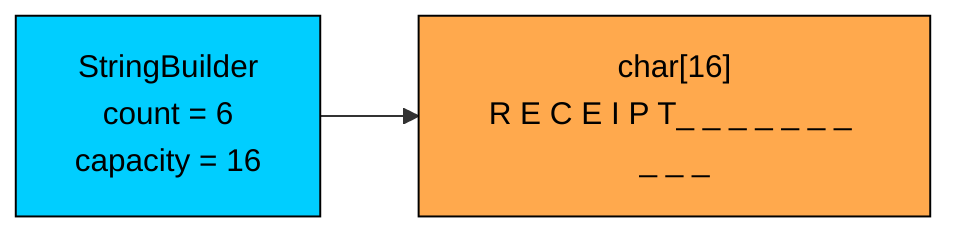
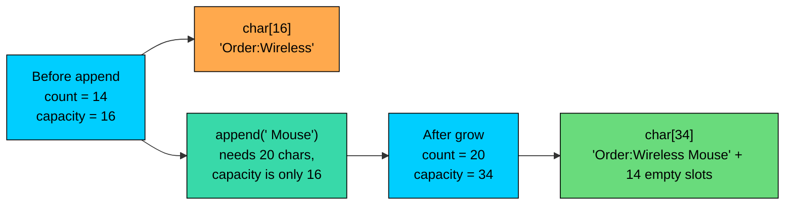

import React from 'react';
import CodeBlock from '../../../../components/ui/CodeBlock';
import Callout from '../../../../components/ui/Callout';

<div className="article-header">
  <div className="breadcrumb">
    <a href="/">Curated Notes</a>
    <span className="breadcrumb-separator">›</span>
    <span className="breadcrumb-current">StringBuilder</span>
  </div>
  <h1>StringBuilder</h1>
  <p style={{ color: 'var(--text-muted)', fontSize: '1.1rem', marginBottom: '16px', lineHeight: '1.6' }}>
    Master the essentials of StringBuilder in this curated guide.
  </p>
  <div className="meta-info">
    <span className="meta-item">
      <svg width="14" height="14" viewBox="0 0 24 24" fill="none" stroke="currentColor" strokeWidth="2"><circle cx="12" cy="12" r="10"/><polyline points="12 6 12 12 16 14"/></svg>
      10 min read
    </span>
    <span className="difficulty-badge difficulty-badge--intermediate">Intermediate</span>
  </div>
</div>

<section className="content-section">

Building a string out of many smaller pieces is one of the most common things a Java program does. Printing a receipt, formatting a product description, joining a list of customer addresses into one block of text. Plain `String` and the `+` operator look like they handle this just fine, until the loop count gets big enough to slow the program down. This lesson explains why that happens, how `StringBuilder` fixes it, and how to use its API correctly.

---

## Why `+` in a Loop Is a Problem

`String` is immutable, which the [String Immutability](/learn/java/string-immutability) lesson covered in depth. Every operation that "changes" a `String` actually allocates a new one. That fact matters because of what `+` between strings actually does.

When you write `a + b` where both are strings, the compiler turns that into code that allocates a new `String` containing the characters of `a` followed by the characters of `b`. The new object is independent of both inputs. The originals are untouched.

For a one-off concatenation, the allocation is cheap and unnoticeable. The trouble starts when the concatenation runs inside a loop.


```java
public class ReceiptWithPlus {
    public static void main(String[] args) {
        String[] productNames = {"Wireless Mouse", "Laptop Stand", "USB Cable", "HDMI Adapter"};
        double[] productPrices = {29.99, 49.50, 9.95, 14.25};

        String receipt = "";
        for (int i = 0; i < productNames.length; i++) {
            receipt = receipt + productNames[i] + ": $" + productPrices[i] + "\n";
        }
        System.out.print(receipt);
    }
}
```


The output looks fine, and for four items the program finishes instantly. Consider what the loop does on each iteration. It reads the current `receipt`, builds a brand new string containing all of its characters plus the new line, and throws the old one away. On iteration one, that's a short string. On iteration two, it copies all the iteration-one characters plus the new line. By iteration `i`, the loop is copying the characters from all `i - 1` earlier iterations again.

If the receipt has `n` items, the total work is roughly `1 + 2 + 3 + ... + n`, which is on the order of `n` squared.

Concatenating in a loop with `+` is O(n squared) on the total output length. Each `+` allocates a new `String` and copies every character built so far. For a 10,000-line receipt that means copying tens of millions of characters and producing tens of thousands of garbage `String` objects.

Two iterations of `+` aren't a problem. Ten thousand are. The fix is a mutable buffer that we write into in place, which is what `StringBuilder` provides.

---

## What `StringBuilder` Is

`StringBuilder` lives in `java.lang`, so no import is needed. Internally it holds two things: a `char[]` buffer and an `int count` that tracks how many characters of the buffer are in use.

When you call `append`, the new characters get written into the buffer starting at position `count`, and `count` moves forward. No new array is allocated unless the buffer runs out of room. That's the difference. `String` concatenation copies. `StringBuilder.append` writes in place.





The diagram shows a `StringBuilder` whose buffer can hold 16 characters but only the first 6 are filled. The trailing slots exist but `count` says they aren't part of the logical content. An `append("S")` would write `S` at index 6 and bump `count` to 7. No new allocation, no copying.

The same receipt loop written with a `StringBuilder`.


```java
public class ReceiptWithStringBuilder {
    public static void main(String[] args) {
        String[] productNames = {"Wireless Mouse", "Laptop Stand", "USB Cable", "HDMI Adapter"};
        double[] productPrices = {29.99, 49.50, 9.95, 14.25};

        StringBuilder receipt = new StringBuilder();
        for (int i = 0; i < productNames.length; i++) {
            receipt.append(productNames[i]).append(": $").append(productPrices[i]).append("\n");
        }
        System.out.print(receipt.toString());
    }
}
```


Same output, different cost. Each `append` writes characters into the existing buffer instead of allocating a new `String`. Across `n` iterations the total work is proportional to the total length of the output, which is O(n), not O(n squared).

The final line, `receipt.toString()`, copies the buffer contents into a real, immutable `String`. That's the one allocation we accept at the end so we've a normal `String` to return or print.

---

## Constructors and Initial Capacity

`StringBuilder` has four useful constructors.


| Constructor | What it does |
| ------------ | ------------- |
| `new StringBuilder()` | Empty builder with capacity 16 |
| `new StringBuilder(int capacity)` | Empty builder with the given capacity |
| `new StringBuilder(String str)` | Builder pre-filled with `str`, capacity is `str.length() + 16` |
| `new StringBuilder(CharSequence seq)` | Same idea for any `CharSequence` |


The first three are the common choices. Each one in action.


```java
public class StringBuilderConstructors {
    public static void main(String[] args) {
        StringBuilder empty = new StringBuilder();
        System.out.println("empty.length()    = " + empty.length());
        System.out.println("empty.capacity()  = " + empty.capacity());

        StringBuilder presized = new StringBuilder(64);
        System.out.println("presized.length() = " + presized.length());
        System.out.println("presized.capacity() = " + presized.capacity());

        StringBuilder filled = new StringBuilder("Order #");
        System.out.println("filled.length()   = " + filled.length());
        System.out.println("filled.capacity() = " + filled.capacity());
    }
}
```


`length()` reports how many characters the builder currently contains. `capacity()` reports how many it could hold before needing to grow. The two are different things, and the gap between them is what makes appends cheap.

The pre-sized constructor matters when the approximate output size is known. Consider generating a receipt with 10,000 line items, each around 40 characters. That's 400,000 characters total. Starting from a builder with capacity 16 means the buffer has to grow many times to reach 400,000.


```java
public class PresizedReceipt {
    public static void main(String[] args) {
        int lineCount = 10_000;
        int approxLineLength = 40;

        StringBuilder receipt = new StringBuilder(lineCount * approxLineLength);
        for (int i = 1; i <= lineCount; i++) {
            receipt.append("Item ").append(i).append(": $19.99\n");
        }
        System.out.println("Receipt length: " + receipt.length());
        System.out.println("Buffer capacity: " + receipt.capacity());
    }
}
```


The buffer never had to grow once. Every `append` was a straight write into the existing array. Without the pre-size, the builder would have doubled its buffer over and over until it reached enough room.

Each grow inside `StringBuilder` allocates a new, larger `char[]` and copies every character from the old buffer into it. Pre-sizing with the constructor avoids those copies when you can estimate the final length.

---

## How the Buffer Grows

When an `append` runs out of room, `StringBuilder` allocates a new `char[]` that's at least twice the old one (specifically, `oldCapacity * 2 + 2`), copies the existing characters over, and points its internal field at the new array. The old array becomes garbage.





The doubling rule is what keeps the amortized cost of `append` low. Even with grows, adding `n` characters across a series of appends takes time proportional to `n` overall, because each character is copied at most a small constant number of times in total. This is why `StringBuilder` is O(n) for a build of total length `n`, while the `+` loop is O(n squared).

You can see the capacity changing if you watch it across appends.


```java
public class GrowthTrace {
    public static void main(String[] args) {
        StringBuilder description = new StringBuilder();
        System.out.println("Start: length=" + description.length() + ", capacity=" + description.capacity());

        description.append("Wireless Mouse with ergonomic grip");
        System.out.println("After 1: length=" + description.length() + ", capacity=" + description.capacity());

        description.append(", USB-C connection, and 12-month warranty");
        System.out.println("After 2: length=" + description.length() + ", capacity=" + description.capacity());
    }
}
```


The exact capacity after each grow depends on the implementation, but the pattern is the same: when the buffer can't fit the new data, it grows to at least double, copies, and continues. Pre-sizing the builder skips this entirely when the final length is known up front.

---

## Appending Data

`append` is the workhorse method. It's overloaded for every primitive type plus `String`, `char[]`, `CharSequence`, and `Object`. For non-string types it converts the value the same way `String.valueOf` would: `int` becomes its decimal text, `double` becomes its standard text form, `boolean` becomes `"true"` or `"false"`, and an arbitrary `Object` calls its `toString()`.


```java
public class AppendOverloads {
    public static void main(String[] args) {
        StringBuilder order = new StringBuilder();
        order.append("Order #");
        order.append(1042);
        order.append(" for ");
        order.append("Alice");
        order.append(", total: $");
        order.append(89.97);
        order.append(", paid: ");
        order.append(true);

        System.out.println(order.toString());
    }
}
```


None of those `append` calls had to wrap the value in a `String.valueOf(...)` first. The overloads handle that for you. A `null` reference passed to `append` is appended as the literal four characters `null`, which is the same behavior `String` concatenation has.

Every mutating method on `StringBuilder` returns the builder itself (`this`), so you can chain calls into a single expression.


```java
public class ChainedAppend {
    public static void main(String[] args) {
        String customerName = "Bob";
        int orderCount = 3;
        double cartTotal = 149.97;

        String summary = new StringBuilder()
            .append("Customer: ").append(customerName)
            .append(", orders placed: ").append(orderCount)
            .append(", cart total: $").append(cartTotal)
            .toString();

        System.out.println(summary);
    }
}
```


Chaining reads naturally and produces no intermediate `String` objects. Each `.append(...)` writes into the same buffer and returns the same builder. Only the final `.toString()` allocates a `String`.

---

## Insert, Delete, Replace, Reverse

`append` only adds to the end. For changes in the middle, `StringBuilder` has `insert`, `delete`, `deleteCharAt`, `replace`, and `reverse`. These are useful when the existing content needs adjustment.

`insert(offset, value)` puts content at a given position and shifts everything after it down. Like `append`, it has overloads for every common type.


```java
public class InsertExample {
    public static void main(String[] args) {
        StringBuilder productLabel = new StringBuilder("Wireless Mouse - $29.99");
        productLabel.insert(0, "SALE: ");
        System.out.println(productLabel);
    }
}
```


`delete(start, end)` removes the characters from index `start` (inclusive) to `end` (exclusive). `deleteCharAt(index)` removes a single character.


```java
public class DeleteExample {
    public static void main(String[] args) {
        StringBuilder address = new StringBuilder("221B  Baker Street");
        address.delete(4, 5);
        System.out.println(address);

        StringBuilder couponCode = new StringBuilder("SAVE10X");
        couponCode.deleteCharAt(couponCode.length() - 1);
        System.out.println(couponCode);
    }
}
```


`replace(start, end, str)` swaps a range of characters for a new string. The new string doesn't have to be the same length as the range it replaces. The buffer adjusts to fit.


```java
public class ReplaceExample {
    public static void main(String[] args) {
        StringBuilder description = new StringBuilder("Laptop Stand - color: black");
        description.replace(20, 25, "silver");
        System.out.println(description);
    }
}
```


`reverse()` reverses the entire content in place. It's occasionally useful and shows up in interview problems, but in production code it's a niche tool.


```java
public class ReverseExample {
    public static void main(String[] args) {
        StringBuilder confirmation = new StringBuilder("ORDER-1042");
        confirmation.reverse();
        System.out.println(confirmation);
    }
}
```


`insert`, `delete`, and `replace` shift characters inside the buffer. Inserting at the front of a long builder moves every existing character. `append` is the cheapest mutation because nothing has to shift.

---

## Random Access and Length

`StringBuilder` lets you read and overwrite individual characters with `charAt(index)` and `setCharAt(index, ch)`. `length()` reports the current logical size, and `setLength(newLength)` can shrink or pad the builder.


```java
public class RandomAccess {
    public static void main(String[] args) {
        StringBuilder productCode = new StringBuilder("MOUSE-001");
        System.out.println("Length: " + productCode.length());
        System.out.println("Char at 0: " + productCode.charAt(0));

        productCode.setCharAt(0, 'm');
        System.out.println("After setCharAt: " + productCode);
    }
}
```


`setLength` controls the logical length. Setting it shorter than the current length truncates the content. Setting it longer pads with the null character `'\u0000'`, which is rarely what you want but can be useful for fixed-width fields.


```java
public class SetLengthExample {
    public static void main(String[] args) {
        StringBuilder couponCode = new StringBuilder("WELCOME10X");
        couponCode.setLength(8);
        System.out.println("After shrink: '" + couponCode + "'");
    }
}
```


For capacity-side control, `ensureCapacity(min)` grows the buffer if it's below `min`, and `trimToSize()` shrinks the buffer to match the current content. `trimToSize` is the call to make after building a large builder you plan to keep around, to release the unused tail of the buffer.


```java
public class CapacityControl {
    public static void main(String[] args) {
        StringBuilder receipt = new StringBuilder();
        receipt.ensureCapacity(1000);
        System.out.println("After ensureCapacity: capacity=" + receipt.capacity());

        receipt.append("Total: $89.97");
        System.out.println("After small append: length=" + receipt.length() + ", capacity=" + receipt.capacity());

        receipt.trimToSize();
        System.out.println("After trimToSize: length=" + receipt.length() + ", capacity=" + receipt.capacity());
    }
}
```


The trim is optional. Most short-lived builders go straight to `toString()` and then become garbage, so trimming buys nothing. The method matters when a builder is held in a long-lived field.

---

## Producing a `String`

The final step in any `StringBuilder` workflow is calling `toString()`. That copies the characters out of the buffer into a fresh, immutable `String` object.


```java
public class FromBuilderToString {
    public static void main(String[] args) {
        StringBuilder builder = new StringBuilder();
        builder.append("Customer: Carol").append(", items: 4");
        String finalText = builder.toString();
        System.out.println(finalText);
        System.out.println("Type of finalText: " + finalText.getClass().getSimpleName());
    }
}
```


A `StringBuilder` isn't a `String`. They're different types, and `StringBuilder` doesn't override `equals` or `hashCode`.

**What's wrong with this code?**


```java
public class BuilderEqualsBug {
    public static void main(String[] args) {
        StringBuilder a = new StringBuilder("Wireless Mouse");
        StringBuilder b = new StringBuilder("Wireless Mouse");
        System.out.println(a.equals(b));
    }
}
```


It prints `false`. Two builders with identical content are still two different objects, and because `StringBuilder` inherits `equals` from `Object`, the default behavior is reference equality. The same code would print `true` for two `String` objects with matching content, because `String` overrides `equals` to compare characters.

**Fix:**

Compare the strings, not the builders.


```java
public class BuilderEqualsFix {
    public static void main(String[] args) {
        StringBuilder a = new StringBuilder("Wireless Mouse");
        StringBuilder b = new StringBuilder("Wireless Mouse");
        System.out.println(a.toString().equals(b.toString()));
    }
}
```


`toString()` produces real `String` objects, and `String.equals` does character-by-character comparison. The other common mistake is forgetting to call `toString()` at all and being surprised by what gets printed elsewhere. Most APIs that take a `CharSequence` (like `System.out.print` or `PrintWriter.write`) will accept a `StringBuilder` directly, but a method that expects `String` will fail to compile if you hand it the builder.


```java
public class ToStringNeeded {
    public static void main(String[] args) {
        StringBuilder receipt = new StringBuilder("Order total: $89.97");
        String upper = receipt.toString().toUpperCase();
        System.out.println(upper);
    }
}
```


`StringBuilder` itself has no `toUpperCase()` method. Convert to `String` first, then call the `String` methods you want.

---

## `+` vs `StringBuilder`: When to Use Which

The compiler isn't blind. For a simple expression like `String greeting = "Hello, " + customerName + "!"`, modern Java compilers translate `+` into a `StringBuilder.append` chain internally (or use `invokedynamic` and `StringConcatFactory` to produce equivalent code). For straight-line code with a handful of pieces, `+` is fine and reads cleaner.

The compiler can't do that optimization across loop iterations. Each iteration is a separate statement, and the result of one iteration is the input to the next. That's where the quadratic behavior comes in, and where `StringBuilder` wins.

A side-by-side conceptual comparison of building a 10,000-line receipt with each approach.


| Approach | Allocations | Total character copies | Big-O |
| -------- | ----------- | --------------------- | ----- |
| `receipt = receipt + line` in a loop | ~10,000 new `String` objects | ~50 million (sum of growing lengths) | O(n squared) |
| `receipt.append(line)` with `StringBuilder` | ~30 buffer grows total | ~10 million (linear in total length) | O(n) |


Exact numbers depend on the JVM and the data, but the shape is consistent across runs. The `+` loop runs noticeably slower as the count grows. The `StringBuilder` loop scales smoothly because the per-iteration cost stays roughly constant.


```java
public class ConcatComparison {
    public static void main(String[] args) {
        int lineCount = 20_000;

        long startPlus = System.nanoTime();
        String plusResult = "";
        for (int i = 0; i < lineCount; i++) {
            plusResult = plusResult + "Item " + i + " at $9.99\n";
        }
        long elapsedPlus = System.nanoTime() - startPlus;

        long startBuilder = System.nanoTime();
        StringBuilder builder = new StringBuilder(lineCount * 25);
        for (int i = 0; i < lineCount; i++) {
            builder.append("Item ").append(i).append(" at $9.99\n");
        }
        String builderResult = builder.toString();
        long elapsedBuilder = System.nanoTime() - startBuilder;

        System.out.println("Lines built: " + lineCount);
        System.out.println("Plus approach length:    " + plusResult.length());
        System.out.println("Builder approach length: " + builderResult.length());
        System.out.println("Plus took (ms approx):    " + (elapsedPlus / 1_000_000));
        System.out.println("Builder took (ms approx): " + (elapsedBuilder / 1_000_000));
    }
}
```


**Output (approximate, varies per machine):**


```shell
Lines built: 20000
Plus approach length:    396789
Builder approach length: 396789
Plus took (ms approx):    1400
Builder took (ms approx): 4
```


Don't read the exact millisecond numbers literally. They depend on your machine, the JVM version, JIT warmup, and what else the system is doing. The ratio is what matters. The plus loop takes hundreds of times longer because of the O(n squared) work it's doing. For 200,000 lines instead of 20,000, the gap widens further. The builder version stays linear.

That said, `+` isn't always worse. Two or three `+` operations in a row produce nearly identical bytecode to a manual builder, and the source is easier to read. The rule of thumb is:

- **Use `+`** for combining a small, fixed number of pieces in straight-line code.
- **Use `StringBuilder`** for concatenating inside a loop, when the number of pieces depends on runtime data, or when content has to be built up gradually across multiple statements.

For one-off concatenations, the readability of `+` wins. For dynamic builds, the performance of `StringBuilder` wins.

---

## Summary

- `StringBuilder` is a mutable `char[]` buffer plus a `count`. `append` writes into the buffer in place and only allocates a new array when the buffer is full, which makes building large strings linear in total length.
- Concatenating with `+` in a loop is O(n squared) on the total output length because `String` is immutable and each iteration copies every character built so far.
- The default capacity is 16. `new StringBuilder(int)` lets you pre-size for known workloads, and `new StringBuilder(String)` starts the builder with content and capacity `str.length() + 16`.
- When a grow is needed, the buffer expands to at least `(oldCapacity * 2) + 2` and copies all existing characters. Pre-sizing avoids these copies.
- Every mutating method (`append`, `insert`, `delete`, `replace`, `reverse`, `setCharAt`) returns `this`, so calls can be chained into a single expression.
- `StringBuilder` doesn't override `equals` or `hashCode`, so comparing two builders with `equals` checks reference identity. Call `toString()` first and compare strings.
- `StringBuilder` isn't a `String`. It has no `toUpperCase`, no `substring`, no regex methods. Materialize a `String` with `toString()` before using `String` APIs.
- Use `+` for a small, fixed number of pieces in straight-line code. Use `StringBuilder` for loops and dynamic builds.

`StringBuilder` is fast because it makes no thread-safety guarantees. Two threads appending to the same builder can corrupt it.

</section>
