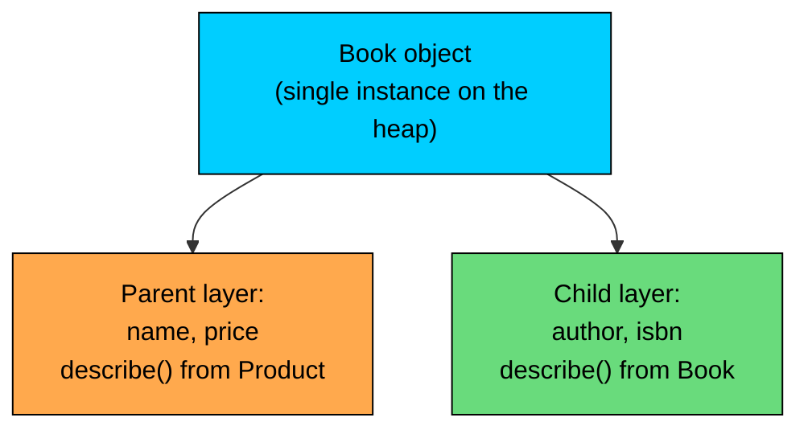
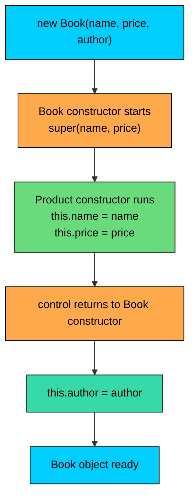

import React from 'react';
import CodeBlock from '../../../../components/ui/CodeBlock';
import Callout from '../../../../components/ui/Callout';

<div className="article-header">
  <div className="breadcrumb">
    <a href="/">Curated Notes</a>
    <span className="breadcrumb-separator">›</span>
    <span className="breadcrumb-current">super Keyword</span>
  </div>
  <h1>super Keyword</h1>
  <p style={{ color: 'var(--text-muted)', fontSize: '1.1rem', marginBottom: '16px', lineHeight: '1.6' }}>
    Master the essentials of super Keyword in this curated guide.
  </p>
  <div className="meta-info">
    <span className="meta-item">
      <svg width="14" height="14" viewBox="0 0 24 24" fill="none" stroke="currentColor" strokeWidth="2"><circle cx="12" cy="12" r="10"/><polyline points="12 6 12 12 16 14"/></svg>
      10 min read
    </span>
    <span className="difficulty-badge difficulty-badge--intermediate">Intermediate</span>
  </div>
</div>

<section className="content-section">

The `extends` lesson showed that a child class inherits the parent's fields and methods automatically. Most of the time inheritance is invisible: the child uses inherited members as if it had written them itself. But sometimes the child needs to reach into the parent on purpose, to read a field that the child has hidden with a same-named field, to call the parent's version of a method that the child has replaced, or to hand arguments to a specific parent constructor. `super` is the keyword that does all three.

---

## The Three Jobs of `super`

`super` is a reference to the parent half of the current object. From inside a child class, you can put `super.` in front of a name to pin the lookup to the parent's version. There are only three places it shows up in practice, and they map to the three jobs.


| Form | Where it appears | What it does |
| --- | --- | --- |
| `super.field` | Inside an instance method or constructor | Reads or writes the parent's field with that name |
| `super.method(...)` | Inside an instance method | Calls the parent's version of a method, ignoring any override in the child |
| `super(...)` | First statement of a child constructor | Calls a specific parent constructor before the child runs |


Every example in this lesson is one of those three forms. They look similar (all use the keyword `super`), but they do different jobs and follow different rules. The simplest mental model is "the parent half of me". When you write `super.something`, you're asking for the version of `something` that belongs to the parent layer of this object, not the version the child redefined.

A child object is a single object that has both layers inside it. The parent fields live in the same object as the child fields, and the parent methods are still there in the method table. `super` is just a name for "look at the parent layer when resolving this".





The diagram is conceptual, not how the JVM lays bytes out in memory. One object holds both layers. `this` looks at the child layer first and falls through to the parent. `super` skips the child and goes straight to the parent layer.

Before going further, three small facts to pin down:

- `super` isn't an object reference you can assign to a variable. It's a keyword the compiler recognizes only in specific positions.
- `super` only exists inside non-static instance code (instance methods and constructors). There's no `super` in a static method, just as there's no `this` in a static method.
- `super` only goes up one level. You can write `super.method()`, but you can't write `super.super.method()`. Java doesn't have a syntax for "skip two parents up".

---

## Accessing a Shadowed Field with `super.field`

Field shadowing happens when a child class declares a field with the same name as a field in its parent. Both fields exist on the object. The child's field hides the parent's field whenever the child code refers to that name without qualification.

Here's the smallest example that shows the trap.


```java
class Product {
    String name = "Generic Product";
}

class Book extends Product {
    String name = "Untitled Book";

    public void show() {
        System.out.println("Bare name: " + name);
        System.out.println("this.name: " + this.name);
        System.out.println("super.name: " + super.name);
    }

    public static void main(String[] args) {
        new Book().show();
    }
}
```


Both fields exist on the same `Book` object. Inside `Book`, a bare `name` and `this.name` both resolve to the child's field, because the lookup starts at the child and stops as soon as it finds a match. `super.name` is the only way to reach the parent's field that the child has shadowed.

In real code, this is almost always a mistake. If a child class redeclares a field that the parent already has, you end up with two storage slots that mean the same thing, and code in the parent and child sees different values. The parent's methods still read the parent's field, while child methods read the child's field. Output gets confusing fast.

The cost here's not performance, it's confusion. Field shadowing is legal Java but almost always a code smell. If you find yourself needing `super.field` to undo a shadow you created on purpose, step back and ask whether the child should reuse the parent's field instead.

The pattern shows up legitimately when a child class wants to keep its own version of a value while still being able to read what the parent stored. A real e-commerce example: a `PhysicalProduct` that has its own display price (already including shipping) but still wants to know the parent's base price.


```java
class Product {
    String name;
    double price;

    public Product(String name, double price) {
        this.name = name;
        this.price = price;
    }
}

class PhysicalProduct extends Product {
    double price;

    public PhysicalProduct(String name, double basePrice, double shipping) {
        super(name, basePrice);
        this.price = basePrice + shipping;
    }

    public void describe() {
        System.out.println(name + " base: $" + super.price);
        System.out.println(name + " with shipping: $" + this.price);
    }

    public static void main(String[] args) {
        PhysicalProduct desk = new PhysicalProduct("Standing Desk", 199.0, 25.0);
        desk.describe();
    }
}
```


The `PhysicalProduct` declares its own `price` field that includes shipping. The parent's `price` still holds the base. `super.price` reads the parent's field, `this.price` reads the child's. Both live inside the same object. This is the rare case where intentional shadowing is acceptable, but it's also exactly the kind of code that confuses readers, so most teams would rename one of the two fields (`displayPrice`, `totalPrice`, or `basePrice`) instead.

---

## Calling a Parent Method with `super.method()`

The second job of `super` is calling the parent's version of a method that the child has overridden. This is the most common use of `super` in production code, because overriding is the whole point of inheritance for behavior.

Overriding will get its full lesson next; for now you only need the rough idea. When a child class defines a method with the same signature as a parent method, the child's version replaces the parent's version for any call on a `Book` object. That replacement is permanent, except for one escape hatch: from inside the overriding method, the child can still call the parent's version with `super.method()`.

Here's the e-commerce example the rest of the lesson will keep coming back to.


```java
class Product {
    String name;
    double price;

    public Product(String name, double price) {
        this.name = name;
        this.price = price;
    }

    public String describe() {
        return name + " - $" + price;
    }
}

class Book extends Product {
    String author;

    public Book(String name, double price, String author) {
        super(name, price);
        this.author = author;
    }

    @Override
    public String describe() {
        return super.describe() + " by " + author;
    }

    public static void main(String[] args) {
        Book book = new Book("Effective Java", 49.99, "Joshua Bloch");
        System.out.println(book.describe());
    }
}
```


The `Book` class wants its `describe` to extend the parent's description, not replace it. A naive override would have to duplicate the `name + " - $" + price` part. Instead, the child calls `super.describe()` to get whatever the parent produces, then adds its own piece on top. If the parent later changes how it formats the description (say, adds a currency symbol), the child automatically picks up the change because it never hard-coded the parent's format.

The flow looks like this when you call `book.describe()`:


The child method runs first because the call lands on a `Book`. From inside that body, `super.describe()` hops up one level and runs the parent's method. When that returns, control comes back to the child, which appends its own piece and returns the final string.

A few details:

- The `super.describe()` call inside `Book.describe()` is the only thing keeping this from being an infinite loop. A bare `describe()` (or `this.describe()`) inside the child would call the child's own method again and recurse forever.
- The parent method still sees the same object. When `super.describe()` runs `name + " - $" + price`, those fields belong to the `Book` instance, not to some separate `Product`. The keyword `super` only changes which version of the method runs, not which object the fields belong to.
- The `@Override` annotation here's a safety net. It tells the compiler "I intend this to override a parent method". If you misspell the method name or change the signature, the compiler catches it.

What about calling `super.method()` outside an override? It works, but it's almost never what you want.


```java
class Book extends Product {
    public void debugParent() {
        System.out.println(super.describe());
    }
}
```


Inside `debugParent`, calling `super.describe()` is identical to calling `this.describe()` for a `Book` that doesn't override `describe`. Once the child does override, `super.describe()` becomes the explicit way to reach past the override. So the pattern is almost always: "I am overriding a method, and I want to reuse the parent's version inside my own."

---

## Calling a Parent Constructor with `super(...)`

The third job is `super(...)`, with parentheses. Inside a constructor, `super(...)` calls a specific constructor of the parent class. It's the only way to pass arguments to the parent during object construction.

Look back at the `Book` example. Its constructor took three arguments, but `Product` doesn't know about `author`. `Product` only knows how to set `name` and `price`. So the `Book` constructor delegates the parent's fields to the parent's constructor and then handles `author` itself.


```java
public Book(String name, double price, String author) {
    super(name, price);     // run Product(String, double) first
    this.author = author;   // then do Book-specific work
}
```


What happens at runtime, in order:

1. You write `new Book("Effective Java", 49.99, "Joshua Bloch")`.
2. The JVM allocates memory for a `Book` object with all fields at their defaults (`null`, `0.0`, etc.).
3. The `Book` constructor body starts running, and its first statement is `super(name, price)`.
4. The `Product(String, double)` constructor runs, setting `this.name` and `this.price` on the same object.
5. Control returns to the `Book` constructor.
6. The `Book` constructor finishes its own work: `this.author = author`.
7. The `new` expression returns the fully built `Book`.





The parent half of the object is built before the child half. That makes sense: if the child constructor wants to use any parent fields, those fields need to be in place first.

A few rules you need to know now:

- `super(...)` must be the **first statement** of a constructor when it appears. Nothing else can run before it.
- A constructor can have **at most one** explicit constructor call at the top, either `super(...)` or `this(...)`, never both.
- If you don't write a `super(...)` call, Java inserts an implicit `super()` (the no-argument parent constructor) for you. This is why simple constructors work even when they never mention `super`.

The implicit `super()` rule has one common gotcha: if the parent doesn't have a no-argument constructor, you must write `super(...)` explicitly. Trying to compile the code below fails:

**What's wrong with this code?**


```java
class Product {
    String name;
    double price;

    public Product(String name, double price) {
        this.name = name;
        this.price = price;
    }
}

class GiftCard extends Product {
    double balance;

    public GiftCard(double balance) {
        this.balance = balance;
    }
}
```


**Fix:**


```java
class GiftCard extends Product {
    double balance;

    public GiftCard(double balance) {
        super("Gift Card", balance);
        this.balance = balance;
    }
}
```


The broken version compiles to an implicit `super()` at the top of `GiftCard`'s constructor, but `Product` has no `Product()` constructor. The compiler reports `constructor Product in class Product cannot be applied to given types`. Adding an explicit `super("Gift Card", balance)` tells the compiler which parent constructor to use.

One variation. If you want each `GiftCard` to share a single "Gift Card" name without writing it into the constructor every time, you can hard-code it:


```java
public GiftCard(double balance) {
    super("Gift Card", balance);   // every gift card is named "Gift Card"
    this.balance = balance;
}
```


The full mechanics of constructor chaining (implicit calls, `this()` vs `super()`, who runs first across multi-level hierarchies) is its own lesson next. For this lesson, what matters is: `super(...)` is how a child constructor passes data to a parent constructor.

---

## `super` vs `this`

The two keywords look symmetric, and a lot of the rules carry over. The side-by-side table below pins down the differences so you can refer back to it when something feels ambiguous.


| Concept | `this` | `super` |
| --- | --- | --- |
| What it refers to | The current instance (whole object) | The parent layer of the current instance |
| Field access | `this.field` reads/writes the field on the current object, child layer first | `super.field` reads/writes the field in the parent layer (skips child shadow) |
| Method call | `this.method()` runs the method using normal dispatch (override-aware) | `super.method()` runs the parent's version, ignoring any override in the child |
| Constructor call | `this(...)` calls another constructor of the same class | `super(...)` calls a constructor of the parent class |
| Position in constructor | `this(...)` must be the first statement | `super(...)` must be the first statement |
| Both at once? | No. A constructor can start with at most one of `this(...)` or `super(...)` | Same |
| Inside a static method | Not allowed | Not allowed |
| Can be reassigned | No, it's a keyword, not a variable | No, same |


A quick way to keep them straight:

- `this` answers "which object am I?". `super` answers "what does the parent layer say?".
- `this.field` and `this.method()` are about a possibly-shadowed or overridden lookup that walks the class hierarchy and picks the most specific version. `super.field` and `super.method()` skip the child and start at the parent.
- `this(...)` and `super(...)` are constructor delegation. One stays in the same class; the other goes up one level.

The shared rule that catches beginners: any explicit constructor call must be the first statement. That applies whether it's `this(...)` or `super(...)`. You can never have both.


```java
public Book(String name, double price, String author) {
    super(name, price);       // legal: super first
    this.author = author;     // legal: regular field assignment
}

public Book(String name, double price, String author) {
    this(name, price, author, "Uncategorized");   // legal: this first
}

public Book(String name, double price, String author) {
    super(name, price);
    this(name, price, author, "Uncategorized");   // illegal: cannot have both
}
```


The third version doesn't compile. Pick one constructor call at the top, then write the rest of the body.

---

## Common Patterns: Extending Behavior in an Override

The most useful pattern in real code is "do what the parent does, then add my piece". The `Book.describe` example earlier did exactly this. The pattern shows up so often that it has a name in some style guides: "calling super". It's a way of extending behavior instead of replacing it.

A slightly larger example with three product types. The parent does the shared work, and each child adds its own information on top.


```java
import java.util.ArrayList;
import java.util.List;

class Product {
    String name;
    double price;

    public Product(String name, double price) {
        this.name = name;
        this.price = price;
    }

    public String describe() {
        return name + " - $" + price;
    }
}

class Book extends Product {
    String author;

    public Book(String name, double price, String author) {
        super(name, price);
        this.author = author;
    }

    @Override
    public String describe() {
        return super.describe() + " by " + author;
    }
}

class Electronics extends Product {
    int warrantyMonths;

    public Electronics(String name, double price, int warrantyMonths) {
        super(name, price);
        this.warrantyMonths = warrantyMonths;
    }

    @Override
    public String describe() {
        return super.describe() + " (warranty: " + warrantyMonths + " months)";
    }
}

class GiftCard extends Product {
    String code;

    public GiftCard(double price, String code) {
        super("Gift Card", price);
        this.code = code;
    }

    @Override
    public String describe() {
        return super.describe() + " [code " + code + "]";
    }

    public static void main(String[] args) {
        List<Product> catalog = new ArrayList<>();
        catalog.add(new Book("Effective Java", 49.99, "Joshua Bloch"));
        catalog.add(new Electronics("Wireless Mouse", 29.99, 12));
        catalog.add(new GiftCard(50.0, "AM-2026"));

        for (Product item : catalog) {
            System.out.println(item.describe());
        }
    }
}
```


Three children, three overrides, all using the same trick: each child calls `super.describe()` to get the formatted name and price, then appends its own piece. If `Product.describe` ever changes (say, to put the price first), every child picks up the change without any edits. Without the `super` call, every child would duplicate the formatting logic, and a future change would mean editing three places instead of one.

A second common variation: the child wraps the parent's call in extra logic, like logging or validation.


```java
class Product {
    int stock;

    public Product(int stock) {
        this.stock = stock;
    }

    public void reduceStock(int amount) {
        stock -= amount;
    }
}

class DigitalProduct extends Product {
    public DigitalProduct(int stock) {
        super(stock);
    }

    @Override
    public void reduceStock(int amount) {
        System.out.println("Logging: digital download requested, amount = " + amount);
        super.reduceStock(amount);
        System.out.println("Logging: stock after = " + stock);
    }

    public static void main(String[] args) {
        DigitalProduct download = new DigitalProduct(100);
        download.reduceStock(3);
    }
}
```


The child adds before-and-after logging without replacing what the parent does. `super.reduceStock(amount)` keeps the actual decrement in one place (the parent). The child just decorates around it.

There's a discipline question hidden here. Some methods are designed to be extended this way; others are designed to be replaced wholesale. The parent class can document the expectation, or in advanced cases use the template method pattern. For now, the rule of thumb: if your override could reuse the parent's work, call `super.method()` first and then add. Don't reinvent the parent's behavior in the child.

---

## Limits and Pitfalls

`super` looks simple, and most uses are. A few standard pitfalls come up often enough to be worth calling out.

#### You Can't Use `super` in a `static` Context

Static methods belong to the class, not to any particular object. There's no current instance, which means there's no "parent of the current instance" either. Trying to use `super` in a static method fails to compile.

**What's wrong with this code?**


```java
class Product {
    public static String greeting() {
        return "Welcome";
    }
}

class Book extends Product {
    public static String greeting() {
        return super.greeting() + " to Books";   // compile error
    }
}
```


**Fix:**


```java
class Book extends Product {
    public static String greeting() {
        return Product.greeting() + " to Books";
    }
}
```


The compiler error reads `non-static variable super cannot be referenced from a static context`. Static methods aren't overridden in the same way instance methods are (they're hidden, not overridden), so the way to call a parent's static method is by its class name, not by `super`.

#### You Can't Skip Levels with `super.super.method()`

`super` always means "exactly one level up". There's no `super.super` syntax to reach the grandparent.

**What's wrong with this code?**


```java
class Product {
    public String describe() { return "Product"; }
}

class Electronics extends Product {
    @Override
    public String describe() { return "Electronics"; }
}

class Phone extends Electronics {
    @Override
    public String describe() {
        return super.super.describe();   // compile error
    }
}
```


**Fix:**

There's no language-level fix. Java intentionally doesn't let you skip levels in the hierarchy. The fix is to redesign so the child doesn't need to reach past its immediate parent. The most common approach is to have the parent expose what the child needs:


```java
class Electronics extends Product {
    @Override
    public String describe() { return "Electronics"; }

    public String parentDescribe() {
        return super.describe();   // Electronics can call up to Product
    }
}

class Phone extends Electronics {
    @Override
    public String describe() {
        return parentDescribe();
    }
}
```


`Electronics` can reach `Product` (one level up), and `Phone` can reach the helper that `Electronics` exposes. Each `super` call is one step. If your design wants the grandchild to ignore its parent entirely, the usual fix is to flatten the hierarchy.

#### `super(...)` Must Be First

The compiler enforces this strictly. You can't print, validate, log, or assign anything before `super(...)`.


```java
public Book(String name, double price, String author) {
    System.out.println("Building book");   // compile error: super call no longer first
    super(name, price);
    this.author = author;
}
```


The fix is to move `super(...)` to the first line. If you want to compute an argument first, you've to do it inline:


```java
public Book(String name, double price, String author) {
    super(name.toUpperCase(), price);   // inline computation is fine
    this.author = author;
}
```


Java 22 added a preview feature called "Flexible Constructor Bodies" (statements before `super(...)`) that relaxes this in narrow cases, and it became a standard feature in Java 25. For the long-stable behavior most projects target today, treat the strict first-statement rule as absolute.

#### Implicit `super()` with No Matching Parent Constructor

This is the most common compile error involving `super`. If you write a constructor that doesn't start with `this(...)` or `super(...)`, the compiler inserts an implicit `super()`. That implicit call requires the parent to have a no-arg constructor.


```java
class Product {
    public Product(String name, double price) {
        // no-arg constructor missing
    }
}

class Book extends Product {
    public Book() {
        // implicit super() here, but Product() doesn't exist
    }
}
```


The compiler error reads `constructor Product in class Product cannot be applied to given types; required: String,double; found: no arguments`. The fix is either to add `super("Default", 0.0)` (or some sensible parent arguments) to `Book`, or to add a `Product()` no-arg constructor to the parent.

#### Forgetting `super(...)` When You Need It

A child constructor can do its own work without ever mentioning the parent's fields, and the parent fields still get default values from the implicit `super()`. That can hide a bug where the child meant to pass real data up but forgot.


```java
class Product {
    String name = "Unknown";
    double price = 0.0;

    public Product() {}

    public Product(String name, double price) {
        this.name = name;
        this.price = price;
    }
}

class Book extends Product {
    String author;

    public Book(String name, double price, String author) {
        // forgot super(name, price); fields stay "Unknown" and 0.0
        this.author = author;
    }

    public static void main(String[] args) {
        Book b = new Book("Effective Java", 49.99, "Joshua Bloch");
        System.out.println(b.name + " " + b.price + " " + b.author);
    }
}
```


The implicit `super()` runs the no-arg `Product()`, which leaves the fields at their declared defaults. Nothing is technically wrong, the program compiles and runs, but the data is wrong. The fix is to call `super(name, price)` explicitly. Make a habit of checking the first line of every constructor in a child class: it should be a `super(...)` call with real arguments unless the parent has nothing to initialize.

</section>
