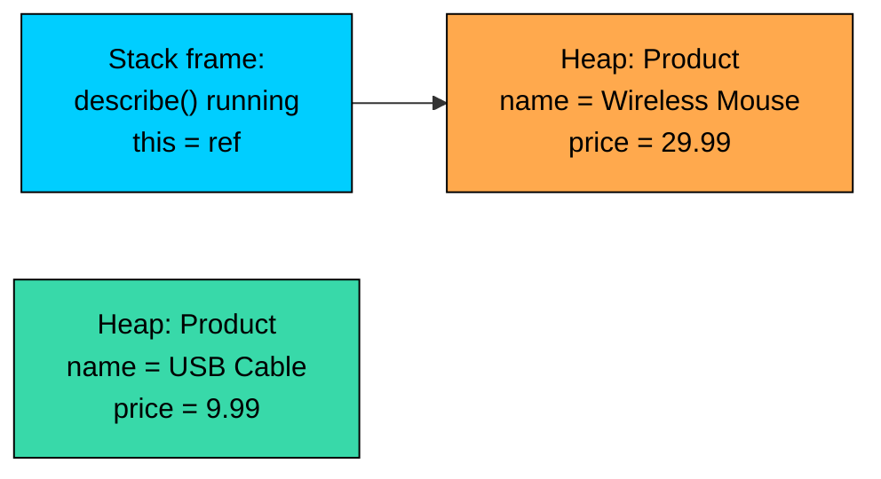
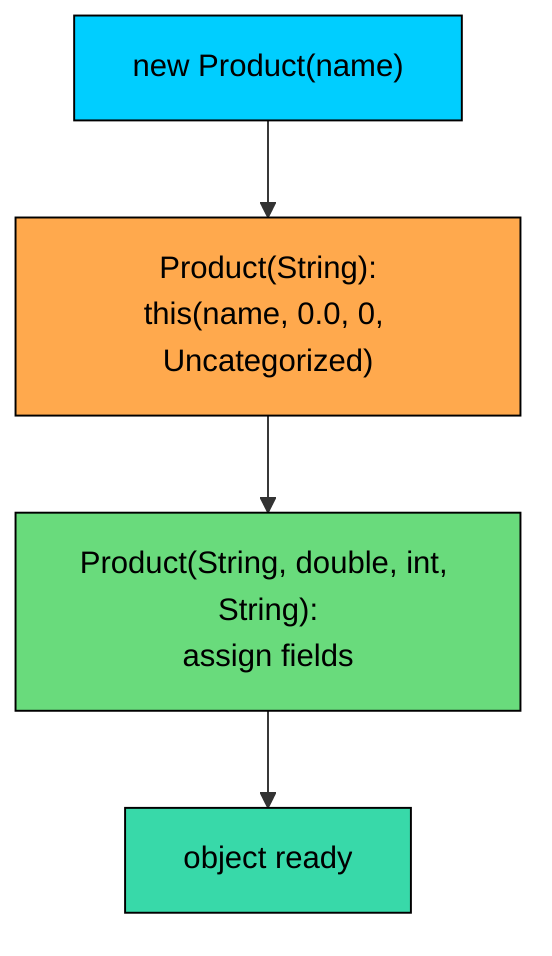

import React from 'react';
import CodeBlock from '../../../../components/ui/CodeBlock';
import Callout from '../../../../components/ui/Callout';

<div className="article-header">
  <div className="breadcrumb">
    <a href="/">Curated Notes</a>
    <span className="breadcrumb-separator">›</span>
    <span className="breadcrumb-current">this Keyword</span>
  </div>
  <h1>this Keyword</h1>
  <p style={{ color: 'var(--text-muted)', fontSize: '1.1rem', marginBottom: '16px', lineHeight: '1.6' }}>
    Master the essentials of this Keyword in this curated guide.
  </p>
  <div className="meta-info">
    <span className="meta-item">
      <svg width="14" height="14" viewBox="0 0 24 24" fill="none" stroke="currentColor" strokeWidth="2"><circle cx="12" cy="12" r="10"/><polyline points="12 6 12 12 16 14"/></svg>
      10 min read
    </span>
    <span className="difficulty-badge difficulty-badge--intermediate">Intermediate</span>
  </div>
</div>

<section className="content-section">

Inside a Java class, methods and constructors often need a way to talk about "the current object", the specific instance whose code is running right now. The `this` keyword is that reference. It looks small, but it touches almost every part of object-oriented code: shadowed parameters, constructor chaining, fluent APIs, and any case where an object hands itself to another object. This lesson covers what `this` is, where it comes from, and the handful of patterns that show up over and over in real code.

---

## What `this` Refers To

Every time a non-static method or constructor runs, Java passes it a hidden reference to the object the call was made on. That hidden reference has a name: `this`. Inside the method body, `this` is just a variable, and its value is the current instance.


```java
public class Product {
    String name;
    double price;

    public void describe() {
        System.out.println(this.name + " costs $" + this.price);
    }

    public static void main(String[] args) {
        Product mouse = new Product();
        mouse.name = "Wireless Mouse";
        mouse.price = 29.99;

        Product cable = new Product();
        cable.name = "USB Cable";
        cable.price = 9.99;

        mouse.describe();
        cable.describe();
    }
}
```


Both calls run the same `describe` method, but the output differs because `this` points to a different `Product` each time. When `mouse.describe()` runs, `this` is `mouse`. When `cable.describe()` runs, `this` is `cable`. The method body says `this.name`, and Java reads the `name` field from whichever object `this` is bound to.

Most of the time you don't have to write `this.` because Java will resolve a bare `name` to `this.name` automatically. The line `System.out.println(this.name + " costs $" + this.price)` could be written `System.out.println(name + " costs $" + price)` and behave identically. The `this.` is still happening internally, just hidden.

The picture in memory. Two `Product` objects sit on the heap. A call to `mouse.describe()` runs the same method code with `this` bound to the `mouse` object.





The dashed line in your head is "the next call from `cable`". If you wrote `cable.describe()` instead, `this` would point at the second box, and `this.name` would read `"USB Cable"`. Same method, different instance, different field values.

A few facts worth pinning down right away:

- `this` is implicit. You don't declare it, you don't pass it, and you can't reassign it.
- `this` is never `null` inside an instance method or constructor. If the method is running at all, there's an object behind the call.
- `this` only exists inside instance methods and constructors. Static methods don't have a current instance, so they don't have a `this`.

---

## Disambiguating Shadowed Names

The most common practical use of `this` is to deal with a name collision between a field and a parameter. This pattern appears in nearly every Java class that has a constructor or a setter.

Consider a `CartItem` class with two fields and a constructor that takes the same names as the fields.


```java
public class CartItem {
    String productName;
    int quantity;

    public CartItem(String productName, int quantity) {
        this.productName = productName;
        this.quantity = quantity;
    }

    public void describe() {
        System.out.println(productName + " x" + quantity);
    }

    public static void main(String[] args) {
        CartItem item = new CartItem("Wireless Mouse", 2);
        item.describe();
    }
}
```


Inside the constructor, the parameter `productName` shadows the field `productName`. Within the body, a bare `productName` refers to the parameter, not the field. To reach the field, you write `this.productName`. The line `this.productName = productName;` reads as "assign the parameter to the field on this object."

Why use the same name on both sides? Because the parameter name is also the field's natural name. Calling them different things just to avoid the shadow ("inner names" like `pName`, or prefixes like `aProductName`) makes the API harder to read. A constructor signature like `CartItem(String productName, int quantity)` is self-documenting. The `this.` is the standard way Java lets you keep both clarities.

What happens if you forget the `this.`?

**What's wrong with this code?**


```java
public class BrokenCartItem {
    String productName;
    int quantity;

    public BrokenCartItem(String productName, int quantity) {
        productName = productName;
        quantity = quantity;
    }
}
```


**Fix:**


```java
public class FixedCartItem {
    String productName;
    int quantity;

    public FixedCartItem(String productName, int quantity) {
        this.productName = productName;
        this.quantity = quantity;
    }
}
```


The broken constructor doesn't touch the fields at all. `productName = productName` reassigns the parameter to itself, which is a no-op. The fields keep their default values (`null` and `0`). The compiler emits a warning ("self-assignment") in modern Java, but no error, so this bug is easy to miss.

The same trap shows up in setters.


```java
public class Product {
    private String name;
    private double price;

    public void setName(String name) {
        this.name = name;
    }

    public void setPrice(double price) {
        this.price = price;
    }

    public String getName() {
        return name;
    }

    public double getPrice() {
        return price;
    }

    public static void main(String[] args) {
        Product mouse = new Product();
        mouse.setName("Wireless Mouse");
        mouse.setPrice(29.99);
        System.out.println(mouse.getName() + " $" + mouse.getPrice());
    }
}
```


The setters take a parameter with the same name as the field they assign. Without `this.`, the assignment would be `name = name`, which does nothing. With `this.`, the parameter goes into the field. The getters don't have the same problem because they don't take a parameter named `name`, so a bare `name` already resolves to the field.

When there's no shadowing, the `this.` is optional. A common style question is whether to write it anyway. Some teams always prefix field reads and writes with `this.` for visual consistency; others use `this.` only when needed to break the shadow. Either is fine. Pick one and stick to it within a codebase.

---

## Calling Another Method of the Same Object

`this` also works as the prefix when one instance method calls another instance method on the same object. This is the same idea as field access, just for methods.


```java
public class Cart {
    double subtotal;
    double discountPercent;

    public double calculateDiscountAmount() {
        return this.subtotal * (this.discountPercent / 100);
    }

    public double calculateTotal() {
        double discount = this.calculateDiscountAmount();
        return this.subtotal - discount;
    }

    public static void main(String[] args) {
        Cart cart = new Cart();
        cart.subtotal = 100.0;
        cart.discountPercent = 15;
        System.out.println("Total: $" + cart.calculateTotal());
    }
}
```


Inside `calculateTotal`, the call `this.calculateDiscountAmount()` runs `calculateDiscountAmount` on the same `Cart` object. The new method body gets the same `this`, so it sees the same `subtotal` and `discountPercent`.

In practice, the `this.` is rarely written here. A bare `calculateDiscountAmount()` resolves to `this.calculateDiscountAmount()` automatically, and reads cleaner.


```java
public double calculateTotal() {
    double discount = calculateDiscountAmount();
    return subtotal - discount;
}
```


The `this.` becomes useful for being explicit about "this is a method on this object, not a static helper or an import". In dense code, that hint can be worth a few extra characters. In short methods, it's noise. Use your judgment.

One place the explicit `this.` does help: code review. While skimming a long method, `this.applyTax(...)` makes it clear without checking that `applyTax` is an instance method on the same class. A bare `applyTax(...)` could be that, or a static method, or a method imported from elsewhere. For a beginner-friendly style, leaning toward `this.` for clarity is a reasonable habit.

---

## `this()` for Constructor Chaining

Inside a constructor, `this(...)` (with parentheses) is a special form that calls another constructor of the same class. It looks like a method call, but it's a constructor call, and it has its own strict rules.

The classic use is to provide multiple convenient ways to build an object without duplicating the field assignments. One constructor does the real work; the rest delegate to it.


```java
public class Product {
    String name;
    double price;
    int stock;
    String category;

    public Product(String name, double price, int stock, String category) {
        this.name = name;
        this.price = price;
        this.stock = stock;
        this.category = category;
    }

    public Product(String name, double price, int stock) {
        this(name, price, stock, "Uncategorized");
    }

    public Product(String name, double price) {
        this(name, price, 0, "Uncategorized");
    }

    public Product(String name) {
        this(name, 0.0, 0, "Uncategorized");
    }

    public void describe() {
        System.out.println(name + " ($" + price + ", stock " + stock + ", category " + category + ")");
    }

    public static void main(String[] args) {
        Product a = new Product("Wireless Mouse", 29.99, 50, "Accessories");
        Product b = new Product("USB Cable", 9.99, 200);
        Product c = new Product("Notebook", 4.99);
        Product d = new Product("Pending Item");

        a.describe();
        b.describe();
        c.describe();
        d.describe();
    }
}
```


Only the four-argument constructor assigns fields. The other three forward to it with sensible defaults. If you ever decide to add validation ("price must be non-negative", "stock can't be negative"), you only add the check in one place, and every constructor path picks it up. Here we focus on `this()` as the tool that makes delegation clean.

Visually, the chain looks like this when `new Product("Pending Item")` runs:





Each step is a constructor running on the same object. The first one hands control to the fullest one, which sets the fields and returns. The object is fully built by the time the outer `new` finishes.

#### Rules for `this()`

`this(...)` isn't a regular method call, and it has constraints the compiler enforces:

- **Must be the first statement** of the constructor. Nothing else can run before it. Not a declaration, not a print statement, not even a comment-only line is a problem, but actual code is.
- **Only allowed inside a constructor**, not in a regular method.
- **At most one** `this(...)` call per constructor. You can't chain into two siblings.
- **Cannot mix** with a `super(...)` call. A constructor body begins with at most one of `this(...)` or `super(...)`, never both.
- **No cycles.** Two constructors can't delegate to each other in a loop. The compiler catches this with a "recursive constructor invocation" error.

What happens when you break the "first statement" rule?

**What's wrong with this code?**


```java
public class Order {
    String customer;
    double total;

    public Order(String customer) {
        System.out.println("Building order for " + customer);
        this(customer, 0.0);
    }

    public Order(String customer, double total) {
        this.customer = customer;
        this.total = total;
    }
}
```


**Fix:**


```java
public class Order {
    String customer;
    double total;

    public Order(String customer) {
        this(customer, 0.0);
        System.out.println("Building order for " + customer);
    }

    public Order(String customer, double total) {
        this.customer = customer;
        this.total = total;
    }
}
```


The compiler error in the broken version reads `call to this must be first statement in constructor`. Move the `this(...)` to the top, and the rest of the constructor body can do whatever it wants. The print now happens after the delegated constructor has already initialized the fields, which is also more useful: by that point the object is fully built.

---

## Returning `this` for a Fluent API

When an instance method returns `this`, the caller gets a reference to the same object back. That lets you chain calls together: each call hands you the object, and you immediately call the next method on it. This style is called a fluent API, and it's how libraries like `StringBuilder`, the Java Stream API, and most builder classes are designed.

A simple shopping cart with chainable methods.


```java
public class ShoppingCart {
    double subtotal;
    String couponCode;
    boolean checkedOut;

    public ShoppingCart add(double itemPrice) {
        this.subtotal += itemPrice;
        return this;
    }

    public ShoppingCart addCoupon(String code) {
        this.couponCode = code;
        return this;
    }

    public ShoppingCart checkout() {
        this.checkedOut = true;
        System.out.println("Subtotal: $" + subtotal + ", coupon: " + couponCode + ", checked out: " + checkedOut);
        return this;
    }

    public static void main(String[] args) {
        ShoppingCart cart = new ShoppingCart();
        cart.add(29.99).add(9.99).addCoupon("SAVE10").checkout();
    }
}
```


Each method modifies the cart and returns `this`. The caller writes one line that reads almost like a sentence: add this, add that, apply this coupon, then check out. Without `return this`, the caller would have to repeat the variable name on every line:


```java
cart.add(29.99);
cart.add(9.99);
cart.addCoupon("SAVE10");
cart.checkout();
```


Both work. The fluent version is shorter and easier to scan once familiar. It's useful for configuration code where the order of calls reads like a recipe.

A few practical notes:

- The return type of a fluent method is usually the class itself, so the chain stays open for the next call.
- Only return `this` when the method really does modify (or apply something to) the current object. A method that returns a new object shouldn't pretend to be fluent on `this`.
- Don't force fluency on every method. If a method is returning data (like a total, or a list of items), let it return that data. Fluency is for builder-style "setup" code, not for queries.

Returning `this` is free. No allocation, no copying, just a reference handed back to the caller. The cost lives in how callers use it, not in the method itself.

The Builder pattern uses this same idea on a separate "builder" object that constructs the real object at the end. For now, this small fluent style is enough to get the idea.

---

## Passing `this` as an Argument

Sometimes an object needs to hand itself to another object. The most common reason is registration: a `Product` registers itself with an `Inventory`, an event source registers a listener with itself, a child component reports back to its parent. In all of those cases, the method call passes `this` as one of the arguments.


```java
import java.util.ArrayList;
import java.util.List;

public class Product {
    String name;
    double price;
    int stock;

    public Product(String name, double price, int stock) {
        this.name = name;
        this.price = price;
        this.stock = stock;
    }

    public void registerWith(Inventory inventory) {
        inventory.add(this);
    }

    public static void main(String[] args) {
        Inventory inventory = new Inventory();

        Product mouse = new Product("Wireless Mouse", 29.99, 50);
        Product cable = new Product("USB Cable", 9.99, 200);

        mouse.registerWith(inventory);
        cable.registerWith(inventory);

        inventory.printAll();
    }
}

class Inventory {
    List<Product> products = new ArrayList<>();

    public void add(Product product) {
        products.add(product);
    }

    public void printAll() {
        for (Product p : products) {
            System.out.println(p.name + " (stock " + p.stock + ", $" + p.price + ")");
        }
    }
}
```


Each `Product`'s `registerWith` method calls `inventory.add(this)`. The `this` here's the product on which `registerWith` was called. The `Inventory` ends up holding a reference to that exact product, not a copy.

This is also how callbacks and observer-style designs work. When a class wants something else to "know about it", it passes `this`. Nothing is special about it; `this` is a reference to the current object, and like any reference, it can be the argument to a method call.

A subtle point: passing `this` shares the object, not a copy. If the inventory later changes a product's stock by calling `product.stock = 0`, the original `mouse` variable in `main` sees the same change, because there's only one product object on the heap. Two pieces of code, one object.

A small variant that makes the registration call from inside a constructor, which is another common pattern.


```java
import java.util.ArrayList;
import java.util.List;

public class CatalogItem {
    String name;
    double price;

    public CatalogItem(String name, double price, Catalog catalog) {
        this.name = name;
        this.price = price;
        catalog.register(this);
    }

    public static void main(String[] args) {
        Catalog catalog = new Catalog();
        new CatalogItem("Wireless Mouse", 29.99, catalog);
        new CatalogItem("USB Cable", 9.99, catalog);
        catalog.printAll();
    }
}

class Catalog {
    List<CatalogItem> items = new ArrayList<>();

    public void register(CatalogItem item) {
        items.add(item);
    }

    public void printAll() {
        for (CatalogItem item : items) {
            System.out.println(item.name + ": $" + item.price);
        }
    }
}
```


The constructor assigns the fields first, then calls `catalog.register(this)`. By the time `this` leaves the constructor, the fields are set, so the catalog ends up with a fully-initialized item. There's one classic trap here, called "leaking `this`": if a constructor passes `this` to outside code before it finishes initializing fields, the outside code might see a half-built object. Keep `this(...)` and field assignments at the top of the constructor and any external calls at the bottom, after the object is in a consistent state.

---

## `this` Inside Different Method Kinds

Where `this` is and isn't allowed, in summary:


| Context | Is `this` available? |
| --- | --- |
| Instance method | Yes, refers to the current instance |
| Constructor | Yes, refers to the instance being built |
| Static method | No, `static` methods have no instance |
| Static initializer block | No, runs before any instance exists |
| Lambda body inside an instance method | Yes, refers to the enclosing instance, same as the outer method |
| Inner class inside an instance | Yes, refers to the inner instance; `OuterName.this` for the outer one |


The headline rule is: `static` methods belong to the class, not to any particular object, so they don't get a `this`.

**What's wrong with this code?**


```java
public class PriceUtil {
    double base;

    public static double halve() {
        return this.base / 2;
    }
}
```


**Fix:**


```java
public class PriceUtil {
    double base;

    public double halve() {
        return this.base / 2;
    }

    public static double halveOf(PriceUtil util) {
        return util.base / 2;
    }
}
```


The compile error for the broken version is `non-static variable this cannot be referenced from a static context`. A `static` method runs without an instance, so there's no current object to read `base` from. The two ways out are: drop the `static` so the method has a `this`, or take a `PriceUtil` as a parameter and read the field through that.

The same error appears if you try to use a bare field name inside a static method, because the bare `base` would resolve to `this.base`.


```java
public static double halve() {
    return base / 2; // same error: non-static variable base referenced from static context
}
```


The compiler isn't bothered by `static` itself, it's bothered by the implicit `this.` that would have to exist to make sense of `base`. The error follows directly from how `this` works.

---

## Style: When to Write `this.` and When to Skip It

The `this.` prefix is always optional except in two cases where you need it for the code to compile or do the right thing:

1. Inside a constructor or setter where a parameter shadows a field of the same name. Here `this.field = field` is the standard idiom.
2. When passing the current object as an argument or returning it, like `inventory.add(this)` or `return this`. The keyword carries the meaning, so it isn't optional.

Outside those cases, `this.` is a style choice. Some teams use it on every field and method reference because the visual marker makes "this is my own data" easier to spot, especially in long methods. Other teams omit it everywhere except where required, on the grounds that less code is easier to read.

A reasonable rule of thumb:

- Always use `this.` to break a shadow.
- Use `this.` if it helps a human reader (long methods, lots of imports, mixed static and instance code).
- Skip `this.` in short, obvious methods where it adds noise.

The compiler doesn't care. Pick one style per project and stay consistent. Mixing styles inside one class is the worst of both worlds, because readers can't tell whether the omission of `this.` means anything.

---

## Putting It All Together

A slightly larger example that combines most of the patterns in one class: shadowed parameters in the constructor, `this()` for chaining, `return this` for fluency, and `this` as an argument when the item registers with the catalog.


```java
import java.util.ArrayList;
import java.util.List;

public class Item {
    private String name;
    private double price;
    private int stock;

    public Item(String name, double price) {
        this(name, price, 0);
    }

    public Item(String name, double price, int stock) {
        this.name = name;
        this.price = price;
        this.stock = stock;
    }

    public Item setPrice(double price) {
        this.price = price;
        return this;
    }

    public Item setStock(int stock) {
        this.stock = stock;
        return this;
    }

    public Item registerWith(Catalog catalog) {
        catalog.add(this);
        return this;
    }

    public void describe() {
        System.out.println(name + ": $" + price + ", stock " + stock);
    }

    public static void main(String[] args) {
        Catalog catalog = new Catalog();

        new Item("Wireless Mouse", 29.99)
            .setStock(50)
            .registerWith(catalog);

        new Item("USB Cable", 9.99, 200)
            .registerWith(catalog);

        new Item("Notebook", 4.99)
            .setPrice(3.99)
            .setStock(120)
            .registerWith(catalog);

        catalog.printAll();
    }
}

class Catalog {
    private List<Item> items = new ArrayList<>();

    public void add(Item item) {
        items.add(item);
    }

    public void printAll() {
        for (Item item : items) {
            item.describe();
        }
    }
}
```


Walk through what's happening, piece by piece. The two-argument constructor delegates to the three-argument one with `this(name, price, 0)`, so default stock lives in exactly one place. The three-argument constructor uses `this.field = field` four times to break the shadow between parameters and fields. Each setter returns `this`, so the calls chain into the registration step at the end. The `registerWith` method passes the freshly built (and configured) item to the catalog as `this`. The catalog stores a reference to each item, and `printAll` iterates over them later.

That single class touches every use of `this` from the lesson. None of them are exotic; they reflect idiomatic Java code.

</section>
