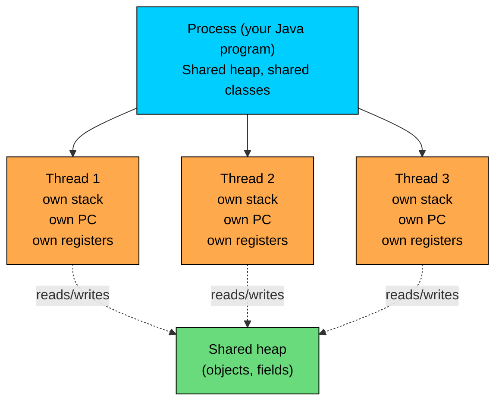
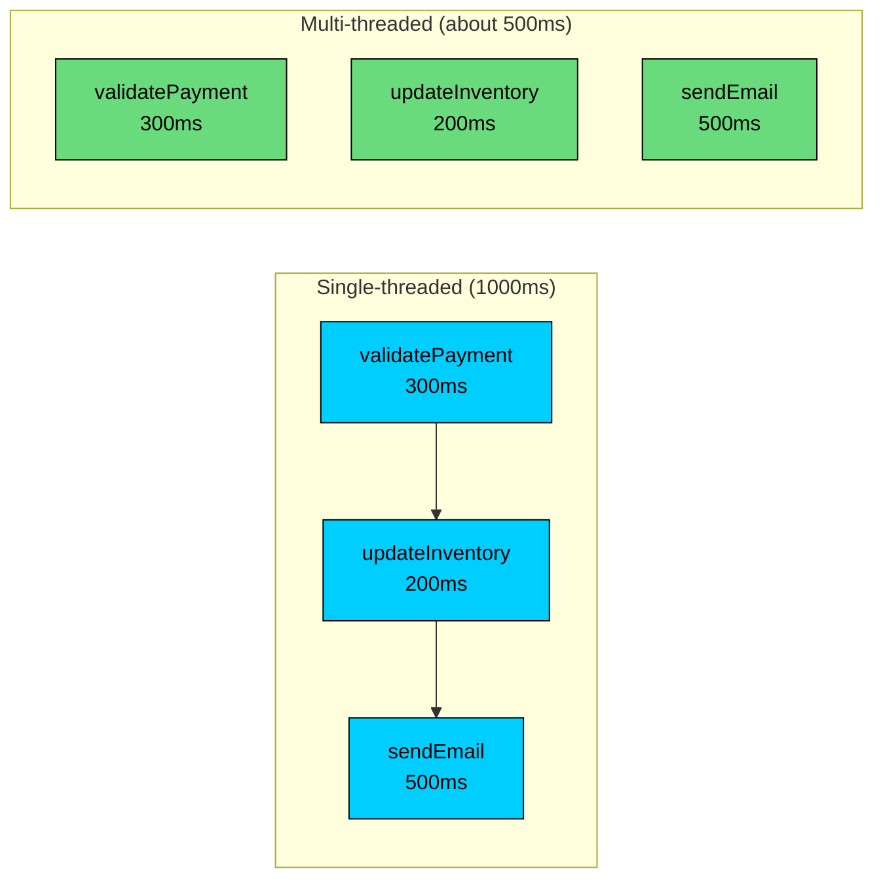
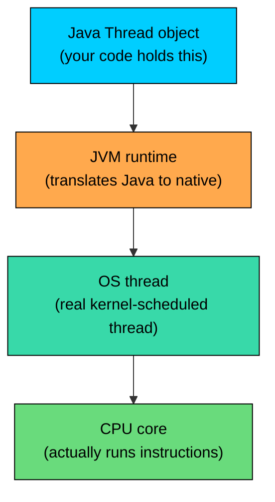
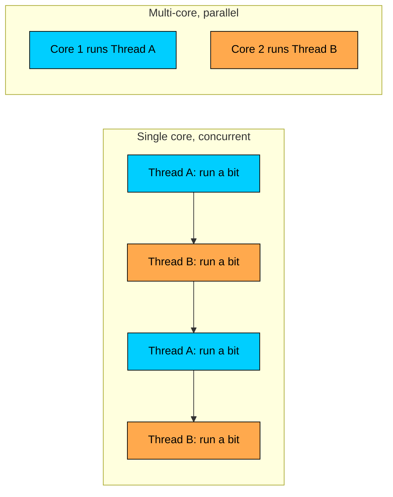
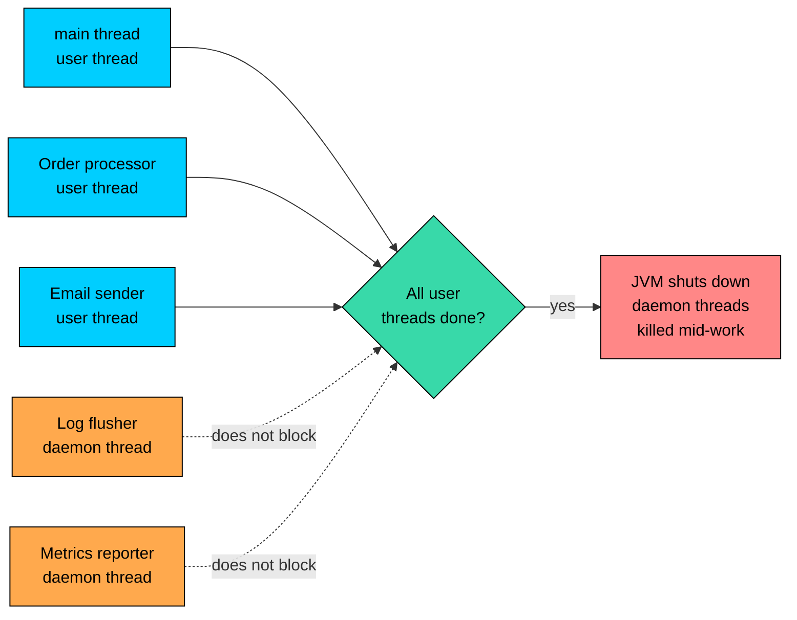
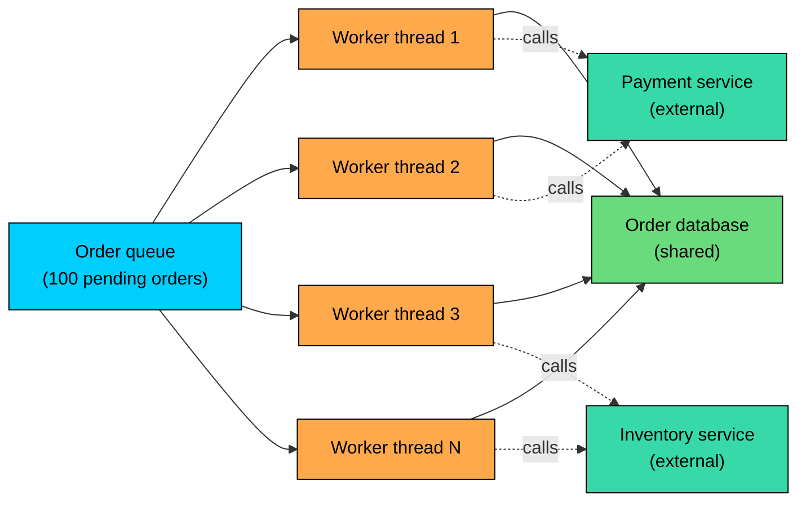
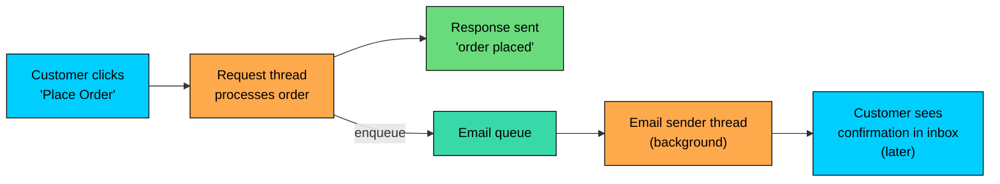

import React from 'react';
import CodeBlock from '../../../../components/ui/CodeBlock';
import Callout from '../../../../components/ui/Callout';

<div className="article-header">
  <div className="breadcrumb">
    <a href="/">Curated Notes</a>
    <span className="breadcrumb-separator">›</span>
    <span className="breadcrumb-current">Threads Basics</span>
  </div>
  <h1>Threads Basics</h1>
  <p style={{ color: 'var(--text-muted)', fontSize: '1.1rem', marginBottom: '16px', lineHeight: '1.6' }}>
    Master the essentials of Threads Basics in this curated guide.
  </p>
  <div className="meta-info">
    <span className="meta-item">
      <svg width="14" height="14" viewBox="0 0 24 24" fill="none" stroke="currentColor" strokeWidth="2"><circle cx="12" cy="12" r="10"/><polyline points="12 6 12 12 16 14"/></svg>
      10 min read
    </span>
    <span className="difficulty-badge difficulty-badge--intermediate">Intermediate</span>
  </div>
</div>

<section className="content-section">

A thread is the smallest unit of work a program can hand off to the CPU. Every Java program runs on at least one thread. The moment a program needs to do more than one thing at a time, like preparing an order, syncing inventory, and sending a confirmation email all at once, that single thread becomes a bottleneck. This lesson covers what a thread is, how it differs from a process, why concurrent code matters for an e-commerce backend, how OS threads relate to JVM threads, what the "main thread" is, the difference between concurrency and parallelism on multi-core CPUs, and the idea of daemon threads. We're staying at the concept level here.

---

## What a Thread Actually Is

A thread is a sequence of instructions the CPU executes in order. Each thread has its own program counter (the pointer to the next instruction), its own stack (for local variables and method call frames), and its own register state. When the operating system runs a thread, it loads those pieces into the CPU and starts executing instructions one after another until it pauses the thread or the thread finishes.

What a thread does **not** have its own copy of is the heap. Inside a single program, all threads share the same heap memory. That sharing is the source of every interesting and every dangerous thing about multithreading. Two threads can both reach the same `Product` object, the same `ShoppingCart`, the same `inventoryCount` counter. They can read each other's work in real time. Coordinating that sharing is what most of this section covers.





The diagram shows the layout that matters in practice. A single Java process can hold many threads. Each one has private execution state. They all share the heap, which is where your `Product`, `Order`, and `Customer` objects live. When two threads read the same `Order` object, they're reading the same bytes in memory, not their own copies. When one thread changes `order.status`, the other thread eventually sees the change (the exact rules around "eventually" are why we've `volatile`, `synchronized`, and the rest of this section).

A `main` method runs top to bottom. Calls go onto a stack, returns pop frames off. That sequence is what one thread is doing. Add a second thread and there are two such sequences happening at the same time, sharing access to the same objects.

---

## Process vs Thread

A process is what the operating system thinks of as a running program. When you run `java MyProgram`, the OS creates a process. That process gets its own virtual address space, its own file handles, its own environment variables. Processes are isolated from each other by default. Two processes can't read each other's memory without going through OS-level channels (sockets, pipes, shared memory files).

A thread lives inside a process. Threads in the same process share the process's address space and resources. They share file handles, they share open network connections, they share loaded classes. Switching between threads is cheap because the OS doesn't have to swap address spaces. Switching between processes is more expensive because it does.


| Aspect             | Process                              | Thread                              |
| ------------------ | ------------------------------------ | ----------------------------------- |
| Memory             | Own virtual address space            | Shares the parent process's heap    |
| Creation cost      | High (often milliseconds)            | Low (microseconds, give or take)    |
| Context switch     | Expensive (swap address spaces)      | Cheap (just swap registers + stack) |
| Communication      | Sockets, pipes, shared memory files  | Direct field reads and writes       |
| Isolation          | Strong (OS-enforced)                 | Weak (one bad thread can corrupt shared state) |
| Crash blast radius | One process crashes, others survive  | One thread crash usually kills the process |


The trade-off is honest: processes are safer but slower to coordinate, threads are faster but require care. For most of what an e-commerce backend needs to do (handle a few thousand concurrent customer actions per second), threads inside one JVM are appropriate. Separate processes make sense when strong isolation or scaling across machines is required, both of which are out of scope here.

A useful mental model: a process is a building, a thread is a person working in that building. The building has walls (the address space) that keep outsiders out. The people inside can talk freely, share the kitchen, share the printer. If two of them try to use the printer at the same time without coordinating, paper jams.

---

## Single-Threaded vs Multi-Threaded Execution

Every Java program starts out single-threaded. The JVM spins up one thread, runs your `main` method on it, and exits when `main` returns and there are no other live user threads. In a single-threaded program, everything happens one step at a time, in the order you wrote it.

Here's a snapshot of a tiny e-commerce flow that runs entirely on one thread:


```java
public class SingleThreadedCheckout {
    public static void main(String[] args) {
        long startMillis = System.currentTimeMillis();

        validatePayment("order-1001");
        updateInventory("order-1001");
        sendConfirmationEmail("order-1001");

        long elapsed = System.currentTimeMillis() - startMillis;
        System.out.println("Total time: " + elapsed + " ms");
    }

    static void validatePayment(String orderId) {
        sleep(300);
        System.out.println(orderId + ": payment validated");
    }

    static void updateInventory(String orderId) {
        sleep(200);
        System.out.println(orderId + ": inventory updated");
    }

    static void sendConfirmationEmail(String orderId) {
        sleep(500);
        System.out.println(orderId + ": confirmation email sent");
    }

    static void sleep(long millis) {
        try { Thread.sleep(millis); } catch (InterruptedException e) { Thread.currentThread().interrupt(); }
    }
}
```


Three steps, each one waiting for the previous to finish. Payment takes 300ms, inventory takes 200ms, email takes 500ms. Total wall-clock time: roughly 1000ms. The three steps don't actually depend on each other in a meaningful way. Inventory doesn't need the email to be sent first. Email doesn't need inventory to be updated first. They're sequential only because the code is sequential.

A multi-threaded version of the same flow can run the three steps at the same time, on three different threads, and finish in about the time of the longest step (500ms) instead of the sum of all three. The threaded version comes later. Single-threaded means one sequence, one CPU instruction at a time, even on a machine with 16 idle cores.





The left side runs one step at a time. The right side runs them in parallel, and the total time is the longest single step rather than the sum. The savings get more dramatic as you add more independent work. Process ten orders sequentially at 1000ms each and the total wait is 10 seconds. Process them on ten threads and the total can be roughly 1 second, plus a small amount of coordination overhead.

Independent work doesn't need to be done sequentially, and forcing it to be sequential wastes time the user is waiting on.

---

## Why Concurrency Matters

There are two distinct reasons to use multiple threads in a real application. Both show up in any non-trivial e-commerce backend.

The first reason is **responsiveness**. Some work is slow because it's waiting on something the CPU can't speed up: a database query, an HTTP call to a payment provider, a file write, a queue read. While one thread is waiting, the CPU is idle as far as that thread is concerned. Other work can run on a different thread instead of letting the CPU stand around. The user notices because their page loads faster or their order confirmation arrives sooner.

The second reason is **throughput**. Modern CPUs have many cores, often eight or more on a developer laptop, sixteen to sixty-four on a server. A single-threaded program uses exactly one of those cores. The others are wasted. With a stream of independent work items (a queue of orders to process, a batch of product images to resize), running multiple threads uses multiple cores at once and finishes more work per second. The user notices because the system can handle more traffic without slowing down.

A backend handling Black Friday traffic needs both. It needs responsiveness so each individual customer's checkout doesn't feel slow. It needs throughput so the system can serve a few thousand customers per second without queueing up.


| Goal           | Bottleneck            | Threads help by                              | Example                                  |
| -------------- | --------------------- | -------------------------------------------- | ---------------------------------------- |
| Responsiveness | I/O wait              | Doing other work while one thread blocks     | Loading product details while fetching reviews |
| Throughput     | Limited cores in use  | Spreading independent work across cores      | Processing 100 orders in parallel        |
| Latency hiding | Slow external service | Calling slow services in the background      | Sending email asynchronously             |
| Fairness       | One slow user         | Isolating slow work so it doesn't block fast | Long report doesn't freeze short queries |


Concurrency is the broader idea: structuring a program to work on multiple things at once. Parallelism is one specific way to achieve concurrency, by literally running tasks on different cores simultaneously. A program can be concurrent without being parallel (one core, time-sliced between threads) and parallel without being fancy about it (just split the work across cores). Both shapes are useful and both show up in an e-commerce backend.

Threads aren't free. Each thread allocates a stack (typically 512KB to 1MB on a default JVM). Creating one thread takes hundreds of microseconds. Switching between threads also costs CPU time. Spawning a thread per request worked fine in 2005; at modern scale, you use thread pools or virtual threads instead.

---

## OS Threads vs JVM Threads

When you call `Thread.start()` in Java, the JVM asks the operating system for a real OS thread. The Java `Thread` object you're holding is a thin wrapper. The actual execution happens on an OS thread that the OS schedules onto a CPU core just like it would for a thread from a C program or a Python program.

That mapping matters for two reasons. First, it means Java threads are real preemptive threads. The OS can pause one at any instruction and switch to another. There's no guarantee that a method runs to completion before another thread gets a turn. Second, it means everything the OS knows about threads applies: there's a hard limit on how many can be created (typically a few thousand per process, bounded by stack space and OS settings), creating one is moderately expensive (kernel call plus memory allocation), and the kernel manages the scheduling, not the JVM.





A Java `Thread` isn't the thing running on the CPU. It's a handle to the thing running on the CPU. The JVM keeps the mapping alive, the OS does the scheduling, and the core does the work. Creating 5,000 Java `Thread` objects on a typical Linux server also creates 5,000 OS threads, which is enough to put pressure on the kernel scheduler and use a few gigabytes of stack space.

This one-to-one mapping is sometimes called "platform threads" to distinguish it from virtual threads (added in Java 21). Virtual threads are scheduled by the JVM, not the OS, and many virtual threads share a small pool of OS threads. They've a different cost profile (cheap to create, ideal for I/O-bound code) but the same programming model. In this section, "thread" means "platform thread, backed one-to-one by an OS thread."

The number of CPU cores on the machine puts a ceiling on real parallelism. A machine with 8 cores can execute at most 8 thread instructions at the same instant. Anything beyond that's the OS rotating threads onto and off of the cores. That rotation is fast (microseconds), which is why programs feel like they're doing many things at once even though the underlying truth is that the OS is taking turns very quickly.

---

## The Main Thread

Every Java program starts with one thread, named `main`, running the `main` method. Nothing about the syntax of `main` says "this is a thread method", but the JVM treats it that way. From the moment the JVM starts to the moment your `main` method returns, the main thread is what's executing your code.


```java
public class MainThreadInfo {
    public static void main(String[] args) {
        Thread current = Thread.currentThread();
        System.out.println("Thread name: " + current.getName());
        System.out.println("Thread id: " + current.threadId());
        System.out.println("Is daemon? " + current.isDaemon());

        System.out.println("Placing order on the main thread...");
        placeOrder("order-1001");
        System.out.println("Done.");
    }

    static void placeOrder(String orderId) {
        System.out.println(orderId + " is being processed on " + Thread.currentThread().getName());
    }
}
```


`Thread.currentThread()` returns the `Thread` object that's currently executing the code that called it. In `main`, that's the main thread. The name `main` is set by the JVM. The id is a number the JVM assigns. The `isDaemon()` answer is `false`, which comes back into focus in a moment.

When `placeOrder` runs, it's still running on the main thread, because there's no other thread in this program. Every method call from `main`, and every method those methods call, runs on the main thread until work is explicitly handed off to a different thread.

The main thread is special in one way: it's where the JVM starts. After that, it has the same properties as any other user thread. It can be paused, it can finish first or last, it can be joined by other threads. The JVM doesn't keep running just because the main thread ended; it keeps running as long as any user (non-daemon) thread is alive. That last detail matters once additional threads enter the picture.

The main thread's stack is sized by the `-Xss` JVM flag, which defaults to a few hundred kilobytes to a megabyte depending on the platform. Very deep recursion in `main` can throw `StackOverflowError` even on a beefy machine. It's the same stack budget as any thread.

---

## Parallelism vs Concurrency

These two words get used interchangeably in conversation and they shouldn't be. The distinction is small but it explains a lot about how code actually runs.

**Concurrency** is a property of a program's structure. A concurrent program is one that's organized as multiple independent sequences of work that can make progress without strict ordering. It says nothing about how those sequences run. Concurrency works on a single core, by rapidly switching between threads.

**Parallelism** is a property of execution. A parallel program is one whose sequences of work are literally running at the same instant, on different cores. Parallelism requires multiple cores. Concurrency doesn't.

A useful framing: concurrency is about dealing with many things at once; parallelism is about doing many things at once.





The left side shows concurrency without parallelism: one core, the OS switches between threads. From a wall-clock perspective both threads are "running", but only one of them is actually executing CPU instructions at any moment. The right side shows parallelism: two cores, two threads, both running instructions at the same time. In a real Java backend with 8 cores and 200 threads, parallelism (up to 8 threads running at once) layers with concurrency (the other 192 threads taking turns on those 8 cores).

The distinction matters because not every problem benefits from parallelism, but most non-trivial programs benefit from concurrency. Sending a confirmation email after each order doesn't need a second core; it just needs to not block the main checkout flow. Resizing 1,000 product images does benefit from a second core, and a third, and a fourth, because the work is CPU-bound and splits cleanly.


| Workload type        | Helped by concurrency? | Helped by parallelism?       | E-commerce example                |
| -------------------- | ---------------------- | ---------------------------- | --------------------------------- |
| I/O-bound            | Yes (lots)             | Marginal                     | Fetching reviews from a service   |
| CPU-bound            | A little               | Yes (up to core count)       | Resizing product images           |
| Mixed                | Yes                    | Yes                          | Generating recommendation feeds   |
| Tiny and fast        | No                     | No                           | Adding tax to a single price      |


The takeaway is to pick the right reason. If the work is I/O-bound, threads help by letting other work run during the wait, not by using more cores. If the work is CPU-bound, threads help by using more cores, and gains stop past one thread per core. Mixing them up leads to over-threading the I/O case (creating thousands of threads that mostly sleep) and under-threading the CPU case (running 200 CPU-bound threads on 8 cores, mostly overhead).

---

## Daemon Threads (Concept Only)

Java distinguishes two kinds of threads: **user threads** and **daemon threads**. The distinction matters for one thing: when the JVM decides to shut down.

The JVM keeps running as long as at least one user thread is alive. When the last user thread finishes, the JVM shuts down, even if daemon threads are still running. Daemon threads are background helpers; they don't keep the program alive on their own.

The main thread is a user thread by default. Threads created from application code are user threads by default. A thread is typically marked as a daemon when its job is to support the main work but shouldn't outlive it. A background log-flushing thread, a periodic cache refresher, a metrics collector all fit this shape. Once the actual work has ended, a log flusher shouldn't keep the JVM alive forever.


```java
public class DaemonConcept {
    public static void main(String[] args) {
        System.out.println("Main thread is daemon? " + Thread.currentThread().isDaemon());

        // The JVM also runs some built-in daemon threads in the background:
        // garbage collector threads, the finalizer thread, JIT compiler threads.
        // You don't see them in normal output, but they're there.

        System.out.println("Main thread finishing.");
    }
}
```


The main thread isn't a daemon. If it were, the JVM might shut down before `main` finishes its work, which would be useless. Threads inherit the daemon flag from the thread that creates them by default, so they'll also be user threads. To make one a daemon, call `setDaemon(true)` on the `Thread` object before starting it.





The diagram lines up what counts toward shutdown. Three user threads keep the JVM alive. Two daemon threads run in the background and have no vote. The moment all three user threads finish, the JVM decides to shut down. The daemons get terminated abruptly, with no chance to clean up. Critical work that has to finish (writing a file, committing a transaction) shouldn't run on a daemon thread. Use a daemon for work that's fine to drop mid-flight.

A subtle point: this is the conceptual definition. The rule to take away is simple: user threads keep the JVM alive, daemon threads don't.

Daemon threads don't get a chance to run `finally` blocks reliably at JVM shutdown. For cleanup logic that must run, attach it to a shutdown hook or run it on a user thread.

---

## Threads in a Real E-Commerce App

An e-commerce backend has several places where threads stop being academic and start being load-bearing. The shape of the work matters, even before writing threaded code, because it explains why a single thread is a poor fit.

**Parallel order processing.** Every order goes through a sequence: validate the cart, check inventory, charge the payment method, decrement stock, generate a receipt. Many of those steps involve calls to external services that take real wall-clock time. A single-threaded server handling 100 concurrent customers would serialize all 100 orders, and each one would wait for the previous to finish. The 100th customer would see a very long wait. With one thread per order (or, more realistically, a pool of worker threads pulling orders from a queue), each customer's order makes progress independently, and the server's throughput scales with the number of cores and the I/O efficiency of each step.





The shape above is one of the most common patterns in server code: a queue feeds a pool of worker threads, each worker handles one item at a time, all workers share the database and external services. The number of workers is tuned to balance throughput (more workers, more parallelism) against contention on the shared resources (more workers, more lock contention on the database). No single worker would be able to keep up. Multiple threads are the only way to use the available cores and the available I/O budget at once.

**Background inventory sync.** Suppose inventory levels are stored in the application database and also in a warehouse management system. The two have to agree. A sync process runs every few minutes: pull the latest from the warehouse, compare to the database, push corrections. Running that sync on the main request-serving thread would force every customer hitting the site during a sync to wait. Instead, the sync runs on a dedicated background thread. The main threads keep serving customers. The sync thread does its work, sleeps, wakes up, repeats. The two cooperate through the database (the sync thread writes corrected stock counts, the request threads read them later).


```java
public class InventorySyncShape {
    public static void main(String[] args) {
        // This is intentionally single-threaded to illustrate the cost.
        // The chapters that follow will show how to move the sync off the request path.

        for (int i = 1; i <= 3; i++) {
            handleCustomerRequest("customer-" + i);
        }
        runInventorySync();
        for (int i = 4; i <= 6; i++) {
            handleCustomerRequest("customer-" + i);
        }
    }

    static void handleCustomerRequest(String customerId) {
        System.out.println(customerId + ": page rendered");
    }

    static void runInventorySync() {
        System.out.println("[sync] starting inventory sync (slow)...");
        sleep(800);
        System.out.println("[sync] finished.");
    }

    static void sleep(long millis) {
        try { Thread.sleep(millis); } catch (InterruptedException e) { Thread.currentThread().interrupt(); }
    }
}
```


Customers 4, 5, and 6 had to wait for the inventory sync to finish before their requests were even looked at. That delay is invisible on a small example, but at scale it's the difference between a snappy site and a slow one. Moving the sync to its own thread fixes the symptom: the request threads keep serving customers and the sync thread does its slow work in parallel.

**Async email sending.** When an order is placed, the system needs to email the customer a confirmation. The email service might take 200ms to 2 seconds. If the customer's checkout request waits for that email to be sent before returning a response, the customer waits longer than necessary. The email isn't part of what they're waiting to see; they already know the order has been placed. The reasonable design is to enqueue the email and return the response immediately. A separate thread picks the email off the queue and sends it. If the email fails, the system can retry without making the customer wait.





The two thread paths handle different things. The request thread cares about getting the customer a fast response. The email sender thread cares about getting the email out. Neither has to wait for the other, and if the email service is slow, the customer doesn't notice. That decoupling is what threads are for.

---

## A Note on Shared State

Stated directly: the moment two threads can both read and write the same object, there's a coordination problem. The rest of this section is about that coordination. The lessons that follow are different tools for the same job: making sure two threads don't corrupt shared state, don't read stale data, and don't get tangled up waiting for each other.

This is the hardest part of multithreading and the part that often surprises engineers coming from single-threaded code. In a single-threaded program, the line `cart.totalPrice = cart.totalPrice + item.price` completes before anything else changes `cart.totalPrice`. In a multi-threaded program, two threads running that same line on the same `cart` can both read `cart.totalPrice` as 50, both compute 70, both write 70 back, and the cart loses an update. That class of bug, the race condition, is what `synchronized`, `volatile`, atomic classes, and the rest of the section's tools exist to prevent.

This chapter installs the vocabulary and the model. By the end of the section, the full toolkit for sharing state safely between threads will be in place.

---

## Putting It All Together

A tiny program that ties most of this chapter's ideas together. It runs on the main thread, reports the number of available cores, reports its own identity as a thread, and walks through a single-threaded version of an order to show the cost of doing everything in sequence. There's no second thread anywhere. The exercise is to recognize what's already there and what's missing.


```java
public class WhereWeAre {
    public static void main(String[] args) {
        Thread current = Thread.currentThread();
        int cores = Runtime.getRuntime().availableProcessors();

        System.out.println("Running on thread: " + current.getName());
        System.out.println("Thread id: " + current.threadId());
        System.out.println("Daemon? " + current.isDaemon());
        System.out.println("Available CPU cores: " + cores);

        System.out.println();
        System.out.println("Processing order on a single thread...");

        long start = System.currentTimeMillis();
        validate("order-1001");
        chargePayment("order-1001");
        decrementInventory("order-1001");
        sendEmail("order-1001");
        long elapsed = System.currentTimeMillis() - start;

        System.out.println("Done in " + elapsed + " ms.");
        System.out.println("Cores idle while we waited: " + (cores - 1));
    }

    static void validate(String orderId) {
        sleep(100);
        System.out.println(orderId + ": validated on " + Thread.currentThread().getName());
    }

    static void chargePayment(String orderId) {
        sleep(300);
        System.out.println(orderId + ": payment charged on " + Thread.currentThread().getName());
    }

    static void decrementInventory(String orderId) {
        sleep(200);
        System.out.println(orderId + ": inventory updated on " + Thread.currentThread().getName());
    }

    static void sendEmail(String orderId) {
        sleep(400);
        System.out.println(orderId + ": email sent on " + Thread.currentThread().getName());
    }

    static void sleep(long millis) {
        try { Thread.sleep(millis); } catch (InterruptedException e) { Thread.currentThread().interrupt(); }
    }
}
```


Every step ran on `main`. The 1000ms wall-clock time is the sum of the four steps. The machine has 8 cores, of which 7 sat idle the entire time.

</section>
