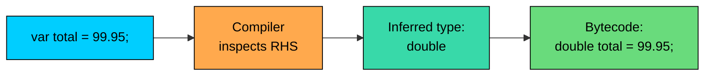
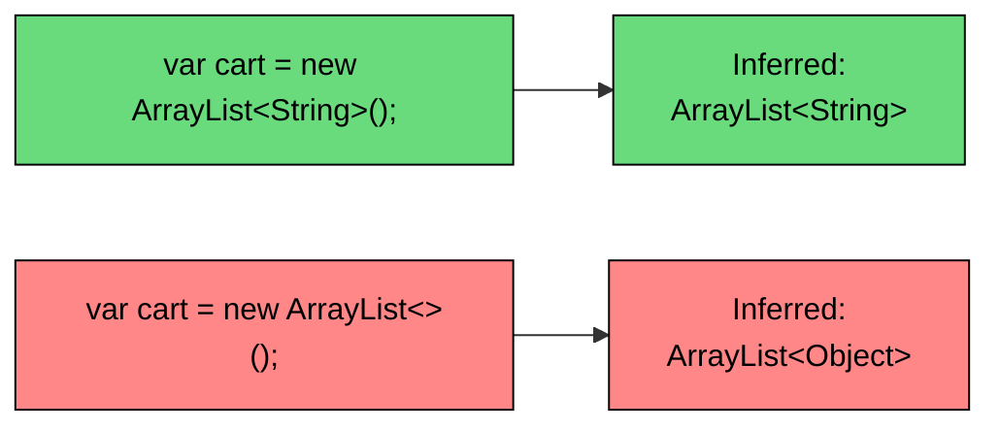

import React from 'react';
import CodeBlock from '../../../../components/ui/CodeBlock';
import Callout from '../../../../components/ui/Callout';

<div className="article-header">
  <div className="breadcrumb">
    <a href="/">Curated Notes</a>
    <span className="breadcrumb-separator">›</span>
    <span className="breadcrumb-current">var Keyword (Java 10)</span>
  </div>
  <h1>var Keyword (Java 10)</h1>
  <p style={{ color: 'var(--text-muted)', fontSize: '1.1rem', marginBottom: '16px', lineHeight: '1.6' }}>
    Master the essentials of var Keyword (Java 10) in this curated guide.
  </p>
  <div className="meta-info">
    <span className="meta-item">
      <svg width="14" height="14" viewBox="0 0 24 24" fill="none" stroke="currentColor" strokeWidth="2"><circle cx="12" cy="12" r="10"/><polyline points="12 6 12 12 16 14"/></svg>
      10 min read
    </span>
    <span className="difficulty-badge difficulty-badge--intermediate">Intermediate</span>
  </div>
</div>

<section className="content-section">

Java 10 added a small but visible change: you can declare a local variable with `var` and let the compiler figure out the type from the right-hand side. It looks like dynamic typing if you squint at it, but the variable is still statically typed. This lesson covers what `var` is, where you can and can't use it, the rules the compiler applies when inferring the type, and a style guide for when `var` actually makes code easier to read.

---

## What var Is and What Problem It Solves

`var` is a reserved type name, not a keyword in the strict sense, added by JEP 286 (Local Variable Type Inference) and shipped in Java 10 in March 2018. When you write `var product = new Product("Headphones", 49.99);`, the compiler looks at the right-hand side, sees that it produces a `Product`, and treats `product` as if you had written `Product product = ...`. The bytecode is identical. There is no `var` type at runtime, and there's no boxing, no reflection, no extra cost.

The problem `var` solves is repetition in declarations where the type is already obvious from the initializer. Before Java 10, code like this was common:


```java
HashMap<String, List<Product>> productsByCategory = new HashMap<String, List<Product>>();
```


The type appears twice. The diamond operator (`<>`) from Java 7 cut down the right side, but the left side is still verbose. With `var`, you write the type once on the right and let the compiler infer it on the left:


```java
var productsByCategory = new HashMap<String, List<Product>>();
```


The compiler knows `productsByCategory` is a `HashMap<String, List<Product>>`. Auto-complete in your IDE still works. Type errors still fire at compile time. The variable is just as type-safe as if you had spelled out the type, because Java is still a statically typed language. `var` is purely a syntactic shortcut for the type annotation on local variable declarations.





The flow is: you write `var`, the compiler looks at the right-hand side, picks a static type, and bakes that type into the bytecode. Once compilation is done, `var` no longer exists. The JVM never sees it.

One thing to note. `var` is not like `var` in JavaScript or `let` in Python. JavaScript's `var` declares a dynamically typed variable that can hold a number now and a string later. Java's `var` picks one type at compile time and locks the variable into that type forever. You cannot reassign a `var customer` to hold an `Order`. The compiler will reject it.


```java
public class VarIsStatic {
    public static void main(String[] args) {
        var quantity = 3;
        quantity = 5;
        // quantity = "five"; // would not compile: incompatible types
        System.out.println("Quantity: " + quantity);
    }
}
```


The commented-out line is the part to focus on. `quantity` is an `int` because `3` is an `int` literal, and assigning the string `"five"` to it is a type error caught at compile time. `var` removes the spelling, not the type.

---

## Basic Syntax and Type Inference Rules

The shape of a `var` declaration is `var name = initializer;`. The initializer is required, because that's where the type comes from. The compiler infers the type using a small set of rules.

For primitive literals, the inferred type matches the literal's type:


```java
public class PrimitiveLiterals {
    public static void main(String[] args) {
        var count = 5;
        var price = 19.99;
        var ratio = 1.5f;
        var orderCount = 10_000_000_000L;
        var isInStock = true;
        var grade = 'A';

        System.out.println("count is an int:        " + count);
        System.out.println("price is a double:      " + price);
        System.out.println("ratio is a float:       " + ratio);
        System.out.println("orderCount is a long:   " + orderCount);
        System.out.println("isInStock is a boolean: " + isInStock);
        System.out.println("grade is a char:        " + grade);
    }
}
```


One small trap. `var price = 19.99;` infers `double`, not `float`, because `19.99` is a `double` literal. If you want a `float`, write `19.99f`. The same goes for integer literals: `var count = 5;` is `int`, not `long`. The compiler doesn't widen for you.

For object types, the inferred type is the declared return type of the right-hand expression:


```java
import java.util.ArrayList;
import java.util.HashMap;
import java.util.List;

public class ObjectInference {
    public static void main(String[] args) {
        var productName = "Headphones";
        var cart = new ArrayList<String>();
        var inventory = new HashMap<String, Integer>();
        List<String> wishlist = new ArrayList<>();
        var alsoWishlist = wishlist;

        cart.add("Headphones");
        cart.add("Cable");
        inventory.put("Headphones", 12);

        System.out.println("productName:    " + productName);
        System.out.println("cart:           " + cart);
        System.out.println("inventory:      " + inventory);
        System.out.println("alsoWishlist:   " + alsoWishlist);
    }
}
```


The inferred types here are `String`, `ArrayList<String>`, `HashMap<String, Integer>`, and `List<String>`. The last one is significant: `alsoWishlist` is inferred as `List<String>`, not `ArrayList<String>`, because the declared type of `wishlist` is `List<String>`. The compiler uses the declared static type of the right-hand side, not the runtime type. If a variable is declared as `List<String>` but happens to hold an `ArrayList` at runtime, `var x = wishlist;` still gives you a `List<String>`.

`var` is a pure compile-time feature. The generated bytecode is byte-for-byte identical to what you'd get if you wrote out the type by hand. There is no runtime check, no boxing, no reflection.

---

## Where var Is Allowed

`var` works for local variable declarations, and only for local variable declarations. The full list is short.


| Location | Allowed? | Example |
| --- | --- | --- |
| Local variable in a method | Yes | `var name = "Alice";` |
| For-loop index variable | Yes | `for (var i = 0; i < 5; i++)` |
| Enhanced for-loop variable | Yes | `for (var item : cart)` |
| Try-with-resources variable | Yes | `try (var reader = new BufferedReader(...))` |
| Lambda parameter (Java 11+) | Yes | `(var a, var b) -> a + b` |
| Field of a class | No | `private var price;` does not compile |
| Method parameter | No | `void add(var item)` does not compile |
| Method return type | No | `var getPrice()` does not compile |
| Catch clause parameter | No | `catch (var e)` does not compile |


Each row in the "Yes" column is worth a quick example, because the syntactic positions are different.

#### Method-Local Variables

The most common case. The variable lives inside a method body:


```java
public class CartTotal {
    public static void main(String[] args) {
        var itemPrice = 29.99;
        var quantity = 3;
        var subtotal = itemPrice * quantity;

        System.out.println("Subtotal: $" + subtotal);
    }
}
```


`itemPrice` is `double`, `quantity` is `int`, and `subtotal` is `double` because multiplying a `double` by an `int` widens to `double`. This is the kind of code where `var` really doesn't help readability much, because the literal types are obvious, but it doesn't hurt either.

#### For-Loop Variables

Both the classic for-loop and the enhanced for-loop accept `var`:


```java
import java.util.List;

public class LoopWithVar {
    public static void main(String[] args) {
        var products = List.of("Headphones", "Cable", "Charger");

        for (var i = 0; i < products.size(); i++) {
            System.out.println((i + 1) + ". " + products.get(i));
        }

        System.out.println("---");

        for (var product : products) {
            System.out.println("In cart: " + product);
        }
    }
}
```


In the classic loop, `i` is inferred as `int`. In the enhanced loop, `product` is inferred as `String` because `products` is a `List<String>`. The enhanced for case is one of the strongest arguments for `var`: it removes type noise from a line where you're really interested in the loop body, not the type ceremony.

#### Try-With-Resources

`var` works for the resource declaration in `try-with-resources`:


```java
import java.io.BufferedReader;
import java.io.IOException;
import java.io.StringReader;

public class ReadOrderNotes {
    public static void main(String[] args) throws IOException {
        var notes = "Leave package at the side door\nRing doorbell twice";

        try (var reader = new BufferedReader(new StringReader(notes))) {
            String line;
            while ((line = reader.readLine()) != null) {
                System.out.println("Note: " + line);
            }
        }
    }
}
```


`reader` is inferred as `BufferedReader`. The resource gets closed automatically at the end of the `try` block, same as if you'd written the type explicitly.

#### Lambda Parameters (Java 11+)

This case was added in Java 11, one version after `var` itself. You can use `var` for lambda parameters when you want to attach an annotation like `@NonNull` to the parameter, or just for visual consistency:


```java
import java.util.List;
import java.util.function.BiFunction;

public class LambdaWithVar {
    public static void main(String[] args) {
        BiFunction<Integer, Double, Double> lineTotal = (var quantity, var unitPrice) -> quantity * unitPrice;

        var total = lineTotal.apply(3, 19.99);
        System.out.println("Line total: $" + total);
    }
}
```


Two rules to know for lambdas. First, you can't mix `var` and non-`var` parameters: `(var a, b) ->` does not compile. It's all `var` or none. Second, you can't drop the parentheses around a single `var` parameter: `var x -> x + 1` does not compile, you need `(var x) -> x + 1`. For lambdas with no annotations and obvious types, most code skips `var` entirely and writes `(quantity, unitPrice) -> quantity * unitPrice` instead.

---

## Where var Is Not Allowed (and the Compiler Errors)

The forbidden cases come from one design decision: `var` works only when the compiler has a concrete initializer to inspect at the exact line of declaration. Anywhere the type would have to come from somewhere else (the call site, the override, the catch clause's possible exception types) is off-limits.

#### No var Fields

A class field declared with `var` would have no obvious initializer at the declaration site, and inference would be ambiguous if multiple constructors initialized the field differently. The compiler rejects it outright:


```java
public class BrokenProduct {
    var name = "Headphones"; // does not compile
}
```


Compiler error:


```shell
error: 'var' is not allowed here
    var name = "Headphones";
    ^
```


The fix is to write the type:


```java
public class FixedProduct {
    String name = "Headphones";
}
```


#### No var Method Parameters

A method parameter's type comes from the caller, not from the method's own code. `var` has no initializer to inspect:


```java
public class BrokenAddToCart {
    public void addToCart(var product) { } // does not compile
}
```


Compiler error:


```shell
error: 'var' is not allowed here
    public void addToCart(var product) { }
                          ^
```


The fix is to declare the parameter type. If you want a generic method that accepts any type, use a generic type parameter:


```java
public class FixedAddToCart {
    public <T> void addToCart(T product) {
        System.out.println("Added: " + product);
    }
}
```


#### No var Return Types

A return type is part of a method's signature and is visible to callers. The compiler can't pick a type by looking inside the method body, because callers depend on the signature:


```java
public class BrokenPrice {
    public var getPrice() { return 9.99; } // does not compile
}
```


Compiler error:


```shell
error: 'var' is not allowed here
    public var getPrice() { return 9.99; }
           ^
```


#### No var in Catch Clauses

A catch clause's parameter type is the exception type being caught, which the compiler uses to decide which `catch` blocks apply to which `throw` statements. `var` has no fixed initializer:


```java
public class BrokenCatch {
    public static void main(String[] args) {
        try {
            throw new RuntimeException("oops");
        } catch (var e) { // does not compile
            System.out.println(e.getMessage());
        }
    }
}
```


Compiler error:


```shell
error: 'var' is not allowed here
        } catch (var e) {
                 ^
```


The fix is to name the exception type, which you usually want anyway because it documents what you're catching:


```java
public class FixedCatch {
    public static void main(String[] args) {
        try {
            throw new RuntimeException("oops");
        } catch (RuntimeException e) {
            System.out.println(e.getMessage());
        }
    }
}
```


#### No var with null Initializer

The compiler needs a concrete type from the initializer. `null` has no concrete type, so the inference fails:


```java
public class BrokenNull {
    public static void main(String[] args) {
        var couponCode = null; // does not compile
    }
}
```


Compiler error:


```shell
error: cannot infer type for local variable couponCode
      (variable initializer is 'null')
    var couponCode = null;
    ^
```


If you want a nullable reference that you'll assign later, declare the type:


```java
public class FixedNull {
    public static void main(String[] args) {
        String couponCode = null;
        couponCode = "SUMMER10";
        System.out.println(couponCode);
    }
}
```


#### No var with Array Initializer Shorthand

The shorthand `{1, 2, 3}` has no type until the compiler sees the declared type to its left. With `var`, there's nothing to anchor to:


```java
public class BrokenArray {
    public static void main(String[] args) {
        var prices = {9.99, 19.99, 29.99}; // does not compile
    }
}
```


Compiler error:


```shell
error: cannot infer type for local variable prices
      (array initializer needs an explicit target-type)
    var prices = {9.99, 19.99, 29.99};
    ^
```


The fix is to use `new double[]{...}`, which has its own type:


```java
public class FixedArray {
    public static void main(String[] args) {
        var prices = new double[]{9.99, 19.99, 29.99};
        System.out.println("First price: $" + prices[0]);
        System.out.println("Total prices: " + prices.length);
    }
}
```


#### No var with Bare Lambda or Method Reference

A lambda's type is the target functional interface, decided by context. `var x = () -> 42;` has no target type, so the compiler can't pick `Supplier<Integer>` over `Callable<Integer>` over anything else:


```java
import java.util.function.Supplier;

public class BrokenLambda {
    public static void main(String[] args) {
        var task = () -> 42; // does not compile
    }
}
```


Compiler error:


```shell
error: cannot infer type for local variable task
      (lambda expression needs an explicit target-type)
    var task = () -> 42;
    ^
```


The fix is to declare a target type:


```java
import java.util.function.Supplier;

public class FixedLambda {
    public static void main(String[] args) {
        Supplier<Integer> task = () -> 42;
        System.out.println(task.get());
    }
}
```


The same rule applies to method references. `var fn = String::length;` does not compile, because `String::length` could match `Function<String, Integer>`, `ToIntFunction<String>`, and others.

---

## The Diamond Operator and var Together

The diamond operator (`<>`) was added in Java 7 so you could write `new ArrayList<>()` instead of `new ArrayList<String>()` when the left side already declared the type parameter. Combining `<>` with `var` strips type information from both sides, and the result is rarely what you want.


```java
import java.util.ArrayList;

public class DiamondWithVar {
    public static void main(String[] args) {
        var cart1 = new ArrayList<String>();
        var cart2 = new ArrayList<>();

        cart1.add("Headphones");
        cart2.add("Headphones");
        cart2.add(42); // legal: cart2 is ArrayList<Object>

        System.out.println("cart1: " + cart1);
        System.out.println("cart2: " + cart2);
    }
}
```


Examine `cart2`. Because the right-hand side is `new ArrayList<>()` and there's no left-side type to anchor the inference, the compiler picks the broadest type that satisfies the diamond: `Object`. So `cart2` is `ArrayList<Object>`, and you can `add(42)` to it without any cast or boxing complaint. That's almost certainly not what the author wanted.

The rule of thumb is: **when you use `var`, put the type parameter on the right side**, like `new ArrayList<String>()`. Don't combine `var` and `<>`.





The diagram shows the two paths side by side. The top path on the left is what you want: explicit type on the right, inferred match on the left. The bottom path widens to `Object` and strips type safety.

---

## var With Anonymous Classes

An anonymous class has a synthetic type that has no name you can write, so before Java 10 you had to widen the declaration to the superclass or interface. With `var`, you get to keep the anonymous type and call methods that exist only on it.


```java
public class AnonymousWithVar {
    public static void main(String[] args) {
        var helper = new Object() {
            String greet(String customerName) {
                return "Welcome back, " + customerName + "!";
            }

            double applyDiscount(double price) {
                return price * 0.9;
            }
        };

        System.out.println(helper.greet("Alice"));
        System.out.println("Discounted: $" + helper.applyDiscount(50.00));
    }
}
```


Without `var`, this code wouldn't work. If you wrote `Object helper = new Object() { ... };`, the static type of `helper` would be `Object`, and `helper.greet(...)` would fail to compile because `Object` doesn't have a `greet` method. The anonymous subclass adds methods, but you can't call them through an `Object` reference.

With `var`, the compiler keeps the anonymous type as the inferred type of `helper`. The methods `greet` and `applyDiscount` are visible. It's a small trick, but it lets you write helper objects local to a method without declaring a full named class.

No runtime cost, same as any other `var` use. The bytecode contains the actual anonymous type as the variable's type. This is one of the few places where `var` lets you express a type that you cannot write out by hand.

---

## Style: When var Helps and When It Hurts

`var` is a tool, not a default. The Java team published an official style guide alongside the feature, and the short version is: use `var` when it makes the code easier to read, skip it when it makes the type unclear.

#### Cases Where var Helps

The strongest case for `var` is when the type is already obvious from the right-hand side and writing it out twice adds noise.

**Constructor calls**: the type appears on the right, so repeating it on the left is pure ceremony.


```java
// Before
HashMap<String, List<Order>> ordersByCustomer = new HashMap<String, List<Order>>();

// After
var ordersByCustomer = new HashMap<String, List<Order>>();
```


**Loop variables over a typed collection**: the element type is determined by the collection's generic parameter.


```java
var cart = List.of("Headphones", "Cable", "Charger");
for (var product : cart) {
    System.out.println(product);
}
```


**Intermediate values in a chain**: when you're naming a step in a calculation, the name carries the meaning, not the type.


```java
var subtotal = unitPrice * quantity;
var taxAmount = subtotal * 0.08;
var grandTotal = subtotal + taxAmount;
```


The whole snippet is readable. Adding `double` three times would only restate what the names and values already say.

#### Cases Where var Hurts

`var` makes code harder to read when the right-hand side doesn't make the type obvious. The reader of the code has to mentally chase down the return type of a method to figure out what they're looking at.


```java
// Bad: what does findById return? You can't tell from this line.
var result = orderRepository.findById(orderId);
```


A reader has to open `OrderRepository`, find `findById`, look at its return type, and only then know whether `result` is an `Order`, an `Optional<Order>`, a `List<Order>`, or something else. Spelling out the type at the declaration saves them that lookup.


```java
// Good
Optional<Order> result = orderRepository.findById(orderId);
```


`var` also hurts when the inferred type is less specific or more specific than what you wanted. `var cart = new ArrayList<>();` gives you `ArrayList<Object>`, which is almost never the intent.

Numeric literals are another common source of confusion. `var rate = 5;` is an `int`, not a `double`. If the next thing you do with it is divide it, you'll get integer division and a surprise result.


```java
public class IntegerDivisionSurprise {
    public static void main(String[] args) {
        var discountedPrice = 100 / 3;
        var clearlyADouble = 100.0 / 3;

        System.out.println("With var on int literals:    " + discountedPrice);
        System.out.println("With explicit double:        " + clearlyADouble);
    }
}
```


`discountedPrice` is `33` because both operands are `int`, so the division is integer division. If you intended a fractional price, write `100.0 / 3` or use an explicit `double` type. `var` doesn't save you from picking the wrong literal type.

#### A Quick Style Heuristic

If a reader can answer "what is this?" from the line in isolation, `var` is fine. If they have to chase the right-hand side into a different file, prefer writing the type out. Read the line out loud. If "var thing equals new shopping cart" feels clear, `var` is doing its job. If "var result equals order repository find by ID order ID" leaves the reader wondering what `result` is, write the type.


| Situation | Use `var`? |
| --- | --- |
| `new HashMap<String, Product>()` on the right | Yes, type is obvious |
| For-loop over a typed collection | Yes, element type is obvious |
| Result of a method call with a non-obvious return type | No, name the type |
| Variable used to chain into another method later | Maybe, depends on chain readability |
| Anonymous class with extra methods | Yes, this is one of the few cases where `var` adds expressiveness |
| Numeric literal that should be `double` but is `int` | No, write the type to make the intent clear |


---

## A Common Mistake: var With a Confusing Literal

Here is a bug that looks innocent but produces the wrong answer.

**What's wrong with this code?**


```java
public class CartAverage {
    public static void main(String[] args) {
        var itemCount = 3;
        var totalPrice = 100;
        var average = totalPrice / itemCount;

        System.out.println("Average item price: $" + average);
    }
}
```


The output is `$33`, not `$33.33`. Both `itemCount` and `totalPrice` were inferred as `int` because they have integer literals, so `totalPrice / itemCount` is integer division. The result rounds toward zero. `var` did exactly what it was told, but the literal types were wrong for the calculation.

**Fix:**


```java
public class CartAverageFixed {
    public static void main(String[] args) {
        var itemCount = 3;
        var totalPrice = 100.0;
        var average = totalPrice / itemCount;

        System.out.println("Average item price: $" + average);
    }
}
```


Changing `100` to `100.0` makes `totalPrice` a `double`. Now the division widens `itemCount` to `double` and produces a real fractional result. The `var` itself isn't the bug; the literal is. The lesson is that `var` adopts the literal's type exactly, with no automatic widening, so the literal you pick matters more than it does in a fully spelled-out declaration where you might write `double totalPrice = 100` and have widening do the work.

</section>
