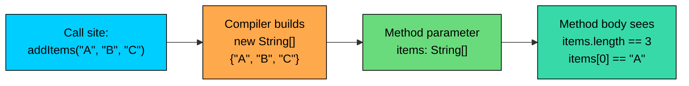

import React from 'react';
import CodeBlock from '../../../../components/ui/CodeBlock';
import Callout from '../../../../components/ui/Callout';

<div className="article-header">
  <div className="breadcrumb">
    <a href="/">Curated Notes</a>
    <span className="breadcrumb-separator">›</span>
    <span className="breadcrumb-current">Variable Arguments (Varargs)</span>
  </div>
  <h1>Variable Arguments (Varargs)</h1>
  <p style={{ color: 'var(--text-muted)', fontSize: '1.1rem', marginBottom: '16px', lineHeight: '1.6' }}>
    Master the essentials of Variable Arguments (Varargs) in this curated guide.
  </p>
  <div className="meta-info">
    <span className="meta-item">
      <svg width="14" height="14" viewBox="0 0 24 24" fill="none" stroke="currentColor" strokeWidth="2"><circle cx="12" cy="12" r="10"/><polyline points="12 6 12 12 16 14"/></svg>
      10 min read
    </span>
    <span className="difficulty-badge difficulty-badge--intermediate">Intermediate</span>
  </div>
</div>

<section className="content-section">

Sometimes a method needs to accept a flexible number of inputs. Consider adding products to a cart. One call might add a single item, the next call might add five, and the call after that might add fifteen. Forcing the caller to wrap those products in an array every time is noisy. Varargs let you write the method once and call it with as many arguments as you want, including zero.

This lesson covers what varargs are, how they work internally, the rules around using them, and the small set of gotchas that catch beginners. The examples stick to e-commerce: adding cart items, applying product tags, summing prices.

---

## The Problem Varargs Solve

Before varargs existed, a method that handled an unknown number of inputs had two options. Either expose several overloads, one per argument count, or take an array. The overload approach doesn't scale, because you'd need a new method every time someone wanted to pass one more value.


```java
public class CartWithoutVarargs {
    public static void addItems(String[] items) {
        for (String item : items) {
            System.out.println("Added: " + item);
        }
    }

    public static void main(String[] args) {
        String[] singleItem = { "Wireless Mouse" };
        addItems(singleItem);

        String[] threeItems = { "Notebook", "Pen", "Eraser" };
        addItems(threeItems);
    }
}
```


The method works, but every caller has to build an array first. That's friction the caller didn't ask for. The same code with varargs looks like this:


```java
public class CartWithVarargs {
    public static void addItems(String... items) {
        for (String item : items) {
            System.out.println("Added: " + item);
        }
    }

    public static void main(String[] args) {
        addItems("Wireless Mouse");
        addItems("Notebook", "Pen", "Eraser");
    }
}
```


The caller now writes natural-looking calls. The method signature stays the same regardless of how many items get passed. That's the whole point of varargs.

---

## Varargs Syntax

The varargs syntax is three dots after the parameter type: `Type... name`. The three dots are part of the declaration, not part of the type. Inside the method, `name` behaves exactly like `Type[]`.


```java
public class TagPrinter {
    public static void printTags(String... tags) {
        System.out.println("Total tags: " + tags.length);
        for (int i = 0; i < tags.length; i++) {
            System.out.println(i + ": " + tags[i]);
        }
    }

    public static void main(String[] args) {
        printTags("new", "bestseller", "wireless");
    }
}
```


The `.length` field and the index access work because `tags` is an array. The dots only appear in the method declaration. You never write `String...` anywhere else, not when assigning, not when looping.

A clean way to iterate a varargs parameter is the enhanced `for` loop.


```java
public class CategoryList {
    public static void listCategories(String... categories) {
        for (String category : categories) {
            System.out.println("Category: " + category);
        }
    }

    public static void main(String[] args) {
        listCategories("Books", "Electronics", "Toys");
    }
}
```


---

## How Varargs Work Internally

When the compiler sees a varargs parameter, it treats the method as if you had declared an array parameter. The varargs syntax is syntactic sugar. At the call site, the compiler collects all the loose arguments, wraps them into a fresh array, and passes that array to the method.





The diagram shows the lifecycle of a varargs call. The caller writes three separate arguments. The compiler bundles them into a single array. The method receives that array and uses it like any other.

You can confirm this by accessing `.length` and indexing into the parameter as if it were an array, because that's what it is.


```java
public class VarargsIsArray {
    public static void inspect(int... numbers) {
        System.out.println("Type behaves like int[]");
        System.out.println("Length: " + numbers.length);
        if (numbers.length > 0) {
            System.out.println("First:  " + numbers[0]);
            System.out.println("Last:   " + numbers[numbers.length - 1]);
        }
    }

    public static void main(String[] args) {
        inspect(10, 20, 30, 40);
    }
}
```


Every varargs call allocates a brand new array on the heap. For a method called once, this is fine. For a method called in a tight loop with primitive wrappers (`Integer...`, `Double...`), the per-call allocation plus autoboxing can add measurable overhead. When you already have an array, pass it directly to avoid building a wrapper around a wrapper.

---

## Passing Zero, One, or Many Arguments

A varargs parameter accepts any number of arguments, including zero. Zero arguments doesn't produce a `null` array. It produces an empty array with `length == 0`.


```java
public class CallWithAnyCount {
    public static void applyTags(String... tags) {
        if (tags.length == 0) {
            System.out.println("No tags applied.");
            return;
        }
        for (String tag : tags) {
            System.out.println("Tag: " + tag);
        }
    }

    public static void main(String[] args) {
        applyTags();
        System.out.println("---");
        applyTags("sale");
        System.out.println("---");
        applyTags("new", "wireless", "bestseller");
    }
}
```


The first call passes nothing, and the method sees an empty array. The second passes one value, and the array has one element. The third passes three. The method body doesn't change between these cases, which is the value of varargs.

Defensive code often checks `length` first, because passing zero arguments is legal even when it doesn't make sense for the operation. Calculating an average of zero prices is a divide-by-zero waiting to happen.


```java
public class AverageOfPrices {
    public static double average(double... prices) {
        if (prices.length == 0) {
            return 0.0;
        }
        double sum = 0.0;
        for (double price : prices) {
            sum += price;
        }
        return sum / prices.length;
    }

    public static void main(String[] args) {
        System.out.println("No prices:    " + average());
        System.out.println("One price:    " + average(29.99));
        System.out.println("Three prices: " + average(10.00, 20.00, 30.00));
    }
}
```


The zero-length check is the standard way to handle the "no arguments" case. Either return a sensible default, throw an `IllegalArgumentException`, or document that the method requires at least one value.

---

## Passing an Actual Array

Because the varargs parameter is an array internally, you can pass an existing array directly instead of listing the values one by one. The compiler accepts this and uses your array as the parameter.


```java
public class PassAnArray {
    public static void addItems(String... items) {
        for (String item : items) {
            System.out.println("Added: " + item);
        }
    }

    public static void main(String[] args) {
        String[] productList = { "Notebook", "Pen", "Eraser" };
        addItems(productList);
    }
}
```


The compiler doesn't wrap `productList` in another array. It passes the same reference through. That means changes to the array inside the method would be visible to the caller, since both sides hold the same reference.


```java
public class SharedArrayReference {
    public static void overwriteFirst(String... items) {
        if (items.length > 0) {
            items[0] = "REPLACED";
        }
    }

    public static void main(String[] args) {
        String[] productList = { "Notebook", "Pen", "Eraser" };
        overwriteFirst(productList);
        System.out.println("First after call: " + productList[0]);
    }
}
```


Most varargs methods read their inputs without modifying them, so this rarely matters. When it does, copy the array inside the method before changing anything.

You cannot pass two arrays expecting them to be merged. If you write `addItems(arr1, arr2)`, the compiler treats that as a varargs call with two arguments of type `String[]`, which won't compile against a `String...` parameter. To combine arrays, merge them yourself first or use a single array argument.

---

## The `null` Gotcha

Calling a varargs method with `null` is the classic trap. There are two different ways to spell it, and they produce very different results.

If you pass `null` directly with no cast, the compiler treats `null` as the array reference itself. The method then receives `null` for its parameter, and any access to `.length` throws.


```java
public class NullAsArray {
    public static void applyTags(String... tags) {
        System.out.println("Length: " + tags.length); // NullPointerException
    }

    public static void main(String[] args) {
        applyTags(null);
    }
}
```


The call passes a `null` reference where `String[]` is expected. The method body then tries to read `.length` on a null array, which throws `NullPointerException`.

The fix is either to defend against the case inside the method, or to call it differently. Casting `null` to `String` instead of letting it default to the array reference produces an array containing a single `null` element.


```java
public class NullAsValue {
    public static void applyTags(String... tags) {
        System.out.println("Length: " + tags.length);
        if (tags.length > 0) {
            System.out.println("First: " + tags[0]);
        }
    }

    public static void main(String[] args) {
        applyTags((String) null);
    }
}
```


The cast tells the compiler "this `null` is a `String` element, not the whole array". The compiler then builds a one-element array containing that `null`. The method sees `length == 1` and `tags[0] == null`.

For a defensive method, check the parameter for `null` before touching it.


```java
public class SafeTagPrinter {
    public static void applyTags(String... tags) {
        if (tags == null || tags.length == 0) {
            System.out.println("No tags applied.");
            return;
        }
        for (String tag : tags) {
            System.out.println("Tag: " + (tag == null ? "<unknown>" : tag));
        }
    }

    public static void main(String[] args) {
        applyTags((String[]) null);
        System.out.println("---");
        applyTags("new", null, "wireless");
    }
}
```


Two checks cover the realistic cases. The outer `tags == null` guards against the caller passing `null` for the whole array. The inner `tag == null` guards against any single element being `null`.

---

## Mixing Varargs with Regular Parameters

A method can have regular parameters and one varargs parameter, but the varargs has to come last. The compiler needs that rule so it can tell which arguments are which. Without it, a call with mixed types would be ambiguous.


```java
public class ApplyTags {
    public static void applyTags(String productName, String... tags) {
        System.out.println("Product: " + productName);
        if (tags.length == 0) {
            System.out.println("(no tags)");
            return;
        }
        for (String tag : tags) {
            System.out.println(" - " + tag);
        }
    }

    public static void main(String[] args) {
        applyTags("Wireless Mouse", "new", "bestseller");
        System.out.println("---");
        applyTags("USB Cable");
    }
}
```


The first argument always binds to `productName`. Everything after it gets packed into the `tags` array. The second call passes no tags, so the method handles the empty case.

Trying to put varargs anywhere but last is a compile error.


```java
public class InvalidVarargsPosition {
    // public static void bad(String... tags, String productName) { } // compile error
}
```


The compiler rejects this with `varargs parameter must be the last parameter`. There's no way around it. If you need flexible inputs followed by a fixed value, reorder the signature so the fixed value comes first.

A method can have at most one varargs parameter. You can't write `void log(String... tags, int... codes)`, even hypothetically, because the rule above already prevents two trailing varargs.

---

## Varargs and Overload Resolution

When two overloads could match a call, the compiler prefers the more specific one. Varargs versions are considered the least specific because they accept the widest range of inputs. A method that takes exact parameter types wins over a varargs method when both could handle the call.


```java
public class OverloadWithVarargs {
    public static void calculateTotal(double price) {
        System.out.println("Single price: " + price);
    }

    public static void calculateTotal(double... prices) {
        double total = 0;
        for (double p : prices) {
            total += p;
        }
        System.out.println("Many prices total: " + total);
    }

    public static void main(String[] args) {
        calculateTotal(29.99);
        calculateTotal(29.99, 9.99);
        calculateTotal();
    }
}
```


The single call with one argument hits the fixed-parameter overload because it matches exactly. The compiler doesn't go looking for the varargs version when a precise match exists. The two-argument and zero-argument calls only fit the varargs overload, so that's what runs.

This is the reason a `String.format("hello")` call with no extra arguments still works. The varargs parameter receives an empty array.

---

## Real Examples from the Standard Library

Varargs aren't an exotic feature. Several common methods in the JDK use them, and you've likely already called varargs methods without noticing. Here are four to recognize.

`String.format` and `System.out.printf` both take a format string followed by a varargs `Object...` for the values that get substituted into the placeholders.


```java
public class FormatExample {
    public static void main(String[] args) {
        String customerName = "Alice";
        int orderCount = 3;
        double total = 89.97;

        String summary = String.format(
            "%s placed %d orders totalling $%.2f",
            customerName, orderCount, total
        );
        System.out.println(summary);

        System.out.printf("Customer: %s | Orders: %d%n", customerName, orderCount);
    }
}
```


The format string is a regular `String` parameter. Everything after it is the varargs. This is why you can pass two values, three, or none.

`Arrays.asList` returns a fixed-size list backed by the arguments you pass in.


```java
import java.util.Arrays;
import java.util.List;

public class AsListExample {
    public static void main(String[] args) {
        List<String> categories = Arrays.asList("Books", "Electronics", "Toys");
        System.out.println("Categories: " + categories);
        System.out.println("Size: " + categories.size());
    }
}
```


`List.of`, added in Java 9, is similar but returns an immutable list. It also uses varargs for the convenient case of small lists.


```java
import java.util.List;

public class ListOfExample {
    public static void main(String[] args) {
        List<String> wishlist = List.of("Wireless Mouse", "USB Cable", "Notebook");
        System.out.println(wishlist);
    }
}
```


Recognizing these signatures helps when you read JDK source or hover documentation. The three dots after a type tell you the call-site convention without you having to test it.

---

## Writing a Method That Uses Varargs Well

A method that searches a product list by category illustrates how all the pieces fit together. The method takes a category list as varargs, prints a label, and reports how many categories were searched.


```java
public class CategorySearch {
    public static void searchByCategory(String... categories) {
        if (categories.length == 0) {
            System.out.println("No categories provided. Showing all products.");
            return;
        }
        System.out.println("Searching " + categories.length + " categories:");
        for (String category : categories) {
            System.out.println(" - " + category);
        }
    }

    public static void main(String[] args) {
        searchByCategory();
        System.out.println();
        searchByCategory("Electronics");
        System.out.println();
        searchByCategory("Books", "Toys", "Electronics");
        System.out.println();

        String[] saved = { "Clothing", "Shoes" };
        searchByCategory(saved);
    }
}
```


The method handles four call styles with one signature: zero arguments, one argument, several arguments, and a pre-built array. Each path through `main` exercises a different style, and the method body doesn't have to know or care which one was used.

</section>
