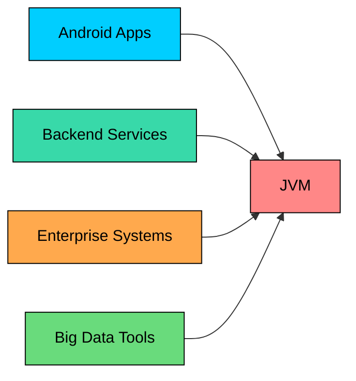

import React from 'react';
import CodeBlock from '../../../../components/ui/CodeBlock';
import Callout from '../../../../components/ui/Callout';

<div className="article-header">
  <div className="breadcrumb">
    <a href="/">Curated Notes</a>
    <span className="breadcrumb-separator">›</span>
    <span className="breadcrumb-current">What is Java?</span>
  </div>
  <h1>What is Java?</h1>
  <p style={{ color: 'var(--text-muted)', fontSize: '1.1rem', marginBottom: '16px', lineHeight: '1.6' }}>
    Master the essentials of What is Java? in this curated guide.
  </p>
  <div className="meta-info">
    <span className="meta-item">
      <svg width="14" height="14" viewBox="0 0 24 24" fill="none" stroke="currentColor" strokeWidth="2"><circle cx="12" cy="12" r="10"/><polyline points="12 6 12 12 16 14"/></svg>
      10 min read
    </span>
    <span className="difficulty-badge difficulty-badge--intermediate">Intermediate</span>
  </div>
</div>

<section className="content-section">

Java is one of the most widely used programming languages in the world. It powers Android phones, the backend of large online stores, banking systems, and a lot of the software you interact with every day without realizing it. This chapter gives you a high-level picture of what Java is and why it has stayed relevant for nearly three decades.

---

## Java at a Glance

Java is a general-purpose, object-oriented, statically typed, platform-independent programming language. That's a dense sentence; here is each piece in plain language.

**General-purpose** means Java isn't built for one narrow use case. It can be used for a mobile app, a website's backend, a data-processing tool, or a desktop program. Compare that with something like SQL, which is designed for one job (querying databases). Java is more like a Swiss Army knife.

**Object-oriented** means Java organizes code around things called "objects." An online store would have a `Product` object, a `Customer` object, an `Order` object, and so on. Each object holds its own data and the actions that can be performed on it. The short version: Java encourages modeling real things in a program as objects.

**Statically typed** means every variable has to declare what kind of value it holds, and Java checks that before the program runs. If a variable is declared to hold a number and the code then tries to put text into it, the compiler refuses and reports the mistake. This catches a lot of bugs before users ever see them.

**Platform-independent** is the feature that made Java famous. Java code is written once, compiled, and the result can run on Windows, macOS, Linux, an Android phone, or a server in a data center, all without changing the code. The slogan for this in the 1990s was "Write Once, Run Anywhere," and it's still mostly true today.

---

## What People Build With Java

Java's reach is wide. Here are the main areas where it appears.

**Android apps.** For more than a decade, the official language of Android was Java. Google has since added Kotlin as a first-class option, but Java is still everywhere in Android. Apps like older versions of Instagram, Spotify's Android client, and countless others were written in Java. Android phones run a lot of Java code under the surface.

**Backend services and REST APIs.** When a customer checks out at an online store, the server that processes the payment, updates the inventory, and sends a confirmation email is often a Java program. Frameworks like Spring Boot make it straightforward to build these kinds of services. A REST API, by the way, is just a way for one program to send a request to another over the network. Don't worry about the details yet.

**Enterprise systems.** Banks, airlines, insurance companies, healthcare providers, and big retailers run huge Java systems. We're talking about software that processes millions of transactions a day. Java's reliability and tooling make it a safe choice for software that absolutely cannot crash.

**Big data tools.** Some of the most popular tools for handling massive amounts of data are written in Java. Apache Hadoop processes large datasets across many machines. Apache Spark does similar work but faster. Apache Kafka moves streams of events between systems and is used by companies like LinkedIn, Netflix, and Uber. All three of these tools are Java at heart.





The diagram shows the common thread. All these different kinds of software end up running on the same thing: the JVM, which is the runtime Java code executes on. For now, know it exists and that it's the reason Java code can run on so many different devices.

---

## Why Java Has Lasted So Long

Java first appeared in 1995. Most programming languages from that era are either gone or stuck in legacy systems nobody wants to touch. Java is the opposite. It's still one of the top languages on every popularity ranking, still the default at many large companies, and still actively evolving with new versions every six months. Why?

**A large ecosystem.** A new Java project almost never starts from scratch. There are mature libraries for nearly any common task: connecting to a database, sending an email, parsing a JSON response from an online store's API, scheduling background jobs, encrypting passwords. The community has been building these libraries for nearly thirty years, and the good ones are battle-tested in production at scale.

**Strong tooling.** The editors and tools for writing and debugging Java are very good. IntelliJ IDEA, Eclipse, and VS Code can navigate huge Java codebases, refactor code safely, point out mistakes as code is typed, and run tests with one click. Build tools like Maven and Gradle handle the painful work of managing dependencies. Profilers help find performance problems. This kind of tooling is one reason teams pick Java for big projects: the bigger the codebase, the more the tools pay off.

**The JVM.** The Java Virtual Machine, often just called the JVM, is the runtime that executes Java code. It does a lot of work internally, like managing memory and optimizing the program while it runs. It's good enough that other languages, such as Kotlin, Scala, and Clojure, were built to run on it too.

**Backward compatibility.** This one is underrated. Java code written in 2005 still compiles and runs on a modern JVM in most cases. For a company with a large existing codebase, that's important. New Java versions can be adopted while old code keeps working. Many languages break things across major versions, which forces painful rewrites. Java's commitment to not breaking old code is part of why it stays popular in places where stability matters.

---

## A Quick Look at Java Code

No Java syntax has been covered yet, and that's fine. The goal here is to see what a small Java program looks like so the language feels concrete instead of abstract.


```java
public class Welcome {
    public static void main(String[] args) {
        String storeName = "MyShop";
        String featuredProduct = "Wireless Headphones";
        System.out.println("Welcome to " + storeName + "!");
        System.out.println("Featured product today: " + featuredProduct);
    }
}
```


A few high-level points, without worrying about the details. The code lives inside something called a class, named `Welcome`. There's a special method called `main` where the program starts. Two variables hold text, one for the store's name and one for the featured product. The `System.out.println` line prints something to the screen.

Every symbol on this page does not need to be understood yet.

</section>
