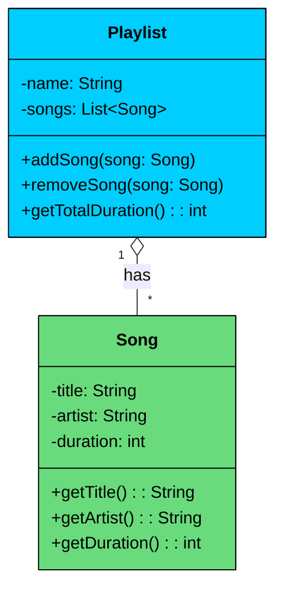
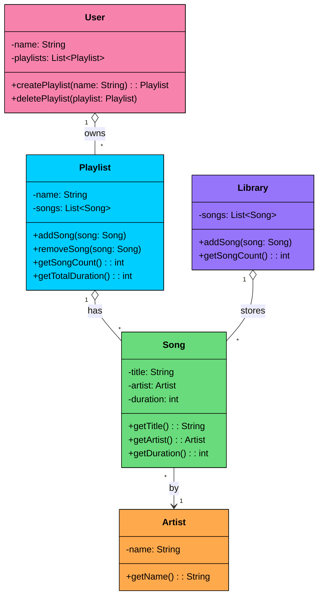

import React from 'react';
import CodeBlock from '../../../../components/ui/CodeBlock';
import Callout from '../../../../components/ui/Callout';

<div className="article-header">
  <div className="breadcrumb">
    <a href="/">Curated Notes</a>
    <span className="breadcrumb-separator">›</span>
    <span className="breadcrumb-current">Aggregation</span>
  </div>
  <h1>Aggregation</h1>
  <p style={{ color: 'var(--text-muted)', fontSize: '1.1rem', marginBottom: '16px', lineHeight: '1.6' }}>
    Master the essentials of Aggregation in this curated guide.
  </p>
  <div className="meta-info">
    <span className="meta-item">
      <svg width="14" height="14" viewBox="0 0 24 24" fill="none" stroke="currentColor" strokeWidth="2"><circle cx="12" cy="12" r="10"/><polyline points="12 6 12 12 16 14"/></svg>
      10 min read
    </span>
    <span className="difficulty-badge difficulty-badge--intermediate">Intermediate</span>
  </div>
</div>

<section className="content-section">

In the last chapter, we explored **Association**, the fundamental "uses-a" relationship that connects independent objects. We learned that in an association, objects have their own lifecycles.

But what happens when the relationship is a bit tighter? What if one class represents a "whole" and another represents a "part" of that whole?

Think of a university department and its professors, a team and its players, or a playlist and its songs.

This is where **Aggregation** comes in. It’s a specialized, stronger form of association that models a **"whole-part" relationship**.

---

## 1. What is Aggregation?

Aggregation is a specialized form of association that models a **whole-part relationship** with **loose ownership**. One class (the "whole") contains references to other class objects (the "parts"), but the parts can exist independently of the whole.

It's often described as a **"has-a"** relationship where the whole does not control the part's lifecycle. The key distinction from plain association is the structural hierarchy: there's a clear container and contained, not just two objects that know about each other.

#### Key Characteristics of Aggregation:

- The **whole** and the **part** are logically connected through a container-contained hierarchy.
- The **part can exist independently** of the whole.
- The **whole does not create or destroy** the part.
- The **part can be shared** among multiple wholes.
- Both the whole and the part can be **created and destroyed independently**.

&gt; If a class contains other classes 
&gt;
&gt; **for logical grouping only **
&gt;
&gt; without lifecycle ownership, it is an aggregation.


&gt; **Real-World Analogy**
&gt;
&gt; Let’s consider a university context:
&gt;
&gt; - A **Department** has many **Professors**.
&gt; - Professors may **belong to a department**, but they are **not owned** by it.
&gt; - If a department is dissolved, the professors still **continue to exist**, possibly getting reassigned to other departments.
&gt; - A professor can even **belong to multiple departments** in some universities.
&gt;
&gt; This relationship models **Aggregation:**the department and professors are linked, but their lifecycles are **not tightly coupled**.


---

## 2. UML Representation

In UML class diagrams, **aggregation** is represented by a **hollow diamond (◊)** on the "whole" side of the relationship. The diamond connects to the class that contains or references the other objects.





The diagram shows two classes connected by aggregation:

- **Playlist** holds references to multiple `Song` objects. The `1` to `*` multiplicity means one playlist can group many songs.
- **Song** is an independent entity with its own data (title, artist, duration). It doesn't know which playlists reference it.
- The **hollow diamond** (`o--`) on the `Playlist` side is the UML notation for aggregation. It signals that `Playlist` is the "whole" and `Song` is the "part," but the songs are not owned by the playlist.

---

## 3. Code Example

Let’s model a real-world aggregation: The relationship between a university **Department** and its **Professors**.

A department "has" professors, but the professors are independent entities. If the department is restructured or closed, the professors (as university employees) still exist and can be assigned to other departments. The department does not own the lifecycle of the professors.


```java
import java.util.List;

class Professor {
    private String name;

    public Professor(String name) {
        this.name = name;
    }

    public String getName() {
        return name;
    }
}

class Department {
    private String name;
    private List<Professor> professors;

    public Department(String name, List<Professor> professors) {
        this.name = name;
        this.professors = professors;
    }

    public void printProfessors() {
        System.out.println("Professors in " + name + " Department:");
        for (Professor professor : professors) {
            System.out.println("- " + professor.getName());
        }
    }
}

public class Main {
    public static void main(String[] args) {
        Professor p1 = new Professor("Dr. Smith");
        Professor p2 = new Professor("Dr. Johnson");

        List<Professor> profs = List.of(p1, p2);

        Department csDept = new Department("Computer Science", profs);
        csDept.printProfessors();

        // csDept can be deleted or go out of scope...
        // but p1 and p2 still exist and can be used elsewhere.
    }
}
```

```python
class Professor:
    def __init__(self, name):
        self.name = name

    def get_name(self):
        return self.name
		
class Department:
    def __init__(self, name, professors):
        self.name = name
        self.professors = professors

    def print_professors(self):
        print(f"Professors in {self.name} Department:")
        for professor in self.professors:
            print(f"- {professor.get_name()}")
			
if __name__ == "__main__":
    p1 = Professor("Dr. Smith")
    p2 = Professor("Dr. Johnson")

    profs = [p1, p2]

    cs_dept = Department("Computer Science", profs)
    cs_dept.print_professors()

    # cs_dept can go out of scope or be deleted...
    # but p1 and p2 still exist and can be used elsewhere.			
```

```cpp
#include <iostream>
#include <string>
#include <vector>

using namespace std;

class Professor {
private:
    string name;
public:
    Professor(const string& name) : name(name) {}

    string getName() const {
        return name;
    }
};

class Department {
private:
    string name;
    vector<Professor*> professors;
public:
    Department(const string& name, const vector<Professor*>& professors)
        : name(name), professors(professors) {}

    void printProfessors() const {
        cout << "Professors in " << name << " Department:" << endl;
        for (const auto& professor : professors) {
            cout << "- " << professor->getName() << endl;
        }
    }
};

int main() {
    Professor* p1 = new Professor("Dr. Smith");
    Professor* p2 = new Professor("Dr. Johnson");

    vector<Professor*> profs = {p1, p2};

    Department csDept("Computer Science", profs);
    csDept.printProfessors();

    // csDept can go out of scope or be deleted...
    // but p1 and p2 still exist and can be used elsewhere.

    delete p1;
    delete p2;

    return 0;
}
```

```go
package main

import "fmt"

type Professor struct {
	name string
}

func NewProfessor(name string) *Professor {
	return &Professor{name: name}
}

func (p *Professor) GetName() string {
	return p.name
}

type Department struct {
	name       string
	professors []*Professor
}

func NewDepartment(name string, professors []*Professor) *Department {
	return &Department{name: name, professors: professors}
}

func (d *Department) PrintProfessors() {
	fmt.Println("Professors in " + d.name + " Department:")
	for _, professor := range d.professors {
		fmt.Println("- " + professor.GetName())
	}
}

func main() {
	p1 := NewProfessor("Dr. Smith")
	p2 := NewProfessor("Dr. Johnson")

	profs := []*Professor{p1, p2}

	csDept := NewDepartment("Computer Science", profs)
	csDept.PrintProfessors()

	// csDept can go out of scope or be deleted...
	// but p1 and p2 still exist and can be used elsewhere.
}
```

```csharp
using System;
using System.Collections.Generic;

class Professor
{
    private string name;

    public Professor(string name)
    {
        this.name = name;
    }

    public string GetName()
    {
        return name;
    }
}

class Department
{
    private string name;
    private List<Professor> professors;

    public Department(string name, List<Professor> professors)
    {
        this.name = name;
        this.professors = professors;
    }

    public void PrintProfessors()
    {
        Console.WriteLine($"Professors in {name} Department:");
        foreach (var professor in professors)
        {
            Console.WriteLine($"- {professor.GetName()}");
        }
    }
}

public class Program
{
    public static void Main(string[] args)
    {
        Professor p1 = new Professor("Dr. Smith");
        Professor p2 = new Professor("Dr. Johnson");

        List<Professor> profs = new List<Professor> { p1, p2 };

        Department csDept = new Department("Computer Science", profs);
        csDept.PrintProfessors();

        // csDept can go out of scope or be deleted...
        // but p1 and p2 still exist and can be used elsewhere.
    }
}
```

```typescript
class Professor {
    private name: string;

    constructor(name: string) {
        this.name = name;
    }

    getName(): string {
        return this.name;
    }
}

class Department {
    private name: string;
    private professors: Professor[];

    constructor(name: string, professors: Professor[]) {
        this.name = name;
        this.professors = professors;
    }

    printProfessors(): void {
        console.log(`Professors in ${this.name} Department:`);
        for (const professor of this.professors) {
            console.log(`- ${professor.getName()}`);
        }
    }
}

function main(): void {
    const p1 = new Professor("Dr. Smith");
    const p2 = new Professor("Dr. Johnson");

    const profs = [p1, p2];

    const csDept = new Department("Computer Science", profs);
    csDept.printProfessors();

    // csDept can be deleted or go out of scope...
    // but p1 and p2 still exist and can be used elsewhere.
}

main();
```


Pay attention to three things in this code:

- `Department` **groups** `Professor` objects, but it does not create them. The professors are created externally and passed into the department's constructor.
- The **professors exist before** the department is created and **survive after** the department is deleted. Their lifecycle is independent.
- The same professor objects could be passed to another `Department` constructor. A professor can belong to multiple departments.

If you delete the `csDept` object, the professors still exist in memory and could be reassigned to another department. That's aggregation in action.

---

## 4. Why Aggregation Matters in OOP

Choosing aggregation in your design has significant benefits for software architecture:

- **Promotes Reusability:** "Part" components (like a `Developer` or a `Microservice`) are independent and can be reused across multiple "whole" objects (`Team` or `ApiGateway`).
- **Improves Flexibility:** The relationship is loose, which **reduces coupling** between classes. You can modify the `Team` class without affecting the `Developer` class, and vice versa.
- **Reflects Real-World Relationships:** Many real-world systems (teams, projects, organizations) naturally exhibit aggregation, making your software model more intuitive and accurate.


&gt; **Bad → Good → Great Example**
&gt;
&gt; - **Bad:** A `Team` class has a method `createNewDeveloper()`, creating and destroying `Developer` objects internally. This creates tight coupling, making it behave like composition.
&gt; - **Good:** A `Team` class holds a reference to `Developer` instances that are created elsewhere and passed to it. This is standard aggregation.
&gt; - **Great:** A `Team`'s dependencies (the list of `Developer`s) are provided via its constructor or a setter method (**Dependency Injection**). This is the most flexible approach, promoting high modularity and making the `Team` class easy to test with mock `Developer` objects.


---

## 5. Practical Example: Music Library System

Let's build a system that demonstrates aggregation across multiple classes. A music library manages artists, songs, playlists, and users. The relationships between these entities show how parts (songs) can be shared across multiple wholes (playlists), and how deleting a whole leaves its parts intact.

Here's how the classes connect:

- `Artist` is an independent entity that creates songs.
- `Song` belongs to an `Artist` but exists independently of any playlist.
- `Playlist` aggregates multiple `Song` objects. The same song can appear in different playlists.
- `User` aggregates multiple `Playlist` objects. Deleting a user's playlist doesn't destroy the songs.
- `Library` holds the master collection of all songs, independent of any playlist or user.





Notice the hollow diamonds on `Playlist`, `User`, and `Library`. All three aggregate their parts without owning their lifecycles. A song can exist in the library, in multiple playlists, and survive the deletion of any playlist or user.


```java
import java.util.ArrayList;
import java.util.List;

class Artist {
    private String name;

    public Artist(String name) {
        this.name = name;
    }

    public String getName() { return name; }
}

class Song {
    private String title;
    private Artist artist;
    private int duration;

    public Song(String title, Artist artist, int duration) {
        this.title = title;
        this.artist = artist;
        this.duration = duration;
    }

    public String getTitle() { return title; }
    public Artist getArtist() { return artist; }
    public int getDuration() { return duration; }

    @Override
    public String toString() {
        return title + " by " + artist.getName() + " (" + duration + "s)";
    }
}

class Playlist {
    private String name;
    private List<Song> songs = new ArrayList<>();

    public Playlist(String name) {
        this.name = name;
    }

    public void addSong(Song song) {
        songs.add(song);
    }

    public void removeSong(Song song) {
        songs.remove(song);
    }

    public int getSongCount() { return songs.size(); }

    public int getTotalDuration() {
        int total = 0;
        for (Song song : songs) {
            total += song.getDuration();
        }
        return total;
    }

    public String getName() { return name; }
    public List<Song> getSongs() { return songs; }
}

class User {
    private String name;
    private List<Playlist> playlists = new ArrayList<>();

    public User(String name) {
        this.name = name;
    }

    public Playlist createPlaylist(String playlistName) {
        Playlist playlist = new Playlist(playlistName);
        playlists.add(playlist);
        return playlist;
    }

    public void deletePlaylist(Playlist playlist) {
        playlists.remove(playlist);
    }

    public String getName() { return name; }
    public List<Playlist> getPlaylists() { return playlists; }
}

class Library {
    private List<Song> songs = new ArrayList<>();

    public void addSong(Song song) {
        songs.add(song);
    }

    public int getSongCount() { return songs.size(); }
    public List<Song> getSongs() { return songs; }
}

// Usage
public class Main {
    public static void main(String[] args) {
        // Create artists and songs (independent of any playlist)
        Artist coldplay = new Artist("Coldplay");
        Artist adele = new Artist("Adele");

        Song yellow = new Song("Yellow", coldplay, 269);
        Song clocks = new Song("Clocks", coldplay, 307);
        Song hello = new Song("Hello", adele, 295);
        Song someone = new Song("Someone Like You", adele, 285);

        // Add all songs to the master library
        Library library = new Library();
        library.addSong(yellow);
        library.addSong(clocks);
        library.addSong(hello);
        library.addSong(someone);

        // User creates playlists and adds songs
        User alice = new User("Alice");
        Playlist workout = alice.createPlaylist("Workout Mix");
        Playlist chill = alice.createPlaylist("Chill Vibes");

        // Same songs shared across playlists
        workout.addSong(yellow);
        workout.addSong(clocks);
        workout.addSong(hello);

        chill.addSong(hello);
        chill.addSong(someone);

        System.out.println("Library has " + library.getSongCount() + " songs");
        System.out.println();

        System.out.println(workout.getName() + " (" + workout.getSongCount() + " songs, "
            + workout.getTotalDuration() + "s):");
        for (Song s : workout.getSongs()) {
            System.out.println("  - " + s);
        }
        System.out.println();

        System.out.println(chill.getName() + " (" + chill.getSongCount() + " songs, "
            + chill.getTotalDuration() + "s):");
        for (Song s : chill.getSongs()) {
            System.out.println("  - " + s);
        }
        System.out.println();

        // Delete a playlist - songs survive
        alice.deletePlaylist(workout);
        System.out.println("After deleting '" + workout.getName() + "':");
        System.out.println("  Library still has " + library.getSongCount() + " songs");
        System.out.println("  '" + chill.getName() + "' still has " + chill.getSongCount() + " songs");
        System.out.println("  'Yellow' still exists: " + yellow.getTitle());
    }
}
```

```python
class Artist:
    def __init__(self, name: str):
        self.name = name

class Song:
    def __init__(self, title: str, artist: Artist, duration: int):
        self.title = title
        self.artist = artist
        self.duration = duration

    def __str__(self):
        return f"{self.title} by {self.artist.name} ({self.duration}s)"

class Playlist:
    def __init__(self, name: str):
        self.name = name
        self.songs = []

    def add_song(self, song: Song):
        self.songs.append(song)

    def remove_song(self, song: Song):
        self.songs.remove(song)

    def get_song_count(self):
        return len(self.songs)

    def get_total_duration(self):
        return sum(song.duration for song in self.songs)

class User:
    def __init__(self, name: str):
        self.name = name
        self.playlists = []

    def create_playlist(self, playlist_name: str):
        playlist = Playlist(playlist_name)
        self.playlists.append(playlist)
        return playlist

    def delete_playlist(self, playlist: Playlist):
        self.playlists.remove(playlist)

class Library:
    def __init__(self):
        self.songs = []

    def add_song(self, song: Song):
        self.songs.append(song)

    def get_song_count(self):
        return len(self.songs)

## Usage
if __name__ == "__main__":
    coldplay = Artist("Coldplay")
    adele = Artist("Adele")

    yellow = Song("Yellow", coldplay, 269)
    clocks = Song("Clocks", coldplay, 307)
    hello = Song("Hello", adele, 295)
    someone = Song("Someone Like You", adele, 285)

    library = Library()
    library.add_song(yellow)
    library.add_song(clocks)
    library.add_song(hello)
    library.add_song(someone)

    alice = User("Alice")
    workout = alice.create_playlist("Workout Mix")
    chill = alice.create_playlist("Chill Vibes")

    workout.add_song(yellow)
    workout.add_song(clocks)
    workout.add_song(hello)

    chill.add_song(hello)
    chill.add_song(someone)

    print(f"Library has {library.get_song_count()} songs")
    print()

    print(f"{workout.name} ({workout.get_song_count()} songs, {workout.get_total_duration()}s):")
    for s in workout.songs:
        print(f"  - {s}")
    print()

    print(f"{chill.name} ({chill.get_song_count()} songs, {chill.get_total_duration()}s):")
    for s in chill.songs:
        print(f"  - {s}")
    print()

    alice.delete_playlist(workout)
    print(f"After deleting '{workout.name}':")
    print(f"  Library still has {library.get_song_count()} songs")
    print(f"  '{chill.name}' still has {chill.get_song_count()} songs")
    print(f"  'Yellow' still exists: {yellow.title}")
```

```cpp
#include <iostream>
#include <vector>
#include <string>
#include <algorithm>
using namespace std;

class Artist {
private:
    string name;
public:
    Artist(const string& name) : name(name) {}
    string getName() const { return name; }
};

class Song {
private:
    string title;
    Artist* artist;
    int duration;
public:
    Song(const string& title, Artist* artist, int duration)
        : title(title), artist(artist), duration(duration) {}

    string getTitle() const { return title; }
    Artist* getArtist() const { return artist; }
    int getDuration() const { return duration; }

    string toString() const {
        return title + " by " + artist->getName() + " (" + to_string(duration) + "s)";
    }
};

class Playlist {
private:
    string name;
    vector<Song*> songs;
public:
    Playlist(const string& name) : name(name) {}

    void addSong(Song* song) {
        songs.push_back(song);
    }

    void removeSong(Song* song) {
        songs.erase(remove(songs.begin(), songs.end(), song), songs.end());
    }

    int getSongCount() const { return songs.size(); }

    int getTotalDuration() const {
        int total = 0;
        for (auto* song : songs) total += song->getDuration();
        return total;
    }

    string getName() const { return name; }
    vector<Song*> getSongs() const { return songs; }
};

class User {
private:
    string name;
    vector<Playlist*> playlists;
public:
    User(const string& name) : name(name) {}

    Playlist* createPlaylist(const string& playlistName) {
        auto* playlist = new Playlist(playlistName);
        playlists.push_back(playlist);
        return playlist;
    }

    void deletePlaylist(Playlist* playlist) {
        playlists.erase(remove(playlists.begin(), playlists.end(), playlist), playlists.end());
        delete playlist;
    }

    string getName() const { return name; }
    vector<Playlist*> getPlaylists() const { return playlists; }
};

class Library {
private:
    vector<Song*> songs;
public:
    void addSong(Song* song) { songs.push_back(song); }
    int getSongCount() const { return songs.size(); }
    vector<Song*> getSongs() const { return songs; }
};

int main() {
    Artist coldplay("Coldplay");
    Artist adele("Adele");

    Song yellow("Yellow", &coldplay, 269);
    Song clocks("Clocks", &coldplay, 307);
    Song hello("Hello", &adele, 295);
    Song someone("Someone Like You", &adele, 285);

    Library library;
    library.addSong(&yellow);
    library.addSong(&clocks);
    library.addSong(&hello);
    library.addSong(&someone);

    User alice("Alice");
    Playlist* workout = alice.createPlaylist("Workout Mix");
    Playlist* chill = alice.createPlaylist("Chill Vibes");

    workout->addSong(&yellow);
    workout->addSong(&clocks);
    workout->addSong(&hello);

    chill->addSong(&hello);
    chill->addSong(&someone);

    cout << "Library has " << library.getSongCount() << " songs" << endl;
    cout << endl;

    cout << workout->getName() << " (" << workout->getSongCount() << " songs, "
         << workout->getTotalDuration() << "s):" << endl;
    for (auto* s : workout->getSongs())
        cout << "  - " << s->toString() << endl;
    cout << endl;

    cout << chill->getName() << " (" << chill->getSongCount() << " songs, "
         << chill->getTotalDuration() << "s):" << endl;
    for (auto* s : chill->getSongs())
        cout << "  - " << s->toString() << endl;
    cout << endl;

    string workoutName = workout->getName();
    alice.deletePlaylist(workout);
    cout << "After deleting '" << workoutName << "':" << endl;
    cout << "  Library still has " << library.getSongCount() << " songs" << endl;
    cout << "  '" << chill->getName() << "' still has " << chill->getSongCount() << " songs" << endl;
    cout << "  'Yellow' still exists: " << yellow.getTitle() << endl;

    return 0;
}
```

```go
package main

import (
	"fmt"
	"strings"
)

type Artist struct {
	name string
}

func NewArtist(name string) *Artist {
	return &Artist{name: name}
}

func (a *Artist) GetName() string { return a.name }

type Song struct {
	title    string
	artist   *Artist
	duration int
}

func NewSong(title string, artist *Artist, duration int) *Song {
	return &Song{title: title, artist: artist, duration: duration}
}

func (s *Song) GetTitle() string    { return s.title }
func (s *Song) GetArtist() *Artist  { return s.artist }
func (s *Song) GetDuration() int    { return s.duration }
func (s *Song) String() string {
	return s.title + " by " + s.artist.GetName() + " (" + fmt.Sprintf("%ds", s.duration) + ")"
}

type Playlist struct {
	name  string
	songs []*Song
}

func NewPlaylist(name string) *Playlist {
	return &Playlist{name: name, songs: make([]*Song, 0)}
}

func (p *Playlist) AddSong(song *Song) {
	p.songs = append(p.songs, song)
}

func (p *Playlist) RemoveSong(song *Song) {
	for i, s := range p.songs {
		if s == song {
			p.songs = append(p.songs[:i], p.songs[i+1:]...)
			return
		}
	}
}

func (p *Playlist) GetSongCount() int { return len(p.songs) }

func (p *Playlist) GetTotalDuration() int {
	total := 0
	for _, song := range p.songs {
		total += song.GetDuration()
	}
	return total
}

func (p *Playlist) GetName() string    { return p.name }
func (p *Playlist) GetSongs() []*Song  { return p.songs }

type User struct {
	name      string
	playlists []*Playlist
}

func NewUser(name string) *User {
	return &User{name: name, playlists: make([]*Playlist, 0)}
}

func (u *User) CreatePlaylist(playlistName string) *Playlist {
	playlist := NewPlaylist(playlistName)
	u.playlists = append(u.playlists, playlist)
	return playlist
}

func (u *User) DeletePlaylist(playlist *Playlist) {
	for i, p := range u.playlists {
		if p == playlist {
			u.playlists = append(u.playlists[:i], u.playlists[i+1:]...)
			return
		}
	}
}

func (u *User) GetName() string         { return u.name }
func (u *User) GetPlaylists() []*Playlist { return u.playlists }

type Library struct {
	songs []*Song
}

func NewLibrary() *Library {
	return &Library{songs: make([]*Song, 0)}
}

func (l *Library) AddSong(song *Song) {
	l.songs = append(l.songs, song)
}

func (l *Library) GetSongCount() int { return len(l.songs) }
func (l *Library) GetSongs() []*Song { return l.songs }

func main() {
	coldplay := NewArtist("Coldplay")
	adele := NewArtist("Adele")

	yellow := NewSong("Yellow", coldplay, 269)
	clocks := NewSong("Clocks", coldplay, 307)
	hello := NewSong("Hello", adele, 295)
	someone := NewSong("Someone Like You", adele, 285)

	library := NewLibrary()
	library.AddSong(yellow)
	library.AddSong(clocks)
	library.AddSong(hello)
	library.AddSong(someone)

	alice := NewUser("Alice")
	workout := alice.CreatePlaylist("Workout Mix")
	chill := alice.CreatePlaylist("Chill Vibes")

	workout.AddSong(yellow)
	workout.AddSong(clocks)
	workout.AddSong(hello)

	chill.AddSong(hello)
	chill.AddSong(someone)

	fmt.Println("Library has", library.GetSongCount(), "songs")
	fmt.Println()

	fmt.Println(workout.GetName(), "(", workout.GetSongCount(), "songs,", workout.GetTotalDuration(), "s):")
	for _, s := range workout.GetSongs() {
		fmt.Println("  -", s)
	}
	fmt.Println()

	fmt.Println(chill.GetName(), "(", chill.GetSongCount(), "songs,", chill.GetTotalDuration(), "s):")
	for _, s := range chill.GetSongs() {
		fmt.Println("  -", s)
	}
	fmt.Println()

	alice.DeletePlaylist(workout)
	fmt.Println("After deleting '"+workout.GetName()+"':")
	fmt.Println("  Library still has", library.GetSongCount(), "songs")
	fmt.Println("  '"+chill.GetName()+"' still has", chill.GetSongCount(), "songs")
	fmt.Println("  'Yellow' still exists:", yellow.GetTitle())

	_ = strings.Builder{}
}
```

```csharp
using System;
using System.Collections.Generic;
using System.Linq;

class Artist {
    public string Name { get; }
    public Artist(string name) { Name = name; }
}

class Song {
    public string Title { get; }
    public Artist Artist { get; }
    public int Duration { get; }

    public Song(string title, Artist artist, int duration) {
        Title = title;
        Artist = artist;
        Duration = duration;
    }

    public override string ToString() {
        return $"{Title} by {Artist.Name} ({Duration}s)";
    }
}

class Playlist {
    public string Name { get; }
    private List<Song> songs = new List<Song>();

    public Playlist(string name) { Name = name; }

    public void AddSong(Song song) { songs.Add(song); }
    public void RemoveSong(Song song) { songs.Remove(song); }
    public int GetSongCount() { return songs.Count; }
    public int GetTotalDuration() { return songs.Sum(s => s.Duration); }
    public List<Song> GetSongs() { return songs; }
}

class User {
    public string Name { get; }
    private List<Playlist> playlists = new List<Playlist>();

    public User(string name) { Name = name; }

    public Playlist CreatePlaylist(string playlistName) {
        var playlist = new Playlist(playlistName);
        playlists.Add(playlist);
        return playlist;
    }

    public void DeletePlaylist(Playlist playlist) {
        playlists.Remove(playlist);
    }

    public List<Playlist> GetPlaylists() { return playlists; }
}

class Library {
    private List<Song> songs = new List<Song>();

    public void AddSong(Song song) { songs.Add(song); }
    public int GetSongCount() { return songs.Count; }
    public List<Song> GetSongs() { return songs; }
}

class Program {
    static void Main() {
        var coldplay = new Artist("Coldplay");
        var adele = new Artist("Adele");

        var yellow = new Song("Yellow", coldplay, 269);
        var clocks = new Song("Clocks", coldplay, 307);
        var hello = new Song("Hello", adele, 295);
        var someone = new Song("Someone Like You", adele, 285);

        var library = new Library();
        library.AddSong(yellow);
        library.AddSong(clocks);
        library.AddSong(hello);
        library.AddSong(someone);

        var alice = new User("Alice");
        var workout = alice.CreatePlaylist("Workout Mix");
        var chill = alice.CreatePlaylist("Chill Vibes");

        workout.AddSong(yellow);
        workout.AddSong(clocks);
        workout.AddSong(hello);

        chill.AddSong(hello);
        chill.AddSong(someone);

        Console.WriteLine($"Library has {library.GetSongCount()} songs");
        Console.WriteLine();

        Console.WriteLine($"{workout.Name} ({workout.GetSongCount()} songs, {workout.GetTotalDuration()}s):");
        foreach (var s in workout.GetSongs())
            Console.WriteLine($"  - {s}");
        Console.WriteLine();

        Console.WriteLine($"{chill.Name} ({chill.GetSongCount()} songs, {chill.GetTotalDuration()}s):");
        foreach (var s in chill.GetSongs())
            Console.WriteLine($"  - {s}");
        Console.WriteLine();

        alice.DeletePlaylist(workout);
        Console.WriteLine($"After deleting '{workout.Name}':");
        Console.WriteLine($"  Library still has {library.GetSongCount()} songs");
        Console.WriteLine($"  '{chill.Name}' still has {chill.GetSongCount()} songs");
        Console.WriteLine($"  'Yellow' still exists: {yellow.Title}");
    }
}
```

```typescript
class Artist {
    private name: string;

    constructor(name: string) {
        this.name = name;
    }

    getName(): string { return this.name; }
}

class Song {
    private title: string;
    private artist: Artist;
    private duration: number;

    constructor(title: string, artist: Artist, duration: number) {
        this.title = title;
        this.artist = artist;
        this.duration = duration;
    }

    getTitle(): string { return this.title; }
    getArtist(): Artist { return this.artist; }
    getDuration(): number { return this.duration; }

    toString(): string {
        return this.title + " by " + this.artist.getName() + " (" + this.duration + "s)";
    }
}

class Playlist {
    private name: string;
    private songs: Song[] = [];

    constructor(name: string) {
        this.name = name;
    }

    addSong(song: Song): void {
        this.songs.push(song);
    }

    removeSong(song: Song): void {
        const i = this.songs.indexOf(song);
        if (i !== -1) this.songs.splice(i, 1);
    }

    getSongCount(): number { return this.songs.length; }

    getTotalDuration(): number {
        let total = 0;
        for (const song of this.songs) {
            total += song.getDuration();
        }
        return total;
    }

    getName(): string { return this.name; }
    getSongs(): Song[] { return this.songs; }
}

class User {
    private name: string;
    private playlists: Playlist[] = [];

    constructor(name: string) {
        this.name = name;
    }

    createPlaylist(playlistName: string): Playlist {
        const playlist = new Playlist(playlistName);
        this.playlists.push(playlist);
        return playlist;
    }

    deletePlaylist(playlist: Playlist): void {
        const i = this.playlists.indexOf(playlist);
        if (i !== -1) this.playlists.splice(i, 1);
    }

    getName(): string { return this.name; }
    getPlaylists(): Playlist[] { return this.playlists; }
}

class Library {
    private songs: Song[] = [];

    addSong(song: Song): void {
        this.songs.push(song);
    }

    getSongCount(): number { return this.songs.length; }
    getSongs(): Song[] { return this.songs; }
}

// Usage
const coldplay = new Artist("Coldplay");
const adele = new Artist("Adele");

const yellow = new Song("Yellow", coldplay, 269);
const clocks = new Song("Clocks", coldplay, 307);
const hello = new Song("Hello", adele, 295);
const someone = new Song("Someone Like You", adele, 285);

const library = new Library();
library.addSong(yellow);
library.addSong(clocks);
library.addSong(hello);
library.addSong(someone);

const alice = new User("Alice");
const workout = alice.createPlaylist("Workout Mix");
const chill = alice.createPlaylist("Chill Vibes");

workout.addSong(yellow);
workout.addSong(clocks);
workout.addSong(hello);

chill.addSong(hello);
chill.addSong(someone);

console.log("Library has " + library.getSongCount() + " songs");
console.log();

console.log(workout.getName() + " (" + workout.getSongCount() + " songs, " +
    workout.getTotalDuration() + "s):");
for (const s of workout.getSongs()) {
    console.log("  - " + s.toString());
}
console.log();

console.log(chill.getName() + " (" + chill.getSongCount() + " songs, " +
    chill.getTotalDuration() + "s):");
for (const s of chill.getSongs()) {
    console.log("  - " + s.toString());
}
console.log();

alice.deletePlaylist(workout);
console.log("After deleting '" + workout.getName() + "':");
console.log("  Library still has " + library.getSongCount() + " songs");
console.log("  '" + chill.getName() + "' still has " + chill.getSongCount() + " songs");
console.log("  'Yellow' still exists: " + yellow.getTitle());
```


#### Why This Design Works

- **Songs are shared across playlists.** "Hello" appears in both "Workout Mix" and "Chill Vibes." Both playlists reference the same `Song` object. If Adele updates the song metadata, both playlists see the change automatically.
- **Deleting a playlist doesn't destroy songs.** When "Workout Mix" is deleted, the library still has all 4 songs and "Chill Vibes" is unaffected. The playlist was just a container of references.
- **The library is the authoritative source.** Songs exist in the `Library` independently of any playlist. Playlists are views over the library's data, not owners of it.
- **Users own playlists, but playlists don't own songs.** This is aggregation at two levels: `User` aggregates `Playlist`, and `Playlist` aggregates `Song`. At each level, the parts survive the deletion of the whole.

</section>
