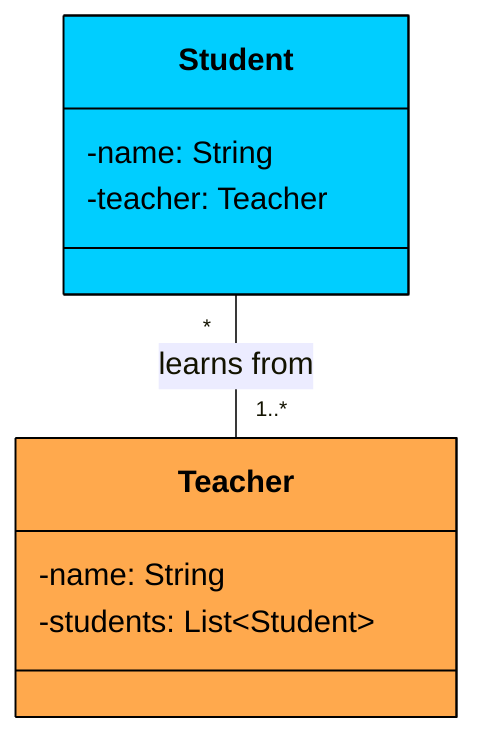
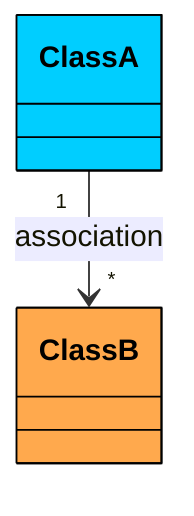
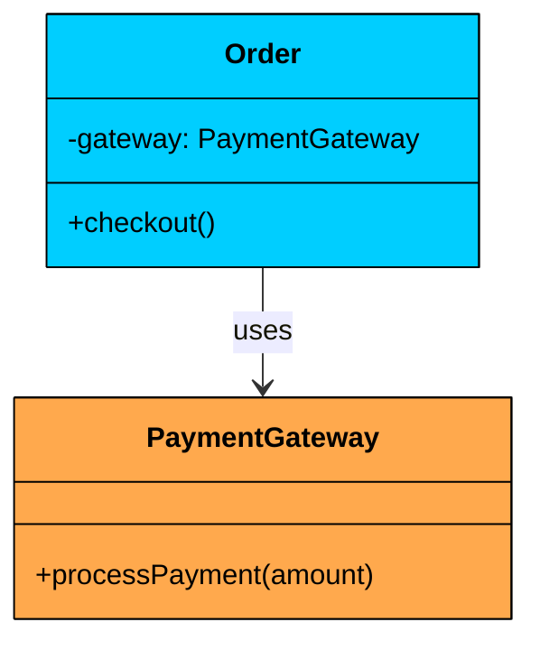
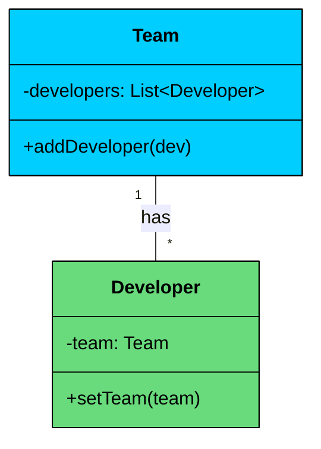
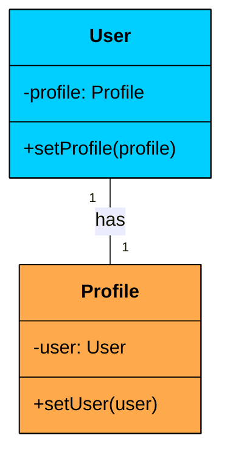
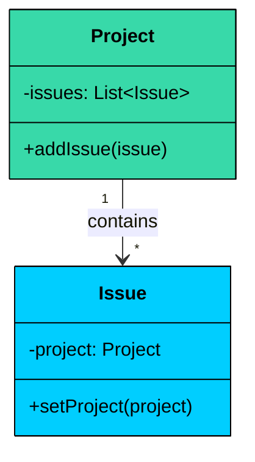
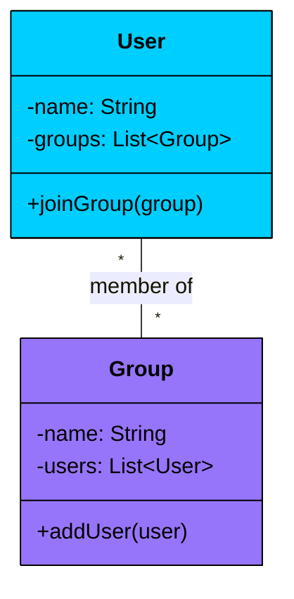
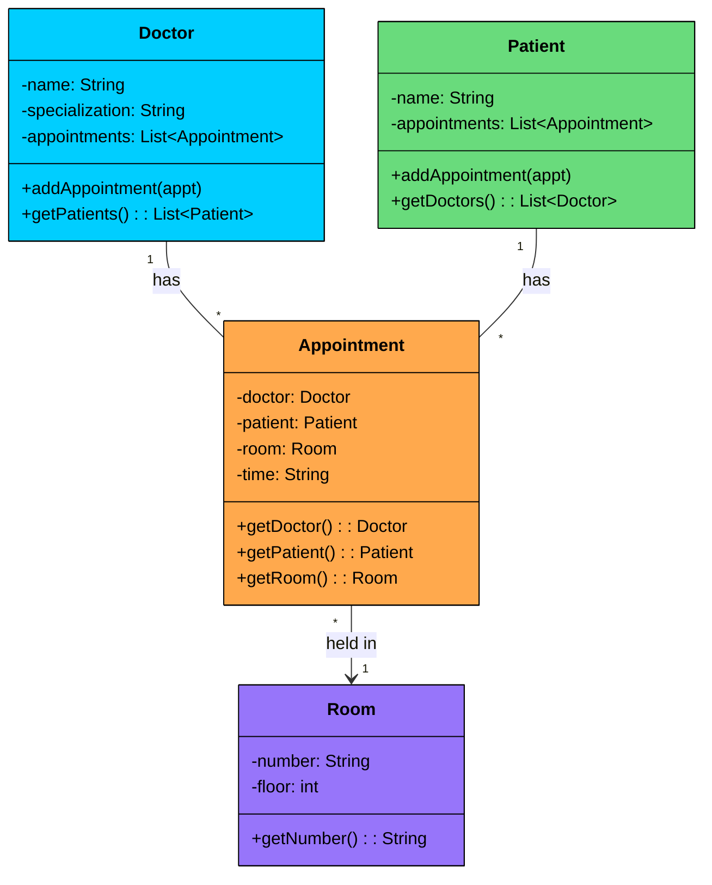

import React from 'react';
import CodeBlock from '../../../../components/ui/CodeBlock';
import Callout from '../../../../components/ui/Callout';

<div className="article-header">
  <div className="breadcrumb">
    <a href="/">Curated Notes</a>
    <span className="breadcrumb-separator">›</span>
    <span className="breadcrumb-current">Association</span>
  </div>
  <h1>Association</h1>
  <p style={{ color: 'var(--text-muted)', fontSize: '1.1rem', marginBottom: '16px', lineHeight: '1.6' }}>
    Master the essentials of Association in this curated guide.
  </p>
  <div className="meta-info">
    <span className="meta-item">
      <svg width="14" height="14" viewBox="0 0 24 24" fill="none" stroke="currentColor" strokeWidth="2"><circle cx="12" cy="12" r="10"/><polyline points="12 6 12 12 16 14"/></svg>
      10 min read
    </span>
    <span className="difficulty-badge difficulty-badge--intermediate">Intermediate</span>
  </div>
</div>

<section className="content-section">

In the real world, **nothing exists in isolation**.

- A **doctor** has patients.
- A **driver** has a car.
- A **student** enrolls in courses.

These connections define how different entities interact and collaborate.

When we design software using **Object-Oriented Programming (OOP)**, our goal is to model this real world where objects communicate and work together to achieve meaningful outcomes.

**So, how do we represent these connections between our objects?**

In this chapter, we will explore the most fundamental and common of these relationships: **Association**.

---

## 1. What is Association?

**Association** represents a relationship between two classes where **one object uses, communicates with, or references another**.

This relationship models the idea:

&gt; **“One object need to know about the existence of another object to perform its responsibilities”**

If Class A must interact with Class B to fulfill its purpose, then Class A is **associated** with Class B.


&gt; **Real-World Analogy**
&gt;
&gt; Think of a **Student** and a **Teacher**.
&gt;
&gt; - A student **has-a** teacher who teaches them.
&gt; - A teacher **teaches** multiple students.
&gt;
&gt; 

&gt; 
&gt;
&gt; However:
&gt;
&gt; - A **student can still exist** without a teacher.
&gt; - A **teacher can still exist** without any specific student.
&gt;
&gt; This is a **real-world association**:
&gt;
&gt; - The relationship exists.
&gt; - But **neither party owns the other**.
&gt; - Their lifecycles are **independent**.


#### Key Characteristics of Association:

- Association reflects a **"has-a"** or **"uses-a"** relationship.
- Associated objects are **loosely coupled** and can exist **independently** of one another.
- The association can be **unidirectional** or **bidirectional**, and can follow different **multiplicity** patterns (1-to-1, 1-to-many, etc.).

---

## 2. UML Representation

In UML class diagrams, **association** is represented by a **solid line** between two classes.


| Symbol | Meaning | Example Scenario |
| --- | --- | --- |
| Solid line (---) | An association between classes | `Student` --- `Teacher` |
| Arrowhead (--&gt;) | Directionality (who knows whom) | `Order` --&gt; `PaymentGateway` |
| No arrowhead | Bidirectional association | `Team` --- `Developer` |
| `1` | Exactly one | Each `User` has one `Profile` |
| `0..1` | Zero or one (optional) | An `Employee` may have a `Manager` |
| `*` | Many (zero or more) | A `Project` can have many `Tasks` |
| `1..*` | At least one | Each `Course` has one or more `Students` |


Multiplicity defines **how many instances** of one class can be associated with another. It is written near the class ends in UML diagrams.





The solid line is the key. Inheritance uses a solid line with a hollow triangle. Aggregation adds a hollow diamond. Composition adds a filled diamond. Plain association is just the line, optionally with an arrowhead for direction and multiplicity labels at each end.

---

## 3. Types of Association

Associations between classes can vary depending on **how** objects are connected and **in which direction** information flows.

In Object-Oriented Design, associations are primarily defined by two key properties:

1. **Directionality** — *Who knows about whom?*
2. **Multiplicity** — *How many objects are connected?*

### **3.1 Based on Direction (Directionality)**

Directionality determines **which class holds a reference to the other** and whether communication is one-way or two-way.

#### **a. Unidirectional Association**

In a unidirectional association, only one class is aware of or holds a reference to the other class. The referenced class has no knowledge of who is referencing it.





**Example: **An `Order` object uses a `PaymentGateway` to process transactions, but the `PaymentGateway` doesn't keep track of any orders. The order knows about the gateway. The gateway doesn't know about the order.


```java
class PaymentGateway {
    void processPayment(double amount) {
        System.out.println("Processing payment of $" + amount);
    }
}

class Order {
    private PaymentGateway gateway;

    public Order(PaymentGateway gateway) {
        this.gateway = gateway;
    }

    public void checkout() {
        gateway.processPayment(100.0);
    }
}
```

```python
class PaymentGateway:
    def process_payment(self, amount: float):
        print(f"Processing payment of ${amount}")

class Order:
    def __init__(self, gateway: PaymentGateway):
        self.gateway = gateway

    def checkout(self):
        self.gateway.process_payment(100.0)
```

```cpp
class PaymentGateway {
public:
    void processPayment(double amount) {
        cout << "Processing payment of $" << amount << endl;
    }
};

class Order {
private:
    PaymentGateway* gateway;

public:
    Order(PaymentGateway* gateway) {
        this->gateway = gateway;
    }

    void checkout() {
        gateway->processPayment(100.0);
    }
};
```

```go
type PaymentGateway struct{}

func (pg *PaymentGateway) ProcessPayment(amount float64) {
	fmt.Println("Processing payment of $", amount)
}

type Order struct {
	gateway *PaymentGateway
}

func NewOrder(gateway *PaymentGateway) *Order {
	return &Order{gateway: gateway}
}

func (o *Order) Checkout() {
	o.gateway.ProcessPayment(100.0)
}
```

```csharp
class PaymentGateway {
    public void ProcessPayment(double amount) {
        Console.WriteLine($"Processing payment of ${amount}");
    }
}

class Order {
    private PaymentGateway gateway;

    public Order(PaymentGateway gateway) {
        this.gateway = gateway;
    }

    public void Checkout() {
        gateway.ProcessPayment(100.0);
    }
}
```

```typescript
class PaymentGateway {
    processPayment(amount: number): void {
        console.log(`Processing payment of $${amount}`);
    }
}

class Order {
    private gateway: PaymentGateway;

    constructor(gateway: PaymentGateway) {
        this.gateway = gateway;
    }

    checkout(): void {
        this.gateway.processPayment(100.0);
    }
}
```


`Order` holds a reference to `PaymentGateway` and calls its method. But `PaymentGateway` has no field or reference pointing back to `Order`. This is the simplest and most common form of association. When in doubt, start with unidirectional. You can always add the reverse direction later if needed.

#### **b. Bidirectional Association**

In a **bidirectional association**, both classes are aware of each other. Each class holds a reference to the other, enabling **two-way communication**.





**Example:** A `Team` has a list of `Developer`s, and each `Developer` knows which `Team` they belong to. Either side can navigate to the other.


```java
class Developer {
    private Team team;

    public void setTeam(Team team) {
        this.team = team;
    }
}

class Team {
    private List<Developer> developers = new ArrayList<>();

    public void addDeveloper(Developer dev) {
        developers.add(dev);
        dev.setTeam(this);
    }
}
```

```python
class Developer:
    def __init__(self):
        self.team = None

    def set_team(self, team):
        self.team = team

class Team:
    def __init__(self):
        self.developers = []

    def add_developer(self, dev: Developer):
        self.developers.append(dev)
        dev.set_team(self)
```

```cpp
class Developer {
private:
    Team* team;
public:
    void setTeam(Team* team) {
        this->team = team;
    }
};

class Team {
private:
    vector<Developer*> developers;
public:
    void addDeveloper(Developer* dev) {
        developers.push_back(dev);
        dev->setTeam(this);
    }
};
```

```go
type Developer struct {
	team *Team
}

func (d *Developer) setTeam(team *Team) {
	d.team = team
}

type Team struct {
	developers []*Developer
}

func (t *Team) addDeveloper(dev *Developer) {
	t.developers = append(t.developers, dev)
	dev.setTeam(t)
}
```

```csharp
class Developer {
    private Team team;

    public void SetTeam(Team team) {
        this.team = team;
    }
}

class Team {
    private List<Developer> developers = new List<Developer>();

    public void AddDeveloper(Developer dev) {
        developers.Add(dev);
        dev.SetTeam(this);
    }
}
```

```typescript
class Developer {
    private team?: Team;

    setTeam(team: Team): void {
        this.team = team;
    }
}

class Team {
    private developers: Developer[] = [];

    addDeveloper(dev: Developer): void {
        this.developers.push(dev);
        dev.setTeam(this);
    }
}
```


Notice how `addDeveloper()` updates both sides of the relationship: it adds the developer to the team's list *and* sets the team reference on the developer. This is important. In a bidirectional association, both references must stay in sync. If you add a developer to the team but forget to set the developer's team reference, you'll get inconsistent state where the team thinks it has the developer, but the developer doesn't know which team it belongs to.

Bidirectional associations are more complex to maintain than unidirectional ones. You need to keep both sides synchronized, which means more code and more opportunities for bugs. Use them only when both sides genuinely need to navigate to the other.

---

### **3.2 Based on Multiplicity**

Multiplicity defines **how many instances** of one class can be associated with instances of another class. It describes **the quantity and nature of the connections**.

#### **a. One-to-One Association**

Each object of one class is linked to **exactly one** object of the other class.





**Example: **Each `User` has exactly one `Profile`, and each `Profile` belongs to one `User`. This is a bidirectional one-to-one relationship.


```java
class Profile {
    private User user;

    public void setUser(User user) {
        this.user = user;
    }
}

class User {
    private Profile profile;

    public void setProfile(Profile profile) {
        this.profile = profile;
        profile.setUser(this);
    }
}
```

```python
class Profile:
    def __init__(self):
        self.user = None

    def set_user(self, user):
        self.user = user

class User:
    def __init__(self):
        self.profile = None

    def set_profile(self, profile: Profile):
        self.profile = profile
        profile.set_user(self)
```

```cpp
class Profile {
private:
    User* user;
public:
    void setUser(User* user) {
        this->user = user;
    }
};

class User {
private:
    Profile* profile;
public:
    void setProfile(Profile* profile) {
        this->profile = profile;
        profile->setUser(this);
    }
};
```

```go
type Profile struct {
	user *User
}

func (p *Profile) SetUser(user *User) {
	p.user = user
}

type User struct {
	profile *Profile
}

func (u *User) SetProfile(profile *Profile) {
	u.profile = profile
	profile.SetUser(u)
}
```

```csharp
class Profile {
    private User user;

    public void SetUser(User user) {
        this.user = user;
    }
}

class User {
    private Profile profile;

    public void SetProfile(Profile profile) {
        this.profile = profile;
        profile.SetUser(this);
    }
}
```

```typescript
class Profile {
    private user?: User;

    setUser(user: User): void {
        this.user = user;
    }
}

class User {
    private profile?: Profile;

    setProfile(profile: Profile): void {
        this.profile = profile;
        profile.setUser(this);
    }
}
```


One-to-one associations make sense when you want to separate concerns even though the objects are tightly paired. A `User` handles authentication (login, password, roles), while a `Profile` handles display information (avatar, bio, preferences). Merging them into one class would work, but separating them keeps each class focused on a single responsibility. 

If you find that two one-to-one associated classes are always created, modified, and deleted together with no independent use case, that's a signal they might belong as a single class instead.

#### **b. One-to-Many Association**

One object of a class is linked to multiple objects of another class. This is one of the most common patterns in software design.





**Example:** Each `Project` can have many `Issue`s (bug reports, feature requests), but each `Issue` belongs to one `Project`. The project holds a list of issues, and each issue holds a back-reference to its project.


```java
class Issue {
    private Project project;

    public void setProject(Project project) {
        this.project = project;
    }
}

class Project {
    private List<Issue> issues = new ArrayList<>();

    public void addIssue(Issue issue) {
        issues.add(issue);
        issue.setProject(this);
    }
}
```

```python
class Issue:
    def __init__(self):
        self.project = None

    def set_project(self, project):
        self.project = project

class Project:
    def __init__(self):
        self.issues = []

    def add_issue(self, issue: Issue):
        self.issues.append(issue)
        issue.set_project(self)
```

```cpp
class Issue {
private:
    Project* project;
public:
    void setProject(Project* project) {
        this->project = project;
    }
};

class Project {
private:
    vector<Issue*> issues;
public:
    void addIssue(Issue* issue) {
        issues.push_back(issue);
        issue->setProject(this);
    }
};
```

```go
type Issue struct {
	project *Project
}

func (i *Issue) setProject(project *Project) {
	i.project = project
}

type Project struct {
	issues []*Issue
}

func (p *Project) addIssue(issue *Issue) {
	p.issues = append(p.issues, issue)
	issue.setProject(p)
}
```

```csharp
class Issue {
    private Project project;

    public void SetProject(Project project) {
        this.project = project;
    }
}

class Project {
    private List<Issue> issues = new List<Issue>();

    public void AddIssue(Issue issue) {
        issues.Add(issue);
        issue.SetProject(this);
    }
}
```

```typescript
class Issue {
    private project?: Project;

    setProject(project: Project): void {
        this.project = project;
    }
}

class Project {
    private issues: Issue[] = [];

    addIssue(issue: Issue): void {
        this.issues.push(issue);
        issue.setProject(this);
    }
}
```


#### **c. Many-to-Many Association**

Multiple objects from one class are associated with multiple objects from another class. This is common in scenarios involving memberships, enrollments, or tagging systems.





**Example:** A `User` can be a member of multiple `Group`s (WhatsApp groups, Slack channels), and a `Group` can have multiple `User`s. Both sides hold a list of the other. The `joinGroup()` and `addUser()` methods keep both sides in sync.


```java
class User {
    private String name;
    private List<Group> groups = new ArrayList<>();

    public User(String name) {
        this.name = name;
    }

    public void joinGroup(Group group) {
        if (!groups.contains(group)) {
            groups.add(group);
            group.addUser(this);
        }
    }

    public String getName() {
        return name;
    }

    public List<Group> getGroups() {
        return groups;
    }
}

class Group {
    private String name;
    private List<User> users = new ArrayList<>();

    public Group(String name) {
        this.name = name;
    }

    public void addUser(User user) {
        if (!users.contains(user)) {
            users.add(user);
            user.joinGroup(this);
        }
    }

    public String getName() {
        return name;
    }

    public List<User> getUsers() {
        return users;
    }
}

// Usage
User alice = new User("Alice");
User bob = new User("Bob");

Group backend = new Group("Backend");
Group devOps = new Group("DevOps");

alice.joinGroup(backend);
alice.joinGroup(devOps);
bob.joinGroup(backend);

// Alice is in: Backend, DevOps
// Bob is in: Backend
// Backend has: Alice, Bob
// DevOps has: Alice
```

```python
class User:
    def __init__(self, name: str):
        self.name = name
        self.groups = []

    def join_group(self, group):
        if group not in self.groups:
            self.groups.append(group)
            group.add_user(self)

class Group:
    def __init__(self, name: str):
        self.name = name
        self.users = []

    def add_user(self, user: User):
        if user not in self.users:
            self.users.append(user)
            user.join_group(self)

## Usage
alice = User("Alice")
bob = User("Bob")

backend = Group("Backend")
dev_ops = Group("DevOps")

alice.join_group(backend)
alice.join_group(dev_ops)
bob.join_group(backend)

## Alice is in: Backend, DevOps
## Bob is in: Backend
## Backend has: Alice, Bob
## DevOps has: Alice
```

```cpp
class Group; // Forward declaration

class User {
private:
    string name;
    vector<Group*> groups;
public:
    User(const string& name) : name(name) {}

    void joinGroup(Group* group);

    string getName() const { return name; }
    vector<Group*> getGroups() const { return groups; }
};

class Group {
private:
    string name;
    vector<User*> users;
public:
    Group(const string& name) : name(name) {}

    void addUser(User* user) {
        for (auto u : users) if (u == user) return;
        users.push_back(user);
        user->joinGroup(this);
    }

    string getName() const { return name; }
    vector<User*> getUsers() const { return users; }
};

void User::joinGroup(Group* group) {
    for (auto g : groups) if (g == group) return;
    groups.push_back(group);
    group->addUser(this);
}

// Usage
User alice("Alice");
User bob("Bob");

Group backend("Backend");
Group devOps("DevOps");

alice.joinGroup(&backend);
alice.joinGroup(&devOps);
bob.joinGroup(&backend);
```

```go
type User struct {
	name   string
	groups []*Group
}

func NewUser(name string) *User {
	return &User{name: name}
}

func (u *User) JoinGroup(group *Group) {
	for _, g := range u.groups {
		if g == group {
			return
		}
	}
	u.groups = append(u.groups, group)
	group.AddUser(u)
}

func (u *User) GetName() string {
	return u.name
}

func (u *User) GetGroups() []*Group {
	return u.groups
}

type Group struct {
	name  string
	users []*User
}

func NewGroup(name string) *Group {
	return &Group{name: name}
}

func (g *Group) AddUser(user *User) {
	for _, u := range g.users {
		if u == user {
			return
		}
	}
	g.users = append(g.users, user)
	user.JoinGroup(g)
}

func (g *Group) GetName() string {
	return g.name
}

func (g *Group) GetUsers() []*User {
	return g.users
}

// Usage
alice := NewUser("Alice")
bob := NewUser("Bob")

backend := NewGroup("Backend")
devOps := NewGroup("DevOps")

alice.JoinGroup(backend)
alice.JoinGroup(devOps)
bob.JoinGroup(backend)
```

```csharp
class User {
    private string name;
    private List<Group> groups = new List<Group>();

    public User(string name) {
        this.name = name;
    }

    public void JoinGroup(Group group) {
        if (!groups.Contains(group)) {
            groups.Add(group);
            group.AddUser(this);
        }
    }

    public string GetName() { return name; }
    public List<Group> GetGroups() { return groups; }
}

class Group {
    private string name;
    private List<User> users = new List<User>();

    public Group(string name) {
        this.name = name;
    }

    public void AddUser(User user) {
        if (!users.Contains(user)) {
            users.Add(user);
            user.JoinGroup(this);
        }
    }

    public string GetName() { return name; }
    public List<User> GetUsers() { return users; }
}

// Usage
User alice = new User("Alice");
User bob = new User("Bob");

Group backend = new Group("Backend");
Group devOps = new Group("DevOps");

alice.JoinGroup(backend);
alice.JoinGroup(devOps);
bob.JoinGroup(backend);
```

```typescript
class User {
    private name: string;
    private groups: Group[] = [];

    constructor(name: string) {
        this.name = name;
    }

    joinGroup(group: Group): void {
        if (!this.groups.includes(group)) {
            this.groups.push(group);
            group.addUser(this);
        }
    }

    getName(): string { return this.name; }
    getGroups(): Group[] { return this.groups; }
}

class Group {
    private name: string;
    private users: User[] = [];

    constructor(name: string) {
        this.name = name;
    }

    addUser(user: User): void {
        if (!this.users.includes(user)) {
            this.users.push(user);
            user.joinGroup(this);
        }
    }

    getName(): string { return this.name; }
    getUsers(): User[] { return this.users; }
}

// Usage
const alice = new User("Alice");
const bob = new User("Bob");

const backend = new Group("Backend");
const devOps = new Group("DevOps");

alice.joinGroup(backend);
alice.joinGroup(devOps);
bob.joinGroup(backend);
```


Notice the guard clause in both `joinGroup()` and `addUser()`. Without it, calling `alice.joinGroup(backend)` would add `backend` to Alice's groups, then `backend.addUser(alice)` would add Alice to backend's users, then it would call `alice.joinGroup(backend)` again, and you'd be stuck in an infinite loop. The `contains` check breaks the recursion.

Many-to-many associations are inherently bidirectional and require careful synchronization. In database design, you'd model this with a join table. In code, both sides hold a list of the other, and you need helper methods that update both sides atomically.

---

## 4. Practical Example: Hospital Appointment System

Let's build a system that combines multiple association types in a realistic domain. A hospital manages doctors, patients, rooms, and appointments. The relationships between these entities demonstrate unidirectional, bidirectional, one-to-many, and many-to-many associations working together.

Here's how the classes connect:

- `Appointment` holds a reference to a `Room` (unidirectional, the room doesn't know about its appointments).
- `Doctor` has a list of `Appointment` objects, and each `Appointment` points back to its `Doctor` (bidirectional one-to-many).
- `Patient` has a list of `Appointment` objects, and each `Appointment` points back to its `Patient` (bidirectional one-to-many).
- `Doctor` and `Patient` are connected many-to-many *through* `Appointment` as an intermediary. A doctor sees many patients, and a patient can visit many doctors, but they don't reference each other directly.





```java
import java.util.ArrayList;
import java.util.List;
import java.util.stream.Collectors;

class Room {
    private String number;
    private int floor;

    public Room(String number, int floor) {
        this.number = number;
        this.floor = floor;
    }

    public String getNumber() { return number; }
    public int getFloor() { return floor; }
}

class Appointment {
    private Doctor doctor;
    private Patient patient;
    private Room room;
    private String time;

    public Appointment(Doctor doctor, Patient patient, Room room, String time) {
        this.doctor = doctor;
        this.patient = patient;
        this.room = room;
        this.time = time;
        doctor.addAppointment(this);
        patient.addAppointment(this);
    }

    public Doctor getDoctor() { return doctor; }
    public Patient getPatient() { return patient; }
    public Room getRoom() { return room; }
    public String getTime() { return time; }
}

class Doctor {
    private String name;
    private String specialization;
    private List<Appointment> appointments = new ArrayList<>();

    public Doctor(String name, String specialization) {
        this.name = name;
        this.specialization = specialization;
    }

    public void addAppointment(Appointment appt) {
        appointments.add(appt);
    }

    public List<Patient> getPatients() {
        return appointments.stream()
            .map(Appointment::getPatient)
            .distinct()
            .collect(Collectors.toList());
    }

    public String getName() { return name; }
    public String getSpecialization() { return specialization; }
    public List<Appointment> getAppointments() { return appointments; }
}

class Patient {
    private String name;
    private List<Appointment> appointments = new ArrayList<>();

    public Patient(String name) {
        this.name = name;
    }

    public void addAppointment(Appointment appt) {
        appointments.add(appt);
    }

    public List<Doctor> getDoctors() {
        return appointments.stream()
            .map(Appointment::getDoctor)
            .distinct()
            .collect(Collectors.toList());
    }

    public String getName() { return name; }
    public List<Appointment> getAppointments() { return appointments; }
}

// Usage
public class Main {
    public static void main(String[] args) {
        Doctor drSmith = new Doctor("Dr. Smith", "Cardiology");
        Doctor drPatel = new Doctor("Dr. Patel", "Neurology");

        Patient alice = new Patient("Alice");
        Patient bob = new Patient("Bob");

        Room room101 = new Room("101", 1);
        Room room205 = new Room("205", 2);

        new Appointment(drSmith, alice, room101, "9:00 AM");
        new Appointment(drSmith, bob, room101, "10:00 AM");
        new Appointment(drPatel, alice, room205, "2:00 PM");

        System.out.println(drSmith.getName() + "'s patients:");
        for (Patient p : drSmith.getPatients()) {
            System.out.println("  - " + p.getName());
        }

        System.out.println(alice.getName() + "'s doctors:");
        for (Doctor d : alice.getDoctors()) {
            System.out.println("  - " + d.getName() + " (" + d.getSpecialization() + ")");
        }

        System.out.println(drSmith.getName() + "'s schedule:");
        for (Appointment a : drSmith.getAppointments()) {
            System.out.println("  - " + a.getTime() + " with " + a.getPatient().getName()
                + " in Room " + a.getRoom().getNumber());
        }
    }
}
```

```python
class Room:
    def __init__(self, number: str, floor: int):
        self.number = number
        self.floor = floor

class Appointment:
    def __init__(self, doctor, patient, room: Room, time: str):
        self.doctor = doctor
        self.patient = patient
        self.room = room
        self.time = time
        doctor.add_appointment(self)
        patient.add_appointment(self)

class Doctor:
    def __init__(self, name: str, specialization: str):
        self.name = name
        self.specialization = specialization
        self.appointments = []

    def add_appointment(self, appt: Appointment):
        self.appointments.append(appt)

    def get_patients(self):
        seen = set()
        result = []
        for appt in self.appointments:
            if id(appt.patient) not in seen:
                seen.add(id(appt.patient))
                result.append(appt.patient)
        return result

class Patient:
    def __init__(self, name: str):
        self.name = name
        self.appointments = []

    def add_appointment(self, appt: Appointment):
        self.appointments.append(appt)

    def get_doctors(self):
        seen = set()
        result = []
        for appt in self.appointments:
            if id(appt.doctor) not in seen:
                seen.add(id(appt.doctor))
                result.append(appt.doctor)
        return result

## Usage
dr_smith = Doctor("Dr. Smith", "Cardiology")
dr_patel = Doctor("Dr. Patel", "Neurology")

alice = Patient("Alice")
bob = Patient("Bob")

room_101 = Room("101", 1)
room_205 = Room("205", 2)

Appointment(dr_smith, alice, room_101, "9:00 AM")
Appointment(dr_smith, bob, room_101, "10:00 AM")
Appointment(dr_patel, alice, room_205, "2:00 PM")

print(f"{dr_smith.name}'s patients:")
for p in dr_smith.get_patients():
    print(f"  - {p.name}")

print(f"{alice.name}'s doctors:")
for d in alice.get_doctors():
    print(f"  - {d.name} ({d.specialization})")

print(f"{dr_smith.name}'s schedule:")
for a in dr_smith.appointments:
    print(f"  - {a.time} with {a.patient.name} in Room {a.room.number}")
```

```cpp
#include <iostream>
#include <vector>
#include <string>
#include <algorithm>
using namespace std;

class Room {
private:
    string number;
    int floor;
public:
    Room(const string& number, int floor) : number(number), floor(floor) {}
    string getNumber() const { return number; }
    int getFloor() const { return floor; }
};

class Doctor;
class Patient;

class Appointment {
private:
    Doctor* doctor;
    Patient* patient;
    Room* room;
    string time;
public:
    Appointment(Doctor* doctor, Patient* patient, Room* room, const string& time);
    Doctor* getDoctor() const { return doctor; }
    Patient* getPatient() const { return patient; }
    Room* getRoom() const { return room; }
    string getTime() const { return time; }
};

class Doctor {
private:
    string name;
    string specialization;
    vector<Appointment*> appointments;
public:
    Doctor(const string& name, const string& specialization)
        : name(name), specialization(specialization) {}

    void addAppointment(Appointment* appt) {
        appointments.push_back(appt);
    }

    vector<Patient*> getPatients() const;

    string getName() const { return name; }
    string getSpecialization() const { return specialization; }
    vector<Appointment*> getAppointments() const { return appointments; }
};

class Patient {
private:
    string name;
    vector<Appointment*> appointments;
public:
    Patient(const string& name) : name(name) {}

    void addAppointment(Appointment* appt) {
        appointments.push_back(appt);
    }

    vector<Doctor*> getDoctors() const;

    string getName() const { return name; }
    vector<Appointment*> getAppointments() const { return appointments; }
};

Appointment::Appointment(Doctor* doctor, Patient* patient, Room* room, const string& time)
    : doctor(doctor), patient(patient), room(room), time(time) {
    doctor->addAppointment(this);
    patient->addAppointment(this);
}

vector<Patient*> Doctor::getPatients() const {
    vector<Patient*> result;
    for (auto* appt : appointments) {
        auto* p = appt->getPatient();
        if (find(result.begin(), result.end(), p) == result.end())
            result.push_back(p);
    }
    return result;
}

vector<Doctor*> Patient::getDoctors() const {
    vector<Doctor*> result;
    for (auto* appt : appointments) {
        auto* d = appt->getDoctor();
        if (find(result.begin(), result.end(), d) == result.end())
            result.push_back(d);
    }
    return result;
}

int main() {
    Doctor drSmith("Dr. Smith", "Cardiology");
    Doctor drPatel("Dr. Patel", "Neurology");

    Patient alice("Alice");
    Patient bob("Bob");

    Room room101("101", 1);
    Room room205("205", 2);

    Appointment a1(&drSmith, &alice, &room101, "9:00 AM");
    Appointment a2(&drSmith, &bob, &room101, "10:00 AM");
    Appointment a3(&drPatel, &alice, &room205, "2:00 PM");

    cout << drSmith.getName() << "'s patients:" << endl;
    for (auto* p : drSmith.getPatients())
        cout << "  - " << p->getName() << endl;

    cout << alice.getName() << "'s doctors:" << endl;
    for (auto* d : alice.getDoctors())
        cout << "  - " << d->getName() << " (" << d->getSpecialization() << ")" << endl;

    cout << drSmith.getName() << "'s schedule:" << endl;
    for (auto* a : drSmith.getAppointments())
        cout << "  - " << a->getTime() << " with " << a->getPatient()->getName()
             << " in Room " << a->getRoom()->getNumber() << endl;

    return 0;
}
```

```go
package main

import "fmt"

type Room struct {
	number string
	floor  int
}

func NewRoom(number string, floor int) *Room {
	return &Room{number: number, floor: floor}
}

func (r *Room) GetNumber() string { return r.number }
func (r *Room) GetFloor() int     { return r.floor }

type Appointment struct {
	doctor *Doctor
	patient *Patient
	room   *Room
	time   string
}

func NewAppointment(doctor *Doctor, patient *Patient, room *Room, time string) *Appointment {
	a := &Appointment{doctor: doctor, patient: patient, room: room, time: time}
	doctor.addAppointment(a)
	patient.addAppointment(a)
	return a
}

func (a *Appointment) GetDoctor() *Doctor  { return a.doctor }
func (a *Appointment) GetPatient() *Patient { return a.patient }
func (a *Appointment) GetRoom() *Room       { return a.room }
func (a *Appointment) GetTime() string      { return a.time }

type Doctor struct {
	name           string
	specialization string
	appointments   []*Appointment
}

func NewDoctor(name, specialization string) *Doctor {
	return &Doctor{name: name, specialization: specialization}
}

func (d *Doctor) addAppointment(appt *Appointment) {
	d.appointments = append(d.appointments, appt)
}

func (d *Doctor) GetPatients() []*Patient {
	seen := make(map[*Patient]bool)
	var result []*Patient
	for _, appt := range d.appointments {
		p := appt.GetPatient()
		if !seen[p] {
			seen[p] = true
			result = append(result, p)
		}
	}
	return result
}

func (d *Doctor) GetName() string           { return d.name }
func (d *Doctor) GetSpecialization() string  { return d.specialization }
func (d *Doctor) GetAppointments() []*Appointment { return d.appointments }

type Patient struct {
	name         string
	appointments []*Appointment
}

func NewPatient(name string) *Patient {
	return &Patient{name: name}
}

func (p *Patient) addAppointment(appt *Appointment) {
	p.appointments = append(p.appointments, appt)
}

func (p *Patient) GetDoctors() []*Doctor {
	seen := make(map[*Doctor]bool)
	var result []*Doctor
	for _, appt := range p.appointments {
		d := appt.GetDoctor()
		if !seen[d] {
			seen[d] = true
			result = append(result, d)
		}
	}
	return result
}

func (p *Patient) GetName() string              { return p.name }
func (p *Patient) GetAppointments() []*Appointment { return p.appointments }

func main() {
	drSmith := NewDoctor("Dr. Smith", "Cardiology")
	drPatel := NewDoctor("Dr. Patel", "Neurology")

	alice := NewPatient("Alice")
	bob := NewPatient("Bob")

	room101 := NewRoom("101", 1)
	room205 := NewRoom("205", 2)

	NewAppointment(drSmith, alice, room101, "9:00 AM")
	NewAppointment(drSmith, bob, room101, "10:00 AM")
	NewAppointment(drPatel, alice, room205, "2:00 PM")

	fmt.Println(drSmith.GetName() + "'s patients:")
	for _, p := range drSmith.GetPatients() {
		fmt.Println("  -", p.GetName())
	}

	fmt.Println(alice.GetName() + "'s doctors:")
	for _, d := range alice.GetDoctors() {
		fmt.Println("  -", d.GetName(), "("+d.GetSpecialization()+")")
	}

	fmt.Println(drSmith.GetName() + "'s schedule:")
	for _, a := range drSmith.GetAppointments() {
		fmt.Println("  -", a.GetTime(), "with", a.GetPatient().GetName(), "in Room", a.GetRoom().GetNumber())
	}
}
```

```csharp
using System;
using System.Collections.Generic;
using System.Linq;

class Room {
    public string Number { get; }
    public int Floor { get; }

    public Room(string number, int floor) {
        Number = number;
        Floor = floor;
    }
}

class Appointment {
    public Doctor Doctor { get; }
    public Patient Patient { get; }
    public Room Room { get; }
    public string Time { get; }

    public Appointment(Doctor doctor, Patient patient, Room room, string time) {
        Doctor = doctor;
        Patient = patient;
        Room = room;
        Time = time;
        doctor.AddAppointment(this);
        patient.AddAppointment(this);
    }
}

class Doctor {
    public string Name { get; }
    public string Specialization { get; }
    private List<Appointment> appointments = new List<Appointment>();

    public Doctor(string name, string specialization) {
        Name = name;
        Specialization = specialization;
    }

    public void AddAppointment(Appointment appt) {
        appointments.Add(appt);
    }

    public List<Patient> GetPatients() {
        return appointments.Select(a => a.Patient).Distinct().ToList();
    }

    public List<Appointment> GetAppointments() { return appointments; }
}

class Patient {
    public string Name { get; }
    private List<Appointment> appointments = new List<Appointment>();

    public Patient(string name) { Name = name; }

    public void AddAppointment(Appointment appt) {
        appointments.Add(appt);
    }

    public List<Doctor> GetDoctors() {
        return appointments.Select(a => a.Doctor).Distinct().ToList();
    }

    public List<Appointment> GetAppointments() { return appointments; }
}

// Usage
class Program {
    static void Main() {
        var drSmith = new Doctor("Dr. Smith", "Cardiology");
        var drPatel = new Doctor("Dr. Patel", "Neurology");

        var alice = new Patient("Alice");
        var bob = new Patient("Bob");

        var room101 = new Room("101", 1);
        var room205 = new Room("205", 2);

        new Appointment(drSmith, alice, room101, "9:00 AM");
        new Appointment(drSmith, bob, room101, "10:00 AM");
        new Appointment(drPatel, alice, room205, "2:00 PM");

        Console.WriteLine($"{drSmith.Name}'s patients:");
        foreach (var p in drSmith.GetPatients())
            Console.WriteLine($"  - {p.Name}");

        Console.WriteLine($"{alice.Name}'s doctors:");
        foreach (var d in alice.GetDoctors())
            Console.WriteLine($"  - {d.Name} ({d.Specialization})");

        Console.WriteLine($"{drSmith.Name}'s schedule:");
        foreach (var a in drSmith.GetAppointments())
            Console.WriteLine($"  - {a.Time} with {a.Patient.Name} in Room {a.Room.Number}");
    }
}
```

```typescript
class Room {
    constructor(
        private number: string,
        private floor: number
    ) {}

    getNumber(): string { return this.number; }
    getFloor(): number { return this.floor; }
}

class Appointment {
    constructor(
        private doctor: Doctor,
        private patient: Patient,
        private room: Room,
        private time: string
    ) {
        doctor.addAppointment(this);
        patient.addAppointment(this);
    }

    getDoctor(): Doctor { return this.doctor; }
    getPatient(): Patient { return this.patient; }
    getRoom(): Room { return this.room; }
    getTime(): string { return this.time; }
}

class Doctor {
    private appointments: Appointment[] = [];

    constructor(
        private name: string,
        private specialization: string
    ) {}

    addAppointment(appt: Appointment): void {
        this.appointments.push(appt);
    }

    getPatients(): Patient[] {
        const seen = new Set<Patient>();
        return this.appointments
            .map(a => a.getPatient())
            .filter(p => { if (seen.has(p)) return false; seen.add(p); return true; });
    }

    getName(): string { return this.name; }
    getSpecialization(): string { return this.specialization; }
    getAppointments(): Appointment[] { return this.appointments; }
}

class Patient {
    private appointments: Appointment[] = [];

    constructor(private name: string) {}

    addAppointment(appt: Appointment): void {
        this.appointments.push(appt);
    }

    getDoctors(): Doctor[] {
        const seen = new Set<Doctor>();
        return this.appointments
            .map(a => a.getDoctor())
            .filter(d => { if (seen.has(d)) return false; seen.add(d); return true; });
    }

    getName(): string { return this.name; }
    getAppointments(): Appointment[] { return this.appointments; }
}

// Usage
const drSmith = new Doctor("Dr. Smith", "Cardiology");
const drPatel = new Doctor("Dr. Patel", "Neurology");

const alice = new Patient("Alice");
const bob = new Patient("Bob");

const room101 = new Room("101", 1);
const room205 = new Room("205", 2);

new Appointment(drSmith, alice, room101, "9:00 AM");
new Appointment(drSmith, bob, room101, "10:00 AM");
new Appointment(drPatel, alice, room205, "2:00 PM");

console.log(`${drSmith.getName()}'s patients:`);
for (const p of drSmith.getPatients()) {
    console.log(`  - ${p.getName()}`);
}

console.log(`${alice.getName()}'s doctors:`);
for (const d of alice.getDoctors()) {
    console.log(`  - ${d.getName()} (${d.getSpecialization()})`);
}

console.log(`${drSmith.getName()}'s schedule:`);
for (const a of drSmith.getAppointments()) {
    console.log(`  - ${a.getTime()} with ${a.getPatient().getName()} in Room ${a.getRoom().getNumber()}`);
}
```


#### Why This Design Works

- **The **`Appointment`** class is the intermediary.** Instead of `Doctor` and `Patient` holding direct references to each other (which would create a tangled many-to-many), they connect through `Appointment`. This is a common pattern for modeling many-to-many relationships in code, analogous to a join table in a relational database.
- **Navigation works both ways.** A doctor can find all their patients by walking their appointments. A patient can find all their doctors the same way. Neither class needs to maintain a separate list of the other.
- `Room`** stays simple.** The room doesn't need to know about appointments. It's just a location. This keeps the relationship unidirectional and avoids unnecessary coupling.
- **Adding data to the relationship is natural.** Because `Appointment` is a full object, you can add fields like `time`, `status`, `notes`, or `diagnosis` without modifying `Doctor` or `Patient`. Try doing that with a direct many-to-many reference.

</section>
