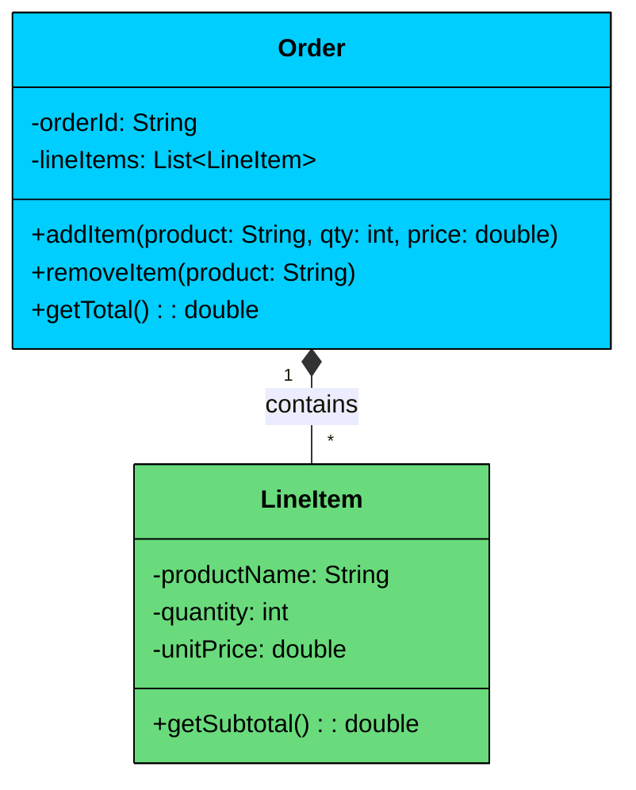
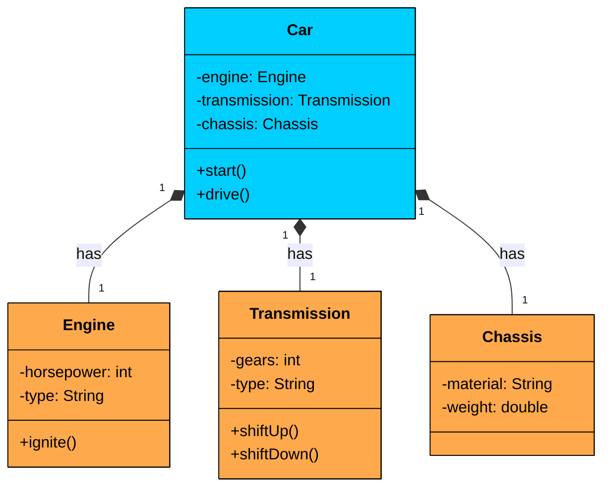
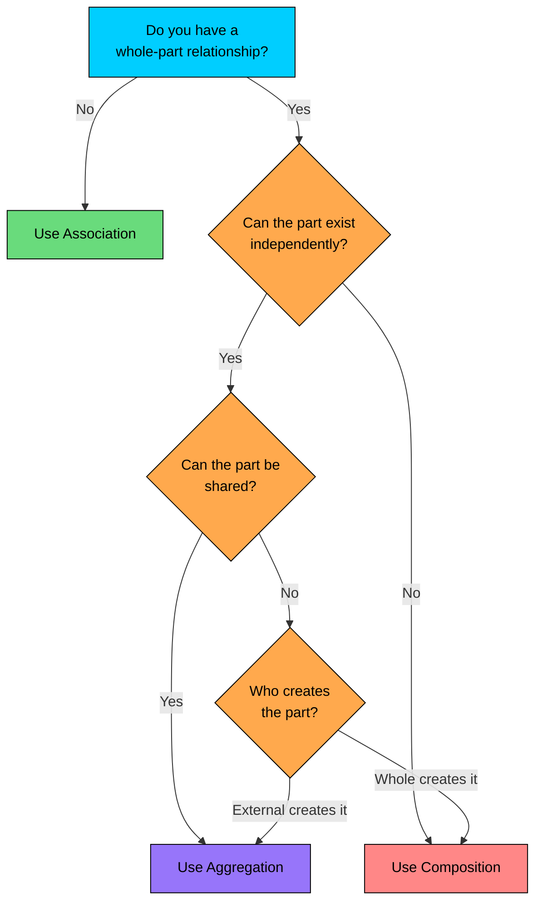

import React from 'react';
import CodeBlock from '../../../../components/ui/CodeBlock';
import Callout from '../../../../components/ui/Callout';

<div className="article-header">
  <div className="breadcrumb">
    <a href="/">Curated Notes</a>
    <span className="breadcrumb-separator">›</span>
    <span className="breadcrumb-current">Composition</span>
  </div>
  <h1>Composition</h1>
  <p style={{ color: 'var(--text-muted)', fontSize: '1.1rem', marginBottom: '16px', lineHeight: '1.6' }}>
    Master the essentials of Composition in this curated guide.
  </p>
  <div className="meta-info">
    <span className="meta-item">
      <svg width="14" height="14" viewBox="0 0 24 24" fill="none" stroke="currentColor" strokeWidth="2"><circle cx="12" cy="12" r="10"/><polyline points="12 6 12 12 16 14"/></svg>
      10 min read
    </span>
    <span className="difficulty-badge difficulty-badge--intermediate">Intermediate</span>
  </div>
</div>

<section className="content-section">

What if a relationship is so strong that the "part" is meaningless and cannot even exist without the "whole"? 

This is the world of **Composition**. It represents the strongest form of **"has-a"** relationship, where the whole owns the parts and controls their lifecycle.

When you use composition, you're saying:

- *“This object is composed of other objects.”*
- *“And if the container goes away, so do its parts.”*

---

## 1. What is Composition?

**Composition** is a special type of association that signifies **strong ownership** between objects. The “whole” class is **fully responsible** for creating, managing, and destroying the “part” objects. In fact, the parts **cannot exist without** the whole.

#### Key Characteristics of Composition:

- Represents a **strong “has-a”** relationship.
- The **whole owns** the part and **controls its lifecycle**.
- When the whole is destroyed, the **parts are also destroyed**.
- The parts are **not shared** with any other object.
- The part has **no independent meaning or identity** outside the whole.

&gt; If the part makes no sense without the whole, 
&gt;
&gt; **use composition**
&gt;
&gt; .


&gt; **Real-World Analogy**
&gt;
&gt; Imagine a **House** and its **Rooms**:
&gt;
&gt; - A house **has** a living room, a kitchen, a bedroom.
&gt; - These rooms **do not exist on their own**. They are part of the house.
&gt; - When the house is demolished, the rooms are gone with it.
&gt; - You don’t transfer a bedroom from one house to another.
&gt;
&gt; This is a textbook example of **composition**. The rooms are tightly bound to the house—not just logically, but in **lifecycle and ownership** as well.


---

## 2. UML Representation

In UML class diagrams, **composition** is represented by a **filled diamond (◆)** at the “whole” end of the relationship. This is in contrast to aggregation's hollow diamond (◊) and association's plain solid line.





The diagram shows two classes connected by composition:

- **Order** owns and manages a list of `LineItem` objects. The `1` to `*` multiplicity means one order can contain many line items.
- **LineItem** is a dependent entity. It holds data about a single product in the order (name, quantity, unit price), but it has no identity or purpose outside of its parent order.
- The **filled diamond** (`*--`) on the `Order` side is the UML notation for composition. It signals that `Order` is the "whole" and `LineItem` is the "part," and that the line items are owned by the order.

#### Multiple Compositions

A class can be composed of multiple other objects. A `Car` is composed of an `Engine`, a `Transmission`, and a `Chassis`. These are integral parts of the car. You don't take the engine out and share it between two cars simultaneously. If the car is scrapped, these parts are scrapped with it. 

In the software model, the `Car` creates these components and controls their lifecycle.





The filled diamonds on the `Car` side tell you: `Car` creates and owns these components. They don't float around the system independently.

---

## 3. Code Example

Let's model the ordering scenario. An `Order` composes multiple `LineItem` objects. The order creates line items internally when items are added, and destroys them when the order is destroyed.


```java
import java.util.List;
import java.util.ArrayList;

class LineItem {
    private String productName;
    private int quantity;
    private double unitPrice;

    public LineItem(String productName, int quantity, double unitPrice) {
        this.productName = productName;
        this.quantity = quantity;
        this.unitPrice = unitPrice;
    }

    public double getSubtotal() {
        return quantity * unitPrice;
    }

    public String getProductName() {
        return productName;
    }

    public void describe() {
        System.out.printf("%s x%d @ $%.2f = $%.2f%n",
            productName, quantity, unitPrice, getSubtotal());
    }
}

class Order {
    private String orderId;
    private List<LineItem> lineItems;

    public Order(String orderId) {
        this.orderId = orderId;
        this.lineItems = new ArrayList<>();
    }

    public void addItem(String product, int quantity, double unitPrice) {
        lineItems.add(new LineItem(product, quantity, unitPrice));
    }

    public void removeItem(String product) {
        lineItems.removeIf(item -> item.getProductName().equals(product));
    }

    public double getTotal() {
        double total = 0;
        for (LineItem item : lineItems) {
            total += item.getSubtotal();
        }
        return total;
    }

    public void printReceipt() {
        System.out.println("Order: " + orderId);
        for (LineItem item : lineItems) {
            item.describe();
        }
        System.out.printf("Total: $%.2f%n", getTotal());
    }
}

public class Main {
    public static void main(String[] args) {
        Order order = new Order("ORD-1001");
        order.addItem("Wireless Mouse", 2, 29.99);
        order.addItem("USB-C Cable", 3, 9.99);
        order.addItem("Laptop Stand", 1, 49.99);

        order.printReceipt();

        // When order is deleted, all LineItems are destroyed with it.
        // No LineItem exists outside of an Order.
    }
}
```

```python
class LineItem:
    def __init__(self, product_name, quantity, unit_price):
        self.product_name = product_name
        self.quantity = quantity
        self.unit_price = unit_price

    def get_subtotal(self):
        return self.quantity * self.unit_price

    def describe(self):
        print(f"{self.product_name} x{self.quantity} "
              f"@ ${self.unit_price:.2f} = ${self.get_subtotal():.2f}")

class Order:
    def __init__(self, order_id):
        self.order_id = order_id
        self.line_items = []

    def add_item(self, product, quantity, unit_price):
        self.line_items.append(LineItem(product, quantity, unit_price))

    def remove_item(self, product):
        self.line_items = [
            item for item in self.line_items
            if item.product_name != product
        ]

    def get_total(self):
        return sum(item.get_subtotal() for item in self.line_items)

    def print_receipt(self):
        print(f"Order: {self.order_id}")
        for item in self.line_items:
            item.describe()
        print(f"Total: ${self.get_total():.2f}")

if __name__ == "__main__":
    order = Order("ORD-1001")
    order.add_item("Wireless Mouse", 2, 29.99)
    order.add_item("USB-C Cable", 3, 9.99)
    order.add_item("Laptop Stand", 1, 49.99)

    order.print_receipt()

    # When order is deleted, all LineItems are destroyed with it.
    # No LineItem exists outside of an Order.
```

```cpp
#include <iostream>
#include <string>
#include <vector>
#include <algorithm>

using namespace std;

class LineItem {
private:
    string productName;
    int quantity;
    double unitPrice;

public:
    LineItem(const string& productName, int quantity, double unitPrice)
        : productName(productName), quantity(quantity), unitPrice(unitPrice) {}

    double getSubtotal() const {
        return quantity * unitPrice;
    }

    string getProductName() const {
        return productName;
    }

    void describe() const {
        cout << productName << " x" << quantity
             << " @ $" << unitPrice
             << " = $" << getSubtotal() << endl;
    }
};

class Order {
private:
    string orderId;
    vector<LineItem> lineItems;

public:
    Order(const string& orderId) : orderId(orderId) {}

    void addItem(const string& product, int quantity, double unitPrice) {
        lineItems.emplace_back(product, quantity, unitPrice);
    }

    void removeItem(const string& product) {
        lineItems.erase(
            remove_if(lineItems.begin(), lineItems.end(),
                [&](const LineItem& item) {
                    return item.getProductName() == product;
                }),
            lineItems.end());
    }

    double getTotal() const {
        double total = 0;
        for (const auto& item : lineItems) {
            total += item.getSubtotal();
        }
        return total;
    }

    void printReceipt() const {
        cout << "Order: " << orderId << endl;
        for (const auto& item : lineItems) {
            item.describe();
        }
        cout << "Total: $" << getTotal() << endl;
    }
};

int main() {
    Order order("ORD-1001");
    order.addItem("Wireless Mouse", 2, 29.99);
    order.addItem("USB-C Cable", 3, 9.99);
    order.addItem("Laptop Stand", 1, 49.99);

    order.printReceipt();

    // When order goes out of scope, all LineItems are destroyed
    // automatically (RAII). No manual cleanup needed.

    return 0;
}
```

```go
package main

import (
	"fmt"
)

type LineItem struct {
	productName string
	quantity    int
	unitPrice   float64
}

func NewLineItem(productName string, quantity int, unitPrice float64) LineItem {
	return LineItem{productName: productName, quantity: quantity, unitPrice: unitPrice}
}

func (l LineItem) GetSubtotal() float64 {
	return float64(l.quantity) * l.unitPrice
}

func (l LineItem) GetProductName() string {
	return l.productName
}

func (l LineItem) Describe() {
	fmt.Printf("%s x%d @ $%.2f = $%.2f\n",
		l.productName, l.quantity, l.unitPrice, l.GetSubtotal())
}

type Order struct {
	orderId   string
	lineItems []LineItem
}

func NewOrder(orderId string) *Order {
	return &Order{orderId: orderId, lineItems: make([]LineItem, 0)}
}

func (o *Order) AddItem(product string, quantity int, unitPrice float64) {
	o.lineItems = append(o.lineItems, NewLineItem(product, quantity, unitPrice))
}

func (o *Order) RemoveItem(product string) {
	filtered := o.lineItems[:0]
	for _, item := range o.lineItems {
		if item.GetProductName() != product {
			filtered = append(filtered, item)
		}
	}
	o.lineItems = filtered
}

func (o *Order) GetTotal() float64 {
	total := 0.0
	for _, item := range o.lineItems {
		total += item.GetSubtotal()
	}
	return total
}

func (o *Order) PrintReceipt() {
	fmt.Printf("Order: %s\n", o.orderId)
	for _, item := range o.lineItems {
		item.Describe()
	}
	fmt.Printf("Total: $%.2f\n", o.GetTotal())
}

func main() {
	order := NewOrder("ORD-1001")
	order.AddItem("Wireless Mouse", 2, 29.99)
	order.AddItem("USB-C Cable", 3, 9.99)
	order.AddItem("Laptop Stand", 1, 49.99)

	order.PrintReceipt()

	// When order is deleted, all LineItems are destroyed with it.
	// No LineItem exists outside of an Order.
}
```

```csharp
using System;
using System.Collections.Generic;

class LineItem
{
    private string productName;
    private int quantity;
    private double unitPrice;

    public LineItem(string productName, int quantity, double unitPrice)
    {
        this.productName = productName;
        this.quantity = quantity;
        this.unitPrice = unitPrice;
    }

    public double GetSubtotal()
    {
        return quantity * unitPrice;
    }

    public string GetProductName()
    {
        return productName;
    }

    public void Describe()
    {
        Console.WriteLine($"{productName} x{quantity} " +
            $"@ ${unitPrice:F2} = ${GetSubtotal():F2}");
    }
}

class Order
{
    private string orderId;
    private List<LineItem> lineItems;

    public Order(string orderId)
    {
        this.orderId = orderId;
        this.lineItems = new List<LineItem>();
    }

    public void AddItem(string product, int quantity, double unitPrice)
    {
        lineItems.Add(new LineItem(product, quantity, unitPrice));
    }

    public void RemoveItem(string product)
    {
        lineItems.RemoveAll(item => item.GetProductName() == product);
    }

    public double GetTotal()
    {
        double total = 0;
        foreach (var item in lineItems)
        {
            total += item.GetSubtotal();
        }
        return total;
    }

    public void PrintReceipt()
    {
        Console.WriteLine($"Order: {orderId}");
        foreach (var item in lineItems)
        {
            item.Describe();
        }
        Console.WriteLine($"Total: ${GetTotal():F2}");
    }
}

public class Program
{
    public static void Main(string[] args)
    {
        Order order = new Order("ORD-1001");
        order.AddItem("Wireless Mouse", 2, 29.99);
        order.AddItem("USB-C Cable", 3, 9.99);
        order.AddItem("Laptop Stand", 1, 49.99);

        order.PrintReceipt();

        // When order is garbage collected, all LineItems go with it.
        // No LineItem exists outside of an Order.
    }
}
```

```typescript
class LineItem {
    private productName: string;
    private quantity: number;
    private unitPrice: number;

    constructor(productName: string, quantity: number, unitPrice: number) {
        this.productName = productName;
        this.quantity = quantity;
        this.unitPrice = unitPrice;
    }

    getSubtotal(): number {
        return this.quantity * this.unitPrice;
    }

    getProductName(): string {
        return this.productName;
    }

    describe(): void {
        console.log(`${this.productName} x${this.quantity} ` +
            `@ $${this.unitPrice.toFixed(2)} = $${this.getSubtotal().toFixed(2)}`);
    }
}

class Order {
    private orderId: string;
    private lineItems: LineItem[];

    constructor(orderId: string) {
        this.orderId = orderId;
        this.lineItems = [];
    }

    addItem(product: string, quantity: number, unitPrice: number): void {
        this.lineItems.push(new LineItem(product, quantity, unitPrice));
    }

    removeItem(product: string): void {
        this.lineItems = this.lineItems.filter(
            item => item.getProductName() !== product
        );
    }

    getTotal(): number {
        return this.lineItems.reduce(
            (total, item) => total + item.getSubtotal(), 0
        );
    }

    printReceipt(): void {
        console.log(`Order: ${this.orderId}`);
        for (const item of this.lineItems) {
            item.describe();
        }
        console.log(`Total: $${this.getTotal().toFixed(2)}`);
    }
}

function main(): void {
    const order = new Order("ORD-1001");
    order.addItem("Wireless Mouse", 2, 29.99);
    order.addItem("USB-C Cable", 3, 9.99);
    order.addItem("Laptop Stand", 1, 49.99);

    order.printReceipt();

    // When order is garbage collected, all LineItems go with it.
    // No LineItem exists outside of an Order.
}

main();
```


Pay attention to three things that make this composition:

- **The order creates its own line items.** The `addItem()` method takes raw data (product name, quantity, price) and internally creates a `new LineItem(...)`. The line items are not passed in from outside. This is the key structural difference from aggregation, where parts are created externally and passed into the whole.
- **Line items have no independent existence.** There is no `LineItem` floating around in the system outside of an `Order`. No other class holds a reference to these line items. They are born inside the order and die with the order.
- **Destroying the order destroys all line items.** When the `Order` object is garbage collected (or goes out of scope in C++), all its `LineItem` objects are destroyed too. No orphaned line items, no cleanup code, no dangling references.

This is a true composition relationship: the parts exist only within the context of the whole, and their lifecycle is completely controlled by it.

---

## 4. When to Use Composition

Use composition when you can answer "yes" to these questions:

- **Is the part meaningless without the whole?** A line item without an order has no purpose. A room without a house makes no sense. If the part loses its identity outside the whole, that's composition.
- **Should the whole control the part's lifecycle?** If the whole creates the parts and destroys them, that's composition. If the parts are created externally and passed in, that leans toward aggregation.
- **Are the parts exclusive to one whole?** If a part belongs to exactly one whole and is never shared, that's composition. If the same part can appear in multiple wholes (like a song in multiple playlists), that's aggregation.
- **Do you want to model strong containment?** When the relationship is "is composed of" rather than "groups together," composition is the right choice.

Composition is a **preferred alternative to inheritance** when building flexible systems.

&gt; “
&gt;
&gt; **Favor composition over inheritance**
&gt;
&gt; .” — GoF Design Principle

#### Why?

- You can build complex behavior by **composing smaller, reusable parts**.
- It avoids the **tight coupling** and **fragility** of inheritance hierarchies.
- You can **swap out parts dynamically** to modify behavior.

For example:

- A `Vehicle` can **compose** an `Engine` interface.
- Swap between `PetrolEngine`, `ElectricEngine`, or `HybridEngine` at runtime.

This leads to **cleaner, testable, and decoupled code**.

---

## 5. Composition vs Aggregation vs Association

Let’s compare **association**, **aggregation**, and **composition** side-by-side to understand how they differ in ownership, lifecycle, reusability, and usage in real systems.


| Feature | Association | Aggregation | Composition |
| --- | --- | --- | --- |
| **Ownership** | None | Weak -- has-a | Strong -- owns-a |
| **Lifecycle** | Independent | Independent | Dependent -- part dies with whole |
| **Tightness** | Loose coupling | Moderate coupling | Tight coupling |
| **Multiplicity** | Flexible (1:1, 1:N, N:N) | Whole can group many parts | Whole composed of integral parts |
| **Reusability** | High -- parts reusable | Moderate -- parts often reused | Low -- parts not reused outside |
| **UML Symbol** | Solid Line | Hollow Diamond (◊) | Filled Diamond (◆) |
| **Who creates parts?** | Either side or external | External -- passed in | Whole -- created internally |
| **Real Example** | `Student ↔ Course` | `Playlist → Song` | `Order → LineItem` |


#### Think of it like this:

- **Association** is a general connection: two classes simply know about each other.
- **Aggregation** is a *grouping:* the whole and parts can exist independently.
- **Composition** is an *ownership:* the part’s existence is bound to the whole.

#### Decision Flowchart





</section>
