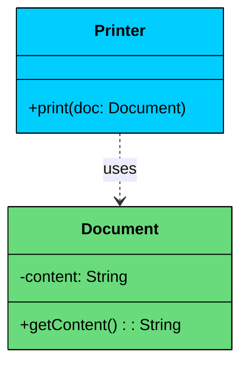
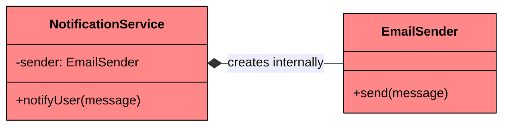
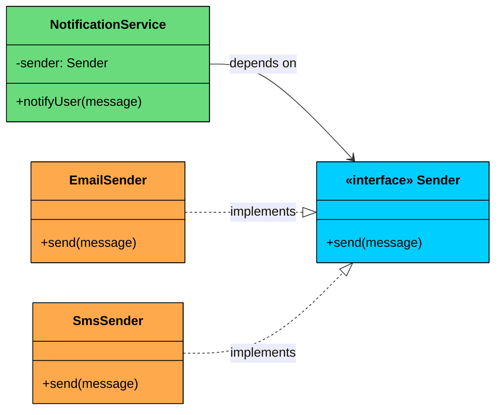
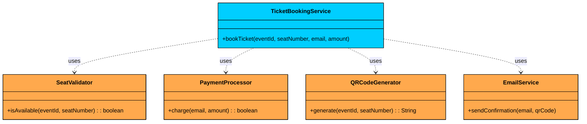

import React from 'react';
import CodeBlock from '../../../../components/ui/CodeBlock';
import Callout from '../../../../components/ui/Callout';

<div className="article-header">
  <div className="breadcrumb">
    <a href="/">Curated Notes</a>
    <span className="breadcrumb-separator">›</span>
    <span className="breadcrumb-current">Dependency</span>
  </div>
  <h1>Dependency</h1>
  <p style={{ color: 'var(--text-muted)', fontSize: '1.1rem', marginBottom: '16px', lineHeight: '1.6' }}>
    Master the essentials of Dependency in this curated guide.
  </p>
  <div className="meta-info">
    <span className="meta-item">
      <svg width="14" height="14" viewBox="0 0 24 24" fill="none" stroke="currentColor" strokeWidth="2"><circle cx="12" cy="12" r="10"/><polyline points="12 6 12 12 16 14"/></svg>
      10 min read
    </span>
    <span className="difficulty-badge difficulty-badge--intermediate">Intermediate</span>
  </div>
</div>

<section className="content-section">

What happens when a class needs to use another class for a brief moment to get a job done, without needing to hold onto it forever?

That’s **dependency**. It represents the weakest form of relationship between classes.

Unlike association, aggregation, or composition, a dependency isn’t a structural “we belong together” relationship. There’s no shared lifecycle and no long-term connection. 

Instead, it reflects a **one-time interaction**, often through method parameters, local variables, or return types.

---

## 1. What is Dependency?

A **Dependency** exists when **one class relies on another** to fulfill a responsibility, but does so **without retaining a permanent reference** to it.

This typically happens when:

- A class **accepts another class as a method parameter**.
- A class **instantiates or uses another class inside a method**.
- A class **returns an object of another class** from a method.

#### Key Characteristics of Dependency

- **Short-lived**: The relationship exists **only during method execution**.
- **No ownership**: The dependent class does **not store** the other as a field.
- **"Uses-a" relationship**: The class uses another to **accomplish a task**, but does not retain it.


&gt; **Real-World Analogy**
&gt;
&gt; Imagine a **Chef** preparing a meal.
&gt;
&gt; - The chef picks up a **Knife** to chop vegetables.
&gt; - Once the chopping is done, the knife is **put away or reused** elsewhere.
&gt; - The chef doesn’t necessarily **own** the knife or keep it stored long-term.
&gt;
&gt; This represents a **dependency**. The chef depends on the knife only during the cooking process.


---

## 2. UML Representation

In UML class diagrams, dependency is represented by a **dashed arrow** (`..>`) pointing from the dependent class to the class it depends on. This is the lightest notation in UML, reflecting the fact that dependency is the lightest relationship.





This diagram reads: "`Printer` depends on `Document`." The `Printer` uses a `Document` during its `print()` method, but doesn't store it as a field. The dashed arrow is the visual shorthand for this temporary relationship.

---

## 3. Code Example

Let's model a simple `Printer` that depends on a `Document` to print. The `Printer` receives the document as a method parameter, uses it, and doesn't store it.


```java
class Document {
    private String content;

    public Document(String content) {
        this.content = content;
    }

    public String getContent() {
        return content;
    }
}

class Printer {
    public void print(Document document) {
        System.out.println("Printing: " + document.getContent());
    }
}

public class Main {
    public static void main(String[] args) {
        Document doc = new Document("Hello, World!");
        Printer printer = new Printer();

        printer.print(doc);

        // After print() returns, the printer has no reference to the document.
        // The document can be garbage collected independently of the printer.
    }
}
```

```python
class Document:
    def __init__(self, content):
        self.content = content

    def get_content(self):
        return self.content
		
class Printer:
    def print(self, document):
        print("Printing:", document.get_content())
		
if __name__ == "__main__":
    doc = Document("Hello, World!")
    printer = Printer()

    printer.print(doc)

    # After print() returns, the printer has no reference to the document.
    # The document can be garbage collected independently of the printer.				
```

```cpp
class Document {
private:
    string content;
public:
    Document(const string& content) : content(content) {}

    string getContent() const {
        return content;
    }
};

class Printer {
public:
    void print(const Document& document) const {
        cout << "Printing: " << document.getContent() << endl;
    }
};

int main() {
    Document doc("Hello, World!");
    Printer printer;

    printer.print(doc);

    // After print() returns, the printer has no reference to the document.
    // Both objects have completely independent lifecycles.

    return 0;
}
```

```go
package main

import "fmt"

type Document struct {
	content string
}

func NewDocument(content string) *Document {
	return &Document{content: content}
}

func (d *Document) GetContent() string {
	return d.content
}

type Printer struct{}

func (p *Printer) Print(document *Document) {
	fmt.Println("Printing:", document.GetContent())
}

func main() {
	doc := NewDocument("Hello, World!")
	printer := &Printer{}

	printer.Print(doc)

	// After Print() returns, the printer has no reference to the document.
	// The document can be garbage collected independently of the printer.
}
```

```csharp
using System;

class Document
{
    private string content;

    public Document(string content)
    {
        this.content = content;
    }

    public string GetContent()
    {
        return content;
    }
}

class Printer
{
    public void Print(Document document)
    {
        Console.WriteLine("Printing: " + document.GetContent());
    }
}

public class Program
{
    public static void Main(string[] args)
    {
        Document doc = new Document("Hello, World!");
        Printer printer = new Printer();

        printer.Print(doc);

        // After Print() returns, the printer has no reference to the document.
        // The document can be garbage collected independently of the printer.
    }
}
```

```typescript
class Document {
    private content: string;

    constructor(content: string) {
        this.content = content;
    }

    getContent(): string {
        return this.content;
    }
}

class Printer {
    print(document: Document): void {
        console.log(`Printing: ${document.getContent()}`);
    }
}

function main(): void {
    const doc = new Document("Hello, World!");
    const printer = new Printer();

    printer.print(doc);

    // After print() returns, the printer has no reference to the document.
    // Both objects have completely independent lifecycles.
}

main();
```


Pay attention to what makes this a dependency and not an association:

- `Printer` has **no fields** referencing `Document`. The `Printer` class has zero instance variables pointing to `Document`. The document exists only as a parameter inside the `print()` method.
- The relationship is **scoped to one method call**. Once `print()` returns, the `Printer` object has no knowledge that a `Document` was ever involved.
- The `Document` is **created externally** and passed in. The `Printer` doesn't construct, own, or manage the document's lifecycle.

If the `Printer` stored a `Document` reference as a field (`private Document lastPrinted`), it would become an association. The structural link would persist beyond the method call.

The Printer/Document example is simple, but dependencies in real code take several different forms. Let's look at the most common ones so you can spot them in code reviews and interviews.

---

## 4. Recognizing Dependencies in Code

Dependencies can appear in several common forms within a class:

#### **As Method Parameters**

This is the most common and most recognizable form of dependency. The dependent class receives another class as a parameter, uses it during the method, and lets it go.


```java
class ReportGenerator {
    public String generate(DataSource source) {
        List<String> data = source.fetchAll();
        // Format data into report...
        return formattedReport;
    }
}
```

```python
class ReportGenerator:
    def generate(self, source):
        data = source.fetch_all()
        # Format data into report...
        return formatted_report
```

```cpp
class ReportGenerator {
public:
    string generate(DataSource& source) {
        auto data = source.fetchAll();
        // Format data into report...
        return formattedReport;
    }
};
```

```go
type ReportGenerator struct{}

func (r ReportGenerator) Generate(source DataSource) string {
	data := source.FetchAll()
	// Format data into report...
	return formattedReport
}
```

```csharp
class ReportGenerator
{
    public string Generate(DataSource source)
    {
        var data = source.FetchAll();
        // Format data into report...
        return formattedReport;
    }
}
```

```typescript
class ReportGenerator {
    generate(source: DataSource): string {
        const data = source.fetchAll();
        // Format data into report...
        return formattedReport;
    }
}
```


`ReportGenerator` depends on `DataSource`, but doesn't store it. The `DataSource` comes in, gets used, and is gone once `generate()` returns.

#### As Local Variables

Sometimes a class creates another class inside a method, uses it, and discards it. The created object never escapes the method scope.


```java
class OrderProcessor {
    public void process(Order order) {
        JsonFormatter formatter = new JsonFormatter();
        String json = formatter.format(order);
        // Send json to external API...
    }
}
```

```python
class OrderProcessor:
    def process(self, order):
        formatter = JsonFormatter()
        json = formatter.format(order)
        # Send json to external API...
```

```cpp
class OrderProcessor {
public:
    void process(Order& order) {
        JsonFormatter formatter;
        string json = formatter.format(order);
        // Send json to external API...
    }
};
```

```go
type OrderProcessor struct{}

func (p *OrderProcessor) Process(order Order) {
	formatter := JsonFormatter{}
	json := formatter.Format(order)
	// Send json to external API...
}
```

```csharp
class OrderProcessor
{
    public void Process(Order order)
    {
        var formatter = new JsonFormatter();
        string json = formatter.Format(order);
        // Send json to external API...
    }
}
```

```typescript
class OrderProcessor {
    process(order: Order): void {
        const formatter = new JsonFormatter();
        const json = formatter.format(order);
        // Send json to external API...
    }
}
```


`OrderProcessor` depends on `JsonFormatter`, but the formatter is a local variable. It's created inside the method and disappears when the method ends. No field, no structural link.

#### As Return Types

A method can return an object of another class, creating a dependency on that type even if the class doesn't store it.


```java
class UserFactory {
    public User createUser(String name, String email) {
        return new User(name, email);
    }
}
```

```python
class UserFactory:
    def create_user(self, name, email):
        return User(name, email)
```

```cpp
class UserFactory {
public:
    User createUser(const string& name, const string& email) {
        return User(name, email);
    }
};
```

```go
type UserFactory struct{}

func (f UserFactory) CreateUser(name, email string) User {
	return User(name, email)
}
```

```csharp
class UserFactory
{
    public User CreateUser(string name, string email)
    {
        return new User(name, email);
    }
}
```

```typescript
class UserFactory {
    createUser(name: string, email: string): User {
        return new User(name, email);
    }
}
```


`UserFactory` depends on `User` because it creates and returns `User` objects, but it doesn't store any `User` as a field. The factory's job is to produce users, not to hold onto them.

#### As Static Method Calls

A class can depend on another class by calling its static methods. There's no object reference at all, just a class-level dependency.


```java
class PasswordService {
    public boolean verify(String input, String hash) {
        return HashUtils.sha256(input).equals(hash);
    }
}
```

```python
class PasswordService:
    def verify(self, input_text, hash_value):
        return HashUtils.sha256(input_text) == hash_value
```

```cpp
class PasswordService {
public:
    bool verify(const string& input, const string& hash) {
        return HashUtils::sha256(input) == hash;
    }
};
```

```go
type PasswordService struct{}

func (p PasswordService) Verify(input string, hash string) bool {
	return HashUtils.Sha256(input) == hash
}
```

```csharp
class PasswordService
{
    public bool Verify(string input, string hash)
    {
        return HashUtils.Sha256(input) == hash;
    }
}
```

```typescript
class PasswordService {
    verify(input: string, hash: string): boolean {
        return HashUtils.sha256(input) === hash;
    }
}
```


`PasswordService` depends on `HashUtils`, but there's no instance of `HashUtils` stored anywhere. The dependency is purely at the class level through a static call.

---

## 5. Dependency Injection (DI)

In real-world applications, classes often depend on other classes to get their work done.

A **UserService** might rely on a **DatabaseClient** to fetch users, or a **NotificationService** might rely on an **EmailSender** to send messages.

But how should these dependencies be provided?

You could let the class **create** its own dependencies internally but that leads to **tight coupling**, making your code rigid and hard to test.

A better approach is to **inject** those dependencies from the outside.

This is called **Dependency Injection (DI),** one of the most powerful principles in modern software design.

**Dependency Injection** is a design technique where a class receives the objects it depends on, instead of creating them itself.

This leads to:

- **Better testability:** You can inject mock dependencies during unit tests.
- **Greater modularity:** Swap implementations (e.g., `EmailSender` → `SMSSender`) without changing core logic.
- **Loose coupling:** Classes only depend on abstract contracts (interfaces), not concrete implementations.

#### Example

Consider a `NotificationService` that sends email notifications. A straightforward implementation might create its own `EmailSender` internally:





```java
class NotificationService {
    private EmailSender sender;

    public NotificationService() {
        this.sender = new EmailSender(); // Creates its own dependency
    }

    public void notifyUser(String message) {
        sender.send(message);
    }
}
```

```python
class NotificationService:
    def __init__(self):
        self.sender = EmailSender()  # Creates its own dependency

    def notify_user(self, message):
        self.sender.send(message)
```

```cpp
class NotificationService {
private:
    EmailSender sender; // Creates its own dependency
public:
    NotificationService() : sender() {}

    void notifyUser(const string& message) {
        sender.send(message);
    }
};
```

```go
type NotificationService struct {
	sender EmailSender
}

func NewNotificationService() *NotificationService {
	return &NotificationService{sender: EmailSender{}} // Creates its own dependency
}

func (n *NotificationService) NotifyUser(message string) {
	n.sender.Send(message)
}
```

```csharp
class NotificationService
{
    private EmailSender sender;

    public NotificationService()
    {
        this.sender = new EmailSender(); // Creates its own dependency
    }

    public void NotifyUser(string message)
    {
        sender.Send(message);
    }
}
```

```typescript
class NotificationService {
    private sender: EmailSender;

    constructor() {
        this.sender = new EmailSender(); // Creates its own dependency
    }

    notifyUser(message: string): void {
        this.sender.send(message);
    }
}
```


This looks reasonable, but it has several problems:

- **Can't switch implementations.** Want to send SMS instead of email? You have to modify the `NotificationService` class itself.
- **Can't test in isolation.** Unit tests will actually send real emails (or fail trying) because there's no way to substitute a mock.
- **Violates the Open/Closed Principle.** Adding a new notification channel requires changing existing code rather than extending it.

The `NotificationService` is tightly coupled to `EmailSender`. It controls what sender it uses, and nobody from the outside can change that.

#### The Solution: Inject from Outside

Instead of letting the class create its own dependencies, you provide them from outside. This is Dependency Injection: a design technique where a class receives the objects it depends on rather than creating them itself.





```java
interface Sender {
    void send(String message);
}

class EmailSender implements Sender {
    public void send(String message) {
        System.out.println("Email: " + message);
    }
}

class SmsSender implements Sender {
    public void send(String message) {
        System.out.println("SMS: " + message);
    }
}

class NotificationService {
    private final Sender sender;

    public NotificationService(Sender sender) {
        this.sender = sender; // Injected from outside
    }

    public void notifyUser(String message) {
        sender.send(message);
    }
}
```

```python
from abc import ABC, abstractmethod

class Sender(ABC):
    @abstractmethod
    def send(self, message: str) -> None:
        pass

class EmailSender(Sender):
    def send(self, message: str) -> None:
        print(f"Email: {message}")

class SmsSender(Sender):
    def send(self, message: str) -> None:
        print(f"SMS: {message}")

class NotificationService:
    def __init__(self, sender: Sender):
        self.sender = sender  # Injected from outside

    def notify_user(self, message: str) -> None:
        self.sender.send(message)
```

```cpp
class Sender {
public:
    virtual void send(const string& message) = 0;
    virtual ~Sender() = default;
};

class EmailSender : public Sender {
public:
    void send(const string& message) override {
        cout << "Email: " << message << endl;
    }
};

class SmsSender : public Sender {
public:
    void send(const string& message) override {
        cout << "SMS: " << message << endl;
    }
};

class NotificationService {
private:
    Sender* sender;
public:
    NotificationService(Sender* sender) : sender(sender) {} // Injected

    void notifyUser(const string& message) {
        sender->send(message);
    }
};
```

```go
type Sender interface {
	Send(message string)
}

type EmailSender struct{}

func (EmailSender) Send(message string) {
	fmt.Println("Email: " + message)
}

type SmsSender struct{}

func (SmsSender) Send(message string) {
	fmt.Println("SMS: " + message)
}

type NotificationService struct {
	sender Sender
}

func NewNotificationService(sender Sender) *NotificationService {
	return &NotificationService{sender: sender} // Injected from outside
}

func (n *NotificationService) NotifyUser(message string) {
	n.sender.Send(message)
}
```

```csharp
interface ISender
{
    void Send(string message);
}

class EmailSender : ISender
{
    public void Send(string message)
    {
        Console.WriteLine("Email: " + message);
    }
}

class SmsSender : ISender
{
    public void Send(string message)
    {
        Console.WriteLine("SMS: " + message);
    }
}

class NotificationService
{
    private readonly ISender sender;

    public NotificationService(ISender sender)
    {
        this.sender = sender; // Injected from outside
    }

    public void NotifyUser(string message)
    {
        sender.Send(message);
    }
}
```

```typescript
interface Sender {
    send(message: string): void;
}

class EmailSender implements Sender {
    send(message: string): void {
        console.log(`Email: ${message}`);
    }
}

class SmsSender implements Sender {
    send(message: string): void {
        console.log(`SMS: ${message}`);
    }
}

class NotificationService {
    private readonly sender: Sender;

    constructor(sender: Sender) {
        this.sender = sender; // Injected from outside
    }

    notifyUser(message: string): void {
        this.sender.send(message);
    }
}
```


Now the `NotificationService` depends on a `Sender` interface, not a concrete `EmailSender`. The specific implementation is provided from outside through the constructor.

This gives you three concrete benefits:

- **Swappable implementations.** Pass `EmailSender` in production, `SmsSender` for mobile users, or `PushSender` for in-app notifications. No code changes needed inside `NotificationService`.
- **Easy testing.** Pass a `MockSender` in unit tests that records messages instead of actually sending them. You can verify what was sent without side effects.
- **Loose coupling.** `NotificationService` depends only on the `Sender` interface. It doesn't know or care how messages are actually delivered.

In real-world applications, frameworks like Spring (Java), ASP.NET (C#), and NestJS (TypeScript) handle DI for you. They automatically resolve and inject dependencies based on configuration or annotations, so you don't have to wire everything manually. But the underlying concept is the same: classes declare what they need, and something external provides it.

---

## 6. Practical Example: Event Ticketing System

Let's put dependency into practice with a realistic scenario. A `TicketBookingService` handles the complete flow of booking an event ticket. During the `bookTicket()` method, it needs to validate that seats are available, process a payment, generate a QR code for the ticket, and send a confirmation email. Each of these responsibilities belongs to a separate class, and the booking service depends on all four of them, but only during the booking method.





All four dashed arrows point outward from `TicketBookingService`. None of these classes are stored as fields. They're all received as method parameters, used during booking, and released.

#### Implementation


```java
class SeatValidator {
    public boolean isAvailable(String eventId, String seatNumber) {
        System.out.println("Checking seat " + seatNumber + " for event " + eventId);
        return true; // Simulated: seat is available
    }
}

class PaymentProcessor {
    public boolean charge(String email, double amount) {
        System.out.println("Charging $" + amount + " to " + email);
        return true; // Simulated: payment succeeds
    }
}

class QRCodeGenerator {
    public String generate(String eventId, String seatNumber) {
        String qrCode = "QR-" + eventId + "-" + seatNumber;
        System.out.println("Generated QR code: " + qrCode);
        return qrCode;
    }
}

class EmailService {
    public void sendConfirmation(String email, String qrCode) {
        System.out.println("Sending confirmation to " + email + " with code " + qrCode);
    }
}

class TicketBookingService {
    public boolean bookTicket(String eventId, String seatNumber, String email,
                              double amount, SeatValidator validator,
                              PaymentProcessor payment, QRCodeGenerator qrGenerator,
                              EmailService emailService) {
        if (!validator.isAvailable(eventId, seatNumber)) {
            System.out.println("Seat not available.");
            return false;
        }

        if (!payment.charge(email, amount)) {
            System.out.println("Payment failed.");
            return false;
        }

        String qrCode = qrGenerator.generate(eventId, seatNumber);
        emailService.sendConfirmation(email, qrCode);

        System.out.println("Booking confirmed!");
        return true;
    }
}

public class Main {
    public static void main(String[] args) {
        TicketBookingService bookingService = new TicketBookingService();

        // All dependencies are created externally and passed in
        SeatValidator validator = new SeatValidator();
        PaymentProcessor payment = new PaymentProcessor();
        QRCodeGenerator qrGenerator = new QRCodeGenerator();
        EmailService emailService = new EmailService();

        bookingService.bookTicket("CONF-2025", "A12", "alice@example.com",
            99.99, validator, payment, qrGenerator, emailService);
    }
}
```

```python
class SeatValidator:
    def is_available(self, event_id, seat_number):
        print(f"Checking seat {seat_number} for event {event_id}")
        return True  # Simulated: seat is available

class PaymentProcessor:
    def charge(self, email, amount):
        print(f"Charging ${amount} to {email}")
        return True  # Simulated: payment succeeds

class QRCodeGenerator:
    def generate(self, event_id, seat_number):
        qr_code = f"QR-{event_id}-{seat_number}"
        print(f"Generated QR code: {qr_code}")
        return qr_code

class EmailService:
    def send_confirmation(self, email, qr_code):
        print(f"Sending confirmation to {email} with code {qr_code}")

class TicketBookingService:
    def book_ticket(self, event_id, seat_number, email, amount,
                    validator, payment, qr_generator, email_service):
        if not validator.is_available(event_id, seat_number):
            print("Seat not available.")
            return False

        if not payment.charge(email, amount):
            print("Payment failed.")
            return False

        qr_code = qr_generator.generate(event_id, seat_number)
        email_service.send_confirmation(email, qr_code)

        print("Booking confirmed!")
        return True
		
if __name__ == "__main__":
    booking_service = TicketBookingService()

    # All dependencies are created externally and passed in
    validator = SeatValidator()
    payment = PaymentProcessor()
    qr_generator = QRCodeGenerator()
    email_service = EmailService()

    booking_service.book_ticket("CONF-2025", "A12", "alice@example.com",
        99.99, validator, payment, qr_generator, email_service)		
```

```cpp
#include <iostream>

using namespace std;

class SeatValidator {
public:
    bool isAvailable(const string& eventId, const string& seatNumber) {
        cout << "Checking seat " << seatNumber << " for event " << eventId << endl;
        return true; // Simulated: seat is available
    }
};

class PaymentProcessor {
public:
    bool charge(const string& email, double amount) {
        cout << "Charging $" << amount << " to " << email << endl;
        return true; // Simulated: payment succeeds
    }
};

class QRCodeGenerator {
public:
    string generate(const string& eventId, const string& seatNumber) {
        string qrCode = "QR-" + eventId + "-" + seatNumber;
        cout << "Generated QR code: " << qrCode << endl;
        return qrCode;
    }
};

class EmailService {
public:
    void sendConfirmation(const string& email, const string& qrCode) {
        cout << "Sending confirmation to " << email << " with code " << qrCode << endl;
    }
};

class TicketBookingService {
public:
    bool bookTicket(const string& eventId, const string& seatNumber,
                    const string& email, double amount,
                    SeatValidator& validator, PaymentProcessor& payment,
                    QRCodeGenerator& qrGenerator, EmailService& emailService) {
        if (!validator.isAvailable(eventId, seatNumber)) {
            cout << "Seat not available." << endl;
            return false;
        }

        if (!payment.charge(email, amount)) {
            cout << "Payment failed." << endl;
            return false;
        }

        string qrCode = qrGenerator.generate(eventId, seatNumber);
        emailService.sendConfirmation(email, qrCode);

        cout << "Booking confirmed!" << endl;
        return true;
    }
};

int main() {
    TicketBookingService bookingService;

    // All dependencies are created externally and passed in
    SeatValidator validator;
    PaymentProcessor payment;
    QRCodeGenerator qrGenerator;
    EmailService emailService;

    bookingService.bookTicket("CONF-2025", "A12", "alice@example.com",
        99.99, validator, payment, qrGenerator, emailService);

    return 0;
}
```

```go
package main

import "fmt"

type SeatValidator struct{}

func (s SeatValidator) isAvailable(eventId, seatNumber string) bool {
	fmt.Println("Checking seat " + seatNumber + " for event " + eventId)
	return true // Simulated: seat is available
}

type PaymentProcessor struct{}

func (p PaymentProcessor) charge(email string, amount float64) bool {
	fmt.Println("Charging $" + fmt.Sprint(amount) + " to " + email)
	return true // Simulated: payment succeeds
}

type QRCodeGenerator struct{}

func (q QRCodeGenerator) generate(eventId, seatNumber string) string {
	qrCode := "QR-" + eventId + "-" + seatNumber
	fmt.Println("Generated QR code: " + qrCode)
	return qrCode
}

type EmailService struct{}

func (e EmailService) sendConfirmation(email, qrCode string) {
	fmt.Println("Sending confirmation to " + email + " with code " + qrCode)
}

type TicketBookingService struct{}

func (t TicketBookingService) bookTicket(eventId, seatNumber, email string,
	amount float64, validator SeatValidator,
	payment PaymentProcessor, qrGenerator QRCodeGenerator,
	emailService EmailService) bool {
	if !validator.isAvailable(eventId, seatNumber) {
		fmt.Println("Seat not available.")
		return false
	}

	if !payment.charge(email, amount) {
		fmt.Println("Payment failed.")
		return false
	}

	qrCode := qrGenerator.generate(eventId, seatNumber)
	emailService.sendConfirmation(email, qrCode)

	fmt.Println("Booking confirmed!")
	return true
}

func main() {
	bookingService := TicketBookingService{}

	// All dependencies are created externally and passed in
	validator := SeatValidator{}
	payment := PaymentProcessor{}
	qrGenerator := QRCodeGenerator{}
	emailService := EmailService{}

	bookingService.bookTicket("CONF-2025", "A12", "alice@example.com",
		99.99, validator, payment, qrGenerator, emailService)
}
```

```csharp
using System;

class SeatValidator
{
    public bool IsAvailable(string eventId, string seatNumber)
    {
        Console.WriteLine($"Checking seat {seatNumber} for event {eventId}");
        return true; // Simulated: seat is available
    }
}

class PaymentProcessor
{
    public bool Charge(string email, double amount)
    {
        Console.WriteLine($"Charging ${amount} to {email}");
        return true; // Simulated: payment succeeds
    }
}

class QRCodeGenerator
{
    public string Generate(string eventId, string seatNumber)
    {
        string qrCode = $"QR-{eventId}-{seatNumber}";
        Console.WriteLine($"Generated QR code: {qrCode}");
        return qrCode;
    }
}

class EmailService
{
    public void SendConfirmation(string email, string qrCode)
    {
        Console.WriteLine($"Sending confirmation to {email} with code {qrCode}");
    }
}

class TicketBookingService
{
    public bool BookTicket(string eventId, string seatNumber, string email,
                           double amount, SeatValidator validator,
                           PaymentProcessor payment, QRCodeGenerator qrGenerator,
                           EmailService emailService)
    {
        if (!validator.IsAvailable(eventId, seatNumber))
        {
            Console.WriteLine("Seat not available.");
            return false;
        }

        if (!payment.Charge(email, amount))
        {
            Console.WriteLine("Payment failed.");
            return false;
        }

        string qrCode = qrGenerator.Generate(eventId, seatNumber);
        emailService.SendConfirmation(email, qrCode);

        Console.WriteLine("Booking confirmed!");
        return true;
    }
}

class Program
{
    static void Main()
    {
        var bookingService = new TicketBookingService();

        // All dependencies are created externally and passed in
        var validator = new SeatValidator();
        var payment = new PaymentProcessor();
        var qrGenerator = new QRCodeGenerator();
        var emailService = new EmailService();

        bookingService.BookTicket("CONF-2025", "A12", "alice@example.com",
            99.99, validator, payment, qrGenerator, emailService);
    }
}
```

```typescript
class SeatValidator {
    isAvailable(eventId: string, seatNumber: string): boolean {
        console.log(`Checking seat ${seatNumber} for event ${eventId}`);
        return true; // Simulated: seat is available
    }
}

class PaymentProcessor {
    charge(email: string, amount: number): boolean {
        console.log(`Charging $${amount} to ${email}`);
        return true; // Simulated: payment succeeds
    }
}

class QRCodeGenerator {
    generate(eventId: string, seatNumber: string): string {
        const qrCode = `QR-${eventId}-${seatNumber}`;
        console.log(`Generated QR code: ${qrCode}`);
        return qrCode;
    }
}

class EmailService {
    sendConfirmation(email: string, qrCode: string): void {
        console.log(`Sending confirmation to ${email} with code ${qrCode}`);
    }
}

class TicketBookingService {
    bookTicket(eventId: string, seatNumber: string, email: string,
               amount: number, validator: SeatValidator,
               payment: PaymentProcessor, qrGenerator: QRCodeGenerator,
               emailService: EmailService): boolean {
        if (!validator.isAvailable(eventId, seatNumber)) {
            console.log("Seat not available.");
            return false;
        }

        if (!payment.charge(email, amount)) {
            console.log("Payment failed.");
            return false;
        }

        const qrCode = qrGenerator.generate(eventId, seatNumber);
        emailService.sendConfirmation(email, qrCode);

        console.log("Booking confirmed!");
        return true;
    }
}

const bookingService = new TicketBookingService();

// All dependencies are created externally and passed in
const validator = new SeatValidator();
const payment = new PaymentProcessor();
const qrGenerator = new QRCodeGenerator();
const emailService = new EmailService();

bookingService.bookTicket("CONF-2025", "A12", "alice@example.com",
    99.99, validator, payment, qrGenerator, emailService);
```


#### Why This Design Works

- **All dependencies are method parameters.** `TicketBookingService` has zero fields. Every collaborator comes in through `bookTicket()` and disappears when the method returns. This is pure dependency with no structural coupling.
- **Each class has a single responsibility.** `SeatValidator` validates seats. `PaymentProcessor` handles payments. `QRCodeGenerator` generates codes. `EmailService` sends emails. The booking service just coordinates the flow.
- **Testing is straightforward.** You can pass mock implementations of any dependency without touching the booking service. Want to test what happens when payment fails? Pass a mock `PaymentProcessor` that returns `false`.
- **Swapping implementations is trivial.** Need to switch from email to SMS notifications? Pass an `SmsService` instead of `EmailService`. The booking service doesn't care, it just calls the method on whatever it receives.

</section>
