import React from 'react';
import CodeBlock from '../../../../components/ui/CodeBlock';
import Callout from '../../../../components/ui/Callout';

<div className="article-header">
  <div className="breadcrumb">
    <a href="/">Curated Notes</a>
    <span className="breadcrumb-separator">›</span>
    <span className="breadcrumb-current">Design Bloom Filter</span>
  </div>
  <h1>Design Bloom Filter</h1>
  <p style={{ color: 'var(--text-muted)', fontSize: '1.1rem', marginBottom: '16px', lineHeight: '1.6' }}>
    Master the essentials of Design Bloom Filter in this curated guide.
  </p>
  <div className="meta-info">
    <span className="meta-item">
      <svg width="14" height="14" viewBox="0 0 24 24" fill="none" stroke="currentColor" strokeWidth="2"><circle cx="12" cy="12" r="10"/><polyline points="12 6 12 12 16 14"/></svg>
      10 min read
    </span>
    <span className="difficulty-badge difficulty-badge--intermediate">Intermediate</span>
  </div>
</div>

<section className="content-section">


&gt; **QUESTION**
&gt;
&gt; #### What is Bloom Filter?
&gt;
&gt; A **Bloom Filter** is a **probabilistic data structure** used to test whether an element is a member of a set. It is designed to be **very fast** and **extremely space-efficient**, especially when working with large volumes of data where memory is constrained.
&gt;
&gt; 
&gt; 
&gt; 
&gt;
&gt; However, it comes with one trade-off:
&gt;
&gt; - It **may produce false positives** (saying an element is in the set when it actually isn’t).
&gt; - But it **never produces false negatives** (if it says an element is not present, it’s guaranteed to be absent).


In this chapter, we will explore the **low-level design of bloom filter** in detail.

Lets start by clarifying the requirements:

---

## 1. Clarifying Requirements

Before starting the design, it's important to ask thoughtful questions to uncover hidden assumptions, clarify ambiguities, and define the system's scope more precisely.

Here is an example of how a discussion between the candidate and the interviewer might unfold:


&gt; **DISCUSSION**
&gt;
&gt; **Candidate:** "What type of elements will the Bloom filter store? Are we working with strings, integers, or arbitrary objects?"
&gt;
&gt; **Interviewer:** "Let's keep it simple and work with strings. That covers most practical use cases like URLs, usernames, and email addresses."
&gt;
&gt; **Candidate:** "What operations should the Bloom Filter support? Just `add` and `mightContain`, or do we also need to support deletion"
&gt;
&gt; **Interviewer:** "Just `add` and `mightContain`. Deletion is not required in a standard Bloom Filter."
&gt;
&gt; **Candidate:** "What false positive rate is acceptable? Should the caller be able to configure this?"
&gt;
&gt; **Interviewer:** "Yes, the caller should be able to specify a desired false positive rate. A reasonable default would be 1%."
&gt;
&gt; **Candidate:** "Should the filter be thread-safe? Could multiple threads add elements or check membership concurrently?"
&gt;
&gt; **Interviewer:** " Yes, assume it will be used in a multi-threaded environment, like multiple request handlers checking a URL blacklist."
&gt;
&gt; **Candidate:** "Should we allow the caller to choose which hash function algorithm to use?"
&gt;
&gt; **Interviewer:** "That would be nice. Different use cases might benefit from different hash function characteristics."


Based on the discussion, here’s a summary of the functional requirements:

### 1.1 Functional Requirements

- Support `add(element)` operation: adds a string element to the filter
- Support `mightContain(element)` operation: returns `true` if the element might be in the set, `false` if it is definitely not
- Support `clear()` operation: resets the filter to its initial empty state
- The filter should compute optimal bit array size and number of hash functions from the caller's parameters
- The caller should be able to choose which hash function algorithm to use

### 1.2 Non-Functional Requirements

- **Time Complexity:** Both `add` and `mightContain` should run in O(k) time, where k is the number of hash functions
- **Space Efficiency:** The filter should use significantly less memory than storing all elements explicitly
- **Thread Safety:** The implementation must be thread-safe for concurrent `add` and `mightContain` operations
- **Configurability:** The caller should be able to specify expected elements, desired false positive rate, and hash strategy

Now that we understand what we're building, let's identify the building blocks of our system.

---

## 2. Identifying Core Entities

Unlike systems that model real-world concepts like users or bookings, a Bloom filter is a data structure design problem. The core challenge is about choosing the right internal components and computing optimal parameters to achieve the desired probabilistic guarantees.

#### 2.1 The Need for Space-Efficient Membership Testing

&gt; "The filter should use significantly less memory than storing all elements explicitly"

The simplest way to test set membership is a HashSet. It gives O(1) lookup and zero false positives. So why not just use one?

Because a HashSet stores every element. If you're tracking 10 million URLs for a safe browsing check, that's hundreds of megabytes of memory. 

A Bloom filter can answer the same question, "Is this URL in the blacklist?", using a fraction of the space. The trade-off is that it might occasionally say "yes" when the answer is actually "no" (a false positive), but it will never say "no" when the answer is "yes" (no false negatives).

#### 2.2 How Bit Arrays Enable Membership Testing

The foundation of a Bloom filter is a **bit array**: a fixed-size array where each position is either 0 or 1.

To add an element, we hash it to produce k different positions in the array and set those bits to 1. To check membership, we hash the element the same way and check if all k positions are 1. If any position is 0, the element was definitely never added. If all are 1, the element is probably in the set, but those bits might have been set by other elements.

#### 2.3 Why Multiple Hash Functions Reduce False Positives

With a single hash function, many different elements map to the same position. The collision rate is high, and false positives are frequent. By using k independent hash functions, each element maps to k different positions. For a false positive to occur, ALL k positions must have been set by other elements. The probability of this happening drops exponentially with k.


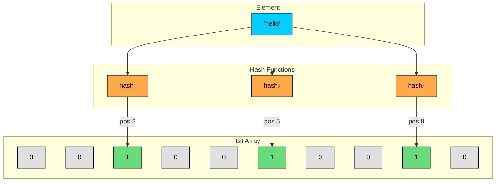


#### 2.4 Optimal Parameters

The math behind Bloom filters gives us formulas for the optimal bit array size (m) and number of hash functions (k):

- **Bit array size:** m = -(n * ln(p)) / (ln(2))^2
- **Number of hash functions:** k = (m / n) * ln(2)

Where n is the expected number of elements and p is the desired false positive probability.

For example, if we want to store 1,000,000 elements with a 1% false positive rate:

- m = -(1,000,000 * ln(0.01)) / (ln(2))^2 = approximately 9,585,059 bits (about 1.14 MB)
- k = (9,585,059 / 1,000,000) * ln(2) = approximately 7 hash functions

Compare that to a HashSet storing 1 million strings, which could easily consume 50-100 MB. The Bloom filter uses roughly 1% of the space.

#### 2.5 Entity Overview

Here's how these entities relate to each other:


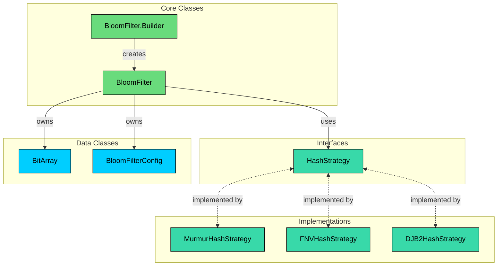


| Entity | Type | Responsibility |
|--------|------|----------------|
| `HashStrategy` | Interface | Defines the contract for hashing an element to a bit position |
| `MurmurHashStrategy` | Implementation | Murmur3-inspired hashing with good distribution |
| `FNVHashStrategy` | Implementation | FNV-1a hashing, simple and fast |
| `DJB2HashStrategy` | Implementation | DJB2 hashing, lightweight alternative |
| `BitArray` | Data Class | Wraps a fixed-size boolean array with set/get/clear operations |
| `BloomFilterConfig` | Data Class | Immutable configuration holding computed optimal parameters |
| `BloomFilter` | Core Class | Coordinates hash functions and bit array for probabilistic membership testing |
| `BloomFilter.Builder` | Builder | Constructs a BloomFilter with configurable parameters and sensible defaults |


These entities form the core abstractions of our Bloom filter. They separate concerns cleanly: hashing is pluggable, configuration is computed once and immutable, and the main class coordinates everything.


&gt; **NOTE**
&gt;
&gt; In an actual interview, you are not expected to know or implement specific hash algorithms like MurmurHash, FNV, or DJB2. These are included here for completeness. 
&gt;
&gt; In an interview, a simpler approach works just as well: use a basic polynomial hash function with different seeds (e.g., `hash = hash * seed + char` for each character).
&gt;
&gt; What matters is demonstrating that you understand the Strategy pattern, the role of seeds in producing independent hash functions, and how the hash output maps to a bit position. The specific algorithm is not what the interviewer is evaluating.


With our entities identified, let's define their attributes, behaviors, and relationships.

---

## 3. Designing Classes and Relationships

Now that we know what entities we need, let's flesh out their details. For each class, we'll define what data it holds (attributes) and what it can do (methods). Then we'll look at how these classes connect to each other.

### 3.1 Class Definitions

We'll work bottom-up: simple types first, then interfaces, then implementations, then the main class.

#### Interfaces

#### `HashStrategy`

We need a way to hash elements to bit positions. We could hardcode a single hash algorithm, but different scenarios benefit from different algorithms. A URL blacklist might prioritize speed, while a spell checker might prioritize distribution quality. An interface lets us swap algorithms without changing the BloomFilter class.

`HashStrategy` defines the contract for hashing an element to a position in the bit array.


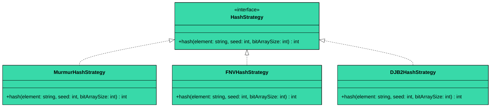


| Method | Description |
|--------|-------------|
| `hash(element, seed, bitArraySize)` | Computes a hash for the given element using the provided seed, and returns a position within `[0, bitArraySize)` |


The `seed` parameter is what gives us k independent hash values from a single algorithm. Instead of implementing k different hash functions, we call the same function k times with different seeds (0, 1, 2, ..., k-1). Each seed produces a different bit position for the same element.

#### Core Class

#### `BitArray`

The bit array is the storage backbone of the Bloom filter. We could use a raw boolean array directly in BloomFilter, but wrapping it in a dedicated class gives us a clean API for set/get/clear operations and keeps the BloomFilter class focused on coordination rather than low-level bit manipulation.

`BitArray` wraps a fixed-size array of bits with set, get, and clear operations.


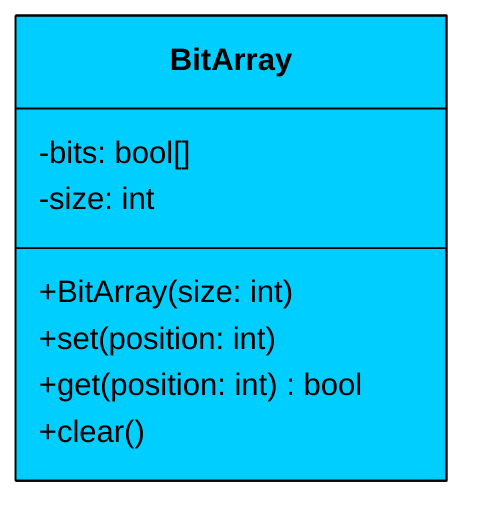


| Attribute | Type | Description | Mutable? |
|-----------|------|-------------|----------|
| `bits` | bool[] | The underlying bit storage | Yes (individual bits are set) |
| `size` | int | The number of bits in the array | No |


| Method | Description |
|--------|-------------|
| `BitArray(size)` | Creates a bit array of the given size, all bits initialized to false |
| `set(position)` | Sets the bit at the given position to true |
| `get(position)` | Returns whether the bit at the given position is true |
| `clear()` | Resets all bits to false |


#### `BloomFilterConfig`

Construction of a Bloom filter requires several related parameters, and some of them (bit array size, number of hash functions) are derived from others (expected elements, false positive rate). We need an object to hold these computed values so the BloomFilter can reference them without recomputing.

`BloomFilterConfig` is an immutable configuration object that holds both the caller's inputs and the computed optimal parameters.


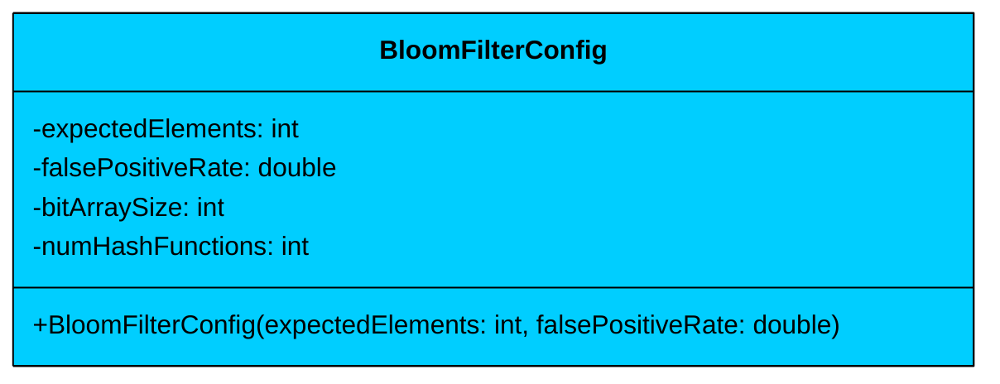


| Attribute | Type | Description | Mutable? |
|-----------|------|-------------|----------|
| `expectedElements` | int | The number of elements the filter is designed for | No |
| `falsePositiveRate` | double | The desired probability of false positives (e.g., 0.01 for 1%) | No |
| `bitArraySize` | int | Computed optimal bit array size (m) | No |
| `numHashFunctions` | int | Computed optimal number of hash functions (k) | No |


| Method | Description |
|--------|-------------|
| `BloomFilterConfig(expectedElements, falsePositiveRate)` | Computes and stores optimal m and k from the given parameters |


All fields are read-only. Once the config is created, it never changes. This makes it safe to share across threads without synchronization.

#### `BloomFilter`

This is the main class that ties everything together. It coordinates the hash strategy and bit array to provide the probabilistic membership testing API.

`BloomFilter` accepts string inputs, uses a configurable hash strategy to compute k bit positions, and manages the bit array.


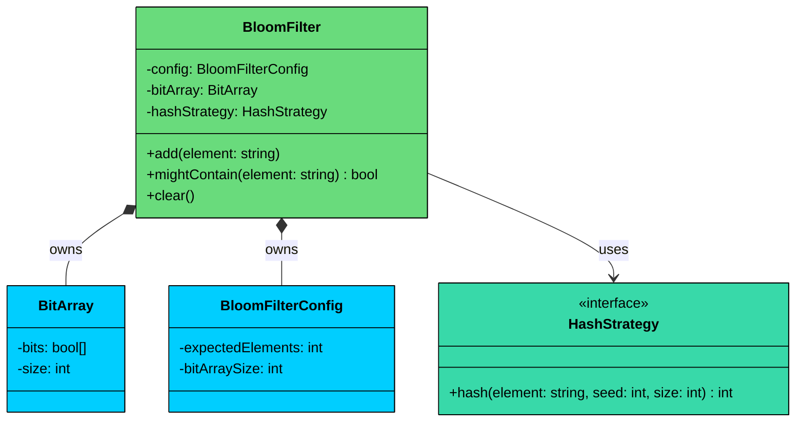


| Attribute | Type | Description | Mutable? |
|-----------|------|-------------|----------|
| `config` | BloomFilterConfig | Immutable configuration with optimal parameters | No |
| `bitArray` | BitArray | The bit storage for membership tracking | Yes (bits are set on add) |
| `hashStrategy` | HashStrategy | The pluggable hash function algorithm | No |


| Method | Description |
|--------|-------------|
| `add(element)` | Hashes the element k times and sets the corresponding bits |
| `mightContain(element)` | Hashes the element k times and returns true only if all bits are set |
| `clear()` | Resets the bit array to all zeros |


#### **Key Design Principles:**

1. **Single Responsibility:** BloomFilter coordinates operations but delegates hashing to HashStrategy and bit storage to BitArray.
2. **Encapsulation:** The internal bit array and hash computations are hidden. Callers only see `add`, `mightContain`, and `clear`.
3. **Thread Safety:** Both `add` and `mightContain` should be synchronized to prevent race conditions when multiple threads share a filter.

#### `BloomFilter.Builder`

The BloomFilter has several construction parameters: expected elements (required), false positive rate (has a sensible default of 0.01), and hash strategy (has a sensible default of Murmur hashing). Rather than a constructor with many parameters, a Builder lets the caller specify only what they care about and rely on defaults for the rest. It also computes the derived values (bit array size, number of hash functions) automatically.


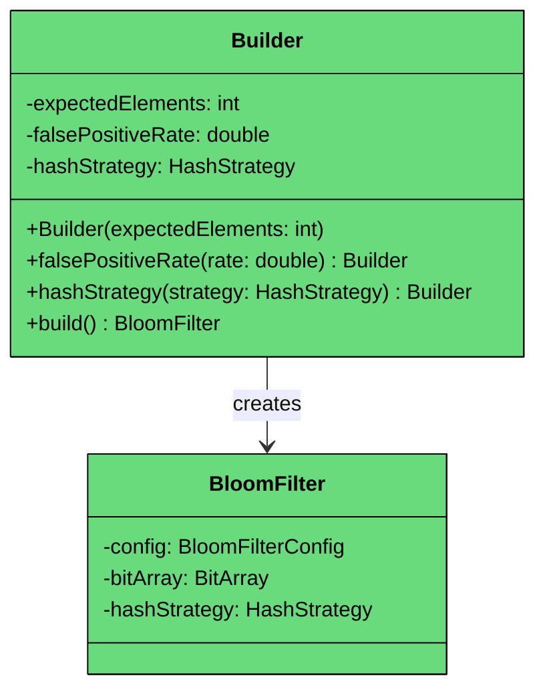


| Method | Description |
|--------|-------------|
| `Builder(expectedElements)` | Creates a builder with the required expected elements count |
| `falsePositiveRate(rate)` | Sets the desired false positive rate (default: 0.01) |
| `hashStrategy(strategy)` | Sets the hash function algorithm (default: MurmurHashStrategy) |
| `build()` | Validates parameters, computes optimal m and k, and constructs the BloomFilter |


---

### 3.2 Class Relationships

#### Composition (Strong Ownership)

- **BloomFilter owns BitArray:** The filter creates and manages the bit array's lifecycle. The bit array doesn't exist outside the filter.
- **BloomFilter owns BloomFilterConfig:** The config is created during construction and belongs entirely to the filter.

#### Association (Uses)

- **BloomFilter uses HashStrategy:** The filter calls the hash strategy but doesn't own it. The same strategy instance could theoretically be shared across multiple filters.

#### Creates

- **BloomFilter.Builder creates BloomFilter:** The builder computes optimal parameters and constructs a fully configured filter.

#### Implements

- **MurmurHashStrategy, FNVHashStrategy, DJB2HashStrategy implement HashStrategy:** Each provides a different hashing algorithm behind the same interface.

---

### 3.3 Key Design Patterns

This problem falls into the **data-structure-heavy** category. The core challenge is algorithmic (choosing the right data structure, computing optimal parameters), not behavioral (managing states, coordinating observers). So we keep patterns minimal: two patterns that genuinely earn their place.

#### [Strategy Pattern](/learn/lld/strategy) (Hash Strategy)

**The Problem:** Different hash algorithms offer different trade-offs between speed, distribution quality, and collision resistance. A URL blacklist checking millions of URLs per second might prioritize speed. A spell checker where false positives are more noticeable might prioritize distribution quality.

**The Solution:** The Strategy pattern lets us define a family of hash algorithms behind a common interface. The BloomFilter delegates hashing to whatever strategy it's given, without knowing which specific algorithm is being used.

Without it, we'd need to hardcode the hash algorithm or use if-else chains to select one. Every new algorithm would require modifying the BloomFilter class. With Strategy, we add new algorithms by creating new classes, following the Open/Closed Principle.


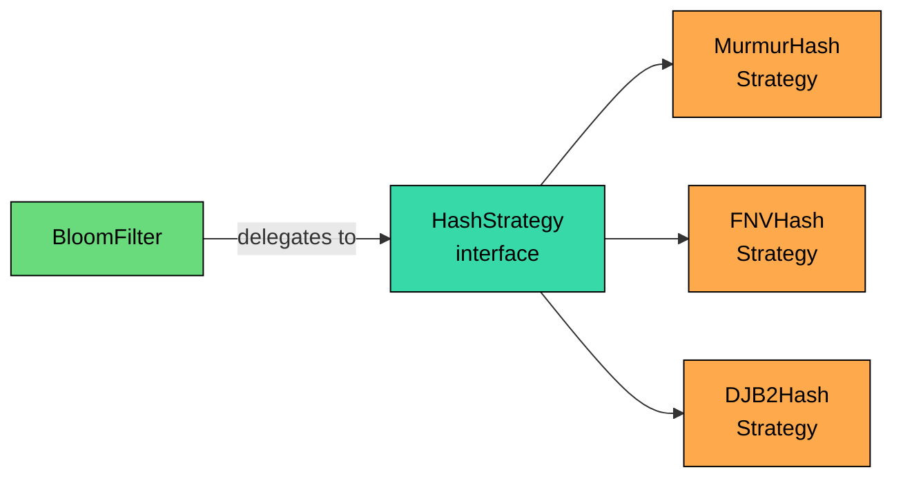


#### [Builder Pattern](/learn/lld/builder) (BloomFilter.Builder)

**The Problem:** Constructing a BloomFilter requires an expected element count (required), a false positive rate (optional, has default), and a hash strategy (optional, has default). On top of that, the bit array size and number of hash functions must be computed from these inputs. A constructor with all these parameters is confusing, and computing derived values inside a constructor violates single responsibility.

**The Solution:** The Builder pattern separates the construction logic. The caller sets only the parameters they care about, and the builder handles validation, default values, and derived parameter computation.

A telescoping constructor (multiple overloaded constructors) would work but scales poorly. With two optional parameters we'd need four constructors. The Builder makes intent clear: `new BloomFilter.Builder(1000000).falsePositiveRate(0.001).build()` is self-documenting.

---

### 3.4 Full Class Diagram


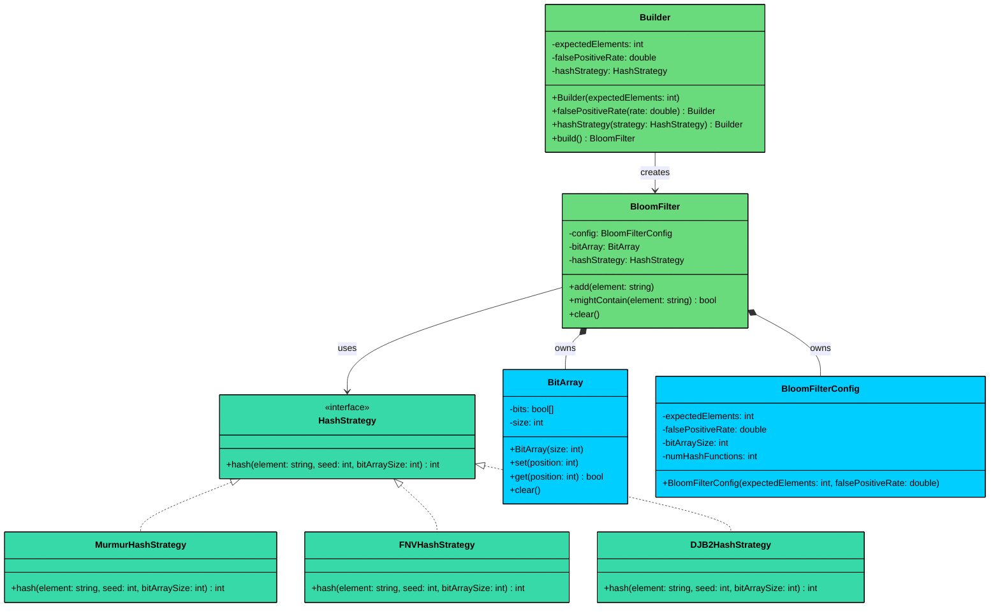


---

## 4. Code Implementation

Now let's translate our design into working code. We'll build bottom-up: foundational types first, then interfaces, then implementations, then the main class. This order matters because each layer depends on the ones below it.


#### Java

### 4.1 Hash Strategies

#### HashStrategy Interface

The interface defines a single method that takes an element, a seed, and the bit array size, and returns a valid position.


```java
interface HashStrategy {
    int hash(String element, int seed, int bitArraySize);
}
```


The seed parameter is what differentiates hash function 0 from hash function 1, 2, and so on. Each seed produces a different output for the same input element.

#### MurmurHashStrategy

MurmurHash3 is one of the most widely used non-cryptographic hash functions. It's fast, has excellent distribution, and is the default choice in production Bloom filter implementations like Google Guava.


```java
class MurmurHashStrategy implements HashStrategy {
    @Override
    public int hash(String element, int seed, int bitArraySize) {
        byte[] data = element.getBytes();
        int h = seed;

        for (byte b : data) {
            h ^= b;
            h *= 0x5bd1e995;
            h ^= (h >>> 13);
        }

        // Finalization mix
        h ^= (h >>> 16);
        h *= 0x85ebca6b;
        h ^= (h >>> 13);

        return Math.abs(h % bitArraySize);
    }
}
```


The multiply-xor-shift pattern creates an avalanche effect: small changes in the input produce dramatically different outputs. The finalization mix ensures the final bits are well-distributed.

#### FNVHashStrategy

FNV-1a (Fowler-Noll-Vo) is simpler than Murmur but still provides good distribution. It's popular in hash tables and network protocols.


```java
class FNVHashStrategy implements HashStrategy {
    private static final int FNV_OFFSET_BASIS = 0x811c9dc5;
    private static final int FNV_PRIME = 0x01000193;

    @Override
    public int hash(String element, int seed, int bitArraySize) {
        int hash = FNV_OFFSET_BASIS ^ seed;

        for (int i = 0; i < element.length(); i++) {
            hash ^= element.charAt(i);
            hash *= FNV_PRIME;
        }

        return Math.abs(hash % bitArraySize);
    }
}
```


FNV-1a XORs each byte before multiplying (unlike FNV-1 which multiplies first). This "xor-then-multiply" order produces better avalanche characteristics.

#### DJB2HashStrategy

DJB2 is one of the simplest effective hash functions. Created by Daniel J. Bernstein, it uses the magic constant 33 and is often the go-to choice for quick implementations.


```java
class DJB2HashStrategy implements HashStrategy {
    @Override
    public int hash(String element, int seed, int bitArraySize) {
        int hash = 5381 + seed;

        for (int i = 0; i < element.length(); i++) {
            hash = ((hash << 5) + hash) + element.charAt(i); // hash * 33 + c
        }

        return Math.abs(hash % bitArraySize);
    }
}
```


The expression `(hash << 5) + hash` is equivalent to `hash * 33`, using bit shifting for speed. The constant 5381 was chosen empirically for its good distribution properties.

### 4.2 BitArray

The BitArray wraps a boolean array and provides a clean API for bit manipulation. All the methods are straightforward, but having them in a dedicated class keeps the BloomFilter code clean.


```java
class BitArray {
    private final boolean[] bits;
    private final int size;

    public BitArray(int size) {
        this.bits = new boolean[size];
        this.size = size;
    }

    public void set(int position) {
        bits[position] = true;
    }

    public boolean get(int position) {
        return bits[position];
    }

    public void clear() {
        java.util.Arrays.fill(bits, false);
    }

    public int size() {
        return size;
    }
}
```


The `clear()` method uses `Arrays.fill` rather than iterating manually. Both achieve the same result, but `Arrays.fill` is a single method call that's optimized internally.

### 4.3 BloomFilterConfig

The config computes optimal parameters from the caller's inputs and stores them as read-only fields. This computation happens exactly once at construction time.


```java
class BloomFilterConfig {
    private final int expectedElements;
    private final double falsePositiveRate;
    private final int bitArraySize;
    private final int numHashFunctions;

    public BloomFilterConfig(int expectedElements, double falsePositiveRate) {
        this.expectedElements = expectedElements;
        this.falsePositiveRate = falsePositiveRate;

        // m = -(n * ln(p)) / (ln(2))^2
        this.bitArraySize = (int) Math.ceil(
            -(expectedElements * Math.log(falsePositiveRate)) / (Math.log(2) * Math.log(2))
        );

        // k = (m / n) * ln(2)
        this.numHashFunctions = Math.max(1, (int) Math.round(
            ((double) this.bitArraySize / expectedElements) * Math.log(2)
        ));
    }

    public int getExpectedElements() { return expectedElements; }
    public double getFalsePositiveRate() { return falsePositiveRate; }
    public int getBitArraySize() { return bitArraySize; }
    public int getNumHashFunctions() { return numHashFunctions; }
}
```


A few things to note:

- **Math.ceil for bit array size:** We round up to avoid underestimating, which would increase the actual false positive rate beyond what the caller requested.
- **Math.max(1, ...) for hash functions:** Even with extreme parameters, we always use at least one hash function. Zero hash functions would make the filter useless.
- **All fields are final:** The config is immutable, safe to share across threads without synchronization.

### 4.4 BloomFilter

This is the core class that coordinates everything. It delegates hashing to the strategy, stores bits in the array, and provides the public API.


```java
class BloomFilter {
    private final BloomFilterConfig config;
    private final BitArray bitArray;
    private final HashStrategy hashStrategy;

    private BloomFilter(BloomFilterConfig config, HashStrategy hashStrategy) {
        this.config = config;
        this.bitArray = new BitArray(config.getBitArraySize());
        this.hashStrategy = hashStrategy;
    }

    // Synchronized to ensure all k bits are set atomically
    public synchronized void add(String element) {
        if (element == null) {
            throw new IllegalArgumentException("Element cannot be null");
        }

        for (int i = 0; i < config.getNumHashFunctions(); i++) {
            int position = hashStrategy.hash(element, i, config.getBitArraySize());
            bitArray.set(position);
        }
    }

    // Synchronized to ensure consistent reads across all k positions
    public synchronized boolean mightContain(String element) {
        if (element == null) {
            throw new IllegalArgumentException("Element cannot be null");
        }

        for (int i = 0; i < config.getNumHashFunctions(); i++) {
            int position = hashStrategy.hash(element, i, config.getBitArraySize());
            if (!bitArray.get(position)) {
                return false;
            }
        }
        return true;
    }

    public synchronized void clear() {
        bitArray.clear();
    }

    public BloomFilterConfig getConfig() {
        return config;
    }

    // ---- Builder ----

    static class Builder {
        private final int expectedElements;
        private double falsePositiveRate = 0.01;
        private HashStrategy hashStrategy = new MurmurHashStrategy();

        public Builder(int expectedElements) {
            this.expectedElements = expectedElements;
        }

        public Builder falsePositiveRate(double rate) {
            this.falsePositiveRate = rate;
            return this;
        }

        public Builder hashStrategy(HashStrategy strategy) {
            this.hashStrategy = strategy;
            return this;
        }

        public BloomFilter build() {
            if (expectedElements <= 0) {
                throw new IllegalArgumentException("Expected elements must be positive");
            }
            if (falsePositiveRate <= 0 || falsePositiveRate >= 1) {
                throw new IllegalArgumentException(
                    "False positive rate must be between 0 and 1 (exclusive)");
            }

            BloomFilterConfig config = new BloomFilterConfig(expectedElements, falsePositiveRate);
            return new BloomFilter(config, hashStrategy);
        }
    }
}
```


Let's trace through the two core operations:

#### **add(element):**

1. Validate the element is not null
2. Loop k times (one per hash function), using the loop index as the seed
3. For each iteration, compute a bit position using the hash strategy
4. Set that bit to true in the bit array

#### **mightContain(element):**

1. Validate the element is not null
2. Loop k times with the same seeds used during add
3. For each iteration, compute the bit position and check if it's set
4. If ANY bit is not set, return false immediately (the element was definitely never added)
5. If ALL bits are set, return true (the element is probably in the set)

The early return in `mightContain` is an important optimization. As soon as we find one unset bit, we know the answer is "definitely not in the set" and can skip the remaining hash computations.

#### Operation Sequence Diagrams

The following diagrams illustrate what happens during add and mightContain operations:

#### **add(element)**


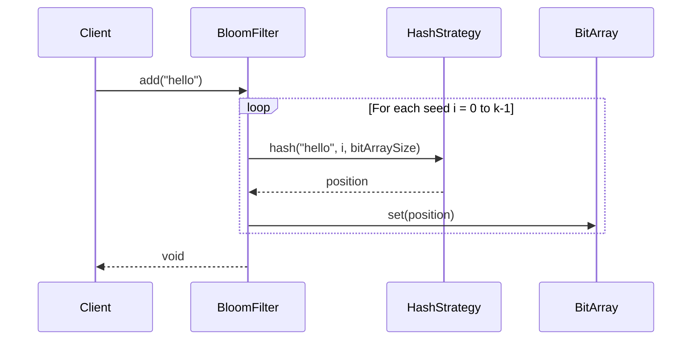


#### **mightContain(element) - Definite No**


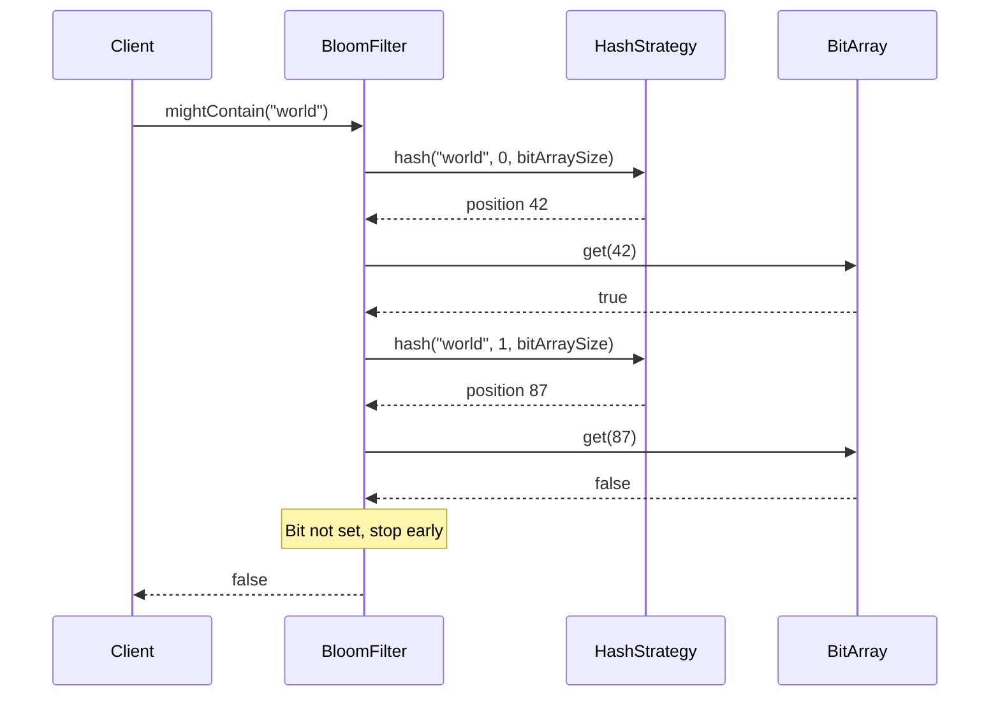


The first diagram shows the add flow: the filter iterates through all k seeds, computing a position for each and setting the corresponding bit. The second diagram shows a membership check where the second bit position is unset, causing an early return of false. This is the "definitely not in the set" guarantee.

### 4.6 Demo Code

Let's see the complete system in action.


```java
public class BloomFilterDemo {
    public static void main(String[] args) {
        System.out.println("=== Bloom Filter Demo ===\n");

        System.out.println("1. Creating Bloom filter (expected: 1000, FP rate: 1%)");
        BloomFilter filter = new BloomFilter.Builder(1000)
                .falsePositiveRate(0.01)
                .build();
        BloomFilterConfig config = filter.getConfig();
        System.out.println("   Bit array size: " + config.getBitArraySize());
        System.out.println("   Hash functions: " + config.getNumHashFunctions());
        System.out.println("   Using default MurmurHashStrategy");

        filter.add("apple");
        filter.add("banana");
        filter.add("cherry");
        System.out.println("   Added: apple, banana, cherry");

        System.out.println("\n2. Checking membership");
        System.out.println("   mightContain('apple')  = " + filter.mightContain("apple"));
        System.out.println("   mightContain('banana') = " + filter.mightContain("banana"));
        System.out.println("   mightContain('cherry') = " + filter.mightContain("cherry"));
        System.out.println("   mightContain('grape')  = " + filter.mightContain("grape"));
        System.out.println("   mightContain('mango')  = " + filter.mightContain("mango"));

        System.out.println("\n3. Creating filter with FNV hash strategy");
        BloomFilter fnvFilter = new BloomFilter.Builder(1000)
                .falsePositiveRate(0.01)
                .hashStrategy(new FNVHashStrategy())
                .build();

        fnvFilter.add("hello");
        fnvFilter.add("world");
        System.out.println("   Added: hello, world");
        System.out.println("   mightContain('hello') = " + fnvFilter.mightContain("hello"));
        System.out.println("   mightContain('world') = " + fnvFilter.mightContain("world"));
        System.out.println("   mightContain('foo')   = " + fnvFilter.mightContain("foo"));

        System.out.println("\n4. Testing clear()");
        filter.clear();
        System.out.println("   Cleared the filter");
        System.out.println("   mightContain('apple')  = " + filter.mightContain("apple"));
        System.out.println("   mightContain('banana') = " + filter.mightContain("banana"));

        System.out.println("\n5. False positive demonstration");
        BloomFilter smallFilter = new BloomFilter.Builder(10)
                .falsePositiveRate(0.1)
                .build();
        smallFilter.add("cat");
        smallFilter.add("dog");
        smallFilter.add("bird");
        System.out.println("   Small filter (expected: 10, FP rate: 10%)");
        System.out.println("   Added: cat, dog, bird");

        int falsePositives = 0;
        String[] testWords = {"fish", "lion", "bear", "wolf", "deer",
                              "frog", "hawk", "duck", "goat", "seal"};
        for (String word : testWords) {
            if (smallFilter.mightContain(word)) {
                falsePositives++;
                System.out.println("   False positive: '" + word + "'");
            }
        }
        System.out.println("   False positives: " + falsePositives + "/" + testWords.length);

        System.out.println("\n=== Demo Complete ===");
    }
}
```


---

## 5. Concurrency and Thread Safety

Bloom filters are commonly shared across threads. Think of a web server where multiple request-handling threads check a URL blacklist, or a database where multiple query threads check a Bloom filter before performing expensive disk lookups. These are real scenarios where concurrent access is expected.

#### Concern 1: Concurrent add() and mightContain()

In a web server checking a URL blacklist, one thread might be adding newly discovered malicious URLs while another thread is checking whether an incoming request's URL is in the blacklist.

**Setup:** Thread A adds "malicious.com" (which hashes to positions 3, 7, and 11). Thread B simultaneously checks "malicious.com".

#### **Without synchronization:**

1. Thread A: Calls `add("malicious.com")`, sets bit at position 3
2. Thread B: Calls `mightContain("malicious.com")`, checks position 3 - true
3. Thread B: Checks position 7 - false (Thread A hasn't set it yet)
4. Thread B: Returns `false`
5. Thread A: Sets bit at position 7
6. Thread A: Sets bit at position 11

**Result:** Thread B gets a false negative. "malicious.com" was being added to the filter, but the check returned false because only some of the k bits were set at the time of the check. In a safe browsing scenario, this means a known malicious URL slips through.

#### **With synchronization:**

Thread A acquires the lock, sets all three bits atomically, and releases the lock. Thread B then acquires the lock, checks all three bits (all true), and returns true. No false negatives from partial writes.


```java
// Both methods are synchronized on the same BloomFilter instance
public synchronized void add(String element) {
    for (int i = 0; i < config.getNumHashFunctions(); i++) {
        int position = hashStrategy.hash(element, i, config.getBitArraySize());
        bitArray.set(position);
    }
}

public synchronized boolean mightContain(String element) {
    for (int i = 0; i < config.getNumHashFunctions(); i++) {
        int position = hashStrategy.hash(element, i, config.getBitArraySize());
        if (!bitArray.get(position)) {
            return false;
        }
    }
    return true;
}
```

```python
## Both methods acquire the same lock on the BloomFilter instance
def add(self, element: str) -> None:
    with self._lock:
        for i in range(self._config.num_hash_functions):
            position = self._hash_strategy.hash(element, i, self._config.bit_array_size)
            self._bit_array.set(position)

def might_contain(self, element: str) -> bool:
    with self._lock:
        for i in range(self._config.num_hash_functions):
            position = self._hash_strategy.hash(element, i, self._config.bit_array_size)
            if not self._bit_array.get(position):
                return False
        return True
```

```cpp
// Both methods lock the same mutex on the BloomFilter instance
void add(const string& element) {
    lock_guard<mutex> lock(mtx);
    for (int i = 0; i < config.getNumHashFunctions(); i++) {
        int position = hashStrategy->hash(element, i, config.getBitArraySize());
        bitArray.set(position);
    }
}

bool mightContain(const string& element) {
    lock_guard<mutex> lock(mtx);
    for (int i = 0; i < config.getNumHashFunctions(); i++) {
        int position = hashStrategy->hash(element, i, config.getBitArraySize());
        if (!bitArray.get(position)) {
            return false;
        }
    }
    return true;
}
```

```csharp
// Both methods use lock(_lock) on the same BloomFilter instance
public void Add(string element)
{
    lock (_lock)
    {
        for (var i = 0; i < _config.NumHashFunctions; i++)
        {
            var position = _hashStrategy.Hash(element, i, _config.BitArraySize);
            _bitArray.Set(position);
        }
    }
}

public bool MightContain(string element)
{
    lock (_lock)
    {
        for (var i = 0; i < _config.NumHashFunctions; i++)
        {
            var position = _hashStrategy.Hash(element, i, _config.BitArraySize);
            if (!_bitArray.Get(position))
            {
                return false;
            }
        }
        return true;
    }
}
```

```go
// Add acquires a write lock, ensuring all k bits are set atomically
func (bf *BloomFilter) Add(element string) {
	bf.mu.Lock()
	defer bf.mu.Unlock()

	for i := 0; i < bf.config.NumHashFunctions(); i++ {
		position := bf.hashStrategy.Hash(element, i, bf.config.BitArraySize())
		bf.bitArray.Set(position)
	}
}

// MightContain acquires a read lock, ensuring consistent reads across all k positions
func (bf *BloomFilter) MightContain(element string) bool {
	bf.mu.RLock()
	defer bf.mu.RUnlock()

	for i := 0; i < bf.config.NumHashFunctions(); i++ {
		position := bf.hashStrategy.Hash(element, i, bf.config.BitArraySize())
		if !bf.bitArray.Get(position) {
			return false
		}
	}
	return true
}
```

```typescript
// Our implementation is synchronous, so this concern doesn't apply.
// All k bits are set in a single, uninterrupted loop iteration.
add(element: string): void {
  for (let i = 0; i < this.config.numHashFunctions; i++) {
    const position = this.hashStrategy.hash(element, i, this.config.bitArraySize);
    this.bitArray.set(position);
  }
}

mightContain(element: string): boolean {
  for (let i = 0; i < this.config.numHashFunctions; i++) {
    const position = this.hashStrategy.hash(element, i, this.config.bitArraySize);
    if (!this.bitArray.get(position)) {
      return false;
    }
  }
  return true;
}
```


---

## 6. Quiz

</section>
